# API Reference

<cite>
**Referenced Files in This Document**
- [declarations.py](file://src/sage/runtime/flownet/api/declarations.py)
- [decorators.py](file://src/sage/runtime/flownet/api/decorators.py)
- [flow_exception_handlers.py](file://src/sage/runtime/flownet/api/flow_exception_handlers.py)
- [runtime_state_query_contract.py](file://src/sage/runtime/flownet/contracts/runtime_state_query_contract.py)
- [endpoint_plane_contract.py](file://src/sage/runtime/flownet/contracts/endpoint_plane_contract.py)
- [flow_program_submit_contract.py](file://src/sage/runtime/flownet/contracts/flow_program_submit_contract.py)
- [shared_state_contract.py](file://src/sage/runtime/flownet/contracts/shared_state_contract.py)
- [runtime_client.py](file://src/sage/runtime/flownet/client/runtime_client.py)
- [session.py](file://src/sage/runtime/flownet/client/session.py)
- [runtime.py](file://src/sage/runtime/flownet/runtime/runtime.py)
- [engine.py](file://src/sage/runtime/flownet/runtime/flowengine/engine.py)
</cite>

## Table of Contents
1. [Introduction](#introduction)
2. [Project Structure](#project-structure)
3. [Core Components](#core-components)
4. [Architecture Overview](#architecture-overview)
5. [Detailed Component Analysis](#detailed-component-analysis)
6. [Dependency Analysis](#dependency-analysis)
7. [Performance Considerations](#performance-considerations)
8. [Troubleshooting Guide](#troubleshooting-guide)
9. [Conclusion](#conclusion)
10. [Appendices](#appendices)

## Introduction
This document provides API documentation for SAGE’s FlowNet runtime API system. It covers the HTTP-like runtime control plane and client surfaces exposed to applications and operators. The focus areas include:
- Flow program lifecycle and endpoint publishing
- Runtime state queries and shared state management
- Contract-based input validation and normalization
- Client surfaces for submitting flows, managing endpoints, and observing runtime telemetry
- Error handling, governance, and recovery contracts
- Versioning and deprecation guidance

The FlowNet runtime exposes a Python client API surface for building, deploying, and operating flows. While the underlying transport and control plane may use internal protocols, the public interfaces documented here are the canonical APIs for clients.

## Project Structure
The FlowNet API system is organized around:
- API declarations and decorators that define flow, source, service, actor, and process components
- Contracts that define request/response schemas and validation rules
- A client runtime that provides a high-level surface for lifecycle operations
- A runtime host that orchestrates execution, governance, and observability

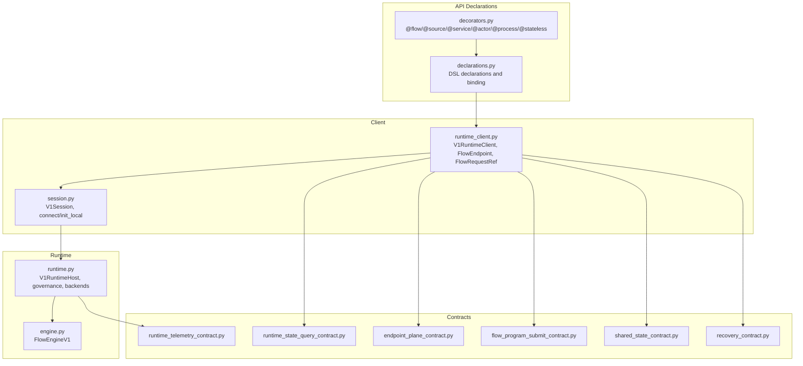

**Diagram sources**
- [declarations.py:1-1590](file://src/sage/runtime/flownet/api/declarations.py#L1-L1590)
- [decorators.py:1-442](file://src/sage/runtime/flownet/api/decorators.py#L1-L442)
- [runtime_state_query_contract.py:1-55](file://src/sage/runtime/flownet/contracts/runtime_state_query_contract.py#L1-L55)
- [endpoint_plane_contract.py:1-163](file://src/sage/runtime/flownet/contracts/endpoint_plane_contract.py#L1-L163)
- [flow_program_submit_contract.py:1-339](file://src/sage/runtime/flownet/contracts/flow_program_submit_contract.py#L1-L339)
- [shared_state_contract.py:1-316](file://src/sage/runtime/flownet/contracts/shared_state_contract.py#L1-L316)
- [runtime_client.py:1-800](file://src/sage/runtime/flownet/client/runtime_client.py#L1-L800)
- [session.py:1-790](file://src/sage/runtime/flownet/client/session.py#L1-L790)
- [runtime.py:1-800](file://src/sage/runtime/flownet/runtime/runtime.py#L1-L800)
- [engine.py:1-159](file://src/sage/runtime/flownet/runtime/flowengine/engine.py#L1-L159)

**Section sources**
- [declarations.py:1-1590](file://src/sage/runtime/flownet/api/declarations.py#L1-L1590)
- [decorators.py:1-442](file://src/sage/runtime/flownet/api/decorators.py#L1-L442)
- [runtime_client.py:1-800](file://src/sage/runtime/flownet/client/runtime_client.py#L1-L800)
- [session.py:1-790](file://src/sage/runtime/flownet/client/session.py#L1-L790)
- [runtime.py:1-800](file://src/sage/runtime/flownet/runtime/runtime.py#L1-L800)

## Core Components
- API declarations and decorators: Define flow, source, service, actor, process, and stateless components with metadata, policies, and resource defaults.
- Contracts: Enforce validation and normalization for runtime state queries, endpoint descriptors, flow program submissions, shared state, and telemetry.
- Client runtime: Provides V1RuntimeClient with surfaces for sources/services/flows/actors/stateless/producers/processes and shared state management.
- Session: Encapsulates connection and runtime host lifecycle, exposing submit and inspection operations.
- Runtime host: Orchestrates execution, governance, backends, and telemetry.

Key responsibilities:
- Declarative DSL: Build flow programs and component declarations with rich metadata.
- Validation: Contract-based normalization and validation for inputs and outputs.
- Lifecycle: Start, stop, restart, and query instances; publish endpoints; manage shared state.
- Observability: Telemetry normalization and governance summaries.

**Section sources**
- [declarations.py:1-1590](file://src/sage/runtime/flownet/api/declarations.py#L1-L1590)
- [decorators.py:1-442](file://src/sage/runtime/flownet/api/decorators.py#L1-L442)
- [runtime_client.py:1-800](file://src/sage/runtime/flownet/client/runtime_client.py#L1-L800)
- [session.py:1-790](file://src/sage/runtime/flownet/client/session.py#L1-L790)
- [runtime.py:1-800](file://src/sage/runtime/flownet/runtime/runtime.py#L1-L800)

## Architecture Overview
The FlowNet runtime API follows a layered architecture:
- Application layer defines flows and components via decorators and declarations.
- Client layer translates high-level operations into runtime requests and manages endpoint lifecycles.
- Runtime host coordinates execution, governance, and backend scheduling.
- Contracts ensure consistent request/response shapes across the stack.

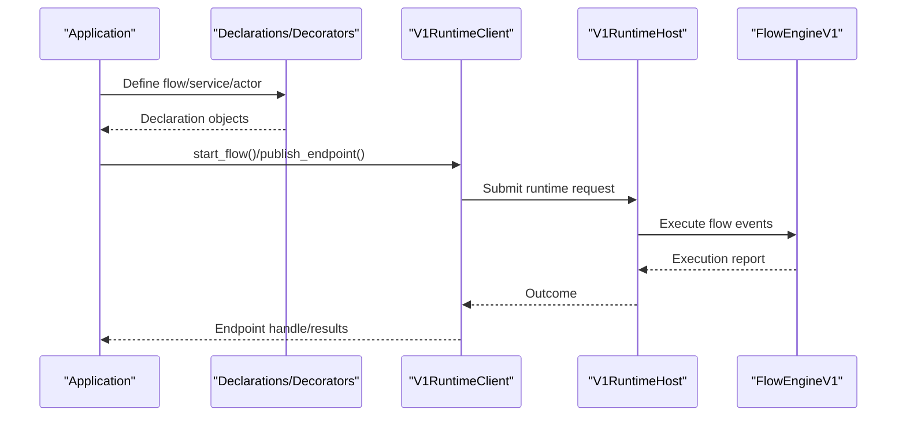

**Diagram sources**
- [declarations.py:1-1590](file://src/sage/runtime/flownet/api/declarations.py#L1-L1590)
- [decorators.py:1-442](file://src/sage/runtime/flownet/api/decorators.py#L1-L442)
- [runtime_client.py:1-800](file://src/sage/runtime/flownet/client/runtime_client.py#L1-L800)
- [runtime.py:1-800](file://src/sage/runtime/flownet/runtime/runtime.py#L1-L800)
- [engine.py:1-159](file://src/sage/runtime/flownet/runtime/flowengine/engine.py#L1-L159)

## Detailed Component Analysis

### API Declarations and Decorators
- Declarations: Immutable templates carrying metadata, policies, and defaults for flows, sources, services, actors, processes, and stateless components.
- Decorators: Validate signatures and produce typed declarations for runtime compilation and deployment.

Key behaviors:
- Validation of DSL signatures and parameter constraints.
- Normalization of URIs, tags, capabilities, and metadata.
- Binding of IO topics and runtime options for flows and services.

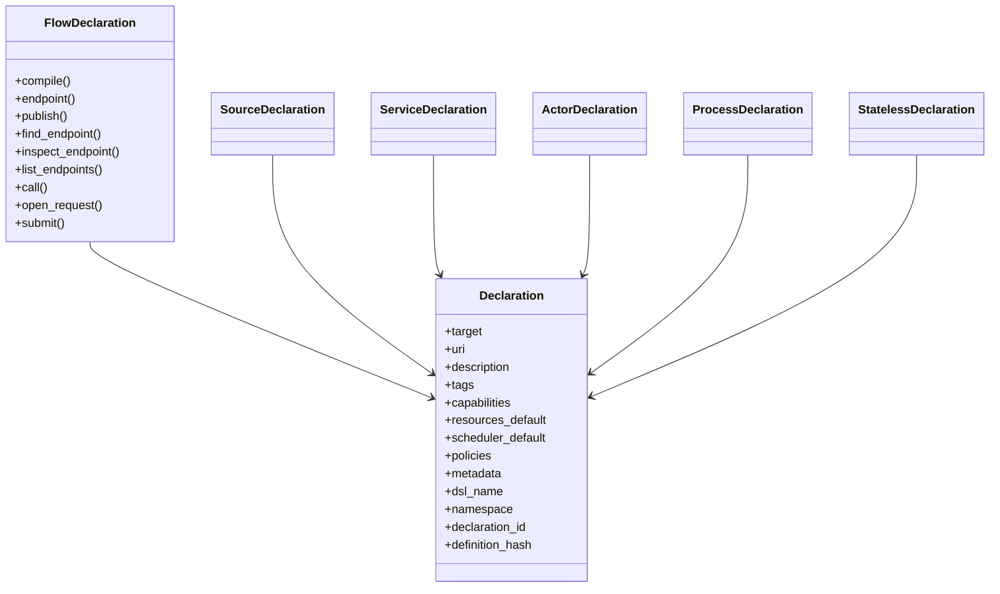

**Diagram sources**
- [declarations.py:1-1590](file://src/sage/runtime/flownet/api/declarations.py#L1-L1590)

**Section sources**
- [declarations.py:1-1590](file://src/sage/runtime/flownet/api/declarations.py#L1-L1590)
- [decorators.py:1-442](file://src/sage/runtime/flownet/api/decorators.py#L1-L442)

### Flow Program Submission Contracts
- Validates IO contracts, bindings, ingress/egress connectors, and run configuration.
- Produces normalized inputs for runtime submission.

Validation highlights:
- Binding schema enforcement (required/allowed keys).
- Connector kind compatibility checks.
- Type and mapping validations with structured error codes.

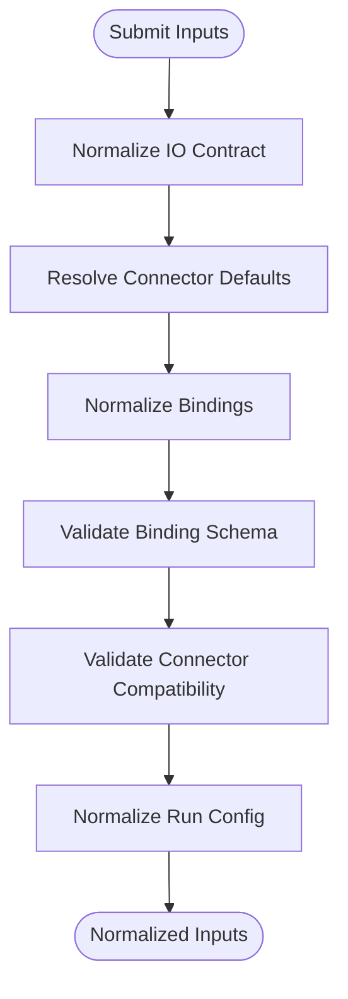

**Diagram sources**
- [flow_program_submit_contract.py:1-339](file://src/sage/runtime/flownet/contracts/flow_program_submit_contract.py#L1-L339)

**Section sources**
- [flow_program_submit_contract.py:1-339](file://src/sage/runtime/flownet/contracts/flow_program_submit_contract.py#L1-L339)

### Endpoint Plane Contracts
- Defines endpoint descriptors and normalization rules for published/released endpoints.
- Ensures consistent metadata, status, and binding information.

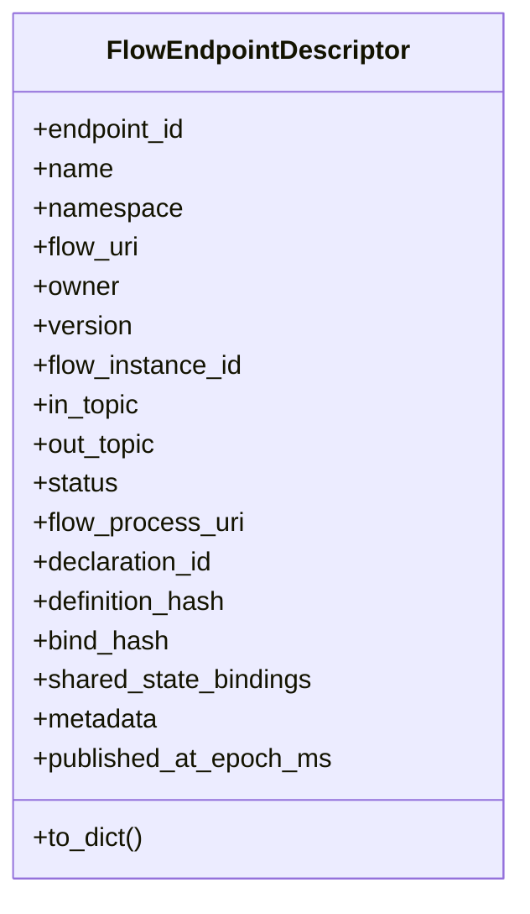

**Diagram sources**
- [endpoint_plane_contract.py:1-163](file://src/sage/runtime/flownet/contracts/endpoint_plane_contract.py#L1-L163)

**Section sources**
- [endpoint_plane_contract.py:1-163](file://src/sage/runtime/flownet/contracts/endpoint_plane_contract.py#L1-L163)

### Runtime State Query Contracts
- Builds and normalizes runtime state query requests and responses.
- Supports pagination, filtering, and value visibility controls.

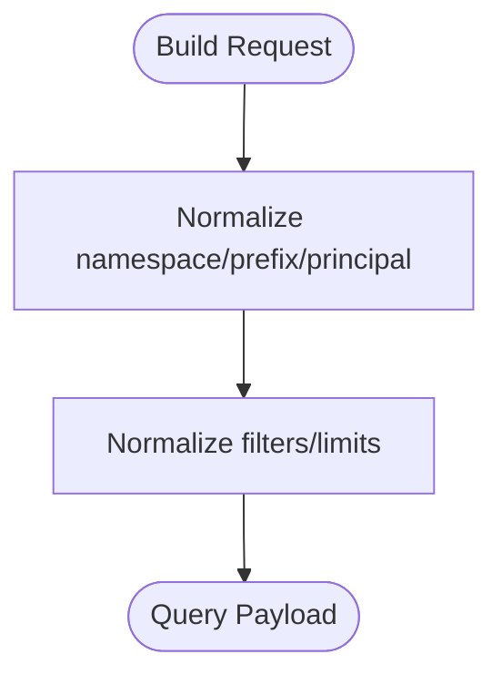

**Diagram sources**
- [runtime_state_query_contract.py:1-55](file://src/sage/runtime/flownet/contracts/runtime_state_query_contract.py#L1-L55)

**Section sources**
- [runtime_state_query_contract.py:1-55](file://src/sage/runtime/flownet/contracts/runtime_state_query_contract.py#L1-L55)

### Shared State Contracts
- Describes shared state services, binding specs, and recovery policies.
- Provides normalization and canonicalization for contract IDs.

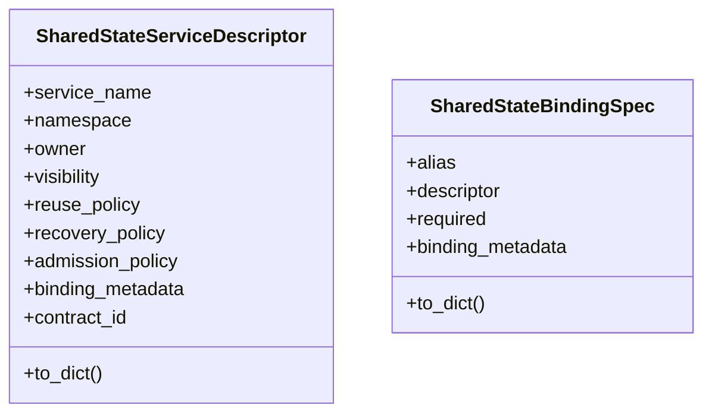

**Diagram sources**
- [shared_state_contract.py:1-316](file://src/sage/runtime/flownet/contracts/shared_state_contract.py#L1-L316)

**Section sources**
- [shared_state_contract.py:1-316](file://src/sage/runtime/flownet/contracts/shared_state_contract.py#L1-L316)

### Runtime Client and Session
- V1RuntimeClient: Provides surfaces for sources, services, flows, actors, stateless, producers, processes, and shared state.
- V1Session: Manages connection, runtime host lifecycle, and inspection operations.

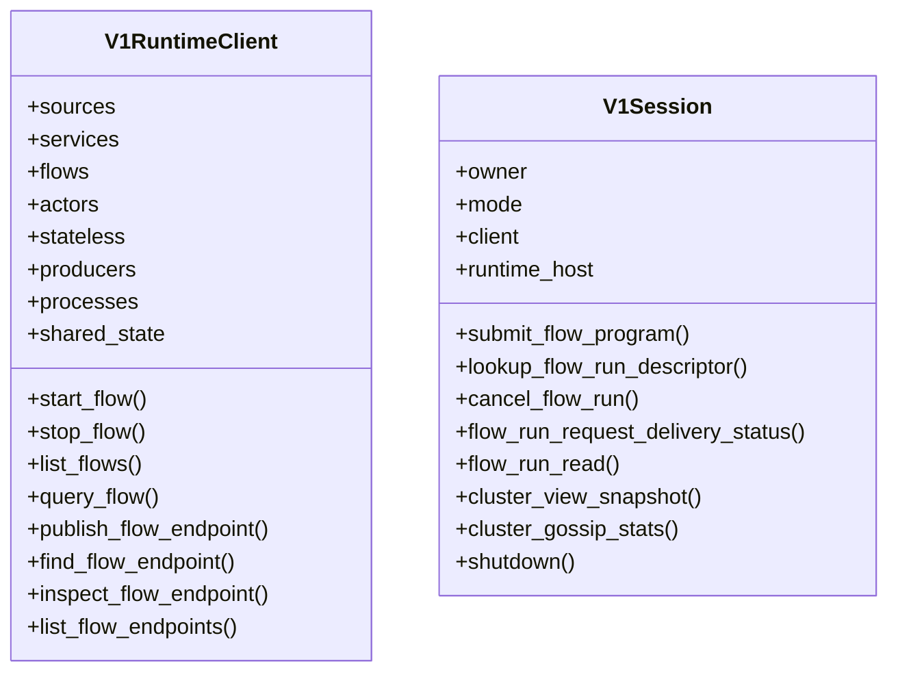

**Diagram sources**
- [runtime_client.py:1-800](file://src/sage/runtime/flownet/client/runtime_client.py#L1-L800)
- [session.py:1-790](file://src/sage/runtime/flownet/client/session.py#L1-L790)

**Section sources**
- [runtime_client.py:1-800](file://src/sage/runtime/flownet/client/runtime_client.py#L1-L800)
- [session.py:1-790](file://src/sage/runtime/flownet/client/session.py#L1-L790)

### Runtime Host and Flow Engine
- V1RuntimeHost: Composes actor/topic APIs, governance, backends, and endpoint/shared-state registries.
- FlowEngineV1: Executes flow events and normalizes outputs and reports.

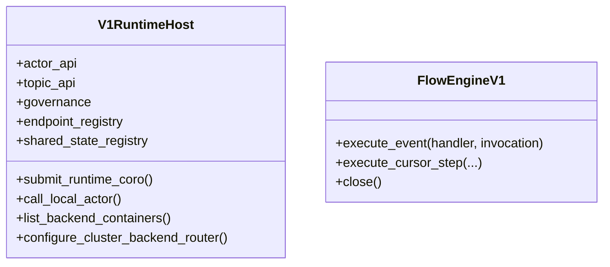

**Diagram sources**
- [runtime.py:1-800](file://src/sage/runtime/flownet/runtime/runtime.py#L1-L800)
- [engine.py:1-159](file://src/sage/runtime/flownet/runtime/flowengine/engine.py#L1-L159)

**Section sources**
- [runtime.py:1-800](file://src/sage/runtime/flownet/runtime/runtime.py#L1-L800)
- [engine.py:1-159](file://src/sage/runtime/flownet/runtime/flowengine/engine.py#L1-L159)

### Exception Handlers and Governance
- Exception handling: Exposes exception handler decorators for flow and actor scopes.
- Governance: Admission control, quotas, and runtime policy evaluation.

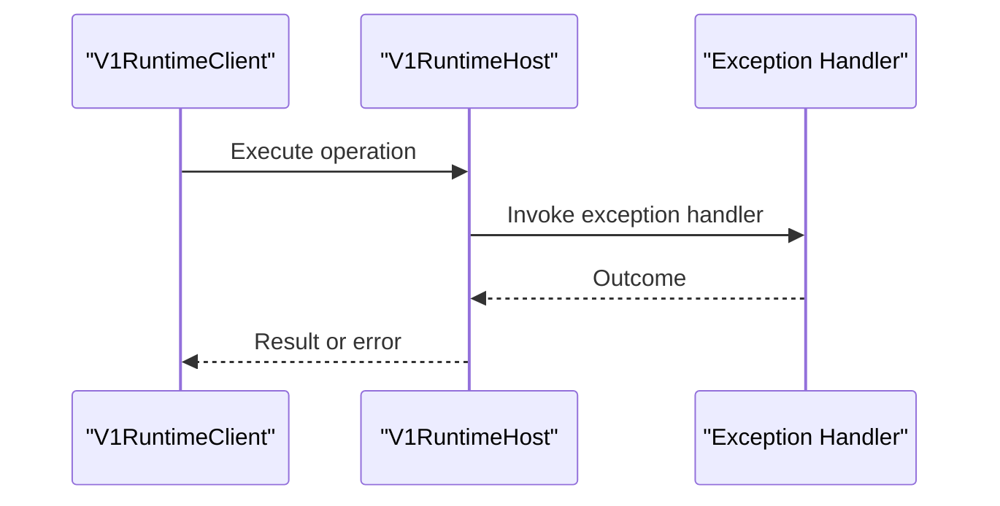

**Diagram sources**
- [flow_exception_handlers.py:1-9](file://src/sage/runtime/flownet/api/flow_exception_handlers.py#L1-L9)
- [runtime.py:1-800](file://src/sage/runtime/flownet/runtime/runtime.py#L1-L800)

**Section sources**
- [flow_exception_handlers.py:1-9](file://src/sage/runtime/flownet/api/flow_exception_handlers.py#L1-L9)
- [runtime.py:1-800](file://src/sage/runtime/flownet/runtime/runtime.py#L1-L800)

## Dependency Analysis
- Declarations depend on contracts for shared state binding metadata.
- Client runtime depends on contracts for endpoint, state query, and shared state schemas.
- Runtime host integrates governance, backends, and telemetry contracts.
- Session depends on bootstrap and runtime host to establish connections.

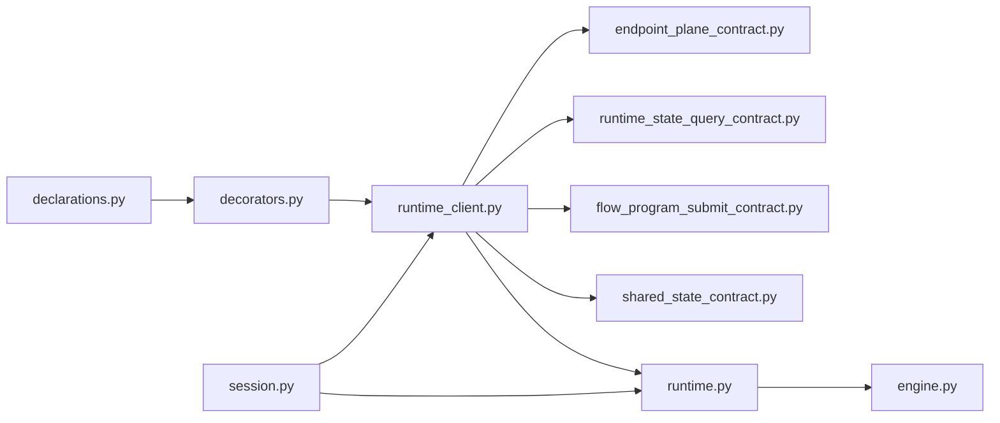

**Diagram sources**
- [declarations.py:1-1590](file://src/sage/runtime/flownet/api/declarations.py#L1-L1590)
- [decorators.py:1-442](file://src/sage/runtime/flownet/api/decorators.py#L1-L442)
- [runtime_client.py:1-800](file://src/sage/runtime/flownet/client/runtime_client.py#L1-L800)
- [endpoint_plane_contract.py:1-163](file://src/sage/runtime/flownet/contracts/endpoint_plane_contract.py#L1-L163)
- [runtime_state_query_contract.py:1-55](file://src/sage/runtime/flownet/contracts/runtime_state_query_contract.py#L1-L55)
- [flow_program_submit_contract.py:1-339](file://src/sage/runtime/flownet/contracts/flow_program_submit_contract.py#L1-L339)
- [shared_state_contract.py:1-316](file://src/sage/runtime/flownet/contracts/shared_state_contract.py#L1-L316)
- [runtime.py:1-800](file://src/sage/runtime/flownet/runtime/runtime.py#L1-L800)
- [engine.py:1-159](file://src/sage/runtime/flownet/runtime/flowengine/engine.py#L1-L159)
- [session.py:1-790](file://src/sage/runtime/flownet/client/session.py#L1-L790)

**Section sources**
- [declarations.py:1-1590](file://src/sage/runtime/flownet/api/declarations.py#L1-L1590)
- [runtime_client.py:1-800](file://src/sage/runtime/flownet/client/runtime_client.py#L1-L800)
- [runtime.py:1-800](file://src/sage/runtime/flownet/runtime/runtime.py#L1-L800)
- [session.py:1-790](file://src/sage/runtime/flownet/client/session.py#L1-L790)

## Performance Considerations
- Use appropriate connector kinds and defaults to minimize compatibility checks.
- Leverage shared state bindings to reduce duplication and improve locality.
- Tune governance and admission policies to balance throughput and safety.
- Monitor runtime telemetry to identify bottlenecks and spillover decisions.
- Prefer batched reads/writes via endpoint request streaming for high-throughput scenarios.

[No sources needed since this section provides general guidance]

## Troubleshooting Guide
Common issues and strategies:
- Validation errors in flow program submission: Inspect error codes and messages returned by the submit contract to identify missing bindings or incompatible connectors.
- Endpoint lifecycle problems: Verify endpoint status and metadata; ensure proper publishing and inspection flows.
- Shared state binding conflicts: Check alias and contract ID uniqueness; resolve conflicts before publishing.
- Governance denials/quota exceeded: Review admission policies and quota configurations; adjust policies or scale resources.
- Timeout handling: Use request collection with timeouts and polling intervals; handle outcome errors appropriately.

**Section sources**
- [flow_program_submit_contract.py:1-339](file://src/sage/runtime/flownet/contracts/flow_program_submit_contract.py#L1-L339)
- [runtime_client.py:529-648](file://src/sage/runtime/flownet/client/runtime_client.py#L529-L648)
- [runtime.py:1-800](file://src/sage/runtime/flownet/runtime/runtime.py#L1-L800)

## Conclusion
The FlowNet runtime API provides a comprehensive, contract-driven interface for defining, deploying, and operating flows. By leveraging declarations, contracts, and the client runtime, developers can build robust, observable, and governable streaming applications. Adhering to validation rules, governance policies, and telemetry best practices ensures reliable operation at scale.

[No sources needed since this section summarizes without analyzing specific files]

## Appendices

### Authentication and Authorization
- Authentication: Not specified in the referenced files. Consult cluster configuration and transport layer for authentication mechanisms.
- Authorization: Governed by runtime admission policies and shared state access controls.

**Section sources**
- [runtime.py:1-800](file://src/sage/runtime/flownet/runtime/runtime.py#L1-L800)
- [shared_state_contract.py:1-316](file://src/sage/runtime/flownet/contracts/shared_state_contract.py#L1-L316)

### Rate Limiting and Quotas
- Governed by runtime governance manager; quotas and admission decisions are enforced during lifecycle operations.

**Section sources**
- [runtime.py:1-800](file://src/sage/runtime/flownet/runtime/runtime.py#L1-L800)

### Versioning Information
- Contracts include schema version constants for telemetry normalization.
- Endpoint descriptors include version fields for published endpoints.

**Section sources**
- [runtime_telemetry_contract.py:1-744](file://src/sage/runtime/flownet/contracts/runtime_telemetry_contract.py#L1-L744)
- [endpoint_plane_contract.py:1-163](file://src/sage/runtime/flownet/contracts/endpoint_plane_contract.py#L1-L163)

### Migration and Backwards Compatibility
- Shared state binding metadata keys and canonicalization ensure stable contract IDs across versions.
- Prefer using provided normalization functions to maintain compatibility with evolving schemas.

**Section sources**
- [shared_state_contract.py:240-268](file://src/sage/runtime/flownet/contracts/shared_state_contract.py#L240-L268)

### Protocol-Specific Debugging and Monitoring
- Telemetry normalization enables consistent monitoring across nodes and backends.
- Use runtime host observability and governance summaries to diagnose issues.

**Section sources**
- [runtime_telemetry_contract.py:1-744](file://src/sage/runtime/flownet/contracts/runtime_telemetry_contract.py#L1-L744)
- [runtime.py:1-800](file://src/sage/runtime/flownet/runtime/runtime.py#L1-L800)