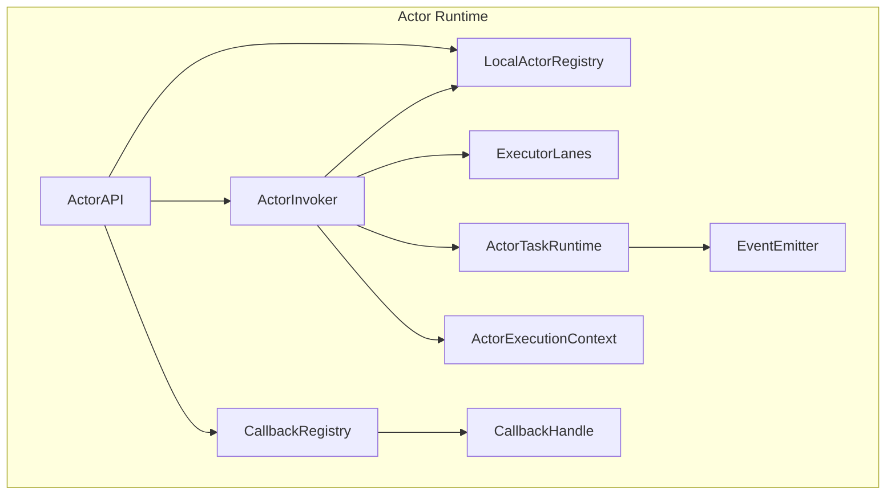
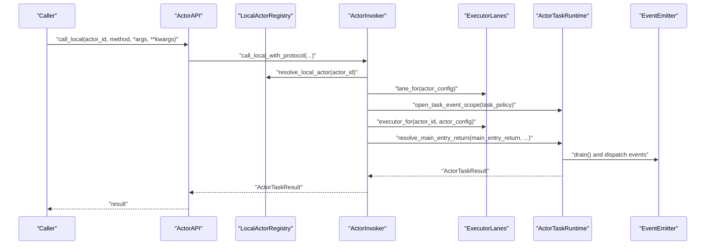
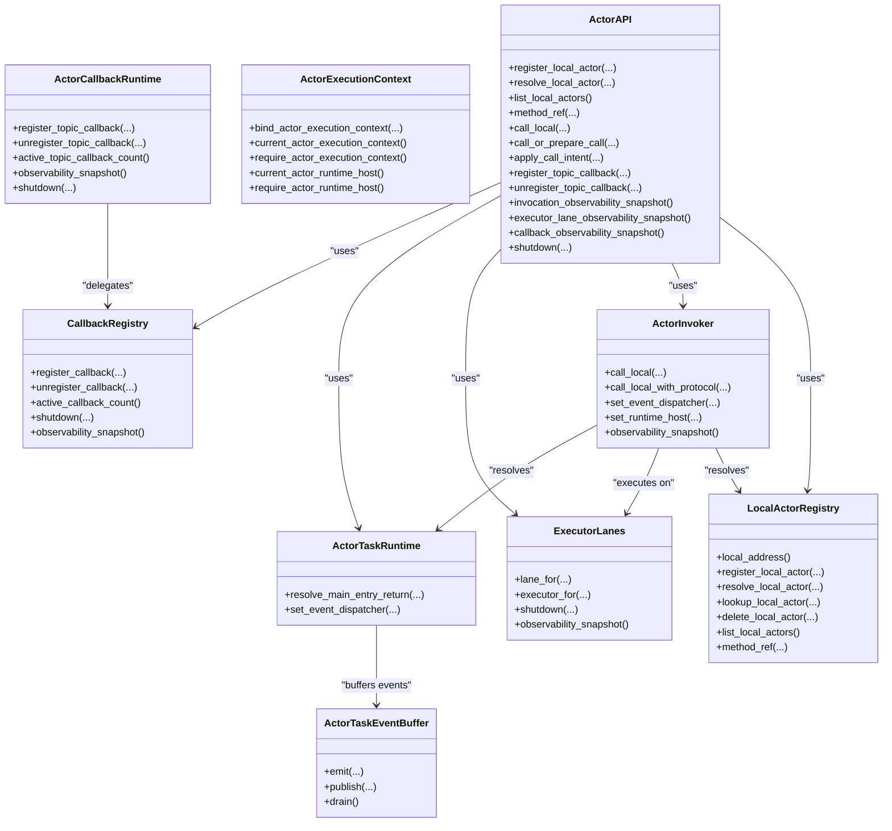
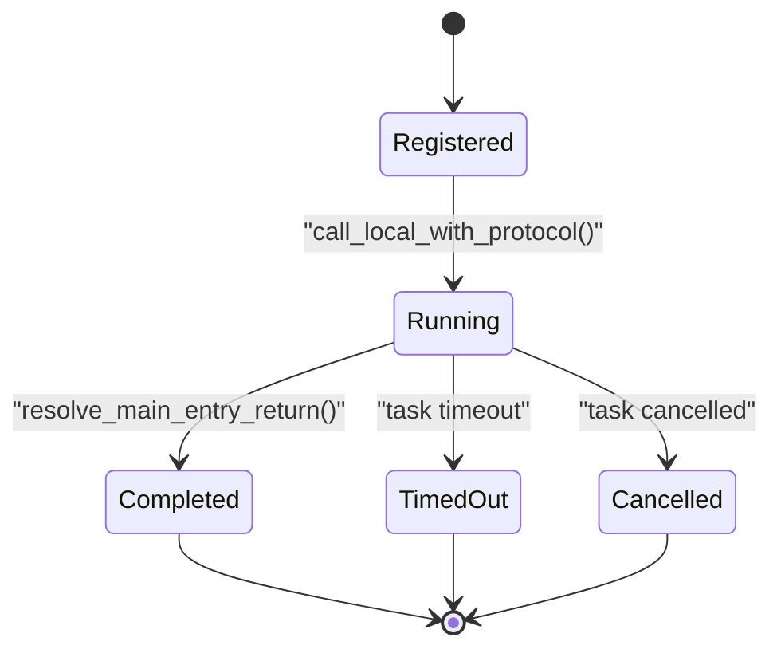

# Actor API and Lifecycle Management

<cite>
**Referenced Files in This Document**
- [actor_api.py](file://src/sage/runtime/flownet/runtime/actors/actor_api.py)
- [registry.py](file://src/sage/runtime/flownet/runtime/actors/registry.py)
- [task_runtime.py](file://src/sage/runtime/flownet/runtime/actors/task_runtime.py)
- [invoker.py](file://src/sage/runtime/flownet/runtime/actors/invoker.py)
- [executor_lanes.py](file://src/sage/runtime/flownet/runtime/actors/executor_lanes.py)
- [execution_context.py](file://src/sage/runtime/flownet/runtime/actors/execution_context.py)
- [callback_registry.py](file://src/sage/runtime/flownet/runtime/actors/callback_registry.py)
- [callback_handle.py](file://src/sage/runtime/flownet/runtime/actors/callback_handle.py)
- [error_codes.py](file://src/sage/runtime/flownet/runtime/actors/error_codes.py)
- [event_emitter.py](file://src/sage/runtime/flownet/runtime/actors/event_emitter.py)
- [runtime/__init__.py](file://src/sage/runtime/flownet/runtime/__init__.py)
- [runtime_client.py](file://src/sage/runtime/flownet/client/runtime_client.py)
</cite>

## Table of Contents
1. [Introduction](#introduction)
2. [Project Structure](#project-structure)
3. [Core Components](#core-components)
4. [Architecture Overview](#architecture-overview)
5. [Detailed Component Analysis](#detailed-component-analysis)
6. [Dependency Analysis](#dependency-analysis)
7. [Performance Considerations](#performance-considerations)
8. [Troubleshooting Guide](#troubleshooting-guide)
9. [Conclusion](#conclusion)
10. [Appendices](#appendices)

## Introduction
This document explains the Actor API and Lifecycle Management in the FlowNet runtime. It covers the actor API surface, creation and registration patterns, lifecycle states and transitions, registry management, identity and namespace handling, and how actors integrate with the broader FlowNet system. Practical examples are referenced from the codebase to illustrate instantiation, configuration, invocation, and cleanup. Common pitfalls such as actor leaks, orphaned callbacks, and lifecycle conflicts are addressed with actionable guidance.

## Project Structure
The actor subsystem resides under the FlowNet runtime package and is composed of several cohesive modules:
- Actor API: public interface for registering actors, invoking methods, and managing callbacks
- Registry: local actor registry and identity resolution
- Invoker: synchronous actor invocation with execution policy enforcement
- Task Runtime: task-result resolution, timeouts, cancellation, and event emission
- Executor Lanes: lane-based thread pool management for CPU and GPU workloads
- Execution Context: context propagation during actor execution
- Callback Registry: topic callback registration and dispatch
- Event Emitter: task-scoped event buffering and delivery
- Error Codes: standardized error messages for policy and runtime failures

**Diagram sources**
- [actor_api.py:18-262](file://src/sage/runtime/flownet/runtime/actors/actor_api.py#L18-L262)
- [registry.py:28-155](file://src/sage/runtime/flownet/runtime/actors/registry.py#L28-L155)
- [invoker.py:25-308](file://src/sage/runtime/flownet/runtime/actors/invoker.py#L25-L308)
- [task_runtime.py:53-231](file://src/sage/runtime/flownet/runtime/actors/task_runtime.py#L53-L231)
- [executor_lanes.py:62-252](file://src/sage/runtime/flownet/runtime/actors/executor_lanes.py#L62-L252)
- [execution_context.py:10-75](file://src/sage/runtime/flownet/runtime/actors/execution_context.py#L10-L75)
- [callback_registry.py:33-436](file://src/sage/runtime/flownet/runtime/actors/callback_registry.py#L33-L436)
- [callback_handle.py:7-76](file://src/sage/runtime/flownet/runtime/actors/callback_handle.py#L7-L76)
- [event_emitter.py:13-218](file://src/sage/runtime/flownet/runtime/actors/event_emitter.py#L13-L218)

**Section sources**
- [runtime/__init__.py:1-314](file://src/sage/runtime/flownet/runtime/__init__.py#L1-L314)

## Core Components
- ActorAPI: central facade for local actor registration, method invocation, and callback management. It orchestrates registry, invoker, executor lanes, and optional callback runtime.
- LocalActorRegistry: manages actor identity, configuration, and lifecycle within a local address scope. Provides registration, resolution, listing, and deletion.
- ActorInvoker: enforces synchronous-only actor entry points, applies execution policies, and coordinates execution via executor lanes and task runtime.
- ActorTaskRuntime: resolves runtime-managed tasks (coroutines/Futures), enforces timeouts/cancellations, and buffers/emits events.
- ExecutorLanes: lane-based thread pool management supporting default CPU and dedicated GPU lanes with per-actor policy overrides.
- ActorExecutionContext: context propagation for actor execution, exposing actor ID, config, and runtime host.
- CallbackRegistry and ActorCallbackRuntime: manage topic callbacks, dispatch events to actor methods, and support remote registration/deregistration.
- Event Emitter: task-scoped event buffering with configurable ordering policy.
- Error Codes: standardized error codes for policy and runtime failures.

**Section sources**
- [actor_api.py:18-262](file://src/sage/runtime/flownet/runtime/actors/actor_api.py#L18-L262)
- [registry.py:28-155](file://src/sage/runtime/flownet/runtime/actors/registry.py#L28-L155)
- [invoker.py:25-308](file://src/sage/runtime/flownet/runtime/actors/invoker.py#L25-L308)
- [task_runtime.py:53-231](file://src/sage/runtime/flownet/runtime/actors/task_runtime.py#L53-L231)
- [executor_lanes.py:62-252](file://src/sage/runtime/flownet/runtime/actors/executor_lanes.py#L62-L252)
- [execution_context.py:10-75](file://src/sage/runtime/flownet/runtime/actors/execution_context.py#L10-L75)
- [callback_registry.py:33-436](file://src/sage/runtime/flownet/runtime/actors/callback_registry.py#L33-L436)
- [callback_handle.py:7-76](file://src/sage/runtime/flownet/runtime/actors/callback_handle.py#L7-L76)
- [event_emitter.py:13-218](file://src/sage/runtime/flownet/runtime/actors/event_emitter.py#L13-L218)
- [error_codes.py:1-30](file://src/sage/runtime/flownet/runtime/actors/error_codes.py#L1-L30)

## Architecture Overview
The FlowNet actor runtime integrates tightly with the broader runtime environment. Actors are registered locally, invoked synchronously via the invoker, executed on lane-specific thread pools, and can emit/publish events that are buffered and dispatched by the task runtime. Callbacks can be registered locally or remotely and are managed by the callback registry and runtime.

**Diagram sources**
- [actor_api.py:77-84](file://src/sage/runtime/flownet/runtime/actors/actor_api.py#L77-L84)
- [invoker.py:54-114](file://src/sage/runtime/flownet/runtime/actors/invoker.py#L54-L114)
- [task_runtime.py:72-115](file://src/sage/runtime/flownet/runtime/actors/task_runtime.py#L72-L115)
- [executor_lanes.py:86-124](file://src/sage/runtime/flownet/runtime/actors/executor_lanes.py#L86-L124)
- [event_emitter.py:109-117](file://src/sage/runtime/flownet/runtime/actors/event_emitter.py#L109-L117)

## Detailed Component Analysis

### Actor API Surface
ActorAPI exposes:
- Registration: register_local_actor(actor_object, actor_id=None, config=None) -> str
- Resolution: resolve_local_actor(actor_id) -> V1ActorRecord
- Enumeration: list_local_actors() -> list[V1ActorRecord]
- Method reference: method_ref(actor_id, method) -> V1ActorRef
- Invocation: call_local(actor_id, method, *args, **kwargs) -> Any
- Call intent protocol: call_or_prepare_call(target, ...) and apply_call_intent(intent)
- Callback management: register_topic_callback(...) and unregister_topic_callback(...)
- Observability: invocation_observability_snapshot(), executor_lane_observability_snapshot(), callback_observability_snapshot()
- Shutdown: shutdown(wait=True, cancel_futures=False)

Key behaviors:
- Normalizes targets via normalize_target and ensures local address alignment for intents.
- Enforces non-empty fields and validates argument/keyword types for intent processing.
- Delegates local invocation to ActorInvoker and local callback registration to ActorCallbackRuntime.

**Section sources**
- [actor_api.py:18-262](file://src/sage/runtime/flownet/runtime/actors/actor_api.py#L18-L262)
- [registry.py:111-133](file://src/sage/runtime/flownet/runtime/actors/registry.py#L111-L133)

### Local Actor Registry and Identity Management
LocalActorRegistry manages:
- Local address resolution (supports callable or static string)
- Actor identity generation (UUID-based by default)
- Record storage keyed by actor_id with thread-safe access
- Methods: register_local_actor, resolve_local_actor, lookup_local_actor, delete_local_actor, list_local_actors, method_ref

Identity and namespace handling:
- Actor IDs are normalized and validated; duplicates are rejected.
- method_ref constructs V1ActorRef with address, actor_id, and method.
- Local address is normalized and used consistently across references.

**Section sources**
- [registry.py:28-155](file://src/sage/runtime/flownet/runtime/actors/registry.py#L28-L155)

### Actor Invocation and Policy Enforcement
ActorInvoker:
- Validates method existence and enforces synchronous-only entry points.
- Resolves task policy from actor config (max_pending, task_timeout_ms, max_parallel_tools).
- Enforces pending slots and running counts per actor and lane.
- Executes via executor lanes with optional lock-free bypass via __flownet_no_lock__.
- Binds execution context and opens task event scope around invocation.
- Delegates result resolution to ActorTaskRuntime.

Lane selection:
- resolve_sync_lane chooses default CPU or dedicated GPU lanes.
- resolve_policy_max_workers supports per-actor policy overrides.

**Section sources**
- [invoker.py:25-308](file://src/sage/runtime/flownet/runtime/actors/invoker.py#L25-L308)
- [executor_lanes.py:14-47](file://src/sage/runtime/flownet/runtime/actors/executor_lanes.py#L14-L47)

### Task Runtime and Event Delivery
ActorTaskRuntime:
- Determines whether returned value is a runtime-managed task (coroutine/Future/awaitable).
- Resolves tasks with optional timeout and cancellation handling.
- Builds runtime reports (task_timeout_hit, task_cancelled, configured limits).
- Dispatches buffered events via EventDispatcher, reporting dispatch outcomes.

Event Emitter:
- Task-scoped buffering with two ordering modes: emit order and ascending sequence.
- Emit/publish APIs require active task scope; otherwise raises an error.
- Sorts events when ordering by sequence.

**Section sources**
- [task_runtime.py:53-231](file://src/sage/runtime/flownet/runtime/actors/task_runtime.py#L53-L231)
- [event_emitter.py:13-218](file://src/sage/runtime/flownet/runtime/actors/event_emitter.py#L13-L218)

### Callback Management and Remote Registration
CallbackRegistry:
- Registers callbacks for topics with optional detached semantics.
- Maintains inflight futures and tracks detach events.
- Provides observability snapshot and controlled shutdown.

ActorCallbackRuntime:
- Facade for local and remote registration/deregistration.
- Uses Comm Hub to call remote callback registry service actor.
- Validates worker address and unwraps remote results.

CallbackHandle:
- Opaque handle with callback_id, topic_uri, worker_address, callback_target, detached flag, and optional owner_address.

**Section sources**
- [callback_registry.py:33-436](file://src/sage/runtime/flownet/runtime/actors/callback_registry.py#L33-L436)
- [callback_handle.py:7-76](file://src/sage/runtime/flownet/runtime/actors/callback_handle.py#L7-L76)

### Execution Context Propagation
ActorExecutionContext:
- Stores actor_id, actor_config, and runtime_host.
- Provides context manager to bind and retrieve execution context.
- Requires context-aware APIs to access runtime host safely.

**Section sources**
- [execution_context.py:10-75](file://src/sage/runtime/flownet/runtime/actors/execution_context.py#L10-L75)

### Relationship to the Broader FlowNet System
Integration points:
- Runtime client surfaces actors alongside sources, services, flows, and stateless resources.
- ActorAPI participates in the runtime host’s orchestration and can be wired with comm hub and topic API for callbacks.
- Lane selection and executor management align with runtime’s backend/container plane.

**Section sources**
- [runtime_client.py:91-181](file://src/sage/runtime/flownet/client/runtime_client.py#L91-L181)
- [runtime/__init__.py:1-60](file://src/sage/runtime/flownet/runtime/__init__.py#L1-L60)

## Dependency Analysis
High-level dependencies among core components:

**Diagram sources**
- [actor_api.py:18-262](file://src/sage/runtime/flownet/runtime/actors/actor_api.py#L18-L262)
- [registry.py:28-155](file://src/sage/runtime/flownet/runtime/actors/registry.py#L28-L155)
- [invoker.py:25-308](file://src/sage/runtime/flownet/runtime/actors/invoker.py#L25-L308)
- [executor_lanes.py:62-252](file://src/sage/runtime/flownet/runtime/actors/executor_lanes.py#L62-L252)
- [task_runtime.py:53-231](file://src/sage/runtime/flownet/runtime/actors/task_runtime.py#L53-L231)
- [callback_registry.py:33-436](file://src/sage/runtime/flownet/runtime/actors/callback_registry.py#L33-L436)

**Section sources**
- [actor_api.py:18-262](file://src/sage/runtime/flownet/runtime/actors/actor_api.py#L18-L262)
- [invoker.py:25-308](file://src/sage/runtime/flownet/runtime/actors/invoker.py#L25-L308)
- [executor_lanes.py:62-252](file://src/sage/runtime/flownet/runtime/actors/executor_lanes.py#L62-L252)
- [task_runtime.py:53-231](file://src/sage/runtime/flownet/runtime/actors/task_runtime.py#L53-L231)
- [callback_registry.py:33-436](file://src/sage/runtime/flownet/runtime/actors/callback_registry.py#L33-L436)

## Performance Considerations
- Lane selection: Choose appropriate lanes (CPU vs dedicated GPU) and tune max_workers per actor via task policy to balance throughput and latency.
- Pending limits: Configure max_pending to prevent resource exhaustion under bursty loads; monitor observability snapshots for pending/running/queued metrics.
- Event delivery: Event dispatcher overhead increases with volume; ensure efficient dispatchers and consider batching where applicable.
- Timeouts and cancellations: Set task_timeout_ms to bound long-running tasks and detect cancellations promptly.
- Lock contention: Use __flownet_no_lock__ on methods that are inherently thread-safe to reduce lock overhead.

[No sources needed since this section provides general guidance]

## Troubleshooting Guide
Common issues and resolutions:
- Actor method not found: Ensure the method exists on the actor object and is non-empty; the invoker raises a specific error when missing.
- Synchronous-only violation: Actor main entry must not be a coroutine; the invoker enforces synchronous-only entry points.
- Max pending exceeded: Increase max_pending in task policy or reduce concurrency; monitor observability snapshots to confirm mitigation.
- Task timeout/cancelled: Tune task_timeout_ms and handle cancellation paths; runtime reports task_timeout_hit and task_cancelled in runtime reports.
- Callback detach: Detached callbacks increment counters; investigate last detach details via observability snapshot.
- Shutdown anomalies: Ensure executor lanes and callback registry are shut down with wait and cancel_futures flags aligned to your teardown strategy.

**Section sources**
- [invoker.py:68-71](file://src/sage/runtime/flownet/runtime/actors/invoker.py#L68-L71)
- [invoker.py:163-175](file://src/sage/runtime/flownet/runtime/actors/invoker.py#L163-L175)
- [task_runtime.py:94-105](file://src/sage/runtime/flownet/runtime/actors/task_runtime.py#L94-L105)
- [callback_registry.py:127-134](file://src/sage/runtime/flownet/runtime/actors/callback_registry.py#L127-L134)
- [error_codes.py:3-7](file://src/sage/runtime/flownet/runtime/actors/error_codes.py#L3-L7)

## Conclusion
The FlowNet actor runtime provides a robust, policy-enforced, and observable framework for building synchronous actors with flexible execution lanes, structured event delivery, and callback management. By leveraging the ActorAPI, LocalActorRegistry, ActorInvoker, and related components, developers can implement reliable actor systems integrated into the broader FlowNet runtime environment. Proper configuration of execution policies, careful lifecycle management, and observability enable scalable and maintainable actor-based applications.

[No sources needed since this section summarizes without analyzing specific files]

## Appendices

### Actor Creation Patterns and Examples
- Registering an actor:
  - Use ActorAPI.register_local_actor(actor_object, actor_id=None, config=None) to register a new actor and receive its generated or supplied actor_id.
  - Reference: [actor_api.py:44-55](file://src/sage/runtime/flownet/runtime/actors/actor_api.py#L44-L55), [registry.py:51-75](file://src/sage/runtime/flownet/runtime/actors/registry.py#L51-L75)
- Resolving and invoking:
  - Resolve by actor_id via ActorAPI.resolve_local_actor(actor_id) and call via ActorAPI.call_local(actor_id, method, ...).
  - Reference: [actor_api.py:57-84](file://src/sage/runtime/flownet/runtime/actors/actor_api.py#L57-L84), [registry.py:77-83](file://src/sage/runtime/flownet/runtime/actors/registry.py#L77-L83)
- Configuring execution policy:
  - Provide task_policy via actor config with keys such as max_pending, task_timeout_ms, max_parallel_tools.
  - Reference: [invoker.py:252-304](file://src/sage/runtime/flownet/runtime/actors/invoker.py#L252-L304), [executor_lanes.py:37-47](file://src/sage/runtime/flownet/runtime/actors/executor_lanes.py#L37-L47)
- Event emission:
  - Emit/publish within task scope using emit/publish APIs; events are buffered and dispatched after task completion.
  - Reference: [event_emitter.py:120-153](file://src/sage/runtime/flownet/runtime/actors/event_emitter.py#L120-L153), [task_runtime.py:117-165](file://src/sage/runtime/flownet/runtime/actors/task_runtime.py#L117-L165)
- Callback registration:
  - Register topic callbacks locally or remotely via ActorAPI.register_topic_callback(...); manage via ActorCallbackRuntime.
  - Reference: [actor_api.py:86-112](file://src/sage/runtime/flownet/runtime/actors/actor_api.py#L86-L112), [callback_registry.py:68-105](file://src/sage/runtime/flownet/runtime/actors/callback_registry.py#L68-L105), [callback_registry.py:283-336](file://src/sage/runtime/flownet/runtime/actors/callback_registry.py#L283-L336)

### Lifecycle States and Transitions

**Diagram sources**
- [invoker.py:54-114](file://src/sage/runtime/flownet/runtime/actors/invoker.py#L54-L114)
- [task_runtime.py:72-115](file://src/sage/runtime/flownet/runtime/actors/task_runtime.py#L72-L115)
- [error_codes.py:5-6](file://src/sage/runtime/flownet/runtime/actors/error_codes.py#L5-L6)

### Cleanup Procedures
- Shutdown executor lanes: Invoke ActorAPI.shutdown(wait=True, cancel_futures=False) to gracefully terminate lanes.
- Callback registry shutdown: Use ActorCallbackRuntime.shutdown(wait=True, cancel_futures=False) to cancel inflight futures and clear records.
- Manual deletion: Use LocalActorRegistry.delete_local_actor(actor_id) to remove actors from the registry.

**Section sources**
- [actor_api.py:222-227](file://src/sage/runtime/flownet/runtime/actors/actor_api.py#L222-L227)
- [executor_lanes.py:126-143](file://src/sage/runtime/flownet/runtime/actors/executor_lanes.py#L126-L143)
- [callback_registry.py:136-160](file://src/sage/runtime/flownet/runtime/actors/callback_registry.py#L136-L160)
- [registry.py:90-93](file://src/sage/runtime/flownet/runtime/actors/registry.py#L90-L93)