# Actor System

<cite>
**Referenced Files in This Document**
- [actor_api.py](file://src/sage/runtime/flownet/runtime/actors/actor_api.py)
- [execution_context.py](file://src/sage/runtime/flownet/runtime/actors/execution_context.py)
- [callback_handle.py](file://src/sage/runtime/flownet/runtime/actors/callback_handle.py)
- [callback_registry.py](file://src/sage/runtime/flownet/runtime/actors/callback_registry.py)
- [task_runtime.py](file://src/sage/runtime/flownet/runtime/actors/task_runtime.py)
- [invoker.py](file://src/sage/runtime/flownet/runtime/actors/invoker.py)
- [registry.py](file://src/sage/runtime/flownet/runtime/actors/registry.py)
- [backend_jobs.py](file://src/sage/runtime/flownet/runtime/actors/backend_jobs.py)
- [comm_bridge.py](file://src/sage/runtime/flownet/runtime/actors/comm_bridge.py)
- [error_codes.py](file://src/sage/runtime/flownet/runtime/actors/error_codes.py)
- [event_emitter.py](file://src/sage/runtime/flownet/runtime/actors/event_emitter.py)
- [executor_lanes.py](file://src/sage/runtime/flownet/runtime/actors/executor_lanes.py)
- [runtime.py](file://src/sage/runtime/flownet/runtime/runtime.py)
- [runtime_client.py](file://src/sage/runtime/flownet/client/runtime_client.py)
- [session.py](file://src/sage/runtime/flownet/client/session.py)
- [node_runtime.py](file://src/sage/runtime/flownet/client/node_runtime.py)
- [operator_runtime.py](file://src/sage/runtime/flownet/runtime/flowengine/operator_runtime.py)
- [operator_executor.py](file://src/sage/runtime/flownet/runtime/flowengine/operator_executor.py)
- [engine.py](file://src/sage/runtime/flownet/runtime/flowengine/engine.py)
- [program_cache.py](file://src/sage/runtime/flownet/runtime/flowengine/program_cache.py)
- [cursor_ctx.py](file://src/sage/runtime/flownet/runtime/flowengine/cursor_ctx.py)
- [cursor_guards.py](file://src/sage/runtime/flownet/runtime/flowengine/cursor_guards.py)
- [cursor_models.py](file://src/sage/runtime/flownet/runtime/flowengine/cursor_models.py)
- [topic_api.py](file://src/sage/runtime/flownet/topics/topic_api.py)
- [coordinator_registry.py](file://src/sage/runtime/flownet/topics/coordinator_registry.py)
- [subscriber_registry.py](file://src/sage/runtime/flownet/topics/subscriber_registry.py)
- [routing_directory.py](file://src/sage/runtime/flownet/topics/routing_directory.py)
- [comm_hub.py](file://src/sage/runtime/flownet/runtime/comm/hub.py)
- [comm_router.py](file://src/sage/runtime/flownet/runtime/comm/router.py)
- [comm_transport.py](file://src/sage/runtime/flownet/runtime/comm/transport.py)
- [comm_reply_tracker.py](file://src/sage/runtime/flownet/runtime/comm/reply_tracker.py)
- [comm_loopback.py](file://src/sage/runtime/flownet/runtime/comm/loopback.py)
- [comm_backends.py](file://src/sage/runtime/flownet/runtime/comm/backends.py)
- [comm_protocol.py](file://src/sage/runtime/flownet/runtime/comm/protocol.py)
- [collective_dispatch.py](file://src/sage/runtime/flownet/runtime/collective/dispatch.py)
- [collective_executors.py](file://src/sage/runtime/flownet/runtime/collective/executors.py)
- [collective_registry.py](file://src/sage/runtime/flownet/runtime/collective/registry.py)
- [collective_contracts.py](file://src/sage/runtime/flownet/runtime/collective/contracts.py)
- [endpoint_registry.py](file://src/sage/runtime/flownet/runtime/endpoint_registry.py)
- [shared_state_registry.py](file://src/sage/runtime/flownet/runtime/shared_state_registry.py)
- [governance.py](file://src/sage/runtime/flownet/runtime/governance.py)
- [loops.py](file://src/sage/runtime/flownet/runtime/loops.py)
- [flow_program.py](file://src/sage/runtime/flownet/core/flow_program.py)
- [flow_compiler.py](file://src/sage/runtime/flownet/compiler/flow_compiler.py)
- [flows.py](file://src/sage/runtime/stream/flows.py)
- [operators.py](file://src/sage/runtime/stream/operators.py)
- [datastream.py](file://src/sage/runtime/stream/datastream.py)
- [transformations.py](file://src/sage/runtime/stream/transformations.py)
</cite>

## Table of Contents
1. [Introduction](#introduction)
2. [Project Structure](#project-structure)
3. [Core Components](#core-components)
4. [Architecture Overview](#architecture-overview)
5. [Detailed Component Analysis](#detailed-component-analysis)
6. [Dependency Analysis](#dependency-analysis)
7. [Performance Considerations](#performance-considerations)
8. [Troubleshooting Guide](#troubleshooting-guide)
9. [Conclusion](#conclusion)
10. [Appendices](#appendices)

## Introduction
This document explains SAGE’s Actor System as the fundamental concurrency model underpinning FlowNet-based distributed processing. The actor model provides isolated execution units (actors) that communicate exclusively via asynchronous message passing. Within SAGE, actors coordinate backend jobs, manage execution contexts, route messages, and integrate with FlowNet’s runtime to enable scalable, fault-tolerant distributed computation. The system supports callback mechanisms, registry management, and task runtime orchestration, while maintaining clear separation between FlowNet’s orchestration layer and the underlying actor runtime.

## Project Structure
The Actor System resides primarily under src/sage/runtime/flownet/runtime/actors and integrates with FlowNet runtime, client, and flowengine modules. Key areas:
- Actors runtime: actor API, execution context, callbacks, task runtime, invoker, registry, backend jobs, communication bridge, error codes, event emitter, executor lanes.
- FlowNet runtime: engine, operator runtime, program cache, cursor contexts, and related components.
- Topics and communication: topic APIs, coordinator/subscriber registries, routing directory, and communication hub/router/transport/transport utilities.
- Collective execution: dispatch, executors, registry, and contracts for coordinated operations.
- Endpoint and shared state registries, governance, and loops support cross-cutting concerns.

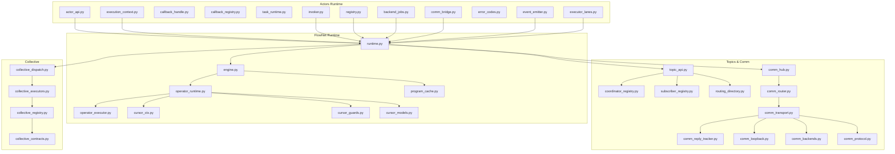

**Diagram sources**
- [actor_api.py](file://src/sage/runtime/flownet/runtime/actors/actor_api.py)
- [execution_context.py](file://src/sage/runtime/flownet/runtime/actors/execution_context.py)
- [invoker.py](file://src/sage/runtime/flownet/runtime/actors/invoker.py)
- [registry.py](file://src/sage/runtime/flownet/runtime/actors/registry.py)
- [backend_jobs.py](file://src/sage/runtime/flownet/runtime/actors/backend_jobs.py)
- [comm_bridge.py](file://src/sage/runtime/flownet/runtime/actors/comm_bridge.py)
- [event_emitter.py](file://src/sage/runtime/flownet/runtime/actors/event_emitter.py)
- [executor_lanes.py](file://src/sage/runtime/flownet/runtime/actors/executor_lanes.py)
- [runtime.py](file://src/sage/runtime/flownet/runtime/runtime.py)
- [engine.py](file://src/sage/runtime/flownet/runtime/flowengine/engine.py)
- [operator_runtime.py](file://src/sage/runtime/flownet/runtime/flowengine/operator_runtime.py)
- [operator_executor.py](file://src/sage/runtime/flownet/runtime/flowengine/operator_executor.py)
- [program_cache.py](file://src/sage/runtime/flownet/runtime/flowengine/program_cache.py)
- [cursor_ctx.py](file://src/sage/runtime/flownet/runtime/flowengine/cursor_ctx.py)
- [cursor_guards.py](file://src/sage/runtime/flownet/runtime/flowengine/cursor_guards.py)
- [cursor_models.py](file://src/sage/runtime/flownet/runtime/flowengine/cursor_models.py)
- [topic_api.py](file://src/sage/runtime/flownet/topics/topic_api.py)
- [coordinator_registry.py](file://src/sage/runtime/flownet/topics/coordinator_registry.py)
- [subscriber_registry.py](file://src/sage/runtime/flownet/topics/subscriber_registry.py)
- [routing_directory.py](file://src/sage/runtime/flownet/topics/routing_directory.py)
- [comm_hub.py](file://src/sage/runtime/flownet/runtime/comm/hub.py)
- [comm_router.py](file://src/sage/runtime/flownet/runtime/comm/router.py)
- [comm_transport.py](file://src/sage/runtime/flownet/runtime/comm/transport.py)
- [comm_reply_tracker.py](file://src/sage/runtime/flownet/runtime/comm/reply_tracker.py)
- [comm_loopback.py](file://src/sage/runtime/flownet/runtime/comm/loopback.py)
- [comm_backends.py](file://src/sage/runtime/flownet/runtime/comm/backends.py)
- [comm_protocol.py](file://src/sage/runtime/flownet/runtime/comm/protocol.py)
- [collective_dispatch.py](file://src/sage/runtime/flownet/runtime/collective/dispatch.py)
- [collective_executors.py](file://src/sage/runtime/flownet/runtime/collective/executors.py)
- [collective_registry.py](file://src/sage/runtime/flownet/runtime/collective/registry.py)
- [collective_contracts.py](file://src/sage/runtime/flownet/runtime/collective/contracts.py)

**Section sources**
- [actor_api.py](file://src/sage/runtime/flownet/runtime/actors/actor_api.py)
- [runtime.py](file://src/sage/runtime/flownet/runtime/runtime.py)

## Core Components
This section introduces the primary building blocks of the Actor System and their roles in distributed execution.

- Actor API: Defines the public interface for actor creation, messaging, and lifecycle operations. It encapsulates actor identity, mailbox handling, and integration points with the runtime.
- Execution Context: Encapsulates the current execution state, including caller identity, correlation IDs, and contextual metadata propagated across actor boundaries.
- Callback Handle and Registry: Provide structured callback registration and invocation, enabling actors to register completion handlers and receive notifications asynchronously.
- Task Runtime: Manages actor scheduling, concurrency limits, and execution lanes, coordinating work distribution across available resources.
- Invoker: Routes messages to actor instances, resolves target actors, and executes handlers with proper context and error propagation.
- Registry: Maintains actor identities, routing tables, and membership for discovery and message delivery.
- Backend Jobs: Coordinates long-running tasks, orchestrating backend containers and tracking job lifecycles.
- Communication Bridge: Bridges actor messaging with FlowNet’s communication plane, enabling inter-node message routing and transport abstraction.
- Event Emitter and Executor Lanes: Emit lifecycle and operational events and manage lane-based execution for throughput and isolation.
- Error Codes: Standardized error semantics for actor failures, timeouts, and invalid states.

Practical examples (paths only):
- Creating an actor and sending a message: [actor_api.py](file://src/sage/runtime/flownet/runtime/actors/actor_api.py)
- Registering a callback and invoking it: [callback_handle.py](file://src/sage/runtime/flownet/runtime/actors/callback_handle.py), [callback_registry.py](file://src/sage/runtime/flownet/runtime/actors/callback_registry.py)
- Starting a backend job and tracking progress: [backend_jobs.py](file://src/sage/runtime/flownet/runtime/actors/backend_jobs.py)
- Executing a task within an execution context: [execution_context.py](file://src/sage/runtime/flownet/runtime/actors/execution_context.py), [task_runtime.py](file://src/sage/runtime/flownet/runtime/actors/task_runtime.py)

**Section sources**
- [actor_api.py](file://src/sage/runtime/flownet/runtime/actors/actor_api.py)
- [execution_context.py](file://src/sage/runtime/flownet/runtime/actors/execution_context.py)
- [callback_handle.py](file://src/sage/runtime/flownet/runtime/actors/callback_handle.py)
- [callback_registry.py](file://src/sage/runtime/flownet/runtime/actors/callback_registry.py)
- [task_runtime.py](file://src/sage/runtime/flownet/runtime/actors/task_runtime.py)
- [invoker.py](file://src/sage/runtime/flownet/runtime/actors/invoker.py)
- [registry.py](file://src/sage/runtime/flownet/runtime/actors/registry.py)
- [backend_jobs.py](file://src/sage/runtime/flownet/runtime/actors/backend_jobs.py)
- [comm_bridge.py](file://src/sage/runtime/flownet/runtime/actors/comm_bridge.py)
- [event_emitter.py](file://src/sage/runtime/flownet/runtime/actors/event_emitter.py)
- [executor_lanes.py](file://src/sage/runtime/flownet/runtime/actors/executor_lanes.py)
- [error_codes.py](file://src/sage/runtime/flownet/runtime/actors/error_codes.py)

## Architecture Overview
The Actor System sits atop FlowNet’s runtime and orchestrates distributed execution through:
- Actor API and Invoker for message routing and handler execution.
- Execution Context and Task Runtime for concurrency control and scheduling.
- Callback Registry and Handles for asynchronous completion signaling.
- Communication Bridge and Transport Layer for inter-node messaging.
- FlowEngine integration for operator execution and cursor-based streaming.

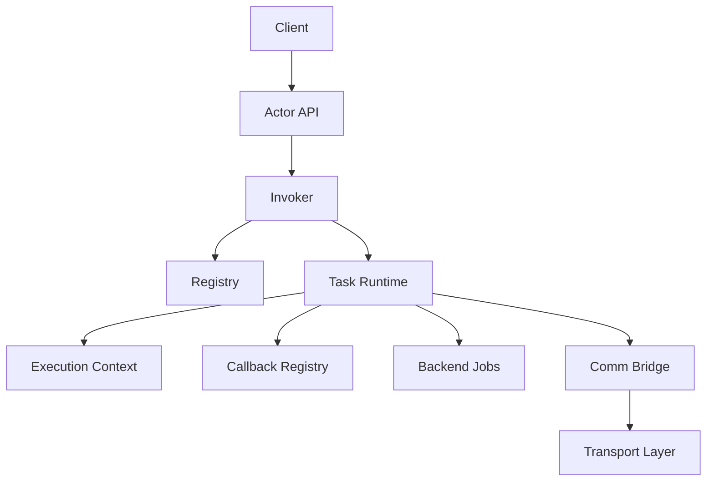

**Diagram sources**
- [actor_api.py](file://src/sage/runtime/flownet/runtime/actors/actor_api.py)
- [invoker.py](file://src/sage/runtime/flownet/runtime/actors/invoker.py)
- [registry.py](file://src/sage/runtime/flownet/runtime/actors/registry.py)
- [task_runtime.py](file://src/sage/runtime/flownet/runtime/actors/task_runtime.py)
- [execution_context.py](file://src/sage/runtime/flownet/runtime/actors/execution_context.py)
- [callback_registry.py](file://src/sage/runtime/flownet/runtime/actors/callback_registry.py)
- [backend_jobs.py](file://src/sage/runtime/flownet/runtime/actors/backend_jobs.py)
- [comm_bridge.py](file://src/sage/runtime/flownet/runtime/actors/comm_bridge.py)
- [comm_transport.py](file://src/sage/runtime/flownet/runtime/comm/transport.py)

## Detailed Component Analysis

### Actor API and Lifecycle Management
The Actor API defines how actors are created, addressed, and destroyed. It manages actor identity, mailbox handling, and lifecycle transitions. The API coordinates with the Registry for discovery and with the Invoker for message routing.

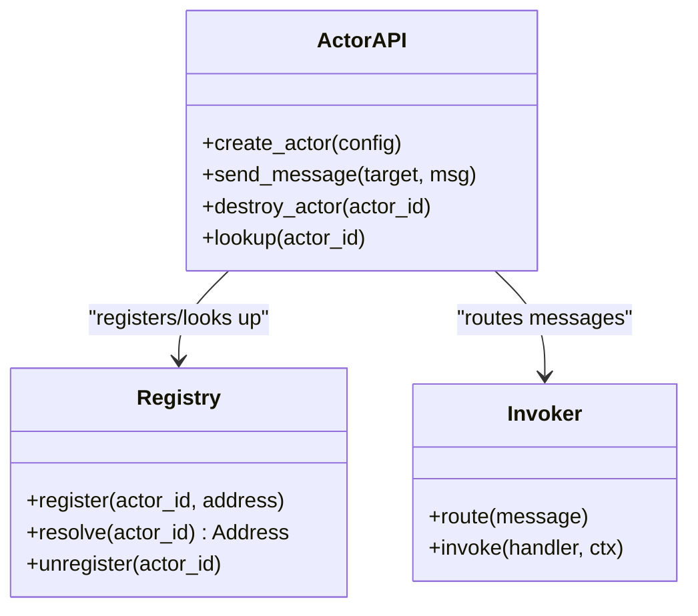

**Diagram sources**
- [actor_api.py](file://src/sage/runtime/flownet/runtime/actors/actor_api.py)
- [registry.py](file://src/sage/runtime/flownet/runtime/actors/registry.py)
- [invoker.py](file://src/sage/runtime/flownet/runtime/actors/invoker.py)

**Section sources**
- [actor_api.py](file://src/sage/runtime/flownet/runtime/actors/actor_api.py)
- [registry.py](file://src/sage/runtime/flownet/runtime/actors/registry.py)
- [invoker.py](file://src/sage/runtime/flownet/runtime/actors/invoker.py)

### Execution Context and Concurrency Control
Execution Context carries metadata across actor boundaries, ensuring consistent tracing and correlation. Task Runtime controls scheduling, concurrency limits, and lane assignment. Together they guarantee predictable performance and isolation.

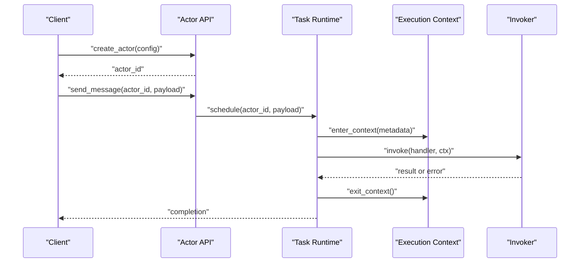

**Diagram sources**
- [task_runtime.py](file://src/sage/runtime/flownet/runtime/actors/task_runtime.py)
- [execution_context.py](file://src/sage/runtime/flownet/runtime/actors/execution_context.py)
- [invoker.py](file://src/sage/runtime/flownet/runtime/actors/invoker.py)
- [actor_api.py](file://src/sage/runtime/flownet/runtime/actors/actor_api.py)

**Section sources**
- [task_runtime.py](file://src/sage/runtime/flownet/runtime/actors/task_runtime.py)
- [execution_context.py](file://src/sage/runtime/flownet/runtime/actors/execution_context.py)

### Callback Mechanisms and Completion Handling
Callback Handle and Callback Registry enable asynchronous completion signaling. Actors register callbacks for long-running operations, and the registry invokes them upon completion or failure.

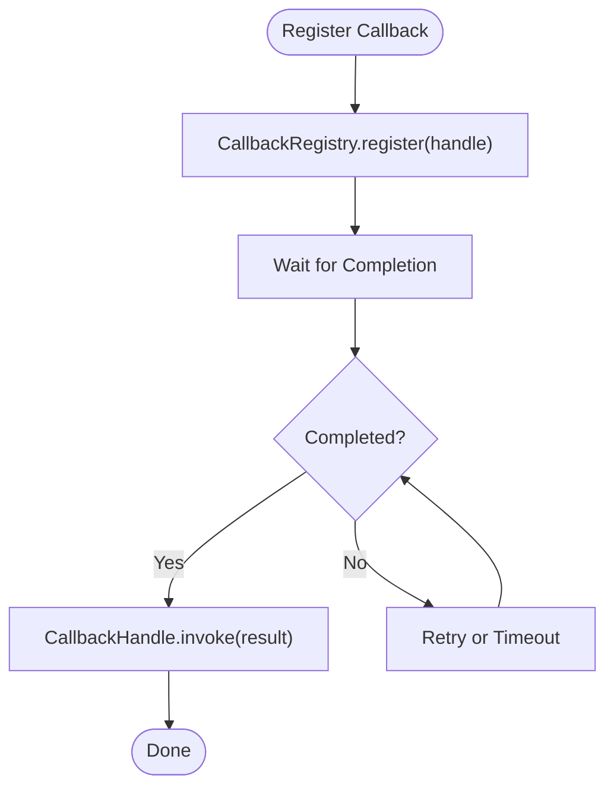

**Diagram sources**
- [callback_handle.py](file://src/sage/runtime/flownet/runtime/actors/callback_handle.py)
- [callback_registry.py](file://src/sage/runtime/flownet/runtime/actors/callback_registry.py)

**Section sources**
- [callback_handle.py](file://src/sage/runtime/flownet/runtime/actors/callback_handle.py)
- [callback_registry.py](file://src/sage/runtime/flownet/runtime/actors/callback_registry.py)

### Backend Jobs Coordination
Backend Jobs coordinate long-running tasks, including container orchestration, lifecycle management, and progress reporting. They integrate with the Task Runtime for scheduling and with the Communication Bridge for cross-node coordination.

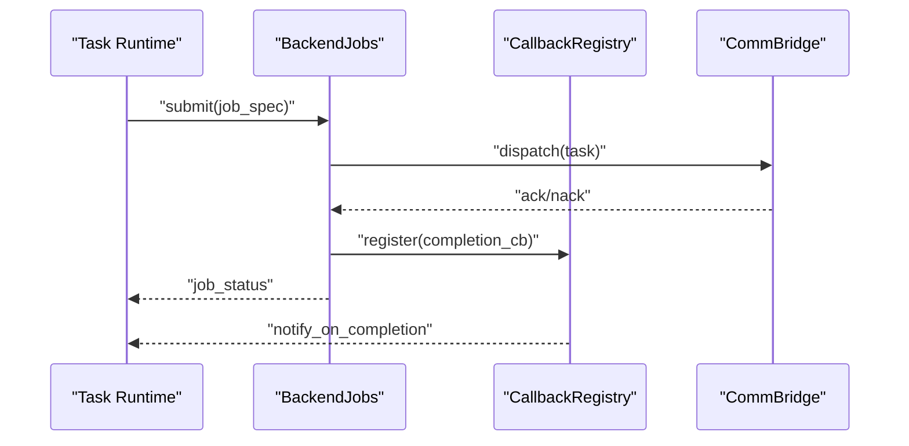

**Diagram sources**
- [backend_jobs.py](file://src/sage/runtime/flownet/runtime/actors/backend_jobs.py)
- [callback_registry.py](file://src/sage/runtime/flownet/runtime/actors/callback_registry.py)
- [comm_bridge.py](file://src/sage/runtime/flownet/runtime/actors/comm_bridge.py)
- [task_runtime.py](file://src/sage/runtime/flownet/runtime/actors/task_runtime.py)

**Section sources**
- [backend_jobs.py](file://src/sage/runtime/flownet/runtime/actors/backend_jobs.py)
- [callback_registry.py](file://src/sage/runtime/flownet/runtime/actors/callback_registry.py)
- [comm_bridge.py](file://src/sage/runtime/flownet/runtime/actors/comm_bridge.py)
- [task_runtime.py](file://src/sage/runtime/flownet/runtime/actors/task_runtime.py)

### Message Routing and Communication Bridge
The Communication Bridge translates actor messages into network-level packets, leveraging the Transport Layer and Router. It ensures reliable delivery, deduplication, and response tracking.

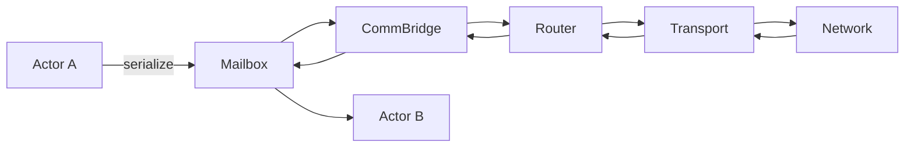

**Diagram sources**
- [comm_bridge.py](file://src/sage/runtime/flownet/runtime/actors/comm_bridge.py)
- [comm_router.py](file://src/sage/runtime/flownet/runtime/comm/router.py)
- [comm_transport.py](file://src/sage/runtime/flownet/runtime/comm/transport.py)
- [comm_reply_tracker.py](file://src/sage/runtime/flownet/runtime/comm/reply_tracker.py)
- [comm_loopback.py](file://src/sage/runtime/flownet/runtime/comm/loopback.py)
- [comm_backends.py](file://src/sage/runtime/flownet/runtime/comm/backends.py)
- [comm_protocol.py](file://src/sage/runtime/flownet/runtime/comm/protocol.py)

**Section sources**
- [comm_bridge.py](file://src/sage/runtime/flownet/runtime/actors/comm_bridge.py)
- [comm_router.py](file://src/sage/runtime/flownet/runtime/comm/router.py)
- [comm_transport.py](file://src/sage/runtime/flownet/runtime/comm/transport.py)
- [comm_reply_tracker.py](file://src/sage/runtime/flownet/runtime/comm/reply_tracker.py)
- [comm_loopback.py](file://src/sage/runtime/flownet/runtime/comm/loopback.py)
- [comm_backends.py](file://src/sage/runtime/flownet/runtime/comm/backends.py)
- [comm_protocol.py](file://src/sage/runtime/flownet/runtime/comm/protocol.py)

### FlowNet Integration and Operator Runtime
FlowNet’s runtime integrates actors with operator execution, cursor-based streaming, and program caching. The Engine coordinates execution plans, while Operator Runtime and Cursor Contexts manage streaming semantics and state.

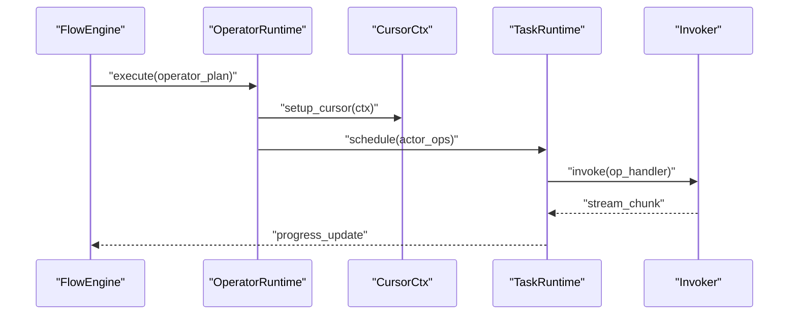

**Diagram sources**
- [engine.py](file://src/sage/runtime/flownet/runtime/flowengine/engine.py)
- [operator_runtime.py](file://src/sage/runtime/flownet/runtime/flowengine/operator_runtime.py)
- [cursor_ctx.py](file://src/sage/runtime/flownet/runtime/flowengine/cursor_ctx.py)
- [task_runtime.py](file://src/sage/runtime/flownet/runtime/actors/task_runtime.py)
- [invoker.py](file://src/sage/runtime/flownet/runtime/actors/invoker.py)

**Section sources**
- [engine.py](file://src/sage/runtime/flownet/runtime/flowengine/engine.py)
- [operator_runtime.py](file://src/sage/runtime/flownet/runtime/flowengine/operator_runtime.py)
- [cursor_ctx.py](file://src/sage/runtime/flownet/runtime/flowengine/cursor_ctx.py)
- [task_runtime.py](file://src/sage/runtime/flownet/runtime/actors/task_runtime.py)
- [invoker.py](file://src/sage/runtime/flownet/runtime/actors/invoker.py)

### Topics, Routing, and Subscriber Management
Topic APIs and registries enable publish-subscribe semantics across actors. Coordinator and Subscriber Registries maintain routing tables, while the Routing Directory resolves subscriptions and dispatches messages efficiently.

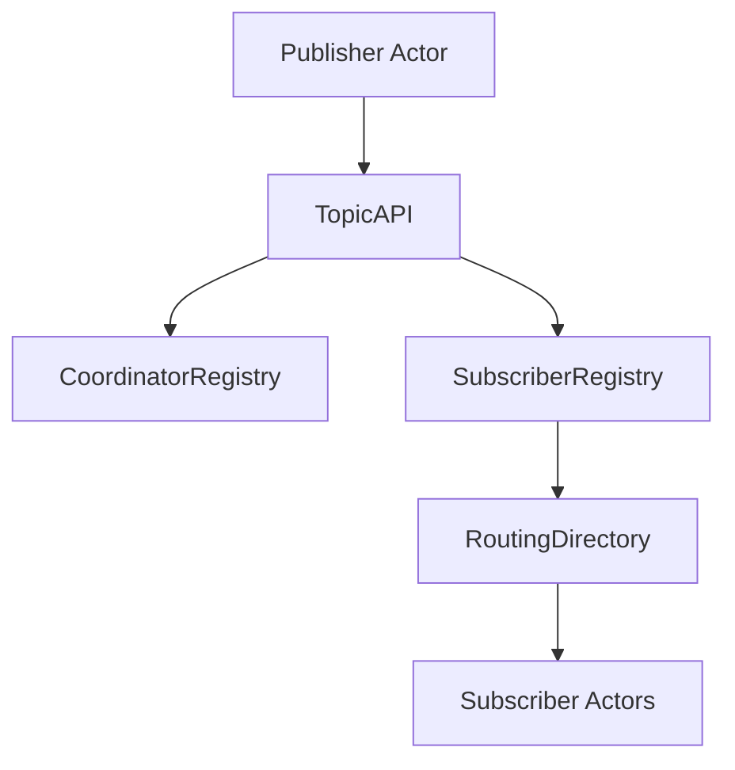

**Diagram sources**
- [topic_api.py](file://src/sage/runtime/flownet/topics/topic_api.py)
- [coordinator_registry.py](file://src/sage/runtime/flownet/topics/coordinator_registry.py)
- [subscriber_registry.py](file://src/sage/runtime/flownet/topics/subscriber_registry.py)
- [routing_directory.py](file://src/sage/runtime/flownet/topics/routing_directory.py)

**Section sources**
- [topic_api.py](file://src/sage/runtime/flownet/topics/topic_api.py)
- [coordinator_registry.py](file://src/sage/runtime/flownet/topics/coordinator_registry.py)
- [subscriber_registry.py](file://src/sage/runtime/flownet/topics/subscriber_registry.py)
- [routing_directory.py](file://src/sage/runtime/flownet/topics/routing_directory.py)

### Collective Execution and Contracts
Collective dispatch and executors coordinate group operations across nodes, using a registry and contracts to define behavior and enforce guarantees.

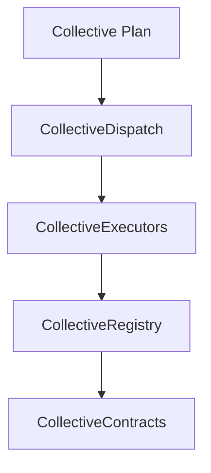

**Diagram sources**
- [collective_dispatch.py](file://src/sage/runtime/flownet/runtime/collective/dispatch.py)
- [collective_executors.py](file://src/sage/runtime/flownet/runtime/collective/executors.py)
- [collective_registry.py](file://src/sage/runtime/flownet/runtime/collective/registry.py)
- [collective_contracts.py](file://src/sage/runtime/flownet/runtime/collective/contracts.py)

**Section sources**
- [collective_dispatch.py](file://src/sage/runtime/flownet/runtime/collective/dispatch.py)
- [collective_executors.py](file://src/sage/runtime/flownet/runtime/collective/executors.py)
- [collective_registry.py](file://src/sage/runtime/flownet/runtime/collective/registry.py)
- [collective_contracts.py](file://src/sage/runtime/flownet/runtime/collective/contracts.py)

## Dependency Analysis
The Actor System exhibits strong cohesion around runtime orchestration and clear separation of concerns:
- Actors depend on Task Runtime for scheduling and Executor Lanes for concurrency.
- Invoker depends on Registry for resolution and Execution Context for propagation.
- Communication Bridge depends on Router and Transport for delivery.
- FlowEngine and Operator Runtime depend on Task Runtime and Invoker for actor-driven execution.
- Topics and Collective layers depend on Registry and Contracts for coordination.

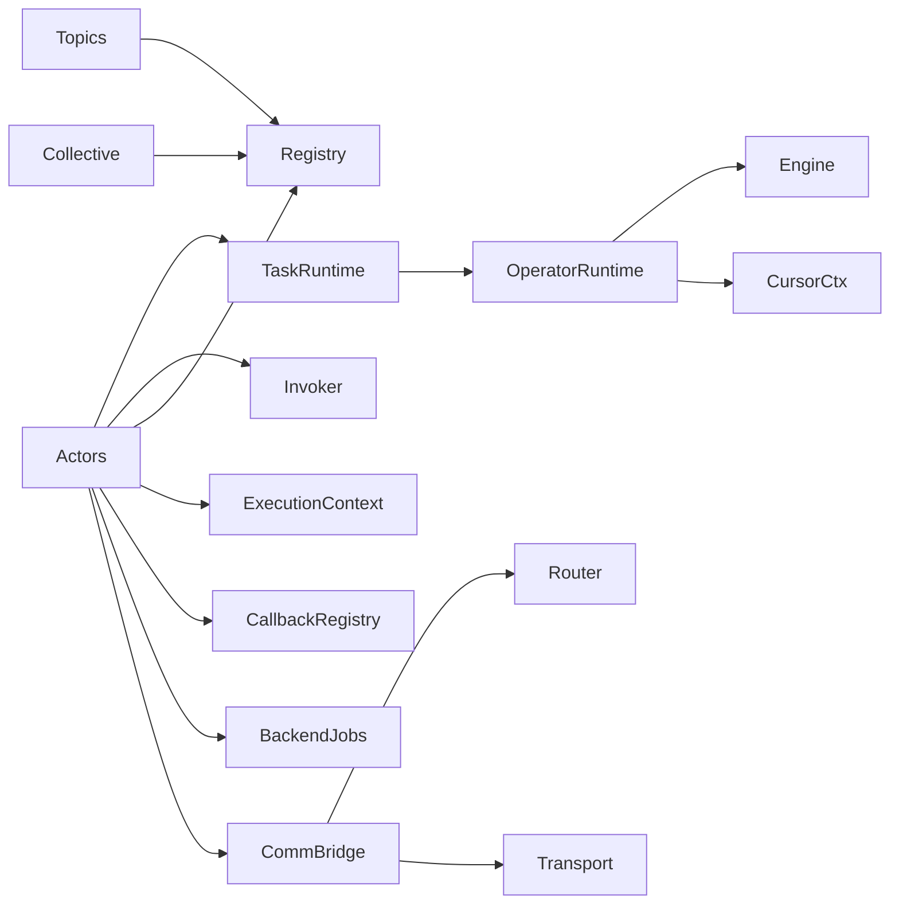

**Diagram sources**
- [task_runtime.py](file://src/sage/runtime/flownet/runtime/actors/task_runtime.py)
- [invoker.py](file://src/sage/runtime/flownet/runtime/actors/invoker.py)
- [registry.py](file://src/sage/runtime/flownet/runtime/actors/registry.py)
- [execution_context.py](file://src/sage/runtime/flownet/runtime/actors/execution_context.py)
- [callback_registry.py](file://src/sage/runtime/flownet/runtime/actors/callback_registry.py)
- [backend_jobs.py](file://src/sage/runtime/flownet/runtime/actors/backend_jobs.py)
- [comm_bridge.py](file://src/sage/runtime/flownet/runtime/actors/comm_bridge.py)
- [operator_runtime.py](file://src/sage/runtime/flownet/runtime/flowengine/operator_runtime.py)
- [engine.py](file://src/sage/runtime/flownet/runtime/flowengine/engine.py)
- [cursor_ctx.py](file://src/sage/runtime/flownet/runtime/flowengine/cursor_ctx.py)
- [comm_router.py](file://src/sage/runtime/flownet/runtime/comm/router.py)
- [comm_transport.py](file://src/sage/runtime/flownet/runtime/comm/transport.py)
- [topic_api.py](file://src/sage/runtime/flownet/topics/topic_api.py)
- [collective_registry.py](file://src/sage/runtime/flownet/runtime/collective/registry.py)

**Section sources**
- [task_runtime.py](file://src/sage/runtime/flownet/runtime/actors/task_runtime.py)
- [invoker.py](file://src/sage/runtime/flownet/runtime/actors/invoker.py)
- [registry.py](file://src/sage/runtime/flownet/runtime/actors/registry.py)
- [execution_context.py](file://src/sage/runtime/flownet/runtime/actors/execution_context.py)
- [callback_registry.py](file://src/sage/runtime/flownet/runtime/actors/callback_registry.py)
- [backend_jobs.py](file://src/sage/runtime/flownet/runtime/actors/backend_jobs.py)
- [comm_bridge.py](file://src/sage/runtime/flownet/runtime/actors/comm_bridge.py)
- [operator_runtime.py](file://src/sage/runtime/flownet/runtime/flowengine/operator_runtime.py)
- [engine.py](file://src/sage/runtime/flownet/runtime/flowengine/engine.py)
- [cursor_ctx.py](file://src/sage/runtime/flownet/runtime/flowengine/cursor_ctx.py)
- [comm_router.py](file://src/sage/runtime/flownet/runtime/comm/router.py)
- [comm_transport.py](file://src/sage/runtime/flownet/runtime/comm/transport.py)
- [topic_api.py](file://src/sage/runtime/flownet/topics/topic_api.py)
- [collective_registry.py](file://src/sage/runtime/flownet/runtime/collective/registry.py)

## Performance Considerations
- Concurrency and Scheduling: Tune Task Runtime lane counts and per-lane capacity to match workload characteristics. Use Executor Lanes to isolate latency-sensitive vs throughput-oriented tasks.
- Backpressure and Flow Control: Leverage Callback Handles to signal completion and trigger downstream work, avoiding unbounded queues.
- Network Efficiency: Use the Communication Bridge and Transport Layer to minimize serialization overhead and maximize batching opportunities.
- Cursor Streaming: Optimize FlowEngine cursor operations to reduce context switching and memory churn during streaming.
- Collective Operations: Align Collective Dispatch with cluster topology to minimize cross-node contention and maximize locality.

[No sources needed since this section provides general guidance]

## Troubleshooting Guide
Common issues and remedies:
- Actor Not Found: Verify Registry entries and resolve paths via Registry lookup. Confirm Invoker routing and Execution Context propagation.
- Deadlocks or Starvation: Inspect Task Runtime scheduling and Executor Lane saturation. Adjust concurrency limits and prioritize critical lanes.
- Message Loss or Duplicate Delivery: Review Comm Bridge and Reply Tracker configurations. Ensure Router and Transport reliability settings.
- Callback Not Firing: Validate Callback Registry registration and Invocation conditions. Confirm Completion Conditions and Error Propagation.
- Backend Job Failures: Inspect Backend Jobs lifecycle and error codes. Use Error Codes for classification and remediation.

**Section sources**
- [registry.py](file://src/sage/runtime/flownet/runtime/actors/registry.py)
- [invoker.py](file://src/sage/runtime/flownet/runtime/actors/invoker.py)
- [task_runtime.py](file://src/sage/runtime/flownet/runtime/actors/task_runtime.py)
- [executor_lanes.py](file://src/sage/runtime/flownet/runtime/actors/executor_lanes.py)
- [comm_bridge.py](file://src/sage/runtime/flownet/runtime/actors/comm_bridge.py)
- [comm_reply_tracker.py](file://src/sage/runtime/flownet/runtime/comm/reply_tracker.py)
- [callback_registry.py](file://src/sage/runtime/flownet/runtime/actors/callback_registry.py)
- [backend_jobs.py](file://src/sage/runtime/flownet/runtime/actors/backend_jobs.py)
- [error_codes.py](file://src/sage/runtime/flownet/runtime/actors/error_codes.py)

## Conclusion
SAGE’s Actor System provides a robust, distributed concurrency model for FlowNet. By combining actor isolation, message-passing communication, and FlowNet’s orchestration capabilities, it enables scalable, resilient distributed processing. The system’s modular design—covering actor API, execution context, callbacks, task runtime, invoker, registry, backend jobs, and communication bridge—supports both beginner-friendly conceptual understanding and advanced deployment and tuning scenarios.

[No sources needed since this section summarizes without analyzing specific files]

## Appendices

### Practical Examples (Paths Only)
- Create an actor and send a message: [actor_api.py](file://src/sage/runtime/flownet/runtime/actors/actor_api.py)
- Register and invoke a callback: [callback_handle.py](file://src/sage/runtime/flownet/runtime/actors/callback_handle.py), [callback_registry.py](file://src/sage/runtime/flownet/runtime/actors/callback_registry.py)
- Schedule work in Task Runtime: [task_runtime.py](file://src/sage/runtime/flownet/runtime/actors/task_runtime.py)
- Route a message via Invoker: [invoker.py](file://src/sage/runtime/flownet/runtime/actors/invoker.py)
- Coordinate a backend job: [backend_jobs.py](file://src/sage/runtime/flownet/runtime/actors/backend_jobs.py)
- Bridge actor messages to network: [comm_bridge.py](file://src/sage/runtime/flownet/runtime/actors/comm_bridge.py)
- Integrate with FlowNet runtime: [runtime.py](file://src/sage/runtime/flownet/runtime/runtime.py), [engine.py](file://src/sage/runtime/flownet/runtime/flowengine/engine.py), [operator_runtime.py](file://src/sage/runtime/flownet/runtime/flowengine/operator_runtime.py)

**Section sources**
- [actor_api.py](file://src/sage/runtime/flownet/runtime/actors/actor_api.py)
- [callback_handle.py](file://src/sage/runtime/flownet/runtime/actors/callback_handle.py)
- [callback_registry.py](file://src/sage/runtime/flownet/runtime/actors/callback_registry.py)
- [task_runtime.py](file://src/sage/runtime/flownet/runtime/actors/task_runtime.py)
- [invoker.py](file://src/sage/runtime/flownet/runtime/actors/invoker.py)
- [backend_jobs.py](file://src/sage/runtime/flownet/runtime/actors/backend_jobs.py)
- [comm_bridge.py](file://src/sage/runtime/flownet/runtime/actors/comm_bridge.py)
- [runtime.py](file://src/sage/runtime/flownet/runtime/runtime.py)
- [engine.py](file://src/sage/runtime/flownet/runtime/flowengine/engine.py)
- [operator_runtime.py](file://src/sage/runtime/flownet/runtime/flowengine/operator_runtime.py)