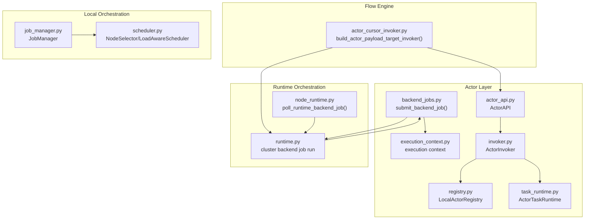
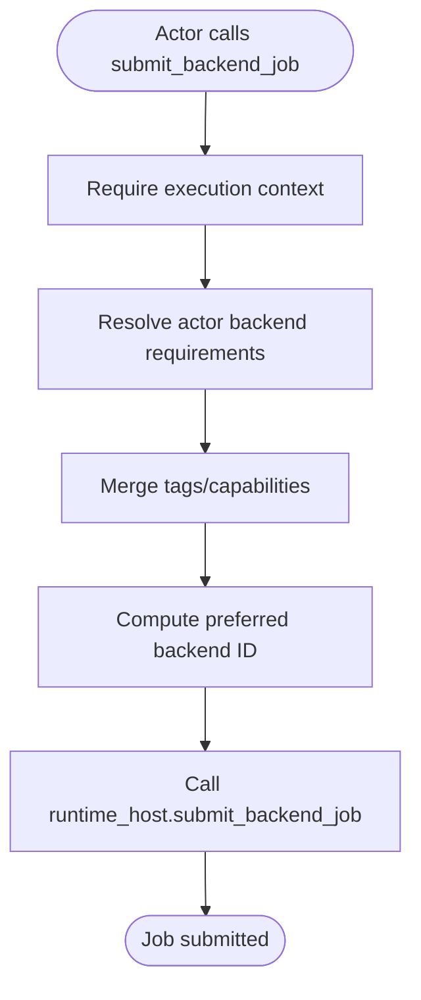
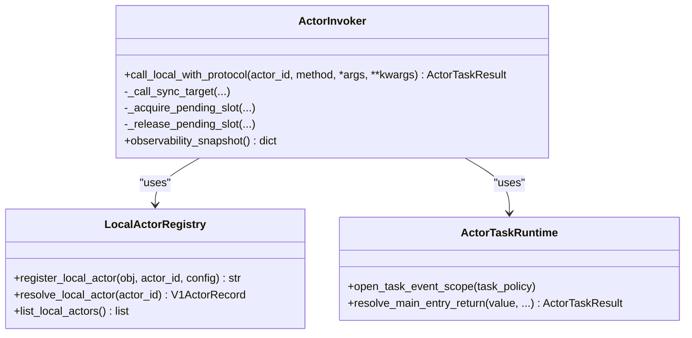
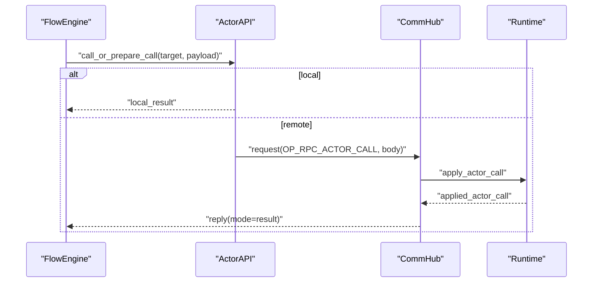
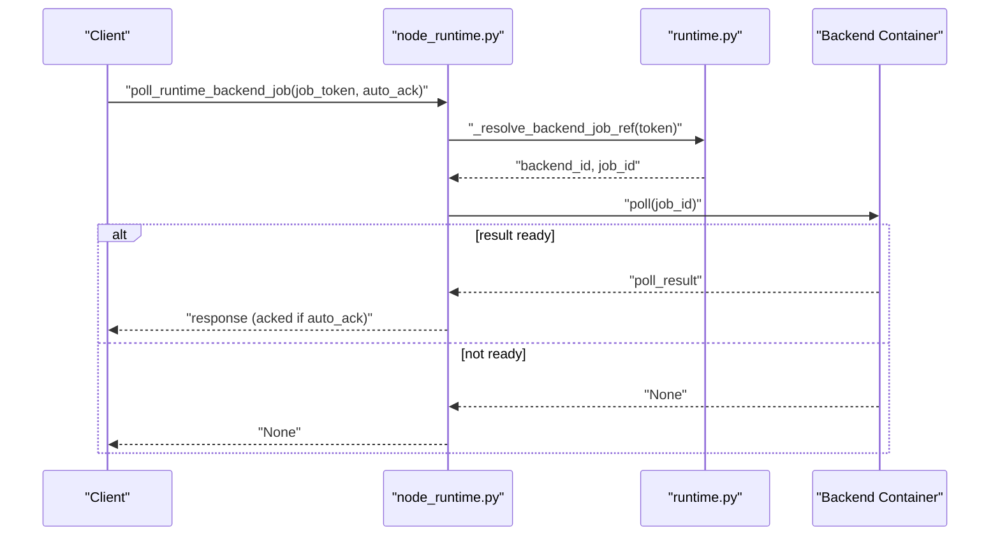
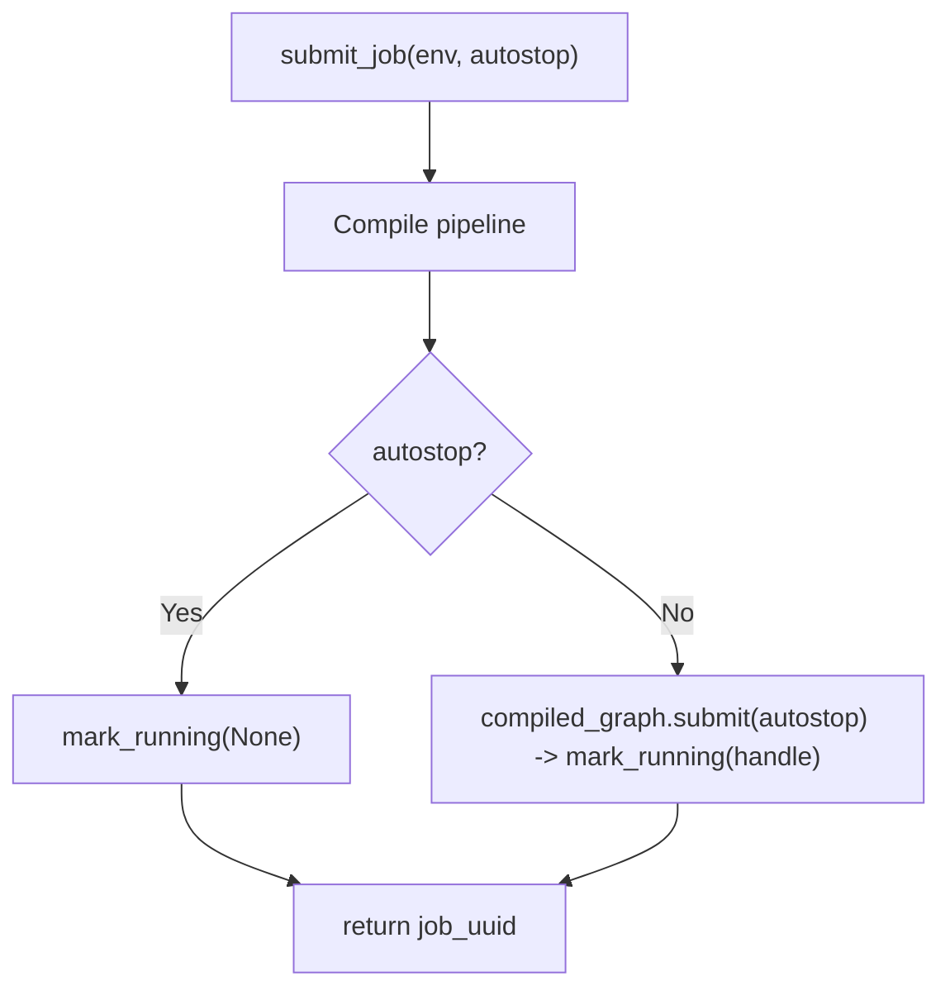
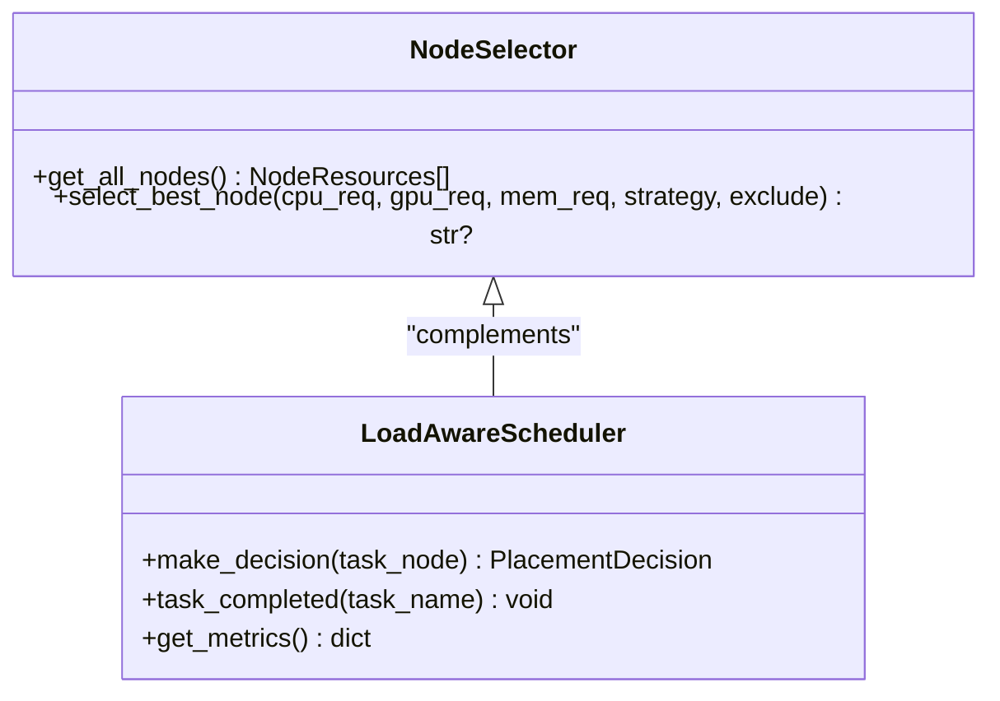
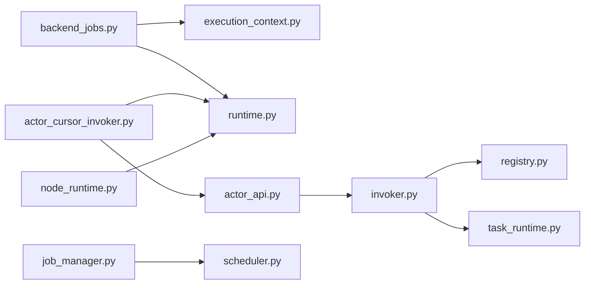

# Backend Jobs and Coordination

<cite>
**Referenced Files in This Document**
- [backend_jobs.py](file://src/sage/runtime/flownet/runtime/actors/backend_jobs.py)
- [execution_context.py](file://src/sage/runtime/flownet/runtime/actors/execution_context.py)
- [actor_api.py](file://src/sage/runtime/flownet/runtime/actors/actor_api.py)
- [task_runtime.py](file://src/sage/runtime/flownet/runtime/actors/task_runtime.py)
- [registry.py](file://src/sage/runtime/flownet/runtime/actors/registry.py)
- [invoker.py](file://src/sage/runtime/flownet/runtime/actors/invoker.py)
- [actor_cursor_invoker.py](file://src/sage/runtime/flownet/runtime/flowengine/actor_cursor_invoker.py)
- [runtime.py](file://src/sage/runtime/flownet/runtime/runtime.py)
- [node_runtime.py](file://src/sage/runtime/flownet/client/node_runtime.py)
- [job_manager.py](file://src/sage/runtime/job_manager.py)
- [scheduler.py](file://src/sage/runtime/scheduler.py)
</cite>

## Table of Contents
1. [Introduction](#introduction)
2. [Project Structure](#project-structure)
3. [Core Components](#core-components)
4. [Architecture Overview](#architecture-overview)
5. [Detailed Component Analysis](#detailed-component-analysis)
6. [Dependency Analysis](#dependency-analysis)
7. [Performance Considerations](#performance-considerations)
8. [Troubleshooting Guide](#troubleshooting-guide)
9. [Conclusion](#conclusion)

## Introduction
This document explains the backend job coordination system in the runtime layer, focusing on how jobs are submitted, scheduled, dispatched to actors, monitored, and completed. It covers the lifecycle of jobs, priority and resource-aware placement, and distributed execution patterns across a cluster. It also documents failure handling, retries, and recovery, and provides practical examples drawn from the codebase to illustrate end-to-end flows.

## Project Structure
The backend job coordination spans several modules:
- Actor-side job submission and backend requirement resolution
- Actor invocation and task runtime handling
- Flow engine invokers for local and remote actor calls
- Runtime orchestration for backend containers and polling
- Client utilities for job polling and acknowledgment
- Local job manager for lightweight orchestration
- Scheduler utilities for placement and load-aware decisions



**Diagram sources**
- [backend_jobs.py:14-83](file://src/sage/runtime/flownet/runtime/actors/backend_jobs.py#L14-L83)
- [execution_context.py:10-74](file://src/sage/runtime/flownet/runtime/actors/execution_context.py#L10-L74)
- [registry.py:28-109](file://src/sage/runtime/flownet/runtime/actors/registry.py#L28-L109)
- [invoker.py:25-115](file://src/sage/runtime/flownet/runtime/actors/invoker.py#L25-L115)
- [actor_api.py:18-84](file://src/sage/runtime/flownet/runtime/actors/actor_api.py#L18-L84)
- [task_runtime.py:53-115](file://src/sage/runtime/flownet/runtime/actors/task_runtime.py#L53-L115)
- [actor_cursor_invoker.py:13-128](file://src/sage/runtime/flownet/runtime/flowengine/actor_cursor_invoker.py#L13-L128)
- [runtime.py:662-687](file://src/sage/runtime/flownet/runtime/runtime.py#L662-L687)
- [node_runtime.py:1857-1882](file://src/sage/runtime/flownet/client/node_runtime.py#L1857-L1882)
- [job_manager.py:63-224](file://src/sage/runtime/job_manager.py#L63-L224)
- [scheduler.py:46-99](file://src/sage/runtime/scheduler.py#L46-L99)

**Section sources**
- [backend_jobs.py:14-83](file://src/sage/runtime/flownet/runtime/actors/backend_jobs.py#L14-L83)
- [execution_context.py:10-74](file://src/sage/runtime/flownet/runtime/actors/execution_context.py#L10-L74)
- [actor_api.py:18-84](file://src/sage/runtime/flownet/runtime/actors/actor_api.py#L18-L84)
- [invoker.py:25-115](file://src/sage/runtime/flownet/runtime/actors/invoker.py#L25-L115)
- [task_runtime.py:53-115](file://src/sage/runtime/flownet/runtime/actors/task_runtime.py#L53-L115)
- [actor_cursor_invoker.py:13-128](file://src/sage/runtime/flownet/runtime/flowengine/actor_cursor_invoker.py#L13-L128)
- [runtime.py:662-687](file://src/sage/runtime/flownet/runtime/runtime.py#L662-L687)
- [node_runtime.py:1857-1882](file://src/sage/runtime/flownet/client/node_runtime.py#L1857-L1882)
- [job_manager.py:63-224](file://src/sage/runtime/job_manager.py#L63-L224)
- [scheduler.py:46-99](file://src/sage/runtime/scheduler.py#L46-L99)

## Core Components
- Backend job submission and requirements resolution:
  - Central function resolves actor backend requirements, merges tags/capabilities, computes preferred backend affinity, and delegates to the runtime host to submit.
- Actor invocation and task runtime:
  - ActorInvoker coordinates local method execution, enforces task policies, and integrates with ActorTaskRuntime to handle task-return protocol and event emission.
- Flow engine invokers:
  - Cursor invoker builds a payload-first invoker that routes calls locally or via RPC, managing remote call traces and errors.
- Runtime orchestration:
  - Runtime encapsulates cluster backend job execution and polling, mapping tokens to backend/job identifiers.
- Client polling:
  - Client utilities poll backend jobs and optionally auto-acknowledge upon completion.
- Local job manager:
  - Lightweight orchestrator for in-process jobs, tracking status and lifecycle transitions.
- Scheduler:
  - NodeSelector and LoadAwareScheduler provide placement and load-aware scheduling primitives.

**Section sources**
- [backend_jobs.py:14-83](file://src/sage/runtime/flownet/runtime/actors/backend_jobs.py#L14-L83)
- [invoker.py:54-115](file://src/sage/runtime/flownet/runtime/actors/invoker.py#L54-L115)
- [task_runtime.py:72-115](file://src/sage/runtime/flownet/runtime/actors/task_runtime.py#L72-L115)
- [actor_cursor_invoker.py:42-128](file://src/sage/runtime/flownet/runtime/flowengine/actor_cursor_invoker.py#L42-L128)
- [runtime.py:662-687](file://src/sage/runtime/flownet/runtime/runtime.py#L662-L687)
- [node_runtime.py:1857-1882](file://src/sage/runtime/flownet/client/node_runtime.py#L1857-L1882)
- [job_manager.py:63-224](file://src/sage/runtime/job_manager.py#L63-L224)
- [scheduler.py:46-99](file://src/sage/runtime/scheduler.py#L46-L99)

## Architecture Overview
The backend job coordination architecture connects actor-level submission with runtime orchestration and distributed execution. Actors submit jobs with requirements; the runtime selects backends and executes tasks; clients poll and acknowledge completion.

```mermaid
sequenceDiagram
participant Actor as "Actor"
participant BJ as "submit_backend_job()"
participant Host as "Runtime Host"
participant RT as "Runtime"
participant BE as "Backend Container"
participant Client as "Client"
Actor->>BJ : "Submit job with request and requirements"
BJ->>Host : "submit_backend_job(request, tags, capabilities, preferred)"
Host->>RT : "Dispatch backend job"
RT->>BE : "Execute job"
Client->>RT : "Poll job by token"
RT-->>Client : "Poll result"
Client->>BE : "Ack job (optional)"
```

**Diagram sources**
- [backend_jobs.py:14-83](file://src/sage/runtime/flownet/runtime/actors/backend_jobs.py#L14-L83)
- [runtime.py:662-687](file://src/sage/runtime/flownet/runtime/runtime.py#L662-L687)
- [node_runtime.py:1857-1882](file://src/sage/runtime/flownet/client/node_runtime.py#L1857-L1882)

## Detailed Component Analysis

### Backend Job Submission and Dispatch
- Submission path:
  - The actor calls the central submission function, which resolves actor backend requirements, merges tags/capabilities, computes preferred backend affinity, and invokes the runtime host’s submit method.
- Backend selection:
  - Preferred backend can be derived from serving context and prefix cache key hashing against eligible backends.
- Execution context:
  - Submission requires an active actor execution context and runtime host.



**Diagram sources**
- [backend_jobs.py:14-83](file://src/sage/runtime/flownet/runtime/actors/backend_jobs.py#L14-L83)
- [execution_context.py:42-64](file://src/sage/runtime/flownet/runtime/actors/execution_context.py#L42-L64)

**Section sources**
- [backend_jobs.py:14-83](file://src/sage/runtime/flownet/runtime/actors/backend_jobs.py#L14-L83)
- [execution_context.py:42-64](file://src/sage/runtime/flownet/runtime/actors/execution_context.py#L42-L64)

### Actor Invocation and Task Runtime
- ActorInvoker:
  - Resolves target method, enforces synchronization constraints, applies task policy limits, and executes via executor lanes.
  - Tracks pending/running counts per actor and lane for observability.
- ActorTaskRuntime:
  - Handles task-return protocol, awaiting runtime-managed tasks, timeouts, and cancellation.
  - Emits and dispatches events captured during task execution.



**Diagram sources**
- [invoker.py:25-115](file://src/sage/runtime/flownet/runtime/actors/invoker.py#L25-L115)
- [task_runtime.py:53-115](file://src/sage/runtime/flownet/runtime/actors/task_runtime.py#L53-L115)
- [registry.py:28-109](file://src/sage/runtime/flownet/runtime/actors/registry.py#L28-L109)

**Section sources**
- [invoker.py:54-115](file://src/sage/runtime/flownet/runtime/actors/invoker.py#L54-L115)
- [task_runtime.py:72-115](file://src/sage/runtime/flownet/runtime/actors/task_runtime.py#L72-L115)
- [registry.py:28-109](file://src/sage/runtime/flownet/runtime/actors/registry.py#L28-L109)

### Flow Engine Actor Target Invoker
- Builds a payload-first invoker that:
  - Determines whether to execute locally or remotely.
  - Constructs remote call intents and routes them via the communication hub.
  - Captures trace metadata (event group, request ref, route plan) for diagnostics.
  - Handles remote reply modes and formats errors consistently.



**Diagram sources**
- [actor_cursor_invoker.py:42-128](file://src/sage/runtime/flownet/runtime/flowengine/actor_cursor_invoker.py#L42-L128)
- [actor_api.py:137-211](file://src/sage/runtime/flownet/runtime/actors/actor_api.py#L137-L211)

**Section sources**
- [actor_cursor_invoker.py:13-128](file://src/sage/runtime/flownet/runtime/flowengine/actor_cursor_invoker.py#L13-L128)
- [actor_api.py:137-211](file://src/sage/runtime/flownet/runtime/actors/actor_api.py#L137-L211)

### Runtime Orchestration and Polling
- Cluster backend job execution:
  - Runtime runs backend jobs, supports attempt plans and selection traces.
- Client polling:
  - Client polls backend jobs by token, normalizes results, and optionally auto-acknowledges.



**Diagram sources**
- [node_runtime.py:1857-1882](file://src/sage/runtime/flownet/client/node_runtime.py#L1857-L1882)
- [runtime.py:662-687](file://src/sage/runtime/flownet/runtime/runtime.py#L662-L687)

**Section sources**
- [node_runtime.py:1857-1882](file://src/sage/runtime/flownet/client/node_runtime.py#L1857-L1882)
- [runtime.py:662-687](file://src/sage/runtime/flownet/runtime/runtime.py#L662-L687)

### Local Job Manager (Lightweight Orchestrator)
- Manages in-process jobs with lifecycle:
  - Creation, running, stopping, failure marking, deletion, and status reporting.
- Provides health checks and cleanup routines.



**Diagram sources**
- [job_manager.py:86-114](file://src/sage/runtime/job_manager.py#L86-L114)

**Section sources**
- [job_manager.py:63-224](file://src/sage/runtime/job_manager.py#L63-L224)

### Scheduler and Resource Allocation
- NodeSelector:
  - Returns local node resources and selects best-fit nodes considering CPU/GPU/memory and task count.
- LoadAwareScheduler:
  - Enforces max concurrency, tracks active tasks, and records resource utilization and latency metrics.



**Diagram sources**
- [scheduler.py:46-99](file://src/sage/runtime/scheduler.py#L46-L99)
- [scheduler.py:171-243](file://src/sage/runtime/scheduler.py#L171-L243)

**Section sources**
- [scheduler.py:46-99](file://src/sage/runtime/scheduler.py#L46-L99)
- [scheduler.py:171-243](file://src/sage/runtime/scheduler.py#L171-L243)

## Dependency Analysis
- Actor submission depends on execution context and runtime host.
- Actor invocation depends on registry and task runtime.
- Flow engine invoker depends on actor API and communication hub.
- Runtime orchestration depends on backend containers and cluster router.
- Client polling depends on runtime host and backend containers.
- Local job manager depends on pipeline compilation and local backend.



**Diagram sources**
- [backend_jobs.py:14-83](file://src/sage/runtime/flownet/runtime/actors/backend_jobs.py#L14-L83)
- [execution_context.py:42-64](file://src/sage/runtime/flownet/runtime/actors/execution_context.py#L42-L64)
- [actor_api.py:18-84](file://src/sage/runtime/flownet/runtime/actors/actor_api.py#L18-L84)
- [invoker.py:25-115](file://src/sage/runtime/flownet/runtime/actors/invoker.py#L25-L115)
- [registry.py:28-109](file://src/sage/runtime/flownet/runtime/actors/registry.py#L28-L109)
- [task_runtime.py:53-115](file://src/sage/runtime/flownet/runtime/actors/task_runtime.py#L53-L115)
- [actor_cursor_invoker.py:13-128](file://src/sage/runtime/flownet/runtime/flowengine/actor_cursor_invoker.py#L13-L128)
- [runtime.py:662-687](file://src/sage/runtime/flownet/runtime/runtime.py#L662-L687)
- [node_runtime.py:1857-1882](file://src/sage/runtime/flownet/client/node_runtime.py#L1857-L1882)
- [job_manager.py:63-224](file://src/sage/runtime/job_manager.py#L63-L224)
- [scheduler.py:46-99](file://src/sage/runtime/scheduler.py#L46-L99)

**Section sources**
- [backend_jobs.py:14-83](file://src/sage/runtime/flownet/runtime/actors/backend_jobs.py#L14-L83)
- [actor_api.py:18-84](file://src/sage/runtime/flownet/runtime/actors/actor_api.py#L18-L84)
- [invoker.py:25-115](file://src/sage/runtime/flownet/runtime/actors/invoker.py#L25-L115)
- [actor_cursor_invoker.py:13-128](file://src/sage/runtime/flownet/runtime/flowengine/actor_cursor_invoker.py#L13-L128)
- [runtime.py:662-687](file://src/sage/runtime/flownet/runtime/runtime.py#L662-L687)
- [node_runtime.py:1857-1882](file://src/sage/runtime/flownet/client/node_runtime.py#L1857-L1882)
- [job_manager.py:63-224](file://src/sage/runtime/job_manager.py#L63-L224)
- [scheduler.py:46-99](file://src/sage/runtime/scheduler.py#L46-L99)

## Performance Considerations
- Concurrency and backpressure:
  - ActorInvoker enforces per-actor pending limits via task policy, preventing overload.
- Load-aware scheduling:
  - LoadAwareScheduler throttles based on active tasks and max concurrency, reducing contention.
- Resource-aware placement:
  - NodeSelector evaluates CPU/GPU/memory availability and spreads tasks to reduce hotspots.
- Event dispatch overhead:
  - ActorTaskRuntime batches event delivery and reports dispatch outcomes for observability.

[No sources needed since this section provides general guidance]

## Troubleshooting Guide
- Missing execution context or runtime host:
  - Submission raises explicit errors when context or host is unavailable.
- Remote call failures:
  - Cursor invoker classifies transport, target unreachable, and timeout errors and formats detailed traces.
- Client polling:
  - Poll returns None until completion; auto_ack removes token on success.
- Local job lifecycle:
  - JobManager marks jobs failed on submission exceptions and supports forced deletion.

**Section sources**
- [execution_context.py:46-64](file://src/sage/runtime/flownet/runtime/actors/execution_context.py#L46-L64)
- [actor_cursor_invoker.py:347-380](file://src/sage/runtime/flownet/runtime/flowengine/actor_cursor_invoker.py#L347-L380)
- [node_runtime.py:1857-1882](file://src/sage/runtime/flownet/client/node_runtime.py#L1857-L1882)
- [job_manager.py:112-114](file://src/sage/runtime/job_manager.py#L112-L114)

## Conclusion
The backend job coordination system integrates actor-level submission, robust invocation and task runtime handling, flow engine routing, and runtime orchestration across clusters. It provides clear lifecycle management, resource-aware scheduling, and observable failure handling. The included examples and diagrams map directly to the codebase, enabling both newcomers and experienced developers to understand and optimize job coordination.