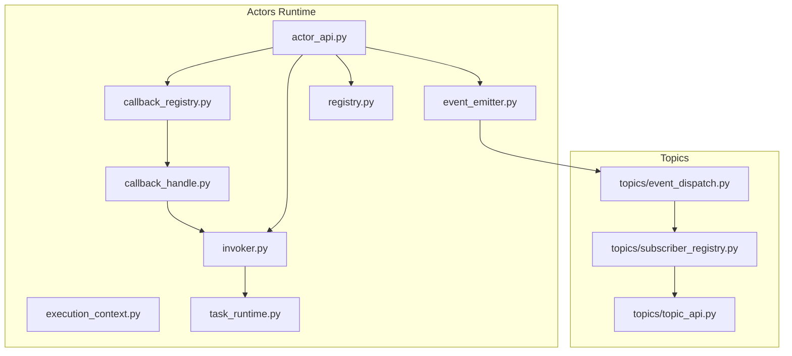
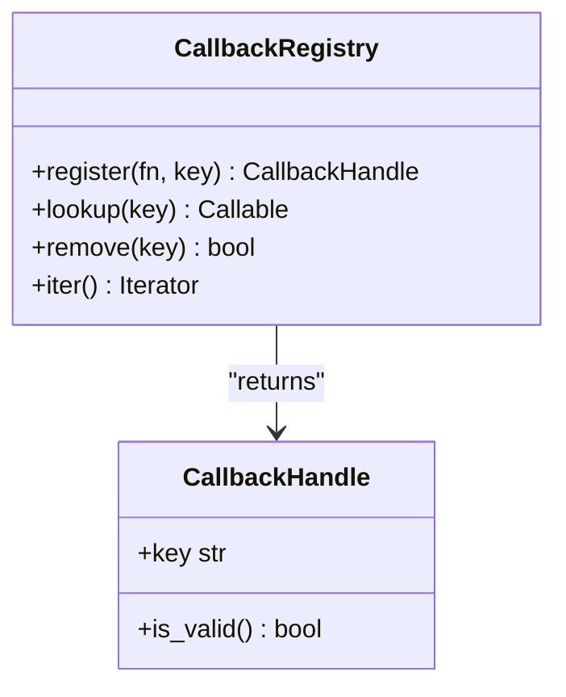
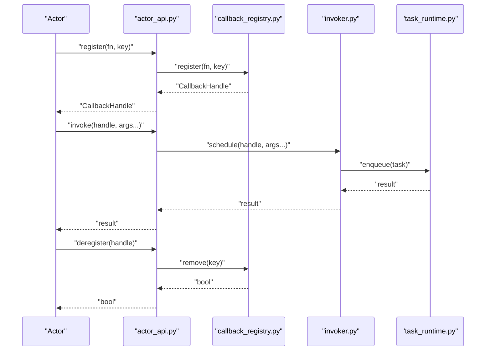
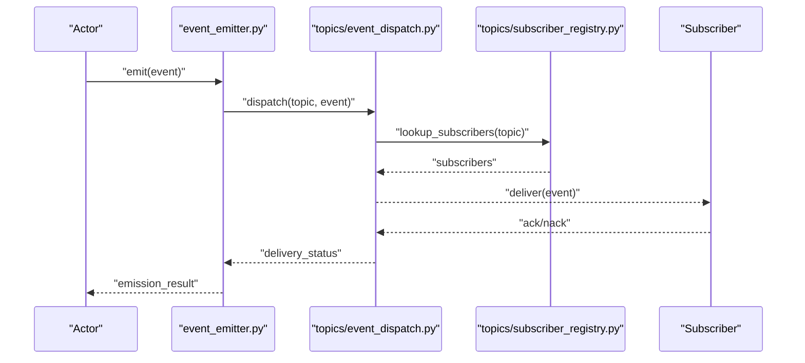
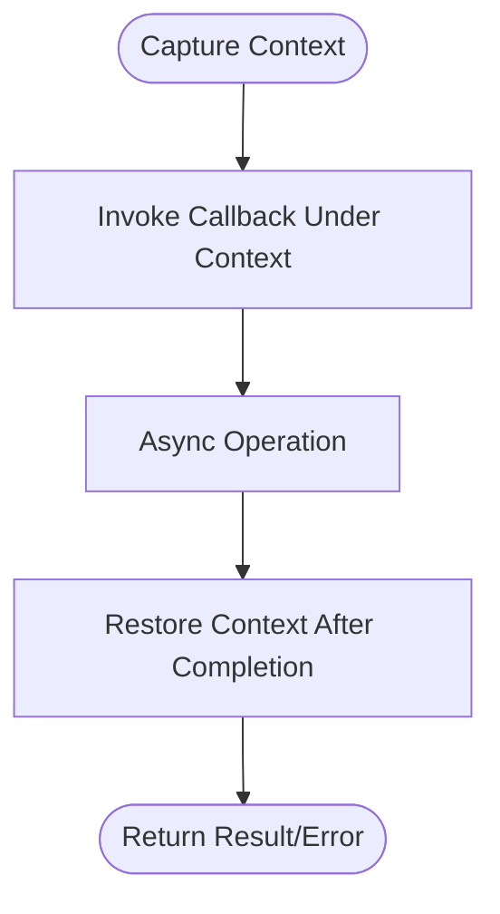
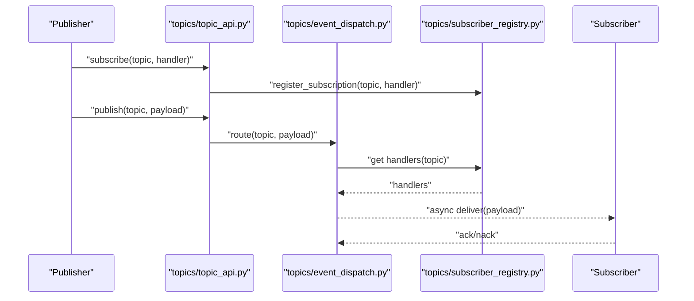
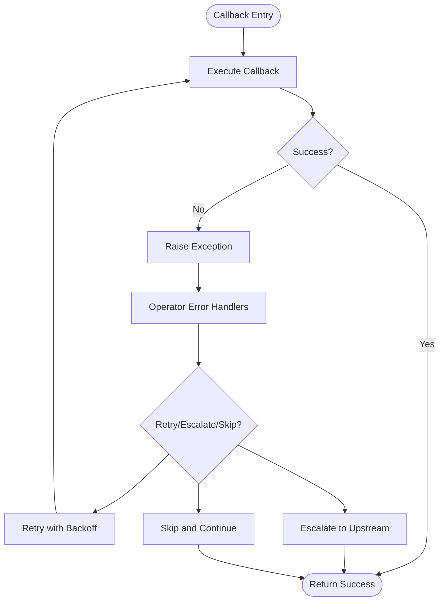
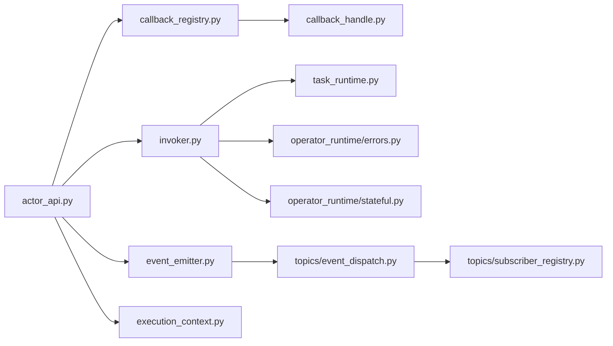

# Callback and Event Handling

<cite>
**Referenced Files in This Document**
- [callback_registry.py](file://src/sage/runtime/flownet/runtime/actors/callback_registry.py)
- [callback_handle.py](file://src/sage/runtime/flownet/runtime/actors/callback_handle.py)
- [event_emitter.py](file://src/sage/runtime/flownet/runtime/actors/event_emitter.py)
- [execution_context.py](file://src/sage/runtime/flownet/runtime/actors/execution_context.py)
- [invoker.py](file://src/sage/runtime/flownet/runtime/actors/invoker.py)
- [actor_api.py](file://src/sage/runtime/flownet/runtime/actors/actor_api.py)
- [registry.py](file://src/sage/runtime/flownet/runtime/actors/registry.py)
- [task_runtime.py](file://src/sage/runtime/flownet/runtime/actors/task_runtime.py)
- [topics/event_dispatch.py](file://src/sage/runtime/flownet/runtime/topics/event_dispatch.py)
- [topics/subscriber_registry.py](file://src/sage/runtime/flownet/runtime/topics/subscriber_registry.py)
- [topics/topic_api.py](file://src/sage/runtime/flownet/runtime/topics/topic_api.py)
- [operator_runtime/protocols.py](file://src/sage/runtime/flownet/runtime/operator_runtime/protocols.py)
- [operator_runtime/stateful.py](file://src/sage/runtime/flownet/runtime/operator_runtime/stateful.py)
- [operator_runtime/errors.py](file://src/sage/runtime/flownet/runtime/operator_runtime/errors.py)
</cite>

## Table of Contents
1. [Introduction](#introduction)
2. [Project Structure](#project-structure)
3. [Core Components](#core-components)
4. [Architecture Overview](#architecture-overview)
5. [Detailed Component Analysis](#detailed-component-analysis)
6. [Dependency Analysis](#dependency-analysis)
7. [Performance Considerations](#performance-considerations)
8. [Troubleshooting Guide](#troubleshooting-guide)
9. [Conclusion](#conclusion)

## Introduction
This document explains the callback and event handling mechanisms in the actor runtime. It covers how callbacks are registered, invoked, and cleaned up; how events are emitted and subscribed to; and how execution contexts are preserved across asynchronous operations. The goal is to help newcomers learn callback patterns while providing deep insights for advanced users building complex event-driven actor behaviors.

## Project Structure
The callback and event handling system lives under the runtime actors subsystem. Key modules include:
- Callback lifecycle: callback registry, callback handle
- Event emission and subscription: event emitter, topic dispatch, subscriber registry
- Execution context: preserving and restoring context during async operations
- Invocation and scheduling: invoker, task runtime
- Actor API surface and registry for actor lifecycle



**Diagram sources**
- [callback_registry.py](file://src/sage/runtime/flownet/runtime/actors/callback_registry.py)
- [callback_handle.py](file://src/sage/runtime/flownet/runtime/actors/callback_handle.py)
- [event_emitter.py](file://src/sage/runtime/flownet/runtime/actors/event_emitter.py)
- [execution_context.py](file://src/sage/runtime/flownet/runtime/actors/execution_context.py)
- [invoker.py](file://src/sage/runtime/flownet/runtime/actors/invoker.py)
- [actor_api.py](file://src/sage/runtime/flownet/runtime/actors/actor_api.py)
- [registry.py](file://src/sage/runtime/flownet/runtime/actors/registry.py)
- [task_runtime.py](file://src/sage/runtime/flownet/runtime/actors/task_runtime.py)
- [topics/event_dispatch.py](file://src/sage/runtime/flownet/runtime/topics/event_dispatch.py)
- [topics/subscriber_registry.py](file://src/sage/runtime/flownet/runtime/topics/subscriber_registry.py)
- [topics/topic_api.py](file://src/sage/runtime/flownet/runtime/topics/topic_api.py)

**Section sources**
- [callback_registry.py](file://src/sage/runtime/flownet/runtime/actors/callback_registry.py)
- [callback_handle.py](file://src/sage/runtime/flownet/runtime/actors/callback_handle.py)
- [event_emitter.py](file://src/sage/runtime/flownet/runtime/actors/event_emitter.py)
- [execution_context.py](file://src/sage/runtime/flownet/runtime/actors/execution_context.py)
- [invoker.py](file://src/sage/runtime/flownet/runtime/actors/invoker.py)
- [actor_api.py](file://src/sage/runtime/flownet/runtime/actors/actor_api.py)
- [registry.py](file://src/sage/runtime/flownet/runtime/actors/registry.py)
- [task_runtime.py](file://src/sage/runtime/flownet/runtime/actors/task_runtime.py)
- [topics/event_dispatch.py](file://src/sage/runtime/flownet/runtime/topics/event_dispatch.py)
- [topics/subscriber_registry.py](file://src/sage/runtime/flownet/runtime/topics/subscriber_registry.py)
- [topics/topic_api.py](file://src/sage/runtime/flownet/runtime/topics/topic_api.py)

## Core Components
- Callback Registry: central place to register, lookup, and remove callbacks; ensures uniqueness and safe removal.
- Callback Handle: opaque token returned upon registration; used to invoke or deregister callbacks safely.
- Event Emitter: emits typed events to subscribers; supports filtering and batching.
- Topic Dispatch: routes events to subscribers via topic routing and coordination.
- Subscriber Registry: maintains subscriptions per topic and manages lifecycle.
- Execution Context: preserves and restores context across async boundaries.
- Invoker and Task Runtime: schedule and execute callbacks with proper context and error handling.

**Section sources**
- [callback_registry.py](file://src/sage/runtime/flownet/runtime/actors/callback_registry.py)
- [callback_handle.py](file://src/sage/runtime/flownet/runtime/actors/callback_handle.py)
- [event_emitter.py](file://src/sage/runtime/flownet/runtime/actors/event_emitter.py)
- [execution_context.py](file://src/sage/runtime/flownet/runtime/actors/execution_context.py)
- [invoker.py](file://src/sage/runtime/flownet/runtime/actors/invoker.py)
- [task_runtime.py](file://src/sage/runtime/flownet/runtime/actors/task_runtime.py)
- [topics/event_dispatch.py](file://src/sage/runtime/flownet/runtime/topics/event_dispatch.py)
- [topics/subscriber_registry.py](file://src/sage/runtime/flownet/runtime/topics/subscriber_registry.py)
- [topics/topic_api.py](file://src/sage/runtime/flownet/runtime/topics/topic_api.py)

## Architecture Overview
The callback and event system integrates tightly with the actor runtime. Callbacks are registered against a registry and invoked through an invoker that respects execution context and scheduling. Events are emitted by actors and routed to subscribers via topic dispatch and subscriber registry.

```mermaid
sequenceDiagram
participant Actor as "Actor"
participant API as "actor_api.py"
participant Reg as "callback_registry.py"
participant Handle as "callback_handle.py"
participant Inv as "invoker.py"
participant Task as "task_runtime.py"
Actor->>API : "register_callback(fn, key)"
API->>Reg : "register(fn, key)"
Reg-->>API : "CallbackHandle"
API-->>Actor : "CallbackHandle"
Actor->>API : "invoke(handle, args...)"
API->>Inv : "schedule(handle, args...)"
Inv->>Task : "enqueue(task)"
Task-->>Inv : "result or error"
Inv-->>API : "result or error"
API-->>Actor : "result or propagated error"
```

**Diagram sources**
- [actor_api.py](file://src/sage/runtime/flownet/runtime/actors/actor_api.py)
- [callback_registry.py](file://src/sage/runtime/flownet/runtime/actors/callback_registry.py)
- [callback_handle.py](file://src/sage/runtime/flownet/runtime/actors/callback_handle.py)
- [invoker.py](file://src/sage/runtime/flownet/runtime/actors/invoker.py)
- [task_runtime.py](file://src/sage/runtime/flownet/runtime/actors/task_runtime.py)

## Detailed Component Analysis

### Callback Registry Management
The callback registry stores callback functions keyed by a unique identifier. It supports:
- Registration with a key
- Lookup by key
- Removal by key
- Iteration over registered callbacks



**Diagram sources**
- [callback_registry.py](file://src/sage/runtime/flownet/runtime/actors/callback_registry.py)
- [callback_handle.py](file://src/sage/runtime/flownet/runtime/actors/callback_handle.py)

**Section sources**
- [callback_registry.py](file://src/sage/runtime/flownet/runtime/actors/callback_registry.py)
- [callback_handle.py](file://src/sage/runtime/flownet/runtime/actors/callback_handle.py)

### Callback Registration, Invocation, and Deregistration
- Registration: Actors call the actor API to register a callable under a key. The registry returns a handle.
- Invocation: The handle is passed to the invoker, which schedules execution respecting execution context and lane assignment.
- Deregistration: The handle can be used to remove the callback from the registry.



**Diagram sources**
- [actor_api.py](file://src/sage/runtime/flownet/runtime/actors/actor_api.py)
- [callback_registry.py](file://src/sage/runtime/flownet/runtime/actors/callback_registry.py)
- [invoker.py](file://src/sage/runtime/flownet/runtime/actors/invoker.py)
- [task_runtime.py](file://src/sage/runtime/flownet/runtime/actors/task_runtime.py)

**Section sources**
- [actor_api.py](file://src/sage/runtime/flownet/runtime/actors/actor_api.py)
- [callback_registry.py](file://src/sage/runtime/flownet/runtime/actors/callback_registry.py)
- [invoker.py](file://src/sage/runtime/flownet/runtime/actors/invoker.py)
- [task_runtime.py](file://src/sage/runtime/flownet/runtime/actors/task_runtime.py)

### Event Emission Patterns
Event emission is performed by actors through the event emitter. Events are typed and routed to subscribers via topic dispatch and subscriber registry.



**Diagram sources**
- [event_emitter.py](file://src/sage/runtime/flownet/runtime/actors/event_emitter.py)
- [topics/event_dispatch.py](file://src/sage/runtime/flownet/runtime/topics/event_dispatch.py)
- [topics/subscriber_registry.py](file://src/sage/runtime/flownet/runtime/topics/subscriber_registry.py)

**Section sources**
- [event_emitter.py](file://src/sage/runtime/flownet/runtime/actors/event_emitter.py)
- [topics/event_dispatch.py](file://src/sage/runtime/flownet/runtime/topics/event_dispatch.py)
- [topics/subscriber_registry.py](file://src/sage/runtime/flownet/runtime/topics/subscriber_registry.py)

### Execution Context Preservation
Execution context ensures that contextual metadata (e.g., tenant, correlation ID, user identity) is preserved across asynchronous boundaries. The execution context module provides APIs to capture, propagate, and restore context during callback invocation.



**Diagram sources**
- [execution_context.py](file://src/sage/runtime/flownet/runtime/actors/execution_context.py)

**Section sources**
- [execution_context.py](file://src/sage/runtime/flownet/runtime/actors/execution_context.py)

### Asynchronous Event Processing and Subscription Patterns
Asynchronous event processing is coordinated through topic dispatch and subscriber registry. Subscribers can be registered per topic and receive events asynchronously. Delivery acknowledgments and failures are handled by the dispatch layer.



**Diagram sources**
- [topics/topic_api.py](file://src/sage/runtime/flownet/runtime/topics/topic_api.py)
- [topics/event_dispatch.py](file://src/sage/runtime/flownet/runtime/topics/event_dispatch.py)
- [topics/subscriber_registry.py](file://src/sage/runtime/flownet/runtime/topics/subscriber_registry.py)

**Section sources**
- [topics/topic_api.py](file://src/sage/runtime/flownet/runtime/topics/topic_api.py)
- [topics/event_dispatch.py](file://src/sage/runtime/flownet/runtime/topics/event_dispatch.py)
- [topics/subscriber_registry.py](file://src/sage/runtime/flownet/runtime/topics/subscriber_registry.py)

### Error Handling in Callback Chains and Exception Propagation
Errors raised during callback invocation are captured and propagated according to the runtime’s exception handling policies. Operator runtime provides error handling primitives and stateful execution helpers to recover or escalate failures.



**Diagram sources**
- [operator_runtime/errors.py](file://src/sage/runtime/flownet/runtime/operator_runtime/errors.py)
- [operator_runtime/stateful.py](file://src/sage/runtime/flownet/runtime/operator_runtime/stateful.py)

**Section sources**
- [operator_runtime/errors.py](file://src/sage/runtime/flownet/runtime/operator_runtime/errors.py)
- [operator_runtime/stateful.py](file://src/sage/runtime/flownet/runtime/operator_runtime/stateful.py)

## Dependency Analysis
The callback and event system exhibits layered dependencies:
- Actor API orchestrates registration, invocation, and deregistration.
- Callback registry and handle form the core callback lifecycle.
- Invoker and task runtime schedule and execute callbacks.
- Event emitter integrates with topic dispatch and subscriber registry.
- Execution context is injected into invocation paths.
- Operator runtime provides error handling and stateful execution support.



**Diagram sources**
- [actor_api.py](file://src/sage/runtime/flownet/runtime/actors/actor_api.py)
- [callback_registry.py](file://src/sage/runtime/flownet/runtime/actors/callback_registry.py)
- [callback_handle.py](file://src/sage/runtime/flownet/runtime/actors/callback_handle.py)
- [invoker.py](file://src/sage/runtime/flownet/runtime/actors/invoker.py)
- [task_runtime.py](file://src/sage/runtime/flownet/runtime/actors/task_runtime.py)
- [event_emitter.py](file://src/sage/runtime/flownet/runtime/actors/event_emitter.py)
- [topics/event_dispatch.py](file://src/sage/runtime/flownet/runtime/topics/event_dispatch.py)
- [topics/subscriber_registry.py](file://src/sage/runtime/flownet/runtime/topics/subscriber_registry.py)
- [execution_context.py](file://src/sage/runtime/flownet/runtime/actors/execution_context.py)
- [operator_runtime/errors.py](file://src/sage/runtime/flownet/runtime/operator_runtime/errors.py)
- [operator_runtime/stateful.py](file://src/sage/runtime/flownet/runtime/operator_runtime/stateful.py)

**Section sources**
- [actor_api.py](file://src/sage/runtime/flownet/runtime/actors/actor_api.py)
- [callback_registry.py](file://src/sage/runtime/flownet/runtime/actors/callback_registry.py)
- [callback_handle.py](file://src/sage/runtime/flownet/runtime/actors/callback_handle.py)
- [invoker.py](file://src/sage/runtime/flownet/runtime/actors/invoker.py)
- [task_runtime.py](file://src/sage/runtime/flownet/runtime/actors/task_runtime.py)
- [event_emitter.py](file://src/sage/runtime/flownet/runtime/actors/event_emitter.py)
- [topics/event_dispatch.py](file://src/sage/runtime/flownet/runtime/topics/event_dispatch.py)
- [topics/subscriber_registry.py](file://src/sage/runtime/flownet/runtime/topics/subscriber_registry.py)
- [execution_context.py](file://src/sage/runtime/flownet/runtime/actors/execution_context.py)
- [operator_runtime/errors.py](file://src/sage/runtime/flownet/runtime/operator_runtime/errors.py)
- [operator_runtime/stateful.py](file://src/sage/runtime/flownet/runtime/operator_runtime/stateful.py)

## Performance Considerations
- Minimize callback overhead: prefer batching and coalescing where appropriate to reduce scheduling churn.
- Limit callback lifetime: deregister callbacks promptly to avoid leaks and stale references.
- Use execution lanes: route heavy callbacks to dedicated lanes to prevent head-of-line blocking.
- Avoid deep callback chains: flatten nested callbacks and use structured concurrency to bound stack depth.
- Monitor memory: long-lived callbacks can retain closures; periodically review callback sets and clean up unused entries.
- Tune task runtime: adjust concurrency limits and backpressure thresholds to match workload characteristics.

[No sources needed since this section provides general guidance]

## Troubleshooting Guide
- Callback not found: verify the registration key and ensure the handle is still valid.
- Invocation fails silently: check operator error handlers and stateful execution logs for suppressed exceptions.
- Event not delivered: confirm topic subscription exists and delivery acknowledgments are being sent.
- Memory growth: audit callback registry for leaked keys and unsubscribe unused topics.
- Context loss: ensure execution context is captured before async boundaries and restored after completion.

**Section sources**
- [operator_runtime/errors.py](file://src/sage/runtime/flownet/runtime/operator_runtime/errors.py)
- [operator_runtime/stateful.py](file://src/sage/runtime/flownet/runtime/operator_runtime/stateful.py)
- [topics/subscriber_registry.py](file://src/sage/runtime/flownet/runtime/topics/subscriber_registry.py)

## Conclusion
The callback and event handling system provides a robust foundation for asynchronous, context-aware actor behaviors. By leveraging the callback registry, handle-based invocation, and topic-based event emission, developers can build scalable and maintainable event-driven systems. Proper context preservation, error handling, and lifecycle management are essential for production-grade implementations.

[No sources needed since this section summarizes without analyzing specific files]