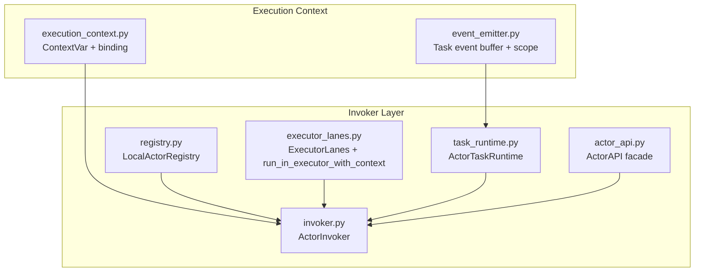
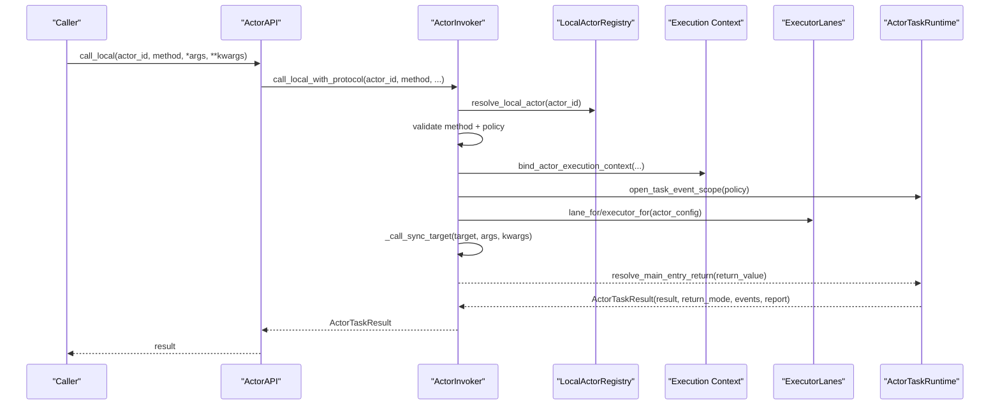
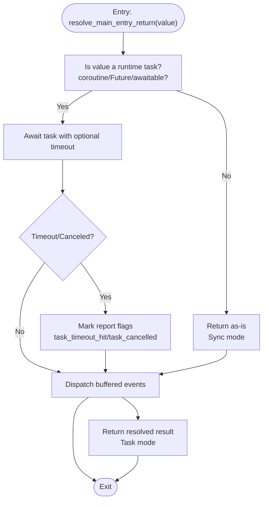
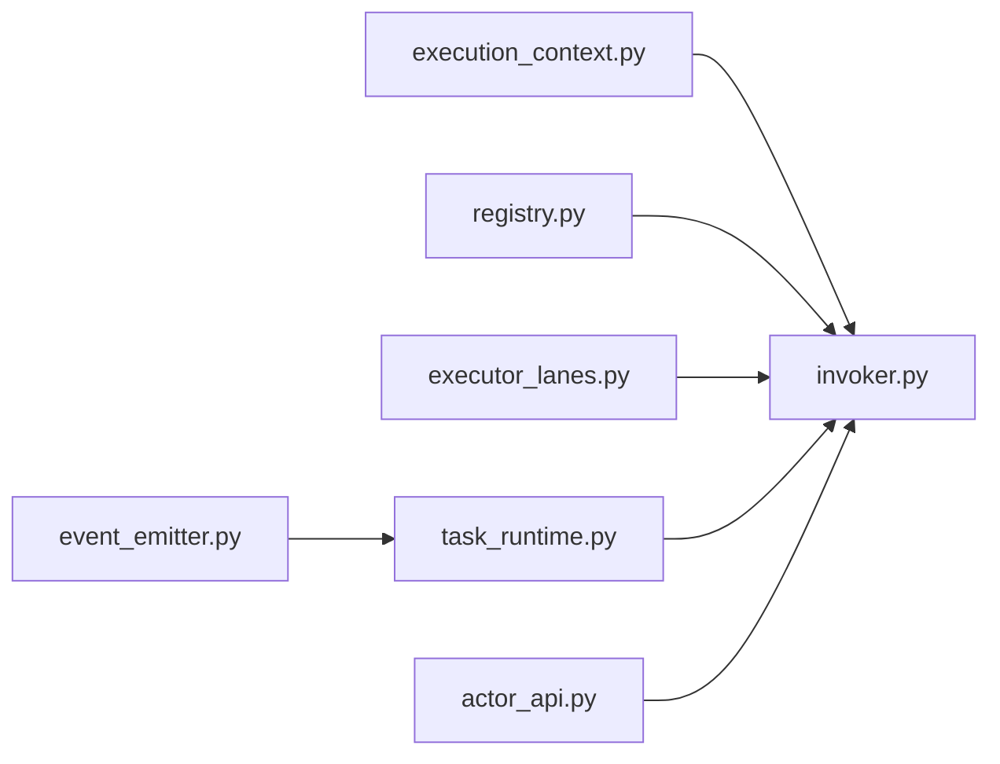

# Execution Context and Invoker System

<cite>
**Referenced Files in This Document**
- [execution_context.py](file://src/sage/runtime/flownet/runtime/actors/execution_context.py)
- [invoker.py](file://src/sage/runtime/flownet/runtime/actors/invoker.py)
- [actor_api.py](file://src/sage/runtime/flownet/runtime/actors/actor_api.py)
- [task_runtime.py](file://src/sage/runtime/flownet/runtime/actors/task_runtime.py)
- [executor_lanes.py](file://src/sage/runtime/flownet/runtime/actors/executor_lanes.py)
- [registry.py](file://src/sage/runtime/flownet/runtime/actors/registry.py)
- [event_emitter.py](file://src/sage/runtime/flownet/runtime/actors/event_emitter.py)
- [callback_registry.py](file://src/sage/runtime/flownet/runtime/actors/callback_registry.py)
</cite>

## Table of Contents
1. [Introduction](#introduction)
2. [Project Structure](#project-structure)
3. [Core Components](#core-components)
4. [Architecture Overview](#architecture-overview)
5. [Detailed Component Analysis](#detailed-component-analysis)
6. [Dependency Analysis](#dependency-analysis)
7. [Performance Considerations](#performance-considerations)
8. [Troubleshooting Guide](#troubleshooting-guide)
9. [Conclusion](#conclusion)

## Introduction
This document explains the Execution Context and Invoker System used by the Flownet actor runtime. It covers how execution contexts are created and bound around actor invocations, how context isolation is enforced, and how the invoker pattern orchestrates method invocation, parameter marshalling, and return value processing. It also documents context switching, nested context handling, resource cleanup, thread safety, concurrent access patterns, and performance optimization techniques. The goal is to make the system understandable for newcomers while providing deep technical insights for advanced implementers.

## Project Structure
The Execution Context and Invoker System spans several modules within the actors runtime:
- Execution context management and isolation
- Invoker orchestration and policy enforcement
- Task runtime resolution for synchronous vs. asynchronous returns
- Executor lanes for thread pool management and context propagation
- Registry for local actor discovery and locking
- Event emission and buffering scoped to tasks
- Optional callback registry for topic-driven callbacks

**Diagram sources**
- [execution_context.py:1-75](file://src/sage/runtime/flownet/runtime/actors/execution_context.py#L1-L75)
- [event_emitter.py:1-218](file://src/sage/runtime/flownet/runtime/actors/event_emitter.py#L1-L218)
- [actor_api.py:1-262](file://src/sage/runtime/flownet/runtime/actors/actor_api.py#L1-L262)
- [invoker.py:1-308](file://src/sage/runtime/flownet/runtime/actors/invoker.py#L1-L308)
- [registry.py:1-155](file://src/sage/runtime/flownet/runtime/actors/registry.py#L1-L155)
- [task_runtime.py:1-231](file://src/sage/runtime/flownet/runtime/actors/task_runtime.py#L1-L231)
- [executor_lanes.py:1-252](file://src/sage/runtime/flownet/runtime/actors/executor_lanes.py#L1-L252)

**Section sources**
- [execution_context.py:1-75](file://src/sage/runtime/flownet/runtime/actors/execution_context.py#L1-L75)
- [invoker.py:1-308](file://src/sage/runtime/flownet/runtime/actors/invoker.py#L1-L308)
- [actor_api.py:1-262](file://src/sage/runtime/flownet/runtime/actors/actor_api.py#L1-L262)
- [task_runtime.py:1-231](file://src/sage/runtime/flownet/runtime/actors/task_runtime.py#L1-L231)
- [executor_lanes.py:1-252](file://src/sage/runtime/flownet/runtime/actors/executor_lanes.py#L1-L252)
- [registry.py:1-155](file://src/sage/runtime/flownet/runtime/actors/registry.py#L1-L155)
- [event_emitter.py:1-218](file://src/sage/runtime/flownet/runtime/actors/event_emitter.py#L1-L218)

## Core Components
- Execution Context: Provides a thread-safe, contextvar-backed context carrying actor identity, configuration, and runtime host. It is bound around invocations to ensure downstream code can access the current actor context.
- Invoker: Orchestrates local actor calls, enforces task policies, manages pending/running counts, and coordinates execution on appropriate executors while preserving context across sync and async boundaries.
- Task Runtime: Resolves whether a method’s return is a direct value or a runtime-managed task (coroutine, Future, or awaitable), applies timeouts/cancellations, and dispatches buffered events.
- Executor Lanes: Selects and manages thread pools per actor or lane, ensuring context is propagated into executor threads.
- Registry: Stores local actor instances, exposes locks for serialized access, and resolves actor references.
- Event Emitter: Buffers actor-emitted events during a task and supports ordering policies; ensures emissions occur only within a task scope.
- Actor API: Public facade exposing registration, invocation, and observability snapshots; delegates to the invoker and task runtime.

**Section sources**
- [execution_context.py:10-74](file://src/sage/runtime/flownet/runtime/actors/execution_context.py#L10-L74)
- [invoker.py:25-307](file://src/sage/runtime/flownet/runtime/actors/invoker.py#L25-L307)
- [task_runtime.py:29-230](file://src/sage/runtime/flownet/runtime/actors/task_runtime.py#L29-L230)
- [executor_lanes.py:62-251](file://src/sage/runtime/flownet/runtime/actors/executor_lanes.py#L62-L251)
- [registry.py:28-154](file://src/sage/runtime/flownet/runtime/actors/registry.py#L28-L154)
- [event_emitter.py:13-217](file://src/sage/runtime/flownet/runtime/actors/event_emitter.py#L13-L217)
- [actor_api.py:18-261](file://src/sage/runtime/flownet/runtime/actors/actor_api.py#L18-L261)

## Architecture Overview
The invoker pattern creates a controlled execution boundary around actor methods. It validates the target, enforces policies, binds the execution context, opens a task event scope, and executes the method either synchronously or asynchronously depending on the method’s signature and configuration. The task runtime then resolves the return value, applies timeouts, and dispatches buffered events.

**Diagram sources**
- [actor_api.py:77-220](file://src/sage/runtime/flownet/runtime/actors/actor_api.py#L77-L220)
- [invoker.py:50-114](file://src/sage/runtime/flownet/runtime/actors/invoker.py#L50-L114)
- [execution_context.py:23-43](file://src/sage/runtime/flownet/runtime/actors/execution_context.py#L23-L43)
- [executor_lanes.py:86-124](file://src/sage/runtime/flownet/runtime/actors/executor_lanes.py#L86-L124)
- [task_runtime.py:62-115](file://src/sage/runtime/flownet/runtime/actors/task_runtime.py#L62-L115)

## Detailed Component Analysis

### Execution Context Management
- Data model: A frozen dataclass holds actor_id, actor_config, and runtime_host.
- Context storage: A ContextVar stores the current execution context.
- Binding: A context manager sets the context for the duration of an invocation and resets it afterward.
- Accessors: Safe getters and required getters raise meaningful errors when context is missing.

Key behaviors:
- Thread safety: Uses contextvars to isolate context per thread.
- Resource cleanup: The context manager guarantees reset in finally blocks.
- Nested handling: Because contextvars are thread-scoped, nested bindings are safe; innermost binding overrides outer ones.

Concrete usage examples (paths only):
- Bind context around an invocation: [invoker.py:88-92](file://src/sage/runtime/flownet/runtime/actors/invoker.py#L88-L92)
- Retrieve current context: [execution_context.py:42-43](file://src/sage/runtime/flownet/runtime/actors/execution_context.py#L42-L43)
- Require runtime host: [execution_context.py:60-64](file://src/sage/runtime/flownet/runtime/actors/execution_context.py#L60-L64)

**Section sources**
- [execution_context.py:10-74](file://src/sage/runtime/flownet/runtime/actors/execution_context.py#L10-L74)

### Invoker Pattern Implementation
Responsibilities:
- Resolve actor target from the registry.
- Validate method existence and signature.
- Enforce task policies (pending limits, timeouts, parallel tools).
- Acquire/release pending slots and track running counts.
- Bind execution context and open task event scope.
- Execute the target synchronously via executor lanes with context propagation.
- Resolve return value via task runtime and return an ActorTaskResult.

Concurrency and policy enforcement:
- Pending slot acquisition uses a lock to prevent exceeding max_pending.
- Running counts are tracked per actor to reflect concurrency.
- Lane selection and executor retrieval are thread-safe and cached.

Parameter marshalling and return processing:
- Arguments and keyword arguments are passed through to the target.
- Return value is processed by the task runtime to detect runtime-managed tasks and apply timeouts.

Concrete usage examples (paths only):
- Call local actor: [invoker.py:50-114](file://src/sage/runtime/flownet/runtime/actors/invoker.py#L50-L114)
- Synchronous target execution: [invoker.py:116-161](file://src/sage/runtime/flownet/runtime/actors/invoker.py#L116-L161)
- Pending/running accounting: [invoker.py:163-197](file://src/sage/runtime/flownet/runtime/actors/invoker.py#L163-L197)

**Section sources**
- [invoker.py:25-307](file://src/sage/runtime/flownet/runtime/actors/invoker.py#L25-L307)

### Task Runtime and Return Resolution
Responsibilities:
- Determine if a return value is a runtime-managed task (coroutine, Future, or awaitable).
- Await tasks with optional timeout and cancellation handling.
- Dispatch buffered events after task completion or on exceptions.
- Build a runtime report capturing policy-related metrics.

Flow for return resolution:

**Diagram sources**
- [task_runtime.py:72-115](file://src/sage/runtime/flownet/runtime/actors/task_runtime.py#L72-L115)

Concrete usage examples (paths only):
- Event scope opening: [invoker.py:93-95](file://src/sage/runtime/flownet/runtime/actors/invoker.py#L93-L95)
- Task result resolution: [invoker.py:106-112](file://src/sage/runtime/flownet/runtime/actors/invoker.py#L106-L112)
- Event dispatch: [task_runtime.py:117-165](file://src/sage/runtime/flownet/runtime/actors/task_runtime.py#L117-L165)

**Section sources**
- [task_runtime.py:29-230](file://src/sage/runtime/flownet/runtime/actors/task_runtime.py#L29-L230)

### Executor Lanes and Context Propagation
Responsibilities:
- Select a sync lane based on actor configuration.
- Manage thread pools per actor or globally, with optional per-actor overrides.
- Run callables in the selected executor while propagating the current context.

Key mechanisms:
- Context propagation: run_in_executor_with_context copies the current context and runs the bound function inside the executor.
- Lane selection: resolve_sync_lane chooses among supported lanes.
- Policy-based workers: resolve_policy_max_workers extracts max_workers from task policy.

Concrete usage examples (paths only):
- Context-aware executor run: [executor_lanes.py:50-59](file://src/sage/runtime/flownet/runtime/actors/executor_lanes.py#L50-L59)
- Lane selection: [executor_lanes.py:86-88](file://src/sage/runtime/flownet/runtime/actors/executor_lanes.py#L86-L88)
- Executor retrieval: [executor_lanes.py:86-124](file://src/sage/runtime/flownet/runtime/actors/executor_lanes.py#L86-L124)

**Section sources**
- [executor_lanes.py:14-251](file://src/sage/runtime/flownet/runtime/actors/executor_lanes.py#L14-L251)

### Registry and Locking
Responsibilities:
- Register local actors with associated configuration and per-actor lock.
- Resolve actor records for invocation.
- Provide method references and listing facilities.

Locking behavior:
- Each actor record carries a threading.Lock to serialize access when configured.
- The invoker conditionally wraps the target call in this lock based on a marker.

Concrete usage examples (paths only):
- Resolve actor: [invoker.py:61-67](file://src/sage/runtime/flownet/runtime/actors/invoker.py#L61-L67)
- Lock usage: [invoker.py:147-159](file://src/sage/runtime/flownet/runtime/actors/invoker.py#L147-L159)

**Section sources**
- [registry.py:28-154](file://src/sage/runtime/flownet/runtime/actors/registry.py#L28-L154)

### Event Emission and Task Scoping
Responsibilities:
- Buffer actor-emitted events during a task.
- Support ordering policies (emit order or sequence ascending).
- Enforce that emissions occur only within a task event scope.

Scope mechanics:
- A contextvar-backed buffer is created per task and destroyed upon exit.
- Emission APIs require an active task scope; otherwise, an error is raised.

Concrete usage examples (paths only):
- Open task scope: [invoker.py:93-95](file://src/sage/runtime/flownet/runtime/actors/invoker.py#L93-L95)
- Emit/publish events: [event_emitter.py:120-153](file://src/sage/runtime/flownet/runtime/actors/event_emitter.py#L120-L153)
- Scope resolution: [event_emitter.py:109-117](file://src/sage/runtime/flownet/runtime/actors/event_emitter.py#L109-L117)

**Section sources**
- [event_emitter.py:13-217](file://src/sage/runtime/flownet/runtime/actors/event_emitter.py#L13-L217)

### Actor API Facade
Responsibilities:
- Provide a public API for registering actors, invoking methods, and observing runtime state.
- Delegate to the invoker and task runtime.
- Support callback registration for topic-driven invocations.

Observability:
- Exposes snapshots for invocation, executor lanes, and callbacks.

Concrete usage examples (paths only):
- Local call: [actor_api.py:77-84](file://src/sage/runtime/flownet/runtime/actors/actor_api.py#L77-L84)
- Call intent protocol: [actor_api.py:137-211](file://src/sage/runtime/flownet/runtime/actors/actor_api.py#L137-L211)
- Observability snapshots: [actor_api.py:125-135](file://src/sage/runtime/flownet/runtime/actors/actor_api.py#L125-L135)

**Section sources**
- [actor_api.py:18-261](file://src/sage/runtime/flownet/runtime/actors/actor_api.py#L18-L261)

### Callback Registry (Contextual Note)
While not part of the core invoker flow, the callback registry demonstrates how actor contexts and runtime hosts are used in distributed callback scenarios. It registers callbacks locally or remotely and invokes actor methods in response to topic events.

Concrete usage examples (paths only):
- Remote registration: [callback_registry.py:317-336](file://src/sage/runtime/flownet/runtime/actors/callback_registry.py#L317-L336)
- Local registration: [callback_registry.py:296-302](file://src/sage/runtime/flownet/runtime/actors/callback_registry.py#L296-L302)

**Section sources**
- [callback_registry.py:230-435](file://src/sage/runtime/flownet/runtime/actors/callback_registry.py#L230-L435)

## Dependency Analysis
The following diagram shows the primary dependencies among the execution context and invoker components:

**Diagram sources**
- [execution_context.py:1-75](file://src/sage/runtime/flownet/runtime/actors/execution_context.py#L1-L75)
- [invoker.py:1-308](file://src/sage/runtime/flownet/runtime/actors/invoker.py#L1-L308)
- [registry.py:1-155](file://src/sage/runtime/flownet/runtime/actors/registry.py#L1-L155)
- [executor_lanes.py:1-252](file://src/sage/runtime/flownet/runtime/actors/executor_lanes.py#L1-L252)
- [task_runtime.py:1-231](file://src/sage/runtime/flownet/runtime/actors/task_runtime.py#L1-L231)
- [event_emitter.py:1-218](file://src/sage/runtime/flownet/runtime/actors/event_emitter.py#L1-L218)
- [actor_api.py:1-262](file://src/sage/runtime/flownet/runtime/actors/actor_api.py#L1-L262)

**Section sources**
- [invoker.py:1-308](file://src/sage/runtime/flownet/runtime/actors/invoker.py#L1-L308)
- [task_runtime.py:1-231](file://src/sage/runtime/flownet/runtime/actors/task_runtime.py#L1-L231)
- [executor_lanes.py:1-252](file://src/sage/runtime/flownet/runtime/actors/executor_lanes.py#L1-L252)
- [registry.py:1-155](file://src/sage/runtime/flownet/runtime/actors/registry.py#L1-L155)
- [execution_context.py:1-75](file://src/sage/runtime/flownet/runtime/actors/execution_context.py#L1-L75)
- [event_emitter.py:1-218](file://src/sage/runtime/flownet/runtime/actors/event_emitter.py#L1-L218)
- [actor_api.py:1-262](file://src/sage/runtime/flownet/runtime/actors/actor_api.py#L1-L262)

## Performance Considerations
- Executor lane selection: Choose lanes based on workload characteristics (e.g., dedicated lanes for specific frameworks) to avoid contention.
- Pending and running counters: Tune max_pending and max_parallel_tools to balance throughput and resource usage.
- Timeout handling: Configure task_timeout_ms to prevent long-running tasks from blocking the system.
- Event dispatch: Keep event volumes reasonable; heavy event dispatch can impact latency.
- Lock-free vs. locked calls: Use the no-lock marker for methods that are inherently thread-safe to reduce serialization overhead.
- Context propagation cost: Context copying is inexpensive but avoid excessive nesting; keep the scope minimal.

[No sources needed since this section provides general guidance]

## Troubleshooting Guide
Common issues and diagnostics:
- Missing execution context: Ensure the context is bound around invocations; use required getters to surface missing context errors.
  - Example path: [execution_context.py:46-50](file://src/sage/runtime/flownet/runtime/actors/execution_context.py#L46-L50)
- Method not found or invalid signature: The invoker validates method existence and rejects coroutines as main entries.
  - Example path: [invoker.py:61-71](file://src/sage/runtime/flownet/runtime/actors/invoker.py#L61-L71)
- Pending limit exceeded: Increase max_pending or reduce concurrency.
  - Example path: [invoker.py:166-174](file://src/sage/runtime/flownet/runtime/actors/invoker.py#L166-L174)
- Task timeout or cancellation: Inspect runtime report flags and adjust task_timeout_ms.
  - Example path: [task_runtime.py:99-108](file://src/sage/runtime/flownet/runtime/actors/task_runtime.py#L99-L108)
- Emission outside task scope: Ensure emissions occur within the task event scope.
  - Example path: [event_emitter.py:167-171](file://src/sage/runtime/flownet/runtime/actors/event_emitter.py#L167-L171)
- Executor shutdown: Avoid submitting work after executor lanes shutdown.
  - Example path: [executor_lanes.py:92-93](file://src/sage/runtime/flownet/runtime/actors/executor_lanes.py#L92-L93)

**Section sources**
- [execution_context.py:46-50](file://src/sage/runtime/flownet/runtime/actors/execution_context.py#L46-L50)
- [invoker.py:61-71](file://src/sage/runtime/flownet/runtime/actors/invoker.py#L61-L71)
- [invoker.py:166-174](file://src/sage/runtime/flownet/runtime/actors/invoker.py#L166-L174)
- [task_runtime.py:99-108](file://src/sage/runtime/flownet/runtime/actors/task_runtime.py#L99-L108)
- [event_emitter.py:167-171](file://src/sage/runtime/flownet/runtime/actors/event_emitter.py#L167-L171)
- [executor_lanes.py:92-93](file://src/sage/runtime/flownet/runtime/actors/executor_lanes.py#L92-L93)

## Conclusion
The Execution Context and Invoker System provides a robust, thread-safe framework for actor invocation. It isolates context per thread, enforces policies, and cleanly separates concerns between invocation orchestration, task resolution, and executor management. By leveraging contextvars, executor context propagation, and task-scoped event buffers, it supports both simplicity for beginners and the flexibility needed for advanced patterns.

[No sources needed since this section summarizes without analyzing specific files]