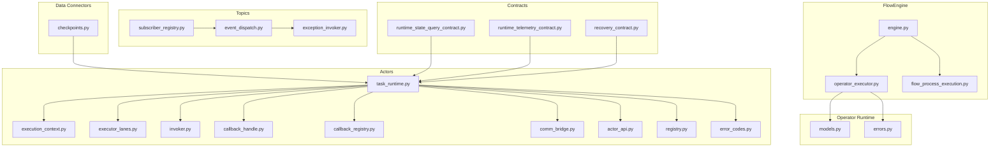
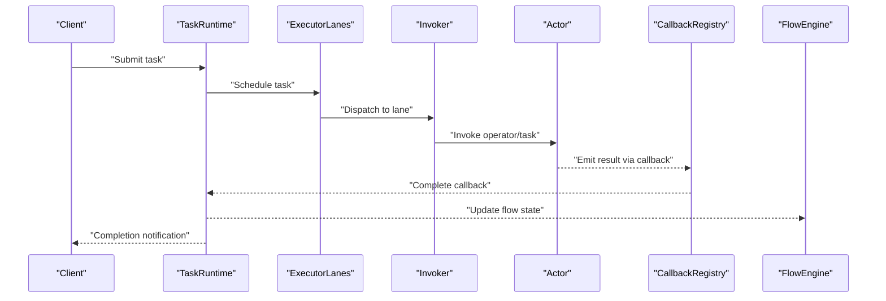
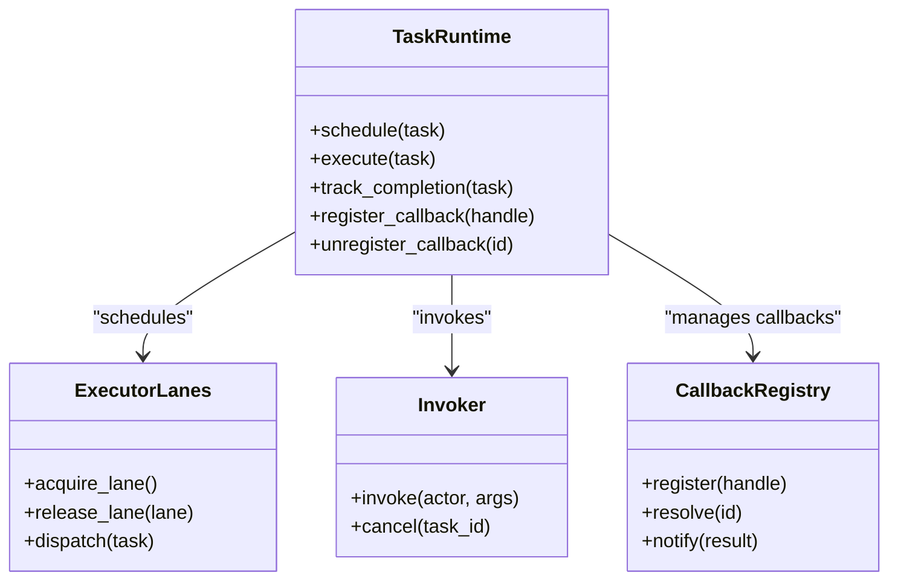
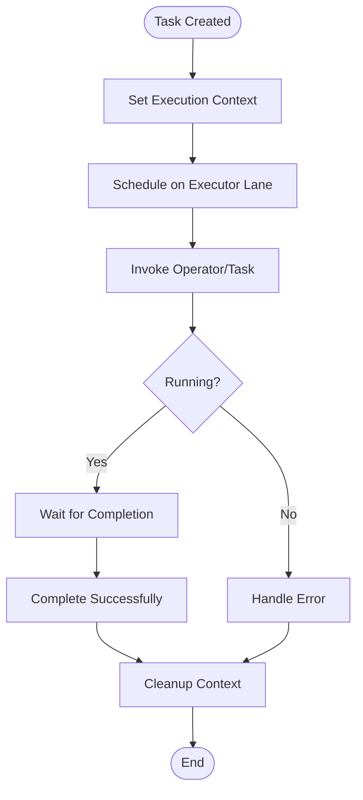
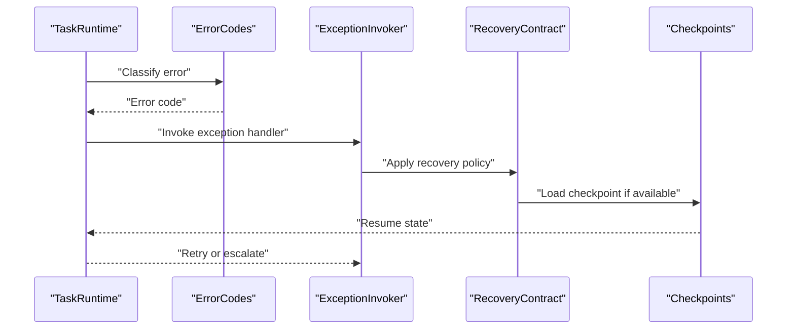
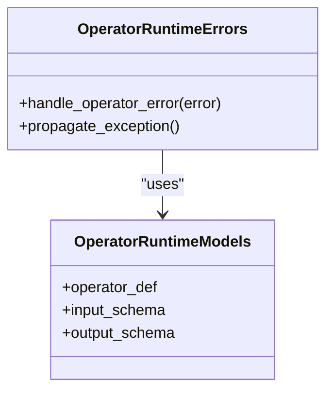
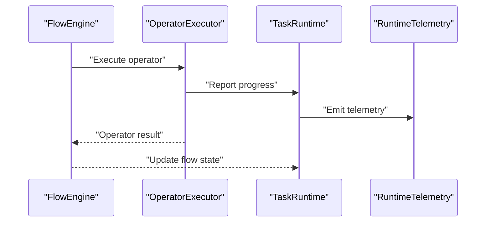
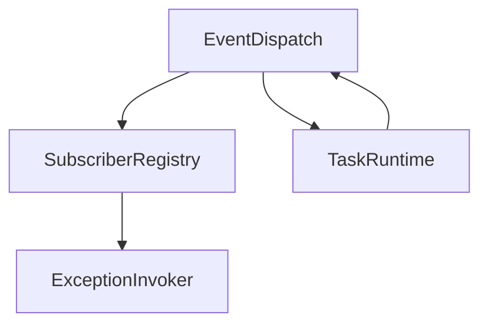
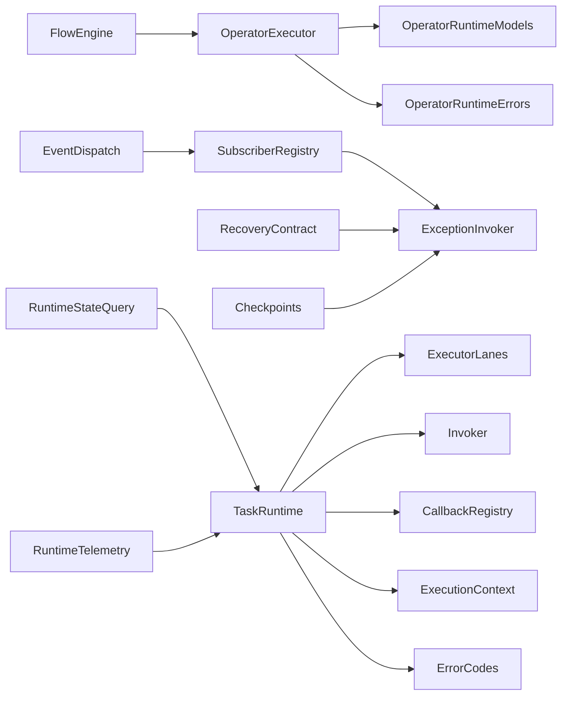

# Task Runtime and Management

<cite>
**Referenced Files in This Document**
- [task_runtime.py](file://src/sage/runtime/flownet/runtime/actors/task_runtime.py)
- [error_codes.py](file://src/sage/runtime/flownet/runtime/actors/error_codes.py)
- [execution_context.py](file://src/sage/runtime/flownet/runtime/actors/execution_context.py)
- [executor_lanes.py](file://src/sage/runtime/flownet/runtime/actors/executor_lanes.py)
- [invoker.py](file://src/sage/runtime/flownet/runtime/actors/invoker.py)
- [callback_handle.py](file://src/sage/runtime/flownet/runtime/actors/callback_handle.py)
- [callback_registry.py](file://src/sage/runtime/flownet/runtime/actors/callback_registry.py)
- [comm_bridge.py](file://src/sage/runtime/flownet/runtime/actors/comm_bridge.py)
- [actor_api.py](file://src/sage/runtime/flownet/runtime/actors/actor_api.py)
- [registry.py](file://src/sage/runtime/flownet/runtime/actors/registry.py)
- [runtime.py](file://src/sage/runtime/flownet/runtime/runtime.py)
- [flowengine/engine.py](file://src/sage/runtime/flownet/runtime/flowengine/engine.py)
- [flowengine/operator_executor.py](file://src/sage/runtime/flownet/runtime/flowengine/operator_executor.py)
- [flowengine/flow_process_execution.py](file://src/sage/runtime/flownet/runtime/flowengine/flow_process_execution.py)
- [operator_runtime/models.py](file://src/sage/runtime/flownet/runtime/operator_runtime/models.py)
- [operator_runtime/errors.py](file://src/sage/runtime/flownet/runtime/operator_runtime/errors.py)
- [topics/event_dispatch.py](file://src/sage/runtime/flownet/runtime/topics/event_dispatch.py)
- [topics/subscriber_registry.py](file://src/sage/runtime/flownet/runtime/topics/subscriber_registry.py)
- [topics/exception_invoker.py](file://src/sage/runtime/flownet/runtime/topics/exception_invoker.py)
- [contracts/runtime_state_query_contract.py](file://src/sage/runtime/flownet/contracts/runtime_state_query_contract.py)
- [contracts/runtime_telemetry_contract.py](file://src/sage/runtime/flownet/contracts/runtime_telemetry_contract.py)
- [contracts/recovery_contract.py](file://src/sage/runtime/flownet/contracts/recovery_contract.py)
- [data/connectors/checkpoints.py](file://src/sage/runtime/flownet/data/connectors/checkpoints.py)
</cite>

## Table of Contents
1. [Introduction](#introduction)
2. [Project Structure](#project-structure)
3. [Core Components](#core-components)
4. [Architecture Overview](#architecture-overview)
5. [Detailed Component Analysis](#detailed-component-analysis)
6. [Dependency Analysis](#dependency-analysis)
7. [Performance Considerations](#performance-considerations)
8. [Troubleshooting Guide](#troubleshooting-guide)
9. [Conclusion](#conclusion)
10. [Appendices](#appendices)

## Introduction
This document explains the Task Runtime and Management subsystem within the FlowNet runtime. It covers how tasks are defined, scheduled, executed, tracked, and recovered; how errors are handled and propagated; and how the task runtime integrates with the broader FlowNet engine and related systems. The content is structured to be accessible to newcomers while offering deep insights for advanced users optimizing reliability and performance.

## Project Structure
The task runtime spans several modules under the FlowNet runtime:
- Actors subsystem: task scheduling, execution lanes, callbacks, communication bridge, and error code definitions
- FlowEngine: orchestration of flow processes, operator execution, and exception handling
- Operator Runtime: operator-level models and error handling
- Topics: event dispatch, subscriber registry, and exception invocation
- Contracts: runtime state queries, telemetry, and recovery contracts
- Data Connectors: checkpoints for fault tolerance

**Diagram sources**
- [task_runtime.py](file://src/sage/runtime/flownet/runtime/actors/task_runtime.py)
- [executor_lanes.py](file://src/sage/runtime/flownet/runtime/actors/executor_lanes.py)
- [invoker.py](file://src/sage/runtime/flownet/runtime/actors/invoker.py)
- [comm_bridge.py](file://src/sage/runtime/flownet/runtime/actors/comm_bridge.py)
- [error_codes.py](file://src/sage/runtime/flownet/runtime/actors/error_codes.py)
- [execution_context.py](file://src/sage/runtime/flownet/runtime/actors/execution_context.py)
- [callback_handle.py](file://src/sage/runtime/flownet/runtime/actors/callback_handle.py)
- [callback_registry.py](file://src/sage/runtime/flownet/runtime/actors/callback_registry.py)
- [actor_api.py](file://src/sage/runtime/flownet/runtime/actors/actor_api.py)
- [registry.py](file://src/sage/runtime/flownet/runtime/actors/registry.py)
- [flowengine/engine.py](file://src/sage/runtime/flownet/runtime/flowengine/engine.py)
- [flowengine/operator_executor.py](file://src/sage/runtime/flownet/runtime/flowengine/operator_executor.py)
- [flowengine/flow_process_execution.py](file://src/sage/runtime/flownet/runtime/flowengine/flow_process_execution.py)
- [operator_runtime/models.py](file://src/sage/runtime/flownet/runtime/operator_runtime/models.py)
- [operator_runtime/errors.py](file://src/sage/runtime/flownet/runtime/operator_runtime/errors.py)
- [topics/event_dispatch.py](file://src/sage/runtime/flownet/runtime/topics/event_dispatch.py)
- [topics/subscriber_registry.py](file://src/sage/runtime/flownet/runtime/topics/subscriber_registry.py)
- [topics/exception_invoker.py](file://src/sage/runtime/flownet/runtime/topics/exception_invoker.py)
- [contracts/runtime_state_query_contract.py](file://src/sage/runtime/flownet/contracts/runtime_state_query_contract.py)
- [contracts/runtime_telemetry_contract.py](file://src/sage/runtime/flownet/contracts/runtime_telemetry_contract.py)
- [contracts/recovery_contract.py](file://src/sage/runtime/flownet/contracts/recovery_contract.py)
- [data/connectors/checkpoints.py](file://src/sage/runtime/flownet/data/connectors/checkpoints.py)

**Section sources**
- [task_runtime.py](file://src/sage/runtime/flownet/runtime/actors/task_runtime.py)
- [runtime.py](file://src/sage/runtime/flownet/runtime/runtime.py)

## Core Components
- Task Runtime: central orchestrator for task creation, scheduling, execution, and completion tracking
- Executor Lanes: concurrency and parallelism lanes for task execution
- Execution Context: per-task context propagation and lifecycle management
- Invoker: dispatch mechanism for invoking tasks and operators
- Callback Registry and Handles: asynchronous result delivery and callback management
- Communication Bridge: inter-actor messaging and coordination
- Error Codes: standardized error classification and recovery hints
- Actor API and Registry: actor discovery and invocation APIs
- FlowEngine: higher-level orchestration of flow processes and operator execution
- Operator Runtime: operator-level models and error handling
- Topics: event-driven coordination via dispatch and subscriber registry
- Contracts: runtime state queries, telemetry, and recovery contracts
- Data Connectors: checkpoints for fault tolerance and recovery

**Section sources**
- [task_runtime.py](file://src/sage/runtime/flownet/runtime/actors/task_runtime.py)
- [executor_lanes.py](file://src/sage/runtime/flownet/runtime/actors/executor_lanes.py)
- [execution_context.py](file://src/sage/runtime/flownet/runtime/actors/execution_context.py)
- [invoker.py](file://src/sage/runtime/flownet/runtime/actors/invoker.py)
- [callback_handle.py](file://src/sage/runtime/flownet/runtime/actors/callback_handle.py)
- [callback_registry.py](file://src/sage/runtime/flownet/runtime/actors/callback_registry.py)
- [comm_bridge.py](file://src/sage/runtime/flownet/runtime/actors/comm_bridge.py)
- [error_codes.py](file://src/sage/runtime/flownet/runtime/actors/error_codes.py)
- [actor_api.py](file://src/sage/runtime/flownet/runtime/actors/actor_api.py)
- [registry.py](file://src/sage/runtime/flownet/runtime/actors/registry.py)
- [flowengine/engine.py](file://src/sage/runtime/flownet/runtime/flowengine/engine.py)
- [flowengine/operator_executor.py](file://src/sage/runtime/flownet/runtime/flowengine/operator_executor.py)
- [operator_runtime/models.py](file://src/sage/runtime/flownet/runtime/operator_runtime/models.py)
- [operator_runtime/errors.py](file://src/sage/runtime/flownet/runtime/operator_runtime/errors.py)
- [topics/event_dispatch.py](file://src/sage/runtime/flownet/runtime/topics/event_dispatch.py)
- [topics/subscriber_registry.py](file://src/sage/runtime/flownet/runtime/topics/subscriber_registry.py)
- [contracts/runtime_state_query_contract.py](file://src/sage/runtime/flownet/contracts/runtime_state_query_contract.py)
- [contracts/runtime_telemetry_contract.py](file://src/sage/runtime/flownet/contracts/runtime_telemetry_contract.py)
- [contracts/recovery_contract.py](file://src/sage/runtime/flownet/contracts/recovery_contract.py)
- [data/connectors/checkpoints.py](file://src/sage/runtime/flownet/data/connectors/checkpoints.py)

## Architecture Overview
The task runtime integrates tightly with the FlowNet engine and operator runtime. Tasks are scheduled onto executor lanes, executed via invokers, and tracked through callbacks. Errors are classified and routed to exception handlers, with recovery guided by contracts and checkpoints.

**Diagram sources**
- [task_runtime.py](file://src/sage/runtime/flownet/runtime/actors/task_runtime.py)
- [executor_lanes.py](file://src/sage/runtime/flownet/runtime/actors/executor_lanes.py)
- [invoker.py](file://src/sage/runtime/flownet/runtime/actors/invoker.py)
- [callback_registry.py](file://src/sage/runtime/flownet/runtime/actors/callback_registry.py)
- [flowengine/engine.py](file://src/sage/runtime/flownet/runtime/flowengine/engine.py)

## Detailed Component Analysis

### Task Runtime Core
The task runtime manages task lifecycle: creation, scheduling, execution, and completion. It coordinates with executor lanes, invoker, and callback registry to ensure reliable execution and result delivery.

**Diagram sources**
- [task_runtime.py](file://src/sage/runtime/flownet/runtime/actors/task_runtime.py)
- [executor_lanes.py](file://src/sage/runtime/flownet/runtime/actors/executor_lanes.py)
- [invoker.py](file://src/sage/runtime/flownet/runtime/actors/invoker.py)
- [callback_registry.py](file://src/sage/runtime/flownet/runtime/actors/callback_registry.py)

**Section sources**
- [task_runtime.py](file://src/sage/runtime/flownet/runtime/actors/task_runtime.py)
- [executor_lanes.py](file://src/sage/runtime/flownet/runtime/actors/executor_lanes.py)
- [invoker.py](file://src/sage/runtime/flownet/runtime/actors/invoker.py)
- [callback_registry.py](file://src/sage/runtime/flownet/runtime/actors/callback_registry.py)

### Execution Context and Lifecycle
Execution context encapsulates per-task state, timeouts, and cancellation tokens. It ensures consistent lifecycle management across task execution.

**Diagram sources**
- [execution_context.py](file://src/sage/runtime/flownet/runtime/actors/execution_context.py)
- [task_runtime.py](file://src/sage/runtime/flownet/runtime/actors/task_runtime.py)

**Section sources**
- [execution_context.py](file://src/sage/runtime/flownet/runtime/actors/execution_context.py)
- [task_runtime.py](file://src/sage/runtime/flownet/runtime/actors/task_runtime.py)

### Error Handling and Recovery
Errors are categorized via error codes and routed to exception handlers. Recovery follows contracts and checkpoints.

**Diagram sources**
- [error_codes.py](file://src/sage/runtime/flownet/runtime/actors/error_codes.py)
- [topics/exception_invoker.py](file://src/sage/runtime/flownet/runtime/topics/exception_invoker.py)
- [contracts/recovery_contract.py](file://src/sage/runtime/flownet/contracts/recovery_contract.py)
- [data/connectors/checkpoints.py](file://src/sage/runtime/flownet/data/connectors/checkpoints.py)

**Section sources**
- [error_codes.py](file://src/sage/runtime/flownet/runtime/actors/error_codes.py)
- [topics/exception_invoker.py](file://src/sage/runtime/flownet/runtime/topics/exception_invoker.py)
- [contracts/recovery_contract.py](file://src/sage/runtime/flownet/contracts/recovery_contract.py)
- [data/connectors/checkpoints.py](file://src/sage/runtime/flownet/data/connectors/checkpoints.py)

### Operator Runtime and Exception Handling
Operator runtime defines models and error handling strategies used during task execution.

**Diagram sources**
- [operator_runtime/models.py](file://src/sage/runtime/flownet/runtime/operator_runtime/models.py)
- [operator_runtime/errors.py](file://src/sage/runtime/flownet/runtime/operator_runtime/errors.py)

**Section sources**
- [operator_runtime/models.py](file://src/sage/runtime/flownet/runtime/operator_runtime/models.py)
- [operator_runtime/errors.py](file://src/sage/runtime/flownet/runtime/operator_runtime/errors.py)

### FlowEngine Orchestration
FlowEngine coordinates flow processes and operator execution, integrating with task runtime for state updates and telemetry.

**Diagram sources**
- [flowengine/engine.py](file://src/sage/runtime/flownet/runtime/flowengine/engine.py)
- [flowengine/operator_executor.py](file://src/sage/runtime/flownet/runtime/flowengine/operator_executor.py)
- [contracts/runtime_telemetry_contract.py](file://src/sage/runtime/flownet/contracts/runtime_telemetry_contract.py)

**Section sources**
- [flowengine/engine.py](file://src/sage/runtime/flownet/runtime/flowengine/engine.py)
- [flowengine/operator_executor.py](file://src/sage/runtime/flownet/runtime/flowengine/operator_executor.py)
- [contracts/runtime_telemetry_contract.py](file://src/sage/runtime/flownet/contracts/runtime_telemetry_contract.py)

### Event-Driven Coordination
Event dispatch and subscriber registry enable decoupled coordination among actors and runtime components.

**Diagram sources**
- [topics/event_dispatch.py](file://src/sage/runtime/flownet/runtime/topics/event_dispatch.py)
- [topics/subscriber_registry.py](file://src/sage/runtime/flownet/runtime/topics/subscriber_registry.py)
- [topics/exception_invoker.py](file://src/sage/runtime/flownet/runtime/topics/exception_invoker.py)
- [task_runtime.py](file://src/sage/runtime/flownet/runtime/actors/task_runtime.py)

**Section sources**
- [topics/event_dispatch.py](file://src/sage/runtime/flownet/runtime/topics/event_dispatch.py)
- [topics/subscriber_registry.py](file://src/sage/runtime/flownet/runtime/topics/subscriber_registry.py)
- [topics/exception_invoker.py](file://src/sage/runtime/flownet/runtime/topics/exception_invoker.py)
- [task_runtime.py](file://src/sage/runtime/flownet/runtime/actors/task_runtime.py)

## Dependency Analysis
Key dependencies and interactions:
- TaskRuntime depends on ExecutorLanes, Invoker, CallbackRegistry, ExecutionContext, and ErrorCodes
- FlowEngine depends on OperatorExecutor and Telemetry contracts
- OperatorRuntime provides models and error handling used by FlowEngine
- Topics provide event-driven coordination
- Contracts define runtime state queries and recovery policies
- Data Connectors support fault tolerance via checkpoints

**Diagram sources**
- [task_runtime.py](file://src/sage/runtime/flownet/runtime/actors/task_runtime.py)
- [executor_lanes.py](file://src/sage/runtime/flownet/runtime/actors/executor_lanes.py)
- [invoker.py](file://src/sage/runtime/flownet/runtime/actors/invoker.py)
- [callback_registry.py](file://src/sage/runtime/flownet/runtime/actors/callback_registry.py)
- [execution_context.py](file://src/sage/runtime/flownet/runtime/actors/execution_context.py)
- [error_codes.py](file://src/sage/runtime/flownet/runtime/actors/error_codes.py)
- [flowengine/engine.py](file://src/sage/runtime/flownet/runtime/flowengine/engine.py)
- [flowengine/operator_executor.py](file://src/sage/runtime/flownet/runtime/flowengine/operator_executor.py)
- [operator_runtime/models.py](file://src/sage/runtime/flownet/runtime/operator_runtime/models.py)
- [operator_runtime/errors.py](file://src/sage/runtime/flownet/runtime/operator_runtime/errors.py)
- [topics/event_dispatch.py](file://src/sage/runtime/flownet/runtime/topics/event_dispatch.py)
- [topics/subscriber_registry.py](file://src/sage/runtime/flownet/runtime/topics/subscriber_registry.py)
- [topics/exception_invoker.py](file://src/sage/runtime/flownet/runtime/topics/exception_invoker.py)
- [contracts/runtime_state_query_contract.py](file://src/sage/runtime/flownet/contracts/runtime_state_query_contract.py)
- [contracts/runtime_telemetry_contract.py](file://src/sage/runtime/flownet/contracts/runtime_telemetry_contract.py)
- [contracts/recovery_contract.py](file://src/sage/runtime/flownet/contracts/recovery_contract.py)
- [data/connectors/checkpoints.py](file://src/sage/runtime/flownet/data/connectors/checkpoints.py)

**Section sources**
- [task_runtime.py](file://src/sage/runtime/flownet/runtime/actors/task_runtime.py)
- [flowengine/engine.py](file://src/sage/runtime/flownet/runtime/flowengine/engine.py)
- [operator_runtime/models.py](file://src/sage/runtime/flownet/runtime/operator_runtime/models.py)
- [operator_runtime/errors.py](file://src/sage/runtime/flownet/runtime/operator_runtime/errors.py)
- [topics/event_dispatch.py](file://src/sage/runtime/flownet/runtime/topics/event_dispatch.py)
- [topics/subscriber_registry.py](file://src/sage/runtime/flownet/runtime/topics/subscriber_registry.py)
- [topics/exception_invoker.py](file://src/sage/runtime/flownet/runtime/topics/exception_invoker.py)
- [contracts/runtime_state_query_contract.py](file://src/sage/runtime/flownet/contracts/runtime_state_query_contract.py)
- [contracts/runtime_telemetry_contract.py](file://src/sage/runtime/flownet/contracts/runtime_telemetry_contract.py)
- [contracts/recovery_contract.py](file://src/sage/runtime/flownet/contracts/recovery_contract.py)
- [data/connectors/checkpoints.py](file://src/sage/runtime/flownet/data/connectors/checkpoints.py)

## Performance Considerations
- Concurrency and Parallelism: Executor lanes balance throughput and resource contention; tune lane counts and task priorities to optimize utilization.
- Scheduling: Prefer batching and coalescing callbacks to reduce overhead; leverage invoker caching for repeated tasks.
- Memory and State: Execution contexts should minimize retained references; use checkpoints to avoid recomputation on restart.
- Telemetry: Emit lightweight metrics and events; avoid synchronous heavy operations in hot paths.
- Network and Communication: Use the communication bridge judiciously; batch messages where possible.

[No sources needed since this section provides general guidance]

## Troubleshooting Guide
Common issues and strategies:
- Task stuck or not completing:
  - Verify executor lanes availability and task scheduling logs
  - Check callback registration and resolution
  - Inspect execution context for cancellation or timeout signals
- Frequent errors:
  - Review error codes and exception invoker decisions
  - Confirm recovery contract applicability and checkpoint restoration
- Performance bottlenecks:
  - Profile operator execution and telemetry emission
  - Adjust lane parallelism and task prioritization
- Graceful shutdown:
  - Cancel pending tasks and drain executor lanes
  - Persist state and checkpoints before termination

**Section sources**
- [error_codes.py](file://src/sage/runtime/flownet/runtime/actors/error_codes.py)
- [topics/exception_invoker.py](file://src/sage/runtime/flownet/runtime/topics/exception_invoker.py)
- [contracts/recovery_contract.py](file://src/sage/runtime/flownet/contracts/recovery_contract.py)
- [data/connectors/checkpoints.py](file://src/sage/runtime/flownet/data/connectors/checkpoints.py)
- [execution_context.py](file://src/sage/runtime/flownet/runtime/actors/execution_context.py)
- [callback_registry.py](file://src/sage/runtime/flownet/runtime/actors/callback_registry.py)

## Conclusion
The FlowNet task runtime provides a robust foundation for task-based execution, combining efficient scheduling, resilient execution contexts, and comprehensive error handling. By leveraging executor lanes, invokers, callbacks, and contracts, it supports scalable and reliable task processing integrated with the broader FlowNet engine and operator runtime.

[No sources needed since this section summarizes without analyzing specific files]

## Appendices
- Integration with FlowNet runtime: Task runtime collaborates with FlowEngine and operator runtime for end-to-end orchestration and state management.
- Monitoring and Observability: Use runtime telemetry contracts to collect metrics and diagnostics for operational visibility.

[No sources needed since this section provides general guidance]