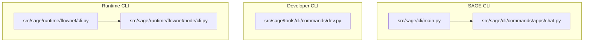
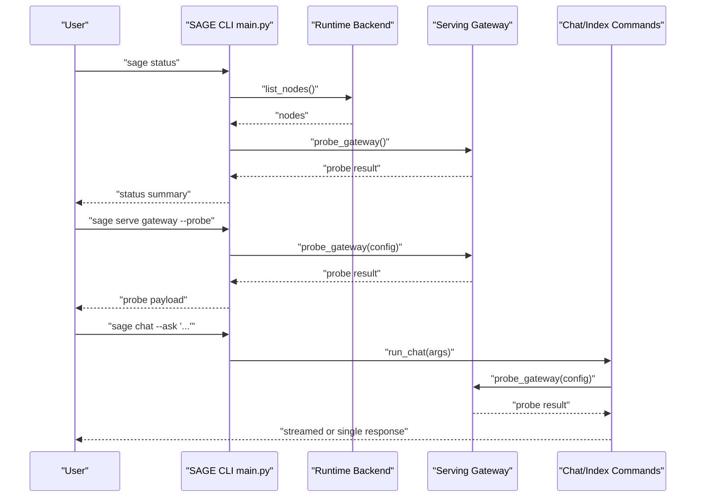
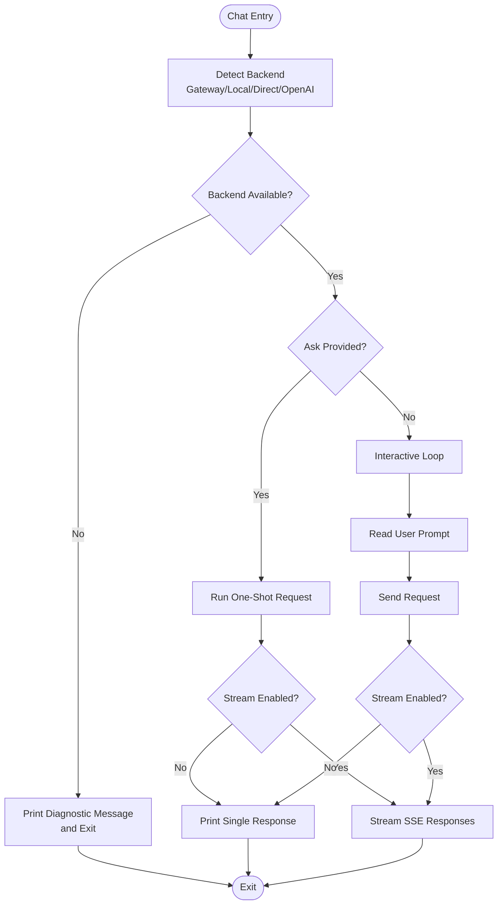
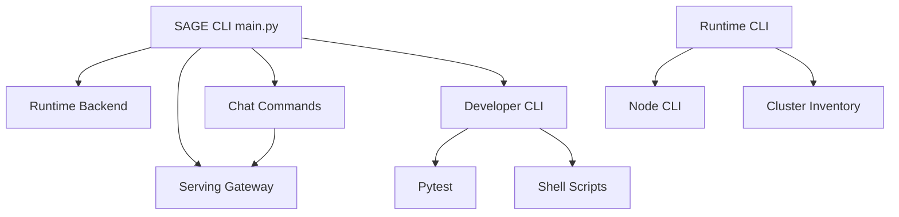

# CLI and Application Layer

<cite>
**Referenced Files in This Document**
- [main.py](file://src/sage/cli/main.py)
- [chat.py](file://src/sage/cli/commands/apps/chat.py)
- [dev.py](file://src/sage/tools/cli/commands/dev.py)
- [cli.py](file://src/sage/runtime/flownet/cli.py)
- [cli.py](file://src/sage/runtime/flownet/node/cli.py)
</cite>

## Table of Contents
1. [Introduction](#introduction)
2. [Project Structure](#project-structure)
3. [Core Components](#core-components)
4. [Architecture Overview](#architecture-overview)
5. [Detailed Component Analysis](#detailed-component-analysis)
6. [Dependency Analysis](#dependency-analysis)
7. [Performance Considerations](#performance-considerations)
8. [Troubleshooting Guide](#troubleshooting-guide)
9. [Conclusion](#conclusion)
10. [Appendices](#appendices)

## Introduction
This document describes the CLI and Application Layer of SAGE, focusing on the primary user interface for development, deployment, and operational tasks. It explains the main CLI entrypoints, command structure, argument parsing, help systems, and integration with runtime nodes, serving gateways, and application-specific chat functionality. It also covers developer-focused tools for debugging and testing, and provides practical examples for common workflows such as gateway probing, runtime status checking, and chat interactions.

## Project Structure
The CLI layer is organized around multiple entrypoints:
- Primary SAGE CLI for environment verification, runtime inspection, serving integration, and application chat/index management
- Developer CLI for code quality, testing, maintenance, and documentation tasks
- Runtime CLI for node and cluster lifecycle and diagnostics

**Diagram sources**
- [main.py](file://src/sage/cli/main.py)
- [chat.py](file://src/sage/cli/commands/apps/chat.py)
- [dev.py](file://src/sage/tools/cli/commands/dev.py)
- [cli.py](file://src/sage/runtime/flownet/cli.py)
- [cli.py](file://src/sage/runtime/flownet/node/cli.py)

**Section sources**
- [main.py](file://src/sage/cli/main.py)
- [chat.py](file://src/sage/cli/commands/apps/chat.py)
- [dev.py](file://src/sage/tools/cli/commands/dev.py)
- [cli.py](file://src/sage/runtime/flownet/cli.py)
- [cli.py](file://src/sage/runtime/flownet/node/cli.py)

## Core Components
- SAGE CLI main entrypoint defines top-level commands and subcommands for version/status/doctor/verify, runtime node inspection, serving gateway introspection/probing, and application chat/index management. It integrates with runtime backends and serving gateway modules to provide environment diagnostics and actionable outputs.
- Application chat/index commands provide a unified interface to interact with local or remote inference backends via a gateway, direct CLI invocation, or OpenAI-compatible APIs. They support streaming, model selection, and environment-driven configuration.
- Developer CLI provides code quality checks, project testing, maintenance tasks (hooks, doctor), and documentation commands, enabling streamlined developer workflows.

**Section sources**
- [main.py](file://src/sage/cli/main.py)
- [chat.py](file://src/sage/cli/commands/apps/chat.py)
- [dev.py](file://src/sage/tools/cli/commands/dev.py)

## Architecture Overview
The CLI layer orchestrates interactions between the user and internal framework components:
- SAGE CLI parses user intent, delegates to handlers, and prints human-readable or JSON-formatted outputs
- Serving gateway integration enables probing and printing gateway commands and health URLs
- Runtime backend integration lists runtime nodes and surfaces environment status
- Application chat/index commands detect backends automatically and route requests accordingly
- Developer CLI wraps shell scripts and pytest to enforce consistent developer workflows

**Diagram sources**
- [main.py](file://src/sage/cli/main.py)
- [chat.py](file://src/sage/cli/commands/apps/chat.py)

## Detailed Component Analysis

### SAGE CLI Main Entrypoint
Purpose:
- Provide top-level commands for environment verification, runtime inspection, serving gateway probing, and application chat/index management
- Load external CLI plugins via entry points
- Print human-readable status or JSON-formatted outputs when requested

Key behaviors:
- Argument parsing supports subcommands and sub-subcommands with explicit help messages
- Handlers for status, doctor, version, verify, runtime nodes, and serve gateway
- Plugin loading mechanism allows extending CLI capabilities

Command categories:
- Environment: version, status, doctor, verify
- Runtime: runtime nodes
- Serving: serve gateway (probe/print command)
- Applications: chat, index ingest
- Plugins: dynamically loaded via entry points

Help system:
- Each subcommand includes concise help text guiding usage

Integration points:
- Runtime backend for node listing
- Serving gateway for probing and command generation
- Foundation utilities for user paths and ports

**Section sources**
- [main.py](file://src/sage/cli/main.py)

### Chat and Index Commands
Purpose:
- Provide a unified chat interface supporting local gateway, direct CLI invocation, and OpenAI-compatible backends
- Manage lightweight index metadata for optional adapter workflows

Key behaviors:
- Automatic backend detection based on environment and gateway availability
- Streaming SSE responses for compatible backends
- Environment-driven configuration for base URLs and API keys
- Lightweight index metadata persistence for optional retrieval workflows

Command structure:
- chat: interactive or one-shot prompts, model selection, streaming, and backend selection
- index ingest: record lightweight metadata for optional adapters

Integration points:
- Serving gateway probing for automatic detection
- Direct CLI invocation of local inference engine
- OpenAI-compatible API requests

**Diagram sources**
- [chat.py](file://src/sage/cli/commands/apps/chat.py)

**Section sources**
- [chat.py](file://src/sage/cli/commands/apps/chat.py)

### Developer CLI (sage-dev)
Purpose:
- Provide in-tree developer workflows for code quality, testing, maintenance, and documentation
- Replace external developer tool dependencies with integrated commands

Key behaviors:
- Quality checks and auto-fixes via linter/formatter
- Test orchestration with coverage and filtering
- Maintenance tasks (hooks, doctor)
- Documentation quality checks

Command categories:
- quality: check/fix with optional README checks
- project: test and clean
- maintain: hooks and doctor
- docs: build and serve guidance
- Aliases: test and status

Integration points:
- Shell scripts for maintenance and documentation
- Pytest for test execution and coverage
- Linter/formatter for code quality

**Section sources**
- [dev.py](file://src/sage/tools/cli/commands/dev.py)

### Runtime CLI (Flownet)
Purpose:
- Manage node and cluster lifecycles and diagnostics for FlowNet infrastructure
- Provide node bootstrap, inspection, and cluster operations

Key behaviors:
- Node commands: start, inspect, join, leave, stop, restart
- Cluster commands: plan, start, up/down, inspect, status, join, leave, reconcile
- Forwarding to node CLI with resolved routes

Command categories:
- node: lifecycle and diagnostics
- cluster: inventory and lifecycle operations

Integration points:
- Node control endpoints for runtime operations
- Cluster inventory and target resolution
- Bootstrap and HTTP control callers

**Section sources**
- [cli.py](file://src/sage/runtime/flownet/cli.py)
- [cli.py](file://src/sage/runtime/flownet/node/cli.py)

## Dependency Analysis
High-level dependencies among CLI components:
- SAGE CLI depends on runtime backend for node listing and on serving gateway for probing
- Chat/index commands depend on serving gateway probing and environment configuration
- Developer CLI depends on shell scripts and pytest
- Runtime CLI depends on node CLI for forwarding and on cluster utilities for inventory operations

**Diagram sources**
- [main.py](file://src/sage/cli/main.py)
- [chat.py](file://src/sage/cli/commands/apps/chat.py)
- [dev.py](file://src/sage/tools/cli/commands/dev.py)
- [cli.py](file://src/sage/runtime/flownet/cli.py)
- [cli.py](file://src/sage/runtime/flownet/node/cli.py)

**Section sources**
- [main.py](file://src/sage/cli/main.py)
- [chat.py](file://src/sage/cli/commands/apps/chat.py)
- [dev.py](file://src/sage/tools/cli/commands/dev.py)
- [cli.py](file://src/sage/runtime/flownet/cli.py)
- [cli.py](file://src/sage/runtime/flownet/node/cli.py)

## Performance Considerations
- Gateway probing and runtime node listing are lightweight operations suitable for frequent checks
- Streaming chat responses reduce perceived latency for long-running completions
- Developer CLI quality checks leverage caching and incremental runs where applicable
- Runtime CLI operations may involve network calls; timeouts and retries are configured per command

## Troubleshooting Guide
Common issues and resolutions:
- Gateway unavailability: use serve gateway probe to diagnose health and URLs; adjust host/port/model parameters
- No runtime nodes: verify runtime backend initialization and node registration
- Chat failures: confirm API key presence and base URL configuration; switch backend modes (auto/openai/direct)
- Developer CLI quality failures: ensure linter/formatter is installed and configured; review script outputs
- Runtime CLI timeouts: increase timeout values and verify node control endpoints

Operational checks:
- Use status to summarize environment configuration and gateway health
- Use doctor to verify module availability and runtime backend connectivity
- Use serve gateway with probe to validate gateway readiness

**Section sources**
- [main.py](file://src/sage/cli/main.py)
- [chat.py](file://src/sage/cli/commands/apps/chat.py)
- [dev.py](file://src/sage/tools/cli/commands/dev.py)
- [cli.py](file://src/sage/runtime/flownet/cli.py)
- [cli.py](file://src/sage/runtime/flownet/node/cli.py)

## Conclusion
The CLI and Application Layer provides a cohesive interface for environment verification, runtime inspection, serving gateway management, and application development. It integrates with runtime nodes and serving gateways to deliver actionable insights and streamlined workflows. Developer tools further enhance productivity by centralizing quality, testing, maintenance, and documentation tasks.

## Appendices

### Command Reference (SAGE CLI)
- version: Print SAGE version
- status: Show local SAGE status summary (includes gateway health)
- doctor: Run a lightweight environment diagnostic
- verify: Run a built-in core surface smoke verification
- runtime nodes: List visible runtime nodes (JSON output)
- serve gateway: Print or probe the gateway contract
  - Options: --host, --port, --model, --control-plane, --probe, --json
- chat: Run chat via gateway/direct CLI/OpenAI-compatible backends
  - Options: --engine, --backend, --model, --ask, --stream, --host, --port, --base-url, --api-key-env, --timeout, --direct-backend, --max-tokens, --temperature, --top-p, --top-k, --repetition-penalty, --debug
- index ingest: Record lightweight index metadata for optional adapter workflows
  - Options: --source, --index, --quiet, --embedding-method, --embedding-model, --embedding-base-url

### Command Reference (Developer CLI)
- quality check/fix: Run code quality tasks with optional README checks
- project test: Run test suite with coverage and filtering
- project clean: Clean caches and build artifacts
- maintain hooks install/status: Git hooks management
- maintain doctor: Run maintenance doctor checks
- docs build/serve: Documentation commands
- Aliases: test, status

### Command Reference (Runtime CLI)
- node start/inspect/join/leave/stop/restart: Node lifecycle and diagnostics
- cluster plan/start/up/down/inspect/status/join/leave/reconcile: Cluster inventory lifecycle and diagnostics

### Practical Examples
- Environment verification:
  - sage status
  - sage doctor
  - sage verify
- Runtime inspection:
  - sage runtime nodes
- Serving gateway:
  - sage serve gateway --probe
  - sage serve gateway --host HOST --port PORT --json
- Chat workflows:
  - sage chat --ask "Explain SAGE"
  - sage chat --stream --model MODEL
  - sage chat --backend openai --base-url BASE_URL --api-key-env ENV_VAR
- Index management:
  - sage index ingest --source PATH --index NAME
- Developer workflows:
  - sage-dev quality check --readme
  - sage-dev project test --coverage --test-type unit
  - sage-dev maintain hooks install
  - sage-dev docs build