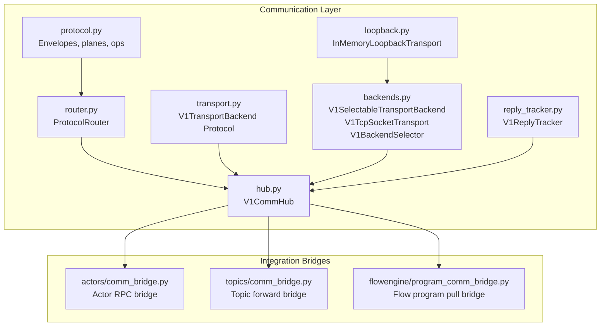
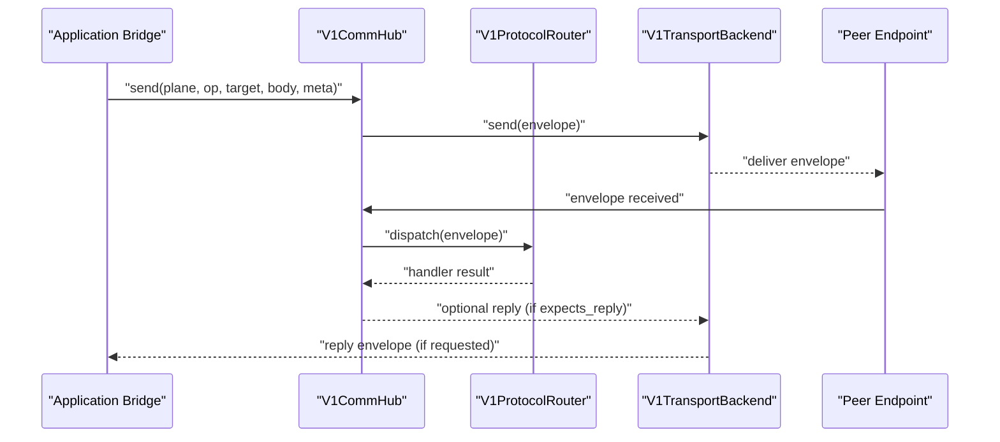
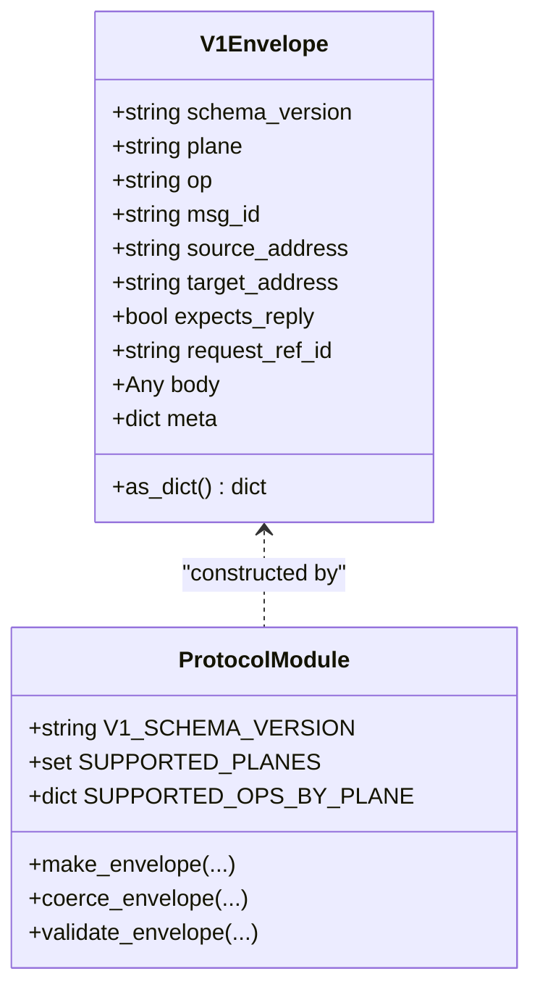
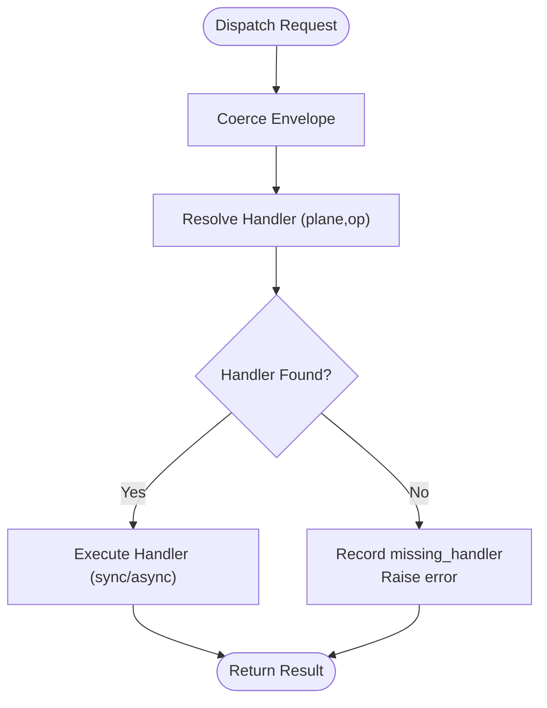
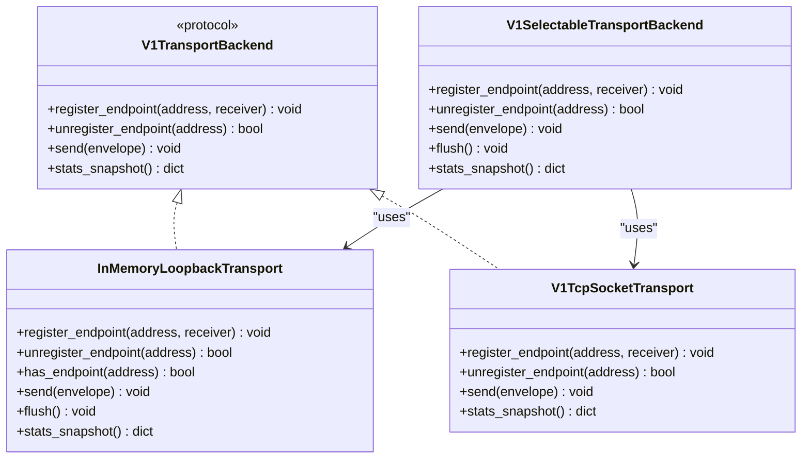
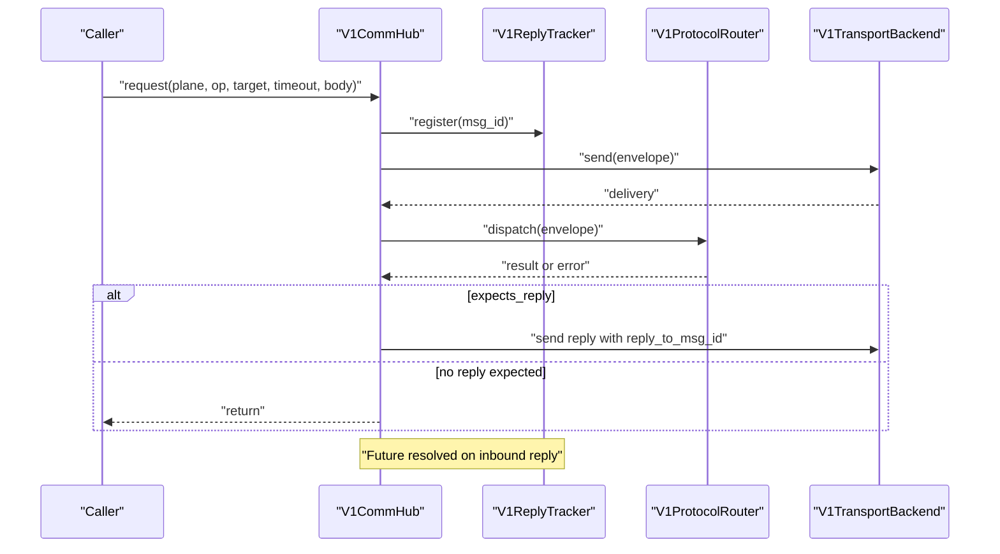
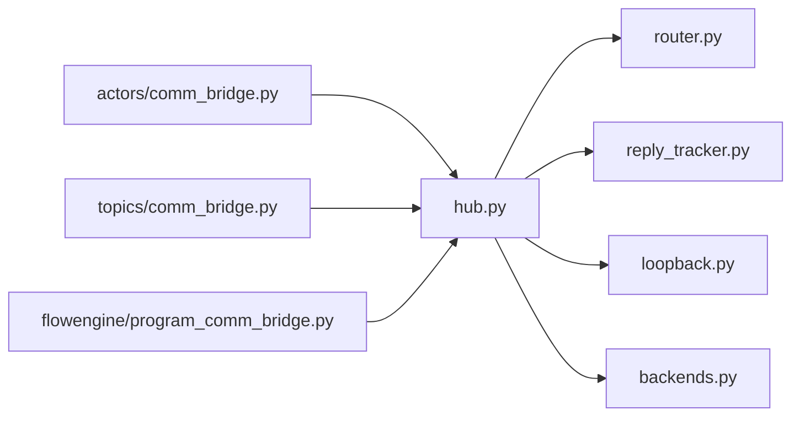
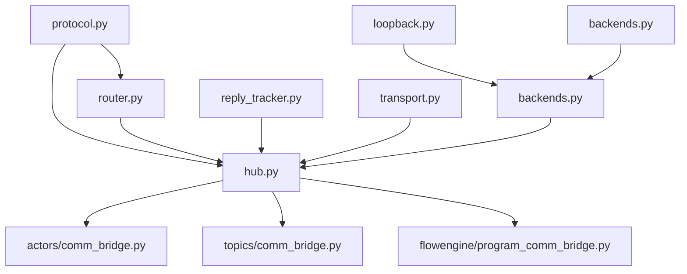

# Communication System

<cite>
**Referenced Files in This Document**
- [__init__.py](file://src/sage/runtime/flownet/runtime/comm/__init__.py)
- [backends.py](file://src/sage/runtime/flownet/runtime/comm/backends.py)
- [hub.py](file://src/sage/runtime/flownet/runtime/comm/hub.py)
- [loopback.py](file://src/sage/runtime/flownet/runtime/comm/loopback.py)
- [protocol.py](file://src/sage/runtime/flownet/runtime/comm/protocol.py)
- [router.py](file://src/sage/runtime/flownet/runtime/comm/router.py)
- [transport.py](file://src/sage/runtime/flownet/runtime/comm/transport.py)
- [reply_tracker.py](file://src/sage/runtime/flownet/runtime/comm/reply_tracker.py)
- [comm_bridge.py](file://src/sage/runtime/flownet/runtime/actors/comm_bridge.py)
- [program_comm_bridge.py](file://src/sage/runtime/flownet/runtime/flowengine/program_comm_bridge.py)
- [comm_bridge.py](file://src/sage/runtime/flownet/runtime/topics/comm_bridge.py)
- [README.md](file://README.md)
</cite>

## Table of Contents
1. [Introduction](#introduction)
2. [Project Structure](#project-structure)
3. [Core Components](#core-components)
4. [Architecture Overview](#architecture-overview)
5. [Detailed Component Analysis](#detailed-component-analysis)
6. [Dependency Analysis](#dependency-analysis)
7. [Performance Considerations](#performance-considerations)
8. [Troubleshooting Guide](#troubleshooting-guide)
9. [Conclusion](#conclusion)

## Introduction
This document explains SAGE’s Communication System that powers distributed message passing between actors and services in FlowNet-based execution. It covers the communication backends, hub coordination, loopback mechanisms, protocol definitions, router implementations, and transport layer abstractions. The system provides reliable transport, routing, and protocol handling for FlowNet-based distributed execution, integrating tightly with the actor system and runtime services.

The system is organized around:
- Envelopes carrying typed messages across planes (rpc, data, control, gossip)
- A transport abstraction enabling pluggable backends (loopback and TCP)
- A hub orchestrating send/request flows, reply correlation, and routing
- A router dispatching messages to protocol handlers
- Reply tracking for request/reply correlation
- Bridges connecting the communication system to actors, topics, and flow programs

## Project Structure
The communication system resides under the runtime’s FlowNet module and is composed of modular components that can be independently tested and reused.

**Diagram sources**
- [protocol.py:1-429](file://src/sage/runtime/flownet/runtime/comm/protocol.py#L1-L429)
- [router.py:1-96](file://src/sage/runtime/flownet/runtime/comm/router.py#L1-L96)
- [transport.py:1-32](file://src/sage/runtime/flownet/runtime/comm/transport.py#L1-L32)
- [loopback.py:1-155](file://src/sage/runtime/flownet/runtime/comm/loopback.py#L1-L155)
- [backends.py:1-549](file://src/sage/runtime/flownet/runtime/comm/backends.py#L1-L549)
- [reply_tracker.py:1-118](file://src/sage/runtime/flownet/runtime/comm/reply_tracker.py#L1-L118)
- [hub.py:1-200](file://src/sage/runtime/flownet/runtime/comm/hub.py#L1-L200)
- [comm_bridge.py:1-88](file://src/sage/runtime/flownet/runtime/actors/comm_bridge.py#L1-L88)
- [comm_bridge.py:1-157](file://src/sage/runtime/flownet/runtime/topics/comm_bridge.py#L1-L157)
- [program_comm_bridge.py:1-199](file://src/sage/runtime/flownet/runtime/flowengine/program_comm_bridge.py#L1-L199)

**Section sources**
- [__init__.py:1-86](file://src/sage/runtime/flownet/runtime/comm/__init__.py#L1-L86)
- [README.md:160-200](file://README.md#L160-L200)

## Core Components
- Envelope and protocol definitions: define the schema version, planes, operations, and validation rules for messages.
- Router: dispatches envelopes to registered handlers by plane/op.
- Transport abstraction: a protocol for transport backends with registration, sending, and statistics.
- Loopback transport: in-memory delivery for unit tests and local scenarios.
- TCP transport and selectable backend: network-based delivery with fallback and selection logic.
- Reply tracker: correlates request and reply messages by msg_id.
- Hub: central coordination point for sending, requesting, reply handling, and routing.

These components collectively enable FlowNet-based distributed execution with clear separation of concerns and extensibility.

**Section sources**
- [protocol.py:1-429](file://src/sage/runtime/flownet/runtime/comm/protocol.py#L1-L429)
- [router.py:1-96](file://src/sage/runtime/flownet/runtime/comm/router.py#L1-L96)
- [transport.py:1-32](file://src/sage/runtime/flownet/runtime/comm/transport.py#L1-L32)
- [loopback.py:1-155](file://src/sage/runtime/flownet/runtime/comm/loopback.py#L1-L155)
- [backends.py:1-549](file://src/sage/runtime/flownet/runtime/comm/backends.py#L1-L549)
- [reply_tracker.py:1-118](file://src/sage/runtime/flownet/runtime/comm/reply_tracker.py#L1-L118)
- [hub.py:1-200](file://src/sage/runtime/flownet/runtime/comm/hub.py#L1-L200)

## Architecture Overview
The Communication System is a layered architecture:
- Application-level bridges (actors, topics, flow programs) construct envelopes and use the hub to send or request replies.
- The hub validates envelopes, registers pending replies, and forwards to the transport.
- The transport delivers to the destination endpoint via loopback or TCP.
- On receipt, the transport invokes the hub’s receiver, which dispatches to the router and executes the appropriate handler.
- Handlers can optionally reply; the hub constructs and sends replies using the transport.

**Diagram sources**
- [hub.py:68-131](file://src/sage/runtime/flownet/runtime/comm/hub.py#L68-L131)
- [router.py:50-67](file://src/sage/runtime/flownet/runtime/comm/router.py#L50-L67)
- [transport.py:11-25](file://src/sage/runtime/flownet/runtime/comm/transport.py#L11-L25)
- [protocol.py:108-134](file://src/sage/runtime/flownet/runtime/comm/protocol.py#L108-L134)

## Detailed Component Analysis

### Envelope and Protocol Model
- Schema version and planes: v1 defines four planes (rpc, data, control, gossip) with explicit operations per plane.
- Envelope fields: schema_version, plane, op, msg_id, source_address, target_address, expects_reply, request_ref_id, body, meta.
- Validation enforces schema version, plane, and operation support, and plane-specific contracts (e.g., topic forward modes, flow program pull modes).
- Helpers create, coerce, and validate envelopes consistently.

**Diagram sources**
- [protocol.py:78-134](file://src/sage/runtime/flownet/runtime/comm/protocol.py#L78-L134)
- [protocol.py:108-174](file://src/sage/runtime/flownet/runtime/comm/protocol.py#L108-L174)

**Section sources**
- [protocol.py:1-429](file://src/sage/runtime/flownet/runtime/comm/protocol.py#L1-L429)

### Router Implementation
- V1ProtocolRouter maintains a plane/op -> handler mapping.
- Dispatch resolves the handler, executes it (sync or async), and records stats.
- Missing handlers produce a clear error.

**Diagram sources**
- [router.py:50-67](file://src/sage/runtime/flownet/runtime/comm/router.py#L50-L67)

**Section sources**
- [router.py:1-96](file://src/sage/runtime/flownet/runtime/comm/router.py#L1-L96)

### Transport Abstraction and Backends
- V1TransportBackend is a protocol defining register_endpoint, unregister_endpoint, send, and stats_snapshot.
- InMemoryLoopbackTransport provides in-process delivery with best-effort async handling for awaitable receivers.
- V1TcpSocketTransport implements TCP framing with cloudpickle serialization and threaded server handling.
- V1SelectableTransportBackend selects among loopback/tcp backends with fallback accounting and stats.

**Diagram sources**
- [transport.py:11-25](file://src/sage/runtime/flownet/runtime/comm/transport.py#L11-L25)
- [loopback.py:13-118](file://src/sage/runtime/flownet/runtime/comm/loopback.py#L13-L118)
- [backends.py:98-274](file://src/sage/runtime/flownet/runtime/comm/backends.py#L98-L274)
- [backends.py:276-505](file://src/sage/runtime/flownet/runtime/comm/backends.py#L276-L505)

**Section sources**
- [transport.py:1-32](file://src/sage/runtime/flownet/runtime/comm/transport.py#L1-L32)
- [loopback.py:1-155](file://src/sage/runtime/flownet/runtime/comm/loopback.py#L1-L155)
- [backends.py:1-549](file://src/sage/runtime/flownet/runtime/comm/backends.py#L1-L549)

### Hub Coordination and Reply Tracking
- V1CommHub registers a local endpoint, sends messages, supports request/reply with timeouts, and dispatches envelopes to the router.
- Reply tracking correlates outbound msg_id with inbound reply_to_msg_id to fulfill futures.
- Reply construction sets reply_to_msg_id and ensures proper plane/op pairing.

**Diagram sources**
- [hub.py:68-131](file://src/sage/runtime/flownet/runtime/comm/hub.py#L68-L131)
- [hub.py:140-176](file://src/sage/runtime/flownet/runtime/comm/hub.py#L140-L176)
- [reply_tracker.py:22-58](file://src/sage/runtime/flownet/runtime/comm/reply_tracker.py#L22-L58)

**Section sources**
- [hub.py:1-200](file://src/sage/runtime/flownet/runtime/comm/hub.py#L1-L200)
- [reply_tracker.py:1-118](file://src/sage/runtime/flownet/runtime/comm/reply_tracker.py#L1-L118)

### Actor, Topic, and Flow Program Bridges
- Actor bridge: registers rpc handler for actor calls and provides caller-side invocation via the hub.
- Topic bridge: registers handlers for topic forward and notification operations and sends topic intents as one-way messages.
- Flow program bridge: registers handler for flow program pulls and builds resolver to fetch programs from owners.

**Diagram sources**
- [comm_bridge.py:9-20](file://src/sage/runtime/flownet/runtime/actors/comm_bridge.py#L9-L20)
- [comm_bridge.py:23-54](file://src/sage/runtime/flownet/runtime/actors/comm_bridge.py#L23-L54)
- [comm_bridge.py:43-54](file://src/sage/runtime/flownet/runtime/actors/comm_bridge.py#L43-L54)
- [comm_bridge.py:46-54](file://src/sage/runtime/flownet/runtime/actors/comm_bridge.py#L46-L54)
- [comm_bridge.py:43-54](file://src/sage/runtime/flownet/runtime/actors/comm_bridge.py#L43-L54)
- [comm_bridge.py:1-157](file://src/sage/runtime/flownet/runtime/topics/comm_bridge.py#L1-L157)
- [program_comm_bridge.py:15-36](file://src/sage/runtime/flownet/runtime/flowengine/program_comm_bridge.py#L15-L36)
- [program_comm_bridge.py:86-132](file://src/sage/runtime/flownet/runtime/flowengine/program_comm_bridge.py#L86-L132)

**Section sources**
- [comm_bridge.py:1-88](file://src/sage/runtime/flownet/runtime/actors/comm_bridge.py#L1-L88)
- [comm_bridge.py:1-157](file://src/sage/runtime/flownet/runtime/topics/comm_bridge.py#L1-L157)
- [program_comm_bridge.py:1-199](file://src/sage/runtime/flownet/runtime/flowengine/program_comm_bridge.py#L1-L199)

## Dependency Analysis
The communication system exhibits low coupling and high cohesion:
- Protocol definitions are shared across router, hub, and bridges.
- Router depends only on envelope coercion and handler callables.
- Hub depends on transport, router, and reply tracker.
- Backends depend on protocol and transport receiver types.
- Bridges depend on hub and domain-specific APIs.

**Diagram sources**
- [protocol.py:1-429](file://src/sage/runtime/flownet/runtime/comm/protocol.py#L1-L429)
- [router.py:1-96](file://src/sage/runtime/flownet/runtime/comm/router.py#L1-L96)
- [transport.py:1-32](file://src/sage/runtime/flownet/runtime/comm/transport.py#L1-L32)
- [loopback.py:1-155](file://src/sage/runtime/flownet/runtime/comm/loopback.py#L1-L155)
- [backends.py:1-549](file://src/sage/runtime/flownet/runtime/comm/backends.py#L1-L549)
- [reply_tracker.py:1-118](file://src/sage/runtime/flownet/runtime/comm/reply_tracker.py#L1-L118)
- [hub.py:1-200](file://src/sage/runtime/flownet/runtime/comm/hub.py#L1-L200)
- [comm_bridge.py:1-88](file://src/sage/runtime/flownet/runtime/actors/comm_bridge.py#L1-L88)
- [comm_bridge.py:1-157](file://src/sage/runtime/flownet/runtime/topics/comm_bridge.py#L1-L157)
- [program_comm_bridge.py:1-199](file://src/sage/runtime/flownet/runtime/flowengine/program_comm_bridge.py#L1-L199)

**Section sources**
- [__init__.py:1-86](file://src/sage/runtime/flownet/runtime/comm/__init__.py#L1-L86)

## Performance Considerations
- Serialization: Envelopes are serialized using cloudpickle with length-prefixed frames in TCP backend. This ensures robust framing but adds overhead; consider compression or alternative serializers if throughput is critical.
- Threading and async: TCP backend uses a threaded server and async sender; loopback transport schedules awaitable handlers on the event loop. Ensure event loop responsiveness and avoid blocking handlers.
- Fallback and selection: Selectable backend tracks fallback rates and backend error counts. Monitor stats to tune transport mode and endpoint availability.
- Reply tracking: Reply futures are tracked per msg_id; ensure timely completion or cancellation to prevent memory growth.
- Routing: Router dispatch is O(1) lookup; keep handler registration minimal and avoid heavy synchronous work in handlers.

[No sources needed since this section provides general guidance]

## Troubleshooting Guide
Common issues and remedies:
- Unsupported schema/plane/op: Validate envelope fields and plane-specific contracts. Ensure operations are permitted for the given plane.
- Missing protocol handler: Register handlers for all expected (plane, op) combinations. Use router.has_handler to verify.
- Reply not received: Confirm expects_reply flag and that reply_to_msg_id matches outbound msg_id. Check reply tracker pending count and timeouts.
- TCP send failures: Inspect backend stats for send_dropped and receiver_errors. Verify target address format and connectivity.
- Loopback target not found: Ensure endpoint is registered and reachable. Use has_endpoint to confirm registration.
- Topic forward mismatches: Validate mode and identifiers in topic bodies; ensure event_group_id equals request_ref_id.

**Section sources**
- [protocol.py:177-271](file://src/sage/runtime/flownet/runtime/comm/protocol.py#L177-L271)
- [router.py:50-67](file://src/sage/runtime/flownet/runtime/comm/router.py#L50-L67)
- [hub.py:118-131](file://src/sage/runtime/flownet/runtime/comm/hub.py#L118-L131)
- [backends.py:222-265](file://src/sage/runtime/flownet/runtime/comm/backends.py#L222-L265)
- [loopback.py:50-62](file://src/sage/runtime/flownet/runtime/comm/loopback.py#L50-L62)

## Conclusion
SAGE’s Communication System provides a robust, extensible foundation for FlowNet-based distributed messaging. Its layered design—envelopes, router, transport abstraction, hub coordination, and reply tracking—enables reliable transport, precise routing, and strong integration with the actor system and runtime services. By leveraging loopback for local testing and TCP for distributed execution, and by exposing detailed statistics and error handling, the system supports both beginner understanding of distributed messaging and advanced optimization for production deployments.

[No sources needed since this section summarizes without analyzing specific files]