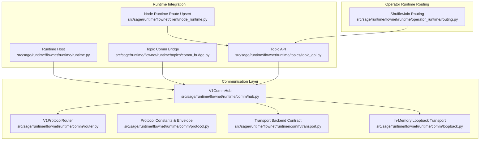
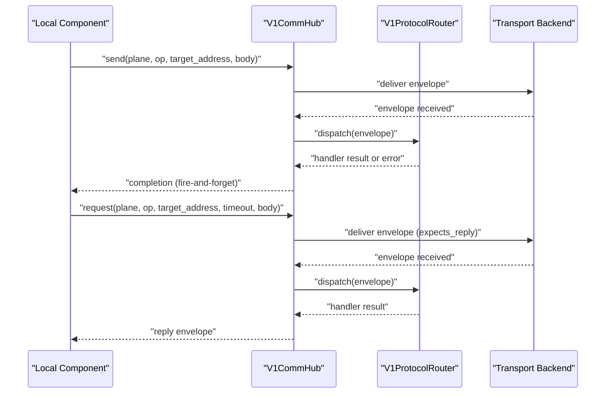
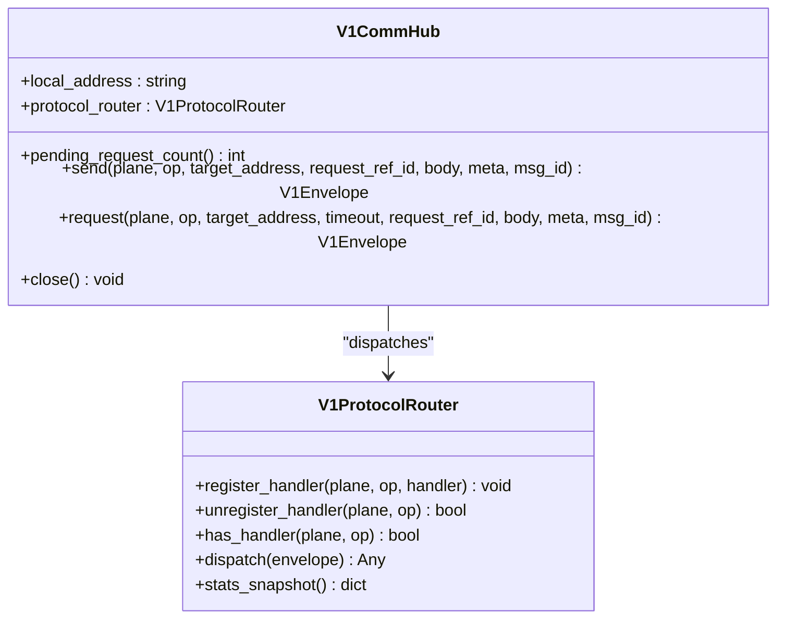
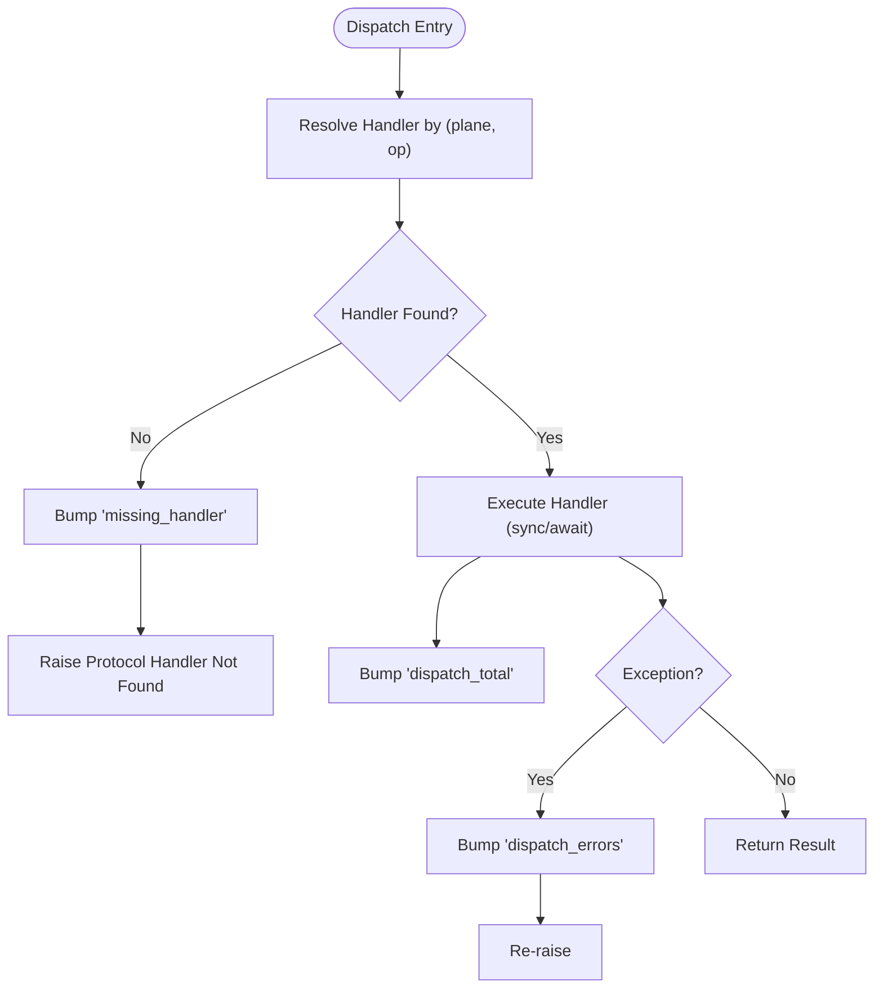
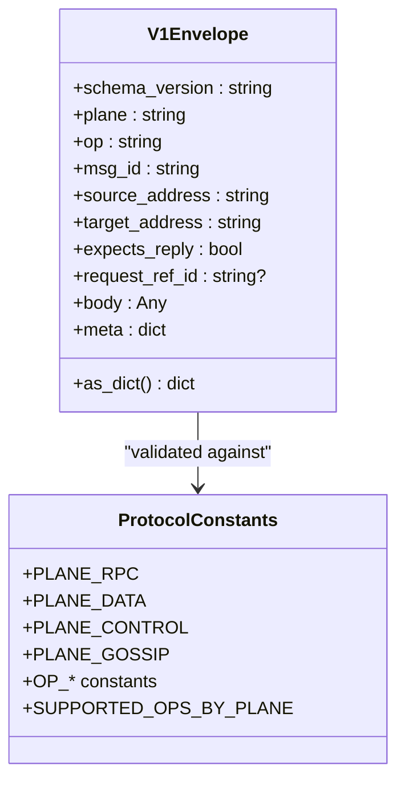
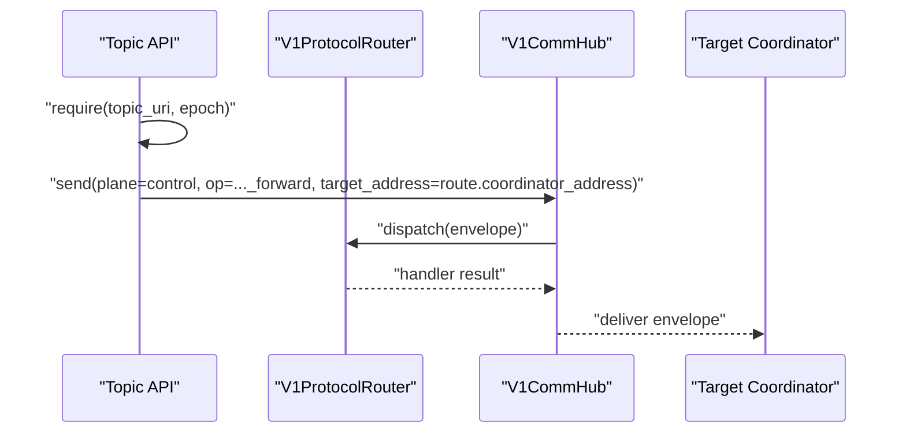
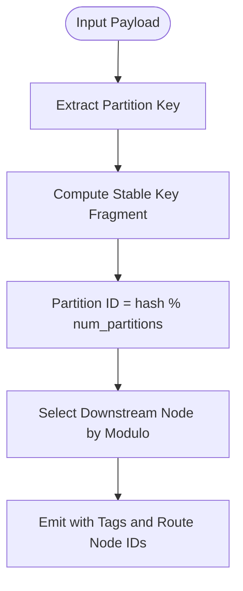
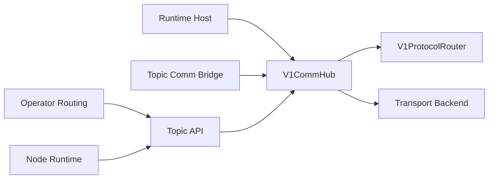

# Hub Coordination and Routing

<cite>
**Referenced Files in This Document**
- [hub.py](file://src/sage/runtime/flownet/runtime/comm/hub.py)
- [router.py](file://src/sage/runtime/flownet/runtime/comm/router.py)
- [protocol.py](file://src/sage/runtime/flownet/runtime/comm/protocol.py)
- [transport.py](file://src/sage/runtime/flownet/runtime/comm/transport.py)
- [loopback.py](file://src/sage/runtime/flownet/runtime/comm/loopback.py)
- [runtime.py](file://src/sage/runtime/flownet/runtime/runtime.py)
- [comm_bridge.py](file://src/sage/runtime/flownet/runtime/topics/comm_bridge.py)
- [topic_api.py](file://src/sage/runtime/flownet/runtime/topics/topic_api.py)
- [routing.py](file://src/sage/runtime/flownet/runtime/operator_runtime/routing.py)
- [node_runtime.py](file://src/sage/runtime/flownet/client/node_runtime.py)
</cite>

## Table of Contents
1. [Introduction](#introduction)
2. [Project Structure](#project-structure)
3. [Core Components](#core-components)
4. [Architecture Overview](#architecture-overview)
5. [Detailed Component Analysis](#detailed-component-analysis)
6. [Dependency Analysis](#dependency-analysis)
7. [Performance Considerations](#performance-considerations)
8. [Troubleshooting Guide](#troubleshooting-guide)
9. [Conclusion](#conclusion)
10. [Appendices](#appendices)

## Introduction
This document explains SAGE’s Hub Coordination and Routing subsystem, centered on the hub as the primary coordination point for message distribution across the runtime. It covers the hub’s responsibilities, the router’s role in dispatching messages by plane and operation, and the routing table and topic routing directory that maintain destination resolution. We also describe routing strategies for data-plane shuffles and joins, load-balancing via partition selection, and failure recovery patterns grounded in request/reply correlation and timeouts. Practical guidance is included for configuring routing, setting up the hub, and debugging routing issues.

## Project Structure
The routing and coordination infrastructure lives under the runtime communication layer and integrates with topic routing and operator runtime routing.

**Diagram sources**
- [hub.py:1-200](file://src/sage/runtime/flownet/runtime/comm/hub.py#L1-L200)
- [router.py:1-96](file://src/sage/runtime/flownet/runtime/comm/router.py#L1-L96)
- [protocol.py:1-429](file://src/sage/runtime/flownet/runtime/comm/protocol.py#L1-L429)
- [transport.py:1-32](file://src/sage/runtime/flownet/runtime/comm/transport.py#L1-L32)
- [loopback.py](file://src/sage/runtime/flownet/runtime/comm/loopback.py)
- [runtime.py:120-220](file://src/sage/runtime/flownet/runtime/runtime.py#L120-L220)
- [comm_bridge.py:66-134](file://src/sage/runtime/flownet/runtime/topics/comm_bridge.py#L66-L134)
- [topic_api.py:616-1030](file://src/sage/runtime/flownet/runtime/topics/topic_api.py#L616-L1030)
- [routing.py:1-388](file://src/sage/runtime/flownet/runtime/operator_runtime/routing.py#L1-L388)
- [node_runtime.py:2420-2458](file://src/sage/runtime/flownet/client/node_runtime.py#L2420-L2458)

**Section sources**
- [hub.py:1-200](file://src/sage/runtime/flownet/runtime/comm/hub.py#L1-L200)
- [router.py:1-96](file://src/sage/runtime/flownet/runtime/comm/router.py#L1-L96)
- [protocol.py:1-429](file://src/sage/runtime/flownet/runtime/comm/protocol.py#L1-L429)
- [transport.py:1-32](file://src/sage/runtime/flownet/runtime/comm/transport.py#L1-L32)
- [runtime.py:120-220](file://src/sage/runtime/flownet/runtime/runtime.py#L120-L220)

## Core Components
- V1CommHub: Central coordination point that sends and receives envelopes, correlates requests and replies, and dispatches inbound messages to the protocol router. It binds a local address to a transport endpoint and manages reply tracking.
- V1ProtocolRouter: Dispatches envelopes by plane and operation to registered handlers. It maintains handler registrations, statistics, and raises explicit errors when handlers are missing.
- Protocol Envelope and Constants: Defines planes (rpc, data, control, gossip), operations, and the V1Envelope structure. Includes validation and coercion utilities to ensure message integrity.
- Transport Backend: A protocol defining how the hub sends and registers endpoints. An in-memory loopback transport is used by default when none is provided.
- Topic Routing Integration: Topic APIs and bridges use the hub to forward events and control messages across coordinators, leveraging routing directories to resolve destinations.
- Operator Runtime Routing: Shuffle and join operators compute partition assignments and select downstream transformation nodes for data-plane routing.

**Section sources**
- [hub.py:30-181](file://src/sage/runtime/flownet/runtime/comm/hub.py#L30-L181)
- [router.py:13-80](file://src/sage/runtime/flownet/runtime/comm/router.py#L13-L80)
- [protocol.py:78-191](file://src/sage/runtime/flownet/runtime/comm/protocol.py#L78-L191)
- [transport.py:11-26](file://src/sage/runtime/flownet/runtime/comm/transport.py#L11-L26)
- [loopback.py](file://src/sage/runtime/flownet/runtime/comm/loopback.py)
- [topic_api.py:616-1030](file://src/sage/runtime/flownet/runtime/topics/topic_api.py#L616-L1030)
- [routing.py:13-388](file://src/sage/runtime/flownet/runtime/operator_runtime/routing.py#L13-L388)

## Architecture Overview
The hub orchestrates message coordination by:
- Accepting outbound requests and replies via send/request methods.
- Validating and routing inbound envelopes to handlers by plane/op.
- Correlating replies using reply tracking and request_ref_id.
- Integrating with transports to deliver messages to target addresses.

**Diagram sources**
- [hub.py:68-176](file://src/sage/runtime/flownet/runtime/comm/hub.py#L68-L176)
- [router.py:50-67](file://src/sage/runtime/flownet/runtime/comm/router.py#L50-L67)
- [protocol.py:108-134](file://src/sage/runtime/flownet/runtime/comm/protocol.py#L108-L134)

## Detailed Component Analysis

### V1CommHub: Central Coordination Point
Responsibilities:
- Envelope creation and validation for outbound messages.
- Request/reply correlation via reply tracking and meta.reply_to_msg_id.
- Inbound dispatch to protocol router and automatic reply generation for request-reply ops.
- Endpoint registration/unregistration bound to local_address.

Key behaviors:
- Outbound send: builds envelope and delivers via transport.
- Outbound request: registers a future for reply correlation, waits with optional timeout, and returns the reply.
- Inbound handling: completes reply tracking for correlated envelopes, dispatches to router, and replies with appropriate op if expects_reply is true.
- Error propagation: exceptions during dispatch are captured and returned as structured error bodies when replies are expected.

**Diagram sources**
- [hub.py:30-181](file://src/sage/runtime/flownet/runtime/comm/hub.py#L30-L181)
- [router.py:13-80](file://src/sage/runtime/flownet/runtime/comm/router.py#L13-L80)

**Section sources**
- [hub.py:30-181](file://src/sage/runtime/flownet/runtime/comm/hub.py#L30-L181)

### V1ProtocolRouter: Routing Table and Dispatch
Responsibilities:
- Maintains a plane/op -> handler mapping guarded by a lock.
- Provides thread-safe registration, unregistration, and lookup.
- Tracks dispatch statistics and raises explicit errors when no handler is found.

Routing table management:
- Registration enforces uniqueness per plane/op.
- Dispatch resolves handler by (plane, op) and executes synchronously or awaits if the result is a coroutine.
- Missing handler and dispatch error counters are maintained.

**Diagram sources**
- [router.py:50-67](file://src/sage/runtime/flownet/runtime/comm/router.py#L50-L67)

**Section sources**
- [router.py:13-80](file://src/sage/runtime/flownet/runtime/comm/router.py#L13-L80)

### Protocol Envelope and Planes/Ops
Responsibilities:
- Define supported planes and operations.
- Envelope dataclass with schema validation and coercion.
- Validation ensures plane/op compatibility and enforces operation-specific contracts for topics and flow programs.

**Diagram sources**
- [protocol.py:78-191](file://src/sage/runtime/flownet/runtime/comm/protocol.py#L78-L191)

**Section sources**
- [protocol.py:10-75](file://src/sage/runtime/flownet/runtime/comm/protocol.py#L10-L75)
- [protocol.py:78-191](file://src/sage/runtime/flownet/runtime/comm/protocol.py#L78-L191)

### Transport Backend and Loopback
Responsibilities:
- Transport contract defines register_endpoint, unregister_endpoint, send, and stats_snapshot.
- In-memory loopback transport is used by default when no external transport is supplied, enabling local testing and simplified setups.

Integration:
- V1CommHub registers its local_address with the transport and delegates delivery to it.

**Section sources**
- [transport.py:11-26](file://src/sage/runtime/flownet/runtime/comm/transport.py#L11-L26)
- [loopback.py](file://src/sage/runtime/flownet/runtime/comm/loopback.py)
- [hub.py:48-55](file://src/sage/runtime/flownet/runtime/comm/hub.py#L48-L55)

### Topic Routing and Forwarding
Topic APIs and bridges coordinate cross-coordinator forwarding using the hub:
- Topic API applies forward intents and builds control messages for event chain deltas and producer completion.
- Topic Comm Bridge registers handlers for topic-related operations and forwards intents via the hub.
- Node Runtime ensures submit-topic routes are upserted into the routing directory when missing.

**Diagram sources**
- [topic_api.py:1008-1030](file://src/sage/runtime/flownet/runtime/topics/topic_api.py#L1008-L1030)
- [comm_bridge.py:66-134](file://src/sage/runtime/flownet/runtime/topics/comm_bridge.py#L66-L134)
- [node_runtime.py:2436-2458](file://src/sage/runtime/flownet/client/node_runtime.py#L2436-L2458)

**Section sources**
- [topic_api.py:616-1030](file://src/sage/runtime/flownet/runtime/topics/topic_api.py#L616-L1030)
- [comm_bridge.py:66-134](file://src/sage/runtime/flownet/runtime/topics/comm_bridge.py#L66-L134)
- [node_runtime.py:2420-2458](file://src/sage/runtime/flownet/client/node_runtime.py#L2420-L2458)

### Operator Runtime Routing: Shuffle and Join
Data-plane routing strategies:
- Shuffle: computes a partition ID from a key source and selects a downstream transformation node by modulo selection.
- Join: validates partition counts match shuffle, computes partition and keys, and routes according to side and stage metadata.

**Diagram sources**
- [routing.py:42-75](file://src/sage/runtime/flownet/runtime/operator_runtime/routing.py#L42-L75)
- [routing.py:78-141](file://src/sage/runtime/flownet/runtime/operator_runtime/routing.py#L78-L141)

**Section sources**
- [routing.py:13-388](file://src/sage/runtime/flownet/runtime/operator_runtime/routing.py#L13-L388)

### Reply Tracking and Failure Recovery
- Reply tracking correlates request_msg_id with reply_to_msg_id to complete awaiting futures.
- Request timeouts raise a timeout error after waiting for the expected reply.
- On dispatch errors, the hub constructs a structured error body for replies when applicable.

**Section sources**
- [hub.py:118-131](file://src/sage/runtime/flownet/runtime/comm/hub.py#L118-L131)
- [hub.py:150-176](file://src/sage/runtime/flownet/runtime/comm/hub.py#L150-L176)

## Dependency Analysis
The hub depends on the router and transport abstractions. The runtime host composes the hub and exposes it to subsystems. Topic APIs and bridges rely on the hub for inter-coordinator messaging. Operator runtime routing computes data-plane destinations independently but aligns with the broader routing directory for topic coordination.

**Diagram sources**
- [runtime.py:120-220](file://src/sage/runtime/flownet/runtime/runtime.py#L120-L220)
- [hub.py:30-181](file://src/sage/runtime/flownet/runtime/comm/hub.py#L30-L181)
- [router.py:13-80](file://src/sage/runtime/flownet/runtime/comm/router.py#L13-L80)
- [transport.py:11-26](file://src/sage/runtime/flownet/runtime/comm/transport.py#L11-L26)
- [comm_bridge.py:66-134](file://src/sage/runtime/flownet/runtime/topics/comm_bridge.py#L66-L134)
- [topic_api.py:616-1030](file://src/sage/runtime/flownet/runtime/topics/topic_api.py#L616-L1030)
- [routing.py:13-388](file://src/sage/runtime/flownet/runtime/operator_runtime/routing.py#L13-L388)
- [node_runtime.py:2420-2458](file://src/sage/runtime/flownet/client/node_runtime.py#L2420-L2458)

**Section sources**
- [runtime.py:120-220](file://src/sage/runtime/flownet/runtime/runtime.py#L120-L220)
- [hub.py:30-181](file://src/sage/runtime/flownet/runtime/comm/hub.py#L30-L181)
- [router.py:13-80](file://src/sage/runtime/flownet/runtime/comm/router.py#L13-L80)
- [transport.py:11-26](file://src/sage/runtime/flownet/runtime/comm/transport.py#L11-L26)
- [comm_bridge.py:66-134](file://src/sage/runtime/flownet/runtime/topics/comm_bridge.py#L66-L134)
- [topic_api.py:616-1030](file://src/sage/runtime/flownet/runtime/topics/topic_api.py#L616-L1030)
- [routing.py:13-388](file://src/sage/runtime/flownet/runtime/operator_runtime/routing.py#L13-L388)
- [node_runtime.py:2420-2458](file://src/sage/runtime/flownet/client/node_runtime.py#L2420-L2458)

## Performance Considerations
- Message validation occurs at envelope creation and coercion; keep bodies minimal to reduce overhead.
- Router dispatch is O(1) keyed lookup; avoid excessive handler churn to prevent contention.
- Reply tracking adds overhead for request-reply patterns; use fire-and-forget send for high-throughput scenarios where replies are unnecessary.
- Transport choice affects latency and throughput; loopback is optimized for local delivery.
- Operator routing uses modulo selection for load balancing across downstream nodes; ensure downstream fan-out matches partition count.

[No sources needed since this section provides general guidance]

## Troubleshooting Guide
Common issues and resolutions:
- Protocol handler not found: Verify handler registration for the specific plane and operation. Check router stats for missing_handler.
- Dispatch errors: Inspect handler implementation and logs; router increments dispatch_errors on exceptions.
- Request timeouts: Increase timeout or investigate target responsiveness; hub cancels reply tracking on timeout.
- Envelope validation failures: Ensure plane/op combinations are supported and operation-specific contracts are met.
- Topic forwarding mismatches: Confirm event_group_id and request_ref_id alignment and topic URI/epoch correctness.

Operational checks:
- Inspect router stats via stats_snapshot to identify missing handlers or frequent errors.
- Use hub pending_request_count to monitor inflight request-reply pairs.
- Validate routing directory entries for topic URIs and epochs when forwarding fails.

**Section sources**
- [router.py:69-71](file://src/sage/runtime/flownet/runtime/comm/router.py#L69-L71)
- [hub.py:65-66](file://src/sage/runtime/flownet/runtime/comm/hub.py#L65-L66)
- [protocol.py:177-191](file://src/sage/runtime/flownet/runtime/comm/protocol.py#L177-L191)
- [topic_api.py:616-642](file://src/sage/runtime/flownet/runtime/topics/topic_api.py#L616-L642)

## Conclusion
SAGE’s hub-centric routing architecture provides a robust foundation for message coordination across distributed components. The V1CommHub centralizes envelope handling, reply correlation, and dispatch, while the V1ProtocolRouter acts as the routing table for plane/op handlers. Topic APIs and bridges leverage the hub for cross-coordinator forwarding, and operator runtime routing implements efficient data-plane strategies. Together, these components enable scalable, observable, and recoverable communication within the runtime.

[No sources needed since this section summarizes without analyzing specific files]

## Appendices

### Practical Examples

- Routing configuration
  - Register a handler for a specific plane and operation using the router.
  - Example path: [router.py:25-38](file://src/sage/runtime/flownet/runtime/comm/router.py#L25-L38)

- Hub setup procedures
  - Instantiate V1CommHub with a local address and optional transport/router/reply tracker.
  - Example path: [hub.py:39-51](file://src/sage/runtime/flownet/runtime/comm/hub.py#L39-L51)

- Debugging routing issues
  - Check router stats for missing_handler and dispatch_errors.
  - Example path: [router.py:69-71](file://src/sage/runtime/flownet/runtime/comm/router.py#L69-L71)
  - Monitor pending request count for stuck replies.
  - Example path: [hub.py:65-66](file://src/sage/runtime/flownet/runtime/comm/hub.py#L65-L66)

- Topic forwarding and routing directory
  - Ensure submit-topic routes are upserted when missing.
  - Example path: [node_runtime.py:2436-2458](file://src/sage/runtime/flownet/client/node_runtime.py#L2436-L2458)
  - Apply forward intents and build control messages for event chain deltas.
  - Example path: [topic_api.py:1008-1030](file://src/sage/runtime/flownet/runtime/topics/topic_api.py#L1008-L1030)

- Data-plane routing strategies
  - Configure shuffle with key extraction and partition count.
  - Example path: [routing.py:223-277](file://src/sage/runtime/flownet/runtime/operator_runtime/routing.py#L223-L277)
  - Configure join with side and partition count aligned to shuffle.
  - Example path: [routing.py:144-208](file://src/sage/runtime/flownet/runtime/operator_runtime/routing.py#L144-L208)