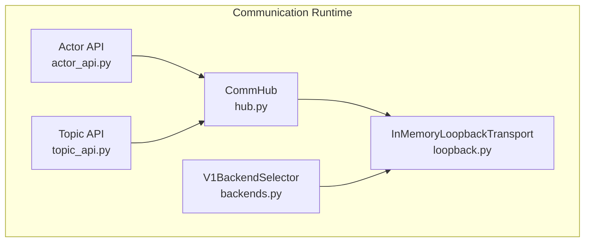
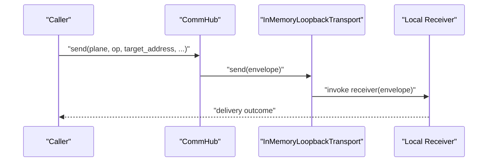
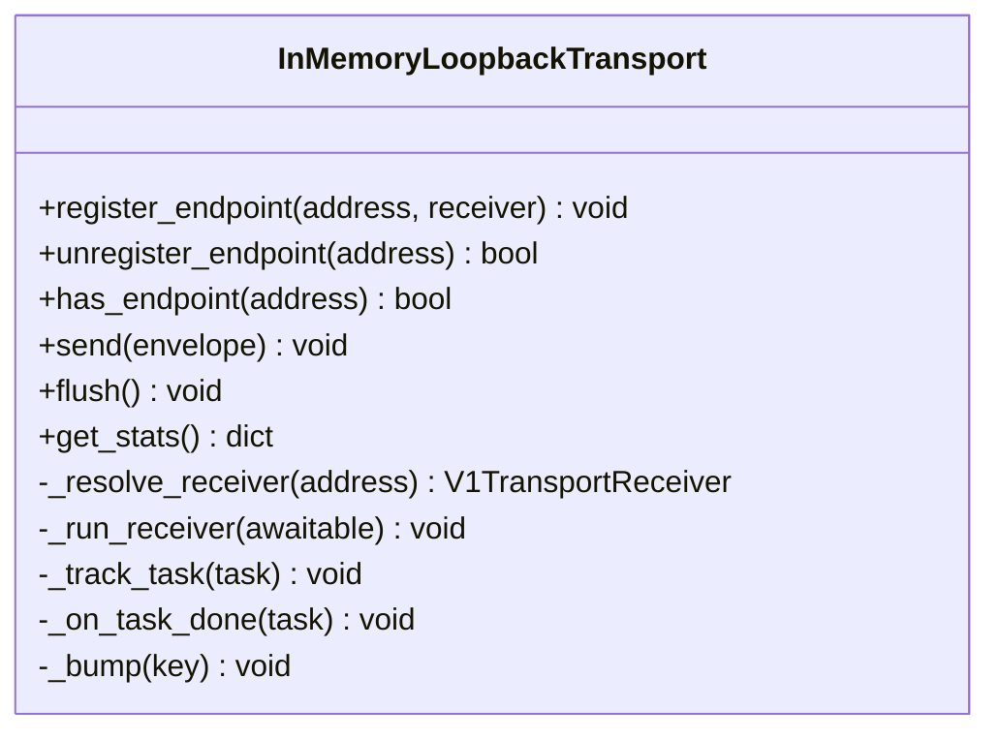
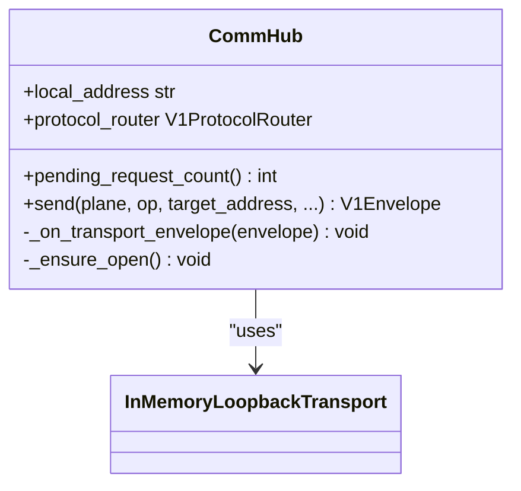
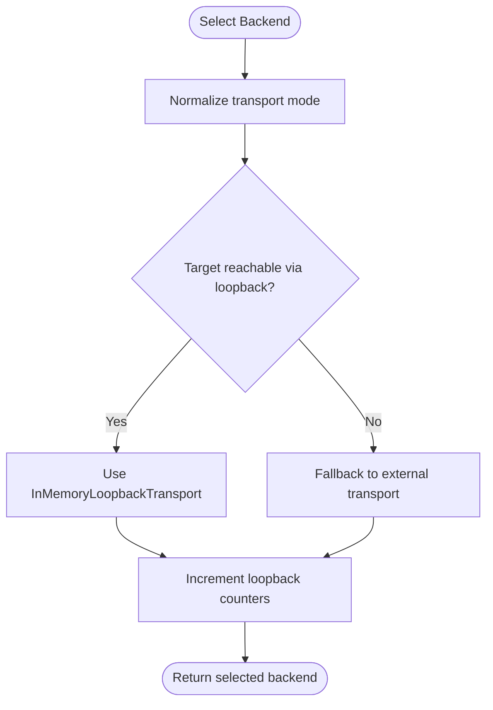
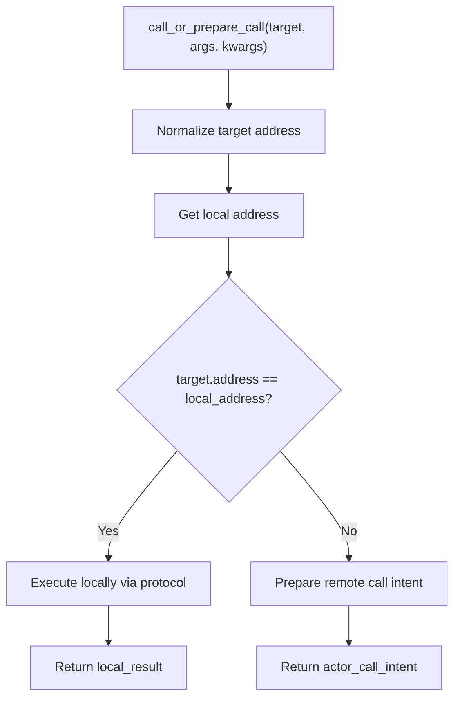
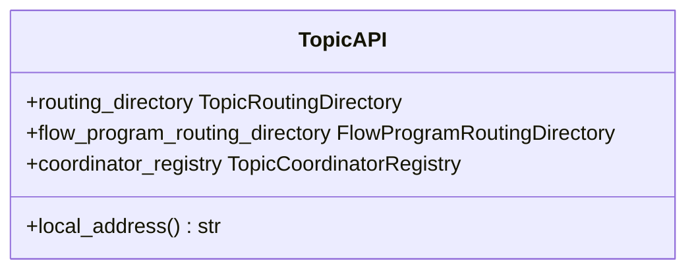
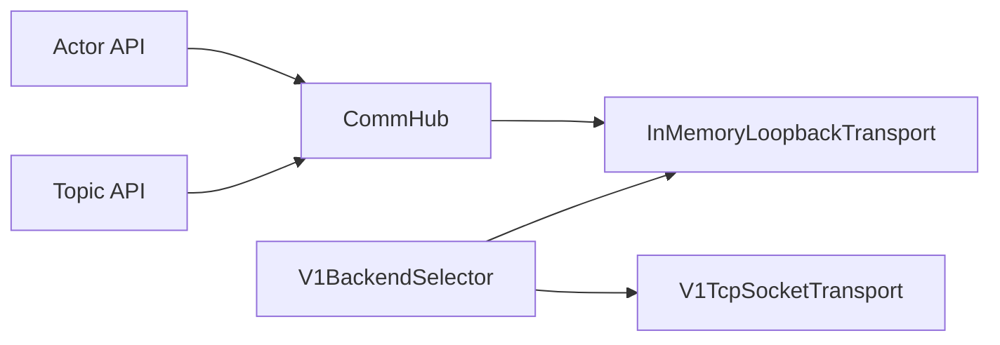

# Loopback Mechanisms

<cite>
**Referenced Files in This Document**
- [loopback.py](file://src/sage/runtime/flownet/runtime/comm/loopback.py)
- [hub.py](file://src/sage/runtime/flownet/runtime/comm/hub.py)
- [backends.py](file://src/sage/runtime/flownet/runtime/comm/backends.py)
- [actor_api.py](file://src/sage/runtime/flownet/runtime/actors/actor_api.py)
- [topic_api.py](file://src/sage/runtime/flownet/runtime/topics/topic_api.py)
</cite>

## Table of Contents
1. [Introduction](#introduction)
2. [Project Structure](#project-structure)
3. [Core Components](#core-components)
4. [Architecture Overview](#architecture-overview)
5. [Detailed Component Analysis](#detailed-component-analysis)
6. [Dependency Analysis](#dependency-analysis)
7. [Performance Considerations](#performance-considerations)
8. [Troubleshooting Guide](#troubleshooting-guide)
9. [Conclusion](#conclusion)

## Introduction
This document explains SAGE’s loopback mechanisms for internal communication within a single process or node. It focuses on how loopback enables local communication by bypassing external transport layers, the internal routing decisions that detect and optimize for local paths, and how the broader communication system integrates loopback with TCP and other transports. Practical guidance is included for configuration, performance measurement, and troubleshooting internal messaging issues.

## Project Structure
The loopback system resides in the runtime communication subsystem under the flownet package. The most relevant files are:
- Loopback transport implementation
- Communication hub that wires loopback by default
- Backend selector that chooses loopback vs. external transports
- Actor API that detects local calls and routes accordingly
- Topic API that manages local addressing and routing

**Diagram sources**
- [loopback.py:12-154](file://src/sage/runtime/flownet/runtime/comm/loopback.py#L12-L154)
- [hub.py:39-92](file://src/sage/runtime/flownet/runtime/comm/hub.py#L39-L92)
- [backends.py:280-319](file://src/sage/runtime/flownet/runtime/comm/backends.py#L280-L319)
- [actor_api.py:137-164](file://src/sage/runtime/flownet/runtime/actors/actor_api.py#L137-L164)
- [topic_api.py:47-72](file://src/sage/runtime/flownet/runtime/topics/topic_api.py#L47-L72)

**Section sources**
- [loopback.py:12-154](file://src/sage/runtime/flownet/runtime/comm/loopback.py#L12-L154)
- [hub.py:39-92](file://src/sage/runtime/flownet/runtime/comm/hub.py#L39-L92)
- [backends.py:280-319](file://src/sage/runtime/flownet/runtime/comm/backends.py#L280-L319)
- [actor_api.py:137-164](file://src/sage/runtime/flownet/runtime/actors/actor_api.py#L137-L164)
- [topic_api.py:47-72](file://src/sage/runtime/flownet/runtime/topics/topic_api.py#L47-L72)

## Core Components
- InMemoryLoopbackTransport: Provides in-process message delivery by resolving registered endpoints and invoking receivers directly. It tracks statistics and inflight tasks for robust operation.
- CommHub: The primary entry point for sending messages. By default binds to an in-memory loopback transport and registers a local endpoint for receiving messages.
- V1BackendSelector: Chooses the appropriate transport backend (loopback, TCP, UDS, SHM) based on configuration and routing decisions. It maintains counters for send totals, fallbacks, and backend selection.
- Actor API: Detects whether a target address equals the local address and executes calls locally without crossing transport boundaries.
- Topic API: Manages local addressing and routing for topics, enabling internal routing decisions and local communication.

Key responsibilities:
- Loopback detection: Compare target address with local address to decide local vs. remote routing.
- Internal routing: Use loopback transport for local destinations and hub receiver registration.
- Transport selection: Choose loopback when feasible and fall back to external transports otherwise.
- Local execution: Invoke receivers directly for loopback messages to avoid overhead.

**Section sources**
- [loopback.py:12-154](file://src/sage/runtime/flownet/runtime/comm/loopback.py#L12-L154)
- [hub.py:39-92](file://src/sage/runtime/flownet/runtime/comm/hub.py#L39-L92)
- [backends.py:280-319](file://src/sage/runtime/flownet/runtime/comm/backends.py#L280-L319)
- [actor_api.py:137-164](file://src/sage/runtime/flownet/runtime/actors/actor_api.py#L137-L164)
- [topic_api.py:47-72](file://src/sage/runtime/flownet/runtime/topics/topic_api.py#L47-L72)

## Architecture Overview
The loopback architecture centers on a hub that registers a local endpoint and delegates to an in-memory loopback transport for local messages. The backend selector can route to loopback or external transports depending on configuration and availability. Actors and topics leverage local addressing to trigger internal routing and avoid external transport overhead.

**Diagram sources**
- [hub.py:68-92](file://src/sage/runtime/flownet/runtime/comm/hub.py#L68-L92)
- [loopback.py:50-67](file://src/sage/runtime/flownet/runtime/comm/loopback.py#L50-L67)

**Section sources**
- [hub.py:39-92](file://src/sage/runtime/flownet/runtime/comm/hub.py#L39-L92)
- [loopback.py:12-154](file://src/sage/runtime/flownet/runtime/comm/loopback.py#L12-L154)

## Detailed Component Analysis

### InMemoryLoopbackTransport
The loopback transport provides direct, in-process delivery:
- Endpoint registration: Associates addresses with receivers and resolves them during send.
- Delivery semantics: Invokes the receiver synchronously or schedules it asynchronously if it returns an awaitable.
- Task lifecycle: Tracks inflight tasks, cleans up upon completion, and records errors.
- Statistics: Maintains counters for total sends, dropped messages, and receiver errors.

**Diagram sources**
- [loopback.py:12-154](file://src/sage/runtime/flownet/runtime/comm/loopback.py#L12-L154)

**Section sources**
- [loopback.py:12-154](file://src/sage/runtime/flownet/runtime/comm/loopback.py#L12-L154)

### CommHub
The hub encapsulates local addressing and transport binding:
- Local endpoint: Registers itself as a receiver for the configured local address.
- Default transport: Uses an in-memory loopback transport when none is provided.
- Send method: Constructs envelopes and forwards them to the transport.

**Diagram sources**
- [hub.py:39-92](file://src/sage/runtime/flownet/runtime/comm/hub.py#L39-L92)
- [loopback.py:12-154](file://src/sage/runtime/flownet/runtime/comm/loopback.py#L12-L154)

**Section sources**
- [hub.py:39-92](file://src/sage/runtime/flownet/runtime/comm/hub.py#L39-L92)

### Backend Selector and Transport Selection
The backend selector chooses loopback or external transports:
- Transport modes: Supports auto-selection and explicit backend choices.
- Counters: Tracks send totals per backend, fallback counts, and backend selection frequency.
- Compatibility: Maintains counters for UDS/SHM for schema compatibility even though loopback is used in this slice.

**Diagram sources**
- [backends.py:280-319](file://src/sage/runtime/flownet/runtime/comm/backends.py#L280-L319)

**Section sources**
- [backends.py:280-319](file://src/sage/runtime/flownet/runtime/comm/backends.py#L280-L319)

### Actor API Local Routing Decision
The actor API determines whether to execute a call locally:
- Address comparison: Compares the normalized target address with the local address.
- Local execution: Executes the call directly and returns a local result mode.
- Remote intent: Otherwise, returns an intent to perform a remote call.

**Diagram sources**
- [actor_api.py:137-164](file://src/sage/runtime/flownet/runtime/actors/actor_api.py#L137-L164)

**Section sources**
- [actor_api.py:137-164](file://src/sage/runtime/flownet/runtime/actors/actor_api.py#L137-L164)

### Topic API Local Addressing
The topic API supports local addressing:
- Local address initialization: Accepts either a static string or a callable that returns the current local address.
- Routing integration: Enables internal routing decisions and local delivery for topic events.

**Diagram sources**
- [topic_api.py:47-72](file://src/sage/runtime/flownet/runtime/topics/topic_api.py#L47-L72)

**Section sources**
- [topic_api.py:47-72](file://src/sage/runtime/flownet/runtime/topics/topic_api.py#L47-L72)

## Dependency Analysis
The loopback system integrates several components:
- CommHub depends on InMemoryLoopbackTransport and registers a local endpoint.
- Actor API depends on local addressing to decide between local and remote execution.
- Backend selector coordinates transport choice and maintains counters for loopback and fallbacks.
- Topic API provides local addressing for internal routing.

**Diagram sources**
- [hub.py:39-92](file://src/sage/runtime/flownet/runtime/comm/hub.py#L39-L92)
- [loopback.py:12-154](file://src/sage/runtime/flownet/runtime/comm/loopback.py#L12-L154)
- [backends.py:280-319](file://src/sage/runtime/flownet/runtime/comm/backends.py#L280-L319)
- [actor_api.py:137-164](file://src/sage/runtime/flownet/runtime/actors/actor_api.py#L137-L164)
- [topic_api.py:47-72](file://src/sage/runtime/flownet/runtime/topics/topic_api.py#L47-L72)

**Section sources**
- [hub.py:39-92](file://src/sage/runtime/flownet/runtime/comm/hub.py#L39-L92)
- [loopback.py:12-154](file://src/sage/runtime/flownet/runtime/comm/loopback.py#L12-L154)
- [backends.py:280-319](file://src/sage/runtime/flownet/runtime/comm/backends.py#L280-L319)
- [actor_api.py:137-164](file://src/sage/runtime/flownet/runtime/actors/actor_api.py#L137-L164)
- [topic_api.py:47-72](file://src/sage/runtime/flownet/runtime/topics/topic_api.py#L47-L72)

## Performance Considerations
- Bypassing external transport: Loopback avoids serialization, network stacks, and inter-process overhead, reducing latency and CPU usage for local operations.
- Direct invocation: Receivers are invoked directly, minimizing indirection compared to external transports.
- Asynchronous handling: Loopback supports asynchronous receivers and tracks inflight tasks to prevent resource leaks and maintain throughput.
- Statistics and monitoring: Loopback transport exposes counters for send totals, dropped messages, and receiver errors, enabling performance diagnostics and tuning.

Practical tips:
- Prefer loopback for intra-node operations to reduce overhead.
- Monitor loopback stats to detect misrouted messages or receiver errors.
- Use the backend selector’s counters to verify loopback utilization and fallback rates.

**Section sources**
- [loopback.py:50-76](file://src/sage/runtime/flownet/runtime/comm/loopback.py#L50-L76)
- [backends.py:280-319](file://src/sage/runtime/flownet/runtime/comm/backends.py#L280-L319)

## Troubleshooting Guide
Common issues and resolutions:
- Target not found: Loopback raises an error when no receiver is registered for the target address. Verify endpoint registration and address normalization.
  - Evidence: Loopback send path raises a runtime error when the receiver is missing.
- Receiver errors: Loopback increments receiver error counters when exceptions occur in receivers. Inspect logs and ensure proper error handling.
- Misrouted messages: If loopback counters show unexpectedly low usage, confirm backend selection logic and target address resolution.
- Pending requests: Use the hub’s pending request count to monitor outstanding operations and ensure timely completion.

Diagnostic steps:
- Confirm local address equality in actor API for local calls.
- Review loopback stats for send totals, drops, and receiver errors.
- Validate endpoint registration in the loopback transport.

**Section sources**
- [loopback.py:50-76](file://src/sage/runtime/flownet/runtime/comm/loopback.py#L50-L76)
- [loopback.py:106-118](file://src/sage/runtime/flownet/runtime/comm/loopback.py#L106-L118)
- [actor_api.py:137-164](file://src/sage/runtime/flownet/runtime/actors/actor_api.py#L137-L164)
- [hub.py:65-66](file://src/sage/runtime/flownet/runtime/comm/hub.py#L65-L66)

## Conclusion
SAGE’s loopback mechanisms provide efficient, in-process communication by detecting local targets and routing messages internally. The CommHub defaults to loopback, the loopback transport delivers messages directly to registered receivers, and the backend selector coordinates transport choices. Actor and topic APIs integrate local addressing to enable internal routing decisions. Together, these components optimize performance for local operations while maintaining compatibility with broader distributed communication patterns.