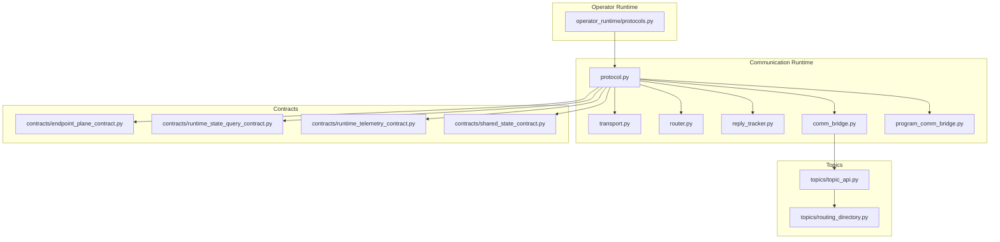
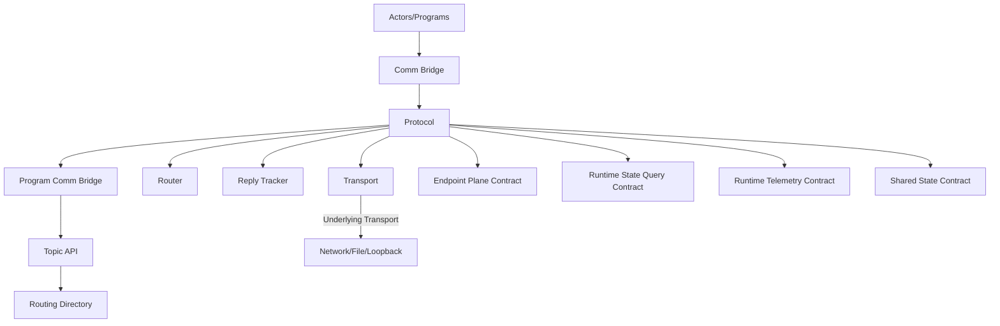
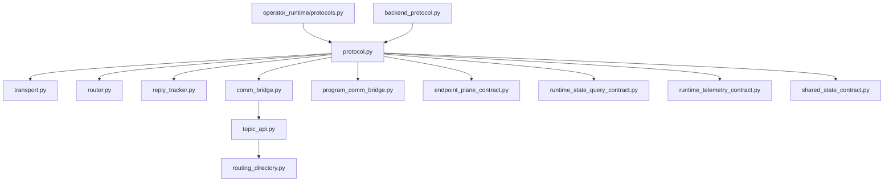

# Protocol and Message Handling

<cite>
**Referenced Files in This Document**
- [protocol.py](file://src/sage/runtime/flownet/runtime/comm/protocol.py)
- [reply_tracker.py](file://src/sage/runtime/flownet/runtime/comm/reply_tracker.py)
- [router.py](file://src/sage/runtime/flownet/runtime/comm/router.py)
- [transport.py](file://src/sage/runtime/flownet/runtime/comm/transport.py)
- [comm_bridge.py](file://src/sage/runtime/flownet/runtime/actors/comm_bridge.py)
- [backend_protocol.py](file://src/sage/runtime/backend_protocol.py)
- [protocols.py](file://src/sage/runtime/flownet/runtime/operator_runtime/protocols.py)
- [program_comm_bridge.py](file://src/sage/runtime/flownet/runtime/flowengine/program_comm_bridge.py)
- [topic_api.py](file://src/sage/runtime/flownet/runtime/topics/topic_api.py)
- [routing_directory.py](file://src/sage/runtime/flownet/runtime/topics/routing_directory.py)
- [endpoint_plane_contract.py](file://src/sage/runtime/flownet/contracts/endpoint_plane_contract.py)
- [runtime_state_query_contract.py](file://src/sage/runtime/flownet/contracts/runtime_state_query_contract.py)
- [runtime_telemetry_contract.py](file://src/sage/runtime/flownet/contracts/runtime_telemetry_contract.py)
- [shared_state_contract.py](file://src/sage/runtime/flownet/contracts/shared_state_contract.py)
</cite>

## Table of Contents
1. [Introduction](#introduction)
2. [Project Structure](#project-structure)
3. [Core Components](#core-components)
4. [Architecture Overview](#architecture-overview)
5. [Detailed Component Analysis](#detailed-component-analysis)
6. [Dependency Analysis](#dependency-analysis)
7. [Performance Considerations](#performance-considerations)
8. [Troubleshooting Guide](#troubleshooting-guide)
9. [Conclusion](#conclusion)

## Introduction
This document describes SAGE’s communication protocol definitions and message processing infrastructure. It explains how messages are structured, serialized, validated, and routed across distributed components, how replies are tracked, and how protocol negotiation and versioning are handled. It also covers the relationship between protocol handling and the transport layer, including protocol adaptation, message routing, and delivery guarantees. Practical configuration and debugging guidance is included to help operators set up and troubleshoot protocol behavior.

## Project Structure
SAGE’s communication stack is centered around a modular runtime subsystem under runtime/flownet/runtime/comm. The key modules are:
- protocol: Defines protocol abstractions and message formats
- transport: Provides transport-layer primitives and framing
- router: Routes messages to destinations based on routing keys
- reply_tracker: Tracks outstanding requests and correlates replies
- comm_bridge: Bridges higher-level runtime constructs to the protocol layer
- backend_protocol: Adapts external backend protocols to the internal runtime
- operator_runtime/protocols: Operator-level protocol definitions and behaviors
- program_comm_bridge: Program-level communication bridging
- topic_api and routing_directory: Topic-based routing and discovery
- contracts: Protocol contracts that define wire-level expectations

**Diagram sources**
- [protocol.py](file://src/sage/runtime/flownet/runtime/comm/protocol.py)
- [transport.py](file://src/sage/runtime/flownet/runtime/comm/transport.py)
- [router.py](file://src/sage/runtime/flownet/runtime/comm/router.py)
- [reply_tracker.py](file://src/sage/runtime/flownet/runtime/comm/reply_tracker.py)
- [comm_bridge.py](file://src/sage/runtime/flownet/runtime/actors/comm_bridge.py)
- [program_comm_bridge.py](file://src/sage/runtime/flownet/runtime/flowengine/program_comm_bridge.py)
- [protocols.py](file://src/sage/runtime/flownet/runtime/operator_runtime/protocols.py)
- [topic_api.py](file://src/sage/runtime/flownet/runtime/topics/topic_api.py)
- [routing_directory.py](file://src/sage/runtime/flownet/runtime/topics/routing_directory.py)
- [endpoint_plane_contract.py](file://src/sage/runtime/flownet/contracts/endpoint_plane_contract.py)
- [runtime_state_query_contract.py](file://src/sage/runtime/flownet/contracts/runtime_state_query_contract.py)
- [runtime_telemetry_contract.py](file://src/sage/runtime/flownet/contracts/runtime_telemetry_contract.py)
- [shared_state_contract.py](file://src/sage/runtime/flownet/contracts/shared_state_contract.py)

**Section sources**
- [protocol.py](file://src/sage/runtime/flownet/runtime/comm/protocol.py)
- [transport.py](file://src/sage/runtime/flownet/runtime/comm/transport.py)
- [router.py](file://src/sage/runtime/flownet/runtime/comm/router.py)
- [reply_tracker.py](file://src/sage/runtime/flownet/runtime/comm/reply_tracker.py)
- [comm_bridge.py](file://src/sage/runtime/flownet/runtime/actors/comm_bridge.py)
- [program_comm_bridge.py](file://src/sage/runtime/flownet/runtime/flowengine/program_comm_bridge.py)
- [protocols.py](file://src/sage/runtime/flownet/runtime/operator_runtime/protocols.py)
- [topic_api.py](file://src/sage/runtime/flownet/runtime/topics/topic_api.py)
- [routing_directory.py](file://src/sage/runtime/flownet/runtime/topics/routing_directory.py)
- [endpoint_plane_contract.py](file://src/sage/runtime/flownet/contracts/endpoint_plane_contract.py)
- [runtime_state_query_contract.py](file://src/sage/runtime/flownet/contracts/runtime_state_query_contract.py)
- [runtime_telemetry_contract.py](file://src/sage/runtime/flownet/contracts/runtime_telemetry_contract.py)
- [shared_state_contract.py](file://src/sage/runtime/flownet/contracts/shared_state_contract.py)

## Core Components
This section outlines the primary building blocks of SAGE’s protocol and message handling system.

- Protocol Abstractions and Message Formats
  - Defines message envelopes, headers, and payload structures used across the runtime.
  - Establishes serialization boundaries and wire-level framing.
  - Provides protocol negotiation hooks and versioning metadata.

- Transport Layer
  - Encapsulates transport-specific framing and delivery semantics.
  - Exposes send/receive primitives and connection lifecycle events.

- Router
  - Resolves routing keys to destinations using topic-based or explicit routing.
  - Supports dynamic routing updates and failure-aware forwarding.

- Reply Tracking
  - Correlates outbound requests with inbound replies via correlation identifiers.
  - Implements timeouts and retry policies for robust reply tracking.

- Communication Bridge
  - Bridges higher-level runtime constructs (actors, programs) to the protocol layer.
  - Normalizes message formats and enforces validation before transmission.

- Backend Protocol Adapter
  - Adapts external backend protocols to the internal runtime messaging model.
  - Handles protocol-specific serialization/deserialization and compatibility shims.

- Operator Runtime Protocols
  - Defines operator-level protocol behaviors and message sequences.
  - Coordinates protocol state transitions and error handling within operators.

- Program Communication Bridge
  - Manages program-level communication flows and coordination.
  - Integrates with the broader runtime to ensure consistent protocol behavior.

- Topic API and Routing Directory
  - Provides topic-based routing and discovery mechanisms.
  - Maintains routing tables and supports dynamic route updates.

- Contracts
  - Define wire-level expectations for endpoint plane, runtime state queries, telemetry, and shared state.
  - Serve as canonical references for protocol negotiation and validation.

**Section sources**
- [protocol.py](file://src/sage/runtime/flownet/runtime/comm/protocol.py)
- [transport.py](file://src/sage/runtime/flownet/runtime/comm/transport.py)
- [router.py](file://src/sage/runtime/flownet/runtime/comm/router.py)
- [reply_tracker.py](file://src/sage/runtime/flownet/runtime/comm/reply_tracker.py)
- [comm_bridge.py](file://src/sage/runtime/flownet/runtime/actors/comm_bridge.py)
- [backend_protocol.py](file://src/sage/runtime/backend_protocol.py)
- [protocols.py](file://src/sage/runtime/flownet/runtime/operator_runtime/protocols.py)
- [program_comm_bridge.py](file://src/sage/runtime/flownet/runtime/flowengine/program_comm_bridge.py)
- [topic_api.py](file://src/sage/runtime/flownet/runtime/topics/topic_api.py)
- [routing_directory.py](file://src/sage/runtime/flownet/runtime/topics/routing_directory.py)
- [endpoint_plane_contract.py](file://src/sage/runtime/flownet/contracts/endpoint_plane_contract.py)
- [runtime_state_query_contract.py](file://src/sage/runtime/flownet/contracts/runtime_state_query_contract.py)
- [runtime_telemetry_contract.py](file://src/sage/runtime/flownet/contracts/runtime_telemetry_contract.py)
- [shared_state_contract.py](file://src/sage/runtime/flownet/contracts/shared_state_contract.py)

## Architecture Overview
The protocol and message handling architecture integrates protocol definitions, transport primitives, routing, and reply tracking into a cohesive system. Higher-level runtime components (actors, programs, topics) interact with the protocol layer through bridges, while contracts define the canonical wire-level behavior.

**Diagram sources**
- [protocol.py](file://src/sage/runtime/flownet/runtime/comm/protocol.py)
- [transport.py](file://src/sage/runtime/flownet/runtime/comm/transport.py)
- [router.py](file://src/sage/runtime/flownet/runtime/comm/router.py)
- [reply_tracker.py](file://src/sage/runtime/flownet/runtime/comm/reply_tracker.py)
- [comm_bridge.py](file://src/sage/runtime/flownet/runtime/actors/comm_bridge.py)
- [program_comm_bridge.py](file://src/sage/runtime/flownet/runtime/flowengine/program_comm_bridge.py)
- [topic_api.py](file://src/sage/runtime/flownet/runtime/topics/topic_api.py)
- [routing_directory.py](file://src/sage/runtime/flownet/runtime/topics/routing_directory.py)
- [endpoint_plane_contract.py](file://src/sage/runtime/flownet/contracts/endpoint_plane_contract.py)
- [runtime_state_query_contract.py](file://src/sage/runtime/flownet/contracts/runtime_state_query_contract.py)
- [runtime_telemetry_contract.py](file://src/sage/runtime/flownet/contracts/runtime_telemetry_contract.py)
- [shared_state_contract.py](file://src/sage/runtime/flownet/contracts/shared_state_contract.py)

## Detailed Component Analysis

### Protocol Abstractions and Message Formats
- Message Envelope
  - Defines standardized headers for routing, correlation, and protocol metadata.
  - Specifies payload serialization boundaries and optional compression flags.
- Serialization Mechanisms
  - Establishes canonical serialization for messages, ensuring cross-language and cross-version compatibility.
  - Provides hooks for custom serializers and version-specific encodings.
- Protocol Negotiation
  - Negotiates protocol versions and capabilities between peers.
  - Validates compatibility against contract expectations.
- Validation
  - Enforces message schema validation and header integrity checks.
  - Applies per-contract validation rules for endpoint plane, state queries, telemetry, and shared state.

Implementation references:
- [protocol.py](file://src/sage/runtime/flownet/runtime/comm/protocol.py)
- [endpoint_plane_contract.py](file://src/sage/runtime/flownet/contracts/endpoint_plane_contract.py)
- [runtime_state_query_contract.py](file://src/sage/runtime/flownet/contracts/runtime_state_query_contract.py)
- [runtime_telemetry_contract.py](file://src/sage/runtime/flownet/contracts/runtime_telemetry_contract.py)
- [shared_state_contract.py](file://src/sage/runtime/flownet/contracts/shared_state_contract.py)

**Section sources**
- [protocol.py](file://src/sage/runtime/flownet/runtime/comm/protocol.py)
- [endpoint_plane_contract.py](file://src/sage/runtime/flownet/contracts/endpoint_plane_contract.py)
- [runtime_state_query_contract.py](file://src/sage/runtime/flownet/contracts/runtime_state_query_contract.py)
- [runtime_telemetry_contract.py](file://src/sage/runtime/flownet/contracts/runtime_telemetry_contract.py)
- [shared_state_contract.py](file://src/sage/runtime/flownet/contracts/shared_state_contract.py)

### Transport Layer
- Framing and Delivery Semantics
  - Provides framing primitives and delivery guarantees aligned with the underlying transport medium.
  - Handles connection establishment, keepalive, and teardown.
- Protocol Adaptation
  - Adapts protocol messages to transport-specific constraints (e.g., MTU, fragmentation).
  - Implements backpressure and flow control where applicable.
- Error Handling
  - Surfaces transport-level errors to the protocol layer for recovery and retry decisions.

Implementation references:
- [transport.py](file://src/sage/runtime/flownet/runtime/comm/transport.py)

**Section sources**
- [transport.py](file://src/sage/runtime/flownet/runtime/comm/transport.py)

### Router
- Routing Keys and Destinations
  - Resolves routing keys to destination endpoints using topic-based or explicit routing.
  - Supports dynamic routing updates and route invalidation on failures.
- Failure-Aware Forwarding
  - Implements retry and failover strategies for transient failures.
  - Maintains routing health metrics and updates routing tables accordingly.

Implementation references:
- [router.py](file://src/sage/runtime/flownet/runtime/comm/router.py)
- [topic_api.py](file://src/sage/runtime/flownet/runtime/topics/topic_api.py)
- [routing_directory.py](file://src/sage/runtime/flownet/runtime/topics/routing_directory.py)

**Section sources**
- [router.py](file://src/sage/runtime/flownet/runtime/comm/router.py)
- [topic_api.py](file://src/sage/runtime/flownet/runtime/topics/topic_api.py)
- [routing_directory.py](file://src/sage/runtime/flownet/runtime/topics/routing_directory.py)

### Reply Tracking
- Correlation and Timeout Management
  - Correlates outbound requests with inbound replies using correlation identifiers.
  - Implements timeout-based cleanup and retry policies for unacknowledged requests.
- State Management
  - Maintains in-flight request state and tracks reply arrival order.
  - Handles out-of-band cancellation and premature termination scenarios.

Implementation references:
- [reply_tracker.py](file://src/sage/runtime/flownet/runtime/comm/reply_tracker.py)

**Section sources**
- [reply_tracker.py](file://src/sage/runtime/flownet/runtime/comm/reply_tracker.py)

### Communication Bridges
- Actor-Level Bridge
  - Bridges actor-level operations to the protocol layer, normalizing messages and enforcing validation.
  - Integrates with reply tracking for request-reply flows.
- Program-Level Bridge
  - Manages program-level communication flows and ensures consistent protocol behavior across program boundaries.
  - Coordinates with topic routing for publish-subscribe patterns.

Implementation references:
- [comm_bridge.py](file://src/sage/runtime/flownet/runtime/actors/comm_bridge.py)
- [program_comm_bridge.py](file://src/sage/runtime/flownet/runtime/flowengine/program_comm_bridge.py)

**Section sources**
- [comm_bridge.py](file://src/sage/runtime/flownet/runtime/actors/comm_bridge.py)
- [program_comm_bridge.py](file://src/sage/runtime/flownet/runtime/flowengine/program_comm_bridge.py)

### Backend Protocol Adapter
- External Protocol Integration
  - Adapts external backend protocols to the internal runtime messaging model.
  - Handles serialization/deserialization differences and compatibility shims.
- Versioning and Compatibility
  - Ensures backward compatibility across protocol versions and external backend changes.

Implementation references:
- [backend_protocol.py](file://src/sage/runtime/backend_protocol.py)

**Section sources**
- [backend_protocol.py](file://src/sage/runtime/backend_protocol.py)

### Operator Runtime Protocols
- Operator-Level Behaviors
  - Defines operator-level protocol behaviors and message sequences.
  - Coordinates protocol state transitions and error handling within operators.
- Coordination and Sequencing
  - Ensures ordered and reliable message exchange among operators.

Implementation references:
- [protocols.py](file://src/sage/runtime/flownet/runtime/operator_runtime/protocols.py)

**Section sources**
- [protocols.py](file://src/sage/runtime/flownet/runtime/operator_runtime/protocols.py)

### Contracts and Wire-Level Expectations
- Endpoint Plane Contract
  - Defines endpoint registration, discovery, and lifecycle management expectations.
- Runtime State Query Contract
  - Defines state query and response formats, including pagination and filtering.
- Runtime Telemetry Contract
  - Defines telemetry data formats and reporting cadence.
- Shared State Contract
  - Defines shared state update and synchronization semantics.

Implementation references:
- [endpoint_plane_contract.py](file://src/sage/runtime/flownet/contracts/endpoint_plane_contract.py)
- [runtime_state_query_contract.py](file://src/sage/runtime/flownet/contracts/runtime_state_query_contract.py)
- [runtime_telemetry_contract.py](file://src/sage/runtime/flownet/contracts/runtime_telemetry_contract.py)
- [shared_state_contract.py](file://src/sage/runtime/flownet/contracts/shared_state_contract.py)

**Section sources**
- [endpoint_plane_contract.py](file://src/sage/runtime/flownet/contracts/endpoint_plane_contract.py)
- [runtime_state_query_contract.py](file://src/sage/runtime/flownet/contracts/runtime_state_query_contract.py)
- [runtime_telemetry_contract.py](file://src/sage/runtime/flownet/contracts/runtime_telemetry_contract.py)
- [shared_state_contract.py](file://src/sage/runtime/flownet/contracts/shared_state_contract.py)

## Dependency Analysis
The communication runtime exhibits strong cohesion within its modules and clear separation of concerns. The protocol module orchestrates transport, routing, and reply tracking, while bridges integrate with higher-level runtime constructs. Contracts define canonical expectations that guide protocol behavior and validation.

**Diagram sources**
- [protocol.py](file://src/sage/runtime/flownet/runtime/comm/protocol.py)
- [transport.py](file://src/sage/runtime/flownet/runtime/comm/transport.py)
- [router.py](file://src/sage/runtime/flownet/runtime/comm/router.py)
- [reply_tracker.py](file://src/sage/runtime/flownet/runtime/comm/reply_tracker.py)
- [comm_bridge.py](file://src/sage/runtime/flownet/runtime/actors/comm_bridge.py)
- [program_comm_bridge.py](file://src/sage/runtime/flownet/runtime/flowengine/program_comm_bridge.py)
- [protocols.py](file://src/sage/runtime/flownet/runtime/operator_runtime/protocols.py)
- [backend_protocol.py](file://src/sage/runtime/backend_protocol.py)
- [topic_api.py](file://src/sage/runtime/flownet/runtime/topics/topic_api.py)
- [routing_directory.py](file://src/sage/runtime/flownet/runtime/topics/routing_directory.py)
- [endpoint_plane_contract.py](file://src/sage/runtime/flownet/contracts/endpoint_plane_contract.py)
- [runtime_state_query_contract.py](file://src/sage/runtime/flownet/contracts/runtime_state_query_contract.py)
- [runtime_telemetry_contract.py](file://src/sage/runtime/flownet/contracts/runtime_telemetry_contract.py)
- [shared_state_contract.py](file://src/sage/runtime/flownet/contracts/shared_state_contract.py)

**Section sources**
- [protocol.py](file://src/sage/runtime/flownet/runtime/comm/protocol.py)
- [transport.py](file://src/sage/runtime/flownet/runtime/comm/transport.py)
- [router.py](file://src/sage/runtime/flownet/runtime/comm/router.py)
- [reply_tracker.py](file://src/sage/runtime/flownet/runtime/comm/reply_tracker.py)
- [comm_bridge.py](file://src/sage/runtime/flownet/runtime/actors/comm_bridge.py)
- [program_comm_bridge.py](file://src/sage/runtime/flownet/runtime/flowengine/program_comm_bridge.py)
- [protocols.py](file://src/sage/runtime/flownet/runtime/operator_runtime/protocols.py)
- [backend_protocol.py](file://src/sage/runtime/backend_protocol.py)
- [topic_api.py](file://src/sage/runtime/flownet/runtime/topics/topic_api.py)
- [routing_directory.py](file://src/sage/runtime/flownet/runtime/topics/routing_directory.py)
- [endpoint_plane_contract.py](file://src/sage/runtime/flownet/contracts/endpoint_plane_contract.py)
- [runtime_state_query_contract.py](file://src/sage/runtime/flownet/contracts/runtime_state_query_contract.py)
- [runtime_telemetry_contract.py](file://src/sage/runtime/flownet/contracts/runtime_telemetry_contract.py)
- [shared_state_contract.py](file://src/sage/runtime/flownet/contracts/shared_state_contract.py)

## Performance Considerations
- Serialization Overhead
  - Prefer compact serialization formats for high-throughput scenarios; leverage compression flags where appropriate.
- Routing Efficiency
  - Minimize routing table churn; use efficient lookup structures and cache frequently accessed routes.
- Reply Tracking Scalability
  - Tune timeout and cleanup intervals to balance memory usage and responsiveness.
- Transport Backpressure
  - Implement flow control and batching to avoid overwhelming downstream components.
- Contract Validation Costs
  - Apply validation selectively for high-value contracts; consider lazy validation for low-risk paths.

## Troubleshooting Guide
- Protocol Negotiation Failures
  - Verify negotiated versions match supported ranges; confirm capability flags align with contract expectations.
  - Check endpoint plane registration and discovery for misconfigurations.
- Message Validation Errors
  - Inspect message headers and payload schemas against the relevant contract definitions.
  - Enable verbose logging for serialization/deserialization failures.
- Reply Tracking Issues
  - Confirm correlation identifiers are preserved across hops; review timeout and retry configurations.
  - Investigate in-flight request accumulation indicating upstream failures or missing replies.
- Transport Problems
  - Validate transport framing and delivery guarantees; check connection health and reconnection policies.
- Routing Failures
  - Review routing directory entries and topic subscriptions; ensure routes are consistent across nodes.
- Debugging Protocol Issues
  - Enable protocol-level logs to trace message flow from bridge through router to transport.
  - Use contract references to validate wire-level compliance and identify deviations.

**Section sources**
- [protocol.py](file://src/sage/runtime/flownet/runtime/comm/protocol.py)
- [transport.py](file://src/sage/runtime/flownet/runtime/comm/transport.py)
- [router.py](file://src/sage/runtime/flownet/runtime/comm/router.py)
- [reply_tracker.py](file://src/sage/runtime/flownet/runtime/comm/reply_tracker.py)
- [comm_bridge.py](file://src/sage/runtime/flownet/runtime/actors/comm_bridge.py)
- [program_comm_bridge.py](file://src/sage/runtime/flownet/runtime/flowengine/program_comm_bridge.py)
- [topic_api.py](file://src/sage/runtime/flownet/runtime/topics/topic_api.py)
- [routing_directory.py](file://src/sage/runtime/flownet/runtime/topics/routing_directory.py)
- [endpoint_plane_contract.py](file://src/sage/runtime/flownet/contracts/endpoint_plane_contract.py)
- [runtime_state_query_contract.py](file://src/sage/runtime/flownet/contracts/runtime_state_query_contract.py)
- [runtime_telemetry_contract.py](file://src/sage/runtime/flownet/contracts/runtime_telemetry_contract.py)
- [shared_state_contract.py](file://src/sage/runtime/flownet/contracts/shared_state_contract.py)

## Conclusion
SAGE’s protocol and message handling system provides a robust, extensible framework for distributed communication. By separating concerns across protocol, transport, routing, and reply tracking, and by anchoring behavior to canonical contracts, the system achieves strong interoperability, maintainability, and debuggability. Operators can configure and troubleshoot protocol behavior effectively by leveraging the described components and their relationships.