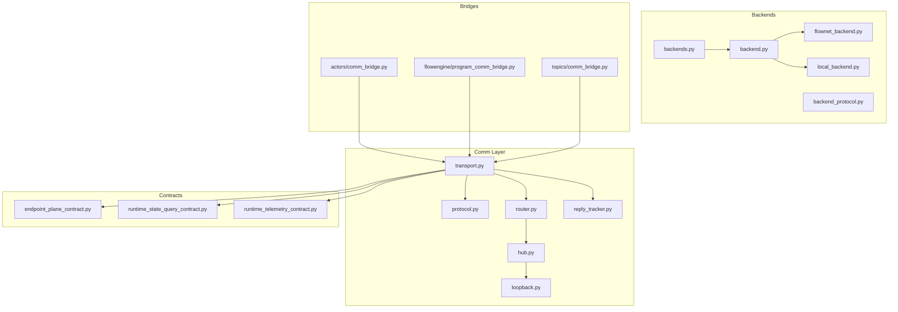
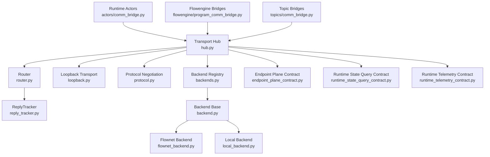
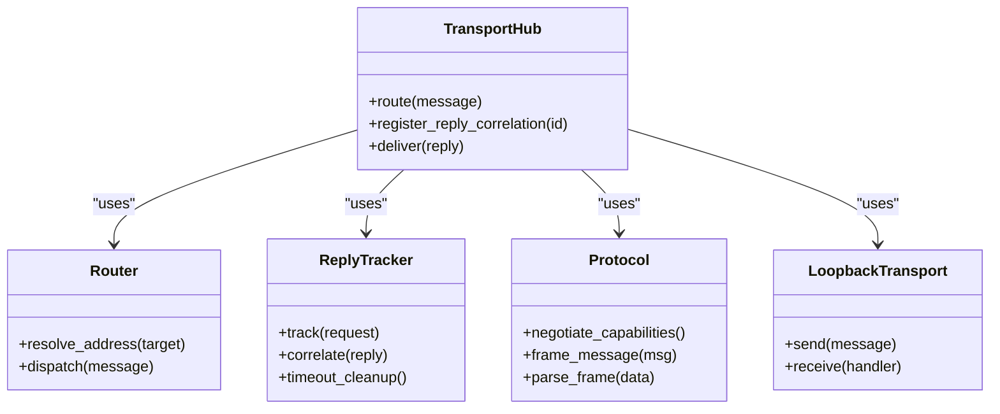
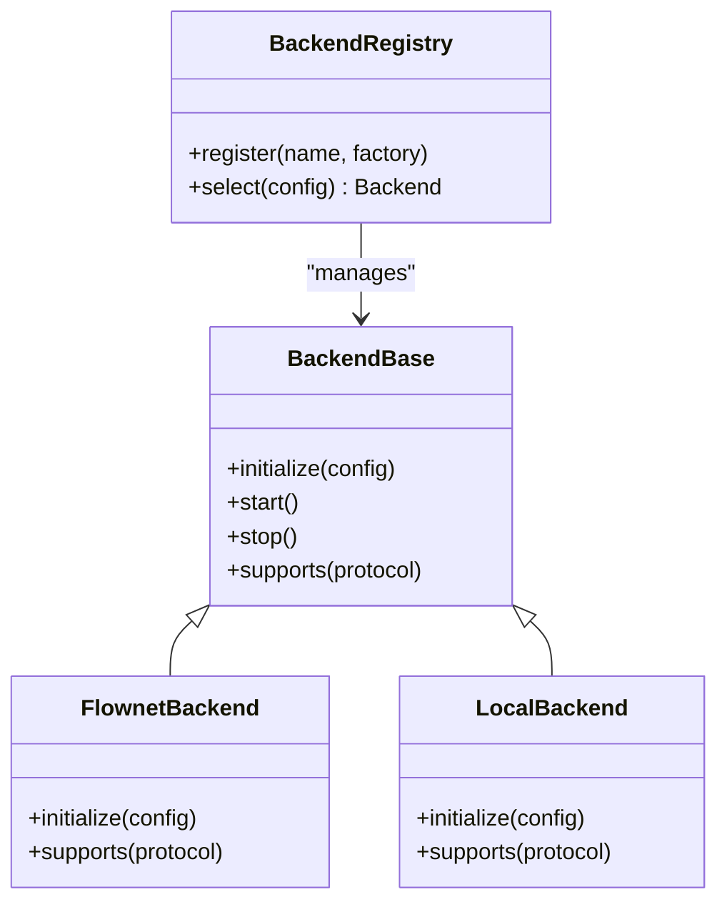
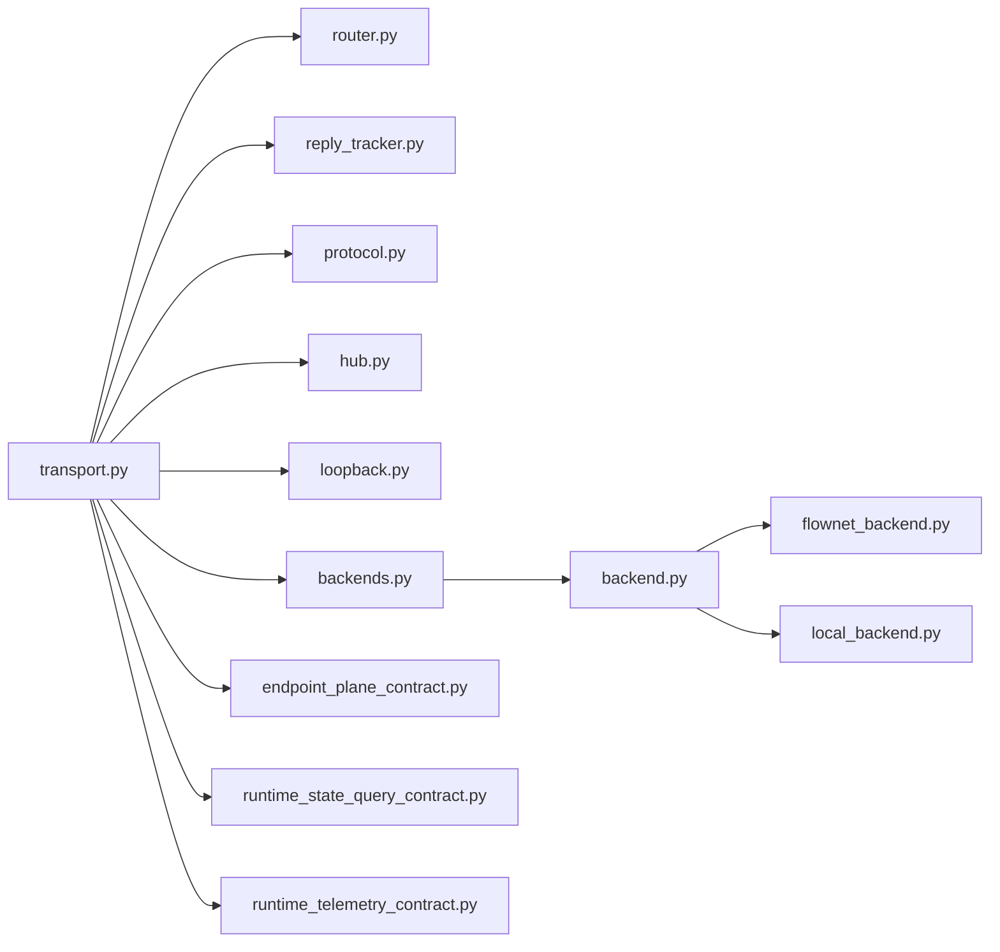

# Transport Layer and Backends

<cite>
**Referenced Files in This Document**
- [transport.py](file://src/sage/runtime/flownet/runtime/comm/transport.py)
- [backends.py](file://src/sage/runtime/flownet/runtime/comm/backends.py)
- [protocol.py](file://src/sage/runtime/flownet/runtime/comm/protocol.py)
- [hub.py](file://src/sage/runtime/flownet/runtime/comm/hub.py)
- [loopback.py](file://src/sage/runtime/flownet/runtime/comm/loopback.py)
- [router.py](file://src/sage/runtime/flownet/runtime/comm/router.py)
- [reply_tracker.py](file://src/sage/runtime/flownet/runtime/comm/reply_tracker.py)
- [comm_bridge.py](file://src/sage/runtime/flownet/runtime/actors/comm_bridge.py)
- [program_comm_bridge.py](file://src/sage/runtime/flownet/runtime/flowengine/program_comm_bridge.py)
- [topics/comm_bridge.py](file://src/sage/runtime/flownet/runtime/topics/comm_bridge.py)
- [backend.py](file://src/sage/runtime/backend.py)
- [flownet_backend.py](file://src/sage/runtime/flownet_backend.py)
- [local_backend.py](file://src/sage/runtime/local_backend.py)
- [backend_protocol.py](file://src/sage/runtime/backend_protocol.py)
- [endpoint_plane_contract.py](file://src/sage/runtime/flownet/contracts/endpoint_plane_contract.py)
- [runtime_state_query_contract.py](file://src/sage/runtime/flownet/contracts/runtime_state_query_contract.py)
- [runtime_telemetry_contract.py](file://src/sage/runtime/flownet/contracts/runtime_telemetry_contract.py)
</cite>

## Table of Contents
1. [Introduction](#introduction)
2. [Project Structure](#project-structure)
3. [Core Components](#core-components)
4. [Architecture Overview](#architecture-overview)
5. [Detailed Component Analysis](#detailed-component-analysis)
6. [Dependency Analysis](#dependency-analysis)
7. [Performance Considerations](#performance-considerations)
8. [Troubleshooting Guide](#troubleshooting-guide)
9. [Conclusion](#conclusion)

## Introduction
This document explains SAGE’s transport layer and backends that enable reliable, scalable message delivery across distributed runtime components. It covers the transport abstraction, backend registration and selection, protocol negotiation, connection management, and error handling patterns. It also connects the transport layer to higher-level communication protocols and runtime contracts, and provides practical guidance for configuration, backend selection, and troubleshooting.

## Project Structure
The transport and backend subsystem resides under the runtime communication package and integrates with runtime actors and contracts:
- Transport primitives and abstractions: transport.py, protocol.py, router.py, reply_tracker.py, hub.py, loopback.py
- Backend selection and registration: backends.py, backend.py, flownet_backend.py, local_backend.py, backend_protocol.py
- Bridges connecting transports to runtime constructs: actors/comm_bridge.py, flowengine/program_comm_bridge.py, topics/comm_bridge.py
- Runtime contracts that define transport-related interfaces: endpoint_plane_contract.py, runtime_state_query_contract.py, runtime_telemetry_contract.py



**Diagram sources**
- [transport.py](file://src/sage/runtime/flownet/runtime/comm/transport.py)
- [protocol.py](file://src/sage/runtime/flownet/runtime/comm/protocol.py)
- [router.py](file://src/sage/runtime/flownet/runtime/comm/router.py)
- [reply_tracker.py](file://src/sage/runtime/flownet/runtime/comm/reply_tracker.py)
- [hub.py](file://src/sage/runtime/flownet/runtime/comm/hub.py)
- [loopback.py](file://src/sage/runtime/flownet/runtime/comm/loopback.py)
- [backends.py](file://src/sage/runtime/flownet/runtime/comm/backends.py)
- [backend.py](file://src/sage/runtime/backend.py)
- [flownet_backend.py](file://src/sage/runtime/flownet_backend.py)
- [local_backend.py](file://src/sage/runtime/local_backend.py)
- [backend_protocol.py](file://src/sage/runtime/backend_protocol.py)
- [comm_bridge.py](file://src/sage/runtime/flownet/runtime/actors/comm_bridge.py)
- [program_comm_bridge.py](file://src/sage/runtime/flownet/runtime/flowengine/program_comm_bridge.py)
- [topics/comm_bridge.py](file://src/sage/runtime/flownet/runtime/topics/comm_bridge.py)
- [endpoint_plane_contract.py](file://src/sage/runtime/flownet/contracts/endpoint_plane_contract.py)
- [runtime_state_query_contract.py](file://src/sage/runtime/flownet/contracts/runtime_state_query_contract.py)
- [runtime_telemetry_contract.py](file://src/sage/runtime/flownet/contracts/runtime_telemetry_contract.py)

**Section sources**
- [transport.py](file://src/sage/runtime/flownet/runtime/comm/transport.py)
- [backends.py](file://src/sage/runtime/flownet/runtime/comm/backends.py)
- [backend.py](file://src/sage/runtime/backend.py)
- [flownet_backend.py](file://src/sage/runtime/flownet_backend.py)
- [local_backend.py](file://src/sage/runtime/local_backend.py)
- [backend_protocol.py](file://src/sage/runtime/backend_protocol.py)
- [comm_bridge.py](file://src/sage/runtime/flownet/runtime/actors/comm_bridge.py)
- [program_comm_bridge.py](file://src/sage/runtime/flownet/runtime/flowengine/program_comm_bridge.py)
- [topics/comm_bridge.py](file://src/sage/runtime/flownet/runtime/topics/comm_bridge.py)
- [endpoint_plane_contract.py](file://src/sage/runtime/flownet/contracts/endpoint_plane_contract.py)
- [runtime_state_query_contract.py](file://src/sage/runtime/flownet/contracts/runtime_state_query_contract.py)
- [runtime_telemetry_contract.py](file://src/sage/runtime/flownet/contracts/runtime_telemetry_contract.py)

## Core Components
- Transport abstraction: Defines message delivery semantics, addressing, routing, and reply tracking. Implemented in transport.py and extended by protocol.py for framing/negotiation.
- Backend selection and registration: Centralized mechanism in backends.py to register and select transport backends (e.g., loopback, flownet, local) via backend.py and backend_protocol.py.
- Routing and dispatch: Router and Hub coordinate message routing and endpoint resolution.
- Reply tracking: ReplyTracker maintains correlation between requests and replies for reliable delivery.
- Bridges: Comm bridges connect transport to runtime constructs (actors, flowengine, topics) enabling higher-level protocols to leverage transport capabilities.
- Contracts: Endpoint plane, runtime state query, and telemetry contracts define transport-related interfaces and expectations.

Key responsibilities:
- Transport: encapsulates protocol negotiation, addressing, and delivery guarantees
- Backends: provide concrete transport implementations and lifecycle management
- Bridges: translate runtime operations into transport messages and handle replies
- Contracts: specify wire-level and runtime semantics for transport-enabled features

**Section sources**
- [transport.py](file://src/sage/runtime/flownet/runtime/comm/transport.py)
- [protocol.py](file://src/sage/runtime/flownet/runtime/comm/protocol.py)
- [router.py](file://src/sage/runtime/flownet/runtime/comm/router.py)
- [reply_tracker.py](file://src/sage/runtime/flownet/runtime/comm/reply_tracker.py)
- [hub.py](file://src/sage/runtime/flownet/runtime/comm/hub.py)
- [loopback.py](file://src/sage/runtime/flownet/runtime/comm/loopback.py)
- [backends.py](file://src/sage/runtime/flownet/runtime/comm/backends.py)
- [backend.py](file://src/sage/runtime/backend.py)
- [backend_protocol.py](file://src/sage/runtime/backend_protocol.py)
- [comm_bridge.py](file://src/sage/runtime/flownet/runtime/actors/comm_bridge.py)
- [program_comm_bridge.py](file://src/sage/runtime/flownet/runtime/flowengine/program_comm_bridge.py)
- [topics/comm_bridge.py](file://src/sage/runtime/flownet/runtime/topics/comm_bridge.py)
- [endpoint_plane_contract.py](file://src/sage/runtime/flownet/contracts/endpoint_plane_contract.py)
- [runtime_state_query_contract.py](file://src/sage/runtime/flownet/contracts/runtime_state_query_contract.py)
- [runtime_telemetry_contract.py](file://src/sage/runtime/flownet/contracts/runtime_telemetry_contract.py)

## Architecture Overview
The transport layer sits beneath higher-level runtime protocols and exposes a backend-agnostic interface. Backends implement concrete transport modes (e.g., loopback, local, flownet). Bridges integrate transport with runtime constructs, while contracts define the expected behavior for endpoint and state/query operations.



**Diagram sources**
- [hub.py](file://src/sage/runtime/flownet/runtime/comm/hub.py)
- [router.py](file://src/sage/runtime/flownet/runtime/comm/router.py)
- [reply_tracker.py](file://src/sage/runtime/flownet/runtime/comm/reply_tracker.py)
- [loopback.py](file://src/sage/runtime/flownet/runtime/comm/loopback.py)
- [protocol.py](file://src/sage/runtime/flownet/runtime/comm/protocol.py)
- [backends.py](file://src/sage/runtime/flownet/runtime/comm/backends.py)
- [backend.py](file://src/sage/runtime/backend.py)
- [flownet_backend.py](file://src/sage/runtime/flownet_backend.py)
- [local_backend.py](file://src/sage/runtime/local_backend.py)
- [comm_bridge.py](file://src/sage/runtime/flownet/runtime/actors/comm_bridge.py)
- [program_comm_bridge.py](file://src/sage/runtime/flownet/runtime/flowengine/program_comm_bridge.py)
- [topics/comm_bridge.py](file://src/sage/runtime/flownet/runtime/topics/comm_bridge.py)
- [endpoint_plane_contract.py](file://src/sage/runtime/flownet/contracts/endpoint_plane_contract.py)
- [runtime_state_query_contract.py](file://src/sage/runtime/flownet/contracts/runtime_state_query_contract.py)
- [runtime_telemetry_contract.py](file://src/sage/runtime/flownet/contracts/runtime_telemetry_contract.py)

## Detailed Component Analysis

### Transport Abstraction and Protocol Negotiation
- Transport defines the core messaging model, addressing scheme, and delivery semantics. It coordinates with Router for addressing and dispatch, and with ReplyTracker for correlation.
- Protocol negotiates framing and capability exchange between peers, ensuring compatibility before message exchange begins.
- Loopback transport provides an in-process transport mode for testing and internal routing.

Implementation highlights:
- Transport hub orchestrates routing and reply tracking
- Protocol negotiation establishes wire-level compatibility
- Loopback transport enables fast-path intra-process communication



**Diagram sources**
- [transport.py](file://src/sage/runtime/flownet/runtime/comm/transport.py)
- [protocol.py](file://src/sage/runtime/flownet/runtime/comm/protocol.py)
- [router.py](file://src/sage/runtime/flownet/runtime/comm/router.py)
- [reply_tracker.py](file://src/sage/runtime/flownet/runtime/comm/reply_tracker.py)
- [loopback.py](file://src/sage/runtime/flownet/runtime/comm/loopback.py)

**Section sources**
- [transport.py](file://src/sage/runtime/flownet/runtime/comm/transport.py)
- [protocol.py](file://src/sage/runtime/flownet/runtime/comm/protocol.py)
- [router.py](file://src/sage/runtime/flownet/runtime/comm/router.py)
- [reply_tracker.py](file://src/sage/runtime/flownet/runtime/comm/reply_tracker.py)
- [loopback.py](file://src/sage/runtime/flownet/runtime/comm/loopback.py)

### Backend Registration and Selection
- Backends module registers available transport implementations and exposes selection logic.
- Backend base class defines the contract for concrete backends (e.g., FlownetBackend, LocalBackend).
- Backend protocol defines the interface for backend capabilities and lifecycle.

Selection criteria:
- Backend type (loopback vs. remote)
- Capability negotiation (based on protocol)
- Runtime configuration and environment



**Diagram sources**
- [backends.py](file://src/sage/runtime/flownet/runtime/comm/backends.py)
- [backend.py](file://src/sage/runtime/backend.py)
- [flownet_backend.py](file://src/sage/runtime/flownet_backend.py)
- [local_backend.py](file://src/sage/runtime/local_backend.py)
- [backend_protocol.py](file://src/sage/runtime/backend_protocol.py)

**Section sources**
- [backends.py](file://src/sage/runtime/flownet/runtime/comm/backends.py)
- [backend.py](file://src/sage/runtime/backend.py)
- [flownet_backend.py](file://src/sage/runtime/flownet_backend.py)
- [local_backend.py](file://src/sage/runtime/local_backend.py)
- [backend_protocol.py](file://src/sage/runtime/backend_protocol.py)

### Bridges: Transport-to-Runtime Integration
- Actor Comm Bridge integrates transport with actor runtime, translating actor operations into transport messages and handling replies.
- Program Comm Bridge connects transport to flowengine program execution, enabling program-level messaging and coordination.
- Topic Comm Bridge enables topic-based messaging through transport.

Integration patterns:
- Request-reply correlation via ReplyTracker
- Address resolution via Router
- Endpoint registration via Hub

```mermaid
sequenceDiagram
participant Actor as "Actor Runtime"
participant ACB as "Actor Comm Bridge"
participant Hub as "Transport Hub"
participant Router as "Router"
participant RT as "ReplyTracker"
participant Backend as "Selected Backend"
Actor->>ACB : "Send message"
ACB->>Hub : "Route and send"
Hub->>Router : "Resolve address"
Router-->>Hub : "Resolved target"
Hub->>RT : "Track correlation"
Hub->>Backend : "Deliver message"
Backend-->>Hub : "Reply"
Hub->>RT : "Correlate reply"
RT-->>ACB : "Reply ready"
ACB-->>Actor : "Handle reply"
```

**Diagram sources**
- [comm_bridge.py](file://src/sage/runtime/flownet/runtime/actors/comm_bridge.py)
- [hub.py](file://src/sage/runtime/flownet/runtime/comm/hub.py)
- [router.py](file://src/sage/runtime/flownet/runtime/comm/router.py)
- [reply_tracker.py](file://src/sage/runtime/flownet/runtime/comm/reply_tracker.py)
- [backends.py](file://src/sage/runtime/flownet/runtime/comm/backends.py)

**Section sources**
- [comm_bridge.py](file://src/sage/runtime/flownet/runtime/actors/comm_bridge.py)
- [program_comm_bridge.py](file://src/sage/runtime/flownet/runtime/flowengine/program_comm_bridge.py)
- [topics/comm_bridge.py](file://src/sage/runtime/flownet/runtime/topics/comm_bridge.py)
- [hub.py](file://src/sage/runtime/flownet/runtime/comm/hub.py)
- [router.py](file://src/sage/runtime/flownet/runtime/comm/router.py)
- [reply_tracker.py](file://src/sage/runtime/flownet/runtime/comm/reply_tracker.py)
- [backends.py](file://src/sage/runtime/flownet/runtime/comm/backends.py)

### Transport Modes and Optimizations
- Loopback mode: in-process transport optimized for low latency and minimal overhead; suitable for local testing and internal routing.
- Remote backends: support network-based transport with negotiation and framing handled by Protocol; optimized for scalability and reliability across nodes.

Optimization strategies:
- Reply correlation minimizes round-trips and reduces overhead
- Router caching improves address resolution performance
- Protocol negotiation ensures efficient framing and capability sharing

**Section sources**
- [loopback.py](file://src/sage/runtime/flownet/runtime/comm/loopback.py)
- [protocol.py](file://src/sage/runtime/flownet/runtime/comm/protocol.py)
- [router.py](file://src/sage/runtime/flownet/runtime/comm/router.py)
- [reply_tracker.py](file://src/sage/runtime/flownet/runtime/comm/reply_tracker.py)

### Error Handling Patterns
- ReplyTracker timeouts trigger error propagation to the caller
- Router failures return routing errors to the sender
- Backend initialization and lifecycle errors are surfaced through backend base class hooks
- Bridges propagate transport errors to runtime components with context

Common patterns:
- Correlation-aware error handling
- Backend-specific error mapping
- Graceful degradation when backends fail

**Section sources**
- [reply_tracker.py](file://src/sage/runtime/flownet/runtime/comm/reply_tracker.py)
- [router.py](file://src/sage/runtime/flownet/runtime/comm/router.py)
- [backend.py](file://src/sage/runtime/backend.py)
- [comm_bridge.py](file://src/sage/runtime/flownet/runtime/actors/comm_bridge.py)

## Dependency Analysis
The transport layer depends on:
- Router for addressing and dispatch
- ReplyTracker for correlation and timeouts
- Protocol for framing and capability negotiation
- Backends for concrete transport implementations
- Bridges for integration with runtime constructs
- Contracts for transport-related interfaces



**Diagram sources**
- [transport.py](file://src/sage/runtime/flownet/runtime/comm/transport.py)
- [router.py](file://src/sage/runtime/flownet/runtime/comm/router.py)
- [reply_tracker.py](file://src/sage/runtime/flownet/runtime/comm/reply_tracker.py)
- [protocol.py](file://src/sage/runtime/flownet/runtime/comm/protocol.py)
- [hub.py](file://src/sage/runtime/flownet/runtime/comm/hub.py)
- [loopback.py](file://src/sage/runtime/flownet/runtime/comm/loopback.py)
- [backends.py](file://src/sage/runtime/flownet/runtime/comm/backends.py)
- [backend.py](file://src/sage/runtime/backend.py)
- [flownet_backend.py](file://src/sage/runtime/flownet_backend.py)
- [local_backend.py](file://src/sage/runtime/local_backend.py)
- [endpoint_plane_contract.py](file://src/sage/runtime/flownet/contracts/endpoint_plane_contract.py)
- [runtime_state_query_contract.py](file://src/sage/runtime/flownet/contracts/runtime_state_query_contract.py)
- [runtime_telemetry_contract.py](file://src/sage/runtime/flownet/contracts/runtime_telemetry_contract.py)

**Section sources**
- [transport.py](file://src/sage/runtime/flownet/runtime/comm/transport.py)
- [backends.py](file://src/sage/runtime/flownet/runtime/comm/backends.py)
- [backend.py](file://src/sage/runtime/backend.py)
- [flownet_backend.py](file://src/sage/runtime/flownet_backend.py)
- [local_backend.py](file://src/sage/runtime/local_backend.py)
- [backend_protocol.py](file://src/sage/runtime/backend_protocol.py)
- [endpoint_plane_contract.py](file://src/sage/runtime/flownet/contracts/endpoint_plane_contract.py)
- [runtime_state_query_contract.py](file://src/sage/runtime/flownet/contracts/runtime_state_query_contract.py)
- [runtime_telemetry_contract.py](file://src/sage/runtime/flownet/contracts/runtime_telemetry_contract.py)

## Performance Considerations
- Use loopback transport for local/internal operations to minimize overhead.
- Prefer backend selection based on capability negotiation to avoid unnecessary framing conversions.
- Leverage ReplyTracker correlation to reduce redundant round-trips.
- Optimize router address resolution caching for high-throughput scenarios.
- Ensure protocol negotiation occurs once per session to reduce handshake overhead.

[No sources needed since this section provides general guidance]

## Troubleshooting Guide
Common issues and resolutions:
- Transport not delivering replies: verify ReplyTracker correlation and timeouts; confirm Router address resolution.
- Backend selection failures: check backend registration and protocol compatibility; validate backend lifecycle initialization.
- Bridge connectivity problems: inspect bridge-to-transport integration; confirm Hub routing and Loopback availability.
- Contract mismatches: review endpoint plane and state/query contracts for expected transport behavior.

Diagnostic steps:
- Enable transport-level logging around Router and ReplyTracker
- Verify backend supports negotiated protocol
- Confirm bridges route messages through Hub and Router
- Validate endpoint plane and state/query contract compliance

**Section sources**
- [reply_tracker.py](file://src/sage/runtime/flownet/runtime/comm/reply_tracker.py)
- [router.py](file://src/sage/runtime/flownet/runtime/comm/router.py)
- [backends.py](file://src/sage/runtime/flownet/runtime/comm/backends.py)
- [backend.py](file://src/sage/runtime/backend.py)
- [comm_bridge.py](file://src/sage/runtime/flownet/runtime/actors/comm_bridge.py)
- [endpoint_plane_contract.py](file://src/sage/runtime/flownet/contracts/endpoint_plane_contract.py)
- [runtime_state_query_contract.py](file://src/sage/runtime/flownet/contracts/runtime_state_query_contract.py)
- [runtime_telemetry_contract.py](file://src/sage/runtime/flownet/contracts/runtime_telemetry_contract.py)

## Conclusion
SAGE’s transport layer provides a robust, backend-agnostic messaging foundation. Through transport abstraction, protocol negotiation, and backend registration, it enables reliable, scalable communication across distributed runtime components. Bridges integrate transport with actors, flowengine, and topics, while contracts define transport-related interfaces. Proper backend selection, connection management, and error handling ensure performance and reliability at scale.

[No sources needed since this section summarizes without analyzing specific files]