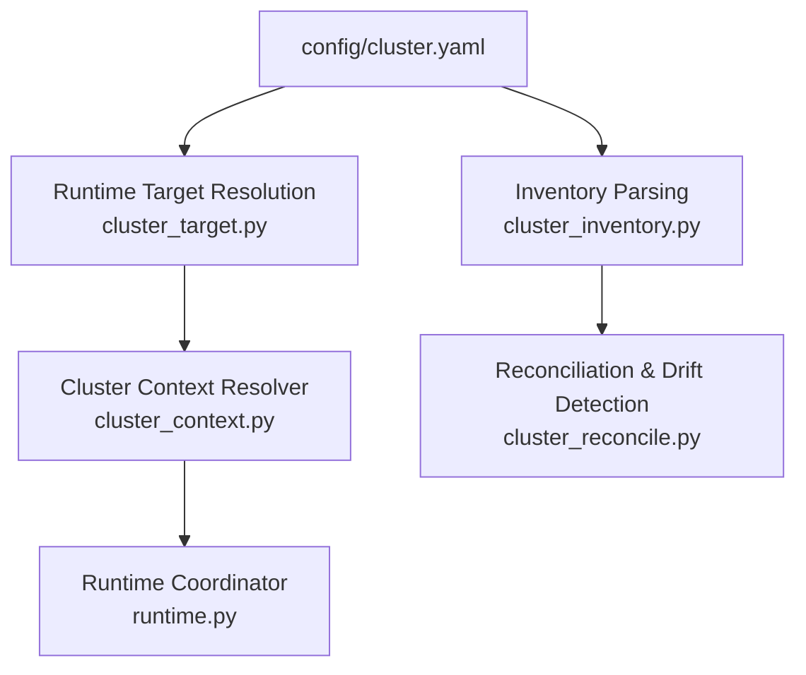
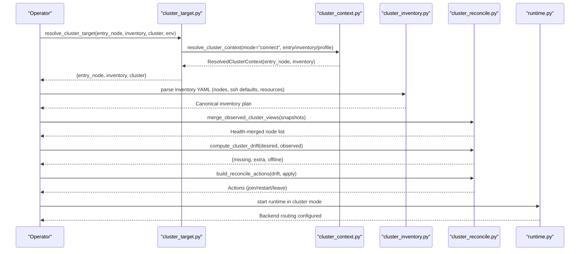
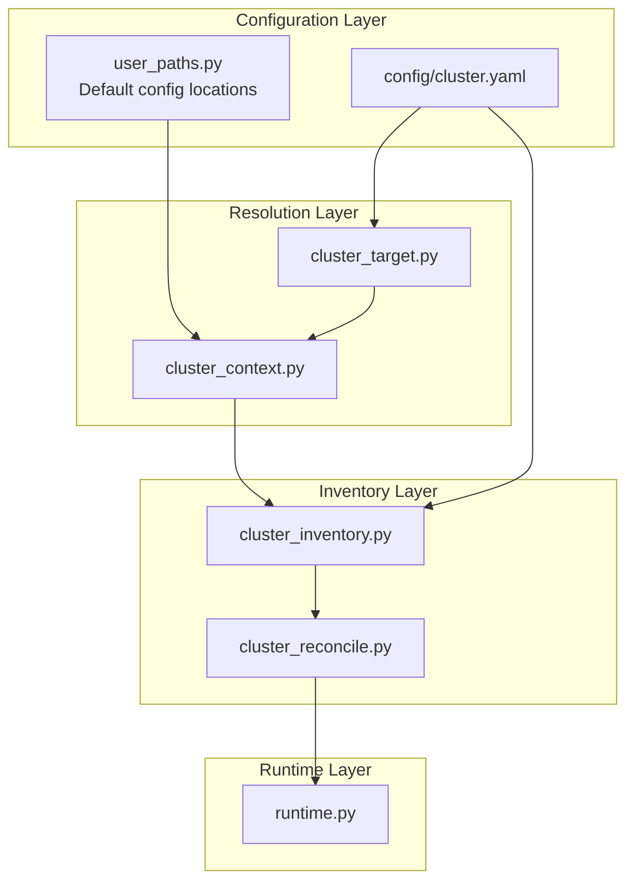
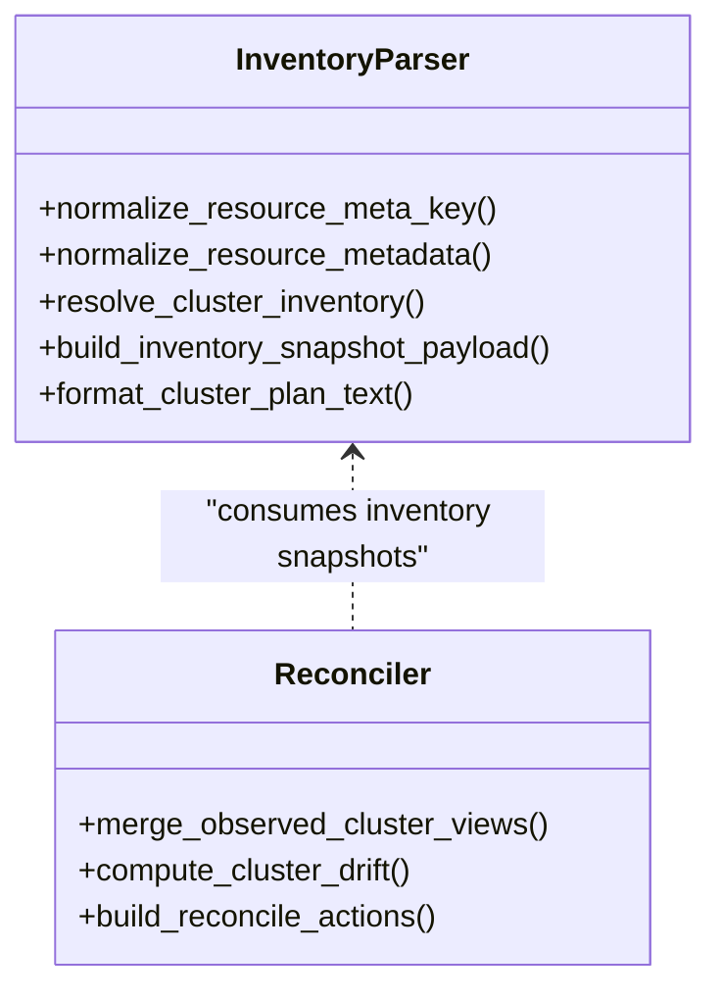
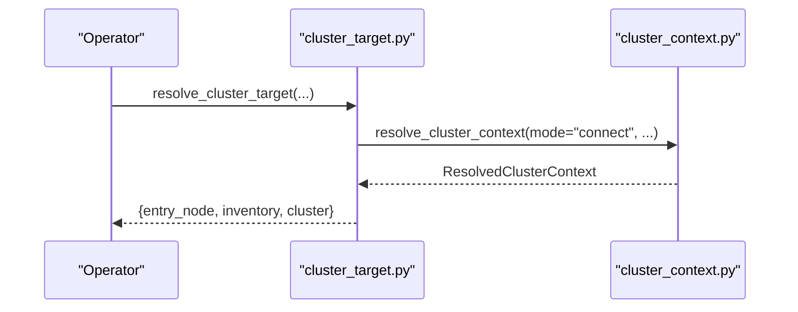
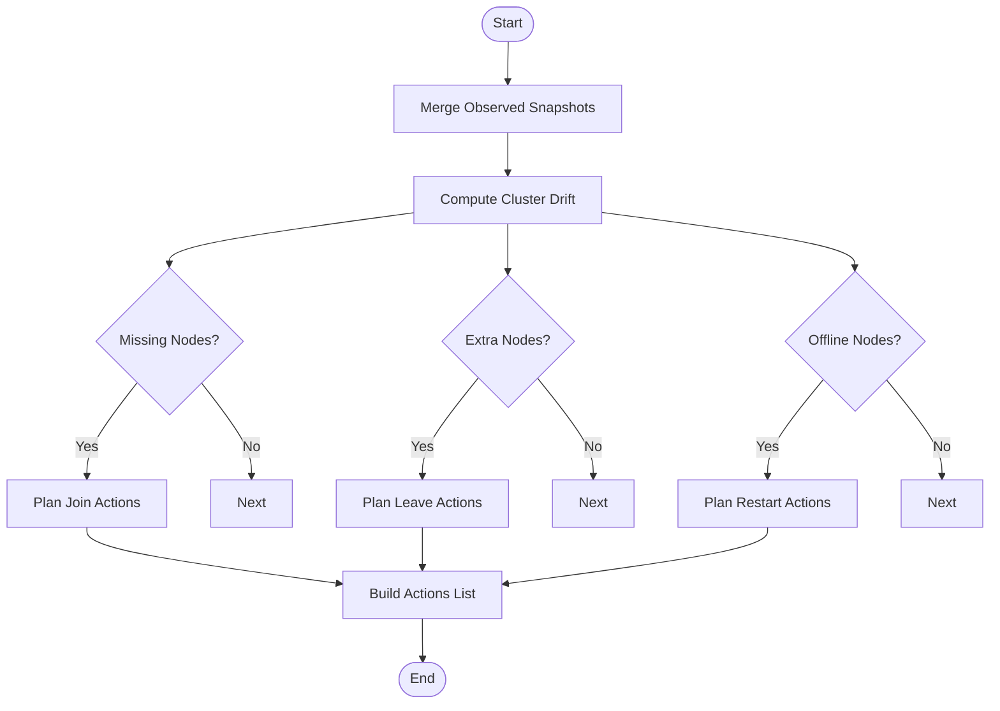
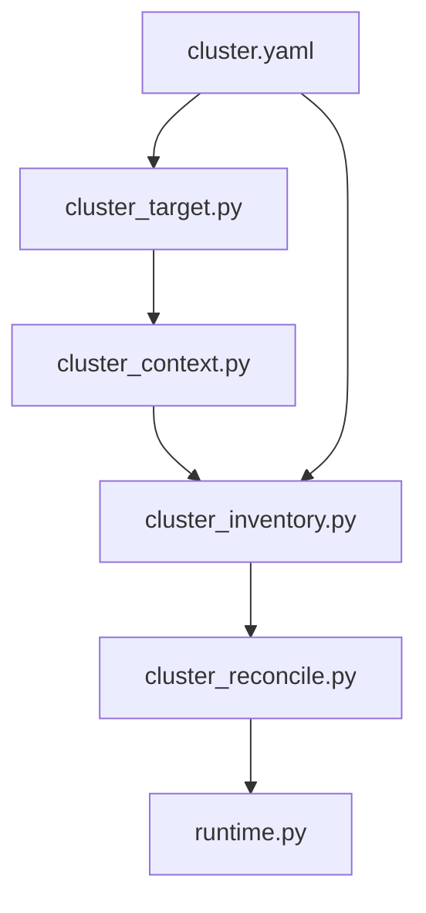

# Cluster Deployment Configuration

<cite>
**Referenced Files in This Document**
- [cluster.yaml](file://config/cluster.yaml)
- [cluster_inventory.py](file://src/sage/runtime/flownet/node/cluster_inventory.py)
- [cluster_reconcile.py](file://src/sage/runtime/flownet/node/cluster_reconcile.py)
- [cluster_target.py](file://src/sage/runtime/flownet/node/cluster_target.py)
- [cluster_context.py](file://src/sage/runtime/flownet/client/cluster_context.py)
- [user_paths.py](file://src/sage/foundation/config/user_paths.py)
- [runtime.py](file://src/sage/runtime/flownet/runtime/runtime.py)
</cite>

## Table of Contents
1. [Introduction](#introduction)
2. [Project Structure](#project-structure)
3. [Core Components](#core-components)
4. [Architecture Overview](#architecture-overview)
5. [Detailed Component Analysis](#detailed-component-analysis)
6. [Dependency Analysis](#dependency-analysis)
7. [Performance Considerations](#performance-considerations)
8. [Troubleshooting Guide](#troubleshooting-guide)
9. [Conclusion](#conclusion)
10. [Appendices](#appendices)

## Introduction
This document explains how SAGE manages cluster deployment and runtime connectivity via a layered configuration and reconciliation system. It focuses on the role of cluster.yaml as the primary deployment blueprint for multi-node distributed systems, and how SAGE resolves cluster targets, validates configurations, and reconciles desired vs observed cluster states. It also covers provider types (local and remote/cloud), head and worker node roles, SSH connectivity, inventory management, health monitoring, and scaling operations. Practical examples demonstrate single-node development, multi-node testing, and production-scale setups, along with how cluster configuration influences runtime behavior such as resource allocation, load balancing, and fault tolerance.

## Project Structure
SAGE’s cluster configuration spans two primary areas:
- Static deployment blueprint: config/cluster.yaml defines head and worker defaults, SSH settings, daemon and job manager endpoints, and output/monitoring preferences.
- Runtime resolution and reconciliation: Python modules under src/sage/runtime/flownet handle inventory parsing, cluster target resolution, and reconcile observed vs desired cluster states.

**Diagram sources**
- [cluster.yaml](file://config/cluster.yaml)
- [cluster_target.py](file://src/sage/runtime/flownet/node/cluster_target.py)
- [cluster_context.py](file://src/sage/runtime/flownet/client/cluster_context.py)
- [cluster_inventory.py](file://src/sage/runtime/flownet/node/cluster_inventory.py)
- [cluster_reconcile.py](file://src/sage/runtime/flownet/node/cluster_reconcile.py)
- [runtime.py](file://src/sage/runtime/flownet/runtime/runtime.py)

**Section sources**
- [cluster.yaml](file://config/cluster.yaml)
- [cluster_target.py](file://src/sage/runtime/flownet/node/cluster_target.py)
- [cluster_context.py](file://src/sage/runtime/flownet/client/cluster_context.py)
- [cluster_inventory.py](file://src/sage/runtime/flownet/node/cluster_inventory.py)
- [cluster_reconcile.py](file://src/sage/runtime/flownet/node/cluster_reconcile.py)
- [runtime.py](file://src/sage/runtime/flownet/runtime/runtime.py)

## Core Components
- Cluster blueprint (cluster.yaml): Defines head and worker defaults, SSH credentials, daemon/job manager endpoints, and operational preferences. It serves as the authoritative source for static cluster parameters.
- Inventory parser (cluster_inventory.py): Parses YAML-based node inventories, normalizes resources and metadata, resolves seed strategies, and builds a canonical inventory snapshot for runtime consumption.
- Reconciler (cluster_reconcile.py): Merges observed node states, computes drift against desired nodes, and generates actionable reconciliation steps (join, restart, leave).
- Target resolver (cluster_target.py): Resolves the effective cluster target (entry node and inventory) from CLI arguments, environment, or default profiles.
- Context resolver (cluster_context.py): Loads cluster profiles from ~/.flownet/clusters/<name>.yaml, selects a healthy entry node, and normalizes addresses and timeouts.
- User paths (user_paths.py): Establishes the default location for cluster configuration files and legacy compatibility.
- Runtime coordinator (runtime.py): Integrates cluster backend routing and enforces cluster-mode constraints for runtime operations.

**Section sources**
- [cluster.yaml](file://config/cluster.yaml)
- [cluster_inventory.py](file://src/sage/runtime/flownet/node/cluster_inventory.py)
- [cluster_reconcile.py](file://src/sage/runtime/flownet/node/cluster_reconcile.py)
- [cluster_target.py](file://src/sage/runtime/flownet/node/cluster_target.py)
- [cluster_context.py](file://src/sage/runtime/flownet/client/cluster_context.py)
- [user_paths.py](file://src/sage/foundation/config/user_paths.py)
- [runtime.py](file://src/sage/runtime/flownet/runtime/runtime.py)

## Architecture Overview
The cluster deployment configuration architecture connects static blueprinting with dynamic runtime orchestration:

**Diagram sources**
- [cluster_target.py](file://src/sage/runtime/flownet/node/cluster_target.py)
- [cluster_context.py](file://src/sage/runtime/flownet/client/cluster_context.py)
- [cluster_inventory.py](file://src/sage/runtime/flownet/node/cluster_inventory.py)
- [cluster_reconcile.py](file://src/sage/runtime/flownet/node/cluster_reconcile.py)
- [runtime.py](file://src/sage/runtime/flownet/runtime/runtime.py)

## Detailed Component Analysis

### Cluster Blueprint: cluster.yaml
Purpose:
- Acts as the deployment blueprint for multi-node distributed systems.
- Provides head and worker defaults, SSH configuration, daemon and job manager endpoints, and operational preferences.

Key sections and responsibilities:
- Head node configuration: host, coordination port, dashboard settings, temporary/log directories, Conda environment, Python path, runtime command override, CPU/GPU allocation.
- Worker node configuration: bind host, per-worker temp/log directories, CPU/GPU allocation.
- SSH configuration: user, private key path, connection timeout, and a commented list of worker hosts for reference.
- Remote node configuration: remote home path, runtime command, and Conda environment for remote workers.
- Daemon and JobManager endpoints: host/port, timeouts, retry attempts.
- Output and monitoring: output format/colors, refresh interval.

Provider types:
- Local provider: head and worker nodes co-reside on the same machine or are configured locally.
- Cloud/provider: head node is local while workers are remote; SSH credentials and remote paths are used to provision and manage workers.

Head node configuration:
- Bind address and coordination port define the primary entry point for cluster communication.
- Dashboard host/port enable observability and diagnostics.

Worker node management:
- Per-worker CPU/GPU allocation controls resource isolation and scheduling.
- Bind host determines how workers advertise themselves to the cluster.

Network settings:
- SSH user/key define secure remote provisioning.
- Daemon and JobManager endpoints define control-plane communication channels.

Cluster inventory management:
- While cluster.yaml contains head/worker defaults, the canonical node inventory is parsed from YAML via the inventory module.

Health monitoring and scaling:
- Health merging and drift detection are handled by the reconciliation module; scaling is expressed as desired node sets and translated into join/restart/leave actions.

Deployment validation:
- Validation occurs during inventory parsing and context resolution, ensuring non-empty nodes, unique identifiers, and valid addresses.

**Section sources**
- [cluster.yaml](file://config/cluster.yaml)

### Inventory Parsing and Normalization
Responsibilities:
- Parse YAML inventory, extract nodes, and normalize fields (node_id, bind_address, ssh_target, ssh_user, identity file).
- Normalize resource metadata and enforce uniqueness of node_id and bind_address.
- Resolve seed addresses using a full-mesh strategy by default, or accept explicit seeds per node.
- Build a canonical inventory snapshot with digests and plan metadata.

Operational flow:
- Load YAML, locate cluster/nodes sections, and parse SSH defaults.
- For each node, pick canonical keys for node identity and binding, and normalize metadata and resources.
- Derive seed addresses either from explicit seeds or a full-mesh strategy across all bind addresses.

Validation:
- Non-empty nodes list, presence of required fields, and unique identifiers are enforced.

**Section sources**
- [cluster_inventory.py](file://src/sage/runtime/flownet/node/cluster_inventory.py)

### Reconciliation and Drift Detection
Responsibilities:
- Merge multiple observed snapshots into a health-ranked view.
- Compute drift between desired node IDs and observed nodes (missing, extra, offline).
- Generate actions (join, restart, leave) based on drift and apply mode.

Processing logic:
- Health ranking prioritizes healthy over degraded/offline states.
- Drift computation identifies discrepancies between desired and observed sets.
- Action generation produces a deterministic sequence of operations.

**Section sources**
- [cluster_reconcile.py](file://src/sage/runtime/flownet/node/cluster_reconcile.py)

### Cluster Target Resolution
Responsibilities:
- Resolve the effective entry node and inventory from CLI arguments, environment, or default profiles.
- Translate resolution source (CLI, cluster flag, env, config, local runtime) into a structured response.

Resolution modes:
- Connect mode: resolve from explicit entry node, inventory, or cluster profile.
- Local runtime mode: short-circuit to a local entry node.

Error handling:
- Raises clear messages when the target cannot be resolved or the context is invalid.

**Section sources**
- [cluster_target.py](file://src/sage/runtime/flownet/node/cluster_target.py)

### Cluster Context Resolution
Responsibilities:
- Load cluster profiles from ~/.flownet/clusters/<name>.yaml.
- Select a healthy entry node from profile nodes or use a preferred/entry node.
- Normalize addresses to host:port form and validate timeouts and transport modes.

Default selection:
- If no explicit entry node or inventory is provided, the system reads current_cluster/context from ~/.flownet/config.yaml or falls back to a local runtime entry.

**Section sources**
- [cluster_context.py](file://src/sage/runtime/flownet/client/cluster_context.py)

### Relationship Between Configuration and Runtime Behavior
- Resource allocation: CPU/GPU allocations in cluster.yaml influence per-node capacity and scheduling decisions.
- Load balancing: Seed strategy and bind addresses determine how nodes discover and communicate with each other.
- Fault tolerance: Reconciliation detects offline nodes and proposes restart actions; drift reporting enables remediation.

Integration points:
- Runtime coordinator integrates cluster backend routing and enforces cluster-mode constraints.

**Section sources**
- [cluster.yaml](file://config/cluster.yaml)
- [cluster_reconcile.py](file://src/sage/runtime/flownet/node/cluster_reconcile.py)
- [runtime.py](file://src/sage/runtime/flownet/runtime/runtime.py)

## Architecture Overview
The following diagram maps the end-to-end flow from configuration to runtime:

**Diagram sources**
- [cluster.yaml](file://config/cluster.yaml)
- [user_paths.py](file://src/sage/foundation/config/user_paths.py)
- [cluster_target.py](file://src/sage/runtime/flownet/node/cluster_target.py)
- [cluster_context.py](file://src/sage/runtime/flownet/client/cluster_context.py)
- [cluster_inventory.py](file://src/sage/runtime/flownet/node/cluster_inventory.py)
- [cluster_reconcile.py](file://src/sage/runtime/flownet/node/cluster_reconcile.py)
- [runtime.py](file://src/sage/runtime/flownet/runtime/runtime.py)

## Detailed Component Analysis

### Class Relationships: Inventory and Reconciliation

**Diagram sources**
- [cluster_inventory.py](file://src/sage/runtime/flownet/node/cluster_inventory.py)
- [cluster_reconcile.py](file://src/sage/runtime/flownet/node/cluster_reconcile.py)

### Sequence: Target Resolution and Context Loading

**Diagram sources**
- [cluster_target.py](file://src/sage/runtime/flownet/node/cluster_target.py)
- [cluster_context.py](file://src/sage/runtime/flownet/client/cluster_context.py)

### Flowchart: Drift Detection and Actions

**Diagram sources**
- [cluster_reconcile.py](file://src/sage/runtime/flownet/node/cluster_reconcile.py)

## Dependency Analysis
- cluster_target.py depends on cluster_context.py to resolve the effective cluster target.
- cluster_context.py loads profiles from user-defined directories and normalizes addresses and timeouts.
- cluster_inventory.py parses YAML inventories and normalizes resources and metadata.
- cluster_reconcile.py consumes inventory snapshots and observed views to compute drift and actions.
- runtime.py integrates cluster backend routing and enforces cluster-mode constraints.

**Diagram sources**
- [cluster_target.py](file://src/sage/runtime/flownet/node/cluster_target.py)
- [cluster_context.py](file://src/sage/runtime/flownet/client/cluster_context.py)
- [cluster_inventory.py](file://src/sage/runtime/flownet/node/cluster_inventory.py)
- [cluster_reconcile.py](file://src/sage/runtime/flownet/node/cluster_reconcile.py)
- [runtime.py](file://src/sage/runtime/flownet/runtime/runtime.py)
- [cluster.yaml](file://config/cluster.yaml)

**Section sources**
- [cluster_target.py](file://src/sage/runtime/flownet/node/cluster_target.py)
- [cluster_context.py](file://src/sage/runtime/flownet/client/cluster_context.py)
- [cluster_inventory.py](file://src/sage/runtime/flownet/node/cluster_inventory.py)
- [cluster_reconcile.py](file://src/sage/runtime/flownet/node/cluster_reconcile.py)
- [runtime.py](file://src/sage/runtime/flownet/runtime/runtime.py)
- [cluster.yaml](file://config/cluster.yaml)

## Performance Considerations
- Inventory parsing: Prefer compact YAML with minimal redundant metadata to reduce parsing overhead.
- Seed strategy: Full-mesh seed resolution scales with node count; ensure bind addresses are stable and unique to avoid unnecessary re-seeding.
- Reconciliation: Batch observed snapshots and compute drift periodically to minimize repeated computations.
- SSH operations: Tune connect_timeout and retry_attempts to balance responsiveness and reliability.
- Resource allocation: Align CPU/GPU allocations with workload characteristics to prevent contention and improve throughput.

## Troubleshooting Guide
Common issues and resolutions:
- Cluster target unresolved: Ensure entry_node or inventory is provided via CLI, environment, or default profile. Verify ~/.flownet/config.yaml and cluster profile existence.
- Profile missing entry_node/inventory: Add a target entry with entry_node or inventory_path in the cluster profile.
- Inventory parsing failures: Confirm YAML validity, non-empty nodes list, and unique node_id/bind_address.
- SSH connectivity: Validate user, key_path, and connect_timeout; ensure firewall allows head/worker communication.
- Offline nodes: Use drift reports to identify offline nodes and trigger restart actions; verify daemon and job manager endpoints are reachable.
- Runtime backend routing: Ensure cluster mode is enabled and backend router is configured before submitting jobs.

**Section sources**
- [cluster_target.py](file://src/sage/runtime/flownet/node/cluster_target.py)
- [cluster_context.py](file://src/sage/runtime/flownet/client/cluster_context.py)
- [cluster_inventory.py](file://src/sage/runtime/flownet/node/cluster_inventory.py)
- [cluster_reconcile.py](file://src/sage/runtime/flownet/node/cluster_reconcile.py)
- [runtime.py](file://src/sage/runtime/flownet/runtime/runtime.py)

## Conclusion
SAGE’s cluster deployment configuration centers on cluster.yaml as the blueprint for head/worker settings, SSH, and operational preferences, complemented by robust runtime resolution and reconciliation mechanisms. Together, these components enable reliable multi-node deployments across local and cloud environments, support health monitoring and scaling, and ensure predictable runtime behavior through validated configuration and controlled drift handling.

## Appendices

### Practical Examples

- Single-node development:
  - Configure head node with localhost bind address and dashboard host set to loopback.
  - Set worker bind_host to localhost and allocate modest CPU/GPU resources.
  - Use local runtime mode for quick iteration without external dependencies.

- Multi-node testing:
  - Define multiple worker entries in cluster.yaml with distinct bind addresses.
  - Use SSH user/key for remote provisioning; ensure connectivity and firewall rules.
  - Monitor drift and reconcile missing/offline nodes to maintain a stable test cluster.

- Production-scale deployments:
  - Centralize cluster profiles under ~/.flownet/clusters/<name>.yaml with explicit entry nodes and inventory paths.
  - Enable full-mesh seed strategy for resilient discovery; validate seed addresses across nodes.
  - Tune daemon and job manager endpoints for high availability; monitor refresh intervals and output formats.

[No sources needed since this section provides general guidance]