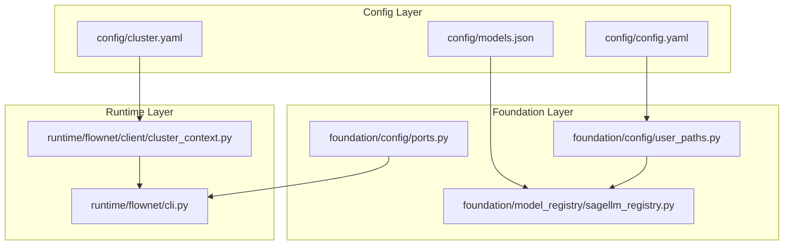
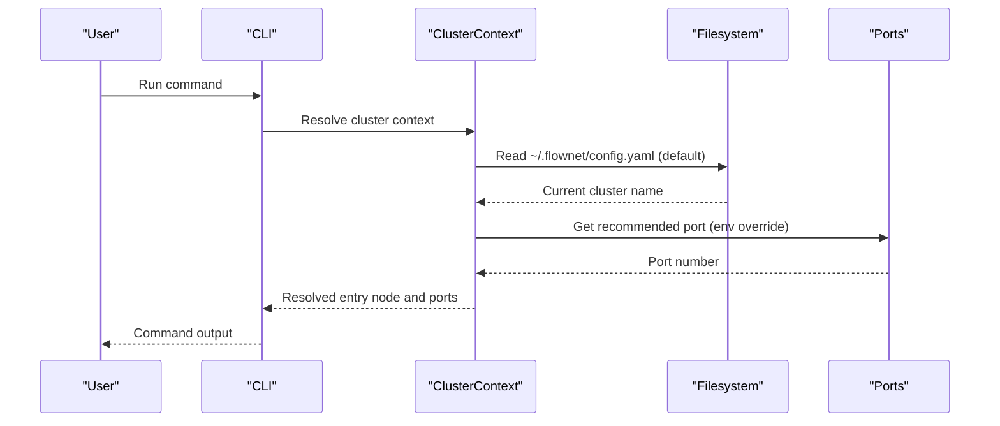
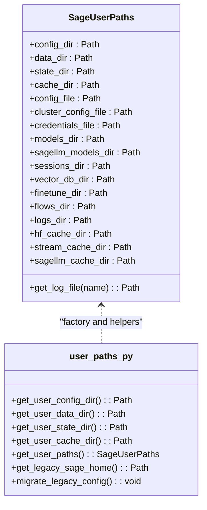
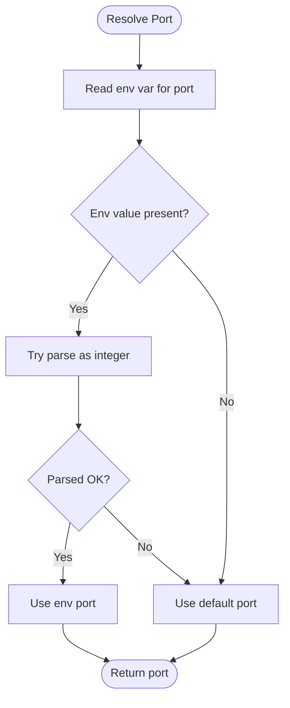
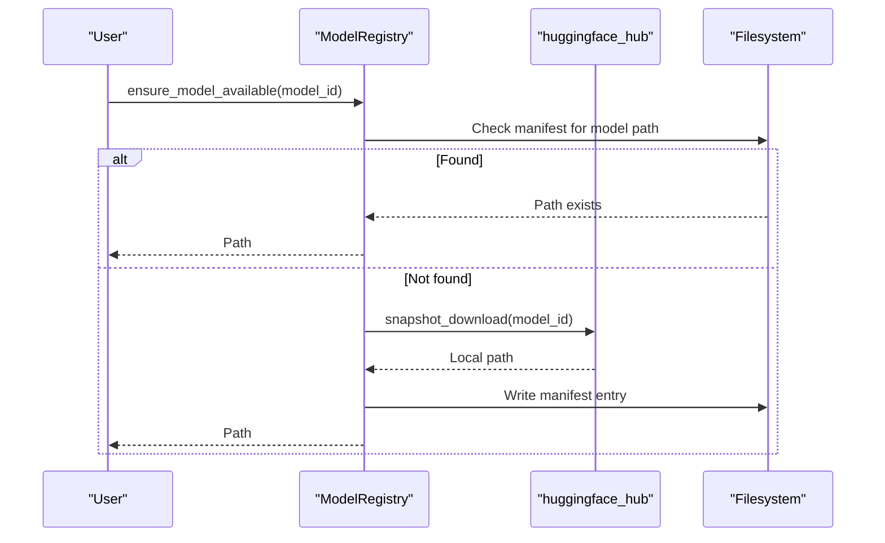
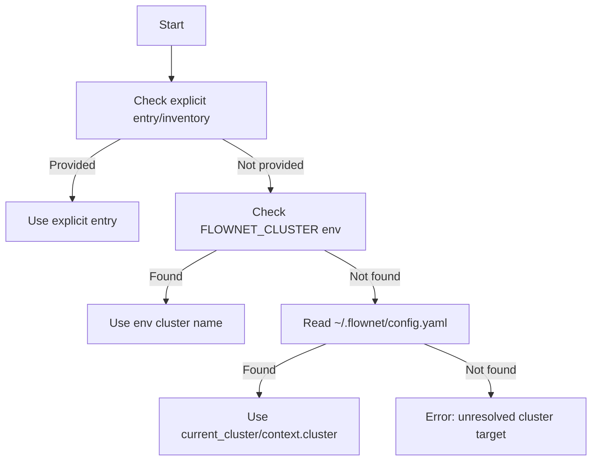
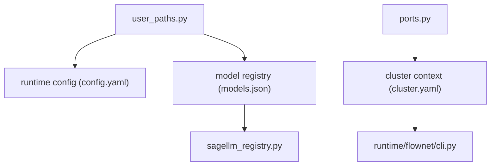

# Configuration Management

<cite>
**Referenced Files in This Document**
- [config.yaml](file://config/config.yaml)
- [cluster.yaml](file://config/cluster.yaml)
- [models.json](file://config/models.json)
- [user_paths.py](file://src/sage/foundation/config/user_paths.py)
- [ports.py](file://src/sage/foundation/config/ports.py)
- [sagellm_registry.py](file://src/sage/foundation/model_registry/sagellm_registry.py)
- [cluster_context.py](file://src/sage/runtime/flownet/client/cluster_context.py)
- [cli.py](file://src/sage/runtime/flownet/cli.py)
</cite>

## Table of Contents
1. [Introduction](#introduction)
2. [Project Structure](#project-structure)
3. [Core Components](#core-components)
4. [Architecture Overview](#architecture-overview)
5. [Detailed Component Analysis](#detailed-component-analysis)
6. [Dependency Analysis](#dependency-analysis)
7. [Performance Considerations](#performance-considerations)
8. [Troubleshooting Guide](#troubleshooting-guide)
9. [Conclusion](#conclusion)
10. [Appendices](#appendices)

## Introduction
This Configuration Management section documents SAGE’s centralized configuration system and environment handling. It explains how runtime settings, cluster deployments, model registries, and user-specific paths are managed. The system provides:
- Centralized YAML configuration files for user runtime settings, cluster topology, and model registry entries
- XDG-compliant user path resolution for config, data, state, and cache directories
- Environment variable precedence for overriding defaults during runtime
- Validation and defaulting behavior across configuration layers
- Practical examples for typical setups, environment-specific overrides, and model registry management

## Project Structure
SAGE organizes configuration under a dedicated config directory and integrates with the foundation layer for user paths and port management. The key files are:
- config/config.yaml: user runtime settings (LLM, embeddings, gateway, provider, Ray, remote, studio)
- config/cluster.yaml: cluster topology and node configuration
- config/models.json: local and remote model registry entries
- src/sage/foundation/config/user_paths.py: XDG-compliant user path resolution and migration
- src/sage/foundation/config/ports.py: port defaults, availability checks, and environment overrides
- src/sage/foundation/model_registry/sagellm_registry.py: model registry management backed by user paths
- src/sage/runtime/flownet/client/cluster_context.py: cluster context resolution and environment precedence
- src/sage/runtime/flownet/cli.py: CLI entry point that forwards commands to node CLI

**Diagram sources**
- [config.yaml](file://config/config.yaml)
- [cluster.yaml](file://config/cluster.yaml)
- [models.json](file://config/models.json)
- [user_paths.py](file://src/sage/foundation/config/user_paths.py)
- [ports.py](file://src/sage/foundation/config/ports.py)
- [sagellm_registry.py](file://src/sage/foundation/model_registry/sagellm_registry.py)
- [cluster_context.py](file://src/sage/runtime/flownet/client/cluster_context.py)
- [cli.py](file://src/sage/runtime/flownet/cli.py)

**Section sources**
- [config.yaml](file://config/config.yaml)
- [cluster.yaml](file://config/cluster.yaml)
- [models.json](file://config/models.json)
- [user_paths.py](file://src/sage/foundation/config/user_paths.py)
- [ports.py](file://src/sage/foundation/config/ports.py)
- [sagellm_registry.py](file://src/sage/foundation/model_registry/sagellm_registry.py)
- [cluster_context.py](file://src/sage/runtime/flownet/client/cluster_context.py)
- [cli.py](file://src/sage/runtime/flownet/cli.py)

## Core Components
- User Paths (XDG): Provides standardized directories for config, data, state, and cache, with automatic creation and legacy migration support.
- Ports: Centralizes default ports for serving, embedding, and benchmarking, with environment overrides and availability checks.
- Runtime Config: Loads user runtime settings from config/config.yaml and applies environment-specific overrides.
- Cluster Config: Loads cluster topology from config/cluster.yaml and resolves cluster context via environment variables and default files.
- Model Registry: Manages local model assets under user data directories and supports listing, downloading, and deletion.

**Section sources**
- [user_paths.py](file://src/sage/foundation/config/user_paths.py)
- [ports.py](file://src/sage/foundation/config/ports.py)
- [config.yaml](file://config/config.yaml)
- [cluster.yaml](file://config/cluster.yaml)
- [sagellm_registry.py](file://src/sage/foundation/model_registry/sagellm_registry.py)

## Architecture Overview
The configuration system follows layered precedence:
- Defaults: Built-in defaults in code (ports, model registry roots)
- User Paths: XDG directories resolve user-specific locations
- YAML Config: User-provided config files define runtime and cluster settings
- Environment Variables: Override defaults and YAML values at runtime

**Diagram sources**
- [cluster_context.py](file://src/sage/runtime/flownet/client/cluster_context.py)
- [ports.py](file://src/sage/foundation/config/ports.py)
- [cli.py](file://src/sage/runtime/flownet/cli.py)

## Detailed Component Analysis

### User Paths and XDG Resolution
- Purpose: Establishes XDG-compliant directories for configuration, data, state, and cache, ensuring user-scoped storage and predictable migration from legacy locations.
- Key behaviors:
  - Resolves base directories via environment variables or defaults
  - Creates required subdirectories for models, sessions, vector databases, fine-tuning, flows, logs, and caches
  - Provides convenience properties for config files and directories
  - Supports migration from legacy ~/.sage to XDG locations

**Diagram sources**
- [user_paths.py](file://src/sage/foundation/config/user_paths.py)

**Section sources**
- [user_paths.py](file://src/sage/foundation/config/user_paths.py)

### Ports and Environment Overrides
- Purpose: Centralizes port assignments for serving, embedding, and benchmarking, with environment overrides and availability checks.
- Key behaviors:
  - Provides default ports for LLM, embedding, gateway, and benchmarking
  - Detects WSL and adjusts recommended ports accordingly
  - Reads environment variables for port overrides with integer fallback
  - Checks port availability and prints diagnostics

**Diagram sources**
- [ports.py](file://src/sage/foundation/config/ports.py)

**Section sources**
- [ports.py](file://src/sage/foundation/config/ports.py)

### Runtime Configuration (config.yaml)
- Purpose: Defines user runtime settings such as LLM model, embedding model, gateway, provider, Ray, remote, and studio.
- Typical keys include:
  - llm: model, port, tensor parallel size, GPU memory utilization, maximum model length
  - embedding: model, port, GPU usage
  - gateway: port, session backend, memory backend and limits
  - provider: type, head IP, worker IPs
  - ray: dashboard host/port, head port, worker bind host, resource counts
  - remote: Python path, conda environment, Ray command, SAGE home
  - studio: backend and frontend ports
  - auth: SSH private key, SSH user, connection timeout
  - max_workers: concurrency limit
- Behavior:
  - Values are loaded from config/config.yaml
  - Environment variables can override specific fields (see Environment Precedence)

**Section sources**
- [config.yaml](file://config/config.yaml)

### Cluster Configuration (cluster.yaml)
- Purpose: Defines cluster topology, node roles, SSH settings, daemon, output, monitoring, and JobManager configuration.
- Typical keys include:
  - head: host, ports, dashboard host/port, temp/log directories, CPU/GPU counts, conda/prefix paths
  - worker: bind host, temp/log directories, CPU/GPU counts
  - ssh: user, key path, connect timeout, optional worker list
  - remote: SAGE home, Python path, runtime command, conda environment
  - daemon: host, port
  - output: format, colors
  - monitor: refresh interval
  - jobmanager: host, port, timeout, retry attempts
- Behavior:
  - Loaded from config/cluster.yaml
  - Cluster context resolution considers environment variables and default files

**Section sources**
- [cluster.yaml](file://config/cluster.yaml)

### Model Registry (models.json and Registry)
- Purpose: Manages local and remote model entries for inference and embedding engines.
- models.json structure:
  - Array of entries with name, base_url, is_local flag, default selection, optional description, engine kind, and API key placeholder
  - API key placeholders support environment variable substitution
- Registry operations:
  - List models, get model path, ensure availability, download with retries, delete models
  - Uses user data directories for local storage and maintains a manifest for metadata

**Diagram sources**
- [sagellm_registry.py](file://src/sage/foundation/model_registry/sagellm_registry.py)

**Section sources**
- [models.json](file://config/models.json)
- [sagellm_registry.py](file://src/sage/foundation/model_registry/sagellm_registry.py)

### Cluster Context Resolution and Environment Precedence
- Purpose: Determines the cluster entry node and context by combining explicit arguments, environment variables, and default files.
- Precedence:
  - Explicit arguments take highest priority
  - Environment variable FLOWNET_CLUSTER provides a cluster name
  - Default cluster name is read from ~/.flownet/config.yaml (current_cluster or cluster, optionally under context)
  - If unresolved, raises an error with guidance
- Additional behaviors:
  - Normalizes addresses to host:port format
  - Validates non-negative numeric fields
  - Supports inventory normalization and optional values

**Diagram sources**
- [cluster_context.py](file://src/sage/runtime/flownet/client/cluster_context.py)

**Section sources**
- [cluster_context.py](file://src/sage/runtime/flownet/client/cluster_context.py)

### CLI Integration and Forwarding
- Purpose: The CLI entry point parses top-level commands and forwards them to the node CLI, enabling cluster operations and runtime commands.
- Behavior:
  - Builds parser and routes commands
  - Forwards to node CLI for execution

**Section sources**
- [cli.py](file://src/sage/runtime/flownet/cli.py)

## Dependency Analysis
- User Paths depends on environment variables and filesystem creation
- Ports depends on OS-level socket checks and environment variables
- Runtime Config depends on YAML parsing and user paths
- Cluster Config depends on YAML parsing and environment variables
- Model Registry depends on user paths and external libraries for downloads
- Cluster Context depends on YAML parsing and environment variables

**Diagram sources**
- [user_paths.py](file://src/sage/foundation/config/user_paths.py)
- [ports.py](file://src/sage/foundation/config/ports.py)
- [config.yaml](file://config/config.yaml)
- [cluster.yaml](file://config/cluster.yaml)
- [models.json](file://config/models.json)
- [sagellm_registry.py](file://src/sage/foundation/model_registry/sagellm_registry.py)
- [cluster_context.py](file://src/sage/runtime/flownet/client/cluster_context.py)
- [cli.py](file://src/sage/runtime/flownet/cli.py)

**Section sources**
- [user_paths.py](file://src/sage/foundation/config/user_paths.py)
- [ports.py](file://src/sage/foundation/config/ports.py)
- [config.yaml](file://config/config.yaml)
- [cluster.yaml](file://config/cluster.yaml)
- [models.json](file://config/models.json)
- [sagellm_registry.py](file://src/sage/foundation/model_registry/sagellm_registry.py)
- [cluster_context.py](file://src/sage/runtime/flownet/client/cluster_context.py)
- [cli.py](file://src/sage/runtime/flownet/cli.py)

## Performance Considerations
- Port availability checks use lightweight socket probes; avoid repeated checks in tight loops
- YAML parsing occurs during context resolution; keep configuration files minimal and well-formed
- Model downloads can be expensive; leverage caching and manifests to avoid redundant transfers
- XDG directory creation is performed once per process; subsequent access is fast

## Troubleshooting Guide
Common issues and resolutions:
- Unresolved cluster target:
  - Ensure a cluster entry is provided explicitly, via FLOWNET_CLUSTER environment variable, or via ~/.flownet/config.yaml current_cluster/context.cluster
  - Verify the referenced cluster profile exists in ~/.flownet/clusters/<name>.yaml
- Port conflicts:
  - Use the port diagnostic tool to check availability
  - Override ports via environment variables for the relevant service
- Model not found:
  - Use the model registry API to download or ensure auto-download is enabled
  - Confirm the model manifest entry and local path
- Legacy configuration migration:
  - Run migration to copy legacy files into XDG locations

**Section sources**
- [cluster_context.py](file://src/sage/runtime/flownet/client/cluster_context.py)
- [ports.py](file://src/sage/foundation/config/ports.py)
- [sagellm_registry.py](file://src/sage/foundation/model_registry/sagellm_registry.py)
- [user_paths.py](file://src/sage/foundation/config/user_paths.py)

## Conclusion
SAGE’s configuration system combines XDG-compliant user paths, centralized port defaults, robust YAML configuration files, and environment variable overrides to provide a flexible and maintainable runtime configuration model. The cluster context resolution and model registry integrate seamlessly with these layers to support scalable deployments and efficient model management.

## Appendices

### Configuration Precedence and Validation Summary
- Precedence order (highest to lowest):
  - Explicit arguments
  - Environment variables
  - YAML configuration files
  - Built-in defaults
- Validation highlights:
  - Non-empty and normalized values for addresses and inventory
  - Non-negative numeric fields when provided
  - YAML mappings validated during parsing

**Section sources**
- [cluster_context.py](file://src/sage/runtime/flownet/client/cluster_context.py)
- [config.yaml](file://config/config.yaml)
- [cluster.yaml](file://config/cluster.yaml)

### Practical Examples

- Typical runtime configuration setup:
  - Adjust llm.model, embedding.model, gateway.port, provider.type/head_ip/worker_ips, ray.* settings, remote.sage_home, and studio.backend_port/frontend_port in config/config.yaml
  - Use environment variables to override specific ports or cluster names when needed

- Environment-specific overrides:
  - Set FLOWNET_CLUSTER to select a named cluster profile
  - Override port values via environment variables for the relevant service (for example, the port used by the runtime or embedding service)
  - Use SSH-related environment variables to influence cluster operations

- Model registry management:
  - Add entries to config/models.json with appropriate engine kinds and API key placeholders
  - Use the model registry API to list, download, and manage local model assets under user data directories

**Section sources**
- [config.yaml](file://config/config.yaml)
- [cluster.yaml](file://config/cluster.yaml)
- [models.json](file://config/models.json)
- [sagellm_registry.py](file://src/sage/foundation/model_registry/sagellm_registry.py)
- [cluster_context.py](file://src/sage/runtime/flownet/client/cluster_context.py)
- [ports.py](file://src/sage/foundation/config/ports.py)