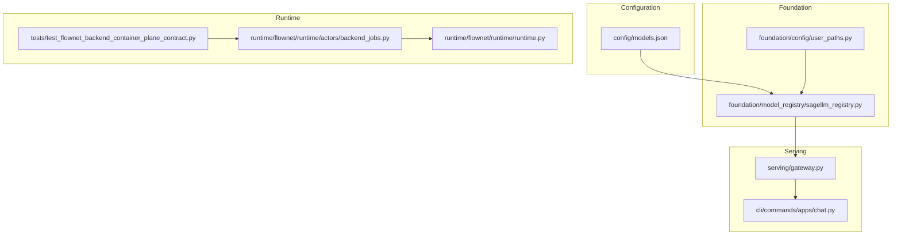
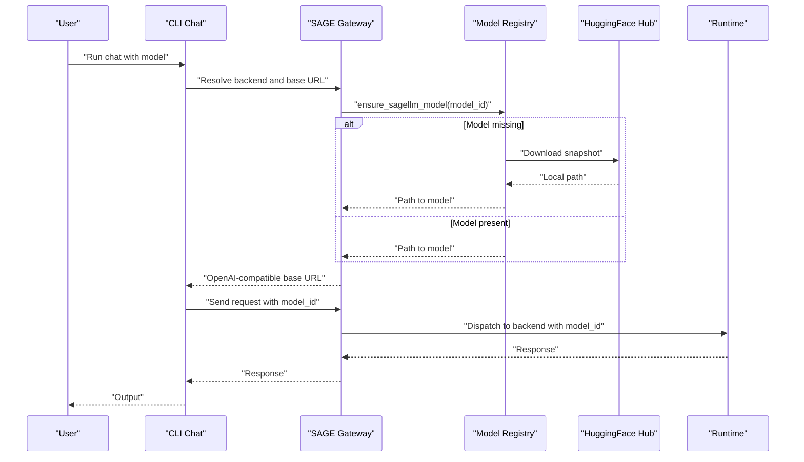
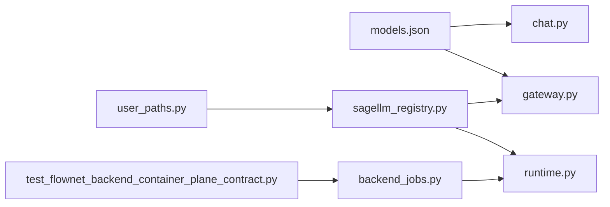

# Model Registry Management

<cite>
**Referenced Files in This Document**
- [models.json](file://config/models.json)
- [sagellm_registry.py](file://src/sage/foundation/model_registry/sagellm_registry.py)
- [user_paths.py](file://src/sage/foundation/config/user_paths.py)
- [gateway.py](file://src/sage/serving/gateway.py)
- [chat.py](file://src/sage/cli/commands/apps/chat.py)
- [backend_jobs.py](file://src/sage/runtime/flownet/runtime/actors/backend_jobs.py)
- [runtime.py](file://src/sage/runtime/flownet/runtime/runtime.py)
- [test_flownet_backend_container_plane_contract.py](file://src/tests/test_flownet_backend_container_plane_contract.py)
</cite>

## Table of Contents
1. [Introduction](#introduction)
2. [Project Structure](#project-structure)
3. [Core Components](#core-components)
4. [Architecture Overview](#architecture-overview)
5. [Detailed Component Analysis](#detailed-component-analysis)
6. [Dependency Analysis](#dependency-analysis)
7. [Performance Considerations](#performance-considerations)
8. [Troubleshooting Guide](#troubleshooting-guide)
9. [Conclusion](#conclusion)

## Introduction
This document explains SAGE’s centralized model asset management system with a focus on:
- Purpose and structure of models.json as the registry for available AI models and their deployment configurations
- Model registration, metadata management, version tracking, and lifecycle operations
- Model validation, compatibility checking, and integration with the serving layer
- Model discovery, selection criteria, and model-specific configuration options
- Deployment strategies, caching, and performance optimization
- Practical workflows for registering models, querying model availability, and best practices
- Relationship between the model registry and runtime model loading, including resolution, fallback mechanisms, and error handling

## Project Structure
SAGE organizes model registry functionality across three primary areas:
- Central registry definition: models.json defines available models and their properties
- Local model registry: Python module manages local model assets, metadata, and lifecycle
- Serving integration: gateway and runtime components integrate the registry with inference backends

**Diagram sources**
- [models.json:1-67](file://config/models.json#L1-L67)
- [sagellm_registry.py:1-297](file://src/sage/foundation/model_registry/sagellm_registry.py#L1-L297)
- [user_paths.py:1-195](file://src/sage/foundation/config/user_paths.py#L1-L195)
- [gateway.py:1-168](file://src/sage/serving/gateway.py#L1-L168)
- [chat.py:1-331](file://src/sage/cli/commands/apps/chat.py#L1-L331)
- [backend_jobs.py:153-183](file://src/sage/runtime/flownet/runtime/actors/backend_jobs.py#L153-L183)
- [runtime.py:1414-1656](file://src/sage/runtime/flownet/runtime/runtime.py#L1414-L1656)
- [test_flownet_backend_container_plane_contract.py:108-146](file://src/tests/test_flownet_backend_container_plane_contract.py#L108-L146)

**Section sources**
- [models.json:1-67](file://config/models.json#L1-L67)
- [sagellm_registry.py:1-297](file://src/sage/foundation/model_registry/sagellm_registry.py#L1-L297)
- [user_paths.py:1-195](file://src/sage/foundation/config/user_paths.py#L1-L195)
- [gateway.py:1-168](file://src/sage/serving/gateway.py#L1-L168)
- [chat.py:1-331](file://src/sage/cli/commands/apps/chat.py#L1-L331)
- [backend_jobs.py:153-183](file://src/sage/runtime/flownet/runtime/actors/backend_jobs.py#L153-L183)
- [runtime.py:1414-1656](file://src/sage/runtime/flownet/runtime/runtime.py#L1414-L1656)
- [test_flownet_backend_container_plane_contract.py:108-146](file://src/tests/test_flownet_backend_container_plane_contract.py#L108-L146)

## Core Components
- models.json: Central registry of available models with properties such as name, base_url, is_local, default, description, engine_kind, and api_key. It also supports per-model configuration like default selection and local vs remote deployment hints.
- Model registry (Python): Provides APIs to list, download, get path, touch, and delete models; maintains a manifest of local assets and metadata; integrates with Hugging Face snapshots for downloads.
- Serving integration: Exposes ensure_sagellm_model to ensure a model is available locally before invoking the external inference engine; integrates with CLI chat flows and gateway probing.
- Runtime integration: Backend containers declare capabilities including tasks, models, precision, and resident_models; runtime selection logic matches serving context against backend capabilities.

**Section sources**
- [models.json:1-67](file://config/models.json#L1-L67)
- [sagellm_registry.py:121-284](file://src/sage/foundation/model_registry/sagellm_registry.py#L121-L284)
- [gateway.py:129-136](file://src/sage/serving/gateway.py#L129-L136)
- [chat.py:30-96](file://src/sage/cli/commands/apps/chat.py#L30-L96)
- [backend_jobs.py:153-183](file://src/sage/runtime/flownet/runtime/actors/backend_jobs.py#L153-L183)
- [runtime.py:1414-1656](file://src/sage/runtime/flownet/runtime/runtime.py#L1414-L1656)

## Architecture Overview
The model registry participates in a layered flow:
- Configuration layer: models.json defines model entries and deployment hints
- Foundation layer: local registry manages assets and metadata
- Serving layer: ensures model availability and routes requests to the appropriate backend
- Runtime layer: selects backends based on model and capability requirements

**Diagram sources**
- [chat.py:205-249](file://src/sage/cli/commands/apps/chat.py#L205-L249)
- [gateway.py:129-136](file://src/sage/serving/gateway.py#L129-L136)
- [sagellm_registry.py:161-246](file://src/sage/foundation/model_registry/sagellm_registry.py#L161-L246)
- [runtime.py:1414-1656](file://src/sage/runtime/flownet/runtime/runtime.py#L1414-L1656)

## Detailed Component Analysis

### models.json: Central Registry Definition
Purpose:
- Defines available models and their deployment characteristics
- Supports local and remote deployments via is_local and base_url
- Enables default selection via default flag
- Allows model categorization via engine_kind (e.g., llm, embedding)
- Provides model-specific configuration such as description and api_key

Key properties:
- name: Unique identifier for the model
- base_url: Endpoint for remote inference or local gateway
- is_local: Boolean hint indicating local vs remote deployment
- default: Boolean flag for default selection
- description: Human-readable notes
- engine_kind: Category such as "llm" or "embedding"
- api_key: Optional credential placeholder

Operational notes:
- Remote models often require api_key resolution and network connectivity
- Local models are managed by the local registry and may be downloaded on demand

**Section sources**
- [models.json:1-67](file://config/models.json#L1-L67)

### Local Model Registry API
Responsibilities:
- List models sorted by last access time
- Retrieve model path if present
- Touch model timestamps to refresh usage
- Download models from Hugging Face with retries and progress
- Delete models and remove artifacts
- Ensure model availability with optional auto-download

Data structures and behavior:
- ModelInfo: Encapsulates model_id, path, revision, size_bytes, last_used, tags
- Manifest: JSON file storing model metadata keyed by model_id
- Root directory: XDG-style data directory under models/sagellm

Error handling:
- Corrupted manifest raises a registry error
- Missing model triggers either error or automatic download depending on flags

Performance considerations:
- Manifest I/O is serialized; frequent reads/writes are minimized by batching operations
- Downloads use exponential backoff and resume where possible

**Section sources**
- [sagellm_registry.py:23-284](file://src/sage/foundation/model_registry/sagellm_registry.py#L23-L284)
- [user_paths.py:105-110](file://src/sage/foundation/config/user_paths.py#L105-L110)

### Serving Integration: ensure_sagellm_model
Role:
- Ensures a model exists locally before invoking the external inference engine
- Delegates to the local registry to list, download, or resolve model paths
- Integrates with CLI chat flows and gateway probing

Behavior:
- Resolves model path via registry
- Optionally auto-downloads when missing
- Returns local path for downstream use

**Section sources**
- [gateway.py:129-136](file://src/sage/serving/gateway.py#L129-L136)
- [chat.py:30-96](file://src/sage/cli/commands/apps/chat.py#L30-L96)

### Runtime Integration: Backend Capability Matching
Capabilities:
- Backends declare support for tasks, models, precision, and resident_models
- Resident models indicate models preloaded on the backend
- Runtime selection logic matches serving context against backend capabilities

Selection flow:
- Extract serving context (e.g., model_id, accelerator_affinity)
- Normalize and validate required tags and capabilities
- Match candidate backends against required capabilities
- Prefer backends with resident models and compatible accelerators

Fallback and metrics:
- Runtime tracks fallback counts across transports
- Backend selection records preferred backend and hit rates

**Section sources**
- [backend_jobs.py:153-183](file://src/sage/runtime/flownet/runtime/actors/backend_jobs.py#L153-L183)
- [runtime.py:1414-1656](file://src/sage/runtime/flownet/runtime/runtime.py#L1414-L1656)
- [test_flownet_backend_container_plane_contract.py:108-146](file://src/tests/test_flownet_backend_container_plane_contract.py#L108-L146)
- [test_flownet_backend_container_plane_contract.py:450-492](file://src/tests/test_flownet_backend_container_plane_contract.py#L450-L492)

### Model Discovery and Selection Criteria
Discovery:
- CLI detects backend mode: direct (local sagellm), openai (gateway or cloud), or auto
- Default model selection respects environment variables and engine family
- Gateway probing determines whether to route through local gateway or external endpoints

Selection criteria:
- Serving context includes model_id and accelerator_affinity
- Backend selection prefers models resident on the container and compatible accelerators
- Prefix cache key affinity can influence backend preference for shared prefix caching

**Section sources**
- [chat.py:30-96](file://src/sage/cli/commands/apps/chat.py#L30-L96)
- [backend_jobs.py:153-183](file://src/sage/runtime/flownet/runtime/actors/backend_jobs.py#L153-L183)
- [test_flownet_backend_container_plane_contract.py:366-392](file://src/tests/test_flownet_backend_container_plane_contract.py#L366-L392)

### Model Lifecycle Operations
Operations:
- Registration: Add entries to models.json with appropriate properties
- Metadata management: Use tags and descriptions for discoverability
- Versioning: Use revision-aware directory naming for snapshots
- Availability: Ensure model presence before serving
- Cleanup: Delete models and remove artifacts

Best practices:
- Set default to true for the most commonly used model
- Use engine_kind to categorize models for specialized workflows
- Keep api_key placeholders secure and environment-driven
- Tag models for organizational or operational grouping

**Section sources**
- [sagellm_registry.py:161-246](file://src/sage/foundation/model_registry/sagellm_registry.py#L161-L246)
- [models.json:1-67](file://config/models.json#L1-L67)

### Model Validation and Compatibility Checking
Validation:
- Manifest integrity checks prevent corrupted registries
- Capability matching validates backend compatibility against serving context
- Normalization enforces non-empty fields and correct types

Compatibility:
- Backend capabilities include models, tasks, precision, and resident_models
- Runtime selection logic verifies capability value matches
- Accelerator affinity aligns with backend tags

**Section sources**
- [sagellm_registry.py:71-87](file://src/sage/foundation/model_registry/sagellm_registry.py#L71-L87)
- [runtime.py:1626-1656](file://src/sage/runtime/flownet/runtime/runtime.py#L1626-L1656)

### Model Caching and Performance Optimization
Caching:
- Local registry caches model snapshots and metadata
- Manifest persists model metadata for fast lookups
- Last-used timestamps enable eviction and prioritization

Optimization:
- Exponential backoff during downloads reduces retry overhead
- Resident models reduce cold-start latency
- Prefix cache key affinity improves throughput for repeated prompts

**Section sources**
- [sagellm_registry.py:161-246](file://src/sage/foundation/model_registry/sagellm_registry.py#L161-L246)
- [runtime.py:1414-1656](file://src/sage/runtime/flownet/runtime/runtime.py#L1414-L1656)
- [test_flownet_backend_container_plane_contract.py:450-492](file://src/tests/test_flownet_backend_container_plane_contract.py#L450-L492)

### Practical Workflows

#### Registering a New Model
Steps:
- Add a new entry to models.json with name, base_url, is_local, engine_kind, and optional api_key
- Optionally set default to true for primary model
- Use CLI chat to select the model or pass model_id explicitly

Outcome:
- Model appears in discovery and can be resolved by serving layer

**Section sources**
- [models.json:1-67](file://config/models.json#L1-L67)
- [chat.py:205-249](file://src/sage/cli/commands/apps/chat.py#L205-L249)

#### Querying Model Availability
Steps:
- Call ensure_sagellm_model(model_id) to resolve local path
- If missing and auto_download is enabled, the registry downloads the model
- Use the returned path to configure the serving backend

Outcome:
- Reliable local path for the model is available

**Section sources**
- [gateway.py:129-136](file://src/sage/serving/gateway.py#L129-L136)
- [sagellm_registry.py:263-284](file://src/sage/foundation/model_registry/sagellm_registry.py#L263-L284)

#### Managing Model Versions
Steps:
- Use download_model with revision to pin a specific snapshot
- List models to review sizes and last_used timestamps
- Touch models to refresh usage timestamps

Outcome:
- Versioned models are cached and discoverable

**Section sources**
- [sagellm_registry.py:161-246](file://src/sage/foundation/model_registry/sagellm_registry.py#L161-L246)

#### Selecting a Model at Runtime
Steps:
- Include model_id in serving context
- Ensure backend capabilities include the model
- Leverage accelerator_affinity and resident_models for optimal placement

Outcome:
- Requests routed to compatible backends with minimal latency

**Section sources**
- [backend_jobs.py:153-183](file://src/sage/runtime/flownet/runtime/actors/backend_jobs.py#L153-L183)
- [runtime.py:1414-1656](file://src/sage/runtime/flownet/runtime/runtime.py#L1414-L1656)

## Dependency Analysis
Relationships:
- models.json feeds CLI and serving layer with model definitions
- Local registry depends on user paths for storage location
- Serving gateway depends on registry for model availability
- Runtime depends on backend capabilities and serving context for selection

**Diagram sources**
- [models.json:1-67](file://config/models.json#L1-L67)
- [chat.py:30-96](file://src/sage/cli/commands/apps/chat.py#L30-L96)
- [gateway.py:129-136](file://src/sage/serving/gateway.py#L129-L136)
- [user_paths.py:105-110](file://src/sage/foundation/config/user_paths.py#L105-L110)
- [sagellm_registry.py:1-297](file://src/sage/foundation/model_registry/sagellm_registry.py#L1-L297)
- [backend_jobs.py:153-183](file://src/sage/runtime/flownet/runtime/actors/backend_jobs.py#L153-L183)
- [runtime.py:1414-1656](file://src/sage/runtime/flownet/runtime/runtime.py#L1414-L1656)
- [test_flownet_backend_container_plane_contract.py:108-146](file://src/tests/test_flownet_backend_container_plane_contract.py#L108-L146)

**Section sources**
- [models.json:1-67](file://config/models.json#L1-L67)
- [sagellm_registry.py:1-297](file://src/sage/foundation/model_registry/sagellm_registry.py#L1-L297)
- [user_paths.py:105-110](file://src/sage/foundation/config/user_paths.py#L105-L110)
- [gateway.py:129-136](file://src/sage/serving/gateway.py#L129-L136)
- [chat.py:30-96](file://src/sage/cli/commands/apps/chat.py#L30-L96)
- [backend_jobs.py:153-183](file://src/sage/runtime/flownet/runtime/actors/backend_jobs.py#L153-L183)
- [runtime.py:1414-1656](file://src/sage/runtime/flownet/runtime/runtime.py#L1414-L1656)
- [test_flownet_backend_container_plane_contract.py:108-146](file://src/tests/test_flownet_backend_container_plane_contract.py#L108-L146)

## Performance Considerations
- Manifest I/O: Batch operations to minimize disk writes; manifest is stored with atomic replace
- Downloads: Exponential backoff and resume support reduce retry overhead and bandwidth usage
- Model residency: Preloading models on backends reduces cold-start latency
- Prefix cache affinity: Improves throughput for repeated prompts by reusing cached KV and prefix states
- Transport fallback tracking: Helps diagnose and optimize inter-process communication bottlenecks

[No sources needed since this section provides general guidance]

## Troubleshooting Guide
Common issues and resolutions:
- Corrupted manifest: The registry raises an error; recreate or repair the manifest file
- Missing model locally: Enable auto_download or manually download the model using the registry API
- Network failures during download: Retry with exponential backoff; use force to clean and restart
- Gateway unreachable: Probe gateway health; fall back to direct backend or cloud provider
- Backend mismatch: Verify backend capabilities include the requested model and precision; adjust serving context accordingly

**Section sources**
- [sagellm_registry.py:71-87](file://src/sage/foundation/model_registry/sagellm_registry.py#L71-L87)
- [sagellm_registry.py:210-227](file://src/sage/foundation/model_registry/sagellm_registry.py#L210-L227)
- [gateway.py:138-168](file://src/sage/serving/gateway.py#L138-L168)
- [runtime.py:1626-1656](file://src/sage/runtime/flownet/runtime/runtime.py#L1626-L1656)

## Conclusion
SAGE’s model registry system centralizes model definitions, manages local assets, and integrates tightly with the serving and runtime layers. By leveraging models.json, the local registry, and runtime capability matching, SAGE enables robust model discovery, selection, and deployment strategies. Proper configuration, lifecycle management, and performance optimizations ensure reliable and efficient model serving across diverse environments.