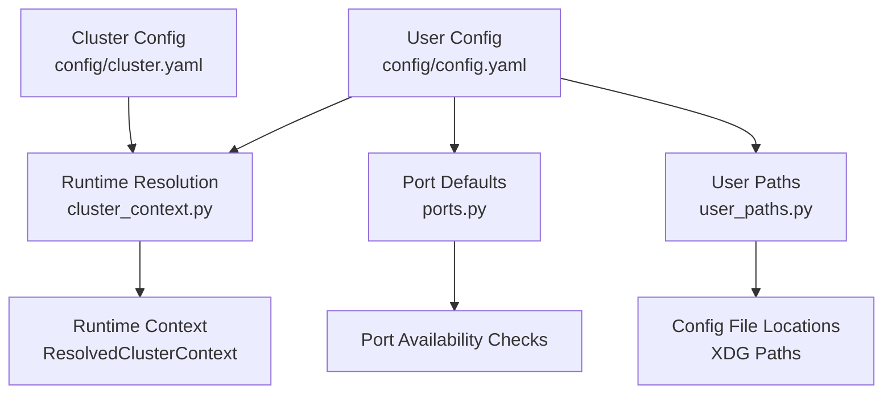
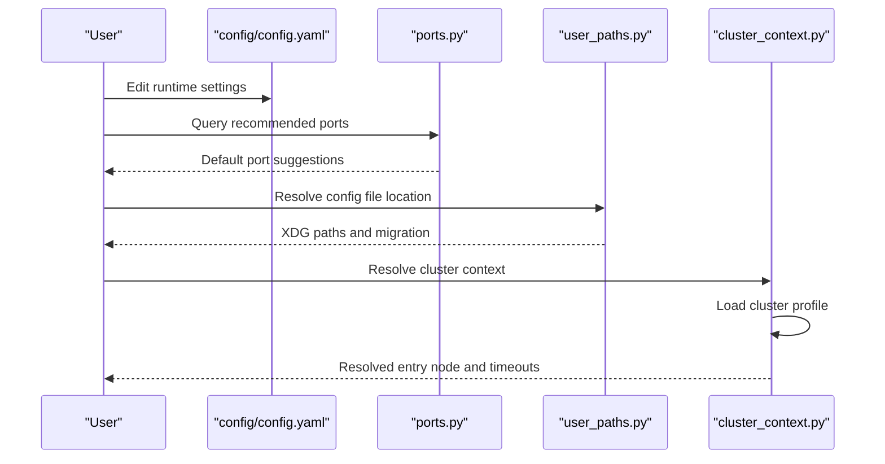
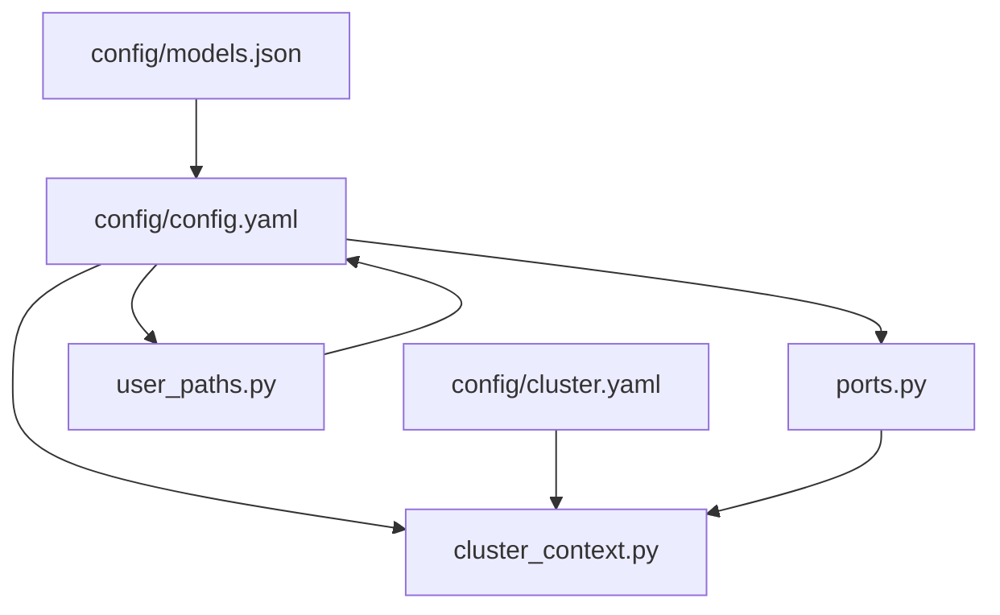

# Runtime Configuration

<cite>
**Referenced Files in This Document**
- [config.yaml](file://config/config.yaml)
- [cluster.yaml](file://config/cluster.yaml)
- [models.json](file://config/models.json)
- [README.md](file://config/README.md)
- [ports.py](file://src/sage/foundation/config/ports.py)
- [user_paths.py](file://src/sage/foundation/config/user_paths.py)
- [cluster_context.py](file://src/sage/runtime/flownet/client/cluster_context.py)
</cite>

## Table of Contents
1. [Introduction](#introduction)
2. [Project Structure](#project-structure)
3. [Core Components](#core-components)
4. [Architecture Overview](#architecture-overview)
5. [Detailed Component Analysis](#detailed-component-analysis)
6. [Dependency Analysis](#dependency-analysis)
7. [Performance Considerations](#performance-considerations)
8. [Troubleshooting Guide](#troubleshooting-guide)
9. [Conclusion](#conclusion)
10. [Appendices](#appendices)

## Introduction
This document explains SAGE’s runtime configuration system with a focus on the primary configuration file config/config.yaml and related runtime settings. It covers how configuration defines application behavior, service ports, model parameters, and resource allocation, and how it integrates with environment-specific overrides and validation. The guide is structured for both beginners (conceptual overviews of YAML and configuration concepts) and experienced developers (advanced patterns, environment overrides, and troubleshooting).

## Project Structure
The runtime configuration spans three primary areas:
- Central user configuration: config/config.yaml
- Cluster and runtime context: config/cluster.yaml and internal runtime resolution
- Foundation-level port and path management: src/sage/foundation/config/ports.py and src/sage/foundation/config/user_paths.py

**Diagram sources**
- [config.yaml:1-60](file://config/config.yaml#L1-L60)
- [cluster.yaml:1-91](file://config/cluster.yaml#L1-L91)
- [cluster_context.py:29-121](file://src/sage/runtime/flownet/client/cluster_context.py#L29-L121)
- [ports.py:25-128](file://src/sage/foundation/config/ports.py#L25-L128)
- [user_paths.py:53-147](file://src/sage/foundation/config/user_paths.py#L53-L147)

**Section sources**
- [config.yaml:1-60](file://config/config.yaml#L1-L60)
- [cluster.yaml:1-91](file://config/cluster.yaml#L1-L91)
- [README.md:1-58](file://config/README.md#L1-L58)

## Core Components
This section introduces the major configuration sections and their roles in SAGE’s runtime:

- Authentication (auth): SSH connectivity parameters for remote operations.
- Provider and cluster (provider, cluster_name): Head and worker node definitions and provider type.
- Remote environment (remote): Python interpreter, Conda environment, and SAGE home path for remote nodes.
- LLM inference (llm): Model selection, port, GPU utilization, tensor parallelism, and maximum length.
- Embedding (embedding): Embedding model name, port, and GPU toggle.
- Gateway (gateway): OpenAI-compatible gateway port and session memory backend configuration.
- Studio (studio): Frontend and backend ports for the Studio UI.
- Ray cluster parameters (ray): Dashboard and head/worker networking settings.
- Max workers (max_workers): Upper bound for worker processes.
- Model registry (models.json): Static model catalog used by the system.

Key relationships:
- Ports in llm and embedding align with centralized port defaults and availability checks.
- User paths define where config files are stored and migrated from legacy locations.
- Runtime context resolution reads cluster profiles and supports environment overrides.

**Section sources**
- [config.yaml:1-60](file://config/config.yaml#L1-L60)
- [models.json:1-67](file://config/models.json#L1-L67)
- [ports.py:25-128](file://src/sage/foundation/config/ports.py#L25-L128)
- [user_paths.py:53-147](file://src/sage/foundation/config/user_paths.py#L53-L147)
- [README.md:29-41](file://config/README.md#L29-L41)

## Architecture Overview
The configuration architecture combines static user configuration with runtime resolution and environment overrides:

**Diagram sources**
- [config.yaml:1-60](file://config/config.yaml#L1-L60)
- [ports.py:57-128](file://src/sage/foundation/config/ports.py#L57-L128)
- [user_paths.py:93-147](file://src/sage/foundation/config/user_paths.py#L93-L147)
- [cluster_context.py:29-121](file://src/sage/runtime/flownet/client/cluster_context.py#L29-L121)

## Detailed Component Analysis

### Authentication (auth)
Purpose:
- Define SSH connection parameters for remote operations, including user, private key path, and connection timeout.

Typical fields:
- connect_timeout: Connection timeout in seconds.
- ssh_private_key: Path to the SSH private key.
- ssh_user: SSH username.

Environment considerations:
- No environment variable overrides are defined for auth in the referenced code.

Validation and defaults:
- Values are parsed as provided; ensure paths exist and permissions are correct.

Practical example:
- Typical development setup uses a local SSH key and a short timeout for fast feedback loops.

**Section sources**
- [config.yaml:1-5](file://config/config.yaml#L1-L5)

### Provider and Cluster (provider, cluster_name)
Purpose:
- Identify head and worker nodes and the provider type for distributed execution.

Typical fields:
- head_ip: Head node hostname or IP.
- type: Provider type (e.g., local).
- worker_ips: List of worker node hostnames or IPs.
- cluster_name: Logical cluster identifier.

Runtime resolution:
- The runtime context loader resolves the cluster profile and validates presence of entry nodes or inventory.

Practical example:
- Local development: type: local with single head node and no workers.
- Multi-node: type: local with head and multiple workers.

**Section sources**
- [config.yaml:37-43](file://config/config.yaml#L37-L43)
- [cluster_context.py:96-121](file://src/sage/runtime/flownet/client/cluster_context.py#L96-L121)

### Remote Environment (remote)
Purpose:
- Configure remote execution environment: Python interpreter, Conda environment, and SAGE home path.

Typical fields:
- conda_env: Conda environment name.
- python_path: Python executable path.
- ray_command: Command to launch Ray.
- sage_home: Remote SAGE installation directory.

Environment considerations:
- These values can be overridden by environment variables in higher-level orchestration layers.

Practical example:
- Production: point to a managed Conda environment and a shared SAGE home.

**Section sources**
- [config.yaml:52-56](file://config/config.yaml#L52-L56)

### LLM Inference (llm)
Purpose:
- Configure the LLM model, inference port, GPU utilization, tensor parallelism, and maximum sequence length.

Typical fields:
- model: Model identifier or path.
- port: Inference service port.
- gpu_memory_utilization: Fraction of GPU memory to use.
- tensor_parallel_size: Number of GPUs for tensor parallelism.
- max_model_len: Maximum input length.

Port alignment:
- Prefer centralized port defaults and availability checks to avoid conflicts.

Practical example:
- Small dev model with minimal GPU utilization for quick iteration.
- Larger model with tensor parallelism for throughput in staging/prod.

**Section sources**
- [config.yaml:30-35](file://config/config.yaml#L30-L35)
- [ports.py:25-128](file://src/sage/foundation/config/ports.py#L25-L128)

### Embedding (embedding)
Purpose:
- Configure the embedding model, service port, and GPU toggle.

Typical fields:
- model: Embedding model identifier.
- port: Embedding service port.
- use_gpu: Whether to use GPU for embeddings.

Practical example:
- CPU-only embedding for lightweight setups.
- GPU-enabled embedding for high-throughput retrieval.

**Section sources**
- [config.yaml:6-9](file://config/config.yaml#L6-L9)
- [ports.py:25-128](file://src/sage/foundation/config/ports.py#L25-L128)

### Gateway (gateway)
Purpose:
- Expose an OpenAI-compatible gateway and configure session memory backends.

Typical fields:
- port: Gateway service port.
- session_backend: Backend type for session memory (e.g., file).
- memory.backend: Memory backend selector (short_term, vdb, kv, graph).
- memory.max_memory_dialogs: Dialog count limit for short_term.
- memory.vdb.*: Vector database backend configuration (backend_type, embedding_dim, embedding_model, max_retrieve).
- memory.kv.*: Keyword-value backend configuration (default_index_type, max_retrieve).
- memory.graph.*: Graph backend configuration (max_nodes).

Practical example:
- Short-term memory for ephemeral chats.
- Vector DB for semantic retrieval with tuned embedding dimensions.

**Section sources**
- [config.yaml:10-29](file://config/config.yaml#L10-L29)
- [ports.py:25-128](file://src/sage/foundation/config/ports.py#L25-L128)

### Studio (studio)
Purpose:
- Configure Studio frontend and backend ports.

Typical fields:
- backend_port: Studio backend port.
- frontend_port: Studio frontend port.

Practical example:
- Keep Studio ports distinct from LLM and embedding services.

**Section sources**
- [config.yaml:57-59](file://config/config.yaml#L57-L59)

### Ray Cluster Parameters (ray)
Purpose:
- Configure Ray dashboard and networking for head and worker nodes.

Typical fields:
- dashboard_host: Dashboard bind address.
- dashboard_port: Dashboard port.
- head_port: Head node port.
- worker_bind_host: Host for worker binding.
- num_cpus, num_gpus, object_store_memory: Resource allocations.

Notes:
- The referenced README indicates that the ray segment exists in config.yaml but may be historical or transitional; validate against current runtime behavior.

**Section sources**
- [config.yaml:44-51](file://config/config.yaml#L44-L51)
- [README.md:41-41](file://config/README.md#L41-L41)

### Max Workers (max_workers)
Purpose:
- Set an upper bound for worker processes.

Typical field:
- max_workers: Integer limit.

Practical example:
- Increase for heavy batch workloads; tune down for constrained environments.

**Section sources**
- [config.yaml:36-36](file://config/config.yaml#L36-L36)

### Model Registry (models.json)
Purpose:
- Provide a static catalog of models with metadata for selection and discovery.

Typical fields:
- name: Model identifier.
- base_url: Endpoint URL for the model.
- is_local: Whether the model runs locally.
- default: Default model flag.
- api_key: Optional API key placeholder.
- engine_kind: Either "llm" or "embedding".

Practical example:
- Use default model flags to select primary models for inference.
- Reference base_url to integrate with local or remote engines.

**Section sources**
- [models.json:1-67](file://config/models.json#L1-L67)

### Port Management and Availability (ports.py)
Purpose:
- Centralize port assignments, availability checks, and environment overrides.

Key capabilities:
- Recommended ports per environment (WSL vs standard).
- Priority lists for LLM and embedding ports.
- Availability probing and diagnostic reporting.
- Environment-based port override helper.

Practical example:
- Override inference port via environment variable when the default port is unavailable.

**Section sources**
- [ports.py:25-128](file://src/sage/foundation/config/ports.py#L25-L128)

### User Paths and Migration (user_paths.py)
Purpose:
- Define XDG-compliant directories for config, data, state, and cache, and manage migration from legacy locations.

Key capabilities:
- Paths for config.yaml, cluster.yaml, and credentials.
- Directory creation and migration from ~/.sage.
- Log file helpers and cache directories.

Practical example:
- Place config.yaml under ~/.config/sage/ for portable, standardized configuration.

**Section sources**
- [user_paths.py:53-147](file://src/sage/foundation/config/user_paths.py#L53-L147)

### Runtime Cluster Context Resolution (cluster_context.py)
Purpose:
- Resolve runtime cluster context from environment, default files, or explicit arguments.

Key capabilities:
- Mode selection (connect, local_runtime).
- Environment variable overrides (e.g., FLOWNET_CLUSTER).
- Profile loading and validation (entry_node/inventory presence).
- Address normalization and default port assignment.

Practical example:
- Set FLOWNET_CLUSTER to select a named cluster profile automatically.

**Section sources**
- [cluster_context.py:29-121](file://src/sage/runtime/flownet/client/cluster_context.py#L29-L121)

## Dependency Analysis
This section maps how configuration sections depend on each other and on foundational utilities:

**Diagram sources**
- [config.yaml:1-60](file://config/config.yaml#L1-L60)
- [cluster.yaml:1-91](file://config/cluster.yaml#L1-L91)
- [models.json:1-67](file://config/models.json#L1-L67)
- [ports.py:25-128](file://src/sage/foundation/config/ports.py#L25-L128)
- [user_paths.py:53-147](file://src/sage/foundation/config/user_paths.py#L53-L147)
- [cluster_context.py:29-121](file://src/sage/runtime/flownet/client/cluster_context.py#L29-L121)

**Section sources**
- [config.yaml:1-60](file://config/config.yaml#L1-L60)
- [cluster.yaml:1-91](file://config/cluster.yaml#L1-L91)
- [models.json:1-67](file://config/models.json#L1-L67)
- [ports.py:25-128](file://src/sage/foundation/config/ports.py#L25-L128)
- [user_paths.py:53-147](file://src/sage/foundation/config/user_paths.py#L53-L147)
- [cluster_context.py:29-121](file://src/sage/runtime/flownet/client/cluster_context.py#L29-L121)

## Performance Considerations
- Port conflicts: Use centralized port availability checks to prevent collisions between LLM, embedding, and gateway services.
- GPU utilization: Tune gpu_memory_utilization carefully to balance throughput and stability; avoid overcommitting resources.
- Tensor parallelism: Increase tensor_parallel_size for larger models, but ensure adequate interconnect bandwidth.
- Memory backends: Choose memory.backend based on workload—short_term for ephemeral sessions, vdb/kv/graph for persistent retrieval.
- Worker limits: Adjust max_workers according to CPU/GPU capacity and I/O characteristics.

[No sources needed since this section provides general guidance]

## Troubleshooting Guide
Common issues and resolutions:

- Port already in use
  - Symptom: Services fail to start on the configured port.
  - Action: Use port availability checks and choose an alternative port; override via environment where supported.
  - Related code: port availability and diagnostic helpers.
  - Section sources
    - [ports.py:85-128](file://src/sage/foundation/config/ports.py#L85-L128)

- SSH connectivity failures
  - Symptom: Remote operations hang or fail.
  - Action: Verify ssh_user, ssh_private_key path, and connect_timeout; ensure key permissions and agent forwarding if needed.
  - Section sources
    - [config.yaml:1-5](file://config/config.yaml#L1-L5)

- Missing cluster profile or entry node
  - Symptom: Runtime context resolution fails.
  - Action: Ensure cluster profile exists and contains entry_node or inventory; set FLOWNET_CLUSTER if using default path.
  - Section sources
    - [cluster_context.py:96-121](file://src/sage/runtime/flownet/client/cluster_context.py#L96-L121)

- Model not found or misconfigured
  - Symptom: Inference requests fail.
  - Action: Confirm model name and base_url in models.json; ensure engine is reachable at the specified port.
  - Section sources
    - [models.json:1-67](file://config/models.json#L1-L67)
    - [config.yaml:30-35](file://config/config.yaml#L30-L35)

- Environment-specific overrides not applied
  - Symptom: Changes not taking effect.
  - Action: Confirm environment variable precedence and ensure variables are exported before invoking SAGE commands.
  - Section sources
    - [ports.py:103-111](file://src/sage/foundation/config/ports.py#L103-L111)

## Conclusion
SAGE’s runtime configuration centers on config/config.yaml, which defines authentication, provider topology, remote environment, LLM and embedding settings, gateway and Studio ports, and Ray parameters. Foundation utilities in ports.py and user_paths.py standardize port defaults and file locations, while cluster_context.py resolves runtime context from environment and profiles. By combining these elements, teams can tailor SAGE for development, staging, and production with predictable behavior and robust validation.

[No sources needed since this section summarizes without analyzing specific files]

## Appendices

### Practical Configuration Examples

- Development
  - Use local provider with minimal GPU utilization and short-term memory backend.
  - Keep ports close to defaults and rely on availability checks.
  - Example fields: provider.type: local, llm.gpu_memory_utilization low, gateway.memory.backend: short_term.

- Staging
  - Enable GPU for embedding and moderate LLM utilization.
  - Use vector DB backend for retrieval; set appropriate max_retrieve.
  - Example fields: embedding.use_gpu: true, gateway.memory.vdb.*, llm.tensor_parallel_size > 1.

- Production
  - Distribute across head and worker nodes; configure Ray dashboard and networking.
  - Set secure ports and environment-specific overrides via environment variables.
  - Example fields: provider.worker_ips populated, ray.dashboard_port, remote.sage_home pointing to shared path.

[No sources needed since this section provides general guidance]