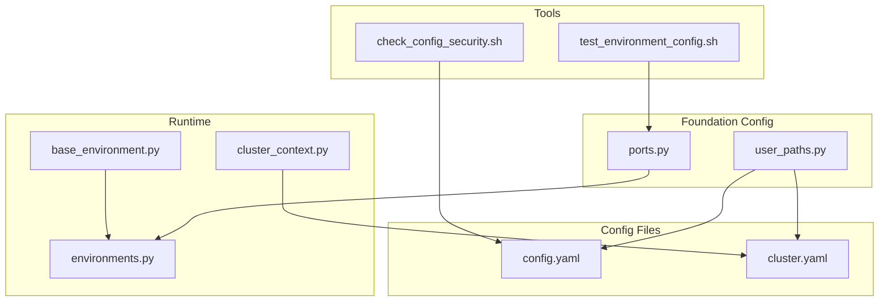
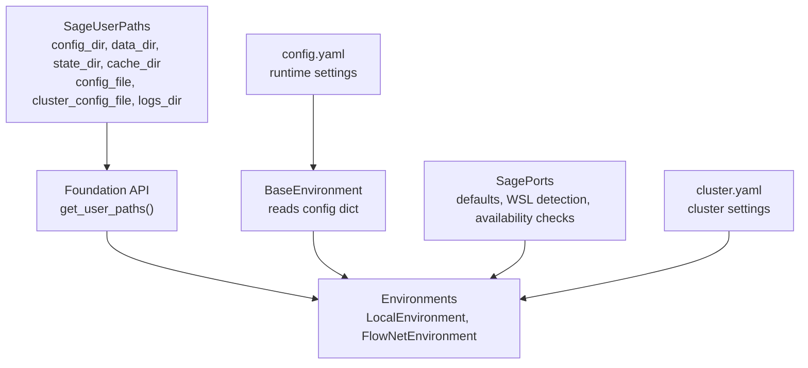
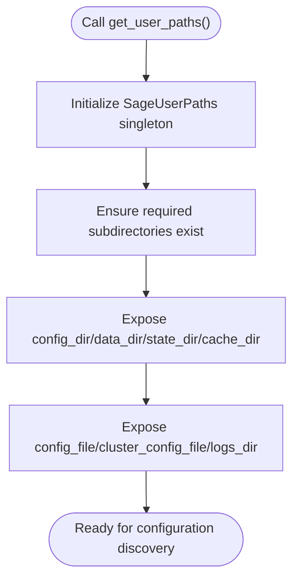
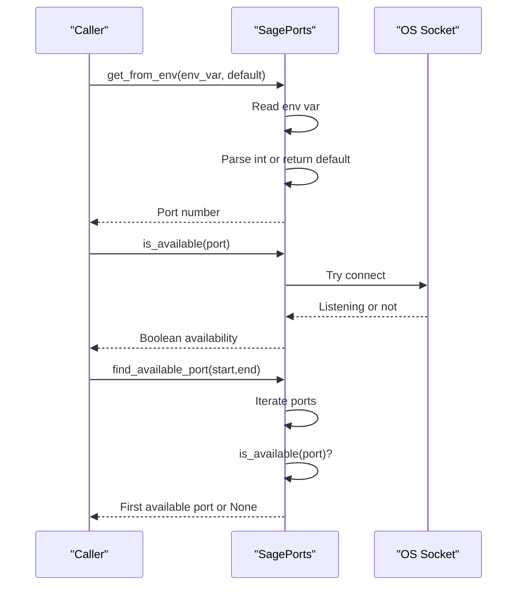
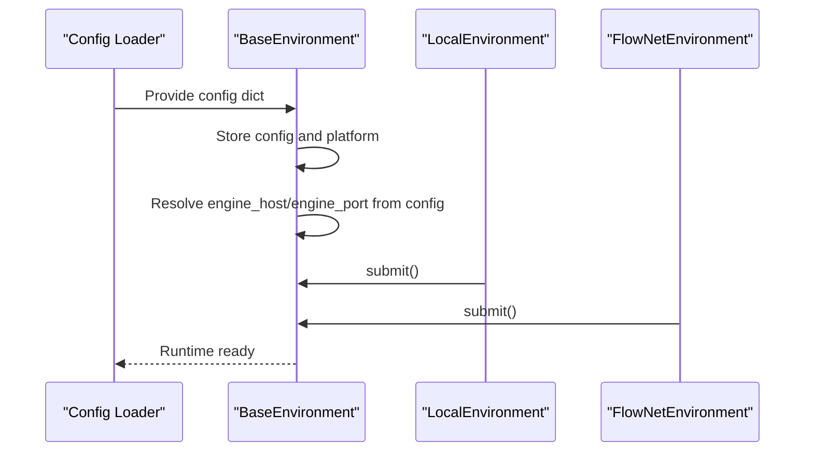
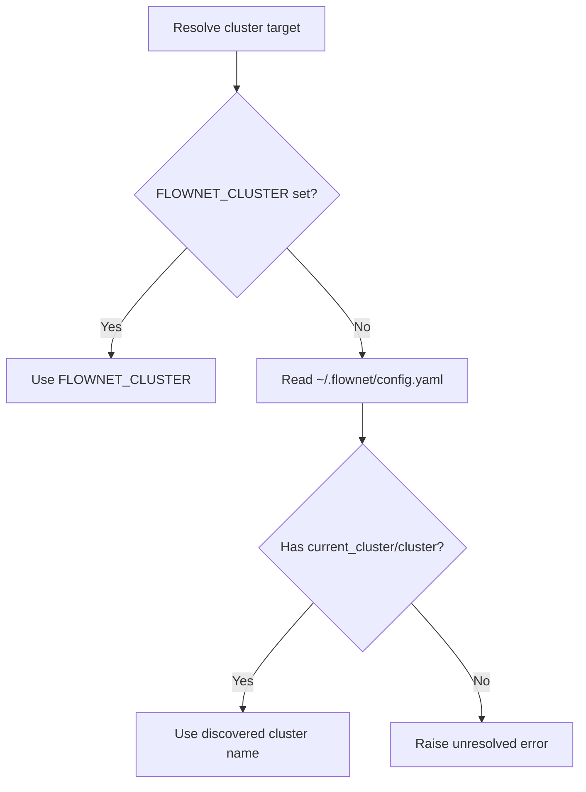
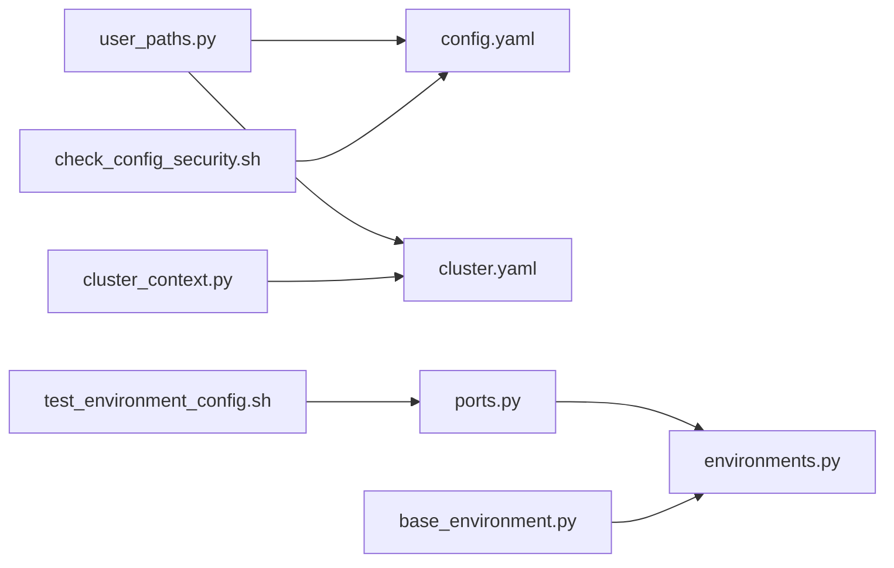

# User Paths and Environment Handling

<cite>
**Referenced Files in This Document**
- [user_paths.py](file://src/sage/foundation/config/user_paths.py)
- [ports.py](file://src/sage/foundation/config/ports.py)
- [config.yaml](file://config/config.yaml)
- [cluster.yaml](file://config/cluster.yaml)
- [base_environment.py](file://src/sage/runtime/base_environment.py)
- [environments.py](file://src/sage/runtime/environments.py)
- [cluster_context.py](file://src/sage/runtime/flownet/client/cluster_context.py)
- [check_config_security.sh](file://tools/maintenance/helpers/check_config_security.sh)
- [test_environment_config.sh](file://tools/install/tests/test_environment_config.sh)
</cite>

## Table of Contents
1. [Introduction](#introduction)
2. [Project Structure](#project-structure)
3. [Core Components](#core-components)
4. [Architecture Overview](#architecture-overview)
5. [Detailed Component Analysis](#detailed-component-analysis)
6. [Dependency Analysis](#dependency-analysis)
7. [Performance Considerations](#performance-considerations)
8. [Troubleshooting Guide](#troubleshooting-guide)
9. [Conclusion](#conclusion)
10. [Appendices](#appendices)

## Introduction
This document explains how SAGE resolves user configuration paths and manages environment variables for runtime configuration. It focuses on the XDG Base Directory Specification–compliant path resolution implemented in user_paths.py, the centralized port management in ports.py, and how environment variables influence configuration discovery and runtime behavior. It also covers legacy migration, cross-platform path handling, validation, and troubleshooting.

## Project Structure
The relevant parts of the repository for user paths and environment handling are organized as follows:
- Foundation configuration utilities under src/sage/foundation/config:
  - user_paths.py: XDG-compliant path resolution and configuration file locations
  - ports.py: port defaults, availability checks, and environment-driven overrides
- Runtime environments under src/sage/runtime:
  - base_environment.py: base environment abstraction and configuration usage
  - environments.py: environment implementations that consume configuration
- Example configuration files under config:
  - config.yaml: runtime and service configuration
  - cluster.yaml: cluster and remote execution settings
- Additional runtime integration:
  - cluster_context.py: environment-driven cluster selection and YAML-based discovery
  - check_config_security.sh: configuration safety checks
  - test_environment_config.sh: environment variable tests

**Diagram sources**
- [user_paths.py:1-195](file://src/sage/foundation/config/user_paths.py#L1-L195)
- [ports.py:1-199](file://src/sage/foundation/config/ports.py#L1-L199)
- [base_environment.py:1-269](file://src/sage/runtime/base_environment.py#L1-L269)
- [environments.py:1-224](file://src/sage/runtime/environments.py#L1-L224)
- [cluster_context.py:55-159](file://src/sage/runtime/flownet/client/cluster_context.py#L55-L159)
- [config.yaml:1-60](file://config/config.yaml#L1-L60)
- [cluster.yaml:1-91](file://config/cluster.yaml#L1-L91)
- [check_config_security.sh:1-44](file://tools/maintenance/helpers/check_config_security.sh#L1-L44)
- [test_environment_config.sh:1-45](file://tools/install/tests/test_environment_config.sh#L1-L45)

**Section sources**
- [user_paths.py:1-195](file://src/sage/foundation/config/user_paths.py#L1-L195)
- [ports.py:1-199](file://src/sage/foundation/config/ports.py#L1-L199)
- [config.yaml:1-60](file://config/config.yaml#L1-L60)
- [cluster.yaml:1-91](file://config/cluster.yaml#L1-L91)

## Core Components
- XDG-compliant user paths resolver:
  - Provides per-user directories for config, data, state, and cache
  - Ensures required subdirectories exist
  - Exposes configuration file paths and cache/data/log locations
  - Includes legacy home migration support
- Centralized port manager:
  - Defines default ports for services
  - Detects WSL and adjusts recommended ports
  - Validates port availability and finds free ports
  - Reads ports from environment variables with integer fallback
- Runtime environment integration:
  - BaseEnvironment consumes configuration dictionaries
  - Environments use configuration for engine host/port and other settings
- Cluster context resolution:
  - Resolves cluster identity from environment variables or YAML
  - Supports ~/.flownet/config.yaml discovery for default clusters

**Section sources**
- [user_paths.py:53-157](file://src/sage/foundation/config/user_paths.py#L53-L157)
- [ports.py:25-129](file://src/sage/foundation/config/ports.py#L25-L129)
- [base_environment.py:45-211](file://src/sage/runtime/base_environment.py#L45-L211)
- [environments.py:18-224](file://src/sage/runtime/environments.py#L18-L224)
- [cluster_context.py:81-159](file://src/sage/runtime/flownet/client/cluster_context.py#L81-L159)

## Architecture Overview
The path and environment handling architecture integrates XDG path resolution, port management, and runtime configuration loading. The diagram below maps the actual code components and their relationships.

**Diagram sources**
- [user_paths.py:53-157](file://src/sage/foundation/config/user_paths.py#L53-L157)
- [base_environment.py:45-211](file://src/sage/runtime/base_environment.py#L45-L211)
- [environments.py:18-224](file://src/sage/runtime/environments.py#L18-L224)
- [ports.py:25-129](file://src/sage/foundation/config/ports.py#L25-L129)
- [config.yaml:1-60](file://config/config.yaml#L1-L60)
- [cluster.yaml:1-91](file://config/cluster.yaml#L1-L91)

## Detailed Component Analysis

### XDG Path Resolution and Configuration Discovery
Purpose:
- Resolve user-scoped directories according to XDG Base Directory Specification
- Provide canonical locations for config.yaml, cluster.yaml, logs, caches, and data
- Ensure required subdirectories exist during first initialization
- Support migration from legacy ~/.sage to XDG locations

Key behaviors:
- Environment variable precedence:
  - XDG_CONFIG_HOME/XDG_DATA_HOME/XDG_STATE_HOME/XDG_CACHE_HOME override default base directories
  - Defaults follow XDG conventions: ~/.config, ~/.local/share, ~/.local/state, ~/.cache
- Directory creation:
  - Creates the top-level "sage" subdirectory under each base if missing
  - Ensures subdirectories for models, sessions, vector_db, finetune, flows, logs, and cache subfolders exist
- Configuration file paths:
  - config.yaml, cluster.yaml, credentials.yaml are resolved under config_dir
  - Logs, model caches, and stream caches are resolved under state_dir and cache_dir respectively
- Legacy migration:
  - Copies select legacy files into XDG locations if not present

**Diagram sources**
- [user_paths.py:56-90](file://src/sage/foundation/config/user_paths.py#L56-L90)
- [user_paths.py:93-147](file://src/sage/foundation/config/user_paths.py#L93-L147)
- [user_paths.py:167-182](file://src/sage/foundation/config/user_paths.py#L167-L182)

**Section sources**
- [user_paths.py:14-50](file://src/sage/foundation/config/user_paths.py#L14-L50)
- [user_paths.py:59-74](file://src/sage/foundation/config/user_paths.py#L59-L74)
- [user_paths.py:93-147](file://src/sage/foundation/config/user_paths.py#L93-L147)
- [user_paths.py:167-182](file://src/sage/foundation/config/user_paths.py#L167-L182)

### Port Management Utilities and Environment Variable Injection
Purpose:
- Provide centralized port defaults for services
- Detect platform-specific behavior (WSL)
- Validate port availability and find free ports
- Allow environment-driven overrides with integer fallback

Key behaviors:
- Defaults:
  - Define service ports for gateway, inference engines, embeddings, and benchmarks
  - Provide compatibility aliases
- Availability checks:
  - Attempt TCP connection to determine if a port is listening or available
- Free port discovery:
  - Iterate within a configurable range to find the first available port
- Environment-driven overrides:
  - Read integer values from environment variables with fallback to defaults
- WSL detection:
  - Adjust recommended ports when running under WSL

**Diagram sources**
- [ports.py:103-129](file://src/sage/foundation/config/ports.py#L103-L129)
- [ports.py:95-100](file://src/sage/foundation/config/ports.py#L95-L100)
- [ports.py:16-23](file://src/sage/foundation/config/ports.py#L16-L23)

**Section sources**
- [ports.py:25-129](file://src/sage/foundation/config/ports.py#L25-L129)
- [ports.py:191-195](file://src/sage/foundation/config/ports.py#L191-L195)

### Runtime Configuration Loading and Environment Integration
Purpose:
- Load and apply runtime configuration from config.yaml
- Integrate configuration into environment instances
- Support environment-specific overrides and defaults

Key behaviors:
- Configuration consumption:
  - BaseEnvironment stores a config dictionary and reads engine host/port from it
- Environment implementations:
  - LocalEnvironment and FlowNetEnvironment use configuration for job submission and runtime behavior
- Example configuration fields:
  - LLM, embedding, gateway, provider, ray, remote, studio, and others are defined in config.yaml

**Diagram sources**
- [base_environment.py:45-211](file://src/sage/runtime/base_environment.py#L45-L211)
- [environments.py:18-224](file://src/sage/runtime/environments.py#L18-L224)
- [config.yaml:1-60](file://config/config.yaml#L1-60)

**Section sources**
- [base_environment.py:45-211](file://src/sage/runtime/base_environment.py#L45-L211)
- [environments.py:18-224](file://src/sage/runtime/environments.py#L18-L224)
- [config.yaml:1-60](file://config/config.yaml#L1-60)

### Cluster Context Resolution and Environment Variables
Purpose:
- Resolve cluster identity from environment variables or YAML
- Discover default cluster names from ~/.flownet/config.yaml

Key behaviors:
- Environment-driven resolution:
  - Use FLOWNET_CLUSTER if set
  - Fall back to default cluster name from YAML
- YAML discovery:
  - Read ~/.flownet/config.yaml and extract current_cluster or cluster
  - Support nested context.current_cluster as well

**Diagram sources**
- [cluster_context.py:81-159](file://src/sage/runtime/flownet/client/cluster_context.py#L81-L159)

**Section sources**
- [cluster_context.py:81-159](file://src/sage/runtime/flownet/client/cluster_context.py#L81-L159)

### Practical Examples and Scenarios
- Configuration location resolution:
  - With XDG variables set, config.yaml resolves under XDG_CONFIG_HOME/sage
  - Without variables, resolves under ~/.config/sage
  - Legacy ~/.sage files are migrated automatically if missing
- Environment variable usage:
  - Ports can be overridden via environment variables using SagePorts.get_from_env
  - Cluster identity can be selected via FLOWNET_CLUSTER
- Path customization:
  - Set XDG_CONFIG_HOME/XDG_DATA_HOME/XDG_STATE_HOME/XDG_CACHE_HOME to relocate all SAGE user data
  - Use get_user_paths() to programmatically access all resolved paths
- Cross-platform considerations:
  - WSL detection influences recommended ports
  - Pathlib ensures cross-platform path semantics

**Section sources**
- [user_paths.py:14-50](file://src/sage/foundation/config/user_paths.py#L14-L50)
- [user_paths.py:167-182](file://src/sage/foundation/config/user_paths.py#L167-L182)
- [ports.py:16-23](file://src/sage/foundation/config/ports.py#L16-L23)
- [ports.py:103-111](file://src/sage/foundation/config/ports.py#L103-L111)
- [cluster_context.py:81-94](file://src/sage/runtime/flownet/client/cluster_context.py#L81-L94)

## Dependency Analysis
The following diagram shows how components depend on each other for path resolution and environment handling.

**Diagram sources**
- [user_paths.py:93-147](file://src/sage/foundation/config/user_paths.py#L93-L147)
- [ports.py:25-129](file://src/sage/foundation/config/ports.py#L25-L129)
- [base_environment.py:45-211](file://src/sage/runtime/base_environment.py#L45-L211)
- [environments.py:18-224](file://src/sage/runtime/environments.py#L18-L224)
- [cluster_context.py:134-159](file://src/sage/runtime/flownet/client/cluster_context.py#L134-L159)
- [check_config_security.sh:1-44](file://tools/maintenance/helpers/check_config_security.sh#L1-L44)
- [test_environment_config.sh:1-45](file://tools/install/tests/test_environment_config.sh#L1-L45)

**Section sources**
- [user_paths.py:93-147](file://src/sage/foundation/config/user_paths.py#L93-L147)
- [ports.py:25-129](file://src/sage/foundation/config/ports.py#L25-L129)
- [base_environment.py:45-211](file://src/sage/runtime/base_environment.py#L45-L211)
- [environments.py:18-224](file://src/sage/runtime/environments.py#L18-L224)
- [cluster_context.py:134-159](file://src/sage/runtime/flownet/client/cluster_context.py#L134-L159)
- [check_config_security.sh:1-44](file://tools/maintenance/helpers/check_config_security.sh#L1-L44)
- [test_environment_config.sh:1-45](file://tools/install/tests/test_environment_config.sh#L1-L45)

## Performance Considerations
- Path resolution caching:
  - get_user_config_dir/get_user_data_dir/get_user_state_dir/get_user_cache_dir are cached to avoid repeated filesystem checks
- Port availability checks:
  - Socket-based checks are lightweight but should be used judiciously; cache results when repeatedly checking the same ports
- Directory creation:
  - Ensuring directory structures happens once per process lifecycle via SageUserPaths initialization

**Section sources**
- [user_paths.py:21-50](file://src/sage/foundation/config/user_paths.py#L21-L50)
- [user_paths.py:59-74](file://src/sage/foundation/config/user_paths.py#L59-L74)
- [ports.py:85-93](file://src/sage/foundation/config/ports.py#L85-L93)

## Troubleshooting Guide
Common issues and resolutions:
- Configuration file not found:
  - Verify config.yaml exists under the resolved config_dir
  - Check XDG environment variables if paths differ from expectations
- Legacy configuration not migrated:
  - Ensure ~/.sage exists and contains legacy files
  - Run migration routine to copy files into XDG locations
- Port conflicts:
  - Use SagePorts.find_available_port to discover an alternate port
  - Override via environment variables using SagePorts.get_from_env
- Cluster context unresolved:
  - Set FLOWNET_CLUSTER environment variable
  - Ensure ~/.flownet/config.yaml exists and contains current_cluster or cluster
- Configuration validation:
  - Use check_config_security.sh to scan for sensitive values in YAML files
- Environment variable tests:
  - Run test_environment_config.sh to validate environment variable defaults and safety

**Section sources**
- [user_paths.py:167-182](file://src/sage/foundation/config/user_paths.py#L167-L182)
- [ports.py:95-111](file://src/sage/foundation/config/ports.py#L95-L111)
- [cluster_context.py:81-94](file://src/sage/runtime/flownet/client/cluster_context.py#L81-L94)
- [check_config_security.sh:16-43](file://tools/maintenance/helpers/check_config_security.sh#L16-L43)
- [test_environment_config.sh:9-22](file://tools/install/tests/test_environment_config.sh#L9-L22)

## Conclusion
SAGE’s user paths and environment handling combine XDG-compliant path resolution, centralized port management, and environment-driven configuration discovery. By leveraging environment variables and standardized directories, SAGE ensures predictable configuration locations across platforms, supports easy customization, and provides robust fallbacks and diagnostics.

## Appendices
- Configuration file references:
  - config.yaml: runtime and service settings
  - cluster.yaml: cluster and remote execution settings
- Tools:
  - check_config_security.sh: security scanning for configuration files
  - test_environment_config.sh: environment variable tests

**Section sources**
- [config.yaml:1-60](file://config/config.yaml#L1-L60)
- [cluster.yaml:1-91](file://config/cluster.yaml#L1-L91)
- [check_config_security.sh:1-44](file://tools/maintenance/helpers/check_config_security.sh#L1-L44)
- [test_environment_config.sh:1-45](file://tools/install/tests/test_environment_config.sh#L1-L45)