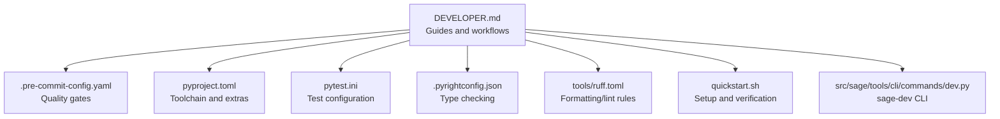
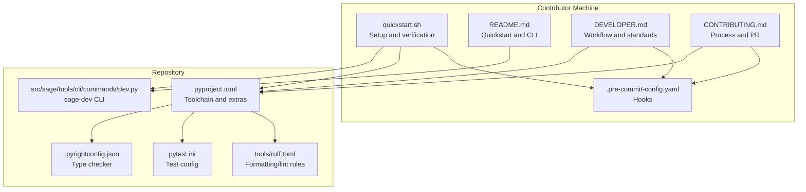
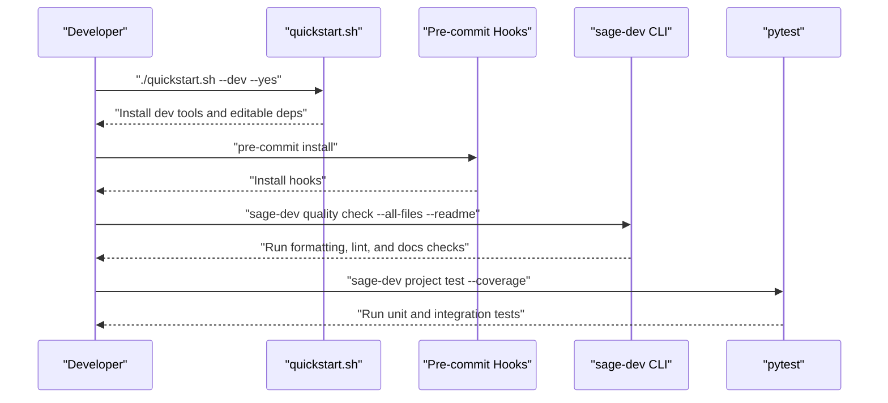
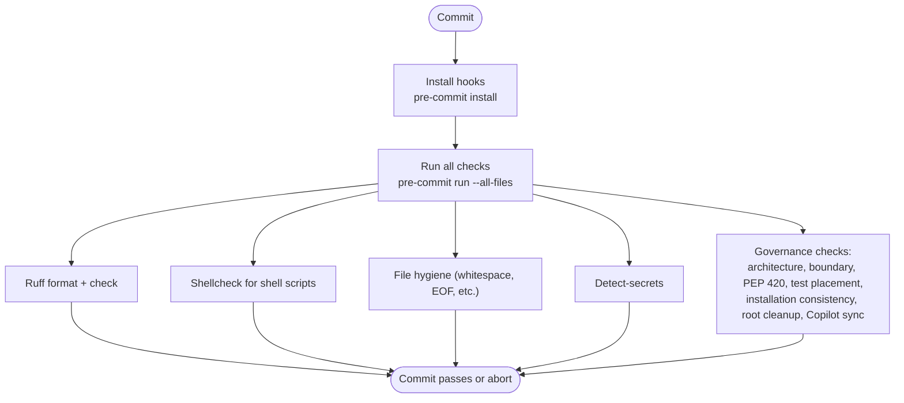
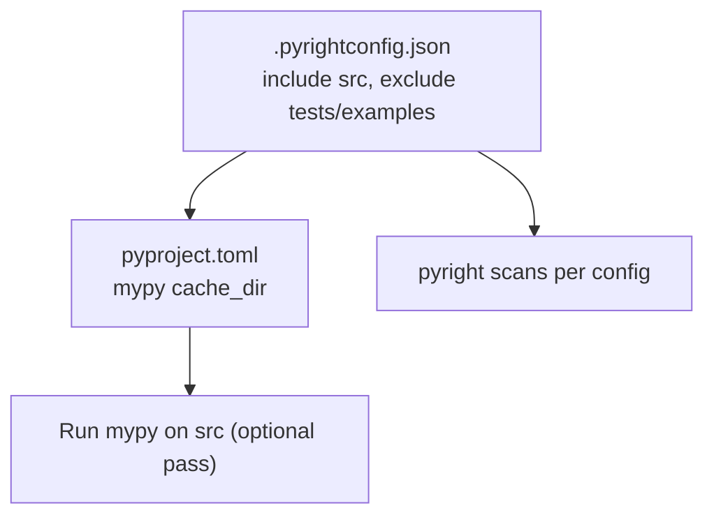
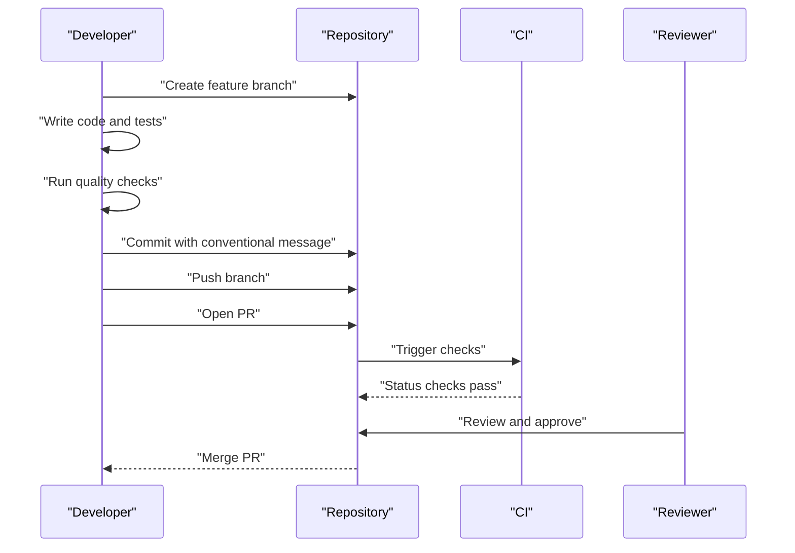
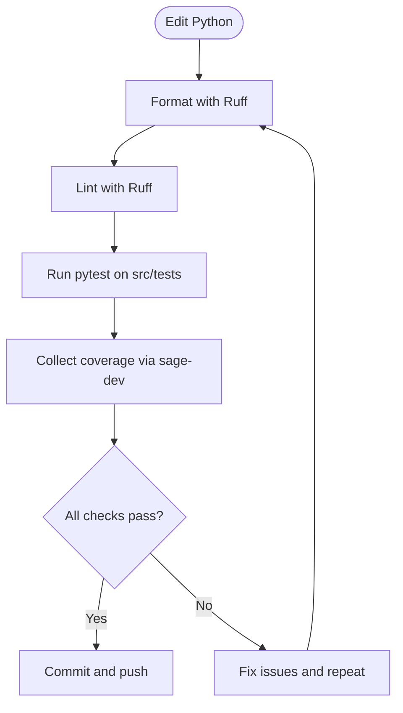
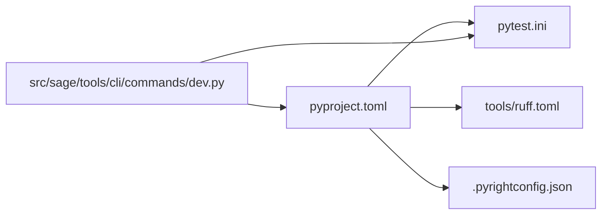

# Developer Guidelines

<cite>
**Referenced Files in This Document**
- [DEVELOPER.md](file://DEVELOPER.md)
- [README.md](file://README.md)
- [CONTRIBUTING.md](file://CONTRIBUTING.md)
- [.pre-commit-config.yaml](file://.pre-commit-config.yaml)
- [.pyrightconfig.json](file://.pyrightconfig.json)
- [pyproject.toml](file://pyproject.toml)
- [pytest.ini](file://pytest.ini)
- [tools/ruff.toml](file://tools/ruff.toml)
- [quickstart.sh](file://quickstart.sh)
- [src/sage/tools/cli/commands/dev.py](file://src/sage/tools/cli/commands/dev.py)
</cite>

## Table of Contents
1. [Introduction](#introduction)
2. [Project Structure](#project-structure)
3. [Core Components](#core-components)
4. [Architecture Overview](#architecture-overview)
5. [Detailed Component Analysis](#detailed-component-analysis)
6. [Dependency Analysis](#dependency-analysis)
7. [Performance Considerations](#performance-considerations)
8. [Troubleshooting Guide](#troubleshooting-guide)
9. [Conclusion](#conclusion)
10. [Appendices](#appendices)

## Introduction
This Developer Guidelines section consolidates SAGE’s contribution standards, development workflows, and code quality requirements. It serves as the comprehensive guide for contributors, covering development practices, code standards, testing requirements, and community interaction guidelines. The document balances conceptual overviews for new contributors with technical details for experienced developers, using terminology consistent with the codebase such as development workflow, pre-commit hooks, type checking, and contribution guidelines.

## Project Structure
SAGE organizes its development assets across several key areas:
- Core development documentation and workflows are defined in DEVELOPER.md and CONTRIBUTING.md.
- Code quality is enforced via pre-commit hooks (.pre-commit-config.yaml) and static analysis configuration (.pyrightconfig.json, tools/ruff.toml).
- The project’s Python toolchain and optional dependencies are declared in pyproject.toml.
- Tests are executed with pytest using configuration in pytest.ini.
- The in-tree sage-dev CLI provides streamlined commands for quality, testing, and maintenance.
- The quickstart.sh script automates environment setup, dependency installation, and verification.

**Diagram sources**
- [DEVELOPER.md:1-783](file://DEVELOPER.md#L1-L783)
- [.pre-commit-config.yaml:1-402](file://.pre-commit-config.yaml#L1-L402)
- [pyproject.toml:1-105](file://pyproject.toml#L1-L105)
- [pytest.ini:1-7](file://pytest.ini#L1-L7)
- [.pyrightconfig.json:1-39](file://.pyrightconfig.json#L1-L39)
- [tools/ruff.toml:1-12](file://tools/ruff.toml#L1-L12)
- [quickstart.sh:1-200](file://quickstart.sh#L1-L200)
- [src/sage/tools/cli/commands/dev.py:1-263](file://src/sage/tools/cli/commands/dev.py#L1-L263)

**Section sources**
- [DEVELOPER.md:29-118](file://DEVELOPER.md#L29-L118)
- [README.md:210-301](file://README.md#L210-L301)

## Core Components
- Development workflow and environment setup: quickstart.sh orchestrates installation modes (--dev and --standard), environment verification, and pre-commit hook installation.
- Pre-commit hooks: .pre-commit-config.yaml defines formatting, linting, shellcheck, file hygiene, and security checks, ensuring local parity with CI.
- Type checking: .pyrightconfig.json configures pyright to scan src while excluding tests and examples, with a basic type checking mode.
- Code quality and formatting: tools/ruff.toml sets line length, target Python version, and lint/format preferences; pyproject.toml references this configuration.
- Testing: pytest.ini configures test discovery under src/tests and marks integration tests; src/sage/tools/cli/commands/dev.py provides a unified CLI for running tests and coverage.
- Contribution standards: CONTRIBUTING.md outlines branching, commits, PR process, and quality gates.

**Section sources**
- [DEVELOPER.md:343-446](file://DEVELOPER.md#L343-L446)
- [.pre-commit-config.yaml:13-402](file://.pre-commit-config.yaml#L13-L402)
- [.pyrightconfig.json:1-39](file://.pyrightconfig.json#L1-L39)
- [tools/ruff.toml:1-12](file://tools/ruff.toml#L1-L12)
- [pyproject.toml:99-105](file://pyproject.toml#L99-L105)
- [pytest.ini:1-7](file://pytest.ini#L1-L7)
- [src/sage/tools/cli/commands/dev.py:145-167](file://src/sage/tools/cli/commands/dev.py#L145-L167)
- [CONTRIBUTING.md:193-192](file://CONTRIBUTING.md#L193-L192)

## Architecture Overview
The development architecture centers on a single source of truth for quality gates (.pre-commit-config.yaml), a unified CLI (sage-dev) for common tasks, and a modular toolchain declared in pyproject.toml. The quickstart.sh script ensures consistent environment setup across contributors.

**Diagram sources**
- [quickstart.sh:1-200](file://quickstart.sh#L1-L200)
- [.pre-commit-config.yaml:1-402](file://.pre-commit-config.yaml#L1-L402)
- [pyproject.toml:1-105](file://pyproject.toml#L1-L105)
- [tools/ruff.toml:1-12](file://tools/ruff.toml#L1-L12)
- [pytest.ini:1-7](file://pytest.ini#L1-L7)
- [.pyrightconfig.json:1-39](file://.pyrightconfig.json#L1-L39)
- [src/sage/tools/cli/commands/dev.py:1-263](file://src/sage/tools/cli/commands/dev.py#L1-L263)
- [README.md:125-158](file://README.md#L125-L158)
- [DEVELOPER.md:343-446](file://DEVELOPER.md#L343-L446)
- [CONTRIBUTING.md:47-178](file://CONTRIBUTING.md#L47-L178)

## Detailed Component Analysis

### Development Workflow
- Environment setup: Use quickstart.sh with --dev for development mode (installs dev tools, editable sibling repos) or --standard for stable PyPI-based installs.
- Verification: Run core surface verification via sage verify and related commands to confirm environment health.
- CLI surface: The in-tree CLI provides commands for version, status, doctor, runtime nodes, serving gateway, chat, and indexing.

**Diagram sources**
- [quickstart.sh:1-200](file://quickstart.sh#L1-L200)
- [.pre-commit-config.yaml:13-402](file://.pre-commit-config.yaml#L13-L402)
- [src/sage/tools/cli/commands/dev.py:35-143](file://src/sage/tools/cli/commands/dev.py#L35-L143)
- [pytest.ini:1-7](file://pytest.ini#L1-L7)

**Section sources**
- [DEVELOPER.md:333-446](file://DEVELOPER.md#L333-L446)
- [README.md:125-158](file://README.md#L125-L158)

### Pre-commit Hooks Configuration
- Single source of truth: .pre-commit-config.yaml governs all checks locally and in CI.
- Included checks: trailing-whitespace, end-of-file-fixer, YAML/JSON/TOML checks, large file detection, merge conflict detection, case conflict, line endings, private key detection, ruff (format and check), shellcheck, YAML and Markdown formatting, detect-secrets, and repository governance checks (architecture, boundary, PEP 420 compliance, test file placement, installation consistency, root cleanup, Copilot instructions sync).
- Local vs CI parity: Both local Git hooks and CI use the same configuration file to guarantee identical outcomes.

**Diagram sources**
- [.pre-commit-config.yaml:13-402](file://.pre-commit-config.yaml#L13-L402)

**Section sources**
- [DEVELOPER.md:447-508](file://DEVELOPER.md#L447-L508)
- [.pre-commit-config.yaml:13-402](file://.pre-commit-config.yaml#L13-L402)

### Type Checking Setup
- Configuration: .pyrightconfig.json includes src, excludes tests and examples, and sets typeCheckingMode to basic with relaxed reporting flags.
- Cache: pyproject.toml configures mypy cache_dir under .sage/cache/mypy.
- Usage: Run mypy on src selectively; pyright is configured via .pyrightconfig.json.

**Diagram sources**
- [.pyrightconfig.json:1-39](file://.pyrightconfig.json#L1-L39)
- [pyproject.toml:102-105](file://pyproject.toml#L102-L105)

**Section sources**
- [DEVELOPER.md:527-540](file://DEVELOPER.md#L527-L540)
- [.pyrightconfig.json:1-39](file://.pyrightconfig.json#L1-L39)
- [pyproject.toml:102-105](file://pyproject.toml#L102-L105)

### Contribution Process and Code Review Standards
- Branching: Use feature/* branches for new features; keep PR scope focused and manageable.
- Commits: Follow Conventional Commits (feat, fix, docs, style, refactor, test, chore, perf, ci, build, deps, revert, security).
- PR lifecycle: Create feature branches, make changes, run quality checks, commit with conventional messages, push, and open a PR.
- Code review: Require at least one approval; address comments promptly; keep PRs scoped appropriately.

**Diagram sources**
- [CONTRIBUTING.md:193-192](file://CONTRIBUTING.md#L193-L192)
- [CONTRIBUTING.md:709-755](file://CONTRIBUTING.md#L709-L755)
- [CONTRIBUTING.md:756-762](file://CONTRIBUTING.md#L756-L762)

**Section sources**
- [CONTRIBUTING.md:47-178](file://CONTRIBUTING.md#L47-L178)
- [CONTRIBUTING.md:709-762](file://CONTRIBUTING.md#L709-L762)

### Coding Conventions and Testing Requirements
- Formatting and linting: Use Ruff for both formatting and linting; adhere to tools/ruff.toml settings (line length, quote style, indent style, target version).
- Tests: Place tests under src/tests; mark integration tests with @pytest.mark.integration; use descriptive test names; keep imports rooted at the in-tree surface.
- Coverage: Use sage-dev project test --coverage to run tests with coverage collection.

**Diagram sources**
- [tools/ruff.toml:1-12](file://tools/ruff.toml#L1-L12)
- [pytest.ini:1-7](file://pytest.ini#L1-L7)
- [src/sage/tools/cli/commands/dev.py:145-167](file://src/sage/tools/cli/commands/dev.py#L145-L167)

**Section sources**
- [DEVELOPER.md:509-540](file://DEVELOPER.md#L509-L540)
- [DEVELOPER.md:555-598](file://DEVELOPER.md#L555-L598)
- [pytest.ini:1-7](file://pytest.ini#L1-L7)

### Documentation Standards
- Placement: User-facing documentation belongs in the separate sage-docs repository; keep only root entry documents and machine-owned governance artifacts in this repository.
- Style: Use Google-style docstrings for API documentation; update changelog entries under CHANGELOG.md for important changes.

**Section sources**
- [DEVELOPER.md:599-651](file://DEVELOPER.md#L599-L651)

### Community Interaction Guidelines
- Channels: Use GitHub Issues, Discussions, Slack, and WeChat for community interaction.
- Getting help: Consult docs/, README.md, and CONTRIBUTING.md; refer to examples in the sage-examples repository.

**Section sources**
- [README.md:415-418](file://README.md#L415-L418)
- [DEVELOPER.md:763-783](file://DEVELOPER.md#L763-L783)

## Dependency Analysis
The development toolchain is declared centrally in pyproject.toml, which also references tools/ruff.toml for linting and formatting. The in-tree sage-dev CLI coordinates quality and testing tasks.

**Diagram sources**
- [pyproject.toml:1-105](file://pyproject.toml#L1-L105)
- [tools/ruff.toml:1-12](file://tools/ruff.toml#L1-L12)
- [pytest.ini:1-7](file://pytest.ini#L1-L7)
- [.pyrightconfig.json:1-39](file://.pyrightconfig.json#L1-L39)
- [src/sage/tools/cli/commands/dev.py:145-167](file://src/sage/tools/cli/commands/dev.py#L145-L167)

**Section sources**
- [pyproject.toml:99-105](file://pyproject.toml#L99-L105)
- [tools/ruff.toml:1-12](file://tools/ruff.toml#L1-L12)
- [pytest.ini:1-7](file://pytest.ini#L1-L7)
- [.pyrightconfig.json:1-39](file://.pyrightconfig.json#L1-L39)
- [src/sage/tools/cli/commands/dev.py:145-167](file://src/sage/tools/cli/commands/dev.py#L145-L167)

## Performance Considerations
- Centralized caches: Configure Ruff, mypy, and pytest caches under .sage/cache to keep the repository root clean and simplify cleanup.
- Build cache management: Use the provided cache cleaner to detect and remove stale caches when versions appear inconsistent.
- Toolchain alignment: Align local and CI environments via .pre-commit-config.yaml to avoid rework caused by differing checks.

**Section sources**
- [DEVELOPER.md:408-446](file://DEVELOPER.md#L408-L446)
- [DEVELOPER.md:447-508](file://DEVELOPER.md#L447-L508)

## Troubleshooting Guide
- Environment setup: Use quickstart.sh --doctor to diagnose environment issues; verify core surface imports with the provided verification hint.
- Pre-commit failures: Confirm hook configuration matches .pre-commit-config.yaml; run pre-commit run --all-files to replicate CI checks.
- Test failures: Use sage-dev project test --coverage and review failing cases; leverage pytest.ini markers for targeted runs.
- Secrets and CI: Configure GitHub Secrets for CI to access external services; validate configuration by triggering a CI run.

**Section sources**
- [README.md:267-276](file://README.md#L267-L276)
- [CONTRIBUTING.md:531-547](file://CONTRIBUTING.md#L531-L547)
- [CONTRIBUTING.md:554-619](file://CONTRIBUTING.md#L554-L619)

## Conclusion
These Developer Guidelines establish a consistent, efficient development experience for SAGE contributors. By adhering to the development workflow, leveraging pre-commit hooks, aligning type checking and testing practices, and following contribution and review standards, contributors can deliver high-quality, maintainable changes that integrate smoothly with the broader SAGE ecosystem.

## Appendices
- Practical examples:
  - Development setup: Use quickstart.sh --dev --yes to install development tools and switch sibling repos to editable mode.
  - Quality gates: Run sage-dev quality check --all-files --readme to execute formatting, linting, and documentation checks.
  - Testing: Run sage-dev project test --coverage to execute unit and integration tests with coverage collection.
  - Cleanup: Use sage-dev project clean --target all to remove temporary files and caches.

**Section sources**
- [DEVELOPER.md:333-446](file://DEVELOPER.md#L333-L446)
- [README.md:125-158](file://README.md#L125-L158)