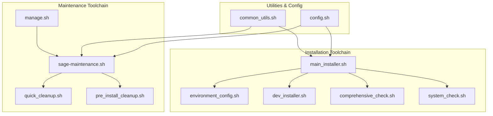
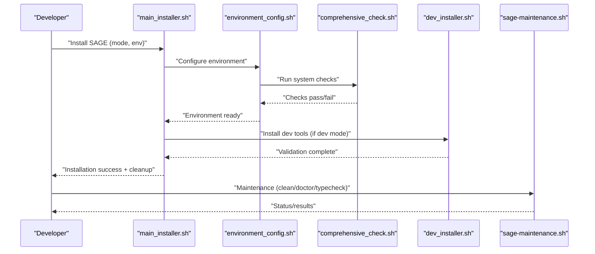
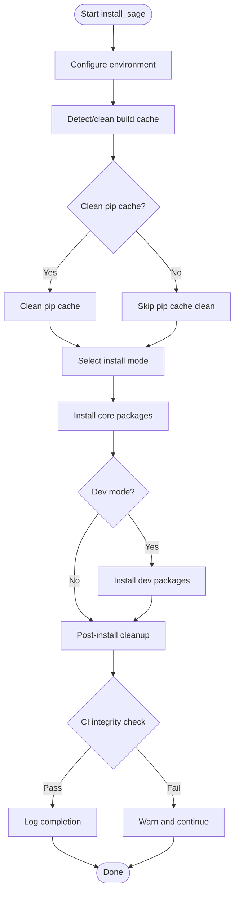
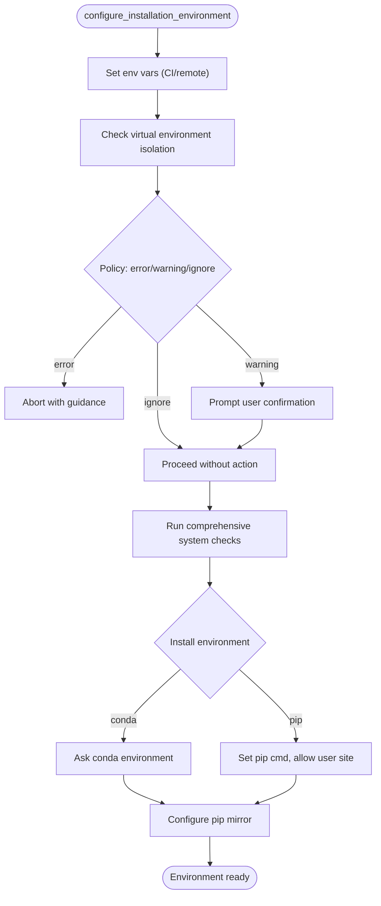
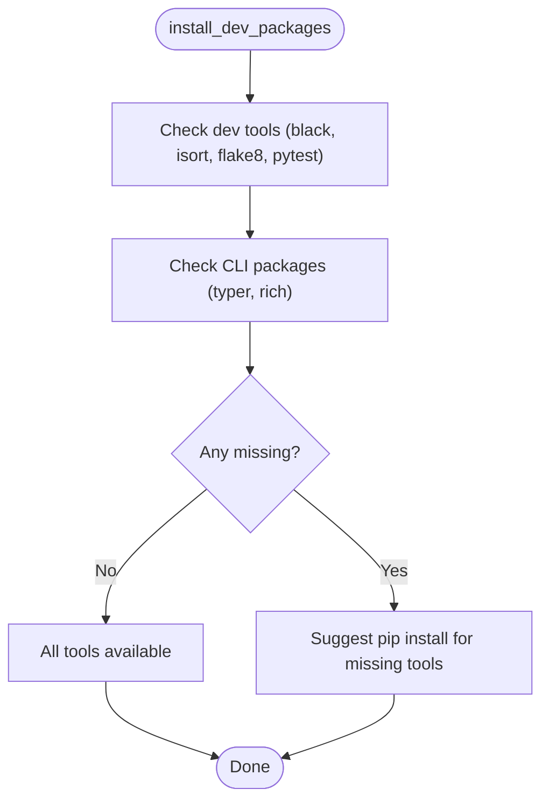
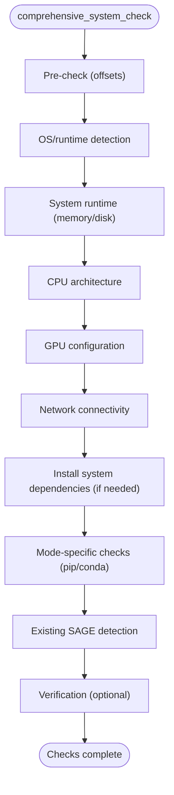
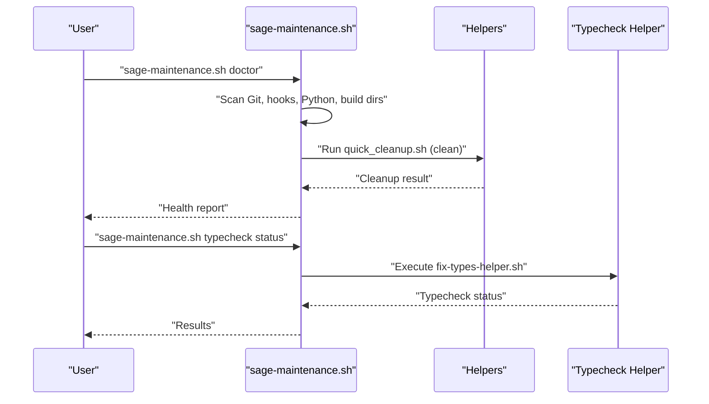
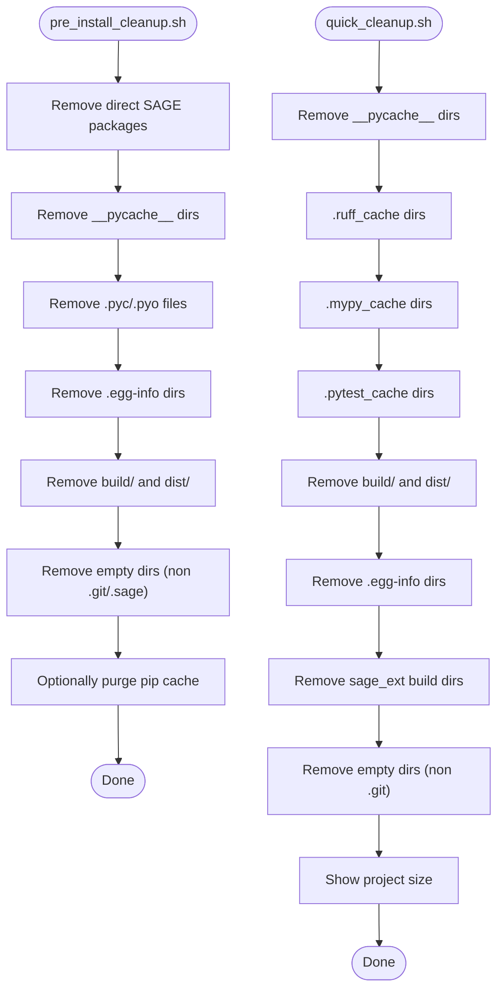
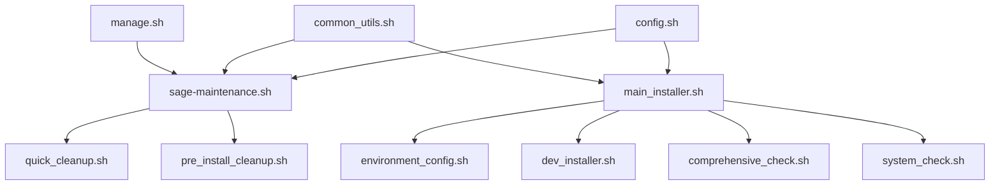

# Development Tools

<cite>
**Referenced Files in This Document**
- [sage-maintenance.sh](file://tools/maintenance/sage-maintenance.sh)
- [manage.sh](file://manage.sh)
- [main_installer.sh](file://tools/install/installers/main_installer.sh)
- [dev_installer.sh](file://tools/install/installers/dev_installer.sh)
- [environment_config.sh](file://tools/install/installers/environment_config.sh)
- [common_utils.sh](file://tools/install/lib/common_utils.sh)
- [config.sh](file://tools/install/lib/config.sh)
- [pre_install_cleanup.sh](file://tools/maintenance/helpers/pre_install_cleanup.sh)
- [quick_cleanup.sh](file://tools/maintenance/helpers/quick_cleanup.sh)
- [comprehensive_check.sh](file://tools/install/checks/comprehensive_check.sh)
- [system_check.sh](file://tools/install/checks/system_check.sh)
</cite>

## Table of Contents
1. [Introduction](#introduction)
2. [Project Structure](#project-structure)
3. [Core Components](#core-components)
4. [Architecture Overview](#architecture-overview)
5. [Detailed Component Analysis](#detailed-component-analysis)
6. [Dependency Analysis](#dependency-analysis)
7. [Performance Considerations](#performance-considerations)
8. [Troubleshooting Guide](#troubleshooting-guide)
9. [Conclusion](#conclusion)
10. [Appendices](#appendices)

## Introduction
This Development Tools section documents SAGE’s comprehensive toolkit for development environment setup, installation management, maintenance, and workflow automation. It covers:
- Installation scripts orchestrating environment checks, dependency resolution, and package installation across modes (standard, full, dev).
- Maintenance utilities for cleaning, diagnostics, security checks, and Git hooks management.
- Project management scripts and helpers enabling reproducible setups and troubleshooting.
- Build automation entry points and developer workflow optimization.

The goal is to provide both beginner-friendly guidance and advanced technical details for contributors and maintainers.

## Project Structure
The development tools are organized into three primary areas:
- Installation toolchain: installers, environment configuration, checks, and fixes.
- Maintenance toolchain: unified maintenance CLI, helpers, and Git hooks management.
- Utilities and configuration: common utilities, logging, and project-wide settings.

**Diagram sources**
- [main_installer.sh:1-421](file://tools/install/installers/main_installer.sh#L1-L421)
- [environment_config.sh:1-653](file://tools/install/installers/environment_config.sh#L1-L653)
- [dev_installer.sh:1-109](file://tools/install/installers/dev_installer.sh#L1-L109)
- [comprehensive_check.sh:1-656](file://tools/install/checks/comprehensive_check.sh#L1-L656)
- [system_check.sh:1-55](file://tools/install/checks/system_check.sh#L1-L55)
- [sage-maintenance.sh:1-380](file://tools/maintenance/sage-maintenance.sh#L1-L380)
- [manage.sh:1-50](file://manage.sh#L1-L50)
- [quick_cleanup.sh:1-105](file://tools/maintenance/helpers/quick_cleanup.sh#L1-L105)
- [pre_install_cleanup.sh:1-124](file://tools/maintenance/helpers/pre_install_cleanup.sh#L1-L124)
- [common_utils.sh:1-228](file://tools/install/lib/common_utils.sh#L1-L228)
- [config.sh:1-25](file://tools/install/lib/config.sh#L1-L25)

**Section sources**
- [main_installer.sh:1-421](file://tools/install/installers/main_installer.sh#L1-L421)
- [sage-maintenance.sh:1-380](file://tools/maintenance/sage-maintenance.sh#L1-L380)
- [manage.sh:1-50](file://manage.sh#L1-L50)

## Core Components
- Installation orchestration: main installer coordinates environment configuration, cache management, mode-specific installs, and post-install cleanup.
- Environment configuration: intelligent mirror selection, virtual environment isolation policy, and CI/remote deployment handling.
- Developer tool installation: validation of dev tool availability and guidance for missing tools.
- Comprehensive environment checks: OS/runtime detection, GPU presence, network connectivity, and existing SAGE state.
- Maintenance CLI: unified entry for cleaning, deep cleaning, security checks, Git hooks setup, health checks, and type checking helpers.
- Project helpers: pre-install cleanup and quick cleanup for reproducible environments.

Practical examples:
- Clean installation: run the installer in a fresh environment with environment checks enabled.
- Environment verification: use the verification steps after installation to confirm core modules load.
- Troubleshooting: use the maintenance doctor and typecheck helpers to diagnose issues.
- Workflow optimization: leverage the maintenance CLI for recurring cleanup and Git hooks setup.

**Section sources**
- [main_installer.sh:190-421](file://tools/install/installers/main_installer.sh#L190-L421)
- [environment_config.sh:583-653](file://tools/install/installers/environment_config.sh#L583-L653)
- [dev_installer.sh:33-109](file://tools/install/installers/dev_installer.sh#L33-L109)
- [comprehensive_check.sh:287-368](file://tools/install/checks/comprehensive_check.sh#L287-L368)
- [sage-maintenance.sh:42-380](file://tools/maintenance/sage-maintenance.sh#L42-L380)
- [pre_install_cleanup.sh:1-124](file://tools/maintenance/helpers/pre_install_cleanup.sh#L1-L124)
- [quick_cleanup.sh:1-105](file://tools/maintenance/helpers/quick_cleanup.sh#L1-L105)

## Architecture Overview
The system integrates installation and maintenance through a layered design:
- Entry points: main installer and maintenance CLI.
- Configuration and checks: environment configuration and comprehensive checks.
- Execution: package installation, dev tool validation, and post-install cleanup.
- Maintenance: centralized maintenance commands and helper scripts.

**Diagram sources**
- [main_installer.sh:190-421](file://tools/install/installers/main_installer.sh#L190-L421)
- [environment_config.sh:583-653](file://tools/install/installers/environment_config.sh#L583-L653)
- [comprehensive_check.sh:287-368](file://tools/install/checks/comprehensive_check.sh#L287-L368)
- [dev_installer.sh:33-109](file://tools/install/installers/dev_installer.sh#L33-L109)
- [sage-maintenance.sh:268-380](file://tools/maintenance/sage-maintenance.sh#L268-L380)

## Detailed Component Analysis

### Installation Orchestration (main_installer.sh)
Responsibilities:
- Parse installation mode (standard, full, dev) and environment (conda, pip).
- Configure environment, detect and clean stale caches, optionally clean pip cache.
- Install core packages per mode and validate dev tool availability.
- Post-install cleanup via project-specific tool or fallback script.
- CI/CD safety checks to prevent unintended local-to-PyPI downloads.
- Track installed packages and log outcomes.

Key flows:
- Mode selection and core install.
- Dev tool validation.
- Cleanup and CI integrity checks.

**Diagram sources**
- [main_installer.sh:190-421](file://tools/install/installers/main_installer.sh#L190-L421)

**Section sources**
- [main_installer.sh:190-421](file://tools/install/installers/main_installer.sh#L190-L421)

### Environment Configuration (environment_config.sh)
Responsibilities:
- Detect and configure pip mirrors with health checks and fallback chains.
- Enforce virtual environment policy (prefer conda; warn/abort on unsupported venv).
- Configure environment variables for CI/remote deployments.
- Provide mirror selection logic for auto, disable, or custom sources.

Key flows:
- Mirror selection and fallback chain construction.
- Virtual environment isolation enforcement.
- CI/remote deployment handling.

**Diagram sources**
- [environment_config.sh:583-653](file://tools/install/installers/environment_config.sh#L583-L653)

**Section sources**
- [environment_config.sh:273-440](file://tools/install/installers/environment_config.sh#L273-L440)
- [environment_config.sh:442-581](file://tools/install/installers/environment_config.sh#L442-L581)

### Developer Tool Installation (dev_installer.sh)
Responsibilities:
- Validate availability of key development tools and CLI packages.
- Provide guidance for installing missing tools.
- Note that C++ extension installation is handled in the standard install flow.

Key flows:
- Tool availability checks.
- Package import checks.
- Reporting and remediation suggestions.

**Diagram sources**
- [dev_installer.sh:33-109](file://tools/install/installers/dev_installer.sh#L33-L109)

**Section sources**
- [dev_installer.sh:33-109](file://tools/install/installers/dev_installer.sh#L33-L109)

### Comprehensive Environment Checks (comprehensive_check.sh)
Responsibilities:
- Pre-check for output formatting and offsets.
- OS/runtime detection and recommendations.
- Disk space and memory checks with warnings and optional user confirmation.
- CPU architecture compatibility checks.
- GPU presence checks and guidance.
- Network connectivity checks with mirror hints.
- System dependency installation helper.
- Mode-specific checks (pip vs conda).
- Existing SAGE detection and auto-uninstall logic in CI/auto-confirm contexts.
- Installation verification routine.

Key flows:
- Pre-check and environment detection.
- Runtime and hardware checks.
- Network and dependency checks.
- Mode-specific readiness.
- Existing installation detection and remediation.
- Verification after installation.

**Diagram sources**
- [comprehensive_check.sh:287-368](file://tools/install/checks/comprehensive_check.sh#L287-L368)

**Section sources**
- [comprehensive_check.sh:287-368](file://tools/install/checks/comprehensive_check.sh#L287-L368)
- [comprehensive_check.sh:597-656](file://tools/install/checks/comprehensive_check.sh#L597-L656)

### Maintenance CLI (sage-maintenance.sh)
Responsibilities:
- Unified entry point for maintenance tasks.
- Commands: clean, clean-deep, security-check, setup-hooks, doctor, status, typecheck subcommands.
- Colorful UI with emojis and structured output.
- Helper integration for cleanup, security, and Git hooks.

Key flows:
- Command parsing and dispatch.
- Doctor workflow scanning Git, hooks, Python, and build artifacts.
- Typecheck helpers delegated to fix-types-helper.sh.

**Diagram sources**
- [sage-maintenance.sh:166-236](file://tools/maintenance/sage-maintenance.sh#L166-L236)
- [sage-maintenance.sh:337-362](file://tools/maintenance/sage-maintenance.sh#L337-L362)

**Section sources**
- [sage-maintenance.sh:42-380](file://tools/maintenance/sage-maintenance.sh#L42-L380)

### Project Helpers
- Pre-install cleanup: removes historical direct SAGE packages, clears Python caches, eggs, build/dist, and optionally purges pip cache.
- Quick cleanup: cleans Python caches, mypy/ruff/pytest caches, build/dist, egg-info, submodule builds, and empty directories.

**Diagram sources**
- [pre_install_cleanup.sh:27-124](file://tools/maintenance/helpers/pre_install_cleanup.sh#L27-L124)
- [quick_cleanup.sh:13-105](file://tools/maintenance/helpers/quick_cleanup.sh#L13-L105)

**Section sources**
- [pre_install_cleanup.sh:1-124](file://tools/maintenance/helpers/pre_install_cleanup.sh#L1-L124)
- [quick_cleanup.sh:1-105](file://tools/maintenance/helpers/quick_cleanup.sh#L1-L105)

### Utilities and Configuration
- Common utilities: command checks, project root detection, environment setup, safe directory change, backups, disk/network checks, and usage helpers.
- Configuration: logging flags, conda defaults, project paths, timeouts, mirror URL, skip dependency checks, and force reinstall toggles.

**Section sources**
- [common_utils.sh:1-228](file://tools/install/lib/common_utils.sh#L1-L228)
- [config.sh:1-25](file://tools/install/lib/config.sh#L1-L25)

## Dependency Analysis
High-level dependencies among major components:

**Diagram sources**
- [main_installer.sh:5-18](file://tools/install/installers/main_installer.sh#L5-L18)
- [environment_config.sh:8-9](file://tools/install/installers/environment_config.sh#L8-L9)
- [dev_installer.sh:6-9](file://tools/install/installers/dev_installer.sh#L6-L9)
- [comprehensive_check.sh:6-8](file://tools/install/checks/comprehensive_check.sh#L6-L8)
- [system_check.sh:5-6](file://tools/install/checks/system_check.sh#L5-L6)
- [sage-maintenance.sh:35-37](file://tools/maintenance/sage-maintenance.sh#L35-L37)
- [manage.sh:7-8](file://manage.sh#L7-L8)
- [common_utils.sh:6-8](file://tools/install/lib/common_utils.sh#L6-L8)
- [config.sh:1-25](file://tools/install/lib/config.sh#L1-L25)

**Section sources**
- [main_installer.sh:5-18](file://tools/install/installers/main_installer.sh#L5-L18)
- [sage-maintenance.sh:35-37](file://tools/maintenance/sage-maintenance.sh#L35-L37)
- [manage.sh:7-8](file://manage.sh#L7-L8)

## Performance Considerations
- Mirror selection and fallback chains reduce download failures and improve reliability in varied network conditions.
- Conditional pip cache cleanup avoids unnecessary overhead in CI environments.
- Quick cleanup minimizes filesystem clutter and speeds up subsequent runs.
- CI integrity checks prevent misconfiguration that could cause expensive re-downloads or inconsistent builds.

[No sources needed since this section provides general guidance]

## Troubleshooting Guide
Common scenarios and remedies:
- Installation fails due to insufficient disk space: address warnings during comprehensive checks and free space before retrying.
- Network connectivity issues: use mirror hints from environment configuration or switch to official PyPI in restricted environments.
- Existing SAGE detected: in CI/auto-confirm contexts, automatic uninstall proceeds; otherwise, remove manually to avoid conflicts.
- Dev tools missing: install suggested tools reported by dev installer validation.
- Maintenance diagnostics: run the doctor command to scan Git, hooks, Python, and build artifacts; use typecheck helpers for incremental type hygiene.
- Pre-install cleanup: run the pre-install cleanup script to remove historical direct SAGE packages and stale caches prior to new installs.

**Section sources**
- [comprehensive_check.sh:140-161](file://tools/install/checks/comprehensive_check.sh#L140-L161)
- [environment_config.sh:273-440](file://tools/install/installers/environment_config.sh#L273-L440)
- [comprehensive_check.sh:449-533](file://tools/install/checks/comprehensive_check.sh#L449-L533)
- [dev_installer.sh:46-95](file://tools/install/installers/dev_installer.sh#L46-L95)
- [sage-maintenance.sh:166-236](file://tools/maintenance/sage-maintenance.sh#L166-L236)
- [pre_install_cleanup.sh:27-53](file://tools/maintenance/helpers/pre_install_cleanup.sh#L27-L53)

## Conclusion
SAGE’s Development Tools provide a robust, automated, and maintainable workflow for setting up, verifying, and maintaining development environments. The installation orchestrator ensures reliable environment configuration and package installation across modes, while the maintenance CLI offers a unified interface for diagnostics, cleanup, and Git hooks management. Together with project helpers and comprehensive checks, contributors can achieve reproducible setups, efficient troubleshooting, and optimized developer workflows.

[No sources needed since this section summarizes without analyzing specific files]

## Appendices

### Practical Examples
- Clean installation:
  - Prepare environment: run pre-install cleanup to remove stale packages and caches.
  - Install: choose mode (standard/full/dev) and environment (conda/pip), then run the main installer.
  - Verify: use the verification routine to confirm core modules load.
- Environment verification:
  - After installation, run the verification step to ensure all core modules are importable.
- Troubleshooting workflows:
  - Use the maintenance doctor to scan for potential issues.
  - Apply quick or deep cleanup depending on scope.
  - Re-run environment checks to confirm readiness.
- Development environment setup:
  - Use the maintenance CLI to set up Git hooks and keep the environment tidy.
  - Leverage dev installer validation to ensure all development tools are available.

[No sources needed since this section provides general guidance]