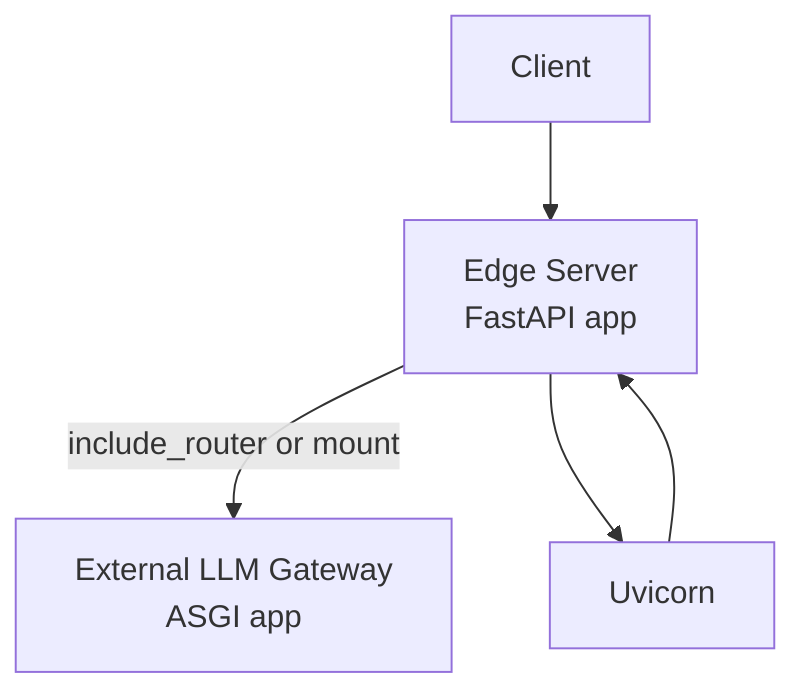
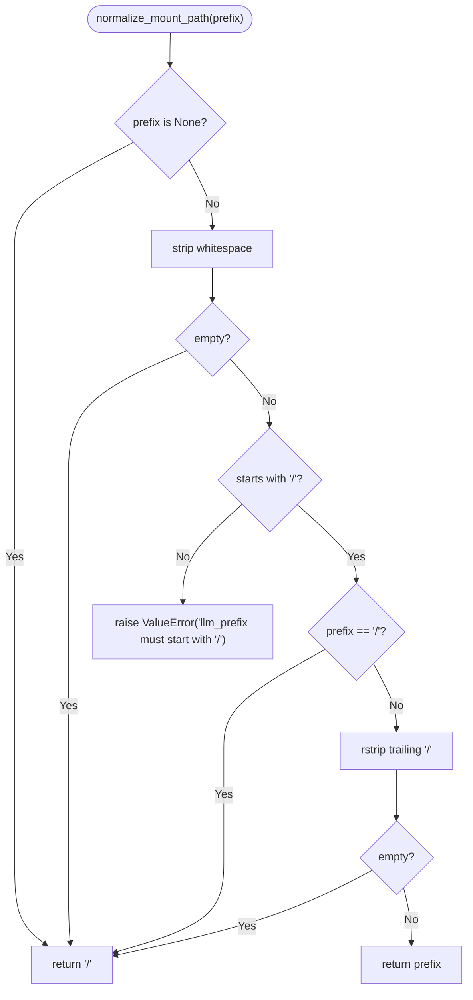
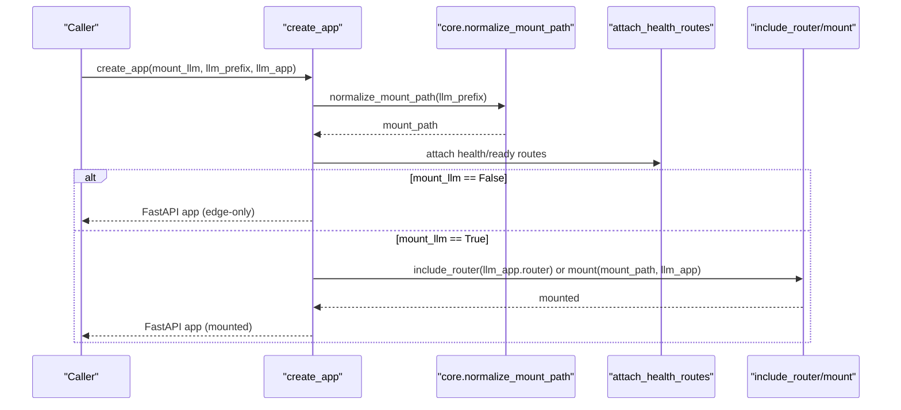
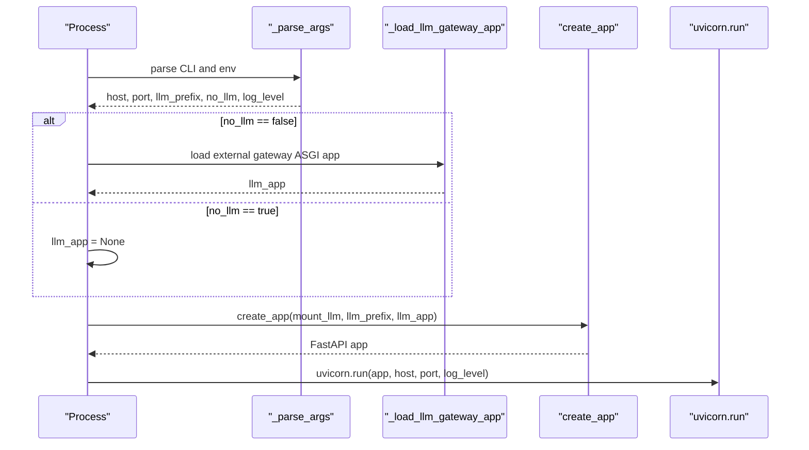
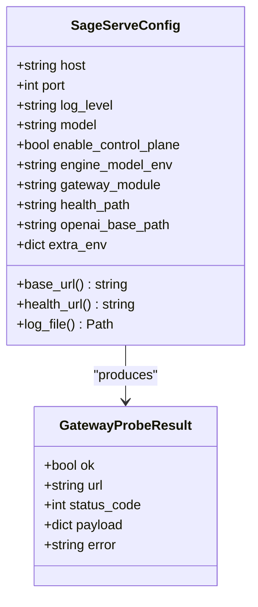
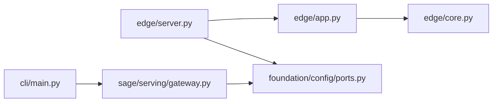
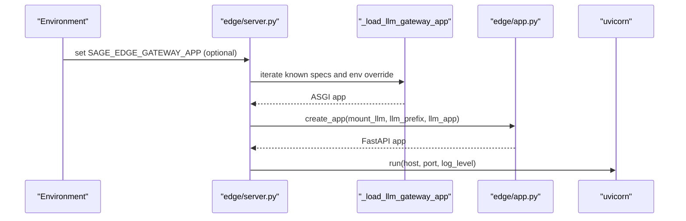

# Edge Server

<cite>
**Referenced Files in This Document**
- [src/sage/edge/__init__.py](file://src/sage/edge/__init__.py)
- [src/sage/edge/_version.py](file://src/sage/edge/_version.py)
- [src/sage/edge/core.py](file://src/sage/edge/core.py)
- [src/sage/edge/app.py](file://src/sage/edge/app.py)
- [src/sage/edge/server.py](file://src/sage/edge/server.py)
- [src/sage/serving/gateway.py](file://src/sage/serving/gateway.py)
- [src/sage/foundation/config/ports.py](file://src/sage/foundation/config/ports.py)
- [src/sage/cli/main.py](file://src/sage/cli/main.py)
- [src/tests/test_edge_app.py](file://src/tests/test_edge_app.py)
- [src/tests/test_edge_server.py](file://src/tests/test_edge_server.py)
- [src/tests/test_edge_core.py](file://src/tests/test_edge_core.py)
</cite>

## Table of Contents
1. [Introduction](#introduction)
2. [Project Structure](#project-structure)
3. [Core Components](#core-components)
4. [Architecture Overview](#architecture-overview)
5. [Detailed Component Analysis](#detailed-component-analysis)
6. [Dependency Analysis](#dependency-analysis)
7. [Performance Considerations](#performance-considerations)
8. [Security Considerations](#security-considerations)
9. [Deployment Scenarios](#deployment-scenarios)
10. [Integration Patterns](#integration-patterns)
11. [Troubleshooting Guide](#troubleshooting-guide)
12. [Conclusion](#conclusion)
13. [Appendices](#appendices)

## Introduction
The Edge Server is an optional in-tree edge aggregation service that provides HTTP server capabilities for integrating external LLM gateway implementations into SAGE. It acts as a thin HTTP edge shell that mounts an external ASGI gateway application (such as an OpenAI-compatible LLM gateway) under a configurable path prefix, exposing health and readiness probes for observability. The underlying inference engine remains external, preserving SAGE’s modular serving architecture.

Key goals:
- Provide a minimal HTTP surface for mounting external LLM gateways.
- Support flexible path prefixes to coexist with other services.
- Expose standardized health and readiness endpoints.
- Enable environment-driven configuration and easy deployment.

## Project Structure
The Edge Server spans a small set of focused modules:
- Version and package metadata
- Core helpers for path normalization and probe payloads
- FastAPI application factory for building the edge shell
- Uvicorn entrypoint that loads an external gateway ASGI app and runs the HTTP server
- Serving integration utilities for external gateway discovery and probing
- CLI integration for status and diagnostics

```mermaid
graph TB
subgraph "Edge Surface"
V["edge/_version.py"]
I["edge/__init__.py"]
C["edge/core.py"]
A["edge/app.py"]
S["edge/server.py"]
end
subgraph "Serving Integration"
SG["sage/serving/gateway.py"]
P["foundation/config/ports.py"]
end
subgraph "CLI"
CLI["cli/main.py"]
end
I --> V
A --> C
S --> A
S --> P
CLI --> SG
SG --> P
```

**Diagram sources**
- [src/sage/edge/server.py:1-108](file://src/sage/edge/server.py#L1-L108)
- [src/sage/edge/app.py:1-66](file://src/sage/edge/app.py#L1-L66)
- [src/sage/edge/core.py:1-35](file://src/sage/edge/core.py#L1-L35)
- [src/sage/serving/gateway.py:1-168](file://src/sage/serving/gateway.py#L1-L168)
- [src/sage/foundation/config/ports.py:1-199](file://src/sage/foundation/config/ports.py#L1-L199)
- [src/sage/cli/main.py:1-204](file://src/sage/cli/main.py#L1-L204)

**Section sources**
- [src/sage/edge/__init__.py:1-10](file://src/sage/edge/__init__.py#L1-L10)
- [src/sage/edge/_version.py:1-6](file://src/sage/edge/_version.py#L1-L6)
- [src/sage/edge/core.py:1-35](file://src/sage/edge/core.py#L1-L35)
- [src/sage/edge/app.py:1-66](file://src/sage/edge/app.py#L1-L66)
- [src/sage/edge/server.py:1-108](file://src/sage/edge/server.py#L1-L108)
- [src/sage/serving/gateway.py:1-168](file://src/sage/serving/gateway.py#L1-L168)
- [src/sage/foundation/config/ports.py:1-199](file://src/sage/foundation/config/ports.py#L1-L199)
- [src/sage/cli/main.py:1-204](file://src/sage/cli/main.py#L1-L204)

## Core Components
- Version and package identity: The edge package exposes its version via the in-tree version module, inheriting from the top-level package version.
- Core helpers:
  - Path normalization ensures a canonical mount path for the gateway (root or prefixed).
  - Probe payload standardizes health/ready responses with service identity and mount configuration.
- Application factory:
  - Creates a FastAPI app with health and readiness endpoints.
  - Optionally mounts an external gateway ASGI app at root or a custom prefix.
- Server entrypoint:
  - Parses CLI and environment-driven arguments.
  - Loads an external gateway ASGI app from known entrypoints.
  - Runs the FastAPI app with Uvicorn on a configurable host/port.

**Section sources**
- [src/sage/edge/_version.py:1-6](file://src/sage/edge/_version.py#L1-L6)
- [src/sage/edge/core.py:1-35](file://src/sage/edge/core.py#L1-L35)
- [src/sage/edge/app.py:1-66](file://src/sage/edge/app.py#L1-L66)
- [src/sage/edge/server.py:1-108](file://src/sage/edge/server.py#L1-L108)

## Architecture Overview
The Edge Server sits at the HTTP boundary of SAGE, forwarding requests to an external LLM gateway while providing its own health endpoints. It supports two modes:
- Gateway-mounted mode: The external gateway ASGI app is included or mounted under a path prefix.
- Edge-only mode: The server runs without mounting a gateway, exposing only health/ready endpoints.



**Diagram sources**
- [src/sage/edge/app.py:39-66](file://src/sage/edge/app.py#L39-L66)
- [src/sage/edge/server.py:84-103](file://src/sage/edge/server.py#L84-L103)

## Detailed Component Analysis

### Edge Core Helpers
Responsibilities:
- Normalize and validate mount path prefixes.
- Build standardized probe payloads for health and readiness.



**Diagram sources**
- [src/sage/edge/core.py:8-24](file://src/sage/edge/core.py#L8-L24)

**Section sources**
- [src/sage/edge/core.py:1-35](file://src/sage/edge/core.py#L1-L35)

### Edge Application Factory
Responsibilities:
- Validate environment availability for FastAPI.
- Attach health and readiness endpoints.
- Mount an external gateway ASGI app at root or a custom prefix.
- Store the effective mount path in app state for downstream use.



**Diagram sources**
- [src/sage/edge/app.py:13-66](file://src/sage/edge/app.py#L13-L66)
- [src/sage/edge/core.py:8-24](file://src/sage/edge/core.py#L8-L24)

**Section sources**
- [src/sage/edge/app.py:1-66](file://src/sage/edge/app.py#L1-L66)

### Edge Server Entrypoint
Responsibilities:
- Parse CLI and environment variables for host, port, prefix, and logging level.
- Discover and load an external gateway ASGI app from known entrypoints.
- Construct the FastAPI app and run it with Uvicorn.



**Diagram sources**
- [src/sage/edge/server.py:52-103](file://src/sage/edge/server.py#L52-L103)

**Section sources**
- [src/sage/edge/server.py:1-108](file://src/sage/edge/server.py#L1-L108)

### Serving Integration Utilities
Responsibilities:
- Define configuration for external gateway integration (host, port, base paths, environment).
- Build command and environment for launching the external gateway.
- Probe the external gateway health endpoint and interpret results.



**Diagram sources**
- [src/sage/serving/gateway.py:16-168](file://src/sage/serving/gateway.py#L16-L168)

**Section sources**
- [src/sage/serving/gateway.py:1-168](file://src/sage/serving/gateway.py#L1-L168)

## Dependency Analysis
- Internal dependencies:
  - edge/server depends on edge/app and foundation/config/ports.
  - edge/app depends on edge/core and FastAPI.
  - edge/__init__ re-exports version from edge/_version.
- External dependencies:
  - FastAPI and Uvicorn are required for the edge server runtime.
  - The external gateway ASGI app is loaded dynamically at runtime.
- CLI integration:
  - The main CLI provides status and diagnostics that complement edge server operations.



**Diagram sources**
- [src/sage/edge/server.py:1-11](file://src/sage/edge/server.py#L1-L11)
- [src/sage/edge/app.py:1-10](file://src/sage/edge/app.py#L1-L10)
- [src/sage/edge/core.py:1-5](file://src/sage/edge/core.py#L1-L5)
- [src/sage/cli/main.py:15-20](file://src/sage/cli/main.py#L15-L20)
- [src/sage/serving/gateway.py:13-13](file://src/sage/serving/gateway.py#L13-L13)

**Section sources**
- [src/sage/edge/server.py:1-11](file://src/sage/edge/server.py#L1-L11)
- [src/sage/edge/app.py:1-10](file://src/sage/edge/app.py#L1-L10)
- [src/sage/edge/core.py:1-5](file://src/sage/edge/core.py#L1-L5)
- [src/sage/cli/main.py:15-20](file://src/sage/cli/main.py#L15-L20)
- [src/sage/serving/gateway.py:13-13](file://src/sage/serving/gateway.py#L13-L13)

## Performance Considerations
- Minimize overhead: The edge server is a thin HTTP proxy; keep middleware and custom routes to a minimum.
- Mount path selection: Using a non-root prefix allows coexistence with other services on the same host/port.
- Logging level: Tune the Uvicorn log level to balance observability and throughput.
- Port selection: Prefer recommended ports from SagePorts to avoid conflicts and improve tooling compatibility.

[No sources needed since this section provides general guidance]

## Security Considerations
- Network exposure: Bind to trusted interfaces (e.g., localhost or private networks) and expose only through secure reverse proxies or VPNs when needed.
- Authentication and authorization: Place the edge server behind an authenticating gateway or sidecar proxy; do not rely solely on path prefixes for security.
- TLS termination: Terminate TLS at a reverse proxy or ingress controller; avoid handling TLS within the edge server.
- Environment variables: Avoid leaking sensitive configuration via logs; sanitize logs and environment variable usage.

[No sources needed since this section provides general guidance]

## Deployment Scenarios
- Standalone edge server with gateway mounted:
  - Configure host, port, and optional llm_prefix.
  - Ensure the external gateway ASGI app is importable.
  - Run the edge server; it will mount the gateway under the specified prefix.
- Edge-only server (no gateway):
  - Start with --no-llm to disable gateway mounting.
  - Use health/ready endpoints for monitoring and orchestration.
- Coexisting services:
  - Use a non-root llm_prefix to mount the gateway alongside other services on the same host/port.
- Containerized deployments:
  - Set SAGE_EDGE_HOST, SAGE_EDGE_PORT, SAGE_EDGE_LLM_PREFIX, and SAGE_EDGE_LOG_LEVEL via environment variables.
  - Choose a non-root llm_prefix to integrate with reverse proxies.

[No sources needed since this section provides general guidance]

## Integration Patterns
- External gateway mounting:
  - The edge server attempts to load an external gateway ASGI app from known entrypoints.
  - Supports overriding the default entrypoint via an environment variable.
- OpenAI-compatible base path:
  - The serving integration utilities define a standard OpenAI-compatible base path for external gateways.
- Health and readiness:
  - The edge server exposes standardized endpoints for health and readiness, reporting mount configuration and gateway presence.



**Diagram sources**
- [src/sage/edge/server.py:20-49](file://src/sage/edge/server.py#L20-L49)
- [src/sage/edge/app.py:39-66](file://src/sage/edge/app.py#L39-L66)

**Section sources**
- [src/sage/edge/server.py:13-49](file://src/sage/edge/server.py#L13-L49)
- [src/sage/serving/gateway.py:73-91](file://src/sage/serving/gateway.py#L73-L91)

## Troubleshooting Guide
Common issues and resolutions:
- Missing FastAPI or Uvicorn:
  - The edge server enforces runtime availability of FastAPI and Uvicorn; install the required extras to satisfy dependencies.
- Invalid mount prefix:
  - The mount path must start with "/"; otherwise, a validation error is raised.
- Gateway app not found:
  - The server tries known entrypoints and an environment override; ensure the module and attribute exist.
- Health/ready mismatches:
  - Verify llm_mounted and llm_prefix in probe payloads align with expectations.

Validation references:
- Edge app tests cover health endpoints, mounting at root and custom prefixes, invalid prefix handling, and missing gateway app injection.
- Edge server tests cover argument parsing, no-llm mode, gateway loading behavior, and environment overrides.
- Edge core tests cover path normalization and probe payload construction.

**Section sources**
- [src/sage/edge/app.py:13-20](file://src/sage/edge/app.py#L13-L20)
- [src/sage/edge/server.py:92-96](file://src/sage/edge/server.py#L92-L96)
- [src/tests/test_edge_app.py:21-57](file://src/tests/test_edge_app.py#L21-L57)
- [src/tests/test_edge_server.py:22-108](file://src/tests/test_edge_server.py#L22-L108)
- [src/tests/test_edge_core.py:8-26](file://src/tests/test_edge_core.py#L8-L26)

## Conclusion
The Edge Server provides a lightweight, configurable HTTP surface for mounting external LLM gateways within SAGE. It preserves modularity by delegating inference to external engines while offering essential operational capabilities such as health/ready probes and flexible path mounting. Combined with serving integration utilities and CLI diagnostics, it enables robust deployment and monitoring in diverse environments.

[No sources needed since this section summarizes without analyzing specific files]

## Appendices

### Practical Examples

- Start the edge server with a mounted gateway:
  - Configure host, port, and optional llm_prefix.
  - Ensure the external gateway ASGI app is importable.
  - Run the edge server; it will mount the gateway under the specified prefix.

- Start the edge server without mounting a gateway:
  - Use the no-llm flag to run edge-only mode.
  - Monitor health and readiness endpoints for orchestration.

- Override the gateway entrypoint:
  - Set the environment variable for the gateway app specification.
  - The server will attempt the override first, then fall back to defaults.

- Use the CLI for diagnostics:
  - Query gateway status and probe health endpoints via the CLI.
  - Inspect recommended ports and availability using port utilities.

**Section sources**
- [src/sage/edge/server.py:52-81](file://src/sage/edge/server.py#L52-L81)
- [src/sage/edge/server.py:20-24](file://src/sage/edge/server.py#L20-L24)
- [src/sage/cli/main.py:127-153](file://src/sage/cli/main.py#L127-L153)
- [src/sage/foundation/config/ports.py:131-188](file://src/sage/foundation/config/ports.py#L131-L188)