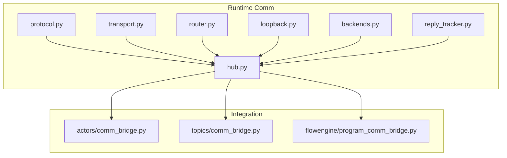
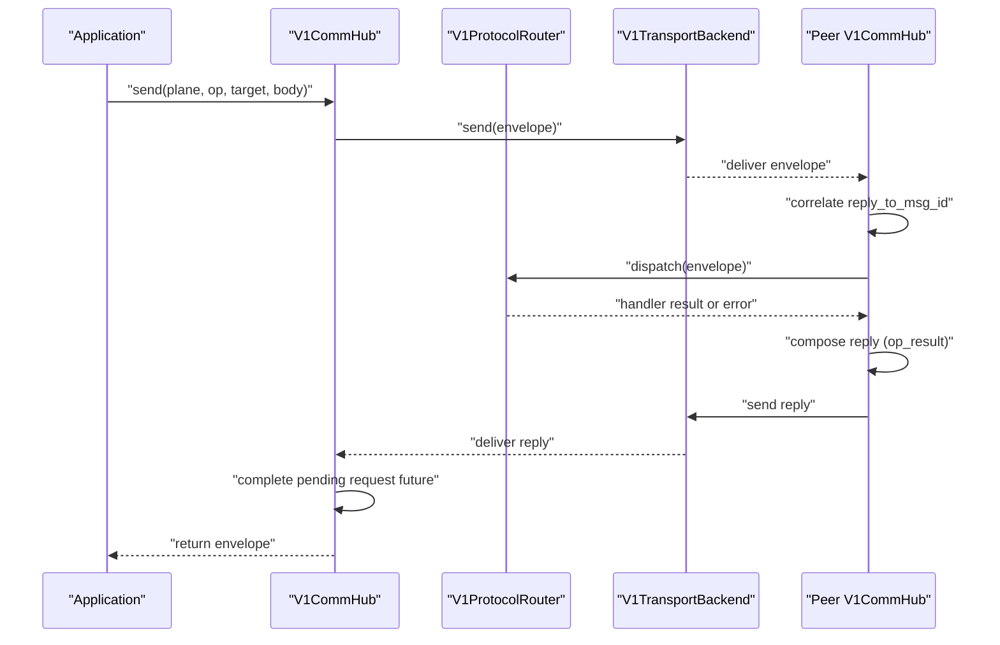
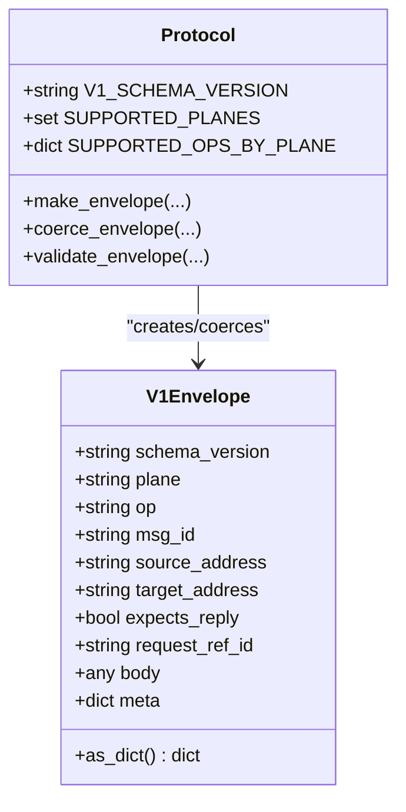
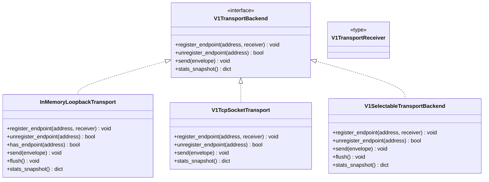
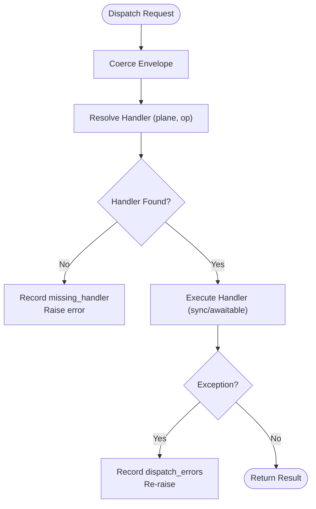
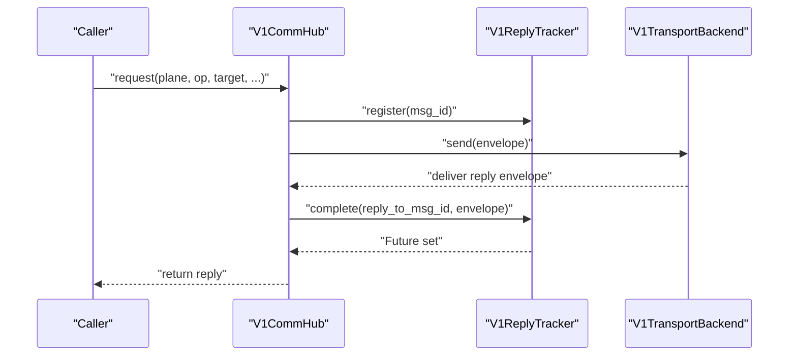
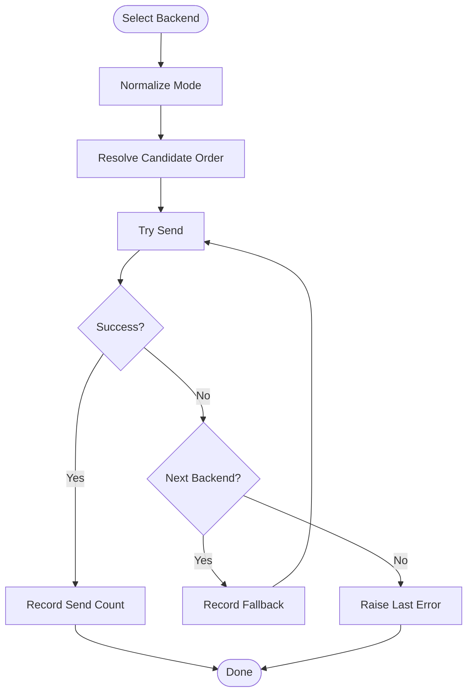
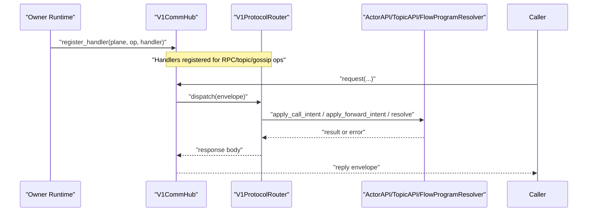
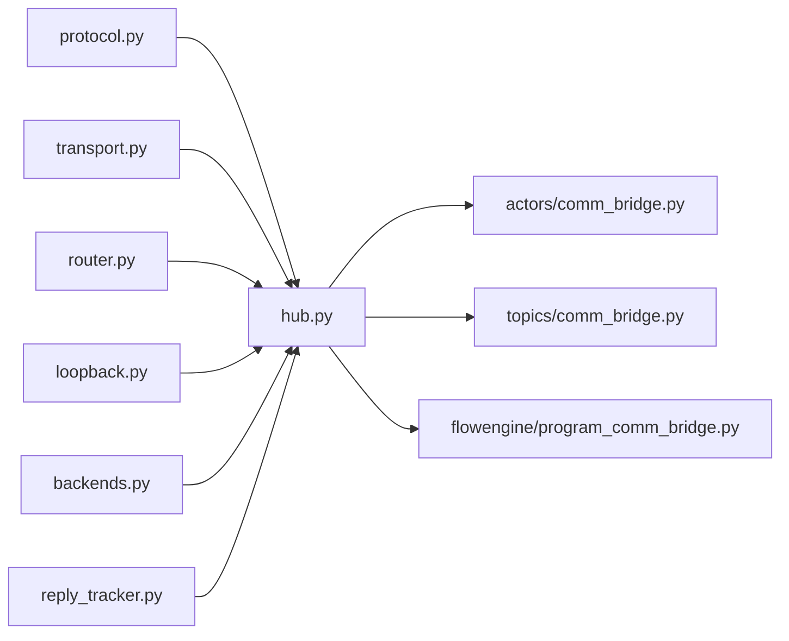

# Communication Infrastructure

<cite>
**Referenced Files in This Document**
- [__init__.py](file://src/sage/runtime/flownet/runtime/comm/__init__.py)
- [protocol.py](file://src/sage/runtime/flownet/runtime/comm/protocol.py)
- [transport.py](file://src/sage/runtime/flownet/runtime/comm/transport.py)
- [router.py](file://src/sage/runtime/flownet/runtime/comm/router.py)
- [hub.py](file://src/sage/runtime/flownet/runtime/comm/hub.py)
- [loopback.py](file://src/sage/runtime/flownet/runtime/comm/loopback.py)
- [backends.py](file://src/sage/runtime/flownet/runtime/comm/backends.py)
- [reply_tracker.py](file://src/sage/runtime/flownet/runtime/comm/reply_tracker.py)
- [actors/comm_bridge.py](file://src/sage/runtime/flownet/runtime/actors/comm_bridge.py)
- [topics/comm_bridge.py](file://src/sage/runtime/flownet/runtime/topics/comm_bridge.py)
- [flowengine/program_comm_bridge.py](file://src/sage/runtime/flownet/runtime/flowengine/program_comm_bridge.py)
</cite>

## Table of Contents
1. [Introduction](#introduction)
2. [Project Structure](#project-structure)
3. [Core Components](#core-components)
4. [Architecture Overview](#architecture-overview)
5. [Detailed Component Analysis](#detailed-component-analysis)
6. [Dependency Analysis](#dependency-analysis)
7. [Performance Considerations](#performance-considerations)
8. [Troubleshooting Guide](#troubleshooting-guide)
9. [Conclusion](#conclusion)
10. [Appendices](#appendices)

## Introduction
This document explains the Communication Infrastructure that powers low-level messaging and transport in FlowNet. It covers the protocol specification, transport backends, routing and dispatch, loopback communication, and reply tracking for asynchronous operations. It also documents the hub system that orchestrates actor-to-actor messaging, request-response patterns, and event broadcasting across network boundaries. Practical examples show how to implement custom backends, route messages, and debug communication issues. Finally, it addresses performance optimization, network partition handling, and security considerations for distributed communication.

## Project Structure
The communication subsystem resides under runtime/comm and integrates with higher-level runtime components for actors, topics, and flow programs.

**Diagram sources**
- [protocol.py:1-429](file://src/sage/runtime/flownet/runtime/comm/protocol.py#L1-L429)
- [transport.py:1-32](file://src/sage/runtime/flownet/runtime/comm/transport.py#L1-L32)
- [router.py:1-96](file://src/sage/runtime/flownet/runtime/comm/router.py#L1-L96)
- [hub.py:1-200](file://src/sage/runtime/flownet/runtime/comm/hub.py#L1-L200)
- [loopback.py:1-155](file://src/sage/runtime/flownet/runtime/comm/loopback.py#L1-L155)
- [backends.py:1-549](file://src/sage/runtime/flownet/runtime/comm/backends.py#L1-L549)
- [reply_tracker.py:1-118](file://src/sage/runtime/flownet/runtime/comm/reply_tracker.py#L1-L118)
- [actors/comm_bridge.py:1-88](file://src/sage/runtime/flownet/runtime/actors/comm_bridge.py#L1-L88)
- [topics/comm_bridge.py:1-157](file://src/sage/runtime/flownet/runtime/topics/comm_bridge.py#L1-L157)
- [flowengine/program_comm_bridge.py:1-199](file://src/sage/runtime/flownet/runtime/flowengine/program_comm_bridge.py#L1-L199)

**Section sources**
- [__init__.py:1-86](file://src/sage/runtime/flownet/runtime/comm/__init__.py#L1-L86)

## Core Components
- Protocol: Defines planes, operations, and the V1Envelope schema with validation and coercion.
- Transport: Provides a backend contract and receiver type for pluggable transports.
- Router: Dispatches envelopes by plane/op to registered handlers.
- Hub: Central orchestration for sending, request-reply, reply tracking, and reply-to correlation.
- Loopback: In-memory transport for local delivery and testing.
- Backends: Selectable transport backend with loopback and TCP, plus a selector and builder.
- Reply Tracker: Tracks pending request futures keyed by outbound msg_id for reply correlation.
- Bridges: Integration layers for actors, topics, and flow programs that register handlers and issue RPC calls.

**Section sources**
- [protocol.py:1-429](file://src/sage/runtime/flownet/runtime/comm/protocol.py#L1-L429)
- [transport.py:1-32](file://src/sage/runtime/flownet/runtime/comm/transport.py#L1-L32)
- [router.py:1-96](file://src/sage/runtime/flownet/runtime/comm/router.py#L1-L96)
- [hub.py:1-200](file://src/sage/runtime/flownet/runtime/comm/hub.py#L1-L200)
- [loopback.py:1-155](file://src/sage/runtime/flownet/runtime/comm/loopback.py#L1-L155)
- [backends.py:1-549](file://src/sage/runtime/flownet/runtime/comm/backends.py#L1-L549)
- [reply_tracker.py:1-118](file://src/sage/runtime/flownet/runtime/comm/reply_tracker.py#L1-L118)
- [actors/comm_bridge.py:1-88](file://src/sage/runtime/flownet/runtime/actors/comm_bridge.py#L1-L88)
- [topics/comm_bridge.py:1-157](file://src/sage/runtime/flownet/runtime/topics/comm_bridge.py#L1-L157)
- [flowengine/program_comm_bridge.py:1-199](file://src/sage/runtime/flownet/runtime/flowengine/program_comm_bridge.py#L1-L199)

## Architecture Overview
The V1CommHub coordinates message flow:
- Outbound: Applications prepare envelopes and call send or request on the hub.
- Routing: Envelopes are delivered to the transport backend(s).
- Inbound: The transport invokes the hub’s receiver, which correlates replies and dispatches to the router.
- Handlers: Plane/op-specific handlers produce responses when expected.

**Diagram sources**
- [hub.py:68-177](file://src/sage/runtime/flownet/runtime/comm/hub.py#L68-L177)
- [router.py:50-68](file://src/sage/runtime/flownet/runtime/comm/router.py#L50-L68)
- [transport.py:11-26](file://src/sage/runtime/flownet/runtime/comm/transport.py#L11-L26)
- [backends.py:334-359](file://src/sage/runtime/flownet/runtime/comm/backends.py#L334-L359)

## Detailed Component Analysis

### Protocol Specification and Envelope Model
- Planes: rpc, data, control, gossip.
- Operations: actor.call, actor.call_result, flow_program.pull, flow_program.pull_result, topic events, control notifications, and gossip ops.
- Envelope fields: schema_version, plane, op, msg_id, source_address, target_address, expects_reply, request_ref_id, body, meta.
- Validation enforces schema, plane, op support, and per-op body contracts (e.g., topic forward/notify modes, flow_program pull semantics).

**Diagram sources**
- [protocol.py:78-134](file://src/sage/runtime/flownet/runtime/comm/protocol.py#L78-L134)
- [protocol.py:177-191](file://src/sage/runtime/flownet/runtime/comm/protocol.py#L177-L191)

**Section sources**
- [protocol.py:10-75](file://src/sage/runtime/flownet/runtime/comm/protocol.py#L10-L75)
- [protocol.py:78-134](file://src/sage/runtime/flownet/runtime/comm/protocol.py#L78-L134)
- [protocol.py:177-271](file://src/sage/runtime/flownet/runtime/comm/protocol.py#L177-L271)

### Transport Abstractions and Backends
- Contract: V1TransportBackend defines register_endpoint, unregister_endpoint, send, and stats_snapshot.
- Receiver: V1TransportReceiver is a callable or awaitable that accepts an envelope.
- Loopback: InMemoryLoopbackTransport delivers envelopes locally with best-effort async handling for awaitables.
- TCP: V1TcpSocketTransport uses length-prefixed frames and cloudpickle for serialization.
- Selectable Backend: V1SelectableTransportBackend chooses among loopback/tcp with fallback accounting and stats.

**Diagram sources**
- [transport.py:11-26](file://src/sage/runtime/flownet/runtime/comm/transport.py#L11-L26)
- [loopback.py:13-118](file://src/sage/runtime/flownet/runtime/comm/loopback.py#L13-L118)
- [backends.py:98-274](file://src/sage/runtime/flownet/runtime/comm/backends.py#L98-L274)
- [backends.py:276-505](file://src/sage/runtime/flownet/runtime/comm/backends.py#L276-L505)

**Section sources**
- [transport.py:8-31](file://src/sage/runtime/flownet/runtime/comm/transport.py#L8-L31)
- [loopback.py:13-118](file://src/sage/runtime/flownet/runtime/comm/loopback.py#L13-L118)
- [backends.py:98-274](file://src/sage/runtime/flownet/runtime/comm/backends.py#L98-L274)
- [backends.py:276-505](file://src/sage/runtime/flownet/runtime/comm/backends.py#L276-L505)

### Message Routing and Dispatch
- V1ProtocolRouter maps (plane, op) to handlers, with thread-safe registration and dispatch.
- Dispatch resolves handler by key, bumps counters, executes handler (sync or awaitable), and records errors.

**Diagram sources**
- [router.py:50-68](file://src/sage/runtime/flownet/runtime/comm/router.py#L50-L68)

**Section sources**
- [router.py:13-80](file://src/sage/runtime/flownet/runtime/comm/router.py#L13-L80)

### Hub: Orchestration, Reply Tracking, and Correlation
- V1CommHub registers a local endpoint with the transport, exposes send/request APIs, and manages reply tracking.
- Request-reply: When expects_reply is true, the hub registers a Future, sends the envelope, and awaits completion (with optional timeout).
- Reply correlation: Incoming envelopes with reply_to_msg_id complete the corresponding Future.
- Reply composition: For envelopes expecting replies, the hub constructs a response envelope using reply_op mapping and sends it back.

**Diagram sources**
- [hub.py:94-131](file://src/sage/runtime/flownet/runtime/comm/hub.py#L94-L131)
- [reply_tracker.py:22-36](file://src/sage/runtime/flownet/runtime/comm/reply_tracker.py#L22-L36)

**Section sources**
- [hub.py:30-177](file://src/sage/runtime/flownet/runtime/comm/hub.py#L30-L177)
- [reply_tracker.py:15-107](file://src/sage/runtime/flownet/runtime/comm/reply_tracker.py#L15-L107)

### Loopback Communication for Local Processing
- InMemoryLoopbackTransport supports local-only delivery, best-effort async handling for awaitables, and a flush mechanism to await inflight tasks.
- Useful for unit tests and local-only scenarios.

**Section sources**
- [loopback.py:13-118](file://src/sage/runtime/flownet/runtime/comm/loopback.py#L13-L118)

### Transport Selection and Fallback Strategies
- V1BackendSelector resolves candidate backends based on mode and endpoint presence.
- V1SelectableTransportBackend selects a backend order, attempts send, records fallbacks, and aggregates stats.

**Diagram sources**
- [backends.py:39-64](file://src/sage/runtime/flownet/runtime/comm/backends.py#L39-L64)
- [backends.py:334-359](file://src/sage/runtime/flownet/runtime/comm/backends.py#L334-L359)

**Section sources**
- [backends.py:27-36](file://src/sage/runtime/flownet/runtime/comm/backends.py#L27-L36)
- [backends.py:39-64](file://src/sage/runtime/flownet/runtime/comm/backends.py#L39-L64)
- [backends.py:334-457](file://src/sage/runtime/flownet/runtime/comm/backends.py#L334-L457)

### Integration Bridges: Actors, Topics, Flow Programs
- Actors: register_actor_call_rpc_handler registers an RPC handler; call_actor_via_comm performs local-or-remote actor calls via request-reply.
- Topics: register_topic_forward_handlers registers handlers for topic event/control ops; send_topic_forward_intent_via_comm sends one-way topic intents.
- Flow Programs: register_flow_program_pull_handler registers a handler; build_flow_program_pull_resolver and pull_flow_program_via_comm implement cache-friendly RPC pulls.

**Diagram sources**
- [actors/comm_bridge.py:9-21](file://src/sage/runtime/flownet/runtime/actors/comm_bridge.py#L9-L21)
- [actors/comm_bridge.py:23-54](file://src/sage/runtime/flownet/runtime/actors/comm_bridge.py#L23-L54)
- [topics/comm_bridge.py:43-91](file://src/sage/runtime/flownet/runtime/topics/comm_bridge.py#L43-L91)
- [topics/comm_bridge.py:93-124](file://src/sage/runtime/flownet/runtime/topics/comm_bridge.py#L93-L124)
- [flowengine/program_comm_bridge.py:15-36](file://src/sage/runtime/flownet/runtime/flowengine/program_comm_bridge.py#L15-L36)
- [flowengine/program_comm_bridge.py:86-132](file://src/sage/runtime/flownet/runtime/flowengine/program_comm_bridge.py#L86-L132)

**Section sources**
- [actors/comm_bridge.py:9-54](file://src/sage/runtime/flownet/runtime/actors/comm_bridge.py#L9-L54)
- [topics/comm_bridge.py:43-124](file://src/sage/runtime/flownet/runtime/topics/comm_bridge.py#L43-L124)
- [flowengine/program_comm_bridge.py:15-132](file://src/sage/runtime/flownet/runtime/flowengine/program_comm_bridge.py#L15-L132)

## Dependency Analysis
- Cohesion: Each module encapsulates a single responsibility—protocol, transport, routing, hub, loopback, backends, reply tracking.
- Coupling: Hub depends on protocol, router, reply tracker, and transport. Bridges depend on hub and domain APIs.
- External dependencies: cloudpickle for serialization in TCP backend; asyncio for async scheduling; threading for synchronization.

**Diagram sources**
- [hub.py:1-22](file://src/sage/runtime/flownet/runtime/comm/hub.py#L1-L22)
- [backends.py:1-16](file://src/sage/runtime/flownet/runtime/comm/backends.py#L1-L16)
- [actors/comm_bridge.py:1-7](file://src/sage/runtime/flownet/runtime/actors/comm_bridge.py#L1-L7)
- [topics/comm_bridge.py:1-16](file://src/sage/runtime/flownet/runtime/topics/comm_bridge.py#L1-L16)
- [flowengine/program_comm_bridge.py:1-12](file://src/sage/runtime/flownet/runtime/flowengine/program_comm_bridge.py#L1-L12)

**Section sources**
- [hub.py:1-22](file://src/sage/runtime/flownet/runtime/comm/hub.py#L1-L22)
- [backends.py:1-16](file://src/sage/runtime/flownet/runtime/comm/backends.py#L1-L16)

## Performance Considerations
- Serialization overhead: cloudpickle adds CPU cost; consider optimizing payload sizes and avoiding unnecessary deep copies.
- Async scheduling: Loopback and TCP backends schedule receivers asynchronously; ensure handlers are lightweight and non-blocking.
- Fallback accounting: Prefer loopback when available to minimize network latency; monitor fallback rates via stats_snapshot.
- Threading and locks: Loopback and selectable backend use locks; keep critical sections small to reduce contention.
- TCP timeouts: Tune connect and IO timeouts to balance responsiveness and reliability.
- Reply tracking: Pending futures are tracked per msg_id; ensure timely completion/cancellation to avoid memory growth.

[No sources needed since this section provides general guidance]

## Troubleshooting Guide
Common issues and diagnostics:
- Unsupported schema/plane/op: Validate envelope using protocol validation to catch mismatches early.
- Topic forward/notify mode mismatch: Ensure mode fields match expected values and request_ref_id alignment.
- Flow program pull result mismatch: Verify ref encoding/decoding and “found” flag semantics.
- Reply not received: Confirm expects_reply is set, request_ref_id is present when needed, and reply_to_msg_id is propagated.
- Transport errors: Inspect stats_snapshot for send_dropped, receiver_errors, and fallback totals; adjust backend selection.
- Network partitions: Monitor fallback rates and consider retry/backoff strategies at higher layers.

**Section sources**
- [protocol.py:177-271](file://src/sage/runtime/flownet/runtime/comm/protocol.py#L177-L271)
- [backends.py:180-220](file://src/sage/runtime/flownet/runtime/comm/backends.py#L180-L220)
- [hub.py:140-177](file://src/sage/runtime/flownet/runtime/comm/hub.py#L140-L177)

## Conclusion
The FlowNet Communication Infrastructure provides a robust, extensible foundation for reliable cross-boundary messaging. The V1 protocol, transport abstractions, routing, and hub orchestration work together to support actor-to-actor messaging, request-response patterns, and event broadcasting. With loopback for local processing and selectable backends for network deployment, the system balances simplicity and performance. Bridges integrate seamlessly with actors, topics, and flow programs, enabling scalable distributed computation.

[No sources needed since this section summarizes without analyzing specific files]

## Appendices

### Practical Examples

- Custom transport backend
  - Implement V1TransportBackend and register_endpoint/unregister_endpoint/send/stats_snapshot.
  - Integrate with V1CommHub by passing the backend instance during construction.
  - Example reference paths:
    - [transport.py:11-26](file://src/sage/runtime/flownet/runtime/comm/transport.py#L11-L26)
    - [hub.py:39-55](file://src/sage/runtime/flownet/runtime/comm/hub.py#L39-L55)

- Message routing strategies
  - Register handlers per plane/op using V1ProtocolRouter.register_handler.
  - Example reference paths:
    - [router.py:25-43](file://src/sage/runtime/flownet/runtime/comm/router.py#L25-L43)
    - [actors/comm_bridge.py:9-21](file://src/sage/runtime/flownet/runtime/actors/comm_bridge.py#L9-L21)
    - [topics/comm_bridge.py:43-91](file://src/sage/runtime/flownet/runtime/topics/comm_bridge.py#L43-L91)
    - [flowengine/program_comm_bridge.py:15-36](file://src/sage/runtime/flownet/runtime/flowengine/program_comm_bridge.py#L15-L36)

- Debugging communication issues
  - Inspect stats_snapshot from loopback/tcp/selectable backends for send/recv drops and fallbacks.
  - Validate envelopes with protocol.validate_envelope and coerce_envelope.
  - Example reference paths:
    - [loopback.py:78-118](file://src/sage/runtime/flownet/runtime/comm/loopback.py#L78-L118)
    - [backends.py:364-457](file://src/sage/runtime/flownet/runtime/comm/backends.py#L364-L457)
    - [protocol.py:177-191](file://src/sage/runtime/flownet/runtime/comm/protocol.py#L177-L191)

- Security considerations
  - Limit exposure of TCP endpoints to trusted networks.
  - Validate and sanitize envelope bodies in handlers.
  - Consider signing/encryption for sensitive payloads if required by deployment policy.

[No sources needed since this section provides general guidance]