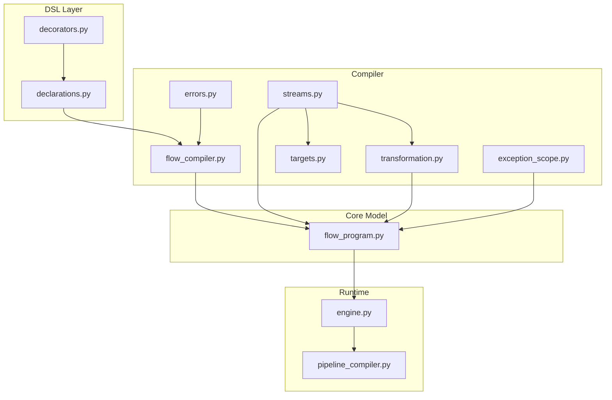
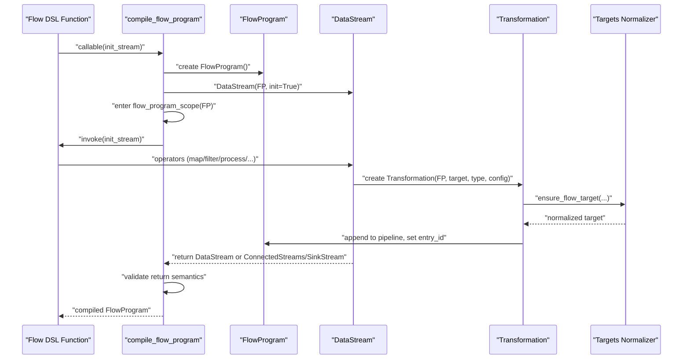
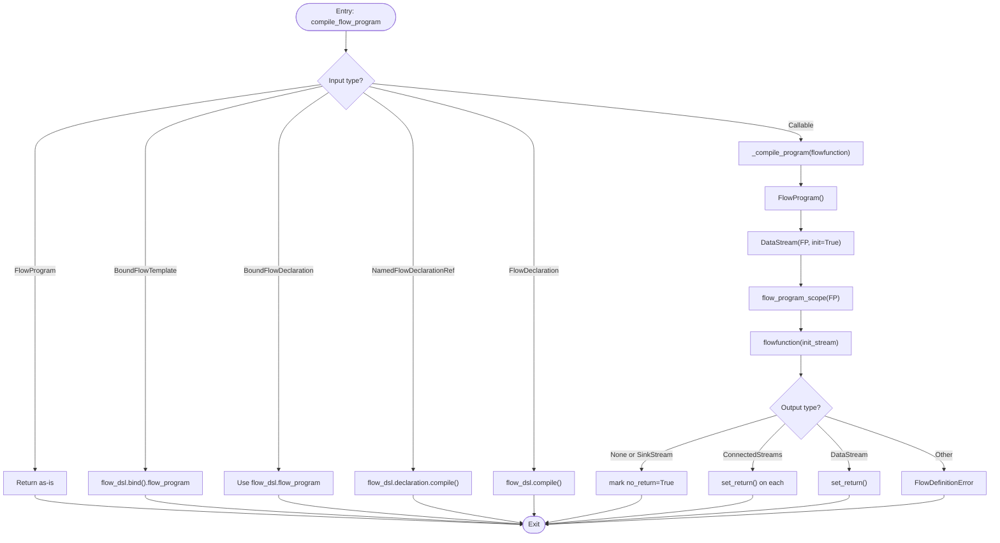
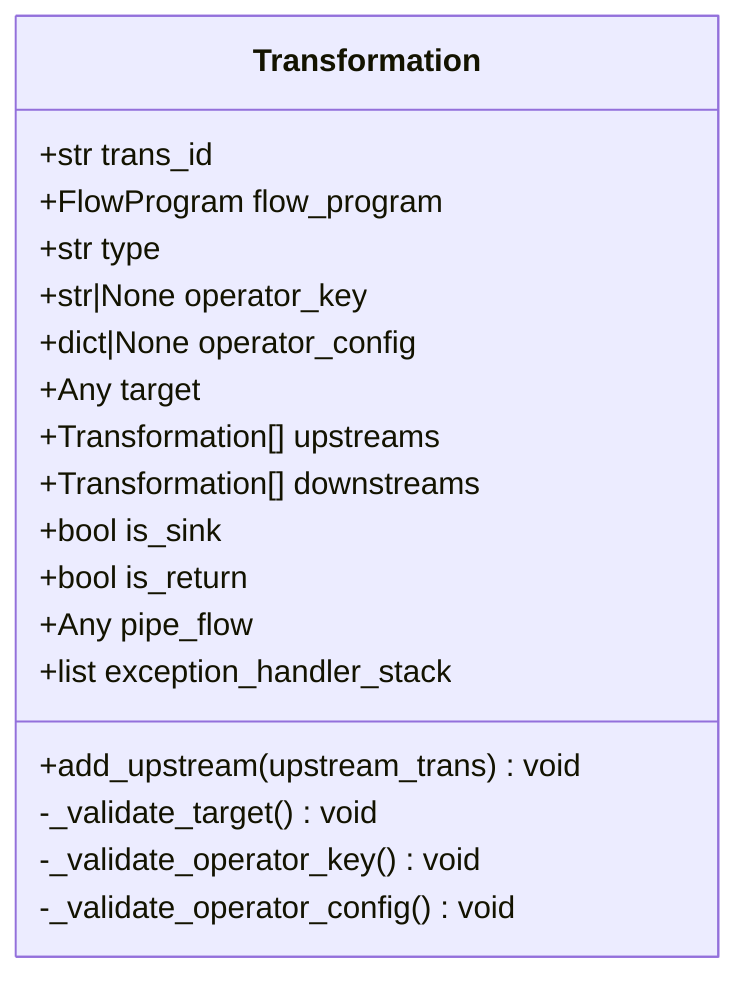
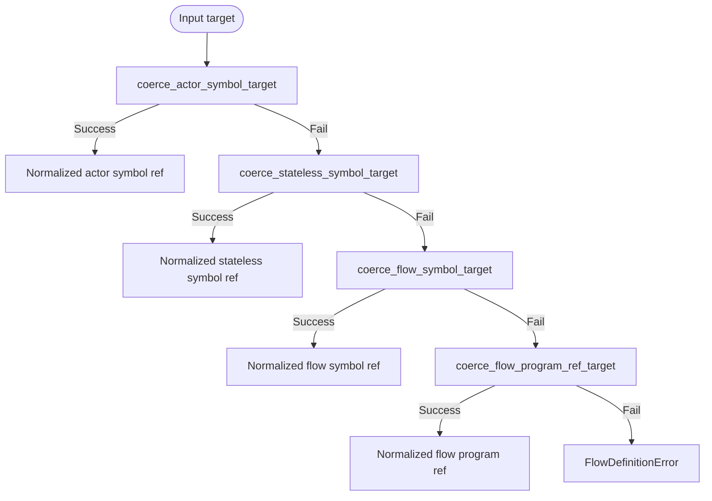
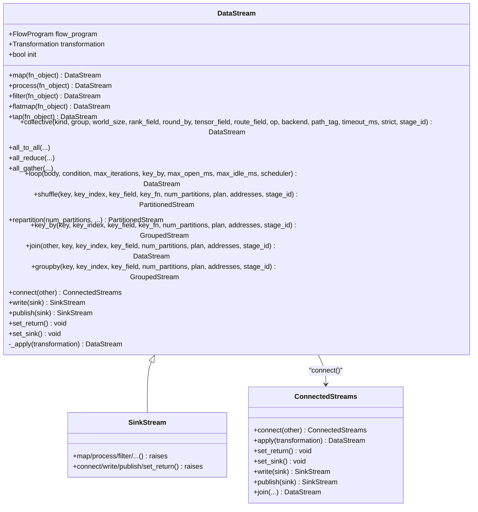
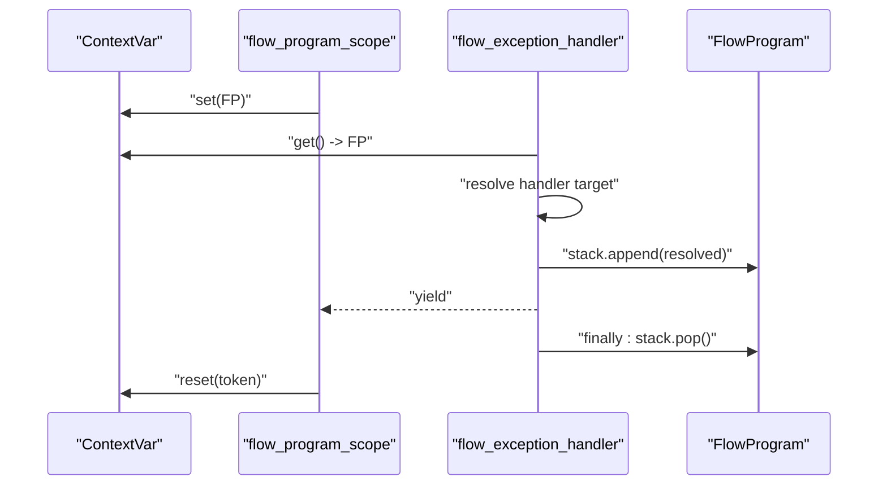
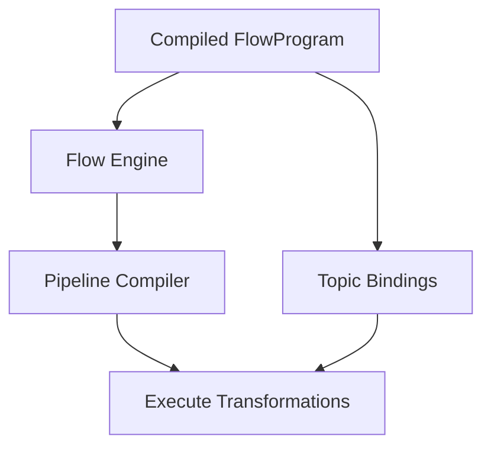
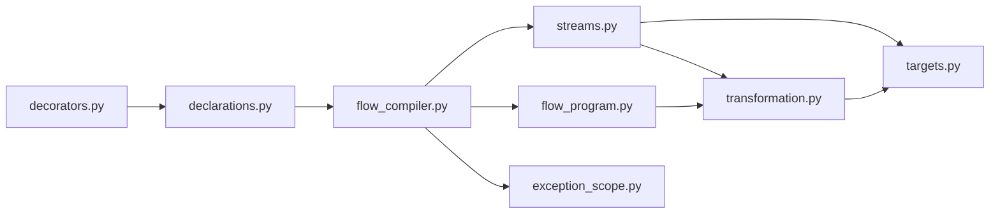

# Compiler and Transformation System

<cite>
**Referenced Files in This Document**
- [flow_compiler.py](file://src/sage/runtime/flownet/compiler/flow_compiler.py)
- [transformation.py](file://src/sage/runtime/flownet/compiler/transformation.py)
- [targets.py](file://src/sage/runtime/flownet/compiler/targets.py)
- [streams.py](file://src/sage/runtime/flownet/compiler/streams.py)
- [exception_scope.py](file://src/sage/runtime/flownet/compiler/exception_scope.py)
- [errors.py](file://src/sage/runtime/flownet/compiler/errors.py)
- [flow_program.py](file://src/sage/runtime/flownet/core/flow_program.py)
- [declarations.py](file://src/sage/runtime/flownet/api/declarations.py)
- [decorators.py](file://src/sage/runtime/flownet/api/decorators.py)
- [engine.py](file://src/sage/runtime/flownet/runtime/flowengine/engine.py)
- [pipeline_compiler.py](file://src/sage/runtime/pipeline_compiler.py)
</cite>

## Table of Contents
1. [Introduction](#introduction)
2. [Project Structure](#project-structure)
3. [Core Components](#core-components)
4. [Architecture Overview](#architecture-overview)
5. [Detailed Component Analysis](#detailed-component-analysis)
6. [Dependency Analysis](#dependency-analysis)
7. [Performance Considerations](#performance-considerations)
8. [Troubleshooting Guide](#troubleshooting-guide)
9. [Conclusion](#conclusion)
10. [Appendices](#appendices)

## Introduction
This document explains the Compiler and Transformation System responsible for transforming high-level flow programs into executable distributed code. It covers the compilation pipeline from abstract flow program representation to optimized runtime instructions, including the flow compiler implementation, transformation rules, and target-specific normalization. It documents the exception scope system for error handling during compilation and the error reporting mechanism for compilation failures. It also describes the streams system for data flow analysis and the targets system for platform-specific code generation. Practical examples demonstrate custom transformations, pipeline customization, and debugging compilation errors, along with the relationship between compilation and runtime execution, optimization strategies, and performance considerations.

## Project Structure
The compiler and transformation system resides under the runtime/flownet/compiler package and integrates with the core flow program model and runtime execution engine. Key modules include:
- flow_compiler.py: Top-level entry to compile flow DSL into FlowProgram.
- transformation.py: Defines Transformation nodes representing operators and their metadata.
- targets.py: Normalizes targets (actors, stateless ops, flows) into canonical forms.
- streams.py: Provides the DataStream API for building pipelines via operators like map, filter, process, shuffle, join, and collective communication.
- exception_scope.py: Manages exception handler stacks during compilation.
- errors.py: Defines compile-time error types.
- flow_program.py: Holds the compiled topology and runtime configuration.
- declarations.py and decorators.py: Provide DSL declarations and decorators for flows, actors, services, etc.
- engine.py and pipeline_compiler.py: Bridge compiled FlowProgram to runtime execution.

**Diagram sources**
- [flow_compiler.py:17-62](file://src/sage/runtime/flownet/compiler/flow_compiler.py#L17-L62)
- [transformation.py:23-100](file://src/sage/runtime/flownet/compiler/transformation.py#L23-L100)
- [targets.py:32-66](file://src/sage/runtime/flownet/compiler/targets.py#L32-L66)
- [streams.py:130-624](file://src/sage/runtime/flownet/compiler/streams.py#L130-L624)
- [exception_scope.py:29-68](file://src/sage/runtime/flownet/compiler/exception_scope.py#L29-L68)
- [errors.py:4-16](file://src/sage/runtime/flownet/compiler/errors.py#L4-L16)
- [flow_program.py:10-365](file://src/sage/runtime/flownet/core/flow_program.py#L10-L365)
- [declarations.py:562-800](file://src/sage/runtime/flownet/api/declarations.py#L562-L800)
- [decorators.py:142-181](file://src/sage/runtime/flownet/api/decorators.py#L142-L181)
- [engine.py](file://src/sage/runtime/flownet/runtime/flowengine/engine.py)
- [pipeline_compiler.py:529-563](file://src/sage/runtime/pipeline_compiler.py#L529-L563)

**Section sources**
- [flow_compiler.py:17-62](file://src/sage/runtime/flownet/compiler/flow_compiler.py#L17-L62)
- [flow_program.py:10-365](file://src/sage/runtime/flownet/core/flow_program.py#L10-L365)

## Core Components
- FlowProgram: Compiled topology container holding pipeline, transformations, entry/sink/return markers, and program-level metadata.
- Transformation: Node representing an operator with type, target, upstream/downstream links, and operator_config.
- DataStream: Fluent API for constructing pipelines; each operator returns a new DataStream or specialized variants (PartitionedStream, GroupedStream, ConnectedStreams, SinkStream).
- Targets Normalization: Converts diverse target forms (actor/stateless/symbolic references, flow references) into canonical dictionaries.
- Exception Scope: Tracks current FlowProgram and exception handlers during compilation to propagate error context.
- Errors: Distinct exceptions for compile-time contract violations and general failures.

Key responsibilities:
- Compilation: compile_flow_program resolves DSL to FlowProgram, wires initial stream, and validates return semantics.
- Transformation: Transformation validates target kinds, operator keys, and operator configs; maintains graph edges.
- Streams: Operators enforce type safety and normalize parameters; maintain exception handler stacks and pipeline ordering.
- Targets: Normalize symbolic and concrete targets; validate required fields and policies.
- Exception Scope: Provide context-aware exception handling during DSL construction.

**Section sources**
- [flow_program.py:10-178](file://src/sage/runtime/flownet/core/flow_program.py#L10-L178)
- [transformation.py:23-100](file://src/sage/runtime/flownet/compiler/transformation.py#L23-L100)
- [streams.py:130-624](file://src/sage/runtime/flownet/compiler/streams.py#L130-L624)
- [targets.py:32-66](file://src/sage/runtime/flownet/compiler/targets.py#L32-L66)
- [exception_scope.py:29-68](file://src/sage/runtime/flownet/compiler/exception_scope.py#L29-L68)
- [errors.py:4-16](file://src/sage/runtime/flownet/compiler/errors.py#L4-L16)

## Architecture Overview
The compilation pipeline converts a flow DSL into a FlowProgram with a linear pipeline of Transformation nodes. Operators attach to the current DataStream, inherit exception handler context, and register themselves in the FlowProgram. Targets are normalized to canonical forms before being embedded into operator_config. At runtime, the FlowProgram is bound to topics and executed by the flow engine.

**Diagram sources**
- [flow_compiler.py:17-62](file://src/sage/runtime/flownet/compiler/flow_compiler.py#L17-L62)
- [streams.py:593-602](file://src/sage/runtime/flownet/compiler/streams.py#L593-L602)
- [transformation.py:23-50](file://src/sage/runtime/flownet/compiler/transformation.py#L23-L50)
- [targets.py:32-66](file://src/sage/runtime/flownet/compiler/targets.py#L32-L66)

## Detailed Component Analysis

### Flow Compiler
Responsibilities:
- Accept FlowProgram, BoundFlowTemplate, BoundFlowDeclaration, NamedFlowDeclarationRef, FlowDeclaration, or callable DSL.
- Resolve callable DSL to a FlowProgram by invoking it with an initial DataStream.
- Validate return semantics: None, SinkStream, ConnectedStreams, or DataStream.
- Set entry ID and mark no_return appropriately.

**Diagram sources**
- [flow_compiler.py:17-62](file://src/sage/runtime/flownet/compiler/flow_compiler.py#L17-L62)

**Section sources**
- [flow_compiler.py:17-62](file://src/sage/runtime/flownet/compiler/flow_compiler.py#L17-L62)

### Transformation
Responsibilities:
- Construct Transformation nodes with flow_program, target, type, operator_key, operator_config.
- Validate target kinds and normalize symbolic targets.
- Validate operator_key and operator_config.
- Link upstream/downstream transformations.

**Diagram sources**
- [transformation.py:23-100](file://src/sage/runtime/flownet/compiler/transformation.py#L23-L100)

**Section sources**
- [transformation.py:23-100](file://src/sage/runtime/flownet/compiler/transformation.py#L23-L100)

### Targets Normalization
Responsibilities:
- Coerce actor/stateless/symbolic actor/stateless/flow targets into canonical dictionaries.
- Validate required fields and policies.
- Support flow program references and symbolic flow references with materialization policies.

**Diagram sources**
- [targets.py:32-66](file://src/sage/runtime/flownet/compiler/targets.py#L32-L66)
- [targets.py:68-141](file://src/sage/runtime/flownet/compiler/targets.py#L68-L141)
- [targets.py:203-244](file://src/sage/runtime/flownet/compiler/targets.py#L203-L244)
- [targets.py:247-334](file://src/sage/runtime/flownet/compiler/targets.py#L247-L334)
- [targets.py:183-200](file://src/sage/runtime/flownet/compiler/targets.py#L183-L200)

**Section sources**
- [targets.py:32-66](file://src/sage/runtime/flownet/compiler/targets.py#L32-L66)
- [targets.py:68-141](file://src/sage/runtime/flownet/compiler/targets.py#L68-L141)
- [targets.py:203-244](file://src/sage/runtime/flownet/compiler/targets.py#L203-L244)
- [targets.py:247-334](file://src/sage/runtime/flownet/compiler/targets.py#L247-L334)
- [targets.py:183-200](file://src/sage/runtime/flownet/compiler/targets.py#L183-L200)

### Streams System
Responsibilities:
- Provide fluent operators: map, process, filter, flatmap, tap, collective, loop, shuffle, repartition, key_by, join, groupby, connect, write/publish.
- Enforce parameter validation and normalize shuffle/join keys, collective kinds/backends/reduce ops, loop bodies/conditions.
- Maintain exception handler stacks and pipeline order; mark returns and sinks.

**Diagram sources**
- [streams.py:130-624](file://src/sage/runtime/flownet/compiler/streams.py#L130-L624)
- [streams.py:629-682](file://src/sage/runtime/flownet/compiler/streams.py#L629-L682)
- [streams.py:707-757](file://src/sage/runtime/flownet/compiler/streams.py#L707-L757)

**Section sources**
- [streams.py:130-624](file://src/sage/runtime/flownet/compiler/streams.py#L130-L624)
- [streams.py:629-682](file://src/sage/runtime/flownet/compiler/streams.py#L629-L682)
- [streams.py:707-757](file://src/sage/runtime/flownet/compiler/streams.py#L707-L757)

### Exception Scope System
Responsibilities:
- Track current FlowProgram in a context variable.
- Provide flow_program_scope to enter/exit compilation with a FlowProgram context.
- Provide flow_exception_handler to push/pop exception handlers onto FlowProgram’s stack.
- Validate handler targets (actor-like or symbolic).

**Diagram sources**
- [exception_scope.py:29-68](file://src/sage/runtime/flownet/compiler/exception_scope.py#L29-L68)

**Section sources**
- [exception_scope.py:29-68](file://src/sage/runtime/flownet/compiler/exception_scope.py#L29-L68)

### Error Reporting Mechanism
Responsibilities:
- FlowCompileError: Base error for compilation failures.
- FlowDefinitionError: Raised when a flow definition violates compile-time contracts (e.g., invalid return types, invalid parameters).

Usage:
- Operators and normalization routines raise FlowDefinitionError with descriptive messages.
- The exception scope ensures handlers are attached to the current FlowProgram for contextual error reporting.

**Section sources**
- [errors.py:4-16](file://src/sage/runtime/flownet/compiler/errors.py#L4-L16)
- [flow_compiler.py:58-60](file://src/sage/runtime/flownet/compiler/flow_compiler.py#L58-L60)
- [streams.py:160-163](file://src/sage/runtime/flownet/compiler/streams.py#L160-L163)

### Relationship Between Compilation and Runtime Execution
Compilation produces a FlowProgram with:
- Pipeline of Transformation nodes.
- Entry/sink/return markers.
- Program-level metadata and policies.

Runtime execution:
- FlowProgram is bound to topics and executed by the flow engine.
- The engine processes packets through transformations, respecting partitioning, shuffling, joins, and collective operations.
- Pipeline compiler orchestrates dispatch and execution across instances.

**Diagram sources**
- [flow_program.py:177-365](file://src/sage/runtime/flownet/core/flow_program.py#L177-L365)
- [engine.py](file://src/sage/runtime/flownet/runtime/flowengine/engine.py)
- [pipeline_compiler.py:529-563](file://src/sage/runtime/pipeline_compiler.py#L529-L563)

**Section sources**
- [flow_program.py:177-365](file://src/sage/runtime/flownet/core/flow_program.py#L177-L365)
- [engine.py](file://src/sage/runtime/flownet/runtime/flowengine/engine.py)
- [pipeline_compiler.py:529-563](file://src/sage/runtime/pipeline_compiler.py#L529-L563)

## Dependency Analysis
Key dependencies:
- flow_compiler depends on FlowProgram, DataStream, ConnectedStreams, SinkStream, exception_scope, and errors.
- streams depends on transformation, targets, and contracts for recovery policy normalization.
- transformation depends on targets for target validation and normalization.
- flow_program aggregates transformations and manages entry/sink/return semantics.
- declarations and decorators construct FlowDeclaration and compile to FlowProgram.

**Diagram sources**
- [flow_compiler.py:17-62](file://src/sage/runtime/flownet/compiler/flow_compiler.py#L17-L62)
- [streams.py:130-624](file://src/sage/runtime/flownet/compiler/streams.py#L130-L624)
- [transformation.py:23-100](file://src/sage/runtime/flownet/compiler/transformation.py#L23-L100)
- [targets.py:32-66](file://src/sage/runtime/flownet/compiler/targets.py#L32-L66)
- [flow_program.py:10-178](file://src/sage/runtime/flownet/core/flow_program.py#L10-L178)
- [declarations.py:562-800](file://src/sage/runtime/flownet/api/declarations.py#L562-L800)
- [decorators.py:142-181](file://src/sage/runtime/flownet/api/decorators.py#L142-L181)

**Section sources**
- [flow_compiler.py:17-62](file://src/sage/runtime/flownet/compiler/flow_compiler.py#L17-L62)
- [streams.py:130-624](file://src/sage/runtime/flownet/compiler/streams.py#L130-L624)
- [transformation.py:23-100](file://src/sage/runtime/flownet/compiler/transformation.py#L23-L100)
- [targets.py:32-66](file://src/sage/runtime/flownet/compiler/targets.py#L32-L66)
- [flow_program.py:10-178](file://src/sage/runtime/flownet/core/flow_program.py#L10-L178)
- [declarations.py:562-800](file://src/sage/runtime/flownet/api/declarations.py#L562-L800)
- [decorators.py:142-181](file://src/sage/runtime/flownet/api/decorators.py#L142-L181)

## Performance Considerations
- Operator Validation Early: Many operators validate parameters early (e.g., shuffle/join keys, collective kinds/backends/reduce ops) to fail fast and avoid expensive runtime misconfiguration.
- Target Normalization: Canonical target forms reduce runtime ambiguity and enable efficient dispatch.
- Pipeline Construction: Operators append to FlowProgram.pipeline and maintain upstream/downstream links, enabling efficient traversal during runtime.
- Collective Operations: Collective kinds and backends are validated and normalized to ensure optimal runtime performance.
- Loop Scheduling: Loop operator supports scheduler configuration and timeouts to balance throughput and latency.

[No sources needed since this section provides general guidance]

## Troubleshooting Guide
Common issues and resolutions:
- Invalid return type from flow DSL: Ensure the DSL returns DataStream, ConnectedStreams, SinkStream, or None. The compiler raises a FlowDefinitionError otherwise.
- Invalid operator parameters: Operators like shuffle, join, collective, loop enforce strict parameter validation. Fix parameter types and values to satisfy normalization rules.
- Invalid target specification: Targets must be actor-like, stateless-like, or symbolic references. Use ensure_flow_target to normalize and validate.
- Exception handler misuse: flow_exception_handler must be used inside flow_program_scope; otherwise, a RuntimeError is raised.
- FlowDefinitionError messages: These indicate contract violations during compilation; adjust DSL or parameters accordingly.

Practical debugging tips:
- Wrap DSL construction in flow_program_scope to ensure proper exception handler context.
- Use minimal reproducible DSL to isolate operator-specific issues.
- Validate targets using ensure_flow_target before passing to operators.
- Review FlowProgram pipeline and transformation lists to confirm expected topology.

**Section sources**
- [flow_compiler.py:58-60](file://src/sage/runtime/flownet/compiler/flow_compiler.py#L58-L60)
- [streams.py:160-163](file://src/sage/runtime/flownet/compiler/streams.py#L160-L163)
- [exception_scope.py:54-67](file://src/sage/runtime/flownet/compiler/exception_scope.py#L54-L67)
- [errors.py:8-10](file://src/sage/runtime/flownet/compiler/errors.py#L8-L10)

## Conclusion
The Compiler and Transformation System provides a robust pipeline to transform high-level flow DSL into a compiled FlowProgram with validated operators and canonical targets. The streams API enables expressive data flow construction with strong validation and error reporting. The exception scope system ensures compilation-time error context is preserved. Runtime execution leverages the compiled topology to orchestrate distributed processing with precise control over partitions, joins, and collective operations.

[No sources needed since this section summarizes without analyzing specific files]

## Appendices

### Practical Examples

- Custom Transformation via Targets
  - Use ensure_flow_target to normalize actor/stateless/symbolic targets before applying operators.
  - Example path: [targets.py:32-66](file://src/sage/runtime/flownet/compiler/targets.py#L32-L66)

- Compilation Pipeline Customization
  - Decorate flow DSL with flow(...) to capture program-level metadata and policies.
  - Example path: [decorators.py:142-181](file://src/sage/runtime/flownet/api/decorators.py#L142-L181)
  - Access compiled FlowProgram via FlowDeclaration.compile().
  - Example path: [declarations.py:653-682](file://src/sage/runtime/flownet/api/declarations.py#L653-L682)

- Debugging Compilation Errors
  - Wrap DSL construction in flow_program_scope to ensure exception handler context.
  - Example path: [exception_scope.py:29-36](file://src/sage/runtime/flownet/compiler/exception_scope.py#L29-L36)
  - Validate operator parameters using built-in normalization and error messages.
  - Example path: [streams.py:43-48](file://src/sage/runtime/flownet/compiler/streams.py#L43-L48)

- Relationship Between Compilation and Runtime
  - FlowProgram holds pipeline and metadata; runtime binds topics and executes via engine.
  - Example path: [flow_program.py:177-365](file://src/sage/runtime/flownet/core/flow_program.py#L177-L365)
  - Example path: [engine.py](file://src/sage/runtime/flownet/runtime/flowengine/engine.py)
  - Example path: [pipeline_compiler.py:529-563](file://src/sage/runtime/pipeline_compiler.py#L529-L563)