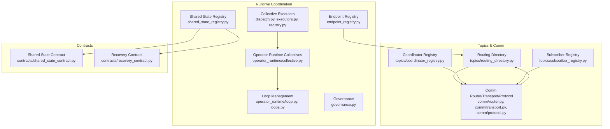
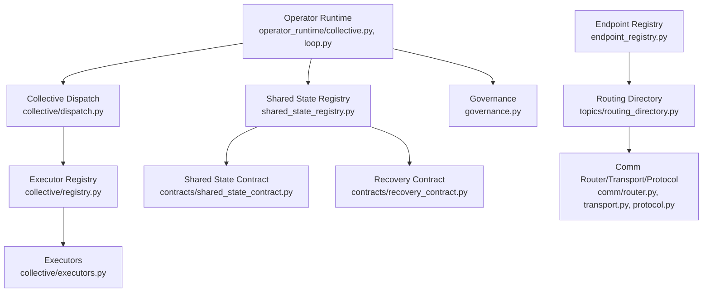
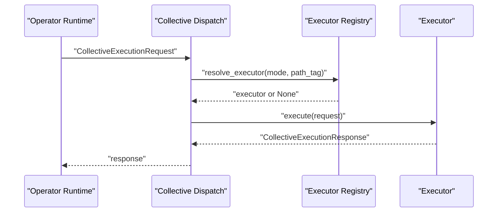
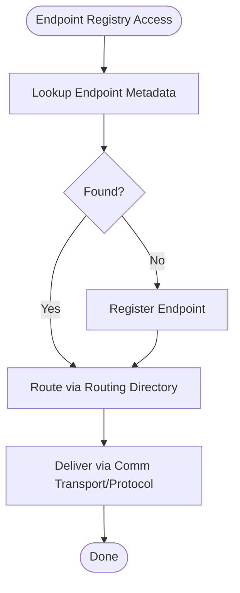
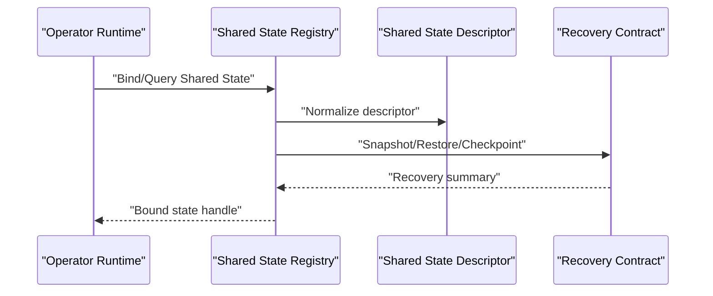
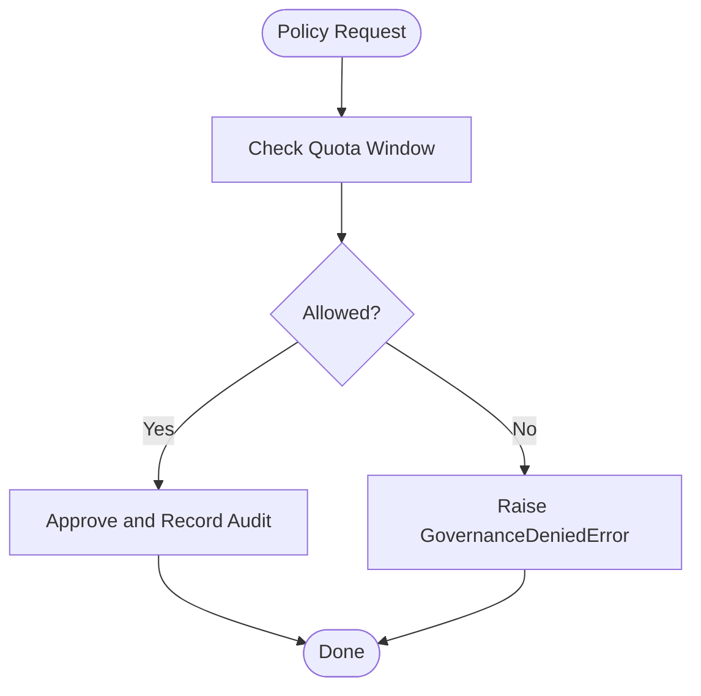
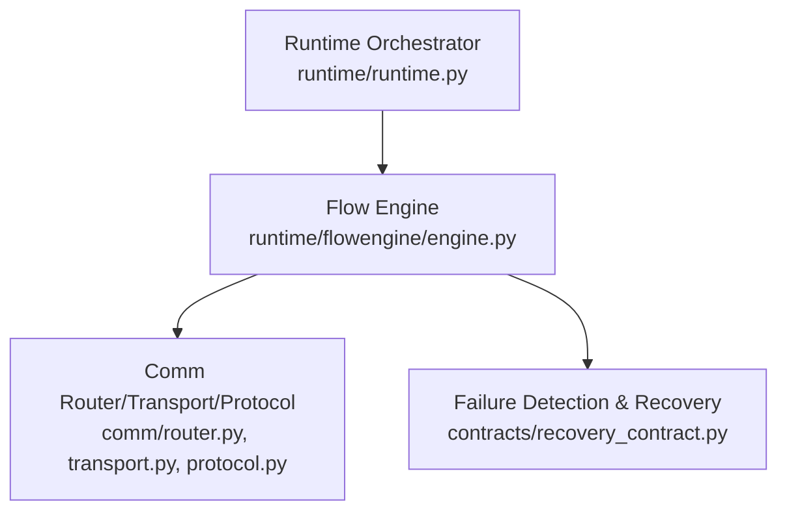
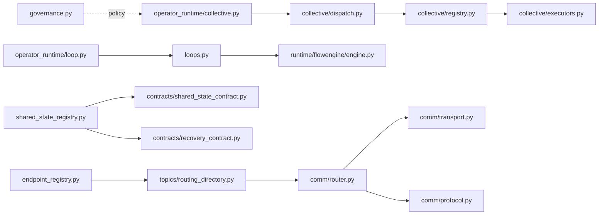

# Distributed Coordination

<cite>
**Referenced Files in This Document**
- [collective/dispatch.py](file://src/sage/runtime/flownet/runtime/collective/dispatch.py)
- [collective/executors.py](file://src/sage/runtime/flownet/runtime/collective/executors.py)
- [collective/registry.py](file://src/sage/runtime/flownet/runtime/collective/registry.py)
- [operator_runtime/collective.py](file://src/sage/runtime/flownet/runtime/operator_runtime/collective.py)
- [operator_runtime/loop.py](file://src/sage/runtime/flownet/runtime/operator_runtime/loop.py)
- [loops.py](file://src/sage/runtime/flownet/runtime/loops.py)
- [governance.py](file://src/sage/runtime/flownet/runtime/governance.py)
- [shared_state_registry.py](file://src/sage/runtime/flownet/runtime/shared_state_registry.py)
- [endpoint_registry.py](file://src/sage/runtime/flownet/runtime/endpoint_registry.py)
- [topics/coordinator_registry.py](file://src/sage/runtime/flownet/runtime/topics/coordinator_registry.py)
- [topics/routing_directory.py](file://src/sage/runtime/flownet/runtime/topics/routing_directory.py)
- [topics/subscriber_registry.py](file://src/sage/runtime/flownet/runtime/topics/subscriber_registry.py)
- [comm/router.py](file://src/sage/runtime/flownet/runtime/comm/router.py)
- [comm/transport.py](file://src/sage/runtime/flownet/runtime/comm/transport.py)
- [comm/protocol.py](file://src/sage/runtime/flownet/runtime/comm/protocol.py)
- [contracts/shared_state_contract.py](file://src/sage/runtime/flownet/contracts/shared_state_contract.py)
- [contracts/recovery_contract.py](file://src/sage/runtime/flownet/contracts/recovery_contract.py)
- [runtime/flowengine/engine.py](file://src/sage/runtime/flownet/runtime/flowengine/engine.py)
- [runtime/runtime.py](file://src/sage/runtime/flownet/runtime/runtime.py)
</cite>

## Table of Contents
1. [Introduction](#introduction)
2. [Project Structure](#project-structure)
3. [Core Components](#core-components)
4. [Architecture Overview](#architecture-overview)
5. [Detailed Component Analysis](#detailed-component-analysis)
6. [Dependency Analysis](#dependency-analysis)
7. [Performance Considerations](#performance-considerations)
8. [Troubleshooting Guide](#troubleshooting-guide)
9. [Conclusion](#conclusion)
10. [Appendices](#appendices)

## Introduction
This document explains the Distributed Coordination subsystem of FlowNet, focusing on how the system coordinates execution across multiple nodes, manages shared state, enforces cluster-wide policies, and maintains reliable iterative computations. It covers collective execution patterns, endpoint registry management, shared state coordination, governance, loop management, runtime coordination protocols, state synchronization, and failure detection and recovery. Practical examples illustrate cluster setup, shared state operations, collective computation patterns, and fault tolerance strategies, and we explain how coordination integrates with the actor system and communication infrastructure.

## Project Structure
The FlowNet runtime organizes coordination-related capabilities across several modules:
- Collective execution: dispatch, executors, and registry for cross-node aggregations and reductions.
- Operator runtime: collective orchestration and loop management for iterative computations.
- Governance: quota auditing and policy enforcement.
- Shared state registry: binding, discovery, and recovery of shared state services.
- Endpoint registry: node and endpoint discovery and routing.
- Topics and communication: routing, transport, and protocol abstractions for inter-node messaging.
- Contracts: shared-state and recovery contracts that define service descriptors and recovery semantics.



**Diagram sources**
- [collective/dispatch.py:1-50](file://src/sage/runtime/flownet/runtime/collective/dispatch.py#L1-L50)
- [collective/executors.py:1-50](file://src/sage/runtime/flownet/runtime/collective/executors.py#L1-L50)
- [collective/registry.py:1-120](file://src/sage/runtime/flownet/runtime/collective/registry.py#L1-L120)
- [operator_runtime/collective.py:1-120](file://src/sage/runtime/flownet/runtime/operator_runtime/collective.py#L1-L120)
- [operator_runtime/loop.py:1-120](file://src/sage/runtime/flownet/runtime/operator_runtime/loop.py#L1-L120)
- [loops.py:1-120](file://src/sage/runtime/flownet/runtime/loops.py#L1-L120)
- [governance.py:1-120](file://src/sage/runtime/flownet/runtime/governance.py#L1-L120)
- [shared_state_registry.py:1-120](file://src/sage/runtime/flownet/runtime/shared_state_registry.py#L1-L120)
- [endpoint_registry.py:1-120](file://src/sage/runtime/flownet/runtime/endpoint_registry.py#L1-L120)
- [topics/routing_directory.py:1-120](file://src/sage/runtime/flownet/runtime/topics/routing_directory.py#L1-L120)
- [topics/coordinator_registry.py:1-120](file://src/sage/runtime/flownet/runtime/topics/coordinator_registry.py#L1-L120)
- [topics/subscriber_registry.py:1-120](file://src/sage/runtime/flownet/runtime/topics/subscriber_registry.py#L1-L120)
- [comm/router.py:1-120](file://src/sage/runtime/flownet/runtime/comm/router.py#L1-L120)
- [comm/transport.py:1-120](file://src/sage/runtime/flownet/runtime/comm/transport.py#L1-L120)
- [comm/protocol.py:1-120](file://src/sage/runtime/flownet/runtime/comm/protocol.py#L1-L120)
- [contracts/shared_state_contract.py:1-120](file://src/sage/runtime/flownet/contracts/shared_state_contract.py#L1-L120)
- [contracts/recovery_contract.py:1-120](file://src/sage/runtime/flownet/contracts/recovery_contract.py#L1-L120)

**Section sources**
- [collective/dispatch.py:1-50](file://src/sage/runtime/flownet/runtime/collective/dispatch.py#L1-L50)
- [collective/executors.py:1-50](file://src/sage/runtime/flownet/runtime/collective/executors.py#L1-L50)
- [collective/registry.py:1-120](file://src/sage/runtime/flownet/runtime/collective/registry.py#L1-L120)
- [operator_runtime/collective.py:1-120](file://src/sage/runtime/flownet/runtime/operator_runtime/collective.py#L1-L120)
- [operator_runtime/loop.py:1-120](file://src/sage/runtime/flownet/runtime/operator_runtime/loop.py#L1-L120)
- [loops.py:1-120](file://src/sage/runtime/flownet/runtime/loops.py#L1-L120)
- [governance.py:1-120](file://src/sage/runtime/flownet/runtime/governance.py#L1-L120)
- [shared_state_registry.py:1-120](file://src/sage/runtime/flownet/runtime/shared_state_registry.py#L1-L120)
- [endpoint_registry.py:1-120](file://src/sage/runtime/flownet/runtime/endpoint_registry.py#L1-L120)
- [topics/routing_directory.py:1-120](file://src/sage/runtime/flownet/runtime/topics/routing_directory.py#L1-L120)
- [topics/coordinator_registry.py:1-120](file://src/sage/runtime/flownet/runtime/topics/coordinator_registry.py#L1-L120)
- [topics/subscriber_registry.py:1-120](file://src/sage/runtime/flownet/runtime/topics/subscriber_registry.py#L1-L120)
- [comm/router.py:1-120](file://src/sage/runtime/flownet/runtime/comm/router.py#L1-L120)
- [comm/transport.py:1-120](file://src/sage/runtime/flownet/runtime/comm/transport.py#L1-L120)
- [comm/protocol.py:1-120](file://src/sage/runtime/flownet/runtime/comm/protocol.py#L1-L120)
- [contracts/shared_state_contract.py:1-120](file://src/sage/runtime/flownet/contracts/shared_state_contract.py#L1-L120)
- [contracts/recovery_contract.py:1-120](file://src/sage/runtime/flownet/contracts/recovery_contract.py#L1-L120)

## Core Components
- Collective Execution Dispatch and Executors: Resolve and execute collective operations (e.g., all_gather, all_reduce) across nodes using a registry-driven mechanism.
- Operator Runtime Collectives: Orchestrate collective operations within operator execution contexts.
- Loop Management: Manage iterative distributed computations with loop contexts and coordination.
- Governance: Enforce cluster-wide quotas and policies with audit windows and denial errors.
- Shared State Registry: Bind, discover, and recover shared state services with normalized descriptors and recovery contracts.
- Endpoint Registry and Routing: Maintain endpoint and routing metadata for inter-node communication.
- Communication Infrastructure: Router, transport, and protocol abstractions for reliable messaging.

**Section sources**
- [collective/dispatch.py:1-50](file://src/sage/runtime/flownet/runtime/collective/dispatch.py#L1-L50)
- [collective/executors.py:1-50](file://src/sage/runtime/flownet/runtime/collective/executors.py#L1-L50)
- [operator_runtime/collective.py:1-120](file://src/sage/runtime/flownet/runtime/operator_runtime/collective.py#L1-L120)
- [operator_runtime/loop.py:1-120](file://src/sage/runtime/flownet/runtime/operator_runtime/loop.py#L1-L120)
- [loops.py:1-120](file://src/sage/runtime/flownet/runtime/loops.py#L1-L120)
- [governance.py:1-120](file://src/sage/runtime/flownet/runtime/governance.py#L1-L120)
- [shared_state_registry.py:1-120](file://src/sage/runtime/flownet/runtime/shared_state_registry.py#L1-L120)
- [endpoint_registry.py:1-120](file://src/sage/runtime/flownet/runtime/endpoint_registry.py#L1-L120)
- [topics/routing_directory.py:1-120](file://src/sage/runtime/flownet/runtime/topics/routing_directory.py#L1-L120)
- [comm/router.py:1-120](file://src/sage/runtime/flownet/runtime/comm/router.py#L1-L120)
- [comm/transport.py:1-120](file://src/sage/runtime/flownet/runtime/comm/transport.py#L1-L120)
- [comm/protocol.py:1-120](file://src/sage/runtime/flownet/runtime/comm/protocol.py#L1-L120)

## Architecture Overview
The coordination architecture couples collective execution, loop management, governance, and shared state with a robust communication backbone. Operators submit collective requests resolved via a registry to executors. Shared state services are discovered and bound through descriptors, with recovery semantics integrated. Governance enforces quotas and policies. Routing and transport handle reliable inter-node messaging.



**Diagram sources**
- [operator_runtime/collective.py:1-120](file://src/sage/runtime/flownet/runtime/operator_runtime/collective.py#L1-L120)
- [operator_runtime/loop.py:1-120](file://src/sage/runtime/flownet/runtime/operator_runtime/loop.py#L1-L120)
- [collective/dispatch.py:1-50](file://src/sage/runtime/flownet/runtime/collective/dispatch.py#L1-L50)
- [collective/registry.py:1-120](file://src/sage/runtime/flownet/runtime/collective/registry.py#L1-L120)
- [collective/executors.py:1-50](file://src/sage/runtime/flownet/runtime/collective/executors.py#L1-L50)
- [shared_state_registry.py:1-120](file://src/sage/runtime/flownet/runtime/shared_state_registry.py#L1-L120)
- [contracts/shared_state_contract.py:1-120](file://src/sage/runtime/flownet/contracts/shared_state_contract.py#L1-L120)
- [contracts/recovery_contract.py:1-120](file://src/sage/runtime/flownet/contracts/recovery_contract.py#L1-L120)
- [governance.py:1-120](file://src/sage/runtime/flownet/runtime/governance.py#L1-L120)
- [endpoint_registry.py:1-120](file://src/sage/runtime/flownet/runtime/endpoint_registry.py#L1-L120)
- [topics/routing_directory.py:1-120](file://src/sage/runtime/flownet/runtime/topics/routing_directory.py#L1-L120)
- [comm/router.py:1-120](file://src/sage/runtime/flownet/runtime/comm/router.py#L1-L120)
- [comm/transport.py:1-120](file://src/sage/runtime/flownet/runtime/comm/transport.py#L1-L120)
- [comm/protocol.py:1-120](file://src/sage/runtime/flownet/runtime/comm/protocol.py#L1-L120)

## Detailed Component Analysis

### Collective Execution Patterns
Collective execution enables cross-node aggregations and reductions. The dispatcher resolves an appropriate executor from a registry based on backend mode and path tag, and executes the operation. If no executor is found, it raises a descriptive error with available modes.



**Diagram sources**
- [collective/dispatch.py:1-50](file://src/sage/runtime/flownet/runtime/collective/dispatch.py#L1-L50)
- [collective/registry.py:1-120](file://src/sage/runtime/flownet/runtime/collective/registry.py#L1-L120)
- [collective/executors.py:1-50](file://src/sage/runtime/flownet/runtime/collective/executors.py#L1-L50)

**Section sources**
- [collective/dispatch.py:1-50](file://src/sage/runtime/flownet/runtime/collective/dispatch.py#L1-L50)
- [collective/registry.py:1-120](file://src/sage/runtime/flownet/runtime/collective/registry.py#L1-L120)
- [collective/executors.py:1-50](file://src/sage/runtime/flownet/runtime/collective/executors.py#L1-L50)

### Endpoint Registry Management
The endpoint registry maintains node and endpoint metadata used by routing and subscribers. The routing directory and subscriber registry collaborate with the communication router to deliver messages reliably across the cluster.



**Diagram sources**
- [endpoint_registry.py:1-120](file://src/sage/runtime/flownet/runtime/endpoint_registry.py#L1-L120)
- [topics/routing_directory.py:1-120](file://src/sage/runtime/flownet/runtime/topics/routing_directory.py#L1-L120)
- [topics/subscriber_registry.py:1-120](file://src/sage/runtime/flownet/runtime/topics/subscriber_registry.py#L1-L120)
- [comm/router.py:1-120](file://src/sage/runtime/flownet/runtime/comm/router.py#L1-L120)
- [comm/transport.py:1-120](file://src/sage/runtime/flownet/runtime/comm/transport.py#L1-L120)
- [comm/protocol.py:1-120](file://src/sage/runtime/flownet/runtime/comm/protocol.py#L1-L120)

**Section sources**
- [endpoint_registry.py:1-120](file://src/sage/runtime/flownet/runtime/endpoint_registry.py#L1-L120)
- [topics/routing_directory.py:1-120](file://src/sage/runtime/flownet/runtime/topics/routing_directory.py#L1-L120)
- [topics/subscriber_registry.py:1-120](file://src/sage/runtime/flownet/runtime/topics/subscriber_registry.py#L1-L120)
- [comm/router.py:1-120](file://src/sage/runtime/flownet/runtime/comm/router.py#L1-L120)
- [comm/transport.py:1-120](file://src/sage/runtime/flownet/runtime/comm/transport.py#L1-L120)
- [comm/protocol.py:1-120](file://src/sage/runtime/flownet/runtime/comm/protocol.py#L1-L120)

### Shared State Coordination
Shared state services are described by normalized descriptors and bound through the shared state registry. Recovery semantics are integrated to support checkpointing and restoration.



**Diagram sources**
- [shared_state_registry.py:1-120](file://src/sage/runtime/flownet/runtime/shared_state_registry.py#L1-L120)
- [contracts/shared_state_contract.py:1-120](file://src/sage/runtime/flownet/contracts/shared_state_contract.py#L1-L120)
- [contracts/recovery_contract.py:1-120](file://src/sage/runtime/flownet/contracts/recovery_contract.py#L1-L120)

**Section sources**
- [shared_state_registry.py:1-120](file://src/sage/runtime/flownet/runtime/shared_state_registry.py#L1-L120)
- [contracts/shared_state_contract.py:1-120](file://src/sage/runtime/flownet/contracts/shared_state_contract.py#L1-L120)
- [contracts/recovery_contract.py:1-120](file://src/sage/runtime/flownet/contracts/recovery_contract.py#L1-L120)

### Governance System for Cluster-Wide Policy Enforcement
Governance enforces quotas and policies with an audit window and a bounded history. It raises a structured denial error when policies are violated.



**Diagram sources**
- [governance.py:1-120](file://src/sage/runtime/flownet/runtime/governance.py#L1-L120)

**Section sources**
- [governance.py:1-120](file://src/sage/runtime/flownet/runtime/governance.py#L1-L120)

### Loop Management System for Iterative Distributed Computations
Loop management coordinates iterative computations across operators. The operator runtime loop module and the top-level loops module provide context and lifecycle control for distributed loops.

```mermaid
sequenceDiagram
participant OP as "Operator Runtime"
participant LOOP as "Loop Context"
participant ENG as "Flow Engine"
OP->>LOOP : "Start iteration"
LOOP->>ENG : "Execute loop body"
ENG-->>LOOP : "Progress/Result"
LOOP-->>OP : "Next iteration or completion"
```

**Diagram sources**
- [operator_runtime/loop.py:1-120](file://src/sage/runtime/flownet/runtime/operator_runtime/loop.py#L1-L120)
- [loops.py:1-120](file://src/sage/runtime/flownet/runtime/loops.py#L1-L120)
- [runtime/flowengine/engine.py:1-120](file://src/sage/runtime/flownet/runtime/flowengine/engine.py#L1-L120)

**Section sources**
- [operator_runtime/loop.py:1-120](file://src/sage/runtime/flownet/runtime/operator_runtime/loop.py#L1-L120)
- [loops.py:1-120](file://src/sage/runtime/flownet/runtime/loops.py#L1-L120)
- [runtime/flowengine/engine.py:1-120](file://src/sage/runtime/flownet/runtime/flowengine/engine.py#L1-L120)

### Runtime Coordination Protocols and Failure Detection
The runtime integrates with the flow engine and communication infrastructure to coordinate execution and detect failures. The runtime module orchestrates higher-level runtime concerns, while the engine executes operator programs. Communication protocols and transports underpin reliability.



**Diagram sources**
- [runtime/runtime.py:1-120](file://src/sage/runtime/flownet/runtime/runtime.py#L1-L120)
- [runtime/flowengine/engine.py:1-120](file://src/sage/runtime/flownet/runtime/flowengine/engine.py#L1-L120)
- [comm/router.py:1-120](file://src/sage/runtime/flownet/runtime/comm/router.py#L1-L120)
- [comm/transport.py:1-120](file://src/sage/runtime/flownet/runtime/comm/transport.py#L1-L120)
- [comm/protocol.py:1-120](file://src/sage/runtime/flownet/runtime/comm/protocol.py#L1-L120)
- [contracts/recovery_contract.py:1-120](file://src/sage/runtime/flownet/contracts/recovery_contract.py#L1-L120)

**Section sources**
- [runtime/runtime.py:1-120](file://src/sage/runtime/flownet/runtime/runtime.py#L1-L120)
- [runtime/flowengine/engine.py:1-120](file://src/sage/runtime/flownet/runtime/flowengine/engine.py#L1-L120)
- [comm/router.py:1-120](file://src/sage/runtime/flownet/runtime/comm/router.py#L1-L120)
- [comm/transport.py:1-120](file://src/sage/runtime/flownet/runtime/comm/transport.py#L1-L120)
- [comm/protocol.py:1-120](file://src/sage/runtime/flownet/runtime/comm/protocol.py#L1-L120)
- [contracts/recovery_contract.py:1-120](file://src/sage/runtime/flownet/contracts/recovery_contract.py#L1-L120)

## Dependency Analysis
The coordination subsystem exhibits layered dependencies:
- Operator runtime depends on collective dispatch and registry.
- Shared state registry depends on contracts for descriptors and recovery.
- Endpoint and routing depend on communication primitives.
- Governance is independent but interacts with request pathways.
- The flow engine and runtime coordinate higher-level orchestration.



**Diagram sources**
- [operator_runtime/collective.py:1-120](file://src/sage/runtime/flownet/runtime/operator_runtime/collective.py#L1-L120)
- [collective/dispatch.py:1-50](file://src/sage/runtime/flownet/runtime/collective/dispatch.py#L1-L50)
- [collective/registry.py:1-120](file://src/sage/runtime/flownet/runtime/collective/registry.py#L1-L120)
- [collective/executors.py:1-50](file://src/sage/runtime/flownet/runtime/collective/executors.py#L1-L50)
- [operator_runtime/loop.py:1-120](file://src/sage/runtime/flownet/runtime/operator_runtime/loop.py#L1-L120)
- [loops.py:1-120](file://src/sage/runtime/flownet/runtime/loops.py#L1-L120)
- [runtime/flowengine/engine.py:1-120](file://src/sage/runtime/flownet/runtime/flowengine/engine.py#L1-L120)
- [shared_state_registry.py:1-120](file://src/sage/runtime/flownet/runtime/shared_state_registry.py#L1-L120)
- [contracts/shared_state_contract.py:1-120](file://src/sage/runtime/flownet/contracts/shared_state_contract.py#L1-L120)
- [contracts/recovery_contract.py:1-120](file://src/sage/runtime/flownet/contracts/recovery_contract.py#L1-L120)
- [endpoint_registry.py:1-120](file://src/sage/runtime/flownet/runtime/endpoint_registry.py#L1-L120)
- [topics/routing_directory.py:1-120](file://src/sage/runtime/flownet/runtime/topics/routing_directory.py#L1-L120)
- [comm/router.py:1-120](file://src/sage/runtime/flownet/runtime/comm/router.py#L1-L120)
- [comm/transport.py:1-120](file://src/sage/runtime/flownet/runtime/comm/transport.py#L1-L120)
- [comm/protocol.py:1-120](file://src/sage/runtime/flownet/runtime/comm/protocol.py#L1-L120)
- [governance.py:1-120](file://src/sage/runtime/flownet/runtime/governance.py#L1-L120)

**Section sources**
- [operator_runtime/collective.py:1-120](file://src/sage/runtime/flownet/runtime/operator_runtime/collective.py#L1-L120)
- [collective/dispatch.py:1-50](file://src/sage/runtime/flownet/runtime/collective/dispatch.py#L1-L50)
- [collective/registry.py:1-120](file://src/sage/runtime/flownet/runtime/collective/registry.py#L1-L120)
- [collective/executors.py:1-50](file://src/sage/runtime/flownet/runtime/collective/executors.py#L1-L50)
- [operator_runtime/loop.py:1-120](file://src/sage/runtime/flownet/runtime/operator_runtime/loop.py#L1-L120)
- [loops.py:1-120](file://src/sage/runtime/flownet/runtime/loops.py#L1-L120)
- [runtime/flowengine/engine.py:1-120](file://src/sage/runtime/flownet/runtime/flowengine/engine.py#L1-L120)
- [shared_state_registry.py:1-120](file://src/sage/runtime/flownet/runtime/shared_state_registry.py#L1-L120)
- [contracts/shared_state_contract.py:1-120](file://src/sage/runtime/flownet/contracts/shared_state_contract.py#L1-L120)
- [contracts/recovery_contract.py:1-120](file://src/sage/runtime/flownet/contracts/recovery_contract.py#L1-L120)
- [endpoint_registry.py:1-120](file://src/sage/runtime/flownet/runtime/endpoint_registry.py#L1-L120)
- [topics/routing_directory.py:1-120](file://src/sage/runtime/flownet/runtime/topics/routing_directory.py#L1-L120)
- [comm/router.py:1-120](file://src/sage/runtime/flownet/runtime/comm/router.py#L1-L120)
- [comm/transport.py:1-120](file://src/sage/runtime/flownet/runtime/comm/transport.py#L1-L120)
- [comm/protocol.py:1-120](file://src/sage/runtime/flownet/runtime/comm/protocol.py#L1-L120)
- [governance.py:1-120](file://src/sage/runtime/flownet/runtime/governance.py#L1-L120)

## Performance Considerations
- Collective dispatch latency: Choose executors with minimal overhead and appropriate backend modes/path tags to reduce resolution and execution time.
- Governance audit window sizing: Tune the quota window to balance responsiveness and throughput.
- Shared state checkpointing: Use recovery snapshots judiciously to minimize restore time during failures.
- Communication transport: Prefer efficient transports and protocols for high-throughput collective and loop operations.
- Loop scheduling: Batch iterations and avoid unnecessary synchronization to improve throughput.

[No sources needed since this section provides general guidance]

## Troubleshooting Guide
- Collective executor not found: The dispatcher raises a descriptive error when no executor matches the requested mode and path tag. Verify registry entries and request parameters.
- Governance denied: Policy violations trigger a structured denial error with reason code and details. Review quota window and audit history.
- Shared state recovery: Inspect recovery summaries and checkpoint state to diagnose restore issues.
- Endpoint routing failures: Validate endpoint registry entries and routing directory mappings; ensure communication transport and protocol are healthy.

**Section sources**
- [collective/dispatch.py:1-50](file://src/sage/runtime/flownet/runtime/collective/dispatch.py#L1-L50)
- [governance.py:1-120](file://src/sage/runtime/flownet/runtime/governance.py#L1-L120)
- [shared_state_registry.py:1-120](file://src/sage/runtime/flownet/runtime/shared_state_registry.py#L1-L120)
- [endpoint_registry.py:1-120](file://src/sage/runtime/flownet/runtime/endpoint_registry.py#L1-L120)
- [topics/routing_directory.py:1-120](file://src/sage/runtime/flownet/runtime/topics/routing_directory.py#L1-L120)
- [comm/router.py:1-120](file://src/sage/runtime/flownet/runtime/comm/router.py#L1-L120)
- [comm/transport.py:1-120](file://src/sage/runtime/flownet/runtime/comm/transport.py#L1-L120)
- [comm/protocol.py:1-120](file://src/sage/runtime/flownet/runtime/comm/protocol.py#L1-L120)

## Conclusion
The Distributed Coordination subsystem integrates collective execution, loop management, governance, shared state, and communication to enable scalable, reliable, and policy-enforced distributed computations. By leveraging registry-driven dispatch, normalized contracts, and robust recovery semantics, FlowNet coordinates across nodes while maintaining performance and resilience.

[No sources needed since this section summarizes without analyzing specific files]

## Appendices

### Practical Examples

- Cluster Setup
  - Configure endpoints and routing directories so operators can resolve peers.
  - Ensure communication transport and protocol are initialized and healthy.
  - Example reference: [endpoint_registry.py:1-120](file://src/sage/runtime/flownet/runtime/endpoint_registry.py#L1-L120), [topics/routing_directory.py:1-120](file://src/sage/runtime/flownet/runtime/topics/routing_directory.py#L1-L120), [comm/transport.py:1-120](file://src/sage/runtime/flownet/runtime/comm/transport.py#L1-L120), [comm/protocol.py:1-120](file://src/sage/runtime/flownet/runtime/comm/protocol.py#L1-L120)

- Shared State Operations
  - Bind shared state using normalized descriptors and rely on recovery contracts for checkpointing and restoration.
  - Example reference: [shared_state_registry.py:1-120](file://src/sage/runtime/flownet/runtime/shared_state_registry.py#L1-L120), [contracts/shared_state_contract.py:1-120](file://src/sage/runtime/flownet/contracts/shared_state_contract.py#L1-L120), [contracts/recovery_contract.py:1-120](file://src/sage/runtime/flownet/contracts/recovery_contract.py#L1-L120)

- Collective Computation Patterns
  - Submit collective requests with backend mode and path tag; the dispatcher resolves an executor and executes the operation.
  - Example reference: [collective/dispatch.py:1-50](file://src/sage/runtime/flownet/runtime/collective/dispatch.py#L1-L50), [collective/registry.py:1-120](file://src/sage/runtime/flownet/runtime/collective/registry.py#L1-L120), [collective/executors.py:1-50](file://src/sage/runtime/flownet/runtime/collective/executors.py#L1-L50)

- Fault Tolerance Strategies
  - Use recovery contracts to snapshot and restore state; monitor recovery summaries for diagnostics.
  - Example reference: [contracts/recovery_contract.py:1-120](file://src/sage/runtime/flownet/contracts/recovery_contract.py#L1-L120), [shared_state_registry.py:1-120](file://src/sage/runtime/flownet/runtime/shared_state_registry.py#L1-L120)

- Integration with Actor System and Communication
  - Operators integrate with the flow engine and runtime; communication is handled by router, transport, and protocol layers.
  - Example reference: [runtime/flowengine/engine.py:1-120](file://src/sage/runtime/flownet/runtime/flowengine/engine.py#L1-L120), [runtime/runtime.py:1-120](file://src/sage/runtime/flownet/runtime/runtime.py#L1-L120), [comm/router.py:1-120](file://src/sage/runtime/flownet/runtime/comm/router.py#L1-L120), [comm/transport.py:1-120](file://src/sage/runtime/flownet/runtime/comm/transport.py#L1-L120), [comm/protocol.py:1-120](file://src/sage/runtime/flownet/runtime/comm/protocol.py#L1-L120)