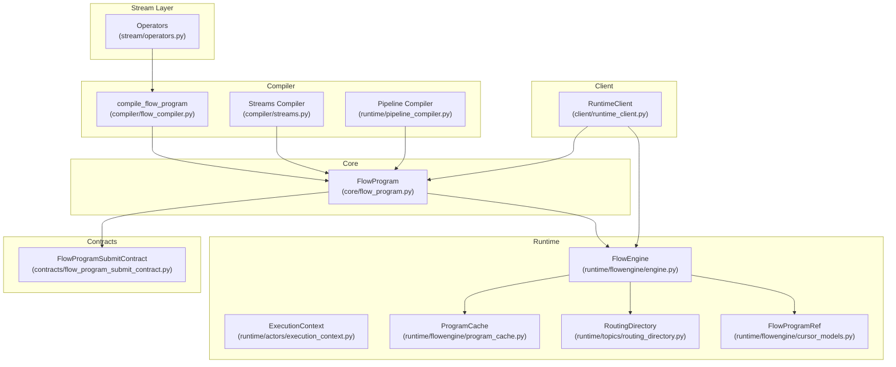
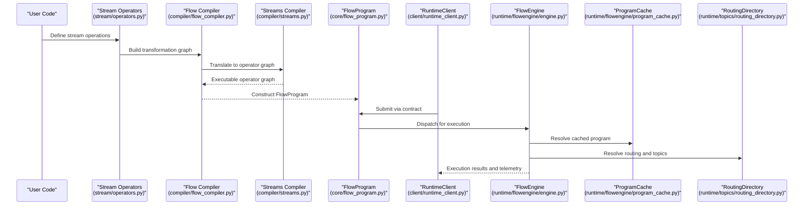
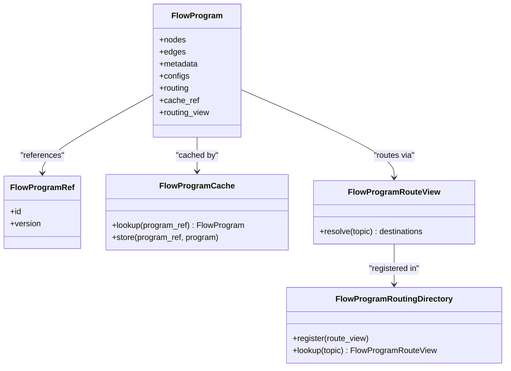
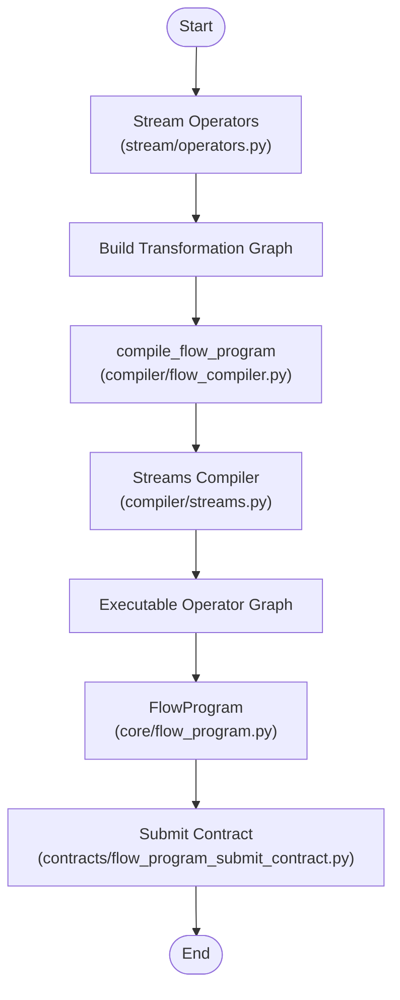
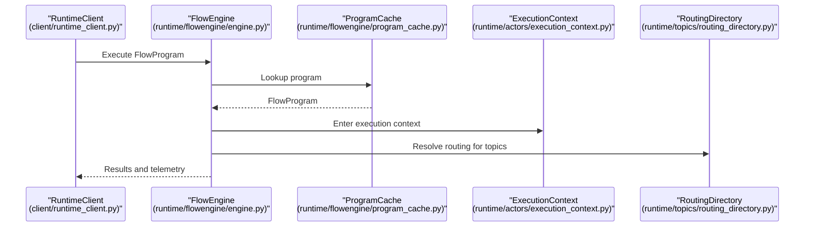
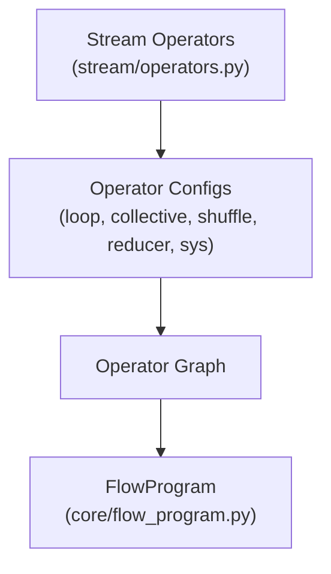
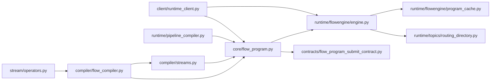

# Flow Program Representation

<cite>
**Referenced Files in This Document**
- [flow_program.py](file://src/sage/runtime/flownet/core/flow_program.py)
- [flow_compiler.py](file://src/sage/runtime/flownet/compiler/flow_compiler.py)
- [streams.py](file://src/sage/runtime/flownet/compiler/streams.py)
- [operators.py](file://src/sage/stream/operators.py)
- [engine.py](file://src/sage/runtime/flownet/runtime/flowengine/engine.py)
- [execution_context.py](file://src/sage/runtime/flownet/runtime/actors/execution_context.py)
- [runtime_client.py](file://src/sage/runtime/flownet/client/runtime_client.py)
- [flow_program_submit_contract.py](file://src/sage/runtime/flownet/contracts/flow_program_submit_contract.py)
- [cursor_models.py](file://src/sage/runtime/flownet/runtime/flowengine/cursor_models.py)
- [program_cache.py](file://src/sage/runtime/flownet/runtime/flowengine/program_cache.py)
- [routing_directory.py](file://src/sage/runtime/flownet/runtime/topics/routing_directory.py)
- [pipeline_compiler.py](file://src/sage/runtime/pipeline_compiler.py)
</cite>

## Table of Contents
1. [Introduction](#introduction)
2. [Project Structure](#project-structure)
3. [Core Components](#core-components)
4. [Architecture Overview](#architecture-overview)
5. [Detailed Component Analysis](#detailed-component-analysis)
6. [Dependency Analysis](#dependency-analysis)
7. [Performance Considerations](#performance-considerations)
8. [Troubleshooting Guide](#troubleshooting-guide)
9. [Conclusion](#conclusion)
10. [Appendices](#appendices)

## Introduction
This document explains the Flow Program Representation in the FlowNet runtime system. It focuses on the FlowProgram class as the central abstraction for streaming computations, the compilation pipeline that transforms high-level stream operations into executable programs, and the runtime mechanisms that execute, distribute, and observe these programs. It also covers execution context requirements, serialization and distribution contracts, and practical examples for building, modifying, and managing the lifecycle of flow programs.

## Project Structure
The FlowNet subsystem organizes program representation, compilation, and runtime execution under a cohesive set of modules:
- Core representation: FlowProgram definition and program-level metadata
- Compiler: DSL-to-program translation and operator graph construction
- Runtime engine: Execution orchestration, caching, and routing
- Contracts: Serialization and submission interfaces for distributed deployment
- Stream layer: High-level operators and transformations that feed into the compiler

**Diagram sources**
- [flow_program.py](file://src/sage/runtime/flownet/core/flow_program.py)
- [flow_compiler.py](file://src/sage/runtime/flownet/compiler/flow_compiler.py)
- [streams.py](file://src/sage/runtime/flownet/compiler/streams.py)
- [operators.py](file://src/sage/stream/operators.py)
- [engine.py](file://src/sage/runtime/flownet/runtime/flowengine/engine.py)
- [execution_context.py](file://src/sage/runtime/flownet/runtime/actors/execution_context.py)
- [program_cache.py](file://src/sage/runtime/flownet/runtime/flowengine/program_cache.py)
- [routing_directory.py](file://src/sage/runtime/flownet/runtime/topics/routing_directory.py)
- [cursor_models.py](file://src/sage/runtime/flownet/runtime/flowengine/cursor_models.py)
- [flow_program_submit_contract.py](file://src/sage/runtime/flownet/contracts/flow_program_submit_contract.py)
- [runtime_client.py](file://src/sage/runtime/flownet/client/runtime_client.py)
- [pipeline_compiler.py](file://src/sage/runtime/pipeline_compiler.py)

**Section sources**
- [flow_program.py](file://src/sage/runtime/flownet/core/flow_program.py)
- [flow_compiler.py](file://src/sage/runtime/flownet/compiler/flow_compiler.py)
- [streams.py](file://src/sage/runtime/flownet/compiler/streams.py)
- [operators.py](file://src/sage/stream/operators.py)
- [engine.py](file://src/sage/runtime/flownet/runtime/flowengine/engine.py)
- [execution_context.py](file://src/sage/runtime/flownet/runtime/actors/execution_context.py)
- [program_cache.py](file://src/sage/runtime/flownet/runtime/flowengine/program_cache.py)
- [routing_directory.py](file://src/sage/runtime/flownet/runtime/topics/routing_directory.py)
- [cursor_models.py](file://src/sage/runtime/flownet/runtime/flowengine/cursor_models.py)
- [flow_program_submit_contract.py](file://src/sage/runtime/flownet/contracts/flow_program_submit_contract.py)
- [runtime_client.py](file://src/sage/runtime/flownet/client/runtime_client.py)
- [pipeline_compiler.py](file://src/sage/runtime/pipeline_compiler.py)

## Core Components
- FlowProgram: Central representation of a compiled streaming computation. It encapsulates operator nodes, edges, metadata, and execution hints. See [flow_program.py](file://src/sage/runtime/flownet/core/flow_program.py).
- Compiler: Translates high-level stream operations into FlowProgram instances. The primary entry is compile_flow_program, which orchestrates stream transformations and operator graph assembly. See [flow_compiler.py](file://src/sage/runtime/flownet/compiler/flow_compiler.py) and [streams.py](file://src/sage/runtime/flownet/compiler/streams.py).
- Runtime Engine: Executes FlowPrograms, manages caches, routes messages, and resolves scopes. See [engine.py](file://src/sage/runtime/flownet/runtime/flowengine/engine.py).
- Execution Context: Provides runtime context for operators and lanes during execution. See [execution_context.py](file://src/sage/runtime/flownet/runtime/actors/execution_context.py).
- Contracts: Define serialization and submission interfaces for distributed deployment. See [flow_program_submit_contract.py](file://src/sage/runtime/flownet/contracts/flow_program_submit_contract.py).
- Client: Submits FlowPrograms and interacts with runtime services. See [runtime_client.py](file://src/sage/runtime/flownet/client/runtime_client.py).

Key responsibilities:
- Program structure: Nodes represent operators; edges represent data/control dependencies; metadata includes configs, plans, and scheduling hints.
- Operator graphs: Built from stream transformations and compiled into executable operator graphs.
- Execution metadata: Includes routing, sharding, collective and loop configurations, and system-level hints.

**Section sources**
- [flow_program.py](file://src/sage/runtime/flownet/core/flow_program.py)
- [flow_compiler.py](file://src/sage/runtime/flownet/compiler/flow_compiler.py)
- [streams.py](file://src/sage/runtime/flownet/compiler/streams.py)
- [engine.py](file://src/sage/runtime/flownet/runtime/flowengine/engine.py)
- [execution_context.py](file://src/sage/runtime/flownet/runtime/actors/execution_context.py)
- [flow_program_submit_contract.py](file://src/sage/runtime/flownet/contracts/flow_program_submit_contract.py)
- [runtime_client.py](file://src/sage/runtime/flownet/client/runtime_client.py)

## Architecture Overview
The FlowNet runtime converts high-level stream operations into executable FlowPrograms, which are then executed by the FlowEngine under an ExecutionContext. Distributed submission and observation rely on contracts and client-side APIs.

**Diagram sources**
- [operators.py](file://src/sage/stream/operators.py)
- [flow_compiler.py](file://src/sage/runtime/flownet/compiler/flow_compiler.py)
- [streams.py](file://src/sage/runtime/flownet/compiler/streams.py)
- [flow_program.py](file://src/sage/runtime/flownet/core/flow_program.py)
- [runtime_client.py](file://src/sage/runtime/flownet/client/runtime_client.py)
- [engine.py](file://src/sage/runtime/flownet/runtime/flowengine/engine.py)
- [program_cache.py](file://src/sage/runtime/flownet/runtime/flowengine/program_cache.py)
- [routing_directory.py](file://src/sage/runtime/flownet/runtime/topics/routing_directory.py)

## Detailed Component Analysis

### FlowProgram: Central Representation of Streaming Computations
FlowProgram is the core data structure representing a compiled streaming program. It captures:
- Operator nodes and edges forming an operator graph
- Execution metadata such as routing, sharding, loop and collective configurations
- System-level hints and plan metadata
- References to program cache entries and routing views

**Diagram sources**
- [flow_program.py](file://src/sage/runtime/flownet/core/flow_program.py)
- [cursor_models.py](file://src/sage/runtime/flownet/runtime/flowengine/cursor_models.py)
- [program_cache.py](file://src/sage/runtime/flownet/runtime/flowengine/program_cache.py)
- [routing_directory.py](file://src/sage/runtime/flownet/runtime/topics/routing_directory.py)

Practical usage patterns:
- Construction: Build from compiled operator graphs produced by the compiler.
- Modification: Adjust metadata, routing, and configs prior to submission.
- Execution lifecycle: Submit via runtime client, resolve cache, route topics, and execute.

**Section sources**
- [flow_program.py](file://src/sage/runtime/flownet/core/flow_program.py)
- [cursor_models.py](file://src/sage/runtime/flownet/runtime/flowengine/cursor_models.py)
- [program_cache.py](file://src/sage/runtime/flownet/runtime/flowengine/program_cache.py)
- [routing_directory.py](file://src/sage/runtime/flownet/runtime/topics/routing_directory.py)

### Compilation Pipeline: From Stream Operations to Executable Programs
The compilation pipeline transforms high-level stream operations into executable FlowPrograms:
- Stream operators define transformations and configurations.
- The flow compiler orchestrates compilation and produces a FlowProgram.
- The streams compiler constructs the operator graph and injects operator configurations (loop, collective, shuffle, reducer, sys).

**Diagram sources**
- [operators.py](file://src/sage/stream/operators.py)
- [flow_compiler.py](file://src/sage/runtime/flownet/compiler/flow_compiler.py)
- [streams.py](file://src/sage/runtime/flownet/compiler/streams.py)
- [flow_program.py](file://src/sage/runtime/flownet/core/flow_program.py)
- [flow_program_submit_contract.py](file://src/sage/runtime/flownet/contracts/flow_program_submit_contract.py)

Key steps:
- Transformations capture operator configurations (e.g., loop meta, collective meta, shuffle/reducer hints).
- Operator configs are canonicalized and injected into the operator graph.
- The resulting FlowProgram is ready for submission and execution.

**Section sources**
- [operators.py](file://src/sage/stream/operators.py)
- [flow_compiler.py](file://src/sage/runtime/flownet/compiler/flow_compiler.py)
- [streams.py](file://src/sage/runtime/flownet/compiler/streams.py)
- [flow_program.py](file://src/sage/runtime/flownet/core/flow_program.py)
- [flow_program_submit_contract.py](file://src/sage/runtime/flownet/contracts/flow_program_submit_contract.py)

### Execution Context and Runtime Orchestration
Execution occurs under an ExecutionContext, which provides operator execution lanes and runtime context. The FlowEngine coordinates execution, cache resolution, and routing.

**Diagram sources**
- [runtime_client.py](file://src/sage/runtime/flownet/client/runtime_client.py)
- [engine.py](file://src/sage/runtime/flownet/runtime/flowengine/engine.py)
- [program_cache.py](file://src/sage/runtime/flownet/runtime/flowengine/program_cache.py)
- [execution_context.py](file://src/sage/runtime/flownet/runtime/actors/execution_context.py)
- [routing_directory.py](file://src/sage/runtime/flownet/runtime/topics/routing_directory.py)

**Section sources**
- [runtime_client.py](file://src/sage/runtime/flownet/client/runtime_client.py)
- [engine.py](file://src/sage/runtime/flownet/runtime/flowengine/engine.py)
- [program_cache.py](file://src/sage/runtime/flownet/runtime/flowengine/program_cache.py)
- [execution_context.py](file://src/sage/runtime/flownet/runtime/actors/execution_context.py)
- [routing_directory.py](file://src/sage/runtime/flownet/runtime/topics/routing_directory.py)

### Relationship Between Flow Programs and Stream Layer Operators
High-level stream operations are translated into executable operator graphs:
- Operators define functional units and configuration slots.
- The streams compiler attaches operator-specific configs (loop, collective, shuffle, reducer, sys).
- The resulting operator graph becomes the FlowProgram’s node and edge sets.

**Diagram sources**
- [operators.py](file://src/sage/stream/operators.py)
- [streams.py](file://src/sage/runtime/flownet/compiler/streams.py)
- [flow_program.py](file://src/sage/runtime/flownet/core/flow_program.py)

**Section sources**
- [operators.py](file://src/sage/stream/operators.py)
- [streams.py](file://src/sage/runtime/flownet/compiler/streams.py)
- [flow_program.py](file://src/sage/runtime/flownet/core/flow_program.py)

### Practical Examples: Program Construction, Modification, and Lifecycle Management
- Program construction: Use the compiler to produce a FlowProgram from stream transformations. See [flow_compiler.py](file://src/sage/runtime/flownet/compiler/flow_compiler.py) and [streams.py](file://src/sage/runtime/flownet/compiler/streams.py).
- Program modification: Adjust operator configs and metadata before submission. See operator config injection in [streams.py](file://src/sage/runtime/flownet/compiler/streams.py).
- Submission lifecycle: Submit via runtime client and observe execution via contracts. See [runtime_client.py](file://src/sage/runtime/flownet/client/runtime_client.py) and [flow_program_submit_contract.py](file://src/sage/runtime/flownet/contracts/flow_program_submit_contract.py).
- Execution lifecycle: Enter execution context, resolve cache, route topics, and collect results. See [engine.py](file://src/sage/runtime/flownet/runtime/flowengine/engine.py) and [execution_context.py](file://src/sage/runtime/flownet/runtime/actors/execution_context.py).

**Section sources**
- [flow_compiler.py](file://src/sage/runtime/flownet/compiler/flow_compiler.py)
- [streams.py](file://src/sage/runtime/flownet/compiler/streams.py)
- [runtime_client.py](file://src/sage/runtime/flownet/client/runtime_client.py)
- [flow_program_submit_contract.py](file://src/sage/runtime/flownet/contracts/flow_program_submit_contract.py)
- [engine.py](file://src/sage/runtime/flownet/runtime/flowengine/engine.py)
- [execution_context.py](file://src/sage/runtime/flownet/runtime/actors/execution_context.py)

## Dependency Analysis
The FlowNet subsystem exhibits layered dependencies:
- Stream layer depends on compiler to produce operator graphs
- Compiler depends on core FlowProgram and streams compiler
- Runtime engine depends on FlowProgram, cache, and routing
- Client depends on contracts and runtime engine
- Pipeline compiler integrates higher-level pipelines into actor graphs

**Diagram sources**
- [operators.py](file://src/sage/stream/operators.py)
- [flow_compiler.py](file://src/sage/runtime/flownet/compiler/flow_compiler.py)
- [streams.py](file://src/sage/runtime/flownet/compiler/streams.py)
- [flow_program.py](file://src/sage/runtime/flownet/core/flow_program.py)
- [pipeline_compiler.py](file://src/sage/runtime/pipeline_compiler.py)
- [engine.py](file://src/sage/runtime/flownet/runtime/flowengine/engine.py)
- [program_cache.py](file://src/sage/runtime/flownet/runtime/flowengine/program_cache.py)
- [routing_directory.py](file://src/sage/runtime/flownet/runtime/topics/routing_directory.py)
- [flow_program_submit_contract.py](file://src/sage/runtime/flownet/contracts/flow_program_submit_contract.py)
- [runtime_client.py](file://src/sage/runtime/flownet/client/runtime_client.py)

**Section sources**
- [operators.py](file://src/sage/stream/operators.py)
- [flow_compiler.py](file://src/sage/runtime/flownet/compiler/flow_compiler.py)
- [streams.py](file://src/sage/runtime/flownet/compiler/streams.py)
- [flow_program.py](file://src/sage/runtime/flownet/core/flow_program.py)
- [pipeline_compiler.py](file://src/sage/runtime/pipeline_compiler.py)
- [engine.py](file://src/sage/runtime/flownet/runtime/flowengine/engine.py)
- [program_cache.py](file://src/sage/runtime/flownet/runtime/flowengine/program_cache.py)
- [routing_directory.py](file://src/sage/runtime/flownet/runtime/topics/routing_directory.py)
- [flow_program_submit_contract.py](file://src/sage/runtime/flownet/contracts/flow_program_submit_contract.py)
- [runtime_client.py](file://src/sage/runtime/flownet/client/runtime_client.py)

## Performance Considerations
- Operator graph optimization: Minimize redundant edges and optimize sharding/reducer configurations to reduce cross-node communication.
- Caching: Use ProgramCache to avoid recompilation and redeployment of identical programs.
- Routing: Leverage RoutingDirectory to efficiently resolve topic destinations and reduce lookup overhead.
- Memory management: ExecutionContext controls operator lanes and memory boundaries; tune parallelism and buffer sizes according to workload characteristics.
- Serialization: Ensure operator configs and metadata are compact and canonicalized to reduce payload sizes during submission.

[No sources needed since this section provides general guidance]

## Troubleshooting Guide
Common issues and remedies:
- Compilation failures: Verify operator configs and ensure transformations are well-formed. Check the streams compiler for operator config injection and canonicalization. See [streams.py](file://src/sage/runtime/flownet/compiler/streams.py).
- Submission errors: Confirm FlowProgramSubmitContract compliance and payload correctness. See [flow_program_submit_contract.py](file://src/sage/runtime/flownet/contracts/flow_program_submit_contract.py).
- Execution errors: Inspect ExecutionContext for lane allocation and operator runtime logs. See [execution_context.py](file://src/sage/runtime/flownet/runtime/actors/execution_context.py).
- Routing problems: Validate RoutingDirectory registration and topic resolution. See [routing_directory.py](file://src/sage/runtime/flownet/runtime/topics/routing_directory.py).
- Program lookup misses: Confirm ProgramCache entries and references. See [program_cache.py](file://src/sage/runtime/flownet/runtime/flowengine/program_cache.py).

**Section sources**
- [streams.py](file://src/sage/runtime/flownet/compiler/streams.py)
- [flow_program_submit_contract.py](file://src/sage/runtime/flownet/contracts/flow_program_submit_contract.py)
- [execution_context.py](file://src/sage/runtime/flownet/runtime/actors/execution_context.py)
- [routing_directory.py](file://src/sage/runtime/flownet/runtime/topics/routing_directory.py)
- [program_cache.py](file://src/sage/runtime/flownet/runtime/flowengine/program_cache.py)

## Conclusion
FlowProgram serves as the central abstraction for streaming computations in FlowNet, bridging high-level stream operations and low-level runtime execution. The compilation pipeline transforms stream transformations into executable operator graphs, while the runtime engine orchestrates execution, caching, and routing. Contracts and client APIs enable distributed submission and observation. By understanding FlowProgram’s structure, the compilation pipeline, and runtime orchestration, developers can construct, optimize, and debug flow programs effectively.

[No sources needed since this section summarizes without analyzing specific files]

## Appendices
- Additional runtime utilities: Pipeline compiler integrates higher-level pipelines into actor graphs. See [pipeline_compiler.py](file://src/sage/runtime/pipeline_compiler.py).
- Client-side program inspection and handles: Runtime client supports program inspection and handle management. See [runtime_client.py](file://src/sage/runtime/flownet/client/runtime_client.py).

**Section sources**
- [pipeline_compiler.py](file://src/sage/runtime/pipeline_compiler.py)
- [runtime_client.py](file://src/sage/runtime/flownet/client/runtime_client.py)