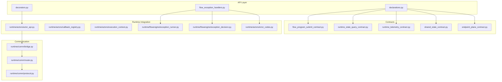
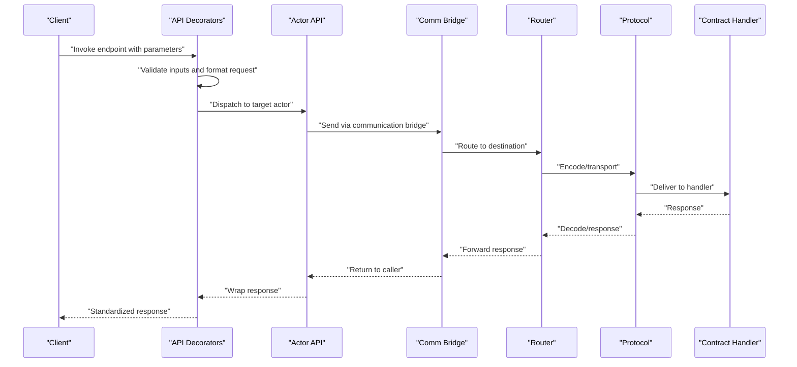
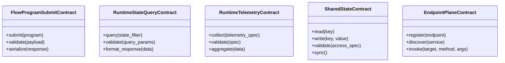
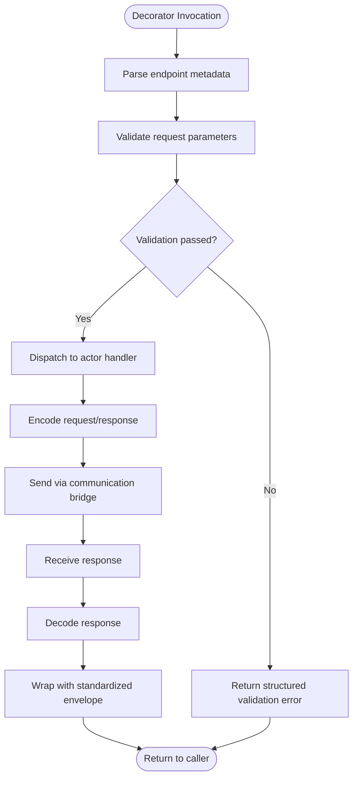
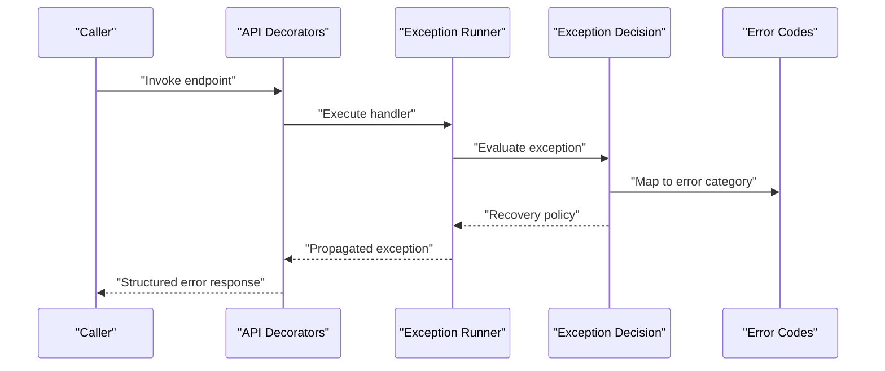
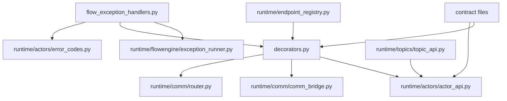

# FlowNet API Layer

<cite>
**Referenced Files in This Document**
- [declarations.py](file://src/sage/runtime/flownet/api/declarations.py)
- [decorators.py](file://src/sage/runtime/flownet/api/decorators.py)
- [flow_exception_handlers.py](file://src/sage/runtime/flownet/api/flow_exception_handlers.py)
- [flow_program_submit_contract.py](file://src/sage/runtime/flownet/contracts/flow_program_submit_contract.py)
- [runtime_state_query_contract.py](file://src/sage/runtime/flownet/contracts/runtime_state_query_contract.py)
- [runtime_telemetry_contract.py](file://src/sage/runtime/flownet/contracts/runtime_telemetry_contract.py)
- [shared_state_contract.py](file://src/sage/runtime/flownet/contracts/shared_state_contract.py)
- [endpoint_plane_contract.py](file://src/sage/runtime/flownet/contracts/endpoint_plane_contract.py)
- [actor_api.py](file://src/sage/runtime/flownet/runtime/actors/actor_api.py)
- [comm_bridge.py](file://src/sage/runtime/flownet/runtime/comm/comm_bridge.py)
- [router.py](file://src/sage/runtime/flownet/runtime/comm/router.py)
- [protocol.py](file://src/sage/runtime/flownet/runtime/comm/protocol.py)
- [error_codes.py](file://src/sage/runtime/flownet/runtime/actors/error_codes.py)
- [exception_runner.py](file://src/sage/runtime/flownet/runtime/flowengine/exception_runner.py)
- [exception_decision.py](file://src/sage/runtime/flownet/runtime/flowengine/exception_decision.py)
- [topic_api.py](file://src/sage/runtime/flownet/runtime/topics/topic_api.py)
- [callback_registry.py](file://src/sage/runtime/flownet/runtime/actors/callback_registry.py)
- [execution_context.py](file://src/sage/runtime/flownet/runtime/actors/execution_context.py)
- [registry.py](file://src/sage/runtime/flownet/runtime/endpoint_registry.py)
- [session.py](file://src/sage/runtime/flownet/client/session.py)
- [runtime_client.py](file://src/sage/runtime/flownet/client/runtime_client.py)
- [cluster_context.py](file://src/sage/runtime/flownet/client/cluster_context.py)
</cite>

## Table of Contents
1. [Introduction](#introduction)
2. [Project Structure](#project-structure)
3. [Core Components](#core-components)
4. [Architecture Overview](#architecture-overview)
5. [Detailed Component Analysis](#detailed-component-analysis)
6. [Dependency Analysis](#dependency-analysis)
7. [Performance Considerations](#performance-considerations)
8. [Troubleshooting Guide](#troubleshooting-guide)
9. [Conclusion](#conclusion)

## Introduction
The FlowNet API Layer defines the contract-based interface surface for distributed service interactions within the FlowNet runtime system. It establishes standardized contracts for submitting flow programs, querying runtime state, collecting telemetry, and managing shared state. The layer also provides a decorator system for declaring API endpoints, validating parameters, and formatting responses, alongside a robust exception handling framework that enables distributed error propagation and recovery across nodes.

## Project Structure
The API layer is organized around three primary areas:
- Contract definitions: formal specifications for distributed operations
- Decorator system: endpoint declaration, validation, and response formatting
- Exception handling: distributed error propagation and recovery strategies

**Diagram sources**
- [declarations.py](file://src/sage/runtime/flownet/api/declarations.py)
- [decorators.py](file://src/sage/runtime/flownet/api/decorators.py)
- [flow_exception_handlers.py](file://src/sage/runtime/flownet/api/flow_exception_handlers.py)
- [flow_program_submit_contract.py](file://src/sage/runtime/flownet/contracts/flow_program_submit_contract.py)
- [runtime_state_query_contract.py](file://src/sage/runtime/flownet/contracts/runtime_state_query_contract.py)
- [runtime_telemetry_contract.py](file://src/sage/runtime/flownet/contracts/runtime_telemetry_contract.py)
- [shared_state_contract.py](file://src/sage/runtime/flownet/contracts/shared_state_contract.py)
- [endpoint_plane_contract.py](file://src/sage/runtime/flownet/contracts/endpoint_plane_contract.py)
- [actor_api.py](file://src/sage/runtime/flownet/runtime/actors/actor_api.py)
- [comm_bridge.py](file://src/sage/runtime/flownet/runtime/comm/comm_bridge.py)
- [router.py](file://src/sage/runtime/flownet/runtime/comm/router.py)
- [protocol.py](file://src/sage/runtime/flownet/runtime/comm/protocol.py)

**Section sources**
- [declarations.py](file://src/sage/runtime/flownet/api/declarations.py)
- [decorators.py](file://src/sage/runtime/flownet/api/decorators.py)
- [flow_exception_handlers.py](file://src/sage/runtime/flownet/api/flow_exception_handlers.py)

## Core Components
This section documents the foundational contracts and the decorator-driven endpoint system that underpin the API layer.

- FlowProgramSubmitContract: Defines the contract for submitting flow programs to the runtime. It specifies the submission interface, payload structure, and expected outcomes.
- RuntimeStateQueryContract: Specifies the interface for querying runtime state, including execution status, resource utilization, and operational metrics.
- RuntimeTelemetryContract: Establishes the contract for collecting telemetry data from runtime components, enabling observability and monitoring.
- SharedStateContract: Provides the contract for managing shared state across distributed nodes, including read/write operations and synchronization semantics.
- Endpoint Plane Contract: Describes the communication plane for endpoint registration, discovery, and invocation across the distributed system.

Key decorator capabilities:
- Endpoint declaration: Decorators mark methods as API endpoints with metadata such as path, method, and serialization preferences.
- Parameter validation: Built-in validators enforce type constraints, presence checks, and custom validation rules for incoming requests.
- Response formatting: Decorators standardize response envelopes, including status codes, error payloads, and structured data wrappers.

Exception handling framework:
- Distributed error propagation: Exceptions raised in remote endpoints are serialized and propagated back to callers with contextual metadata.
- Recovery strategies: The framework supports retry policies, fallback handlers, and circuit breaker behaviors to improve resilience.
- Error categorization: Error codes and classifications enable targeted recovery actions and diagnostics.

**Section sources**
- [flow_program_submit_contract.py](file://src/sage/runtime/flownet/contracts/flow_program_submit_contract.py)
- [runtime_state_query_contract.py](file://src/sage/runtime/flownet/contracts/runtime_state_query_contract.py)
- [runtime_telemetry_contract.py](file://src/sage/runtime/flownet/contracts/runtime_telemetry_contract.py)
- [shared_state_contract.py](file://src/sage/runtime/flownet/contracts/shared_state_contract.py)
- [endpoint_plane_contract.py](file://src/sage/runtime/flownet/contracts/endpoint_plane_contract.py)
- [decorators.py](file://src/sage/runtime/flownet/api/decorators.py)
- [flow_exception_handlers.py](file://src/sage/runtime/flownet/api/flow_exception_handlers.py)

## Architecture Overview
The API layer integrates with runtime actors and the communication subsystem to deliver a cohesive distributed service interface. The flow below illustrates how a client request traverses the system:

**Diagram sources**
- [decorators.py](file://src/sage/runtime/flownet/api/decorators.py)
- [actor_api.py](file://src/sage/runtime/flownet/runtime/actors/actor_api.py)
- [comm_bridge.py](file://src/sage/runtime/flownet/runtime/comm/comm_bridge.py)
- [router.py](file://src/sage/runtime/flownet/runtime/comm/router.py)
- [protocol.py](file://src/sage/runtime/flownet/runtime/comm/protocol.py)
- [flow_program_submit_contract.py](file://src/sage/runtime/flownet/contracts/flow_program_submit_contract.py)

## Detailed Component Analysis

### Contract Definitions
The contract files define the canonical interfaces for distributed operations. Each contract encapsulates:
- Request/response schemas
- Validation rules
- Error semantics
- Serialization formats

**Diagram sources**
- [flow_program_submit_contract.py](file://src/sage/runtime/flownet/contracts/flow_program_submit_contract.py)
- [runtime_state_query_contract.py](file://src/sage/runtime/flownet/contracts/runtime_state_query_contract.py)
- [runtime_telemetry_contract.py](file://src/sage/runtime/flownet/contracts/runtime_telemetry_contract.py)
- [shared_state_contract.py](file://src/sage/runtime/flownet/contracts/shared_state_contract.py)
- [endpoint_plane_contract.py](file://src/sage/runtime/flownet/contracts/endpoint_plane_contract.py)

**Section sources**
- [flow_program_submit_contract.py](file://src/sage/runtime/flownet/contracts/flow_program_submit_contract.py)
- [runtime_state_query_contract.py](file://src/sage/runtime/flownet/contracts/runtime_state_query_contract.py)
- [runtime_telemetry_contract.py](file://src/sage/runtime/flownet/contracts/runtime_telemetry_contract.py)
- [shared_state_contract.py](file://src/sage/runtime/flownet/contracts/shared_state_contract.py)
- [endpoint_plane_contract.py](file://src/sage/runtime/flownet/contracts/endpoint_plane_contract.py)

### Decorator System
The decorator system provides a unified mechanism for:
- Declaring endpoints with metadata
- Validating request parameters
- Formatting responses consistently
- Integrating with the runtime actor dispatch mechanism

**Diagram sources**
- [decorators.py](file://src/sage/runtime/flownet/api/decorators.py)
- [actor_api.py](file://src/sage/runtime/flownet/runtime/actors/actor_api.py)
- [comm_bridge.py](file://src/sage/runtime/flownet/runtime/comm/comm_bridge.py)

**Section sources**
- [decorators.py](file://src/sage/runtime/flownet/api/decorators.py)
- [actor_api.py](file://src/sage/runtime/flownet/runtime/actors/actor_api.py)

### Exception Handling Framework
Distributed exceptions are handled through a coordinated framework:
- Exception serialization and propagation
- Local and global recovery strategies
- Error classification and remediation actions

**Diagram sources**
- [flow_exception_handlers.py](file://src/sage/runtime/flownet/api/flow_exception_handlers.py)
- [exception_runner.py](file://src/sage/runtime/flownet/runtime/flowengine/exception_runner.py)
- [exception_decision.py](file://src/sage/runtime/flownet/runtime/flowengine/exception_decision.py)
- [error_codes.py](file://src/sage/runtime/flownet/runtime/actors/error_codes.py)

**Section sources**
- [flow_exception_handlers.py](file://src/sage/runtime/flownet/api/flow_exception_handlers.py)
- [exception_runner.py](file://src/sage/runtime/flownet/runtime/flowengine/exception_runner.py)
- [exception_decision.py](file://src/sage/runtime/flownet/runtime/flowengine/exception_decision.py)
- [error_codes.py](file://src/sage/runtime/flownet/runtime/actors/error_codes.py)

### Practical Examples
Below are conceptual examples demonstrating how to define custom API endpoints, implement contract handlers, and handle distributed exceptions. These examples illustrate integration patterns without exposing code content.

- Define a custom endpoint:
  - Use the decorator system to declare an endpoint with metadata such as path, method, and serialization preferences.
  - Apply parameter validation decorators to enforce type constraints and presence checks.
  - Implement a handler that interacts with runtime actors and returns a standardized response envelope.

- Implement a contract handler:
  - Implement the contract’s request/response schema and validation rules.
  - Integrate with the runtime actor dispatch mechanism to execute operations.
  - Ensure proper error handling and return structured error responses when exceptions occur.

- Handle distributed exceptions:
  - Configure the exception runner to evaluate exceptions and apply recovery policies.
  - Map exceptions to error categories and select appropriate remediation actions.
  - Propagate exceptions back to callers with contextual metadata for diagnostics.

**Section sources**
- [decorators.py](file://src/sage/runtime/flownet/api/decorators.py)
- [flow_exception_handlers.py](file://src/sage/runtime/flownet/api/flow_exception_handlers.py)
- [flow_program_submit_contract.py](file://src/sage/runtime/flownet/contracts/flow_program_submit_contract.py)
- [runtime_state_query_contract.py](file://src/sage/runtime/flownet/contracts/runtime_state_query_contract.py)
- [runtime_telemetry_contract.py](file://src/sage/runtime/flownet/contracts/runtime_telemetry_contract.py)
- [shared_state_contract.py](file://src/sage/runtime/flownet/contracts/shared_state_contract.py)

## Dependency Analysis
The API layer depends on runtime actors and the communication subsystem for execution and transport. The diagram below highlights key dependencies:

**Diagram sources**
- [decorators.py](file://src/sage/runtime/flownet/api/decorators.py)
- [actor_api.py](file://src/sage/runtime/flownet/runtime/actors/actor_api.py)
- [comm_bridge.py](file://src/sage/runtime/flownet/runtime/comm/comm_bridge.py)
- [router.py](file://src/sage/runtime/flownet/runtime/comm/router.py)
- [flow_exception_handlers.py](file://src/sage/runtime/flownet/api/flow_exception_handlers.py)
- [exception_runner.py](file://src/sage/runtime/flownet/runtime/flowengine/exception_runner.py)
- [error_codes.py](file://src/sage/runtime/flownet/runtime/actors/error_codes.py)
- [topic_api.py](file://src/sage/runtime/flownet/runtime/topics/topic_api.py)
- [registry.py](file://src/sage/runtime/flownet/runtime/endpoint_registry.py)

**Section sources**
- [decorators.py](file://src/sage/runtime/flownet/api/decorators.py)
- [flow_exception_handlers.py](file://src/sage/runtime/flownet/api/flow_exception_handlers.py)
- [actor_api.py](file://src/sage/runtime/flownet/runtime/actors/actor_api.py)
- [comm_bridge.py](file://src/sage/runtime/flownet/runtime/comm/comm_bridge.py)
- [router.py](file://src/sage/runtime/flownet/runtime/comm/router.py)
- [exception_runner.py](file://src/sage/runtime/flownet/runtime/flowengine/exception_runner.py)
- [error_codes.py](file://src/sage/runtime/flownet/runtime/actors/error_codes.py)
- [topic_api.py](file://src/sage/runtime/flownet/runtime/topics/topic_api.py)
- [registry.py](file://src/sage/runtime/flownet/runtime/endpoint_registry.py)

## Performance Considerations
- Minimize serialization overhead by using compact request/response schemas aligned with the contracts.
- Leverage batching and streaming where applicable to reduce network round trips.
- Apply caching strategies for frequently accessed runtime state and telemetry data.
- Tune communication parameters (timeouts, retries, backoff) to balance responsiveness and reliability.

## Troubleshooting Guide
Common issues and resolutions:
- Validation failures: Review parameter validation rules and adjust request payloads to match contract schemas.
- Communication errors: Verify endpoint registration and routing configurations; ensure the communication bridge and router are functioning correctly.
- Exception propagation: Inspect exception runner logs and error categories to identify recovery opportunities and remediation actions.
- Diagnostics: Use telemetry and state query endpoints to gather runtime metrics and troubleshoot performance bottlenecks.

**Section sources**
- [decorators.py](file://src/sage/runtime/flownet/api/decorators.py)
- [flow_exception_handlers.py](file://src/sage/runtime/flownet/api/flow_exception_handlers.py)
- [comm_bridge.py](file://src/sage/runtime/flownet/runtime/comm/comm_bridge.py)
- [router.py](file://src/sage/runtime/flownet/runtime/comm/router.py)
- [exception_runner.py](file://src/sage/runtime/flownet/runtime/flowengine/exception_runner.py)
- [error_codes.py](file://src/sage/runtime/flownet/runtime/actors/error_codes.py)

## Conclusion
The FlowNet API Layer provides a contract-first, decorator-driven foundation for distributed service interactions. By standardizing endpoint definitions, parameter validation, response formatting, and exception handling, it enables reliable and maintainable integration with runtime actors and the communication system. The documented contracts and integration patterns offer a clear path for extending the API layer with new endpoints and handlers while preserving consistency and resilience across the distributed runtime.