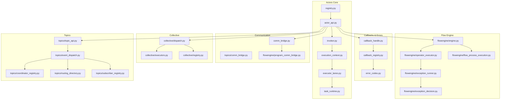
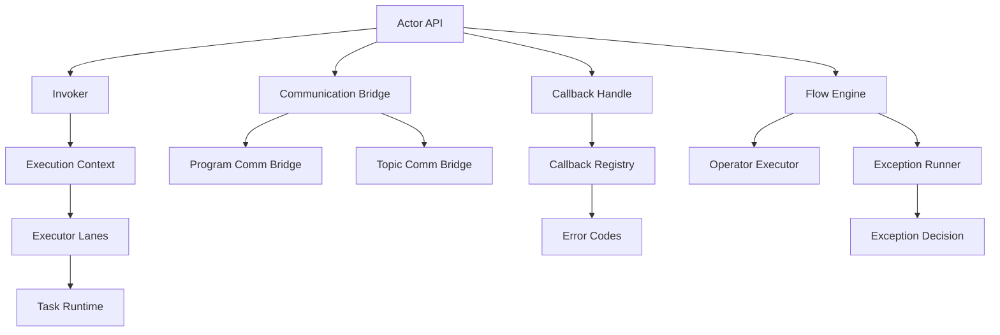
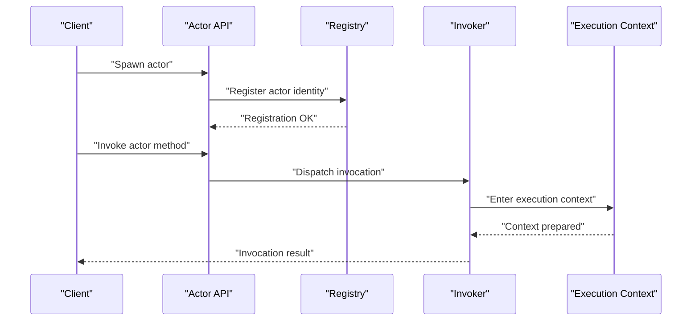
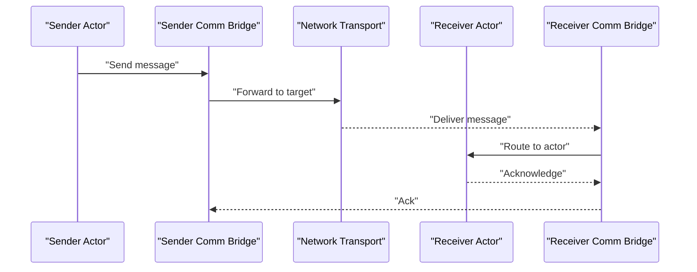
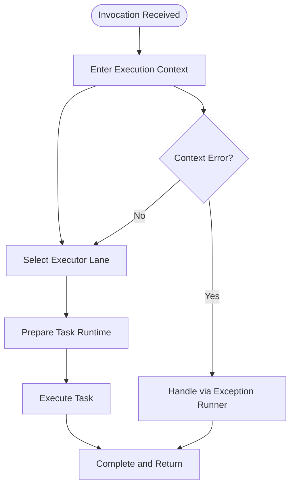
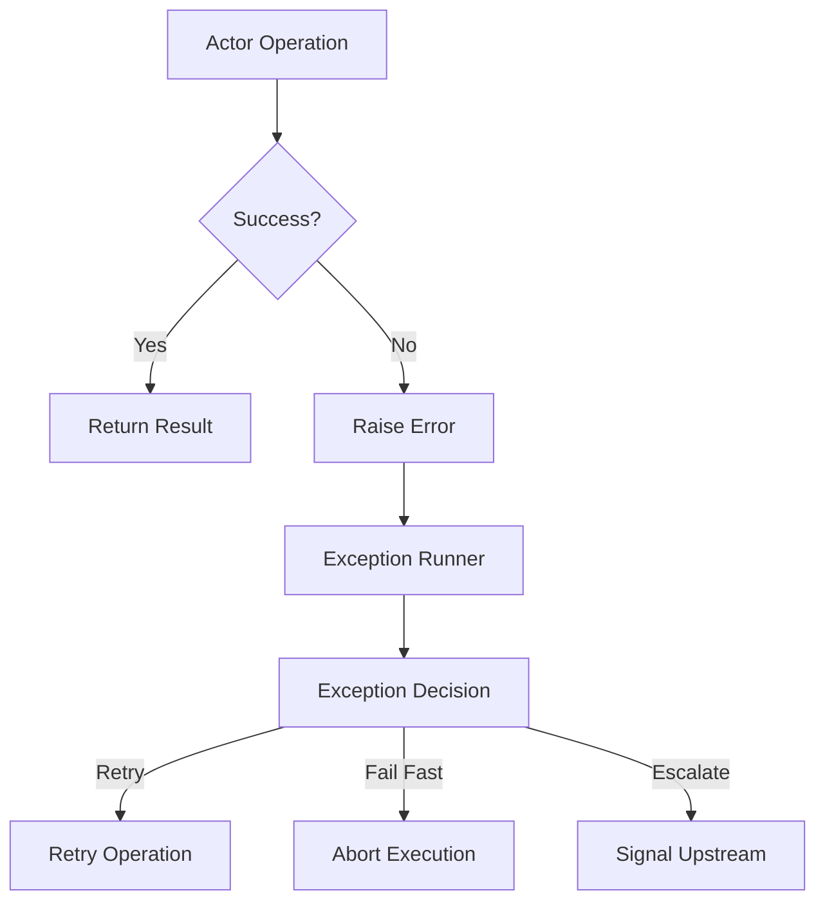
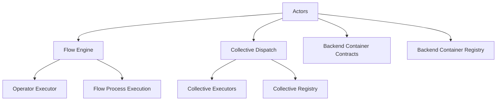
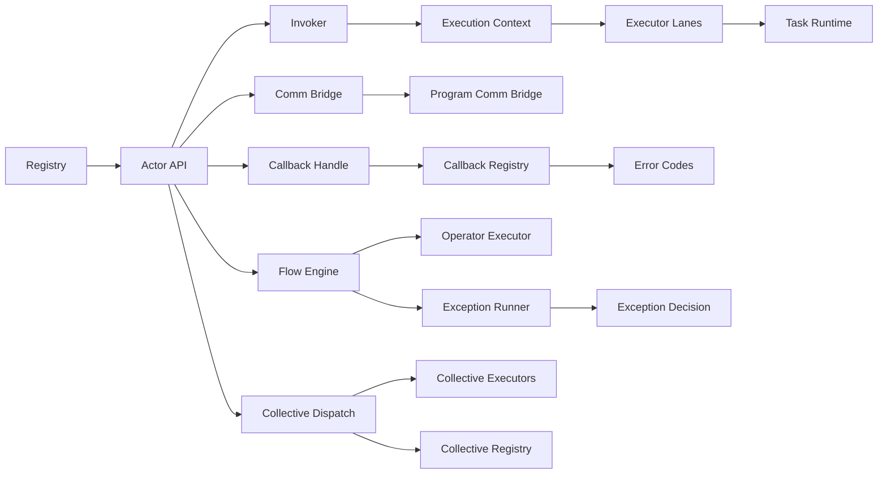

# Runtime Actors and Execution

<cite>
**Referenced Files in This Document**
- [actor_api.py](file://src/sage/runtime/flownet/runtime/actors/actor_api.py)
- [callback_handle.py](file://src/sage/runtime/flownet/runtime/actors/callback_handle.py)
- [callback_registry.py](file://src/sage/runtime/flownet/runtime/actors/callback_registry.py)
- [comm_bridge.py](file://src/sage/runtime/flownet/runtime/actors/comm_bridge.py)
- [error_codes.py](file://src/sage/runtime/flownet/runtime/actors/error_codes.py)
- [execution_context.py](file://src/sage/runtime/flownet/runtime/actors/execution_context.py)
- [executor_lanes.py](file://src/sage/runtime/flownet/runtime/actors/executor_lanes.py)
- [invoker.py](file://src/sage/runtime/flownet/runtime/actors/invoker.py)
- [registry.py](file://src/sage/runtime/flownet/runtime/actors/registry.py)
- [task_runtime.py](file://src/sage/runtime/flownet/runtime/actors/task_runtime.py)
- [runtime.py](file://src/sage/runtime/flownet/runtime/runtime.py)
- [engine.py](file://src/sage/runtime/flownet/runtime/flowengine/engine.py)
- [operator_executor.py](file://src/sage/runtime/flownet/runtime/flowengine/operator_executor.py)
- [program_comm_bridge.py](file://src/sage/runtime/flownet/runtime/flowengine/program_comm_bridge.py)
- [cursor_models.py](file://src/sage/runtime/flownet/runtime/flowengine/cursor_models.py)
- [cursor_ctx.py](file://src/sage/runtime/flownet/runtime/flowengine/cursor_ctx.py)
- [exception_runner.py](file://src/sage/runtime/flownet/runtime/flowengine/exception_runner.py)
- [exception_decision.py](file://src/sage/runtime/flownet/runtime/flowengine/exception_decision.py)
- [flow_process_execution.py](file://src/sage/runtime/flownet/runtime/flowengine/flow_process_execution.py)
- [topic_api.py](file://src/sage/runtime/flownet/runtime/topics/topic_api.py)
- [event_dispatch.py](file://src/sage/runtime/flownet/runtime/topics/event_dispatch.py)
- [coordinator_registry.py](file://src/sage/runtime/flownet/runtime/topics/coordinator_registry.py)
- [routing_directory.py](file://src/sage/runtime/flownet/runtime/topics/routing_directory.py)
- [subscriber_registry.py](file://src/sage/runtime/flownet/runtime/topics/subscriber_registry.py)
- [comm_bridge.py](file://src/sage/runtime/flownet/runtime/topics/comm_bridge.py)
- [backend_container/contracts.py](file://src/sage/runtime/flownet/runtime/backend_container/contracts.py)
- [backend_container/registry.py](file://src/sage/runtime/flownet/runtime/backend_container/registry.py)
- [collective/executors.py](file://src/sage/runtime/flownet/runtime/collective/executors.py)
- [collective/dispatch.py](file://src/sage/runtime/flownet/runtime/collective/dispatch.py)
- [collective/registry.py](file://src/sage/runtime/flownet/runtime/collective/registry.py)
- [collective/contracts.py](file://src/sage/runtime/flownet/runtime/collective/contracts.py)
</cite>

## Table of Contents
1. [Introduction](#introduction)
2. [Project Structure](#project-structure)
3. [Core Components](#core-components)
4. [Architecture Overview](#architecture-overview)
5. [Detailed Component Analysis](#detailed-component-analysis)
6. [Dependency Analysis](#dependency-analysis)
7. [Performance Considerations](#performance-considerations)
8. [Troubleshooting Guide](#troubleshooting-guide)
9. [Conclusion](#conclusion)

## Introduction
This document explains the Runtime Actors and Execution subsystem that underpins FlowNet’s actor-based distributed execution model. It covers actor registration, lifecycle management, inter-actor communication, execution contexts, executor lanes, callback registries, and error handling. It also demonstrates how actors integrate with the broader FlowNet runtime, including the flow engine and collective execution patterns.

## Project Structure
The Runtime Actors subsystem resides under the FlowNet runtime package and is composed of:
- Actor core: registration, lifecycle, invocation, and execution context
- Communication: inter-actor messaging via a communication bridge
- Callback system: callback handles and registry for asynchronous operations
- Error handling: error codes and exception handling integrated with the flow engine
- Collective execution: coordination across nodes and dispatch strategies
- Topics: event-driven workflows and routing



**Diagram sources**
- [registry.py](file://src/sage/runtime/flownet/runtime/actors/registry.py)
- [actor_api.py](file://src/sage/runtime/flownet/runtime/actors/actor_api.py)
- [invoker.py](file://src/sage/runtime/flownet/runtime/actors/invoker.py)
- [execution_context.py](file://src/sage/runtime/flownet/runtime/actors/execution_context.py)
- [executor_lanes.py](file://src/sage/runtime/flownet/runtime/actors/executor_lanes.py)
- [task_runtime.py](file://src/sage/runtime/flownet/runtime/actors/task_runtime.py)
- [comm_bridge.py](file://src/sage/runtime/flownet/runtime/actors/comm_bridge.py)
- [program_comm_bridge.py](file://src/sage/runtime/flownet/runtime/flowengine/program_comm_bridge.py)
- [topics/comm_bridge.py](file://src/sage/runtime/flownet/runtime/topics/comm_bridge.py)
- [callback_handle.py](file://src/sage/runtime/flownet/runtime/actors/callback_handle.py)
- [callback_registry.py](file://src/sage/runtime/flownet/runtime/actors/callback_registry.py)
- [error_codes.py](file://src/sage/runtime/flownet/runtime/actors/error_codes.py)
- [flowengine/engine.py](file://src/sage/runtime/flownet/runtime/flowengine/engine.py)
- [flowengine/operator_executor.py](file://src/sage/runtime/flownet/runtime/flowengine/operator_executor.py)
- [flowengine/exception_runner.py](file://src/sage/runtime/flownet/runtime/flowengine/exception_runner.py)
- [flowengine/exception_decision.py](file://src/sage/runtime/flownet/runtime/flowengine/exception_decision.py)
- [flowengine/flow_process_execution.py](file://src/sage/runtime/flownet/runtime/flowengine/flow_process_execution.py)
- [collective/dispatch.py](file://src/sage/runtime/flownet/runtime/collective/dispatch.py)
- [collective/executors.py](file://src/sage/runtime/flownet/runtime/collective/executors.py)
- [collective/registry.py](file://src/sage/runtime/flownet/runtime/collective/registry.py)
- [topics/topic_api.py](file://src/sage/runtime/flownet/runtime/topics/topic_api.py)
- [topics/event_dispatch.py](file://src/sage/runtime/flownet/runtime/topics/event_dispatch.py)
- [topics/coordinator_registry.py](file://src/sage/runtime/flownet/runtime/topics/coordinator_registry.py)
- [topics/routing_directory.py](file://src/sage/runtime/flownet/runtime/topics/routing_directory.py)
- [topics/subscriber_registry.py](file://src/sage/runtime/flownet/runtime/topics/subscriber_registry.py)

**Section sources**
- [runtime.py](file://src/sage/runtime/flownet/runtime/runtime.py)
- [engine.py](file://src/sage/runtime/flownet/runtime/flowengine/engine.py)

## Core Components
- Actor Registration and Lifecycle: Actors are registered and managed through a central registry. The actor API exposes lifecycle operations such as spawn, terminate, and introspection.
- Invocation and Execution Context: Invoker coordinates actor method calls within an execution context that encapsulates runtime state and scheduling.
- Executor Lanes: Parallel lanes enable concurrent task execution with resource-aware scheduling.
- Task Runtime Environment: Provides the runtime environment for tasks, including isolation and resource allocation.
- Communication Bridge: Enables actor-to-actor messaging across nodes and within the same process.
- Callback Registry and Handles: Manage asynchronous callbacks and event-driven workflows.
- Error Codes and Exception Handling: Distributed error handling integrates with the flow engine’s exception runner and decision-making.

**Section sources**
- [registry.py](file://src/sage/runtime/flownet/runtime/actors/registry.py)
- [actor_api.py](file://src/sage/runtime/flownet/runtime/actors/actor_api.py)
- [invoker.py](file://src/sage/runtime/flownet/runtime/actors/invoker.py)
- [execution_context.py](file://src/sage/runtime/flownet/runtime/actors/execution_context.py)
- [executor_lanes.py](file://src/sage/runtime/flownet/runtime/actors/executor_lanes.py)
- [task_runtime.py](file://src/sage/runtime/flownet/runtime/actors/task_runtime.py)
- [comm_bridge.py](file://src/sage/runtime/flownet/runtime/actors/comm_bridge.py)
- [callback_handle.py](file://src/sage/runtime/flownet/runtime/actors/callback_handle.py)
- [callback_registry.py](file://src/sage/runtime/flownet/runtime/actors/callback_registry.py)
- [error_codes.py](file://src/sage/runtime/flownet/runtime/actors/error_codes.py)

## Architecture Overview
The Runtime Actors subsystem orchestrates distributed execution through:
- Centralized actor registry and API
- Invocation pipeline with execution context and executor lanes
- Communication bridge for intra- and inter-process messaging
- Callback registry for asynchronous operations
- Integration with the FlowNet runtime and flow engine for orchestration and exception handling
- Topics-based event dispatch for coordinated workflows



**Diagram sources**
- [actor_api.py](file://src/sage/runtime/flownet/runtime/actors/actor_api.py)
- [invoker.py](file://src/sage/runtime/flownet/runtime/actors/invoker.py)
- [execution_context.py](file://src/sage/runtime/flownet/runtime/actors/execution_context.py)
- [executor_lanes.py](file://src/sage/runtime/flownet/runtime/actors/executor_lanes.py)
- [task_runtime.py](file://src/sage/runtime/flownet/runtime/actors/task_runtime.py)
- [comm_bridge.py](file://src/sage/runtime/flownet/runtime/actors/comm_bridge.py)
- [program_comm_bridge.py](file://src/sage/runtime/flownet/runtime/flowengine/program_comm_bridge.py)
- [topics/comm_bridge.py](file://src/sage/runtime/flownet/runtime/topics/comm_bridge.py)
- [callback_handle.py](file://src/sage/runtime/flownet/runtime/actors/callback_handle.py)
- [callback_registry.py](file://src/sage/runtime/flownet/runtime/actors/callback_registry.py)
- [error_codes.py](file://src/sage/runtime/flownet/runtime/actors/error_codes.py)
- [flowengine/engine.py](file://src/sage/runtime/flownet/runtime/flowengine/engine.py)
- [flowengine/operator_executor.py](file://src/sage/runtime/flownet/runtime/flowengine/operator_executor.py)
- [flowengine/exception_runner.py](file://src/sage/runtime/flownet/runtime/flowengine/exception_runner.py)
- [flowengine/exception_decision.py](file://src/sage/runtime/flownet/runtime/flowengine/exception_decision.py)

## Detailed Component Analysis

### Actor Registration and Lifecycle Management
- Registration: Actors register themselves with the central registry, which tracks identities, capabilities, and lifecycle states.
- Lifecycle Operations: The actor API supports spawning, terminating, and introspection of actors.
- Coordination: The registry interacts with the flow engine to coordinate actor placement and recovery.



**Diagram sources**
- [actor_api.py](file://src/sage/runtime/flownet/runtime/actors/actor_api.py)
- [registry.py](file://src/sage/runtime/flownet/runtime/actors/registry.py)
- [invoker.py](file://src/sage/runtime/flownet/runtime/actors/invoker.py)
- [execution_context.py](file://src/sage/runtime/flownet/runtime/actors/execution_context.py)

**Section sources**
- [registry.py](file://src/sage/runtime/flownet/runtime/actors/registry.py)
- [actor_api.py](file://src/sage/runtime/flownet/runtime/actors/actor_api.py)

### Inter-Actor Communication Patterns
- Communication Bridge: Implements actor-to-actor messaging, supporting both local and remote delivery.
- Program Comm Bridge: Bridges program-level messages across execution boundaries.
- Topic Comm Bridge: Integrates with topics for publish-subscribe workflows.



**Diagram sources**
- [comm_bridge.py](file://src/sage/runtime/flownet/runtime/actors/comm_bridge.py)
- [program_comm_bridge.py](file://src/sage/runtime/flownet/runtime/flowengine/program_comm_bridge.py)
- [topics/comm_bridge.py](file://src/sage/runtime/flownet/runtime/topics/comm_bridge.py)

**Section sources**
- [comm_bridge.py](file://src/sage/runtime/flownet/runtime/actors/comm_bridge.py)
- [program_comm_bridge.py](file://src/sage/runtime/flownet/runtime/flowengine/program_comm_bridge.py)
- [topics/comm_bridge.py](file://src/sage/runtime/flownet/runtime/topics/comm_bridge.py)

### Execution Context and Executor Lanes
- Execution Context: Encapsulates runtime state, scheduling metadata, and resource constraints for invocations.
- Executor Lanes: Provide parallel lanes for concurrent task execution with fairness and throughput guarantees.
- Task Runtime: Manages the runtime environment for tasks, including isolation and resource allocation.



**Diagram sources**
- [execution_context.py](file://src/sage/runtime/flownet/runtime/actors/execution_context.py)
- [executor_lanes.py](file://src/sage/runtime/flownet/runtime/actors/executor_lanes.py)
- [task_runtime.py](file://src/sage/runtime/flownet/runtime/actors/task_runtime.py)
- [flowengine/exception_runner.py](file://src/sage/runtime/flownet/runtime/flowengine/exception_runner.py)

**Section sources**
- [execution_context.py](file://src/sage/runtime/flownet/runtime/actors/execution_context.py)
- [executor_lanes.py](file://src/sage/runtime/flownet/runtime/actors/executor_lanes.py)
- [task_runtime.py](file://src/sage/runtime/flownet/runtime/actors/task_runtime.py)

### Callback Registry and Handle System
- Callback Handle: Represents an asynchronous operation with a unique identifier and completion semantics.
- Callback Registry: Tracks outstanding callbacks, manages completion, and routes results to subscribers.
- Integration: Used by actors to drive event-driven workflows and handle long-running operations.

```mermaid
sequenceDiagram
participant Actor as "Actor"
participant CBH as "Callback Handle"
participant CBR as "Callback Registry"
participant Sub as "Subscriber"
Actor->>CBH : "Create callback"
CBH->>CBR : "Register callback"
CBR-->>Actor : "Registered"
Actor-->>Sub : "Notify on completion"
Sub->>CBR : "Resolve callback"
CBR-->>Actor : "Callback resolved"
```

**Diagram sources**
- [callback_handle.py](file://src/sage/runtime/flownet/runtime/actors/callback_handle.py)
- [callback_registry.py](file://src/sage/runtime/flownet/runtime/actors/callback_registry.py)

**Section sources**
- [callback_handle.py](file://src/sage/runtime/flownet/runtime/actors/callback_handle.py)
- [callback_registry.py](file://src/sage/runtime/flownet/runtime/actors/callback_registry.py)

### Error Code System and Exception Handling
- Error Codes: Defines distributed error semantics for actor failures, timeouts, and recoverable conditions.
- Exception Runner and Decision: The flow engine’s exception runner and decision logic determine retry, fail-fast, or escalate behavior.
- Integration: Actors propagate errors through the communication bridge and rely on the exception runner for recovery.



**Diagram sources**
- [error_codes.py](file://src/sage/runtime/flownet/runtime/actors/error_codes.py)
- [flowengine/exception_runner.py](file://src/sage/runtime/flownet/runtime/flowengine/exception_runner.py)
- [flowengine/exception_decision.py](file://src/sage/runtime/flownet/runtime/flowengine/exception_decision.py)

**Section sources**
- [error_codes.py](file://src/sage/runtime/flownet/runtime/actors/error_codes.py)
- [flowengine/exception_runner.py](file://src/sage/runtime/flownet/runtime/flowengine/exception_runner.py)
- [flowengine/exception_decision.py](file://src/sage/runtime/flownet/runtime/flowengine/exception_decision.py)

### Relationship to FlowNet Runtime and Collective Execution
- Flow Engine Integration: Actors participate in flow execution orchestrated by the flow engine, including operator execution and process-level coordination.
- Collective Execution: Dispatch and executors coordinate multi-node execution and collective operations.
- Backend Container Contracts: Define container-level contracts for backend execution environments.



**Diagram sources**
- [flowengine/engine.py](file://src/sage/runtime/flownet/runtime/flowengine/engine.py)
- [flowengine/operator_executor.py](file://src/sage/runtime/flownet/runtime/flowengine/operator_executor.py)
- [flowengine/flow_process_execution.py](file://src/sage/runtime/flownet/runtime/flowengine/flow_process_execution.py)
- [collective/dispatch.py](file://src/sage/runtime/flownet/runtime/collective/dispatch.py)
- [collective/executors.py](file://src/sage/runtime/flownet/runtime/collective/executors.py)
- [collective/registry.py](file://src/sage/runtime/flownet/runtime/collective/registry.py)
- [backend_container/contracts.py](file://src/sage/runtime/flownet/runtime/backend_container/contracts.py)
- [backend_container/registry.py](file://src/sage/runtime/flownet/runtime/backend_container/registry.py)

**Section sources**
- [flowengine/engine.py](file://src/sage/runtime/flownet/runtime/flowengine/engine.py)
- [flowengine/operator_executor.py](file://src/sage/runtime/flownet/runtime/flowengine/operator_executor.py)
- [flowengine/flow_process_execution.py](file://src/sage/runtime/flownet/runtime/flowengine/flow_process_execution.py)
- [collective/dispatch.py](file://src/sage/runtime/flownet/runtime/collective/dispatch.py)
- [collective/executors.py](file://src/sage/runtime/flownet/runtime/collective/executors.py)
- [collective/registry.py](file://src/sage/runtime/flownet/runtime/collective/registry.py)
- [backend_container/contracts.py](file://src/sage/runtime/flownet/runtime/backend_container/contracts.py)
- [backend_container/registry.py](file://src/sage/runtime/flownet/runtime/backend_container/registry.py)

## Dependency Analysis
The Runtime Actors subsystem exhibits strong cohesion around actor lifecycle, invocation, and communication, with clear integration points to the flow engine and collective execution layers. Dependencies are primarily unidirectional: actors depend on registry, invoker, and execution context; communication bridges depend on transport abstractions; and exception handling depends on the flow engine.



**Diagram sources**
- [registry.py](file://src/sage/runtime/flownet/runtime/actors/registry.py)
- [actor_api.py](file://src/sage/runtime/flownet/runtime/actors/actor_api.py)
- [invoker.py](file://src/sage/runtime/flownet/runtime/actors/invoker.py)
- [execution_context.py](file://src/sage/runtime/flownet/runtime/actors/execution_context.py)
- [executor_lanes.py](file://src/sage/runtime/flownet/runtime/actors/executor_lanes.py)
- [task_runtime.py](file://src/sage/runtime/flownet/runtime/actors/task_runtime.py)
- [comm_bridge.py](file://src/sage/runtime/flownet/runtime/actors/comm_bridge.py)
- [program_comm_bridge.py](file://src/sage/runtime/flownet/runtime/flowengine/program_comm_bridge.py)
- [callback_handle.py](file://src/sage/runtime/flownet/runtime/actors/callback_handle.py)
- [callback_registry.py](file://src/sage/runtime/flownet/runtime/actors/callback_registry.py)
- [error_codes.py](file://src/sage/runtime/flownet/runtime/actors/error_codes.py)
- [flowengine/engine.py](file://src/sage/runtime/flownet/runtime/flowengine/engine.py)
- [flowengine/operator_executor.py](file://src/sage/runtime/flownet/runtime/flowengine/operator_executor.py)
- [flowengine/exception_runner.py](file://src/sage/runtime/flownet/runtime/flowengine/exception_runner.py)
- [flowengine/exception_decision.py](file://src/sage/runtime/flownet/runtime/flowengine/exception_decision.py)
- [collective/dispatch.py](file://src/sage/runtime/flownet/runtime/collective/dispatch.py)
- [collective/executors.py](file://src/sage/runtime/flownet/runtime/collective/executors.py)
- [collective/registry.py](file://src/sage/runtime/flownet/runtime/collective/registry.py)

**Section sources**
- [runtime.py](file://src/sage/runtime/flownet/runtime/runtime.py)
- [engine.py](file://src/sage/runtime/flownet/runtime/flowengine/engine.py)

## Performance Considerations
- Executor Lanes: Tune lane counts and scheduling policies to balance throughput and latency for concurrent tasks.
- Execution Context: Keep context lightweight; avoid heavy per-invocation allocations.
- Communication Bridge: Prefer batching and efficient serialization for cross-node messaging.
- Callback Registry: Monitor outstanding callbacks and clean up promptly to prevent memory pressure.
- Exception Runner: Configure retry policies and backoff strategies to minimize tail latencies.

## Troubleshooting Guide
- Actor Failures: Inspect error codes and exception decisions to determine whether to retry, fail fast, or escalate.
- Message Delivery: Verify communication bridge routing and network transport health.
- Callback Deadlocks: Ensure callback handles are resolved and cleaned up by the registry.
- Flow Orchestration: Review flow engine logs for operator execution anomalies and process-level coordination issues.

**Section sources**
- [error_codes.py](file://src/sage/runtime/flownet/runtime/actors/error_codes.py)
- [flowengine/exception_runner.py](file://src/sage/runtime/flownet/runtime/flowengine/exception_runner.py)
- [flowengine/exception_decision.py](file://src/sage/runtime/flownet/runtime/flowengine/exception_decision.py)
- [comm_bridge.py](file://src/sage/runtime/flownet/runtime/actors/comm_bridge.py)
- [callback_registry.py](file://src/sage/runtime/flownet/runtime/actors/callback_registry.py)

## Conclusion
The Runtime Actors and Execution subsystem provides a robust, actor-based foundation for FlowNet’s distributed concurrency and fault tolerance. Through centralized registration, invocation pipelines, executor lanes, and a communication bridge, it enables scalable, event-driven workflows. Integrated with the flow engine and collective execution, it supports complex distributed programs with resilient error handling and recovery.