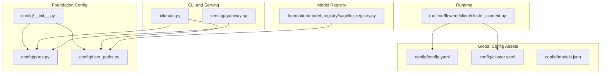
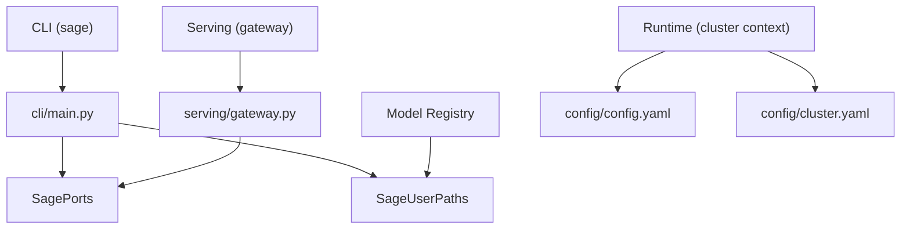
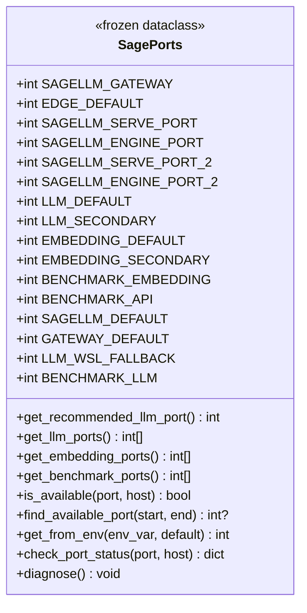
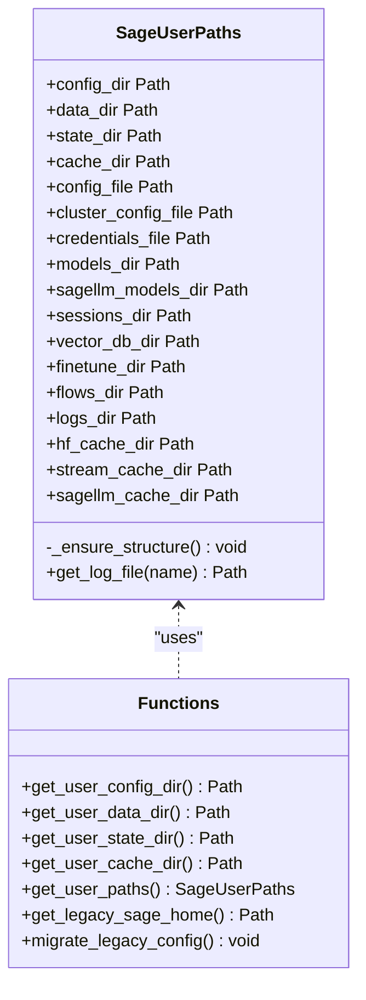
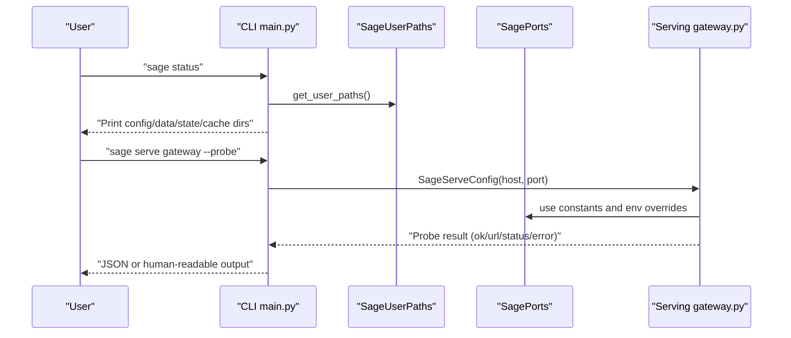
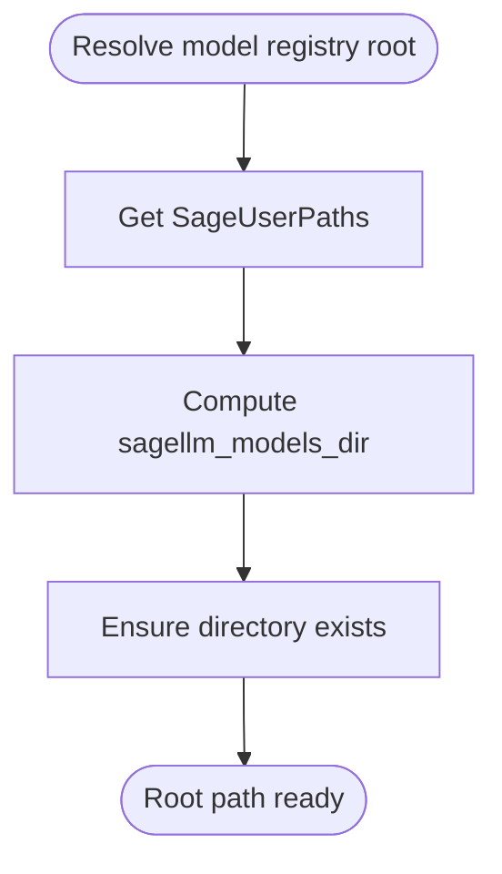
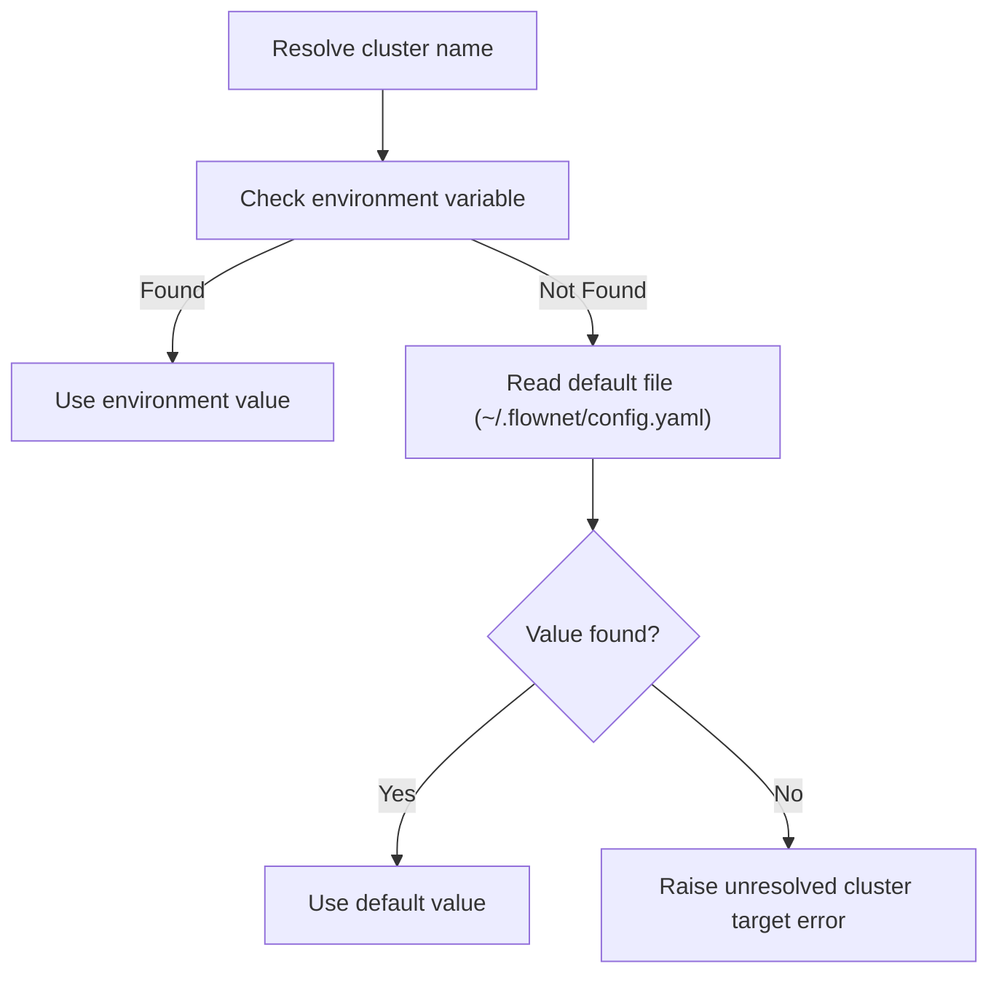
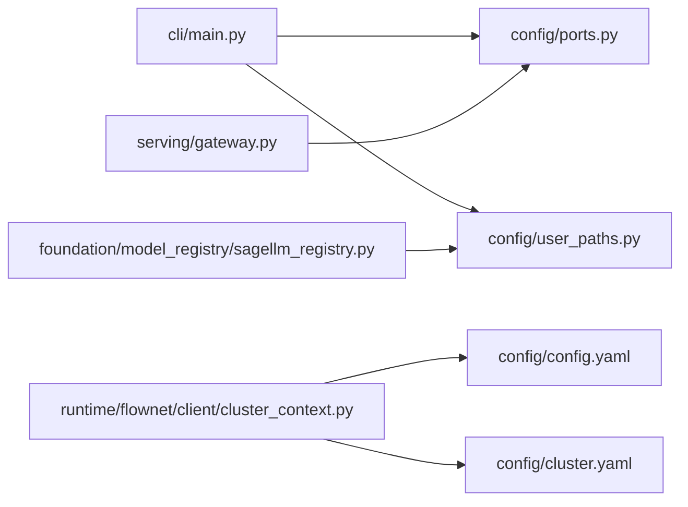

# Configuration Management System

<cite>
**Referenced Files in This Document**
- [ports.py](file://src/sage/foundation/config/ports.py)
- [user_paths.py](file://src/sage/foundation/config/user_paths.py)
- [__init__.py](file://src/sage/foundation/config/__init__.py)
- [config.yaml](file://config/config.yaml)
- [cluster.yaml](file://config/cluster.yaml)
- [models.json](file://config/models.json)
- [main.py](file://src/sage/cli/main.py)
- [gateway.py](file://src/sage/serving/gateway.py)
- [_version.py](file://src/sage/_version.py)
- [sagellm_registry.py](file://src/sage/foundation/model_registry/sagellm_registry.py)
- [cluster_context.py](file://src/sage/runtime/flownet/client/cluster_context.py)
</cite>

## Table of Contents
1. [Introduction](#introduction)
2. [Project Structure](#project-structure)
3. [Core Components](#core-components)
4. [Architecture Overview](#architecture-overview)
5. [Detailed Component Analysis](#detailed-component-analysis)
6. [Dependency Analysis](#dependency-analysis)
7. [Performance Considerations](#performance-considerations)
8. [Troubleshooting Guide](#troubleshooting-guide)
9. [Conclusion](#conclusion)
10. [Appendices](#appendices)

## Introduction
This document explains the Configuration Management System in SAGE, focusing on:
- Centralized port management via the SagePorts class
- XDG-compliant user directory handling via SageUserPaths and related utilities
- Environment variable handling, configuration precedence, and default value resolution
- Practical extension patterns for custom settings across development, staging, and production
- How configuration changes propagate through the SAGE architecture
- Validation, error handling, and debugging techniques
- Best practices for managing configuration across environments

## Project Structure
The configuration system spans two primary modules:
- Foundation configuration: centralized port and user paths management
- Global configuration files: YAML and JSON configuration assets shipped with the repository

**Diagram sources**
- [__init__.py:1-7](file://src/sage/foundation/config/__init__.py#L1-L7)
- [ports.py:1-199](file://src/sage/foundation/config/ports.py#L1-L199)
- [user_paths.py:1-195](file://src/sage/foundation/config/user_paths.py#L1-L195)
- [config.yaml:1-60](file://config/config.yaml#L1-L60)
- [cluster.yaml:1-91](file://config/cluster.yaml#L1-L91)
- [models.json:1-67](file://config/models.json#L1-L67)
- [main.py:1-204](file://src/sage/cli/main.py#L1-L204)
- [gateway.py:48-135](file://src/sage/serving/gateway.py#L48-L135)
- [sagellm_registry.py:53-137](file://src/sage/foundation/model_registry/sagellm_registry.py#L53-L137)
- [cluster_context.py:134-159](file://src/sage/runtime/flownet/client/cluster_context.py#L134-L159)

**Section sources**
- [__init__.py:1-7](file://src/sage/foundation/config/__init__.py#L1-L7)
- [ports.py:1-199](file://src/sage/foundation/config/ports.py#L1-L199)
- [user_paths.py:1-195](file://src/sage/foundation/config/user_paths.py#L1-L195)
- [config.yaml:1-60](file://config/config.yaml#L1-L60)
- [cluster.yaml:1-91](file://config/cluster.yaml#L1-L91)
- [models.json:1-67](file://config/models.json#L1-L67)
- [main.py:1-204](file://src/sage/cli/main.py#L1-L204)
- [gateway.py:48-135](file://src/sage/serving/gateway.py#L48-L135)
- [sagellm_registry.py:53-137](file://src/sage/foundation/model_registry/sagellm_registry.py#L53-L137)
- [cluster_context.py:134-159](file://src/sage/runtime/flownet/client/cluster_context.py#L134-L159)

## Core Components
- SagePorts: Centralized port assignments and helpers for availability checks, environment overrides, and diagnostics.
- SageUserPaths: XDG-compliant user directory provider with convenience properties for config, data, state, and cache, plus structured subdirectories and migration utilities.
- Global configuration assets: config.yaml, cluster.yaml, and models.json define defaults and cluster topology.

Key responsibilities:
- Provide a single source of truth for ports and directories
- Support environment-driven overrides and diagnostics
- Offer standardized locations for configuration and caches across platforms

**Section sources**
- [ports.py:25-199](file://src/sage/foundation/config/ports.py#L25-L199)
- [user_paths.py:53-195](file://src/sage/foundation/config/user_paths.py#L53-L195)
- [config.yaml:1-60](file://config/config.yaml#L1-L60)
- [cluster.yaml:1-91](file://config/cluster.yaml#L1-L91)
- [models.json:1-67](file://config/models.json#L1-L67)

## Architecture Overview
The configuration system underpins SAGE’s CLI, serving, runtime, and model registry layers. It ensures consistent defaults, environment overrides, and predictable paths across deployments.

**Diagram sources**
- [main.py:1-204](file://src/sage/cli/main.py#L1-L204)
- [ports.py:25-199](file://src/sage/foundation/config/ports.py#L25-L199)
- [user_paths.py:53-195](file://src/sage/foundation/config/user_paths.py#L53-L195)
- [gateway.py:48-135](file://src/sage/serving/gateway.py#L48-L135)
- [sagellm_registry.py:53-137](file://src/sage/foundation/model_registry/sagellm_registry.py#L53-L137)
- [cluster_context.py:134-159](file://src/sage/runtime/flownet/client/cluster_context.py#L134-L159)
- [config.yaml:1-60](file://config/config.yaml#L1-L60)
- [cluster.yaml:1-91](file://config/cluster.yaml#L1-L91)

## Detailed Component Analysis

### SagePorts: Centralized Port Management
SagePorts encapsulates:
- Named port constants for gateway, serving, engines, embeddings, and benchmarks
- Environment-aware selection helpers (e.g., WSL vs. standard)
- Availability checks and port-finding utilities
- Environment variable override for ports
- Diagnostic reporting for port statuses

- Environment variable handling: Ports can be overridden via environment variables using a dedicated reader method.
- Diagnostics: A diagnostic routine prints environment hints and port listening/availability status for core services.

Practical usage examples:
- CLI gateway probing uses the gateway port constant for defaults.
- Serving integration builds commands and URLs using recommended ports and environment overrides.
- Runtime and cluster context resolution rely on environment variables and default files.

**Diagram sources**
- [ports.py:25-199](file://src/sage/foundation/config/ports.py#L25-L199)
- [main.py:127-153](file://src/sage/cli/main.py#L127-L153)
- [gateway.py:55-117](file://src/sage/serving/gateway.py#L55-L117)

**Section sources**
- [ports.py:25-199](file://src/sage/foundation/config/ports.py#L25-L199)
- [main.py:127-153](file://src/sage/cli/main.py#L127-L153)
- [gateway.py:55-117](file://src/sage/serving/gateway.py#L55-L117)

### SageUserPaths: XDG-Compliant User Paths
SageUserPaths provides:
- XDG directory resolution via environment variables or platform defaults
- Structured subdirectories for config, data, state, and cache
- Convenience properties for key files and directories (e.g., config.yaml, cluster.yaml, logs)
- Migration utilities for legacy configuration locations

- Directory creation: Ensures subdirectories exist on first access.
- Legacy migration: Copies select legacy files into XDG locations when present.

**Diagram sources**
- [user_paths.py:53-195](file://src/sage/foundation/config/user_paths.py#L53-L195)

**Section sources**
- [user_paths.py:53-195](file://src/sage/foundation/config/user_paths.py#L53-L195)

### Global Configuration Assets
- config/config.yaml: Defines authentication, embedding, gateway, LLM, Ray, remote, and studio settings with defaults.
- config/cluster.yaml: Defines cluster topology, SSH, daemon, output, monitoring, and JobManager settings.
- config/models.json: Lists local and remote models with base URLs, default flags, and environment variable substitution for API keys.

These assets are consumed by runtime and CLI components to drive behavior and defaults.

**Section sources**
- [config.yaml:1-60](file://config/config.yaml#L1-L60)
- [cluster.yaml:1-91](file://config/cluster.yaml#L1-L91)
- [models.json:1-67](file://config/models.json#L1-L67)

### CLI Integration and Propagation
- The CLI status and doctor commands surface configuration directories and runtime health, integrating SageUserPaths and SagePorts.
- The serve gateway command constructs gateway configurations and probes endpoints using port constants and environment overrides.

**Diagram sources**
- [main.py:69-98](file://src/sage/cli/main.py#L69-L98)
- [main.py:127-153](file://src/sage/cli/main.py#L127-L153)
- [gateway.py:55-117](file://src/sage/serving/gateway.py#L55-L117)
- [ports.py:25-199](file://src/sage/foundation/config/ports.py#L25-L199)

**Section sources**
- [main.py:69-98](file://src/sage/cli/main.py#L69-L98)
- [main.py:127-153](file://src/sage/cli/main.py#L127-L153)
- [gateway.py:55-117](file://src/sage/serving/gateway.py#L55-L117)
- [ports.py:25-199](file://src/sage/foundation/config/ports.py#L25-L199)

### Model Registry and Configuration
The model registry resolves its root directory from SageUserPaths, ensuring consistent storage of model artifacts and manifests.

**Diagram sources**
- [sagellm_registry.py:57-64](file://src/sage/foundation/model_registry/sagellm_registry.py#L57-L64)
- [user_paths.py:105-110](file://src/sage/foundation/config/user_paths.py#L105-L110)

**Section sources**
- [sagellm_registry.py:57-64](file://src/sage/foundation/model_registry/sagellm_registry.py#L57-L64)
- [user_paths.py:105-110](file://src/sage/foundation/config/user_paths.py#L105-L110)

### Environment Variable Handling and Precedence
- Ports: Environment variables can override port constants via a dedicated reader method.
- Cluster context: Runtime components resolve cluster names from environment variables, falling back to default files.
- Models: API keys in models.json can be resolved from environment variables at runtime.

**Diagram sources**
- [cluster_context.py:134-159](file://src/sage/runtime/flownet/client/cluster_context.py#L134-L159)

**Section sources**
- [ports.py:103-111](file://src/sage/foundation/config/ports.py#L103-L111)
- [cluster_context.py:81-94](file://src/sage/runtime/flownet/client/cluster_context.py#L81-L94)
- [cluster_context.py:134-159](file://src/sage/runtime/flownet/client/cluster_context.py#L134-L159)
- [models.json:46-47](file://config/models.json#L46-L47)

## Dependency Analysis
- CLI depends on SagePorts and SageUserPaths for status, doctor, and serve gateway commands.
- Serving integration depends on SagePorts for default ports and URL construction.
- Model registry depends on SageUserPaths for storage roots.
- Runtime cluster context resolution depends on environment variables and default files.

**Diagram sources**
- [main.py:1-204](file://src/sage/cli/main.py#L1-L204)
- [ports.py:25-199](file://src/sage/foundation/config/ports.py#L25-L199)
- [user_paths.py:53-195](file://src/sage/foundation/config/user_paths.py#L53-L195)
- [gateway.py:48-135](file://src/sage/serving/gateway.py#L48-L135)
- [sagellm_registry.py:53-137](file://src/sage/foundation/model_registry/sagellm_registry.py#L53-L137)
- [cluster_context.py:134-159](file://src/sage/runtime/flownet/client/cluster_context.py#L134-L159)
- [config.yaml:1-60](file://config/config.yaml#L1-L60)
- [cluster.yaml:1-91](file://config/cluster.yaml#L1-L91)

**Section sources**
- [main.py:1-204](file://src/sage/cli/main.py#L1-L204)
- [gateway.py:48-135](file://src/sage/serving/gateway.py#L48-L135)
- [sagellm_registry.py:53-137](file://src/sage/foundation/model_registry/sagellm_registry.py#L53-L137)
- [cluster_context.py:134-159](file://src/sage/runtime/flownet/client/cluster_context.py#L134-L159)

## Performance Considerations
- Port availability checks use brief connection attempts; avoid repeated checks in tight loops.
- Diagnostics iterate predefined port sets; keep diagnostic runs infrequent in automated contexts.
- XDG directory resolution caches computed paths; initialization cost occurs once per process.

## Troubleshooting Guide
Common issues and resolutions:
- Port conflicts:
  - Use availability checks and the port finder to select alternate ports.
  - Run the diagnostic tool to inspect listening states.
- Gateway unresponsive:
  - Probe the gateway URL constructed from SagePorts defaults and environment overrides.
  - Verify CLI status shows gateway health.
- Legacy configuration migration:
  - Use the migration utility to copy legacy files into XDG locations.
- Cluster context resolution failures:
  - Ensure environment variables or default files provide a valid cluster name.

Validation and debugging techniques:
- CLI status and doctor commands surface configuration directories and runtime health.
- Serving gateway probe returns structured results for downstream automation.
- Runtime cluster context reads default files safely and raises explicit errors when unresolved.

**Section sources**
- [ports.py:85-128](file://src/sage/foundation/config/ports.py#L85-L128)
- [ports.py:131-188](file://src/sage/foundation/config/ports.py#L131-L188)
- [main.py:69-98](file://src/sage/cli/main.py#L69-L98)
- [main.py:127-153](file://src/sage/cli/main.py#L127-L153)
- [user_paths.py:167-181](file://src/sage/foundation/config/user_paths.py#L167-L181)
- [cluster_context.py:81-94](file://src/sage/runtime/flownet/client/cluster_context.py#L81-L94)
- [cluster_context.py:134-159](file://src/sage/runtime/flownet/client/cluster_context.py#L134-L159)

## Conclusion
The SAGE Configuration Management System provides a robust, XDG-compliant foundation for user directories and centralized port management. It integrates seamlessly with CLI, serving, runtime, and model registry components, enabling consistent behavior across environments. By leveraging environment variables, structured defaults, and diagnostics, teams can reliably operate SAGE in development, staging, and production.

## Appendices

### Practical Extension Patterns
- Adding custom ports:
  - Define new named constants in SagePorts and expose getters for priority ordering.
  - Use environment overrides to steer defaults in different environments.
- Extending user directories:
  - Add new convenience properties to SageUserPaths for specialized subdirectories.
  - Ensure creation during initialization to avoid runtime errors.
- Environment-driven configuration:
  - Prefer environment variables for ports and cluster names.
  - Provide sensible defaults in global YAML/JSON assets for out-of-the-box usability.

### Deployment Scenarios
- Development:
  - Use lower port ranges and local caches; rely on defaults for quick iteration.
- Staging:
  - Override ports and directories via environment variables; enable diagnostics for health checks.
- Production:
  - Pin ports and directories; centralize configuration via environment variables and default files; monitor gateway and runtime health via CLI and serving probes.

### Version and Release Notes Reference
- Version information is surfaced by the CLI and used in status output.

**Section sources**
- [main.py:101-103](file://src/sage/cli/main.py#L101-L103)
- [_version.py](file://src/sage/_version.py)