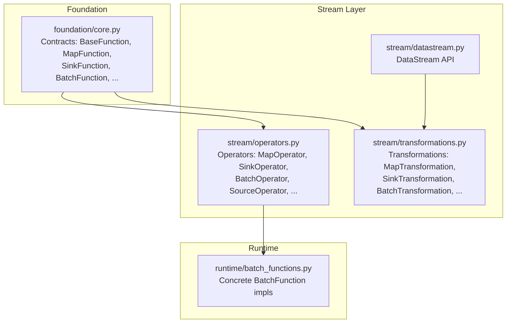
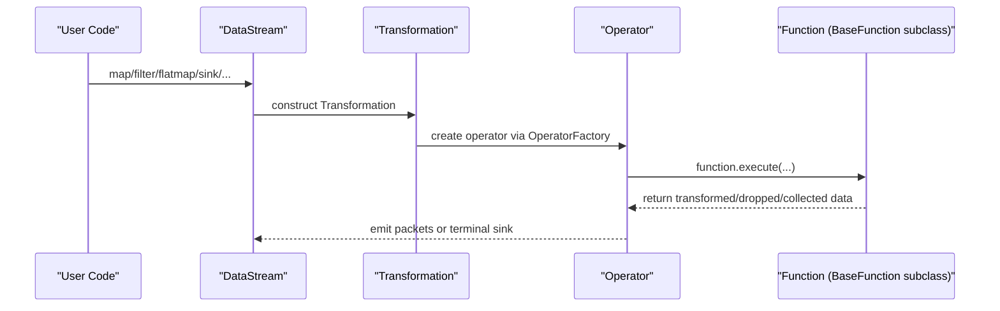
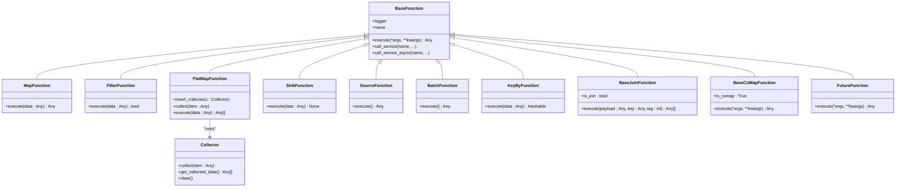
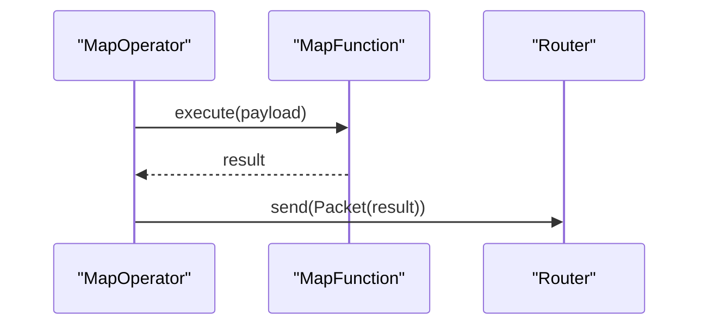
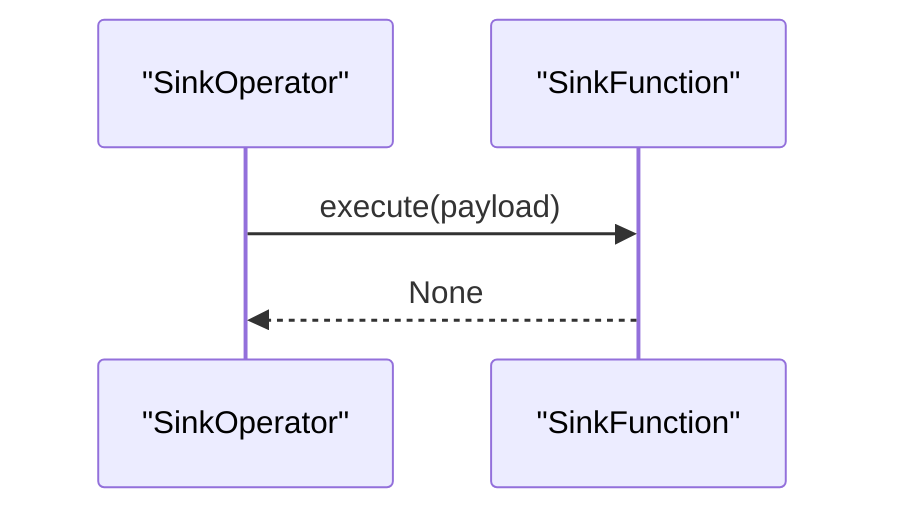
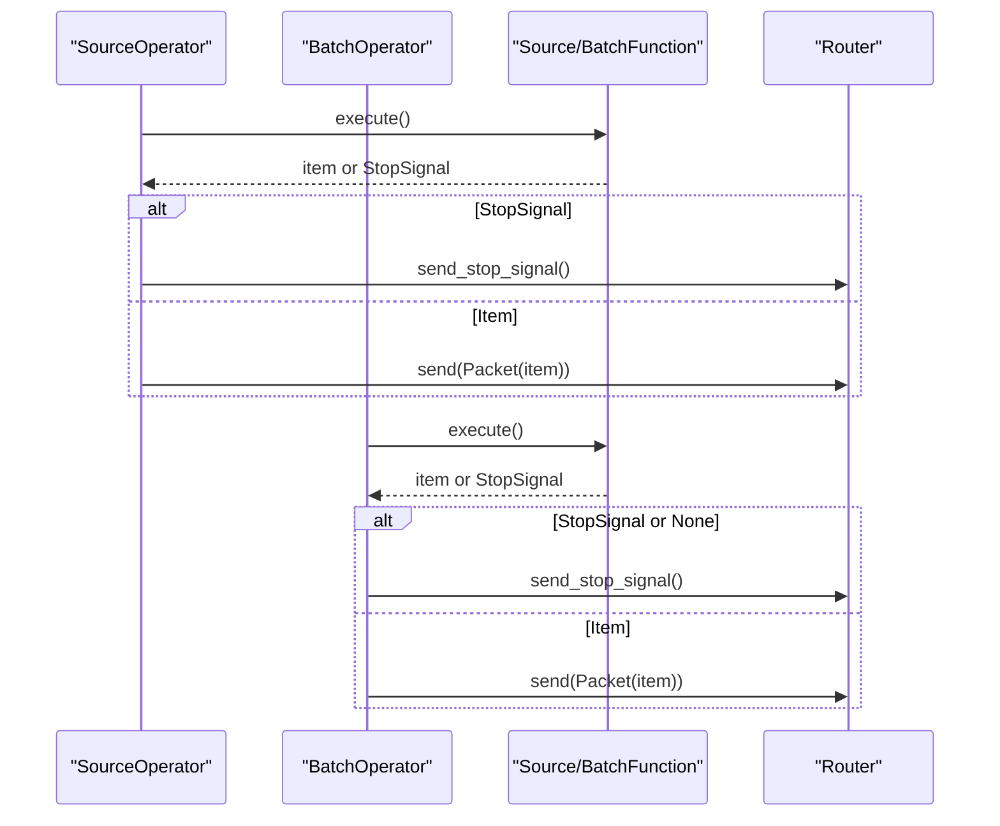
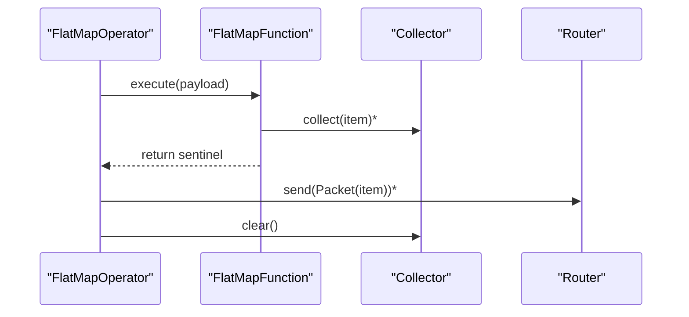
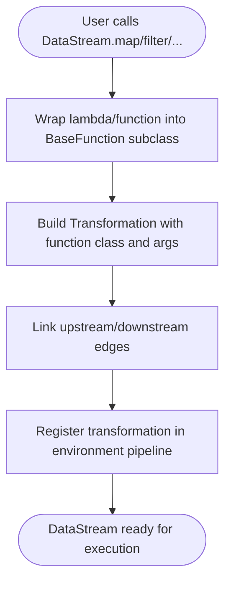
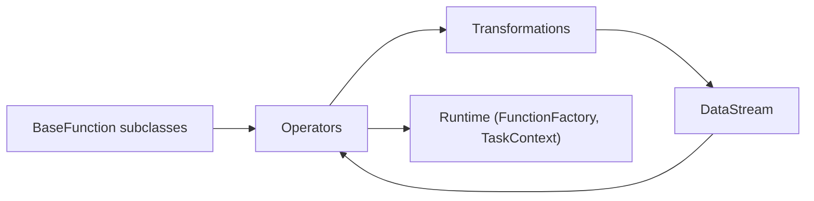

# Core Contracts and Function Abstractions

<cite>
**Referenced Files in This Document**
- [foundation/core.py](file://src/sage/foundation/core.py)
- [foundation/__init__.py](file://src/sage/foundation/__init__.py)
- [stream/operators.py](file://src/sage/stream/operators.py)
- [stream/transformations.py](file://src/sage/stream/transformations.py)
- [stream/datastream.py](file://src/sage/stream/datastream.py)
- [runtime/batch_functions.py](file://src/sage/runtime/batch_functions.py)
</cite>

## Table of Contents
1. [Introduction](#introduction)
2. [Project Structure](#project-structure)
3. [Core Components](#core-components)
4. [Architecture Overview](#architecture-overview)
5. [Detailed Component Analysis](#detailed-component-analysis)
6. [Dependency Analysis](#dependency-analysis)
7. [Performance Considerations](#performance-considerations)
8. [Troubleshooting Guide](#troubleshooting-guide)
9. [Conclusion](#conclusion)

## Introduction
This document explains the core contracts and function abstractions that define the operator interface in SAGE’s stream processing layer. It focuses on the contract-first design pattern and how the foundational function classes—BatchFunction, MapFunction, and SinkFunction—enable consistent operator behavior across the system. You will learn the method signatures, parameter requirements, return value expectations, and error-handling strategies for each function type. We also show how these contracts integrate with the Stream Layer operators and how to implement custom functions that adhere to the contracts.

## Project Structure
The contracts live in the foundation layer and are consumed by the stream layer. Operators translate function execution into packet-based processing, while transformations bind user-defined functions to operators and manage pipeline construction.

**Diagram sources**
- [foundation/core.py:16-334](file://src/sage/foundation/core.py#L16-L334)
- [stream/operators.py:41-526](file://src/sage/stream/operators.py#L41-L526)
- [stream/transformations.py:49-421](file://src/sage/stream/transformations.py#L49-L421)
- [stream/datastream.py:26-182](file://src/sage/stream/datastream.py#L26-L182)
- [runtime/batch_functions.py:11-79](file://src/sage/runtime/batch_functions.py#L11-L79)

**Section sources**
- [foundation/core.py:16-334](file://src/sage/foundation/core.py#L16-L334)
- [stream/operators.py:41-526](file://src/sage/stream/operators.py#L41-L526)
- [stream/transformations.py:49-421](file://src/sage/stream/transformations.py#L49-L421)
- [stream/datastream.py:26-182](file://src/sage/stream/datastream.py#L26-L182)
- [runtime/batch_functions.py:11-79](file://src/sage/runtime/batch_functions.py#L11-L79)

## Core Components
This section documents the primary function contracts and their roles in the operator interface.

- BaseFunction
  - Purpose: Minimal base for user-defined functions with lifecycle hooks and service access.
  - Key methods and expectations:
    - execute(...): Abstract entry point for function logic. Return type is free-form; operators interpret it per context.
    - logger property: Provides access to a logger via the runtime context.
    - name property: Derives a readable name from the context.
    - call_service(...) and call_service_async(...): Access to runtime services through the context.
  - State management: Supports state inclusion/exclusion lists for serialization.

- MapFunction
  - Purpose: Single-input-to-single-output mapping.
  - Method signature: execute(data: Any) -> Any
  - Expectations: Return transformed data or None to drop the record.

- FilterFunction
  - Purpose: Decide whether to keep or discard an element.
  - Method signature: execute(data: Any) -> bool
  - Expectations: Return True to pass, False to filter out.

- FlatMapFunction
  - Purpose: Produce zero or more outputs from a single input.
  - Method signature: execute(data: Any) -> list[Any]
  - Collector pattern: Operators inject a Collector; function can call collect(...) to accumulate items.
  - Expectations: Return a list of items; operators will emit each item as a separate packet.

- SinkFunction
  - Purpose: Terminal operation that consumes data (no downstream).
  - Method signature: execute(data: Any) -> None
  - Expectations: Perform side effects; return None.

- SourceFunction
  - Purpose: Spout-like producer of initial data.
  - Method signature: execute() -> Any
  - Expectations: Emit next item or a StopSignal to terminate.

- BatchFunction
  - Purpose: Batch-oriented producer with iteration semantics.
  - Method signature: execute() -> Any
  - Expectations: Emit next item or None to signal completion.

- KeyByFunction
  - Purpose: Extract a hashable key from a record for partitioning.
  - Method signature: execute(data: Any) -> Hashable

- BaseJoinFunction
  - Purpose: Multi-stream join with explicit key and stream tag.
  - Method signature: execute(payload: Any, key: Any, tag: int) -> list[Any]

- BaseCoMapFunction
  - Purpose: Multi-stream mapping with map0, map1, ... methods.
  - Behavior: Direct execute() is invalid; use map0/map1/etc. per input index.

- FutureFunction
  - Purpose: Placeholder for deferred operator wiring in pipelines.

- Collector
  - Purpose: Accumulates flatmap outputs; injected by operators.

Implementation examples from the codebase:
- Concrete BatchFunction implementations:
  - SimpleBatchIteratorFunction: Iterates over a materialized collection.
  - IterableBatchIteratorFunction: Iterates over any iterable with optional total count.
- Lambda wrappers:
  - wrap_lambda(...) infers function type and returns a compatible BaseFunction subclass for map/filter/flatmap/sink/source/keyby.

**Section sources**
- [foundation/core.py:16-334](file://src/sage/foundation/core.py#L16-L334)
- [runtime/batch_functions.py:11-79](file://src/sage/runtime/batch_functions.py#L11-L79)
- [foundation/__init__.py:9-66](file://src/sage/foundation/__init__.py#L9-L66)

## Architecture Overview
The contract-first design ties user-defined functions to operators via transformations. The DataStream API constructs pipelines by composing transformations, which instantiate operators that invoke function.execute(...) with appropriate arguments.

**Diagram sources**
- [stream/datastream.py:52-176](file://src/sage/stream/datastream.py#L52-L176)
- [stream/transformations.py:63-125](file://src/sage/stream/transformations.py#L63-L125)
- [stream/operators.py:41-105](file://src/sage/stream/operators.py#L41-L105)
- [foundation/core.py:16-117](file://src/sage/foundation/core.py#L16-L117)

## Detailed Component Analysis

### Contract Classes and Relationships
The following class diagram shows the core contracts and their relationships.

**Diagram sources**
- [foundation/core.py:16-334](file://src/sage/foundation/core.py#L16-L334)

**Section sources**
- [foundation/core.py:16-334](file://src/sage/foundation/core.py#L16-L334)

### Operator Execution Flows

#### MapOperator
- Invocation: Operators call function.execute(payload) and forward the returned result as a new packet.
- Error handling: Exceptions are caught and logged; normal processing continues.
- Profiling: Optional timing can be recorded and persisted.

**Diagram sources**
- [stream/operators.py:157-186](file://src/sage/stream/operators.py#L157-L186)
- [operators.py:107-194](file://src/sage/stream/operators.py#L107-L194)

**Section sources**
- [stream/operators.py:107-194](file://src/sage/stream/operators.py#L107-L194)

#### SinkOperator
- Invocation: Operators call function.execute(payload) for terminal sinks.
- Stop handling: Operators do not propagate StopSignal to sinks.

**Diagram sources**
- [stream/operators.py:244-262](file://src/sage/stream/operators.py#L244-L262)

**Section sources**
- [stream/operators.py:244-262](file://src/sage/stream/operators.py#L244-L262)

#### SourceOperator and BatchOperator
- SourceOperator: Invokes function.execute() to produce the next item; emits StopSignal and requests stop when encountered.
- BatchOperator: Similar to SourceOperator but expects batch-style iteration semantics.

**Diagram sources**
- [stream/operators.py:264-324](file://src/sage/stream/operators.py#L264-L324)

**Section sources**
- [stream/operators.py:264-324](file://src/sage/stream/operators.py#L264-L324)

#### FlatMapOperator
- Collector pattern: Operators inject a Collector into FlatMapFunction; function calls collect(...) to accumulate outputs.
- Emission: Operator sends each collected item as a separate packet, preserving partition info.

**Diagram sources**
- [stream/operators.py:209-242](file://src/sage/stream/operators.py#L209-L242)

**Section sources**
- [stream/operators.py:209-242](file://src/sage/stream/operators.py#L209-L242)

### Transformation and Pipeline Construction
- DataStream exposes fluent methods that wrap user-provided functions into Transformations.
- Transformations create Operators and wire upstream/downstream edges.
- Operators are created via FunctionFactory and TaskContext integration.

**Diagram sources**
- [stream/datastream.py:52-176](file://src/sage/stream/datastream.py#L52-L176)
- [stream/transformations.py:63-125](file://src/sage/stream/transformations.py#L63-L125)

**Section sources**
- [stream/datastream.py:52-176](file://src/sage/stream/datastream.py#L52-L176)
- [stream/transformations.py:63-125](file://src/sage/stream/transformations.py#L63-L125)

### Implementing Custom Functions That Adhere to Contracts
Below are concrete implementation patterns aligned with the contracts and validated by the codebase.

- MapFunction
  - Signature: execute(data: Any) -> Any
  - Example reference: [foundation/core.py:76-79](file://src/sage/foundation/core.py#L76-L79)
  - Usage reference: [stream/datastream.py:52-67](file://src/sage/stream/datastream.py#L52-L67)

- FilterFunction
  - Signature: execute(data: Any) -> bool
  - Example reference: [foundation/core.py:82-85](file://src/sage/foundation/core.py#L82-L85)
  - Usage reference: [stream/datastream.py:69-84](file://src/sage/stream/datastream.py#L69-L84)

- FlatMapFunction
  - Signature: execute(data: Any) -> list[Any]
  - Collector usage: insert_collector(...) and collect(...)
  - Example reference: [foundation/core.py:88-104](file://src/sage/foundation/core.py#L88-L104)
  - Operator behavior reference: [stream/operators.py:209-242](file://src/sage/stream/operators.py#L209-L242)

- SinkFunction
  - Signature: execute(data: Any) -> None
  - Example reference: [foundation/core.py:107-110](file://src/sage/foundation/core.py#L107-L110)
  - Usage reference: [stream/datastream.py:103-119](file://src/sage/stream/datastream.py#L103-L119)

- SourceFunction
  - Signature: execute() -> Any
  - Stop handling: Return a StopSignal to terminate.
  - Example reference: [foundation/core.py:113-116](file://src/sage/foundation/core.py#L113-L116)
  - Operator behavior reference: [stream/operators.py:275-303](file://src/sage/stream/operators.py#L275-L303)

- BatchFunction
  - Signature: execute() -> Any
  - Iteration semantics: Return next item or None to signal completion.
  - Example reference: [foundation/core.py:119-122](file://src/sage/foundation/core.py#L119-L122)
  - Concrete implementations: [runtime/batch_functions.py:11-79](file://src/sage/runtime/batch_functions.py#L11-L79)

- KeyByFunction
  - Signature: execute(data: Any) -> Hashable
  - Example reference: [foundation/core.py:125-128](file://src/sage/foundation/core.py#L125-L128)
  - Operator behavior reference: [stream/operators.py:326-349](file://src/sage/stream/operators.py#L326-L349)

- BaseJoinFunction
  - Signature: execute(payload: Any, key: Any, tag: int) -> list[Any]
  - Example reference: [foundation/core.py:131-138](file://src/sage/foundation/core.py#L131-L138)
  - Operator behavior reference: [stream/operators.py:367-458](file://src/sage/stream/operators.py#L367-L458)

- BaseCoMapFunction
  - Behavior: Direct execute() raises; implement map0, map1, ...
  - Example reference: [foundation/core.py:141-150](file://src/sage/foundation/core.py#L141-L150)
  - Operator behavior reference: [stream/operators.py:461-525](file://src/sage/stream/operators.py#L461-L525)

- Lambda Wrapping
  - wrap_lambda(...) detects function type and returns a compatible BaseFunction subclass.
  - Example reference: [foundation/core.py:265-317](file://src/sage/foundation/core.py#L265-L317)

**Section sources**
- [foundation/core.py:76-122](file://src/sage/foundation/core.py#L76-L122)
- [foundation/core.py:131-150](file://src/sage/foundation/core.py#L131-L150)
- [foundation/core.py:265-317](file://src/sage/foundation/core.py#L265-L317)
- [stream/datastream.py:52-119](file://src/sage/stream/datastream.py#L52-L119)
- [stream/operators.py:209-349](file://src/sage/stream/operators.py#L209-L349)
- [runtime/batch_functions.py:11-79](file://src/sage/runtime/batch_functions.py#L11-L79)

## Dependency Analysis
The following diagram shows how contracts depend on operators and transformations.

**Diagram sources**
- [foundation/core.py:16-334](file://src/sage/foundation/core.py#L16-L334)
- [stream/operators.py:41-105](file://src/sage/stream/operators.py#L41-L105)
- [stream/transformations.py:63-125](file://src/sage/stream/transformations.py#L63-L125)
- [stream/datastream.py:29-37](file://src/sage/stream/datastream.py#L29-L37)

**Section sources**
- [foundation/core.py:16-334](file://src/sage/foundation/core.py#L16-L334)
- [stream/operators.py:41-105](file://src/sage/stream/operators.py#L41-L105)
- [stream/transformations.py:63-125](file://src/sage/stream/transformations.py#L63-L125)
- [stream/datastream.py:29-37](file://src/sage/stream/datastream.py#L29-L37)

## Performance Considerations
- Minimize allocations inside hot paths:
  - Reuse buffers and avoid unnecessary copies when emitting multiple items from FlatMapFunction.
- Prefer batching where applicable:
  - BatchFunction and BatchOperator support batched emission to reduce overhead.
- Logging and profiling:
  - MapOperator supports optional time tracking and persistence of timing records.
- Backpressure and stop signals:
  - Operators propagate StopSignal to halt downstream processing gracefully.
- Partitioning:
  - KeyByFunction and KeyByOperator influence partitioning strategy; choose keys that distribute load evenly.

[No sources needed since this section provides general guidance]

## Troubleshooting Guide
Common issues and strategies:

- FlatMapFunction returns wrong type
  - Symptom: TypeError indicating FlatMap must return a list.
  - Resolution: Ensure execute(...) returns a list; see validation in LambdaFlatMapFunction.
  - Reference: [foundation/core.py:204-213](file://src/sage/foundation/core.py#L204-L213)

- Collector not initialized
  - Symptom: Runtime error when calling collect(...) in FlatMapFunction.
  - Resolution: Do not call collect(...) manually; rely on operators injecting the Collector.
  - Reference: [foundation/core.py:93-100](file://src/sage/foundation/core.py#L93-L100)

- StopSignal propagation
  - Symptom: Source/Batch operators not stopping cleanly.
  - Resolution: Return StopSignal from Source/BatchFunction.execute(); operators will propagate and request stop.
  - Reference: [stream/operators.py:275-303](file://src/sage/stream/operators.py#L275-L303), [stream/operators.py:309-323](file://src/sage/stream/operators.py#L309-L323)

- Sink errors
  - Symptom: Exceptions in SinkFunction not visible.
  - Resolution: Operators catch and log exceptions; ensure logging is enabled.
  - Reference: [stream/operators.py:244-262](file://src/sage/stream/operators.py#L244-L262)

- Lambda wrapping ambiguity
  - Symptom: Unexpected function type inference.
  - Resolution: Explicitly specify func_type or annotate return type to guide wrap_lambda(...).
  - Reference: [foundation/core.py:243-262](file://src/sage/foundation/core.py#L243-L262), [foundation/core.py:265-317](file://src/sage/foundation/core.py#L265-L317)

**Section sources**
- [foundation/core.py:93-100](file://src/sage/foundation/core.py#L93-L100)
- [foundation/core.py:204-213](file://src/sage/foundation/core.py#L204-L213)
- [stream/operators.py:244-303](file://src/sage/stream/operators.py#L244-L303)
- [foundation/core.py:243-317](file://src/sage/foundation/core.py#L243-L317)

## Conclusion
The contract-first design in SAGE ensures consistent operator behavior by enforcing strict function signatures and semantics. BaseFunction and its specialized subclasses define the canonical entry points for stream processing logic. Operators translate these contracts into packet-based execution, while transformations and DataStream provide a fluent API for building pipelines. By adhering to the documented signatures and leveraging the provided patterns (notably FlatMap’s collector and lambda wrapping), developers can implement robust, maintainable custom functions that integrate seamlessly across the Stream Layer.