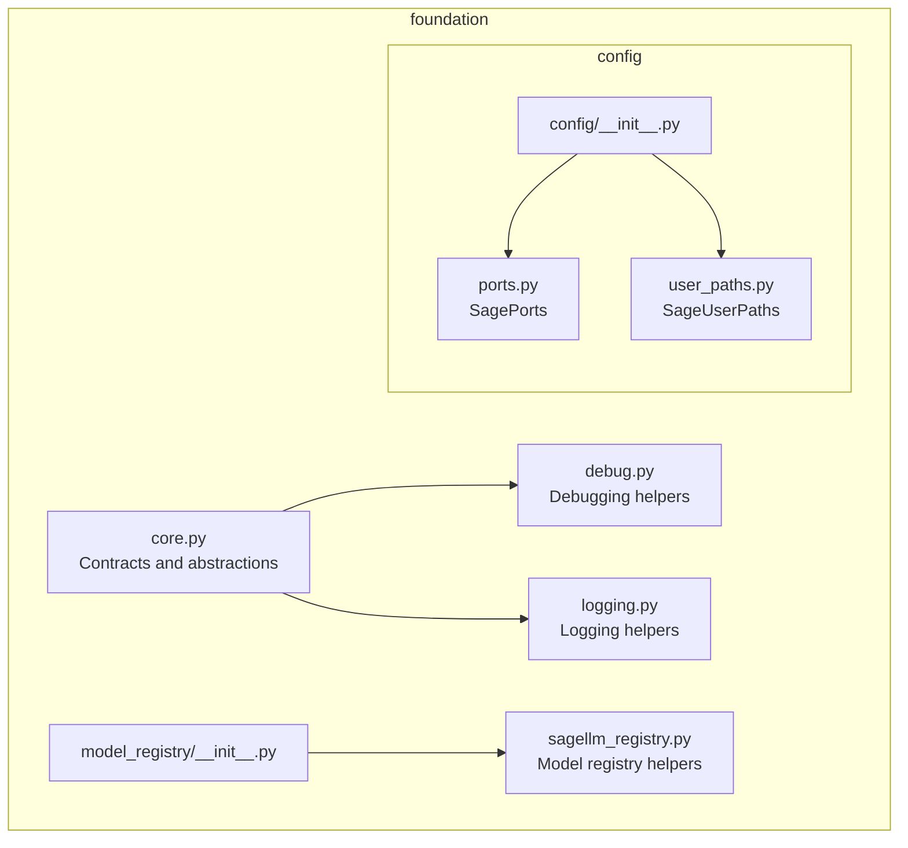
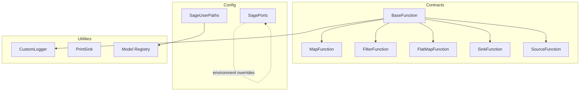
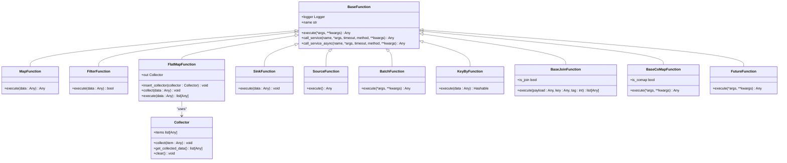
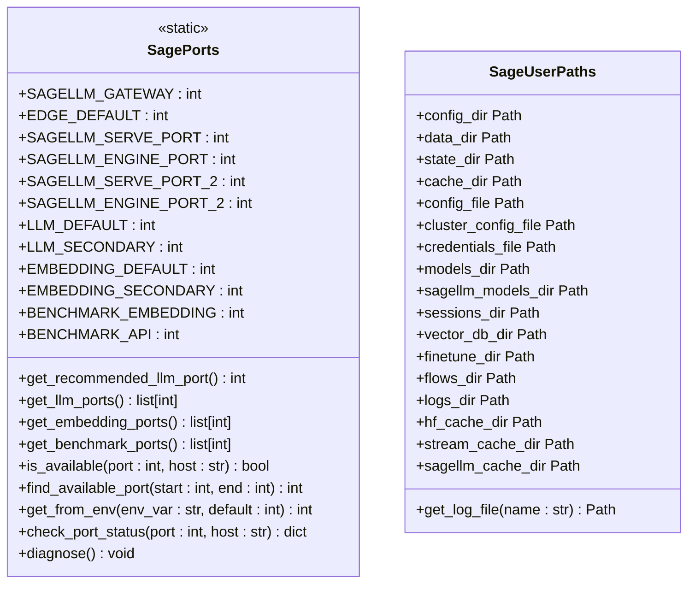
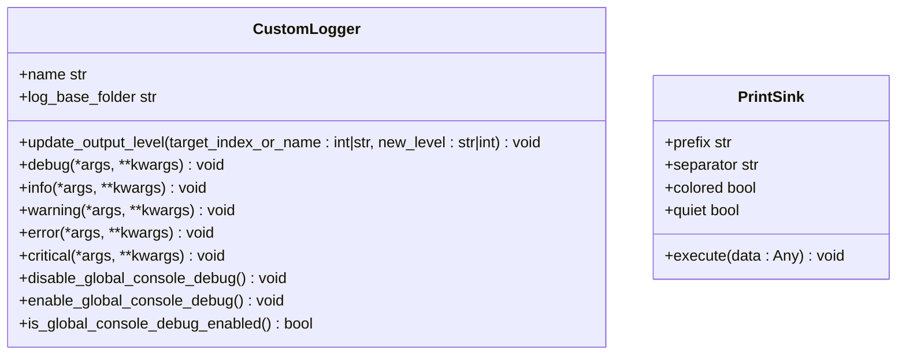
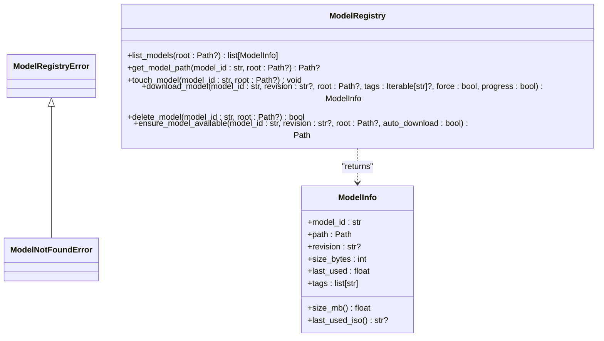
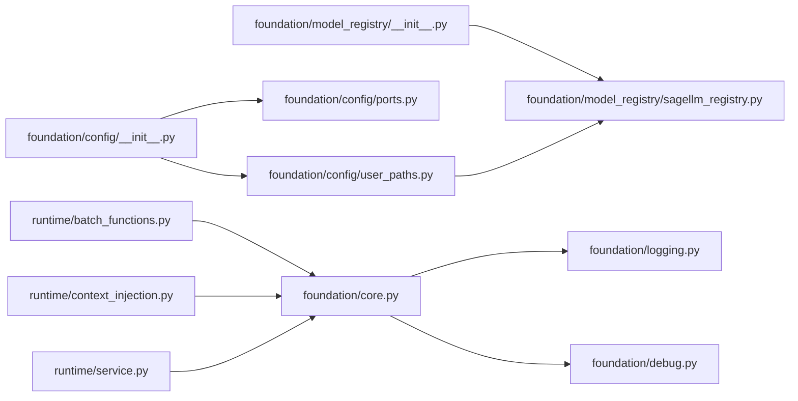

# Foundation Layer

<cite>
**Referenced Files in This Document**
- [__init__.py](file://src/sage/foundation/__init__.py)
- [core.py](file://src/sage/foundation/core.py)
- [debug.py](file://src/sage/foundation/debug.py)
- [logging.py](file://src/sage/foundation/logging.py)
- [config/__init__.py](file://src/sage/foundation/config/__init__.py)
- [ports.py](file://src/sage/foundation/config/ports.py)
- [user_paths.py](file://src/sage/foundation/config/user_paths.py)
- [model_registry/__init__.py](file://src/sage/foundation/model_registry/__init__.py)
- [sagellm_registry.py](file://src/sage/foundation/model_registry/sagellm_registry.py)
- [batch_functions.py](file://src/sage/runtime/batch_functions.py)
- [context_injection.py](file://src/sage/runtime/context_injection.py)
- [service.py](file://src/sage/runtime/service.py)
</cite>

## Table of Contents
1. [Introduction](#introduction)
2. [Project Structure](#project-structure)
3. [Core Components](#core-components)
4. [Architecture Overview](#architecture-overview)
5. [Detailed Component Analysis](#detailed-component-analysis)
6. [Dependency Analysis](#dependency-analysis)
7. [Performance Considerations](#performance-considerations)
8. [Troubleshooting Guide](#troubleshooting-guide)
9. [Conclusion](#conclusion)
10. [Appendices](#appendices)

## Introduction
The Foundation Layer is the bedrock of SAGE’s architecture. It consolidates the minimal, stable primitives that underpin all higher layers—contracts for operators, configuration and environment management, logging and debugging utilities, and model registry helpers. Its purpose is to provide a contract-first, predictable substrate so that runtime, serving, and optional distributed execution modes can evolve independently while sharing a common interface and operational model.

This layer emphasizes:
- Contracts-first design via operator interfaces (BatchFunction, MapFunction, SinkFunction, and others)
- Centralized configuration for ports and XDG-compliant user directories
- Lightweight logging and debugging helpers
- Model registry utilities for local model lifecycle management

## Project Structure
The Foundation Layer is organized into cohesive subpackages:
- Contracts and core abstractions live in the core module
- Configuration for ports and user paths is in the config package
- Logging and debugging helpers are standalone modules
- Model registry utilities are grouped under model_registry

**Diagram sources**
- [__init__.py:1-67](file://src/sage/foundation/__init__.py#L1-L67)
- [core.py:1-335](file://src/sage/foundation/core.py#L1-L335)
- [debug.py:1-61](file://src/sage/foundation/debug.py#L1-L61)
- [logging.py:1-97](file://src/sage/foundation/logging.py#L1-L97)
- [config/__init__.py:1-7](file://src/sage/foundation/config/__init__.py#L1-L7)
- [ports.py:1-199](file://src/sage/foundation/config/ports.py#L1-L199)
- [user_paths.py:1-195](file://src/sage/foundation/config/user_paths.py#L1-L195)
- [model_registry/__init__.py:1-26](file://src/sage/foundation/model_registry/__init__.py#L1-L26)
- [sagellm_registry.py:1-297](file://src/sage/foundation/model_registry/sagellm_registry.py#L1-L297)

**Section sources**
- [__init__.py:1-67](file://src/sage/foundation/__init__.py#L1-L67)

## Core Components
This section documents the foundational contracts and utilities that define the operator interface and operational substrate.

- Operator Contracts
  - BaseFunction: Minimal base class for user-defined functions with context-aware logging and service invocation
  - MapFunction, FilterFunction, FlatMapFunction, SinkFunction, SourceFunction, BatchFunction: Specializations of BaseFunction for common streaming/operator patterns
  - KeyByFunction, BaseJoinFunction, BaseCoMapFunction, FutureFunction: Additional operator specializations for keyed operations, joins, and placeholders
  - Collector: Lightweight collector used by FlatMapFunction to emit multiple items
  - wrap_lambda and detect_lambda_type: Utilities to infer and wrap Python callables into compatible function classes

- Debugging and Logging
  - PrintSink: A sink that prints stream data with formatting and optional color
  - CustomLogger: A lightweight logger compatible with the runtime, supporting console output and dynamic level updates

- Configuration and Environment
  - SagePorts: Centralized port assignments and helpers for availability checks, environment overrides, and diagnostics
  - SageUserPaths: XDG-compliant user directories and convenience paths for config, data, state, cache, and logs

- Model Registry
  - ModelInfo: Metadata for a locally cached model
  - ModelRegistryError, ModelNotFoundError: Exceptions for registry operations
  - Functions: list_models, get_model_path, touch_model, download_model, delete_model, ensure_model_available

Practical extension points:
- Extend operator behavior by subclassing the appropriate function contract and implementing execute
- Use wrap_lambda to quickly adapt existing callables into operators
- Integrate with SagePorts and SageUserPaths to align deployments with environment and standards

**Section sources**
- [core.py:16-335](file://src/sage/foundation/core.py#L16-L335)
- [debug.py:10-61](file://src/sage/foundation/debug.py#L10-L61)
- [logging.py:10-97](file://src/sage/foundation/logging.py#L10-L97)
- [config/__init__.py:1-7](file://src/sage/foundation/config/__init__.py#L1-L7)
- [ports.py:25-199](file://src/sage/foundation/config/ports.py#L25-L199)
- [user_paths.py:53-195](file://src/sage/foundation/config/user_paths.py#L53-L195)
- [model_registry/__init__.py:1-26](file://src/sage/foundation/model_registry/__init__.py#L1-L26)
- [sagellm_registry.py:23-297](file://src/sage/foundation/model_registry/sagellm_registry.py#L23-L297)

## Architecture Overview
The Foundation Layer sits beneath runtime, serving, and optional distributed execution. It exposes:
- Contracts for operators that higher layers implement and orchestrate
- Configuration primitives for ports and user directories
- Logging and debugging helpers for observability
- Model registry utilities for local model lifecycle management

**Diagram sources**
- [core.py:16-335](file://src/sage/foundation/core.py#L16-L335)
- [ports.py:25-199](file://src/sage/foundation/config/ports.py#L25-L199)
- [user_paths.py:53-195](file://src/sage/foundation/config/user_paths.py#L53-L195)
- [logging.py:10-97](file://src/sage/foundation/logging.py#L10-L97)
- [debug.py:10-61](file://src/sage/foundation/debug.py#L10-L61)
- [sagellm_registry.py:23-297](file://src/sage/foundation/model_registry/sagellm_registry.py#L23-L297)

## Detailed Component Analysis

### Operator Contracts and Abstractions
Operator contracts define the interface that all functions must implement. They are designed to be contract-first, enabling consistent behavior across diverse execution contexts.

**Diagram sources**
- [core.py:16-335](file://src/sage/foundation/core.py#L16-L335)

Implementation highlights:
- BaseFunction centralizes context-aware logging and service invocation
- FlatMapFunction integrates with Collector to emit multiple items per input
- BaseJoinFunction and BaseCoMapFunction provide specialized join and multi-stream mapping semantics
- wrap_lambda detects callable signatures and wraps them into the appropriate function class

**Section sources**
- [core.py:16-335](file://src/sage/foundation/core.py#L16-L335)

### Configuration Management: SagePorts and SageUserPaths
SagePorts and SageUserPaths provide centralized, environment-aware configuration for networking and filesystem layout.

Operational patterns:
- Environment overrides: SagePorts.get_from_env reads integer-valued environment variables for port customization
- Availability checks: is_available and check_port_status help avoid conflicts during startup
- Diagnostics: diagnose prints a structured report of port statuses and environment hints
- XDG compliance: SageUserPaths ensures directories exist and provides canonical paths for config, data, state, and cache

**Section sources**
- [ports.py:25-199](file://src/sage/foundation/config/ports.py#L25-L199)
- [user_paths.py:53-195](file://src/sage/foundation/config/user_paths.py#L53-L195)

### Logging Infrastructure and Debugging Utilities
The logging and debugging subsystems provide lightweight, consistent observability across the stack.

Usage guidance:
- Use CustomLogger to unify console and file logging with dynamic level updates
- Use PrintSink for quick inspection of stream data during development and testing
- Global console debug toggles allow suppressing noisy debug output in production-like environments

**Section sources**
- [logging.py:10-97](file://src/sage/foundation/logging.py#L10-L97)
- [debug.py:10-61](file://src/sage/foundation/debug.py#L10-L61)

### Model Registry Utilities
The model registry manages local model assets with metadata and lifecycle operations.

Integration points:
- Uses SageUserPaths to resolve model storage under XDG data directories
- Supports retries and progress reporting for downloads
- Maintains a JSON manifest for model metadata and integrity

**Section sources**
- [sagellm_registry.py:23-297](file://src/sage/foundation/model_registry/sagellm_registry.py#L23-L297)
- [user_paths.py:53-195](file://src/sage/foundation/config/user_paths.py#L53-L195)

### Practical Extension Examples
- Extending with custom operators
  - Implement a new operator by subclassing the appropriate contract (for example, MapFunction) and overriding execute
  - For quick adaptation, use wrap_lambda to convert a callable into a compatible operator class
- Integrating with configuration
  - Choose ports using SagePorts.get_recommended_llm_port or SagePorts.get_from_env for environment-driven overrides
  - Resolve user directories via SageUserPaths for storing logs, caches, and model artifacts
- Leveraging the model registry
  - Use ensure_model_available to fetch models automatically or programmatically
  - List and manage models with list_models, delete_model, and download_model

**Section sources**
- [core.py:265-318](file://src/sage/foundation/core.py#L265-L318)
- [ports.py:57-112](file://src/sage/foundation/config/ports.py#L57-L112)
- [user_paths.py:53-148](file://src/sage/foundation/config/user_paths.py#L53-L148)
- [sagellm_registry.py:161-284](file://src/sage/foundation/model_registry/sagellm_registry.py#L161-L284)

## Dependency Analysis
The Foundation Layer maintains low coupling and high cohesion among its modules. Contracts depend on logging and context injection utilities, while configuration modules are standalone and used by higher layers.

**Diagram sources**
- [core.py:1-335](file://src/sage/foundation/core.py#L1-L335)
- [logging.py:1-97](file://src/sage/foundation/logging.py#L1-L97)
- [debug.py:1-61](file://src/sage/foundation/debug.py#L1-L61)
- [config/__init__.py:1-7](file://src/sage/foundation/config/__init__.py#L1-L7)
- [ports.py:1-199](file://src/sage/foundation/config/ports.py#L1-L199)
- [user_paths.py:1-195](file://src/sage/foundation/config/user_paths.py#L1-L195)
- [model_registry/__init__.py:1-26](file://src/sage/foundation/model_registry/__init__.py#L1-L26)
- [sagellm_registry.py:1-297](file://src/sage/foundation/model_registry/sagellm_registry.py#L1-L297)
- [batch_functions.py:1-79](file://src/sage/runtime/batch_functions.py#L1-L79)
- [context_injection.py:1-44](file://src/sage/runtime/context_injection.py#L1-L44)
- [service.py:1-43](file://src/sage/runtime/service.py#L1-L43)

**Section sources**
- [__init__.py:8-36](file://src/sage/foundation/__init__.py#L8-L36)
- [core.py:1-335](file://src/sage/foundation/core.py#L1-L335)
- [batch_functions.py:1-79](file://src/sage/runtime/batch_functions.py#L1-L79)
- [context_injection.py:9-44](file://src/sage/runtime/context_injection.py#L9-L44)
- [service.py:10-43](file://src/sage/runtime/service.py#L10-L43)

## Performance Considerations
- Prefer wrap_lambda for simple transformations to reduce boilerplate and overhead
- Use Collector judiciously; minimize intermediate allocations in FlatMapFunction.execute
- Leverage SagePorts.find_available_port and is_available to avoid repeated binding attempts
- Keep CustomLogger handlers minimal; rely on console output for development and file handlers for production traces
- Model registry operations (list_models, download_model) are I/O-bound; cache results and reuse paths where possible

## Troubleshooting Guide
Common issues and resolutions:
- Port conflicts
  - Use SagePorts.check_port_status to inspect listening state
  - Run SagePorts.diagnose for a comprehensive report
  - Override with environment variables via SagePorts.get_from_env
- Missing model artifacts
  - Verify paths under SageUserPaths.sagellm_models_dir
  - Use ensure_model_available with auto_download enabled to fetch missing models
- Excessive debug noise
  - Toggle global console debug with CustomLogger.disable_global_console_debug and enable_global_console_debug
- Context initialization
  - BaseFunction and BaseService require a runtime context; ensure ctx is injected before invoking call_service or accessing logger

**Section sources**
- [ports.py:114-189](file://src/sage/foundation/config/ports.py#L114-L189)
- [logging.py:81-94](file://src/sage/foundation/logging.py#L81-L94)
- [sagellm_registry.py:263-284](file://src/sage/foundation/model_registry/sagellm_registry.py#L263-L284)
- [context_injection.py:9-44](file://src/sage/runtime/context_injection.py#L9-L44)
- [service.py:10-43](file://src/sage/runtime/service.py#L10-L43)

## Conclusion
The Foundation Layer establishes a robust, contract-first substrate for SAGE. By standardizing operator interfaces, centralizing configuration, and providing logging and model registry utilities, it enables higher layers to evolve independently while maintaining consistent behavior and operability. Developers can extend the framework through well-defined contracts, integrate seamlessly with environment-aware configuration, and rely on consistent logging and debugging helpers across deployment scenarios.

## Appendices
- Deployment scenarios supported by the configuration system:
  - Local development: use SagePorts.get_recommended_llm_port and default XDG directories
  - Containerized environments: override ports via environment variables using SagePorts.get_from_env
  - Multi-instance setups: enumerate priority port lists with SagePorts.get_llm_ports and similar helpers
  - Observability: route logs to console or files using CustomLogger and adjust levels dynamically