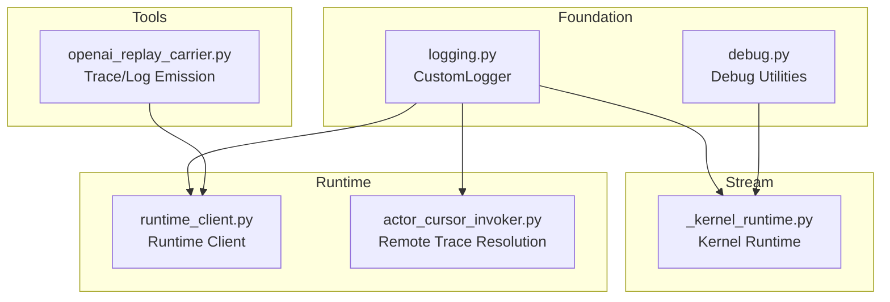
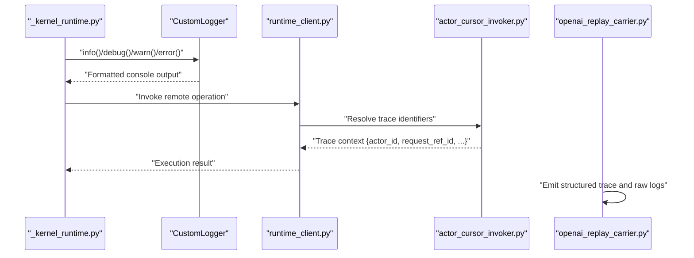
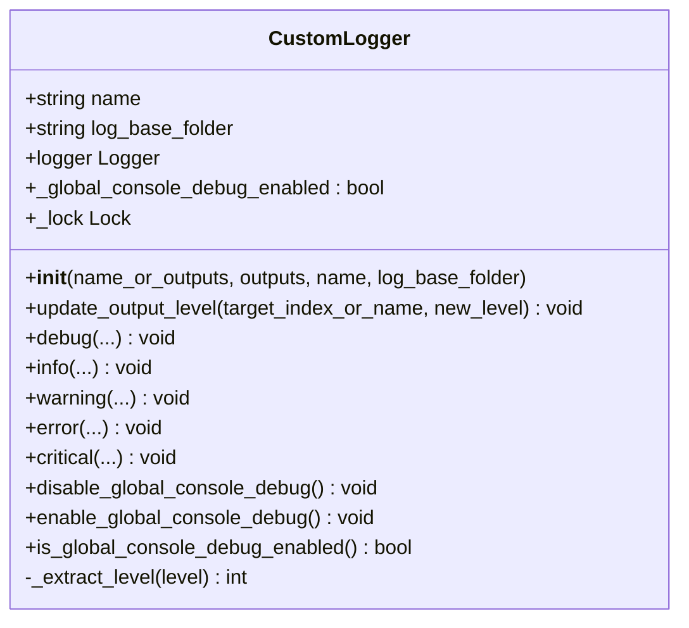
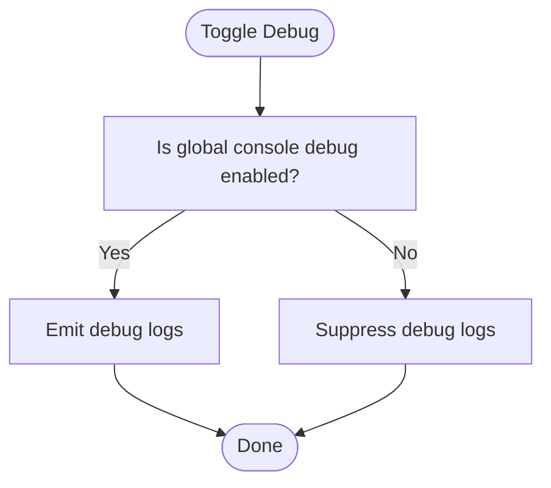
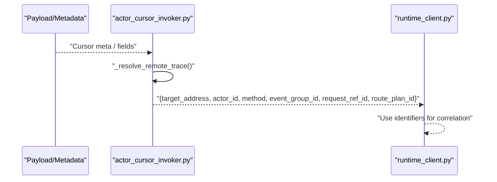
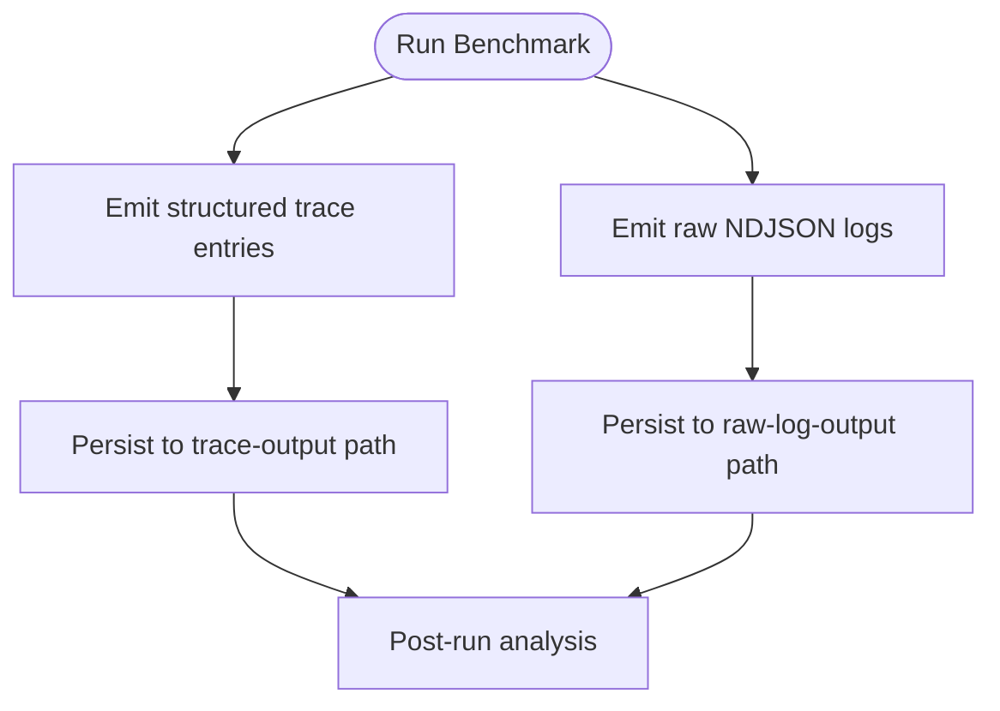
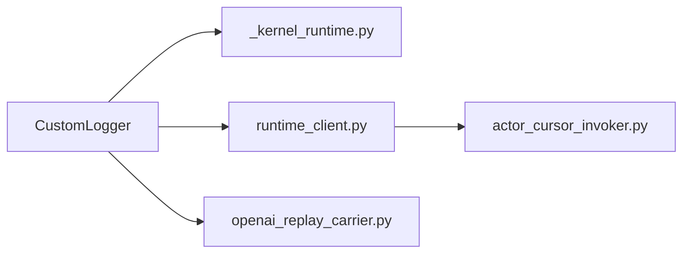

# Logging and Debugging Infrastructure

<cite>
**Referenced Files in This Document**
- [logging.py](file://src/sage/foundation/logging.py)
- [debug.py](file://src/sage/foundation/debug.py)
- [_kernel_runtime.py](file://src/sage/stream/_kernel_runtime.py)
- [runtime_client.py](file://src/sage/runtime/flownet/client/runtime_client.py)
- [actor_cursor_invoker.py](file://src/sage/runtime/flownet/runtime/flowengine/actor_cursor_invoker.py)
- [openai_replay_carrier.py](file://tools/benchmark_carrier/openai_replay_carrier.py)
- [test_vamos_launcher_contract_runner.py](file://src/tests/test_vamos_launcher_contract_runner.py)
</cite>

## Table of Contents
1. [Introduction](#introduction)
2. [Project Structure](#project-structure)
3. [Core Components](#core-components)
4. [Architecture Overview](#architecture-overview)
5. [Detailed Component Analysis](#detailed-component-analysis)
6. [Dependency Analysis](#dependency-analysis)
7. [Performance Considerations](#performance-considerations)
8. [Troubleshooting Guide](#troubleshooting-guide)
9. [Conclusion](#conclusion)
10. [Appendices](#appendices)

## Introduction
This document describes the Logging and Debugging Infrastructure in the SAGE framework. It explains the centralized logging system, including log levels, formatting, and handlers used across the codebase. It also documents debugging utilities and diagnostics, including debugging flags, trace information, and diagnostic capabilities. The document covers how logging integrates with the distributed runtime, how logs are structured across components and nodes, and provides practical guidance for configuring logging in different environments, setting up custom handlers, interpreting debug output, and troubleshooting distributed execution, performance, and configuration issues.

## Project Structure
The logging and debugging infrastructure spans several packages:
- Foundation: central logging helpers and debug utilities
- Stream runtime: kernel-level logging and tracing integration
- Runtime: distributed execution, client, and flow engine components
- Tools: benchmarking and replay utilities that emit traces and raw logs

**Diagram sources**
- [logging.py:1-96](file://src/sage/foundation/logging.py#L1-L96)
- [debug.py](file://src/sage/foundation/debug.py)
- [_kernel_runtime.py](file://src/sage/stream/_kernel_runtime.py)
- [runtime_client.py](file://src/sage/runtime/flownet/client/runtime_client.py)
- [actor_cursor_invoker.py:168-203](file://src/sage/runtime/flownet/runtime/flowengine/actor_cursor_invoker.py#L168-L203)
- [openai_replay_carrier.py:1324-1352](file://tools/benchmark_carrier/openai_replay_carrier.py#L1324-L1352)

**Section sources**
- [logging.py:1-96](file://src/sage/foundation/logging.py#L1-L96)
- [debug.py](file://src/sage/foundation/debug.py)
- [_kernel_runtime.py](file://src/sage/stream/_kernel_runtime.py)
- [runtime_client.py](file://src/sage/runtime/flownet/client/runtime_client.py)
- [actor_cursor_invoker.py:168-203](file://src/sage/runtime/flownet/runtime/flowengine/actor_cursor_invoker.py#L168-L203)
- [openai_replay_carrier.py:1324-1352](file://tools/benchmark_carrier/openai_replay_carrier.py#L1324-L1352)

## Core Components
- Centralized logging via a lightweight wrapper around Python’s logging module
- Global console debug toggle for suppressing noisy debug output
- Distributed tracing identifiers resolution for correlating logs across nodes
- Benchmarking tooling that emits structured traces and raw logs for diagnostics

Key capabilities:
- Log levels: DEBUG, INFO, WARNING/WARN, ERROR, CRITICAL
- Console handler with compact formatter
- Global enable/disable of console debug messages
- Per-logger level updates and propagation control

**Section sources**
- [logging.py:10-96](file://src/sage/foundation/logging.py#L10-L96)
- [debug.py](file://src/sage/foundation/debug.py)
- [actor_cursor_invoker.py:168-203](file://src/sage/runtime/flownet/runtime/flowengine/actor_cursor_invoker.py#L168-L203)
- [openai_replay_carrier.py:1324-1352](file://tools/benchmark_carrier/openai_replay_carrier.py#L1324-L1352)

## Architecture Overview
The logging architecture is layered:
- Foundation layer: a thin CustomLogger wrapper that standardizes handler creation and level management
- Stream layer: kernel runtime uses the logger for operator lifecycle and internal events
- Runtime layer: distributed components (client, flow engine) resolve remote trace identifiers to correlate logs across nodes
- Tools layer: benchmarking and replay utilities produce structured traces and raw logs for downstream analysis

**Diagram sources**
- [_kernel_runtime.py](file://src/sage/stream/_kernel_runtime.py)
- [logging.py:62-79](file://src/sage/foundation/logging.py#L62-L79)
- [runtime_client.py](file://src/sage/runtime/flownet/client/runtime_client.py)
- [actor_cursor_invoker.py:168-203](file://src/sage/runtime/flownet/runtime/flowengine/actor_cursor_invoker.py#L168-L203)
- [openai_replay_carrier.py:1324-1352](file://tools/benchmark_carrier/openai_replay_carrier.py#L1324-L1352)

## Detailed Component Analysis

### Centralized Logging: CustomLogger
- Purpose: Provide a unified logging interface for in-tree stream and runtime code
- Handlers: Console handler with a minimal formatter; propagation disabled to avoid duplication
- Levels: Supports standard levels and case-insensitive names; minimum effective level computed across configured outputs
- Global console debug toggle: Enable/disable all debug-level messages globally while preserving other levels
- Dynamic level updates: Update logger and handler levels after initialization

**Diagram sources**
- [logging.py:10-96](file://src/sage/foundation/logging.py#L10-L96)

**Section sources**
- [logging.py:10-96](file://src/sage/foundation/logging.py#L10-L96)

### Debugging Utilities and Flags
- Global console debug toggle: A class-level flag controls whether debug messages are emitted to the console
- Thread-safe toggling: Uses an internal lock to safely switch global debug visibility
- Practical use: Disable global debug during production runs to reduce noise; re-enable during development or targeted investigations

**Diagram sources**
- [logging.py:81-93](file://src/sage/foundation/logging.py#L81-L93)

**Section sources**
- [logging.py:81-93](file://src/sage/foundation/logging.py#L81-L93)

### Distributed Tracing and Remote Context
- Remote trace resolution: Extracts identifiers such as actor_id, method, event_group_id, request_ref_id, and route_plan_id from payloads and metadata
- Correlation: These identifiers allow correlating logs across nodes and operators in distributed execution
- Usage: Runtime client and flow engine components rely on these identifiers to maintain trace continuity

**Diagram sources**
- [actor_cursor_invoker.py:168-203](file://src/sage/runtime/flownet/runtime/flowengine/actor_cursor_invoker.py#L168-L203)
- [runtime_client.py](file://src/sage/runtime/flownet/client/runtime_client.py)

**Section sources**
- [actor_cursor_invoker.py:168-203](file://src/sage/runtime/flownet/runtime/flowengine/actor_cursor_invoker.py#L168-L203)
- [runtime_client.py](file://src/sage/runtime/flownet/client/runtime_client.py)

### Stream Kernel Logging Integration
- Kernel runtime uses the centralized logger for operator lifecycle events and internal diagnostics
- Ensures consistent formatting and level control across stream processing internals

**Section sources**
- [_kernel_runtime.py](file://src/sage/stream/_kernel_runtime.py)
- [logging.py:62-79](file://src/sage/foundation/logging.py#L62-L79)

### Benchmarking and Diagnostic Outputs
- Structured traces: The benchmarking tool emits structured trace entries with fields such as request_id, variant_kind/name, phase, deadline_class, and decision metadata
- Raw logs: Emits raw NDJSON logs for downstream analysis and replay scenarios
- Typical invocation: Tests demonstrate passing arguments for trace-output and raw-log-output, enabling persistent diagnostics

**Diagram sources**
- [openai_replay_carrier.py:1324-1352](file://tools/benchmark_carrier/openai_replay_carrier.py#L1324-L1352)
- [test_vamos_launcher_contract_runner.py:161-180](file://src/tests/test_vamos_launcher_contract_runner.py#L161-L180)

**Section sources**
- [openai_replay_carrier.py:1324-1352](file://tools/benchmark_carrier/openai_replay_carrier.py#L1324-L1352)
- [test_vamos_launcher_contract_runner.py:161-180](file://src/tests/test_vamos_launcher_contract_runner.py#L161-L180)

## Dependency Analysis
- CustomLogger depends on Python logging and threading for thread-safe toggling
- Stream kernel runtime depends on CustomLogger for internal logging
- Runtime client and flow engine depend on trace resolution utilities to correlate distributed logs
- Benchmarking tool depends on filesystem paths to write structured traces and raw logs

**Diagram sources**
- [logging.py:10-96](file://src/sage/foundation/logging.py#L10-L96)
- [_kernel_runtime.py](file://src/sage/stream/_kernel_runtime.py)
- [runtime_client.py](file://src/sage/runtime/flownet/client/runtime_client.py)
- [actor_cursor_invoker.py:168-203](file://src/sage/runtime/flownet/runtime/flowengine/actor_cursor_invoker.py#L168-L203)
- [openai_replay_carrier.py:1324-1352](file://tools/benchmark_carrier/openai_replay_carrier.py#L1324-L1352)

**Section sources**
- [logging.py:10-96](file://src/sage/foundation/logging.py#L10-L96)
- [_kernel_runtime.py](file://src/sage/stream/_kernel_runtime.py)
- [runtime_client.py](file://src/sage/runtime/flownet/client/runtime_client.py)
- [actor_cursor_invoker.py:168-203](file://src/sage/runtime/flownet/runtime/flowengine/actor_cursor_invoker.py#L168-L203)
- [openai_replay_carrier.py:1324-1352](file://tools/benchmark_carrier/openai_replay_carrier.py#L1324-L1352)

## Performance Considerations
- Global console debug toggle: Disabling global debug reduces overhead in production-like environments
- Handler formatting: Compact formatter minimizes I/O overhead for high-frequency logs
- Propagation control: Disabling propagation avoids duplicate logs and reduces contention
- Trace resolution cost: Resolving identifiers in distributed contexts adds minimal overhead but enables powerful correlation

[No sources needed since this section provides general guidance]

## Troubleshooting Guide
Common scenarios and how to address them using the logging and debugging infrastructure:

- Debugging stream processing issues
  - Enable global console debug temporarily to capture detailed operator lifecycle events
  - Use CustomLogger to set per-logger levels for focused investigation
  - Inspect kernel runtime logs for operator-specific events

- Diagnosing distributed execution problems
  - Correlate logs across nodes using resolved identifiers (actor_id, request_ref_id, route_plan_id)
  - Verify trace resolution logic in the flow engine to ensure identifiers are present in payloads/metadata

- Performance monitoring and operator behavior
  - Use benchmarking tooling to emit structured traces and raw logs
  - Persist outputs to trace-output and raw-log-output paths for offline analysis

- Configuration problems
  - Adjust logger levels dynamically using update_output_level
  - Disable global console debug to reduce noise when investigating configuration drift

Practical steps:
- Toggle global debug: Use the provided class methods to enable/disable debug emission
- Set logger levels: Configure outputs with desired levels to filter noise
- Persist diagnostics: Run benchmarks with explicit trace and raw log output paths

**Section sources**
- [logging.py:57-93](file://src/sage/foundation/logging.py#L57-L93)
- [actor_cursor_invoker.py:168-203](file://src/sage/runtime/flownet/runtime/flowengine/actor_cursor_invoker.py#L168-L203)
- [openai_replay_carrier.py:1324-1352](file://tools/benchmark_carrier/openai_replay_carrier.py#L1324-L1352)
- [test_vamos_launcher_contract_runner.py:161-180](file://src/tests/test_vamos_launcher_contract_runner.py#L161-L180)

## Conclusion
The SAGE logging and debugging infrastructure provides a centralized, configurable, and distributed-aware logging system. It offers a simple logger wrapper, global debug toggles, and robust trace resolution for correlating logs across nodes. Together with benchmarking tooling that emits structured traces and raw logs, it supports efficient development workflows, performance monitoring, and troubleshooting of stream processing and distributed execution issues.

[No sources needed since this section summarizes without analyzing specific files]

## Appendices

### Practical Configuration Examples
- Environment-specific logging
  - Development: Enable global console debug and set logger level to DEBUG for verbose insights
  - Staging/Production: Disable global console debug and set logger level to INFO or higher to minimize noise
- Custom log handlers
  - Add file handlers or structured JSON formatters by extending the logger configuration pattern used by CustomLogger
- Interpreting debug output
  - Look for operator lifecycle markers and kernel runtime events
  - Use trace identifiers to join logs across nodes and operators

[No sources needed since this section provides general guidance]