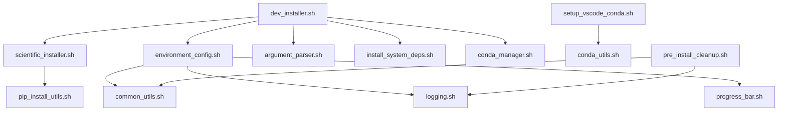
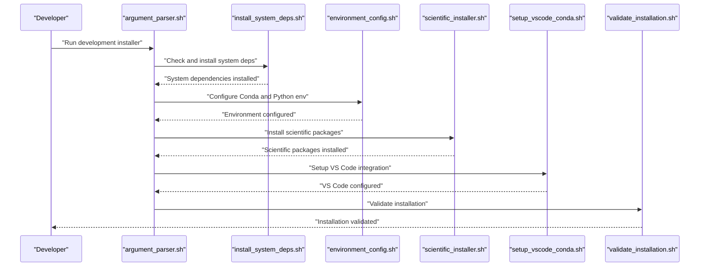
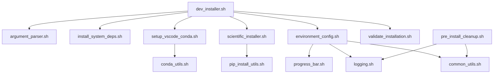

# Development Environment Setup

<cite>
**Referenced Files in This Document**
- [DEVELOPER.md](file://DEVELOPER.md)
- [dev_installer.sh](file://tools/install/installers/dev_installer.sh)
- [scientific_installer.sh](file://tools/install/installers/scientific_installer.sh)
- [setup_vscode_conda.sh](file://tools/install/conda/setup_vscode_conda.sh)
- [pre_install_cleanup.sh](file://tools/maintenance/helpers/pre_install_cleanup.sh)
- [common_utils.sh](file://tools/install/lib/common_utils.sh)
- [argument_parser.sh](file://tools/install/installers/argument_parser.sh)
- [environment_config.sh](file://tools/install/installers/environment_config.sh)
- [install_system_deps.sh](file://tools/install/installers/install_system_deps.sh)
- [conda_manager.sh](file://tools/install/installers/conda_manager.sh)
- [pip_install_utils.sh](file://tools/install/lib/pip_install_utils.sh)
- [conda_utils.sh](file://tools/install/conda/conda_utils.sh)
- [logging.sh](file://tools/install/ui/logging.sh)
- [progress_bar.sh](file://tools/install/ui/progress_bar.sh)
- [validate_installation.sh](file://tools/install/installers/validate_installation.sh)
- [verify_dependencies.py](file://tools/install/checks/verify_dependencies.py)
- [diagnose_cpp_extensions.sh](file://tools/install/checks/diagnose_cpp_extensions.sh)
- [fix_torch.sh](file://tools/install/fixes/fix_torch.sh)
- [pyproject.toml](file://pyproject.toml)
- [pytest.ini](file://pytest.ini)
- [.pyrightconfig.json](file://.pyrightconfig.json)
- [quickstart.sh](file://quickstart.sh)
</cite>

## Table of Contents
1. [Introduction](#introduction)
2. [Project Structure](#project-structure)
3. [Core Components](#core-components)
4. [Architecture Overview](#architecture-overview)
5. [Detailed Component Analysis](#detailed-component-analysis)
6. [Dependency Analysis](#dependency-analysis)
7. [Performance Considerations](#performance-considerations)
8. [Troubleshooting Guide](#troubleshooting-guide)
9. [Conclusion](#conclusion)
10. [Appendices](#appendices)

## Introduction
This section documents SAGE’s development environment setup for developers who require full development toolkit access. The development mode enables comprehensive scientific computing workflows, IDE integration, and environment optimization tailored for contributors and maintainers. It covers the development installer functionality, scientific computing dependencies, IDE integration setup, and environment optimization. The guide includes both conceptual overviews for beginners and technical details for experienced developers, with practical examples mapped to actual scripts and configuration files.

## Project Structure
The development environment setup spans several installer modules, configuration utilities, and maintenance helpers:
- Development installer orchestrates scientific computing packages, IDE integration, and environment configuration.
- Scientific installer focuses on scientific Python packages and related dependencies.
- IDE integration script configures VS Code with Conda environments.
- Pre-install cleanup ensures a clean environment before installation.
- Shared utilities provide common logging, progress reporting, and argument parsing.

**Diagram sources**
- [dev_installer.sh](file://tools/install/installers/dev_installer.sh)
- [scientific_installer.sh](file://tools/install/installers/scientific_installer.sh)
- [environment_config.sh](file://tools/install/installers/environment_config.sh)
- [argument_parser.sh](file://tools/install/installers/argument_parser.sh)
- [install_system_deps.sh](file://tools/install/installers/install_system_deps.sh)
- [conda_manager.sh](file://tools/install/installers/conda_manager.sh)
- [pip_install_utils.sh](file://tools/install/lib/pip_install_utils.sh)
- [common_utils.sh](file://tools/install/lib/common_utils.sh)
- [logging.sh](file://tools/install/ui/logging.sh)
- [progress_bar.sh](file://tools/install/ui/progress_bar.sh)
- [setup_vscode_conda.sh](file://tools/install/conda/setup_vscode_conda.sh)
- [conda_utils.sh](file://tools/install/conda/conda_utils.sh)
- [pre_install_cleanup.sh](file://tools/maintenance/helpers/pre_install_cleanup.sh)

**Section sources**
- [dev_installer.sh](file://tools/install/installers/dev_installer.sh)
- [scientific_installer.sh](file://tools/install/installers/scientific_installer.sh)
- [environment_config.sh](file://tools/install/installers/environment_config.sh)
- [argument_parser.sh](file://tools/install/installers/argument_parser.sh)
- [install_system_deps.sh](file://tools/install/installers/install_system_deps.sh)
- [conda_manager.sh](file://tools/install/installers/conda_manager.sh)
- [pip_install_utils.sh](file://tools/install/lib/pip_install_utils.sh)
- [common_utils.sh](file://tools/install/lib/common_utils.sh)
- [logging.sh](file://tools/install/ui/logging.sh)
- [progress_bar.sh](file://tools/install/ui/progress_bar.sh)
- [setup_vscode_conda.sh](file://tools/install/conda/setup_vscode_conda.sh)
- [conda_utils.sh](file://tools/install/conda/conda_utils.sh)
- [pre_install_cleanup.sh](file://tools/maintenance/helpers/pre_install_cleanup.sh)

## Core Components
- Development Installer: Orchestrates scientific computing setup, environment configuration, system dependencies, and optional IDE integration.
- Scientific Installer: Installs scientific Python packages and related dependencies.
- IDE Integration Script: Configures VS Code with Conda environments for seamless development.
- Pre-install Cleanup: Removes conflicting installations and prepares the environment.
- Utilities: Argument parsing, logging, progress reporting, and common installation helpers.

Practical examples:
- Development installation execution: [dev_installer.sh](file://tools/install/installers/dev_installer.sh)
- Scientific package setup: [scientific_installer.sh](file://tools/install/installers/scientific_installer.sh)
- IDE configuration: [setup_vscode_conda.sh](file://tools/install/conda/setup_vscode_conda.sh)
- Development environment validation: [validate_installation.sh](file://tools/install/installers/validate_installation.sh)

**Section sources**
- [dev_installer.sh](file://tools/install/installers/dev_installer.sh)
- [scientific_installer.sh](file://tools/install/installers/scientific_installer.sh)
- [setup_vscode_conda.sh](file://tools/install/conda/setup_vscode_conda.sh)
- [validate_installation.sh](file://tools/install/installers/validate_installation.sh)

## Architecture Overview
The development environment setup follows a modular architecture:
- Entry point parses arguments and triggers system dependency checks.
- Environment configuration sets up Conda and Python environments.
- Scientific installer installs scientific computing packages.
- IDE integration script configures VS Code with the Conda environment.
- Validation ensures the environment is ready for development.

**Diagram sources**
- [argument_parser.sh](file://tools/install/installers/argument_parser.sh)
- [install_system_deps.sh](file://tools/install/installers/install_system_deps.sh)
- [environment_config.sh](file://tools/install/installers/environment_config.sh)
- [scientific_installer.sh](file://tools/install/installers/scientific_installer.sh)
- [setup_vscode_conda.sh](file://tools/install/conda/setup_vscode_conda.sh)
- [validate_installation.sh](file://tools/install/installers/validate_installation.sh)

## Detailed Component Analysis

### Development Installer
Purpose:
- Provides a unified development installation mode for contributors requiring full toolkit access.
- Integrates system dependencies, environment configuration, scientific computing packages, and IDE integration.

Key responsibilities:
- Parse command-line arguments and options.
- Install system-level dependencies required for scientific computing.
- Configure Conda and Python environments.
- Install scientific Python packages.
- Optionally integrate with VS Code via Conda environments.
- Validate the installation and report readiness.

Conceptual overview for beginners:
- The development installer simplifies setting up a complete scientific computing environment with minimal manual steps.
- It ensures compatibility across platforms by managing system dependencies and Python environments.

Technical details for experienced developers:
- Supports advanced options for customizing environment paths, selecting scientific packages, and configuring IDE integration.
- Integrates with Conda management utilities for reproducible environments.
- Uses progress reporting and logging for transparent feedback during installation.

Practical example:
- Execution path: [dev_installer.sh](file://tools/install/installers/dev_installer.sh)

**Section sources**
- [dev_installer.sh](file://tools/install/installers/dev_installer.sh)
- [argument_parser.sh](file://tools/install/installers/argument_parser.sh)
- [install_system_deps.sh](file://tools/install/installers/install_system_deps.sh)
- [environment_config.sh](file://tools/install/installers/environment_config.sh)
- [conda_manager.sh](file://tools/install/installers/conda_manager.sh)
- [logging.sh](file://tools/install/ui/logging.sh)
- [progress_bar.sh](file://tools/install/ui/progress_bar.sh)

### Scientific Computing Dependencies
Purpose:
- Installs scientific Python packages essential for research-grade development and experimentation.

Key responsibilities:
- Resolve and install scientific computing packages.
- Manage pip-based installations with progress reporting.
- Verify package integrity and resolve conflicts.

Conceptual overview for beginners:
- Scientific packages enable numerical computing, data analysis, machine learning, and visualization workflows.
- The installer ensures consistent versions and resolves dependency conflicts automatically.

Technical details for experienced developers:
- Uses pip utilities for robust installation and monitoring.
- Integrates with environment configuration to ensure packages are installed in the correct environment.
- Supports selective installation of packages based on developer needs.

Practical example:
- Execution path: [scientific_installer.sh](file://tools/install/installers/scientific_installer.sh)
- Package management utilities: [pip_install_utils.sh](file://tools/install/lib/pip_install_utils.sh)

**Section sources**
- [scientific_installer.sh](file://tools/install/installers/scientific_installer.sh)
- [pip_install_utils.sh](file://tools/install/lib/pip_install_utils.sh)

### IDE Integration Setup
Purpose:
- Configures VS Code to work seamlessly with the SAGE development environment using Conda.

Key responsibilities:
- Detect and configure the Conda environment for VS Code.
- Set up Python interpreter selection and recommended extensions.
- Ensure debugging and linting tools are available within the environment.

Conceptual overview for beginners:
- IDE integration reduces friction by automatically pointing VS Code to the correct Python interpreter and installing recommended extensions.

Technical details for experienced developers:
- Integrates with Conda utilities to locate and activate the appropriate environment.
- Supports customization of interpreter paths and extension recommendations.

Practical example:
- Execution path: [setup_vscode_conda.sh](file://tools/install/conda/setup_vscode_conda.sh)
- Conda utilities: [conda_utils.sh](file://tools/install/conda/conda_utils.sh)

**Section sources**
- [setup_vscode_conda.sh](file://tools/install/conda/setup_vscode_conda.sh)
- [conda_utils.sh](file://tools/install/conda/conda_utils.sh)

### Pre-install Cleanup Procedures
Purpose:
- Ensures a clean environment before installation by removing conflicting or outdated components.

Key responsibilities:
- Identify and remove conflicting installations.
- Reset environment state to a clean baseline.
- Log cleanup actions for transparency.

Conceptual overview for beginners:
- Pre-install cleanup prevents installation conflicts and ensures a smooth setup process.

Technical details for experienced developers:
- Provides quick cleanup and comprehensive cleanup options.
- Integrates with logging utilities for auditability.

Practical example:
- Execution path: [pre_install_cleanup.sh](file://tools/maintenance/helpers/pre_install_cleanup.sh)

**Section sources**
- [pre_install_cleanup.sh](file://tools/maintenance/helpers/pre_install_cleanup.sh)
- [logging.sh](file://tools/install/ui/logging.sh)

### Environment Optimization
Purpose:
- Optimizes the development environment for performance and productivity.

Key responsibilities:
- Configure logging and progress reporting for efficient feedback.
- Provide argument parsing for flexible installation options.
- Validate installation integrity and dependencies.

Conceptual overview for beginners:
- Environment optimization improves build times, debugging capabilities, and overall developer experience.

Technical details for experienced developers:
- Uses shared utilities for consistent logging and progress reporting.
- Integrates dependency verification and diagnostics for troubleshooting.

Practical example:
- Execution path: [environment_config.sh](file://tools/install/installers/environment_config.sh)
- Utilities: [common_utils.sh](file://tools/install/lib/common_utils.sh), [logging.sh](file://tools/install/ui/logging.sh), [progress_bar.sh](file://tools/install/ui/progress_bar.sh)

**Section sources**
- [environment_config.sh](file://tools/install/installers/environment_config.sh)
- [common_utils.sh](file://tools/install/lib/common_utils.sh)
- [logging.sh](file://tools/install/ui/logging.sh)
- [progress_bar.sh](file://tools/install/ui/progress_bar.sh)

## Dependency Analysis
The development environment setup relies on a set of coordinated scripts and utilities. The diagram below shows key dependencies among components.

**Diagram sources**
- [dev_installer.sh](file://tools/install/installers/dev_installer.sh)
- [argument_parser.sh](file://tools/install/installers/argument_parser.sh)
- [install_system_deps.sh](file://tools/install/installers/install_system_deps.sh)
- [environment_config.sh](file://tools/install/installers/environment_config.sh)
- [scientific_installer.sh](file://tools/install/installers/scientific_installer.sh)
- [setup_vscode_conda.sh](file://tools/install/conda/setup_vscode_conda.sh)
- [validate_installation.sh](file://tools/install/installers/validate_installation.sh)
- [common_utils.sh](file://tools/install/lib/common_utils.sh)
- [logging.sh](file://tools/install/ui/logging.sh)
- [progress_bar.sh](file://tools/install/ui/progress_bar.sh)
- [pip_install_utils.sh](file://tools/install/lib/pip_install_utils.sh)
- [conda_utils.sh](file://tools/install/conda/conda_utils.sh)
- [pre_install_cleanup.sh](file://tools/maintenance/helpers/pre_install_cleanup.sh)

**Section sources**
- [dev_installer.sh](file://tools/install/installers/dev_installer.sh)
- [argument_parser.sh](file://tools/install/installers/argument_parser.sh)
- [install_system_deps.sh](file://tools/install/installers/install_system_deps.sh)
- [environment_config.sh](file://tools/install/installers/environment_config.sh)
- [scientific_installer.sh](file://tools/install/installers/scientific_installer.sh)
- [setup_vscode_conda.sh](file://tools/install/conda/setup_vscode_conda.sh)
- [validate_installation.sh](file://tools/install/installers/validate_installation.sh)
- [common_utils.sh](file://tools/install/lib/common_utils.sh)
- [logging.sh](file://tools/install/ui/logging.sh)
- [progress_bar.sh](file://tools/install/ui/progress_bar.sh)
- [pip_install_utils.sh](file://tools/install/lib/pip_install_utils.sh)
- [conda_utils.sh](file://tools/install/conda/conda_utils.sh)
- [pre_install_cleanup.sh](file://tools/maintenance/helpers/pre_install_cleanup.sh)

## Performance Considerations
- Use pre-install cleanup to avoid redundant installations and reduce setup time.
- Leverage environment configuration to isolate development dependencies and minimize interference with system packages.
- Utilize progress reporting and logging to identify bottlenecks during installation.
- Selectively install scientific packages to match project requirements and reduce installation overhead.

## Troubleshooting Guide
Common issues and resolutions:
- Dependency conflicts: Run pre-install cleanup to remove conflicting installations, then re-run the development installer.
- Scientific package failures: Use dependency verification and diagnostics to identify problematic packages, then address platform-specific issues.
- IDE integration problems: Re-run the VS Code integration script to ensure proper Conda environment detection and interpreter configuration.
- Installation validation failures: Review validation logs and ensure all required components are present and functional.

Practical examples:
- Dependency verification: [verify_dependencies.py](file://tools/install/checks/verify_dependencies.py)
- Diagnose C++ extensions: [diagnose_cpp_extensions.sh](file://tools/install/checks/diagnose_cpp_extensions.sh)
- PyTorch-related fixes: [fix_torch.sh](file://tools/install/fixes/fix_torch.sh)
- Environment validation: [validate_installation.sh](file://tools/install/installers/validate_installation.sh)

**Section sources**
- [verify_dependencies.py](file://tools/install/checks/verify_dependencies.py)
- [diagnose_cpp_extensions.sh](file://tools/install/checks/diagnose_cpp_extensions.sh)
- [fix_torch.sh](file://tools/install/fixes/fix_torch.sh)
- [validate_installation.sh](file://tools/install/installers/validate_installation.sh)

## Conclusion
The development environment setup for SAGE provides a comprehensive, automated solution for developers requiring full scientific computing toolkit access. By combining system dependency management, environment configuration, scientific package installation, and IDE integration, it streamlines the development workflow while maintaining reproducibility and performance. The included utilities and validation steps ensure a reliable and transparent setup process suitable for both beginners and experienced developers.

## Appendices
- Developer resources and guidelines: [DEVELOPER.md](file://DEVELOPER.md)
- Quick start script for development environment: [quickstart.sh](file://quickstart.sh)
- Project configuration for testing and type checking: [pytest.ini](file://pytest.ini), [.pyrightconfig.json](file://.pyrightconfig.json), [pyproject.toml](file://pyproject.toml)

**Section sources**
- [DEVELOPER.md](file://DEVELOPER.md)
- [quickstart.sh](file://quickstart.sh)
- [pytest.ini](file://pytest.ini)
- [.pyrightconfig.json](file://.pyrightconfig.json)
- [pyproject.toml](file://pyproject.toml)