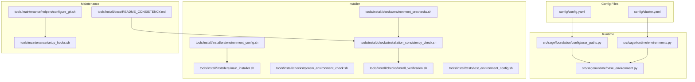
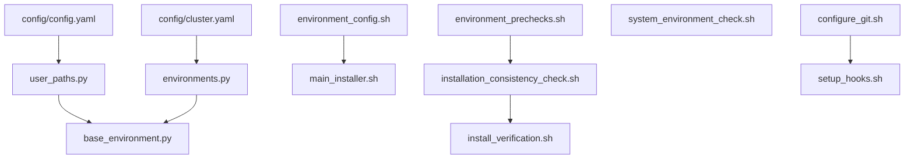
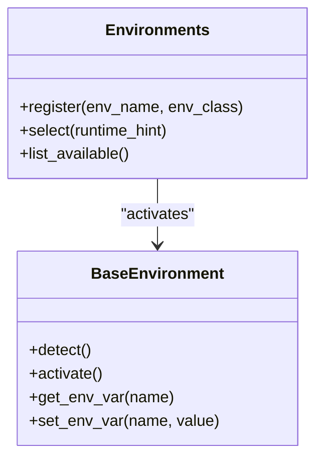
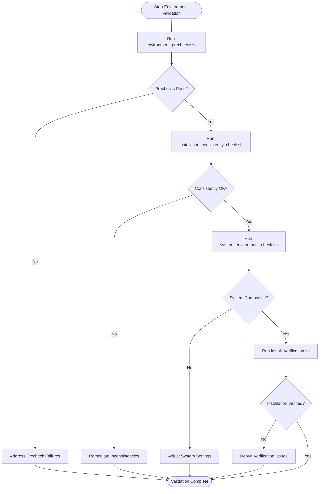
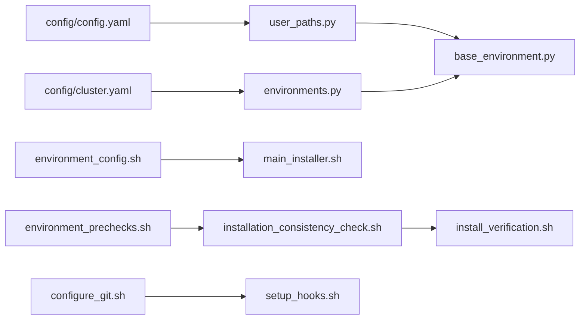

# Environment Configuration

<cite>
**Referenced Files in This Document**
- [config.yaml](file://config/config.yaml)
- [cluster.yaml](file://config/cluster.yaml)
- [user_paths.py](file://src/sage/foundation/config/user_paths.py)
- [base_environment.py](file://src/sage/runtime/base_environment.py)
- [environments.py](file://src/sage/runtime/environments.py)
- [environment_config.sh](file://tools/install/installers/environment_config.sh)
- [main_installer.sh](file://tools/install/installers/main_installer.sh)
- [environment_prechecks.sh](file://tools/install/checks/environment_prechecks.sh)
- [installation_consistency_check.sh](file://tools/install/checks/installation_consistency_check.sh)
- [system_environment_check.sh](file://tools/install/checks/system_environment_check.sh)
- [install_verification.sh](file://tools/install/checks/install_verification.sh)
- [test_environment_config.sh](file://tools/install/tests/test_environment_config.sh)
- [configure_git.sh](file://tools/maintenance/helpers/configure_git.sh)
- [setup_hooks.sh](file://tools/maintenance/setup_hooks.sh)
- [README_CONSISTENCY.md](file://tools/install/docs/README_CONSISTENCY.md)
- [quickstart.sh](file://quickstart.sh)
- [manage.sh](file://manage.sh)
</cite>

## Table of Contents
1. [Introduction](#introduction)
2. [Project Structure](#project-structure)
3. [Core Components](#core-components)
4. [Architecture Overview](#architecture-overview)
5. [Detailed Component Analysis](#detailed-component-analysis)
6. [Dependency Analysis](#dependency-analysis)
7. [Performance Considerations](#performance-considerations)
8. [Troubleshooting Guide](#troubleshooting-guide)
9. [Conclusion](#conclusion)
10. [Appendices](#appendices)

## Introduction
This section documents SAGE’s environment configuration system, which manages installation environments, configuration files, and system integration. It explains how environments are detected, configured, validated, and maintained across development and runtime contexts. The system supports both user-level configuration discovery and installer-driven environment setup, ensuring consistency across platforms and deployment modes.

## Project Structure
The environment configuration system spans configuration files, runtime environment abstractions, and installation/validation tooling:
- Configuration files define user and cluster settings.
- Runtime environment modules encapsulate environment detection and activation.
- Installer scripts orchestrate environment setup, prechecks, and validation.
- Maintenance scripts integrate Git and hooks for environment consistency.

**Diagram sources**
- [config.yaml](file://config/config.yaml)
- [cluster.yaml](file://config/cluster.yaml)
- [user_paths.py](file://src/sage/foundation/config/user_paths.py)
- [base_environment.py](file://src/sage/runtime/base_environment.py)
- [environments.py](file://src/sage/runtime/environments.py)
- [environment_config.sh](file://tools/install/installers/environment_config.sh)
- [main_installer.sh](file://tools/install/installers/main_installer.sh)
- [environment_prechecks.sh](file://tools/install/checks/environment_prechecks.sh)
- [installation_consistency_check.sh](file://tools/install/checks/installation_consistency_check.sh)
- [system_environment_check.sh](file://tools/install/checks/system_environment_check.sh)
- [install_verification.sh](file://tools/install/checks/install_verification.sh)
- [test_environment_config.sh](file://tools/install/tests/test_environment_config.sh)
- [configure_git.sh](file://tools/maintenance/helpers/configure_git.sh)
- [setup_hooks.sh](file://tools/maintenance/setup_hooks.sh)
- [README_CONSISTENCY.md](file://tools/install/docs/README_CONSISTENCY.md)

**Section sources**
- [config.yaml](file://config/config.yaml)
- [cluster.yaml](file://config/cluster.yaml)
- [user_paths.py](file://src/sage/foundation/config/user_paths.py)
- [base_environment.py](file://src/sage/runtime/base_environment.py)
- [environments.py](file://src/sage/runtime/environments.py)
- [environment_config.sh](file://tools/install/installers/environment_config.sh)
- [main_installer.sh](file://tools/install/installers/main_installer.sh)
- [environment_prechecks.sh](file://tools/install/checks/environment_prechecks.sh)
- [installation_consistency_check.sh](file://tools/install/checks/installation_consistency_check.sh)
- [system_environment_check.sh](file://tools/install/checks/system_environment_check.sh)
- [install_verification.sh](file://tools/install/checks/install_verification.sh)
- [test_environment_config.sh](file://tools/install/tests/test_environment_config.sh)
- [configure_git.sh](file://tools/maintenance/helpers/configure_git.sh)
- [setup_hooks.sh](file://tools/maintenance/setup_hooks.sh)
- [README_CONSISTENCY.md](file://tools/install/docs/README_CONSISTENCY.md)

## Core Components
- Configuration files:
  - User configuration defines environment-specific settings and defaults.
  - Cluster configuration defines runtime target and resource settings.
- Runtime environment modules:
  - User path discovery locates configuration directories and environment roots.
  - Base environment and environment registry provide detection and activation logic.
- Installer and validation:
  - Environment configuration script sets up shell and Python environment.
  - Prechecks, consistency checks, and verification ensure a clean installation.
- Maintenance:
  - Git configuration and hook setup maintain environment hygiene and consistency.

**Section sources**
- [config.yaml](file://config/config.yaml)
- [cluster.yaml](file://config/cluster.yaml)
- [user_paths.py](file://src/sage/foundation/config/user_paths.py)
- [base_environment.py](file://src/sage/runtime/base_environment.py)
- [environments.py](file://src/sage/runtime/environments.py)
- [environment_config.sh](file://tools/install/installers/environment_config.sh)
- [environment_prechecks.sh](file://tools/install/checks/environment_prechecks.sh)
- [installation_consistency_check.sh](file://tools/install/checks/installation_consistency_check.sh)
- [system_environment_check.sh](file://tools/install/checks/system_environment_check.sh)
- [install_verification.sh](file://tools/install/checks/install_verification.sh)
- [configure_git.sh](file://tools/maintenance/helpers/configure_git.sh)
- [setup_hooks.sh](file://tools/maintenance/setup_hooks.sh)

## Architecture Overview
The environment configuration architecture integrates configuration files, runtime environment detection, installer orchestration, and maintenance tasks. It ensures that user environments are discoverable, consistent, and validated across installations.

**Diagram sources**
- [config.yaml](file://config/config.yaml)
- [cluster.yaml](file://config/cluster.yaml)
- [user_paths.py](file://src/sage/foundation/config/user_paths.py)
- [base_environment.py](file://src/sage/runtime/base_environment.py)
- [environments.py](file://src/sage/runtime/environments.py)
- [environment_config.sh](file://tools/install/installers/environment_config.sh)
- [main_installer.sh](file://tools/install/installers/main_installer.sh)
- [environment_prechecks.sh](file://tools/install/checks/environment_prechecks.sh)
- [installation_consistency_check.sh](file://tools/install/checks/installation_consistency_check.sh)
- [system_environment_check.sh](file://tools/install/checks/system_environment_check.sh)
- [install_verification.sh](file://tools/install/checks/install_verification.sh)
- [configure_git.sh](file://tools/maintenance/helpers/configure_git.sh)
- [setup_hooks.sh](file://tools/maintenance/setup_hooks.sh)

## Detailed Component Analysis

### Configuration Files
- config/config.yaml: Defines user-level environment settings, defaults, and feature toggles.
- config/cluster.yaml: Defines cluster targets, runtime endpoints, and resource profiles.

Practical usage:
- Modify user settings in the user configuration file to adjust environment defaults.
- Configure cluster settings to target specific runtime environments.

**Section sources**
- [config.yaml](file://config/config.yaml)
- [cluster.yaml](file://config/cluster.yaml)

### User Path Discovery
- src/sage/foundation/config/user_paths.py: Discovers user configuration directories, environment roots, and cache locations. Provides platform-aware resolution of configuration paths.

Practical usage:
- Use path discovery to locate configuration directories during environment initialization.
- Ensure paths resolve consistently across operating systems.

**Section sources**
- [user_paths.py](file://src/sage/foundation/config/user_paths.py)

### Base Environment and Environment Registry
- src/sage/runtime/base_environment.py: Encapsulates environment detection and activation logic, including environment variable handling and runtime context setup.
- src/sage/runtime/environments.py: Maintains a registry of supported environments and provides selection logic for runtime activation.

Practical usage:
- Detect current environment and activate appropriate runtime settings.
- Register new environments or override default behavior via the environment registry.

**Diagram sources**
- [base_environment.py](file://src/sage/runtime/base_environment.py)
- [environments.py](file://src/sage/runtime/environments.py)

**Section sources**
- [base_environment.py](file://src/sage/runtime/base_environment.py)
- [environments.py](file://src/sage/runtime/environments.py)

### Environment Configuration Script
- tools/install/installers/environment_config.sh: Orchestrates environment setup, including shell configuration, Python environment preparation, and path adjustments.

Practical usage:
- Run the environment configuration script after installation to finalize environment readiness.
- Use it to reconfigure environments when switching between user and developer setups.

**Section sources**
- [environment_config.sh](file://tools/install/installers/environment_config.sh)

### Installer Orchestration
- tools/install/installers/main_installer.sh: Top-level installer that coordinates environment setup, dependency installation, and post-install steps.
- tools/install/installers/environment_config.sh: Environment-specific configuration step within the installer.

Practical usage:
- Execute the main installer to perform a full environment setup.
- Re-run environment configuration after changes to configuration files or system paths.

**Section sources**
- [main_installer.sh](file://tools/install/installers/main_installer.sh)
- [environment_config.sh](file://tools/install/installers/environment_config.sh)

### Environment Detection and Validation
- tools/install/checks/environment_prechecks.sh: Validates prerequisites and environment readiness before installation.
- tools/install/checks/installation_consistency_check.sh: Ensures installation integrity and consistency across components.
- tools/install/checks/system_environment_check.sh: Verifies system-level environment compatibility.
- tools/install/checks/install_verification.sh: Confirms successful installation and environment activation.

Practical usage:
- Run prechecks to catch environment issues early.
- Use consistency and verification checks to confirm a clean installation.

**Diagram sources**
- [environment_prechecks.sh](file://tools/install/checks/environment_prechecks.sh)
- [installation_consistency_check.sh](file://tools/install/checks/installation_consistency_check.sh)
- [system_environment_check.sh](file://tools/install/checks/system_environment_check.sh)
- [install_verification.sh](file://tools/install/checks/install_verification.sh)

**Section sources**
- [environment_prechecks.sh](file://tools/install/checks/environment_prechecks.sh)
- [installation_consistency_check.sh](file://tools/install/checks/installation_consistency_check.sh)
- [system_environment_check.sh](file://tools/install/checks/system_environment_check.sh)
- [install_verification.sh](file://tools/install/checks/install_verification.sh)

### System Integration Setup
- tools/maintenance/helpers/configure_git.sh: Configures Git settings for the repository, including hooks and commit policies.
- tools/maintenance/setup_hooks.sh: Installs and manages Git hooks to enforce environment consistency.

Practical usage:
- Configure Git after environment setup to enable automated checks.
- Install hooks to maintain consistency across team environments.

**Section sources**
- [configure_git.sh](file://tools/maintenance/helpers/configure_git.sh)
- [setup_hooks.sh](file://tools/maintenance/setup_hooks.sh)

### Environment Testing
- tools/install/tests/test_environment_config.sh: Validates environment configuration behavior and ensures regressions are caught.

Practical usage:
- Run environment tests after making configuration changes.
- Use test results to guide further validation or rollback.

**Section sources**
- [test_environment_config.sh](file://tools/install/tests/test_environment_config.sh)

### Practical Examples
- Environment setup execution:
  - Use the main installer to set up the environment, followed by environment configuration.
  - Example path: [main_installer.sh](file://tools/install/installers/main_installer.sh), [environment_config.sh](file://tools/install/installers/environment_config.sh)
- Configuration file management:
  - Edit user and cluster configuration files to customize environment defaults.
  - Example path: [config.yaml](file://config/config.yaml), [cluster.yaml](file://config/cluster.yaml)
- System integration:
  - Configure Git and install hooks to maintain environment consistency.
  - Example path: [configure_git.sh](file://tools/maintenance/helpers/configure_git.sh), [setup_hooks.sh](file://tools/maintenance/setup_hooks.sh)
- Environment validation:
  - Run prechecks, consistency checks, system checks, and verification to validate environment health.
  - Example path: [environment_prechecks.sh](file://tools/install/checks/environment_prechecks.sh), [installation_consistency_check.sh](file://tools/install/checks/installation_consistency_check.sh), [system_environment_check.sh](file://tools/install/checks/system_environment_check.sh), [install_verification.sh](file://tools/install/checks/install_verification.sh)

**Section sources**
- [main_installer.sh](file://tools/install/installers/main_installer.sh)
- [environment_config.sh](file://tools/install/installers/environment_config.sh)
- [config.yaml](file://config/config.yaml)
- [cluster.yaml](file://config/cluster.yaml)
- [configure_git.sh](file://tools/maintenance/helpers/configure_git.sh)
- [setup_hooks.sh](file://tools/maintenance/setup_hooks.sh)
- [environment_prechecks.sh](file://tools/install/checks/environment_prechecks.sh)
- [installation_consistency_check.sh](file://tools/install/checks/installation_consistency_check.sh)
- [system_environment_check.sh](file://tools/install/checks/system_environment_check.sh)
- [install_verification.sh](file://tools/install/checks/install_verification.sh)

## Dependency Analysis
The environment configuration system exhibits layered dependencies:
- Configuration files feed into runtime environment discovery and activation.
- Runtime environment modules depend on user path discovery.
- Installer scripts depend on environment configuration and validation checks.
- Maintenance scripts depend on environment configuration and installer outputs.

**Diagram sources**
- [config.yaml](file://config/config.yaml)
- [cluster.yaml](file://config/cluster.yaml)
- [user_paths.py](file://src/sage/foundation/config/user_paths.py)
- [base_environment.py](file://src/sage/runtime/base_environment.py)
- [environments.py](file://src/sage/runtime/environments.py)
- [environment_config.sh](file://tools/install/installers/environment_config.sh)
- [main_installer.sh](file://tools/install/installers/main_installer.sh)
- [environment_prechecks.sh](file://tools/install/checks/environment_prechecks.sh)
- [installation_consistency_check.sh](file://tools/install/checks/installation_consistency_check.sh)
- [install_verification.sh](file://tools/install/checks/install_verification.sh)
- [configure_git.sh](file://tools/maintenance/helpers/configure_git.sh)
- [setup_hooks.sh](file://tools/maintenance/setup_hooks.sh)

**Section sources**
- [config.yaml](file://config/config.yaml)
- [cluster.yaml](file://config/cluster.yaml)
- [user_paths.py](file://src/sage/foundation/config/user_paths.py)
- [base_environment.py](file://src/sage/runtime/base_environment.py)
- [environments.py](file://src/sage/runtime/environments.py)
- [environment_config.sh](file://tools/install/installers/environment_config.sh)
- [main_installer.sh](file://tools/install/installers/main_installer.sh)
- [environment_prechecks.sh](file://tools/install/checks/environment_prechecks.sh)
- [installation_consistency_check.sh](file://tools/install/checks/installation_consistency_check.sh)
- [install_verification.sh](file://tools/install/checks/install_verification.sh)
- [configure_git.sh](file://tools/maintenance/helpers/configure_git.sh)
- [setup_hooks.sh](file://tools/maintenance/setup_hooks.sh)

## Performance Considerations
- Minimize redundant environment scans by caching discovered paths and environment states.
- Batch configuration updates to reduce repeated disk writes and environment refreshes.
- Use targeted validation checks during development to avoid long-running full validations.

## Troubleshooting Guide
Common issues and resolutions:
- Environment not detected:
  - Verify configuration files and user path discovery.
  - Re-run environment configuration script to refresh environment state.
- Installation inconsistencies:
  - Run consistency checks and remediation steps.
  - Confirm system compatibility and adjust environment settings if needed.
- Git-related issues:
  - Reconfigure Git settings and reinstall hooks.
- Validation failures:
  - Review precheck logs and address failing prerequisites.
  - Use verification steps to confirm resolution.

**Section sources**
- [environment_prechecks.sh](file://tools/install/checks/environment_prechecks.sh)
- [installation_consistency_check.sh](file://tools/install/checks/installation_consistency_check.sh)
- [system_environment_check.sh](file://tools/install/checks/system_environment_check.sh)
- [install_verification.sh](file://tools/install/checks/install_verification.sh)
- [configure_git.sh](file://tools/maintenance/helpers/configure_git.sh)
- [setup_hooks.sh](file://tools/maintenance/setup_hooks.sh)

## Conclusion
SAGE’s environment configuration system provides a robust framework for managing installation environments, configuration files, and system integration. By combining configuration files, runtime environment detection, installer orchestration, and validation checks, it ensures consistent and reliable environments across diverse deployment scenarios.

## Appendices
- Additional documentation for consistency practices:
  - [README_CONSISTENCY.md](file://tools/install/docs/README_CONSISTENCY.md)
- Quickstart and management scripts:
  - [quickstart.sh](file://quickstart.sh)
  - [manage.sh](file://manage.sh)

**Section sources**
- [README_CONSISTENCY.md](file://tools/install/docs/README_CONSISTENCY.md)
- [quickstart.sh](file://quickstart.sh)
- [manage.sh](file://manage.sh)