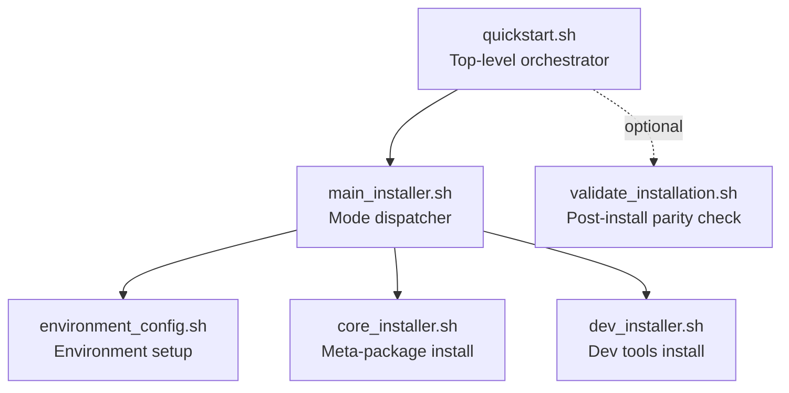
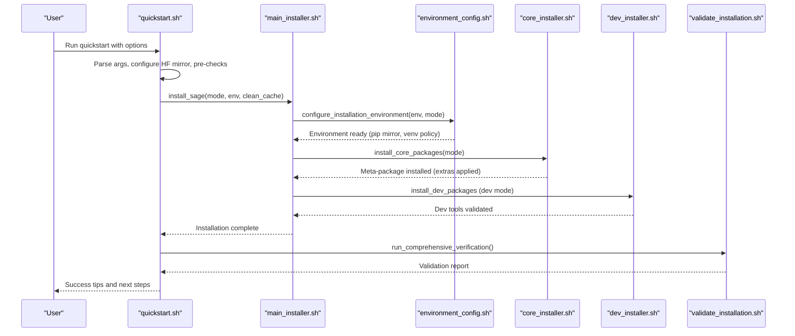
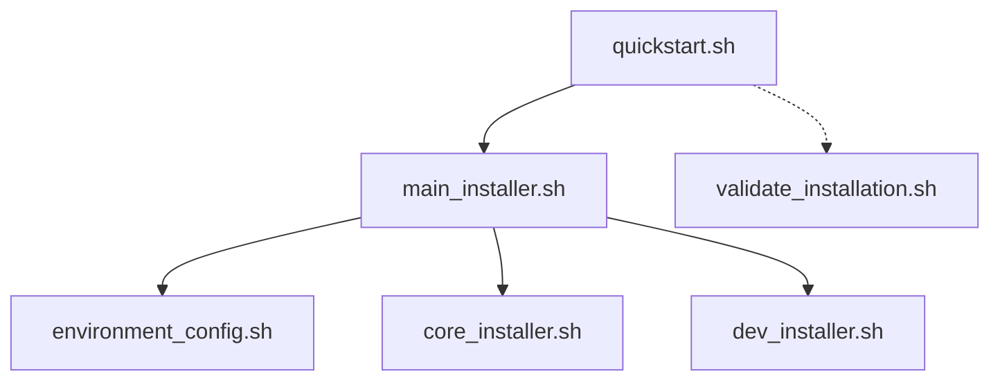

# Installation and Deployment

<cite>
**Referenced Files in This Document**
- [quickstart.sh](file://quickstart.sh)
- [main_installer.sh](file://tools/install/installers/main_installer.sh)
- [environment_config.sh](file://tools/install/installers/environment_config.sh)
- [core_installer.sh](file://tools/install/installers/core_installer.sh)
- [dev_installer.sh](file://tools/install/installers/dev_installer.sh)
- [validate_installation.sh](file://tools/install/installers/validate_installation.sh)
</cite>

## Table of Contents
1. [Introduction](#introduction)
2. [Project Structure](#project-structure)
3. [Core Components](#core-components)
4. [Architecture Overview](#architecture-overview)
5. [Detailed Component Analysis](#detailed-component-analysis)
6. [Dependency Analysis](#dependency-analysis)
7. [Performance Considerations](#performance-considerations)
8. [Troubleshooting Guide](#troubleshooting-guide)
9. [Conclusion](#conclusion)
10. [Appendices](#appendices)

## Introduction
This document provides a complete guide to installing and deploying SAGE across development and production environments. It explains the purpose of the installation system, the quickstart process, installation modes (standard, full, dev), environment configuration, dependency management, validation procedures, and deployment best practices. It is designed for both beginners who need conceptual guidance and experienced developers who require advanced configuration and production deployment strategies.

## Project Structure
SAGE’s installation and deployment logic is centered around a modular Bash orchestration layered with installer scripts and supporting utilities:
- The top-level quickstart orchestrator coordinates environment checks, interactive menus, network optimization, and delegates to the main installer.
- The main installer manages installation modes, environment configuration, and logs.
- Environment configuration scripts handle virtual environment isolation, pip mirror selection, and system checks.
- Core installer installs the meta-package and optional extras, with mirror-aware retry logic.
- Developer installer adds development tools and validates availability.
- Validation script ensures parity with CI/CD environments and offers repair options.

**Diagram sources**
- [quickstart.sh](file://quickstart.sh)
- [main_installer.sh](file://tools/install/installers/main_installer.sh)
- [environment_config.sh](file://tools/install/installers/environment_config.sh)
- [core_installer.sh](file://tools/install/installers/core_installer.sh)
- [dev_installer.sh](file://tools/install/installers/dev_installer.sh)
- [validate_installation.sh](file://tools/install/installers/validate_installation.sh)

**Section sources**
- [quickstart.sh](file://quickstart.sh)
- [main_installer.sh](file://tools/install/installers/main_installer.sh)

## Core Components
- Quickstart orchestrator: Parses arguments, runs environment checks, configures mirrors, selects installation mode, and triggers installation and validation.
- Main installer: Orchestrates environment configuration, cache cleanup, dependency integrity checks, and invokes core installation.
- Environment configuration: Enforces virtual environment policy, detects location, configures pip mirrors, and performs system checks.
- Core installer: Installs the meta-package with mode-specific extras, applies resolver guard packages, and supports mirror-aware retries.
- Developer installer: Validates development tools and highlights C++ extension handling.
- Validation: Compares local setup against CI/CD expectations and optionally repairs issues.

**Section sources**
- [quickstart.sh](file://quickstart.sh)
- [main_installer.sh](file://tools/install/installers/main_installer.sh)
- [environment_config.sh](file://tools/install/installers/environment_config.sh)
- [core_installer.sh](file://tools/install/installers/core_installer.sh)
- [dev_installer.sh](file://tools/install/installers/dev_installer.sh)
- [validate_installation.sh](file://tools/install/installers/validate_installation.sh)

## Architecture Overview
The installation pipeline integrates user intent, environment detection, dependency resolution, and validation into a cohesive workflow.

**Diagram sources**
- [quickstart.sh](file://quickstart.sh)
- [main_installer.sh](file://tools/install/installers/main_installer.sh)
- [environment_config.sh](file://tools/install/installers/environment_config.sh)
- [core_installer.sh](file://tools/install/installers/core_installer.sh)
- [dev_installer.sh](file://tools/install/installers/dev_installer.sh)
- [validate_installation.sh](file://tools/install/installers/validate_installation.sh)

## Detailed Component Analysis

### Quickstart Orchestration
- Argument parsing and defaults: Determines installation mode, environment, mirror usage, and verification options.
- Interactive menu and CI compatibility: Presents choices in non-CI sessions; auto-confirms in CI.
- Pre-checks: System checks, environment prechecks, and HF network configuration.
- Mirror optimization: Smart pip configuration before installation begins.
- Post-install hooks: Installs Git hooks, sets up developer environment, and runs health checks.

Practical examples:
- Standard installation: Run the orchestrator with the standard mode option.
- Development setup: Use the dev mode to enable development extras and local editable coverage.
- CI/CD automation: Use auto-confirm flags to avoid interactivity.

**Section sources**
- [quickstart.sh](file://quickstart.sh)

### Main Installer Logic
- Mode handling: Supports standard, full, and dev modes; cleans pip cache when enabled; records pre/post install state.
- Environment configuration: Delegates to environment configuration module and enforces environment-specific behaviors (e.g., CI pip mode).
- Dependency integrity monitoring: CI/CD safety check to prevent accidental PyPI downloads of local packages.
- Cleanup and success reporting: Cleans temporary files and prints installation summary.

Practical examples:
- Standard mode: Installs core packages without scientific or GPU dependencies.
- Full mode: Adds extended capability set via extras.
- Dev mode: Adds development tools and attempts local editable overrides for workspace repositories.

**Section sources**
- [main_installer.sh](file://tools/install/installers/main_installer.sh)

### Environment Configuration
- Virtual environment policy: Enforces isolation; disallows Python venv in favor of Conda or system environments with policy controls.
- Pip mirror selection: Auto-detects region and network conditions; builds fallback chains; supports disabling mirrors.
- System checks: Comprehensive environment checks integrated into configuration phase.
- CI/remote deployment adjustments: Modifies behavior for CI and remote deployment contexts.

Practical examples:
- Force mirror for China: Use the force mirror option to select a working mirror.
- Disable mirrors: Use the disable mirror option for strict official PyPI usage.
- Policy override: Adjust environment variable to change venv policy behavior.

**Section sources**
- [environment_config.sh](file://tools/install/installers/environment_config.sh)

### Core Installer
- Meta-package installation: Installs the primary meta-package with mode-specific extras; applies resolver guard packages to reduce resolution conflicts.
- Mirror-aware retries: Automatically retries on mirror 403 errors using configured fallback chain.
- Constraints and logging: Uses constraints file and logs to improve reproducibility and diagnostics.
- CI/remote behavior: Adapts pip invocation flags and PATH for CI and remote environments.

Practical examples:
- Standard install: Installs core package without scientific extras.
- Full install: Includes extended extras without forcing GPU dependencies.
- Dev install: Adds development extras and attempts local editable overrides for workspace repositories.

**Section sources**
- [core_installer.sh](file://tools/install/installers/core_installer.sh)

### Developer Installer
- Development tools: Validates availability of key development tools and highlights that C++ extensions are handled separately.
- Tool verification: Checks commonly used CLI and linting tools.

Practical examples:
- Verify dev tools: Run validation to confirm tool availability.
- Address missing tools: Install missing tools indicated by validation.

**Section sources**
- [dev_installer.sh](file://tools/install/installers/dev_installer.sh)

### Validation Procedures
- Installation method verification: Confirms use of the orchestrator and presence of logs.
- Package installation mode: Ensures editable installs match CI/CD expectations.
- Python environment: Verifies Python version and virtual environment usage.
- System dependencies: Checks compilers, CMake, and Git availability.
- Git submodules and hooks: Ensures submodules are initialized and hooks are installed.
- CI/CD comparison: Optionally compares against CI configuration for parity.

Practical examples:
- Basic validation: Run the validator to check environment parity.
- Strict mode: Fail on any warning to enforce strict compliance.
- Repair mode: Automatically fix issues where possible.

**Section sources**
- [validate_installation.sh](file://tools/install/installers/validate_installation.sh)

### Installation Modes
- Standard: Installs core packages without scientific or GPU extras.
- Full: Adds extended capability set via extras.
- Dev: Adds development tools and attempts local editable overrides for workspace repositories.

Best practices:
- Use standard for minimal footprint and reproducible CI-like environments.
- Use full for environments needing extended capabilities without forcing GPU dependencies.
- Use dev for active development with local editable overrides and development tools.

**Section sources**
- [main_installer.sh](file://tools/install/installers/main_installer.sh)
- [core_installer.sh](file://tools/install/installers/core_installer.sh)

### Environment Configuration
- Virtual environment policy: Enforce isolation; disallow Python venv unless policy is set to ignore.
- Pip mirror configuration: Auto-select mirrors based on region/network; supports fallback chains.
- CI/remote adjustments: Modify behavior for CI and remote deployment contexts.

Best practices:
- Prefer Conda environments for isolation.
- Use mirror selection for improved download speeds in supported regions.
- Disable mirrors when strict official PyPI usage is required.

**Section sources**
- [environment_config.sh](file://tools/install/installers/environment_config.sh)

### Dependency Management
- Resolver guard packages: Pre-install guard packages to avoid resolution regressions.
- Mirror-aware retries: Retry installation on mirror 403 errors using fallback chain.
- Constraints file: Apply constraints to improve reproducibility.
- CI/CD integrity checks: Prevent accidental PyPI downloads of local packages.

Best practices:
- Keep constraints updated and aligned with CI expectations.
- Use mirror fallback chains for resilient installations.
- Run integrity checks in CI to catch misconfiguration.

**Section sources**
- [core_installer.sh](file://tools/install/installers/core_installer.sh)
- [main_installer.sh](file://tools/install/installers/main_installer.sh)

### Validation and Post-Install Health
- Post-install verification: Imports core modules and runs diagnostic commands.
- Git hooks: Install and configure code quality and architecture checks.
- Developer tips: Provide usage hints and next steps after successful installation.

Best practices:
- Run validation after installation to catch issues early.
- Install Git hooks to maintain code quality.
- Use the orchestrator’s built-in health checks to confirm readiness.

**Section sources**
- [quickstart.sh](file://quickstart.sh)
- [validate_installation.sh](file://tools/install/installers/validate_installation.sh)

## Dependency Analysis
The installation pipeline depends on a layered set of scripts with clear separation of concerns:
- quickstart.sh depends on environment_config.sh, core_installer.sh, dev_installer.sh, and validate_installation.sh.
- main_installer.sh depends on environment_config.sh, core_installer.sh, dev_installer.sh, and several fixes and monitors.
- environment_config.sh depends on conda manager utilities and system checks.
- core_installer.sh depends on friendly error handling and mirror fallback logic.
- dev_installer.sh depends on core installer functions and validates development tool availability.
- validate_installation.sh depends on CI/CD parity checks and repair logic.

**Diagram sources**
- [quickstart.sh](file://quickstart.sh)
- [main_installer.sh](file://tools/install/installers/main_installer.sh)
- [environment_config.sh](file://tools/install/installers/environment_config.sh)
- [core_installer.sh](file://tools/install/installers/core_installer.sh)
- [dev_installer.sh](file://tools/install/installers/dev_installer.sh)
- [validate_installation.sh](file://tools/install/installers/validate_installation.sh)

**Section sources**
- [quickstart.sh](file://quickstart.sh)
- [main_installer.sh](file://tools/install/installers/main_installer.sh)
- [environment_config.sh](file://tools/install/installers/environment_config.sh)
- [core_installer.sh](file://tools/install/installers/core_installer.sh)
- [dev_installer.sh](file://tools/install/installers/dev_installer.sh)
- [validate_installation.sh](file://tools/install/installers/validate_installation.sh)

## Performance Considerations
- Mirror selection and fallback chains: Reduce installation failures and improve throughput by selecting healthy mirrors and automatically retrying on 403 responses.
- Pip cache management: Clean pip cache when enabled to avoid stale artifacts and reduce resolution overhead.
- Constraints and guard packages: Improve dependency resolution stability and speed by pinning compatible versions.
- CI/CD optimizations: Use user installs and adjusted PATH in CI to avoid permission issues and ensure tool availability.

## Troubleshooting Guide
Common issues and resolutions:
- Python venv detected: The system prohibits Python venv; switch to Conda or system environment and adjust policy if needed.
- Mirror 403 errors: The installer retries using fallback mirrors; verify mirror configuration or disable mirrors for official PyPI usage.
- Missing development tools: Install missing tools highlighted by the developer installer validation.
- Submodule initialization: Initialize Git submodules if validation reports uninitialized submodules.
- CI/CD parity: Use the validation script to compare local setup with CI configuration and apply repairs.

**Section sources**
- [environment_config.sh](file://tools/install/installers/environment_config.sh)
- [core_installer.sh](file://tools/install/installers/core_installer.sh)
- [dev_installer.sh](file://tools/install/installers/dev_installer.sh)
- [validate_installation.sh](file://tools/install/installers/validate_installation.sh)

## Conclusion
SAGE’s installation and deployment system provides a robust, configurable, and validated pipeline suitable for development workstations and production environments. By leveraging installation modes, environment configuration, dependency management, and validation procedures, teams can achieve reliable, reproducible setups across diverse contexts.

## Appendices
- Quickstart usage examples:
  - Standard installation: Run the orchestrator with the standard mode option.
  - Development setup: Use the dev mode to enable development extras and local editable coverage.
  - CI/CD automation: Use auto-confirm flags to avoid interactivity.
- Production deployment strategies:
  - Use standard or full modes depending on required capabilities.
  - Configure mirrors for regional networks and disable mirrors when strict official PyPI usage is required.
  - Enforce virtual environment policies and run integrity checks in CI.
  - Use validation to ensure parity with CI/CD expectations and apply repairs where possible.