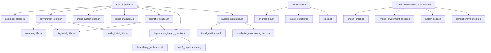
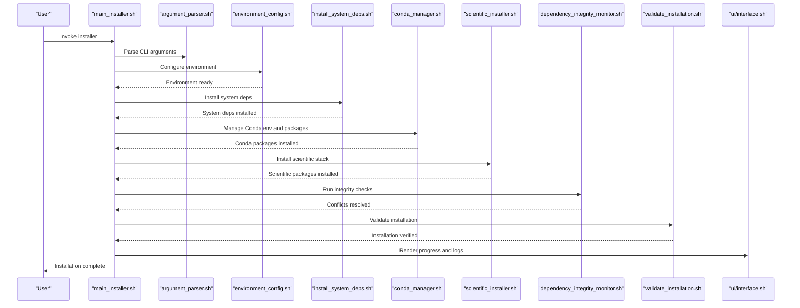
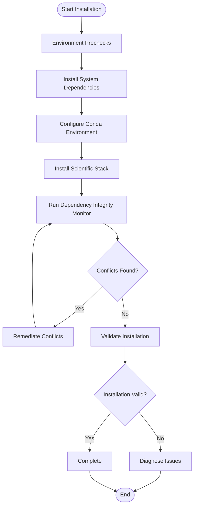

# Main Installation Process

<cite>
**Referenced Files in This Document**
- [main_installer.sh](file://tools/install/installers/main_installer.sh)
- [core_installer.sh](file://tools/install/installers/core_installer.sh)
- [environment_config.sh](file://tools/install/installers/environment_config.sh)
- [argument_parser.sh](file://tools/install/installers/argument_parser.sh)
- [install_system_deps.sh](file://tools/install/installers/install_system_deps.sh)
- [scientific_installer.sh](file://tools/install/installers/scientific_installer.sh)
- [dev_installer.sh](file://tools/install/installers/dev_installer.sh)
- [conda_manager.sh](file://tools/install/installers/conda_manager.sh)
- [pip_install_monitor.sh](file://tools/install/installers/pip_install_monitor.sh)
- [dependency_integrity_monitor.sh](file://tools/install/installers/dependency_integrity_monitor.sh)
- [validate_installation.sh](file://tools/install/installers/validate_installation.sh)
- [common_utils.sh](file://tools/install/lib/common_utils.sh)
- [conda_install_utils.sh](file://tools/install/lib/conda_install_utils.sh)
- [pip_install_utils.sh](file://tools/install/lib/pip_install_utils.sh)
- [progress_utils.sh](file://tools/install/lib/progress_utils.sh)
- [interface.sh](file://tools/install/ui/interface.sh)
- [basic_display.sh](file://tools/install/ui/basic_display.sh)
- [colors.sh](file://tools/install/ui/colors.sh)
- [logging.sh](file://tools/install/ui/logging.sh)
- [output_formatter.sh](file://tools/install/ui/output_formatter.sh)
- [progress_bar.sh](file://tools/install/ui/progress_bar.sh)
- [environment_prechecks.sh](file://tools/install/checks/environment_prechecks.sh)
- [system_check.sh](file://tools/install/checks/system_check.sh)
- [system_environment_check.sh](file://tools/install/checks/system_environment_check.sh)
- [system_deps.sh](file://tools/install/checks/system_deps.sh)
- [comprehensive_check.sh](file://tools/install/checks/comprehensive_check.sh)
- [install_verification.sh](file://tools/install/checks/install_verification.sh)
- [installation_consistency_check.sh](file://tools/install/checks/installation_consistency_check.sh)
- [verify_dependencies.py](file://tools/install/checks/verify_dependencies.py)
- [dependency_verification.sh](file://tools/install/checks/dependency_verification.sh)
- [diagnose_cpp_extensions.sh](file://tools/install/checks/diagnose_cpp_extensions.sh)
- [log_analyzer.sh](file://tools/install/checks/log_analyzer.sh)
- [monitor_installation.sh](file://tools/install/monitor_installation.sh)
- [track_install.sh](file://tools/install/cleanup/track_install.sh)
- [uninstall_sage.sh](file://tools/install/cleanup/uninstall_sage.sh)
- [install-sage-conda.sh](file://tools/install/conda/install-sage-conda.sh)
- [sage-conda.sh](file://tools/install/conda/sage-conda.sh)
- [conda_utils.sh](file://tools/install/conda/conda_utils.sh)
- [fix_conda_tos.sh](file://tools/install/conda/fix_conda_tos.sh)
- [setup_vscode_conda.sh](file://tools/install/conda/setup_vscode_conda.sh)
- [ci_install_wrapper.sh](file://tools/install/installers/ci_install_wrapper.sh)
- [clone_satellite_repos.sh](file://tools/install/installers/clone_satellite_repos.sh)
- [README_CONSISTENCY.md](file://tools/install/docs/README_CONSISTENCY.md)
- [dependencies-spec.yaml](file://dependencies-spec.yaml)
- [pyproject.toml](file://pyproject.toml)
- [Makefile](file://Makefile)
- [quickstart.sh](file://quickstart.sh)
- [manage.sh](file://manage.sh)
</cite>

## Table of Contents
1. [Introduction](#introduction)
2. [Project Structure](#project-structure)
3. [Core Components](#core-components)
4. [Architecture Overview](#architecture-overview)
5. [Detailed Component Analysis](#detailed-component-analysis)
6. [Dependency Analysis](#dependency-analysis)
7. [Performance Considerations](#performance-considerations)
8. [Troubleshooting Guide](#troubleshooting-guide)
9. [Conclusion](#conclusion)
10. [Appendices](#appendices)

## Introduction
This document explains SAGE’s standard installation system and its comprehensive dependency management. It covers the main installer script architecture, dependency resolution algorithms, environment preparation steps, and installation validation procedures. It also documents installation modes, dependency integrity checking, system compatibility verification, and installation progress tracking. Both beginner-friendly conceptual overviews and advanced developer details are included to support diverse audiences.

## Project Structure
SAGE’s installation system is organized under tools/install and is composed of modular components:
- Installers: orchestrate the end-to-end installation process and mode-specific setups
- Libraries: reusable utilities for common tasks (progress, logging, package management)
- UI: terminal display and progress rendering
- Checks: environment and dependency verification routines
- Conda: environment and package manager integration
- Cleanup: installation tracking and uninstallation utilities
- Docs: consistency and maintenance guidelines

**Diagram sources**
- [main_installer.sh](file://tools/install/installers/main_installer.sh)
- [argument_parser.sh](file://tools/install/installers/argument_parser.sh)
- [environment_config.sh](file://tools/install/installers/environment_config.sh)
- [install_system_deps.sh](file://tools/install/installers/install_system_deps.sh)
- [conda_manager.sh](file://tools/install/installers/conda_manager.sh)
- [scientific_installer.sh](file://tools/install/installers/scientific_installer.sh)
- [dependency_integrity_monitor.sh](file://tools/install/installers/dependency_integrity_monitor.sh)
- [validate_installation.sh](file://tools/install/installers/validate_installation.sh)
- [pip_install_utils.sh](file://tools/install/lib/pip_install_utils.sh)
- [conda_install_utils.sh](file://tools/install/lib/conda_install_utils.sh)
- [dependency_verification.sh](file://tools/install/checks/dependency_verification.sh)
- [verify_dependencies.py](file://tools/install/checks/verify_dependencies.py)
- [install_verification.sh](file://tools/install/checks/install_verification.sh)
- [installation_consistency_check.sh](file://tools/install/checks/installation_consistency_check.sh)
- [ui/interface.sh](file://tools/install/ui/interface.sh)
- [progress_bar.sh](file://tools/install/ui/progress_bar.sh)
- [output_formatter.sh](file://tools/install/ui/output_formatter.sh)
- [colors.sh](file://tools/install/ui/colors.sh)
- [environment_prechecks.sh](file://tools/install/checks/environment_prechecks.sh)
- [system_check.sh](file://tools/install/checks/system_check.sh)
- [system_environment_check.sh](file://tools/install/checks/system_environment_check.sh)
- [system_deps.sh](file://tools/install/checks/system_deps.sh)
- [comprehensive_check.sh](file://tools/install/checks/comprehensive_check.sh)

**Section sources**
- [main_installer.sh](file://tools/install/installers/main_installer.sh)
- [environment_config.sh](file://tools/install/installers/environment_config.sh)
- [install_system_deps.sh](file://tools/install/installers/install_system_deps.sh)
- [scientific_installer.sh](file://tools/install/installers/scientific_installer.sh)
- [conda_manager.sh](file://tools/install/installers/conda_manager.sh)
- [dependency_integrity_monitor.sh](file://tools/install/installers/dependency_integrity_monitor.sh)
- [validate_installation.sh](file://tools/install/installers/validate_installation.sh)
- [ui/interface.sh](file://tools/install/ui/interface.sh)
- [environment_prechecks.sh](file://tools/install/checks/environment_prechecks.sh)

## Core Components
- Main Installer Orchestrator: coordinates installation phases, parses arguments, and delegates to specialized installers
- Environment Configuration: prepares Python and system environments, manages virtual environments, and sets up package managers
- System Dependencies: installs OS-level prerequisites required for scientific computing and GPU support
- Scientific Stack Installer: installs core scientific libraries and optional extras
- Dependency Integrity Monitor: validates installed packages, detects conflicts, and triggers remediation
- Validation Suite: verifies installation completeness and runtime readiness
- UI and Progress: renders progress bars, formatted logs, and color-coded messages
- Checks and Diagnostics: performs environment prechecks, system compatibility, and dependency audits
- Conda Integration: manages Conda environments, channels, and package installations
- Cleanup Utilities: tracks installation metadata and supports clean removal

**Section sources**
- [main_installer.sh](file://tools/install/installers/main_installer.sh)
- [environment_config.sh](file://tools/install/installers/environment_config.sh)
- [install_system_deps.sh](file://tools/install/installers/install_system_deps.sh)
- [scientific_installer.sh](file://tools/install/installers/scientific_installer.sh)
- [dependency_integrity_monitor.sh](file://tools/install/installers/dependency_integrity_monitor.sh)
- [validate_installation.sh](file://tools/install/installers/validate_installation.sh)
- [ui/interface.sh](file://tools/install/ui/interface.sh)
- [environment_prechecks.sh](file://tools/install/checks/environment_prechecks.sh)
- [conda_manager.sh](file://tools/install/installers/conda_manager.sh)

## Architecture Overview
The installation architecture follows a layered approach:
- Argument parsing determines installation mode and options
- Environment preparation ensures a clean, compatible Python environment
- System dependencies are provisioned for scientific toolchains
- Package managers (Conda/Pip) install core and optional components
- Integrity checks and validations confirm correctness
- UI provides real-time feedback and progress tracking

**Diagram sources**
- [main_installer.sh](file://tools/install/installers/main_installer.sh)
- [argument_parser.sh](file://tools/install/installers/argument_parser.sh)
- [environment_config.sh](file://tools/install/installers/environment_config.sh)
- [install_system_deps.sh](file://tools/install/installers/install_system_deps.sh)
- [conda_manager.sh](file://tools/install/installers/conda_manager.sh)
- [scientific_installer.sh](file://tools/install/installers/scientific_installer.sh)
- [dependency_integrity_monitor.sh](file://tools/install/installers/dependency_integrity_monitor.sh)
- [validate_installation.sh](file://tools/install/installers/validate_installation.sh)
- [ui/interface.sh](file://tools/install/ui/interface.sh)

## Detailed Component Analysis

### Main Installer Orchestrator
Purpose:
- Central coordination of installation phases
- Mode selection and option propagation
- Progress reporting and error handling

Key responsibilities:
- Parse arguments and set installation mode
- Prepare environment and system dependencies
- Invoke scientific stack installer
- Monitor dependency integrity
- Validate installation and report outcomes
- Integrate UI for progress and logging

Operational flow:
- Initialize logging and UI
- Parse arguments to determine mode (standard, development, CI)
- Configure environment and system dependencies
- Install scientific stack and optional extras
- Perform integrity checks and validation
- Report completion and exit status

**Section sources**
- [main_installer.sh](file://tools/install/installers/main_installer.sh)
- [argument_parser.sh](file://tools/install/installers/argument_parser.sh)
- [ui/interface.sh](file://tools/install/ui/interface.sh)

### Environment Preparation
Purpose:
- Establish a clean, compatible Python environment
- Configure virtual environments and package managers
- Set up environment variables and paths

Key responsibilities:
- Detect and prepare Python interpreter
- Create or reuse Conda environment
- Configure Pip and Conda channels
- Set environment variables for CUDA, compilers, and libraries

Integration points:
- Uses common utilities for environment detection
- Leverages Conda utilities for environment management
- Integrates with progress and logging UI

**Section sources**
- [environment_config.sh](file://tools/install/installers/environment_config.sh)
- [common_utils.sh](file://tools/install/lib/common_utils.sh)
- [conda_install_utils.sh](file://tools/install/lib/conda_install_utils.sh)
- [pip_install_utils.sh](file://tools/install/lib/pip_install_utils.sh)

### System Dependencies
Purpose:
- Install OS-level prerequisites for scientific computing
- Support GPU toolchains and compilers
- Ensure compatibility with target hardware

Key responsibilities:
- Detect OS and package manager
- Install compilers, build tools, and system libraries
- Configure CUDA and driver prerequisites
- Validate system capabilities

Validation:
- Precheck system compatibility
- Verify installed packages and versions
- Report missing or incompatible components

**Section sources**
- [install_system_deps.sh](file://tools/install/installers/install_system_deps.sh)
- [environment_prechecks.sh](file://tools/install/checks/environment_prechecks.sh)
- [system_check.sh](file://tools/install/checks/system_check.sh)
- [system_environment_check.sh](file://tools/install/checks/system_environment_check.sh)
- [system_deps.sh](file://tools/install/checks/system_deps.sh)

### Scientific Stack Installer
Purpose:
- Install core scientific and ML libraries
- Support optional extras and developer tools
- Manage package versions and compatibility

Key responsibilities:
- Resolve and install core packages
- Handle optional extras and extras groups
- Monitor installation progress and failures
- Coordinate with dependency integrity monitor

**Section sources**
- [scientific_installer.sh](file://tools/install/installers/scientific_installer.sh)
- [pip_install_monitor.sh](file://tools/install/installers/pip_install_monitor.sh)

### Dependency Integrity Monitor
Purpose:
- Validate installed packages and detect conflicts
- Remediate conflicts and enforce constraints
- Audit dependency chains and resolve version mismatches

Key responsibilities:
- Run dependency verification scripts and Python validators
- Detect and resolve conflicts
- Reinstall problematic packages
- Log diagnostics and remediation actions

**Section sources**
- [dependency_integrity_monitor.sh](file://tools/install/installers/dependency_integrity_monitor.sh)
- [dependency_verification.sh](file://tools/install/checks/dependency_verification.sh)
- [verify_dependencies.py](file://tools/install/checks/verify_dependencies.py)

### Validation Suite
Purpose:
- Confirm installation completeness and correctness
- Verify runtime readiness and environment health
- Provide diagnostic reports and pass/fail indicators

Key responsibilities:
- Run installation verification checks
- Perform consistency validation
- Generate validation reports
- Surface actionable errors and warnings

**Section sources**
- [validate_installation.sh](file://tools/install/installers/validate_installation.sh)
- [install_verification.sh](file://tools/install/checks/install_verification.sh)
- [installation_consistency_check.sh](file://tools/install/checks/installation_consistency_check.sh)

### UI and Progress Tracking
Purpose:
- Provide real-time feedback during installation
- Render progress bars and formatted logs
- Color-code messages for clarity

Key responsibilities:
- Initialize UI components
- Render progress bars and status updates
- Format and output logs with severity levels
- Manage color themes and display styles

**Section sources**
- [ui/interface.sh](file://tools/install/ui/interface.sh)
- [progress_bar.sh](file://tools/install/ui/progress_bar.sh)
- [output_formatter.sh](file://tools/install/ui/output_formatter.sh)
- [colors.sh](file://tools/install/ui/colors.sh)
- [logging.sh](file://tools/install/ui/logging.sh)

### Conda Integration
Purpose:
- Manage Conda environments and package installations
- Configure channels and solver preferences
- Support VS Code and IDE integration

Key responsibilities:
- Create and activate Conda environments
- Install packages via Conda with channel management
- Fix Conda configuration issues
- Provide VS Code setup assistance

**Section sources**
- [conda_manager.sh](file://tools/install/installers/conda_manager.sh)
- [install-sage-conda.sh](file://tools/install/conda/install-sage-conda.sh)
- [sage-conda.sh](file://tools/install/conda/sage-conda.sh)
- [conda_utils.sh](file://tools/install/conda/conda_utils.sh)
- [fix_conda_tos.sh](file://tools/install/conda/fix_conda_tos.sh)
- [setup_vscode_conda.sh](file://tools/install/conda/setup_vscode_conda.sh)

### Cleanup Utilities
Purpose:
- Track installation metadata and support uninstallation
- Provide cleanup scripts for partial or failed installations

Key responsibilities:
- Record installation state and artifacts
- Uninstall SAGE and related components
- Clean up temporary files and caches

**Section sources**
- [track_install.sh](file://tools/install/cleanup/track_install.sh)
- [uninstall_sage.sh](file://tools/install/cleanup/uninstall_sage.sh)

## Dependency Analysis
The installation system enforces dependency integrity through:
- Pre-installation environment checks
- Post-installation verification and audits
- Conflict detection and remediation
- Version constraint enforcement

**Diagram sources**
- [environment_prechecks.sh](file://tools/install/checks/environment_prechecks.sh)
- [system_deps.sh](file://tools/install/checks/system_deps.sh)
- [conda_manager.sh](file://tools/install/installers/conda_manager.sh)
- [scientific_installer.sh](file://tools/install/installers/scientific_installer.sh)
- [dependency_integrity_monitor.sh](file://tools/install/installers/dependency_integrity_monitor.sh)
- [validate_installation.sh](file://tools/install/installers/validate_installation.sh)

**Section sources**
- [dependency_integrity_monitor.sh](file://tools/install/installers/dependency_integrity_monitor.sh)
- [dependency_verification.sh](file://tools/install/checks/dependency_verification.sh)
- [verify_dependencies.py](file://tools/install/checks/verify_dependencies.py)
- [install_verification.sh](file://tools/install/checks/install_verification.sh)
- [installation_consistency_check.sh](file://tools/install/checks/installation_consistency_check.sh)

## Performance Considerations
- Parallelization: Where safe, installers leverage concurrent package operations to reduce total installation time
- Caching: Conda and Pip caches are utilized to avoid redundant downloads
- Incremental checks: Environment and dependency checks short-circuit on success to minimize overhead
- Progress reporting: UI updates are throttled to balance responsiveness and overhead
- System compatibility: Early system checks prevent costly reattempts due to incompatible environments

## Troubleshooting Guide
Common issues and resolutions:
- Environment conflicts: Use dependency integrity monitor to detect and remediate conflicts
- System dependency failures: Review system prechecks and reinstall missing system packages
- Conda configuration problems: Apply Conda fixes and reconfigure channels
- Installation inconsistencies: Run validation suite and consistency checks to identify failing components
- Logging and diagnostics: Use log analyzer to parse installation logs and pinpoint failures

Practical workflows:
- Standard installation execution: Invoke the main installer with default options to perform a full installation
- Dependency conflict resolution: Run integrity monitor and follow remediation prompts
- Environment verification: Execute environment prechecks and system checks before installation
- Installation troubleshooting: Use validation and consistency checks, then consult logs and diagnostics

**Section sources**
- [dependency_integrity_monitor.sh](file://tools/install/installers/dependency_integrity_monitor.sh)
- [environment_prechecks.sh](file://tools/install/checks/environment_prechecks.sh)
- [system_check.sh](file://tools/install/checks/system_check.sh)
- [system_environment_check.sh](file://tools/install/checks/system_environment_check.sh)
- [system_deps.sh](file://tools/install/checks/system_deps.sh)
- [install_verification.sh](file://tools/install/checks/install_verification.sh)
- [installation_consistency_check.sh](file://tools/install/checks/installation_consistency_check.sh)
- [log_analyzer.sh](file://tools/install/checks/log_analyzer.sh)

## Conclusion
SAGE’s installation system provides a robust, modular framework for deploying the platform across diverse environments. Its layered architecture ensures reliable dependency management, environment preparation, and validation. By combining automated checks, integrity monitoring, and comprehensive diagnostics, it supports both straightforward standard installations and advanced customization scenarios.

## Appendices
- Installation Modes:
  - Standard: Full scientific stack with core dependencies
  - Development: Adds developer tools and extras
  - CI: Optimized for continuous integration environments
- Configuration and Specifications:
  - Dependency specifications are defined in the project’s dependency specification file
  - Build and packaging configurations are managed via the project’s configuration files

**Section sources**
- [ci_install_wrapper.sh](file://tools/install/installers/ci_install_wrapper.sh)
- [dev_installer.sh](file://tools/install/installers/dev_installer.sh)
- [dependencies-spec.yaml](file://dependencies-spec.yaml)
- [pyproject.toml](file://pyproject.toml)
- [Makefile](file://Makefile)
- [quickstart.sh](file://quickstart.sh)
- [manage.sh](file://manage.sh)