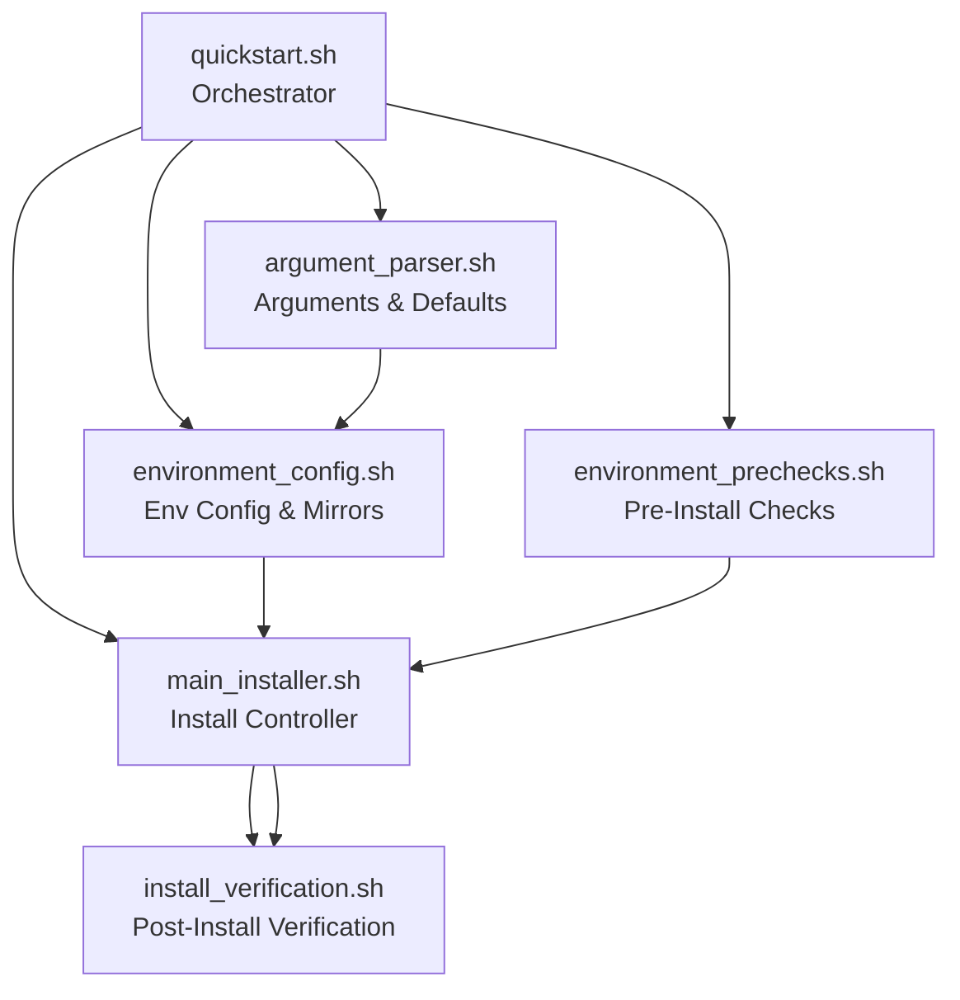
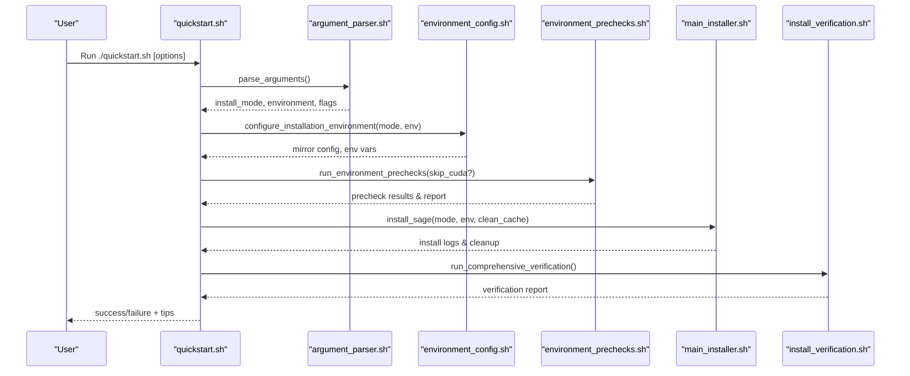
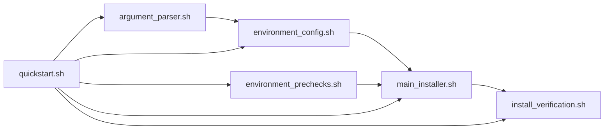

# Quickstart Setup

<cite>
**Referenced Files in This Document**
- [quickstart.sh](file://quickstart.sh)
- [README.md](file://README.md)
- [DEVELOPER.md](file://DEVELOPER.md)
- [argument_parser.sh](file://tools/install/installers/argument_parser.sh)
- [main_installer.sh](file://tools/install/installers/main_installer.sh)
- [environment_config.sh](file://tools/install/installers/environment_config.sh)
- [environment_prechecks.sh](file://tools/install/checks/environment_prechecks.sh)
- [install_verification.sh](file://tools/install/checks/install_verification.sh)
- [install_verification.sh](file://tools/install/checks/install_verification.sh)
</cite>

## Table of Contents
1. [Introduction](#introduction)
2. [Project Structure](#project-structure)
3. [Core Components](#core-components)
4. [Architecture Overview](#architecture-overview)
5. [Detailed Component Analysis](#detailed-component-analysis)
6. [Dependency Analysis](#dependency-analysis)
7. [Performance Considerations](#performance-considerations)
8. [Troubleshooting Guide](#troubleshooting-guide)
9. [Conclusion](#conclusion)
10. [Appendices](#appendices)

## Introduction
This Quickstart Setup section explains SAGE’s streamlined installation and initial configuration process. The goal is immediate development and testing readiness with minimal friction. The quickstart process automates environment validation, dependency resolution, and environment setup to deliver a working SAGE installation quickly. It supports both interactive guided setup and fully automated modes for CI and scripting.

The quickstart philosophy emphasizes:
- Rapid onboarding with minimal prerequisites
- Automated environment isolation and validation
- Intelligent dependency resolution and mirror selection
- Immediate verification of core functionality
- Extensible configuration for advanced users

## Project Structure
The quickstart system is centered on a single orchestrator script that delegates to modular installers and checks. The key components include:
- Orchestrator: [quickstart.sh](file://quickstart.sh)
- Argument parsing and configuration: [argument_parser.sh](file://tools/install/installers/argument_parser.sh)
- Environment configuration and mirror selection: [environment_config.sh](file://tools/install/installers/environment_config.sh)
- Installation controller: [main_installer.sh](file://tools/install/installers/main_installer.sh)
- Pre-install checks: [environment_prechecks.sh](file://tools/install/checks/environment_prechecks.sh)
- Post-install verification: [install_verification.sh](file://tools/install/checks/install_verification.sh)

**Diagram sources**
- [quickstart.sh](file://quickstart.sh)
- [argument_parser.sh](file://tools/install/installers/argument_parser.sh)
- [environment_config.sh](file://tools/install/installers/environment_config.sh)
- [environment_prechecks.sh](file://tools/install/checks/environment_prechecks.sh)
- [main_installer.sh](file://tools/install/installers/main_installer.sh)
- [install_verification.sh](file://tools/install/checks/install_verification.sh)

**Section sources**
- [quickstart.sh](file://quickstart.sh)
- [argument_parser.sh](file://tools/install/installers/argument_parser.sh)
- [environment_config.sh](file://tools/install/installers/environment_config.sh)
- [environment_prechecks.sh](file://tools/install/checks/environment_prechecks.sh)
- [main_installer.sh](file://tools/install/installers/main_installer.sh)
- [install_verification.sh](file://tools/install/checks/install_verification.sh)

## Core Components
- Quickstart orchestrator: Parses arguments, validates environment, configures mirrors, runs pre-checks, executes installation, and verifies results.
- Argument parser: Defines install modes (standard, full, dev), environment choices (conda/pip), and numerous options (mirrors, hooks, resume, verify-deps).
- Environment configuration: Detects locale/network, selects optimal pip mirror, enforces environment isolation policies, and configures Python/pip commands.
- Pre-install checks: Validates disk space, connectivity, memory, and CUDA availability; generates a precheck report.
- Installation controller: Executes install modes, manages cache cleanup, tracks packages, and performs CI-safe dependency integrity checks.
- Post-install verification: Runs smoke tests, CLI checks, imports verification, and dependency version checks; produces a structured report.

**Section sources**
- [quickstart.sh](file://quickstart.sh)
- [argument_parser.sh](file://tools/install/installers/argument_parser.sh)
- [environment_config.sh](file://tools/install/installers/environment_config.sh)
- [environment_prechecks.sh](file://tools/install/checks/environment_prechecks.sh)
- [main_installer.sh](file://tools/install/installers/main_installer.sh)
- [install_verification.sh](file://tools/install/checks/install_verification.sh)

## Architecture Overview
The quickstart pipeline is a phased process:
1. Argument parsing and defaults
2. Environment diagnosis and isolation policy
3. Mirror selection and environment configuration
4. Pre-install checks and optional CUDA checks
5. Installation execution per mode
6. Post-install verification and reporting

**Diagram sources**
- [quickstart.sh](file://quickstart.sh)
- [argument_parser.sh](file://tools/install/installers/argument_parser.sh)
- [environment_config.sh](file://tools/install/installers/environment_config.sh)
- [environment_prechecks.sh](file://tools/install/checks/environment_prechecks.sh)
- [main_installer.sh](file://tools/install/installers/main_installer.sh)
- [install_verification.sh](file://tools/install/checks/install_verification.sh)

## Detailed Component Analysis

### Quickstart Orchestrator (quickstart.sh)
Responsibilities:
- Enforces modern Bash requirement and sets up terminal environment
- Imports UI, checks, installers, fixes, and mirrors
- Performs pre-check system environment and Unicode symbol setup
- Supports workspace initialization and Conda setup modes
- Drives argument parsing, environment doctor, pre-checks, installation, verification, hooks, and post-install tips
- Handles CI-friendly behavior and auto-confirm flows

Key behaviors:
- Modern Bash enforcement and fallback to a compatible interpreter
- Early HF network configuration to support restricted networks
- Conditional doctor mode with optional auto-fixes
- Smart mirror configuration prior to installation
- Git hooks installation with configurable mode/profile
- Post-install health checks and environment validation

**Section sources**
- [quickstart.sh](file://quickstart.sh)

### Argument Parser (argument_parser.sh)
Responsibilities:
- Defines install modes: standard, full, dev
- Defines environment choices: conda, pip
- Provides extensive options: mirrors, hooks, resume, verify-deps, cache clean, clean-before-install, force rebuild, workspace, setup-conda, clone satellites
- Implements interactive menu for new users
- Exposes environment recommendations and smart detection

Operational highlights:
- Automatic environment recommendation (conda vs pip) based on current state
- Safe defaults for CI and interactive sessions
- Comprehensive help and examples

**Section sources**
- [argument_parser.sh](file://tools/install/installers/argument_parser.sh)

### Environment Configuration (environment_config.sh)
Responsibilities:
- Detects mainland China IP/locale and selects appropriate mirrors
- Probes mirror health and builds fallback chain
- Enforces environment isolation policy (disallows venv/.venv)
- Configures Python/pip commands and environment variables
- Integrates CI/remote deployment special handling

Key features:
- Intelligent mirror selection with fallback chain
- Locale-aware mirror preference
- CI/CD and remote deployment optimizations
- Environment isolation enforcement with configurable policy

**Section sources**
- [environment_config.sh](file://tools/install/installers/environment_config.sh)

### Pre-Install Checks (environment_prechecks.sh)
Responsibilities:
- Disk space, network connectivity, memory checks
- Conda environment validation (discourages base environment)
- Optional CUDA availability check
- Generates a structured precheck report

Guidance:
- Warns on insufficient resources but continues installation
- Suggests corrective actions for each failing category
- Reports system information for diagnostics

**Section sources**
- [environment_prechecks.sh](file://tools/install/checks/environment_prechecks.sh)

### Installation Controller (main_installer.sh)
Responsibilities:
- Executes install modes: standard, full, dev
- Manages cache cleanup and pip cache purging
- Tracks installed packages and logs
- Performs CI-safe dependency integrity checks
- Cleans up temporary files and directories

Highlights:
- Mode-specific behavior with dev adding development tools and editable installs
- CI/CD safeguards to prevent unintended local package downloads
- Robust logging and post-install tracking

**Section sources**
- [main_installer.sh](file://tools/install/installers/main_installer.sh)

### Post-Install Verification (install_verification.sh)
Responsibilities:
- CLI command checks (sage verify, chat help, index ingest help)
- Core SAGE package imports verification
- Dependency version compatibility checks
- Hello world smoke test
- Health checks via sage-dev status
- Generates a comprehensive verification report

Guidance:
- Emphasizes core in-tree surfaces (foundation, stream, runtime, serving, edge, cli)
- Notes optional/transition namespaces and external packages
- Provides actionable failure diagnostics

**Section sources**
- [install_verification.sh](file://tools/install/checks/install_verification.sh)

### Conceptual Overview
For beginners:
- The quickstart process minimizes setup friction and guides you through environment choices and installation modes.
- It validates your environment early, selects mirrors automatically, and installs the right packages for your use case.
- After installation, it verifies core functionality so you can immediately start experimenting.

For experienced developers:
- The quickstart process is highly configurable: choose install modes, environment, mirrors, hooks, and verification depth.
- It supports CI-friendly behavior, environment isolation enforcement, and robust verification/reporting.
- Advanced users can customize mirror sources, skip caches, resume interrupted installs, and enforce strict dependency verification.

[No sources needed since this section doesn't analyze specific files]

## Dependency Analysis
The quickstart process depends on a layered set of modules that collaborate to deliver a reliable installation:

**Diagram sources**
- [quickstart.sh](file://quickstart.sh)
- [argument_parser.sh](file://tools/install/installers/argument_parser.sh)
- [environment_config.sh](file://tools/install/installers/environment_config.sh)
- [environment_prechecks.sh](file://tools/install/checks/environment_prechecks.sh)
- [main_installer.sh](file://tools/install/installers/main_installer.sh)
- [install_verification.sh](file://tools/install/checks/install_verification.sh)

**Section sources**
- [quickstart.sh](file://quickstart.sh)
- [argument_parser.sh](file://tools/install/installers/argument_parser.sh)
- [environment_config.sh](file://tools/install/installers/environment_config.sh)
- [environment_prechecks.sh](file://tools/install/checks/environment_prechecks.sh)
- [main_installer.sh](file://tools/install/installers/main_installer.sh)
- [install_verification.sh](file://tools/install/checks/install_verification.sh)

## Performance Considerations
- Mirror selection and fallback chains accelerate downloads, especially in constrained networks.
- Pip cache purging and build cache detection improve reliability and reduce stale metadata issues.
- CI/CD optimizations (disabling user site packages, mirror probing) balance speed and correctness.
- Optional CUDA checks can be skipped to shorten pre-check duration when GPU acceleration is not required.

[No sources needed since this section provides general guidance]

## Troubleshooting Guide
Common quickstart issues and resolutions:
- Bash version too low: The orchestrator enforces Bash 4+ and can exec a compatible interpreter if available.
- Restricted network access: The orchestrator configures HuggingFace mirror and suggests setting tokens to avoid rate limits.
- Conda base environment: The environment configuration discourages using the base environment and offers to create a dedicated environment.
- Insufficient disk/memory: Pre-checks warn and suggest freeing space or closing applications.
- Mirror download failures: The environment configuration probes mirrors and falls back to official PyPI or other mirrors.
- Import failures: The verification module provides detailed diagnostics and suggests reinstallation steps.
- CI dependency violations: The installer performs integrity checks to prevent accidental local package downloads from PyPI.

**Section sources**
- [quickstart.sh](file://quickstart.sh)
- [environment_config.sh](file://tools/install/installers/environment_config.sh)
- [environment_prechecks.sh](file://tools/install/checks/environment_prechecks.sh)
- [install_verification.sh](file://tools/install/checks/install_verification.sh)

## Conclusion
The SAGE quickstart process delivers a fast, reliable, and configurable installation path. It automates environment validation, intelligent dependency resolution, and environment setup to get you productive quickly. Whether you prefer guided setup or fully automated CI flows, the quickstart system adapts to your needs while maintaining robust verification and diagnostics.

[No sources needed since this section summarizes without analyzing specific files]

## Appendices

### Step-by-Step Installation Process
- Prepare: Ensure modern Bash and network access.
- Choose mode: standard (core only), full (core + extras), dev (full + dev tools + editable).
- Choose environment: conda (recommended) or pip.
- Configure mirrors: auto-selected or custom mirror; optional disable.
- Confirm: Interactive confirmation or --yes for automation.
- Install: The installer resolves dependencies, cleans caches, and installs per mode.
- Verify: Smoke tests, CLI checks, imports, and dependency compatibility.
- Post-install: Git hooks, environment tips, and optional ZOO packages.

**Section sources**
- [README.md](file://README.md)
- [DEVELOPER.md](file://DEVELOPER.md)
- [argument_parser.sh](file://tools/install/installers/argument_parser.sh)
- [environment_config.sh](file://tools/install/installers/environment_config.sh)
- [main_installer.sh](file://tools/install/installers/main_installer.sh)
- [install_verification.sh](file://tools/install/checks/install_verification.sh)

### Practical Examples
- Minimal development setup: [README.md](file://README.md)
- Developer workflow: [DEVELOPER.md](file://DEVELOPER.md)
- Standard vs dev vs full semantics: [README.md](file://README.md)
- Environment configuration and mirrors: [environment_config.sh](file://tools/install/installers/environment_config.sh)
- Verification commands: [install_verification.sh](file://tools/install/checks/install_verification.sh)

**Section sources**
- [README.md](file://README.md)
- [DEVELOPER.md](file://DEVELOPER.md)
- [environment_config.sh](file://tools/install/installers/environment_config.sh)
- [install_verification.sh](file://tools/install/checks/install_verification.sh)