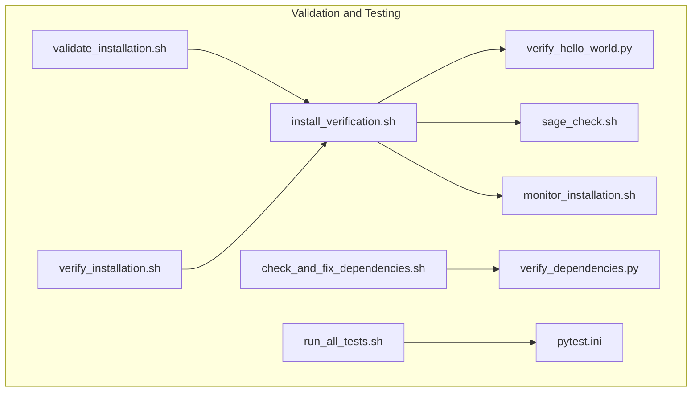
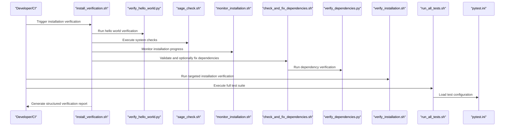
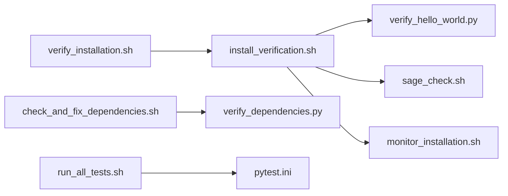

# Validation and Testing

<cite>
**Referenced Files in This Document**
- [install_verification.sh](file://tools/install/checks/install_verification.sh)
- [check_and_fix_dependencies.sh](file://tools/install/checks/check_and_fix_dependencies.sh)
- [verify_dependencies.py](file://tools/install/checks/verify_dependencies.py)
- [validate_installation.sh](file://tools/install/installers/validate_installation.sh)
- [verify_installation.sh](file://tools/install/tests/verify_installation.sh)
- [run_all_tests.sh](file://tools/install/tests/run_all_tests.sh)
- [sage_check.sh](file://tools/install/checks/sage_check.sh)
- [monitor_installation.sh](file://tools/monitor_installation.sh)
- [verify_hello_world.py](file://tools/verify_hello_world.py)
- [pytest.ini](file://pytest.ini)
- [DEVELOPER.md](file://DEVELOPER.md)
- [README.md](file://README.md)
</cite>

## Table of Contents
1. [Introduction](#introduction)
2. [Project Structure](#project-structure)
3. [Core Components](#core-components)
4. [Architecture Overview](#architecture-overview)
5. [Detailed Component Analysis](#detailed-component-analysis)
6. [Dependency Analysis](#dependency-analysis)
7. [Performance Considerations](#performance-considerations)
8. [Troubleshooting Guide](#troubleshooting-guide)
9. [Conclusion](#conclusion)

## Introduction
This section documents SAGE’s validation and testing system, focusing on installation verification and quality assurance procedures. The system ensures installation integrity, validates dependencies, and verifies core functionality through automated scripts and workflows. It provides both conceptual guidance for newcomers and technical depth for advanced users implementing custom verification procedures, integration testing, and continuous quality assurance.

## Project Structure
The validation and testing assets are organized primarily under tools/install and tools/tests, with supporting scripts and monitoring utilities. Key areas include:
- Installation verification and dependency checks
- Automated test execution
- Monitoring and reporting
- Developer and contributor guidance

**Diagram sources**
- [install_verification.sh](file://tools/install/checks/install_verification.sh)
- [check_and_fix_dependencies.sh](file://tools/install/checks/check_and_fix_dependencies.sh)
- [verify_dependencies.py](file://tools/install/checks/verify_dependencies.py)
- [validate_installation.sh](file://tools/install/installers/validate_installation.sh)
- [verify_installation.sh](file://tools/install/tests/verify_installation.sh)
- [run_all_tests.sh](file://tools/install/tests/run_all_tests.sh)
- [sage_check.sh](file://tools/install/checks/sage_check.sh)
- [monitor_installation.sh](file://tools/monitor_installation.sh)
- [verify_hello_world.py](file://tools/verify_hello_world.py)
- [pytest.ini](file://pytest.ini)

**Section sources**
- [install_verification.sh](file://tools/install/checks/install_verification.sh)
- [check_and_fix_dependencies.sh](file://tools/install/checks/check_and_fix_dependencies.sh)
- [verify_dependencies.py](file://tools/install/checks/verify_dependencies.py)
- [validate_installation.sh](file://tools/install/installers/validate_installation.sh)
- [verify_installation.sh](file://tools/install/tests/verify_installation.sh)
- [run_all_tests.sh](file://tools/install/tests/run_all_tests.sh)
- [sage_check.sh](file://tools/install/checks/sage_check.sh)
- [monitor_installation.sh](file://tools/monitor_installation.sh)
- [verify_hello_world.py](file://tools/verify_hello_world.py)
- [pytest.ini](file://pytest.ini)

## Core Components
- Installation Verification Script: Orchestrates end-to-end installation checks, runs hello world verification, collects results, and generates a structured report.
- Dependency Checking and Fixing: Validates installed packages and versions, optionally attempts automatic fixes for conflicts.
- Test Execution Utilities: Provides scripts to run targeted verification and full test suites.
- Monitoring and Reporting: Tracks installation progress and logs outcomes for later inspection.
- Developer Guidance: Documents contributor expectations and testing workflows.

Key responsibilities:
- Ensure installation integrity and system compatibility
- Verify CLI availability and core functionality
- Validate dependencies and environment prerequisites
- Produce actionable reports and logs for diagnostics

**Section sources**
- [install_verification.sh](file://tools/install/checks/install_verification.sh)
- [check_and_fix_dependencies.sh](file://tools/install/checks/check_and_fix_dependencies.sh)
- [verify_dependencies.py](file://tools/install/checks/verify_dependencies.py)
- [validate_installation.sh](file://tools/install/installers/validate_installation.sh)
- [verify_installation.sh](file://tools/install/tests/verify_installation.sh)
- [run_all_tests.sh](file://tools/install/tests/run_all_tests.sh)
- [monitor_installation.sh](file://tools/monitor_installation.sh)
- [verify_hello_world.py](file://tools/verify_hello_world.py)
- [pytest.ini](file://pytest.ini)

## Architecture Overview
The validation and testing architecture integrates shell-based verification, Python-based dependency checks, and pytest-driven test execution. It emphasizes modularity, reproducibility, and clear reporting.

**Diagram sources**
- [install_verification.sh](file://tools/install/checks/install_verification.sh)
- [verify_hello_world.py](file://tools/verify_hello_world.py)
- [sage_check.sh](file://tools/install/checks/sage_check.sh)
- [monitor_installation.sh](file://tools/monitor_installation.sh)
- [check_and_fix_dependencies.sh](file://tools/install/checks/check_and_fix_dependencies.sh)
- [verify_dependencies.py](file://tools/install/checks/verify_dependencies.py)
- [verify_installation.sh](file://tools/install/tests/verify_installation.sh)
- [run_all_tests.sh](file://tools/install/tests/run_all_tests.sh)
- [pytest.ini](file://pytest.ini)

## Detailed Component Analysis

### Installation Verification Script
Purpose:
- Execute comprehensive installation verification including hello world test, CLI checks, and system compatibility checks.
- Aggregate results and produce a structured report with pass/fail/warn outcomes.

Key behaviors:
- Initializes environment variables and logging.
- Runs hello world verification via a dedicated Python script.
- Executes system checks and monitors installation progress.
- Collects individual test outcomes and summarizes them into a final report.

Practical example:
- Trigger verification and review the generated report for pass/fail/warn counts and overall status.

**Section sources**
- [install_verification.sh](file://tools/install/checks/install_verification.sh)

### Dependency Checking and Fixing
Purpose:
- Validate installed dependencies and versions against expected constraints.
- Optionally propose or apply fixes for dependency conflicts.

Key behaviors:
- Checks Python availability and locates the dependency verification script.
- Runs the verification script and interprets exit codes.
- Presents warnings and errors, and optionally prompts for automatic fixes in interactive mode or proceeds automatically in non-interactive CI contexts.

Practical example:
- Run dependency checks to detect version mismatches and resolve them using the built-in fix mechanism.

**Section sources**
- [check_and_fix_dependencies.sh](file://tools/install/checks/check_and_fix_dependencies.sh)
- [verify_dependencies.py](file://tools/install/checks/verify_dependencies.py)

### Test Execution Workflows
Purpose:
- Provide mechanisms to run targeted installation verification and full test suites.

Key behaviors:
- Targeted verification focuses on installation-specific checks.
- Full test suite execution leverages pytest configuration for consistent test discovery and reporting.

Practical example:
- Execute targeted verification for quick checks after environment changes.
- Run the full test suite to validate broader functionality and contracts.

**Section sources**
- [verify_installation.sh](file://tools/install/tests/verify_installation.sh)
- [run_all_tests.sh](file://tools/install/tests/run_all_tests.sh)
- [pytest.ini](file://pytest.ini)

### System Compatibility and Environment Checks
Purpose:
- Ensure the runtime environment meets system prerequisites and compatibility requirements.

Key behaviors:
- Integrates with system check utilities to validate environment readiness.
- Coordinates with installation monitoring to capture environment-related events.

Practical example:
- Use system checks to confirm environment prerequisites before running validation.

**Section sources**
- [sage_check.sh](file://tools/install/checks/sage_check.sh)
- [monitor_installation.sh](file://tools/monitor_installation.sh)

### Hello World Verification
Purpose:
- Confirm that the core system initializes and executes basic functionality.

Key behaviors:
- Executes a minimal functional test to validate installation health.
- Produces outcome indicators used by the installation verification report.

Practical example:
- Review the hello world result as part of the installation verification summary.

**Section sources**
- [install_verification.sh](file://tools/install/checks/install_verification.sh)
- [verify_hello_world.py](file://tools/verify_hello_world.py)

### Validation Procedures and Quality Assurance Workflows
Purpose:
- Establish repeatable validation procedures and integrate them into development and CI workflows.

Key behaviors:
- Define validation steps, dependency verification processes, and compatibility checks.
- Support both manual execution and automated CI integration.
- Provide clear reporting and diagnostic outputs for troubleshooting.

Practical example:
- Integrate validation scripts into CI pipelines to gate releases and maintain quality.

**Section sources**
- [install_verification.sh](file://tools/install/checks/install_verification.sh)
- [validate_installation.sh](file://tools/install/installers/validate_installation.sh)
- [check_and_fix_dependencies.sh](file://tools/install/checks/check_and_fix_dependencies.sh)

## Dependency Analysis
The validation and testing system exhibits a layered dependency structure:
- Shell scripts orchestrate higher-level workflows.
- Python scripts handle dependency verification and diagnostics.
- Test runners coordinate test execution and reporting.

**Diagram sources**
- [install_verification.sh](file://tools/install/checks/install_verification.sh)
- [verify_hello_world.py](file://tools/verify_hello_world.py)
- [sage_check.sh](file://tools/install/checks/sage_check.sh)
- [monitor_installation.sh](file://tools/monitor_installation.sh)
- [check_and_fix_dependencies.sh](file://tools/install/checks/check_and_fix_dependencies.sh)
- [verify_dependencies.py](file://tools/install/checks/verify_dependencies.py)
- [verify_installation.sh](file://tools/install/tests/verify_installation.sh)
- [run_all_tests.sh](file://tools/install/tests/run_all_tests.sh)
- [pytest.ini](file://pytest.ini)

**Section sources**
- [install_verification.sh](file://tools/install/checks/install_verification.sh)
- [check_and_fix_dependencies.sh](file://tools/install/checks/check_and_fix_dependencies.sh)
- [verify_dependencies.py](file://tools/install/checks/verify_dependencies.py)
- [verify_installation.sh](file://tools/install/tests/verify_installation.sh)
- [run_all_tests.sh](file://tools/install/tests/run_all_tests.sh)
- [sage_check.sh](file://tools/install/checks/sage_check.sh)
- [monitor_installation.sh](file://tools/monitor_installation.sh)
- [verify_hello_world.py](file://tools/verify_hello_world.py)
- [pytest.ini](file://pytest.ini)

## Performance Considerations
- Minimize redundant checks by consolidating repeated validations into single orchestrated runs.
- Prefer non-interactive modes in CI to avoid blocking waits and enable faster feedback.
- Cache dependency verification results where appropriate to reduce repeated computation.
- Use targeted verification during development cycles and reserve full test suites for release gates.

## Troubleshooting Guide
Common issues and resolutions:
- Dependency conflicts: Use the dependency checking and fixing workflow to identify and resolve version mismatches.
- Installation failures: Review the structured verification report for pass/fail/warn outcomes and examine the generated log for detailed diagnostics.
- Environment readiness: Run system checks to confirm prerequisites and compatibility before proceeding with validation.
- Test execution problems: Validate pytest configuration and ensure test discovery aligns with project structure.

Practical example:
- After a failed verification, consult the generated report and re-run targeted checks to isolate failing components.

**Section sources**
- [install_verification.sh](file://tools/install/checks/install_verification.sh)
- [check_and_fix_dependencies.sh](file://tools/install/checks/check_and_fix_dependencies.sh)
- [verify_installation.sh](file://tools/install/tests/verify_installation.sh)
- [run_all_tests.sh](file://tools/install/tests/run_all_tests.sh)
- [sage_check.sh](file://tools/install/checks/sage_check.sh)
- [monitor_installation.sh](file://tools/monitor_installation.sh)
- [pytest.ini](file://pytest.ini)

## Conclusion
SAGE’s validation and testing system provides a robust framework for ensuring installation integrity, validating dependencies, and verifying system functionality. By combining shell-based orchestration, Python-powered diagnostics, and pytest-driven test execution, it supports both developer workflows and CI pipelines. Adopting these procedures consistently helps maintain quality, accelerate troubleshooting, and guarantee reliable deployments.