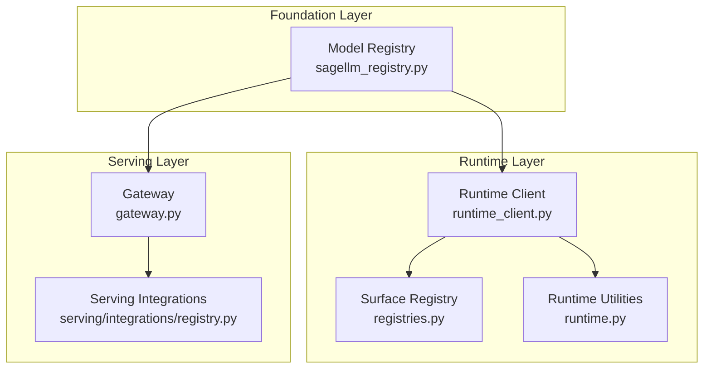
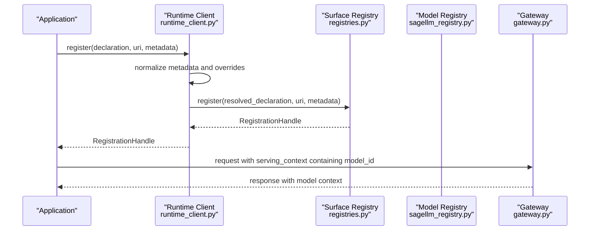
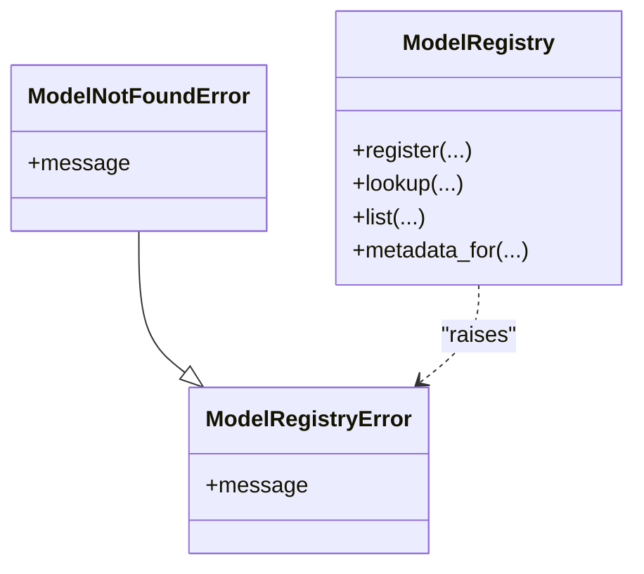
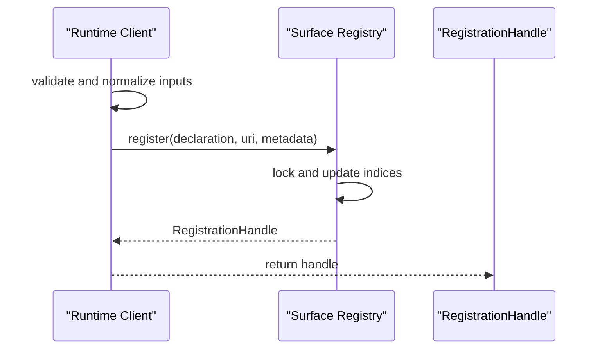
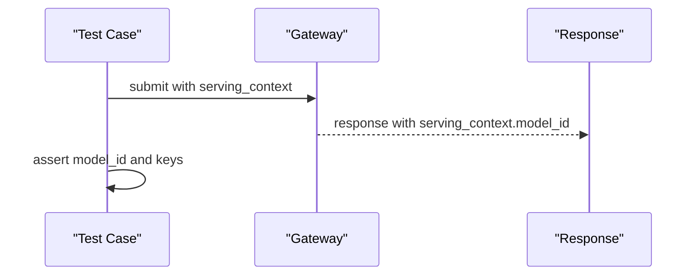
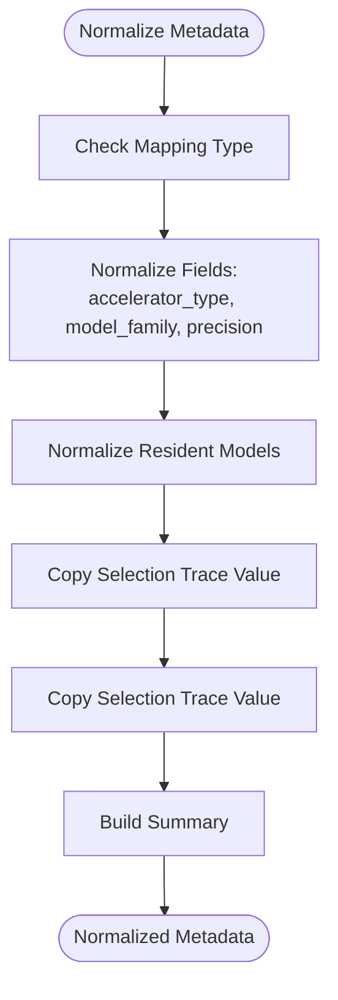
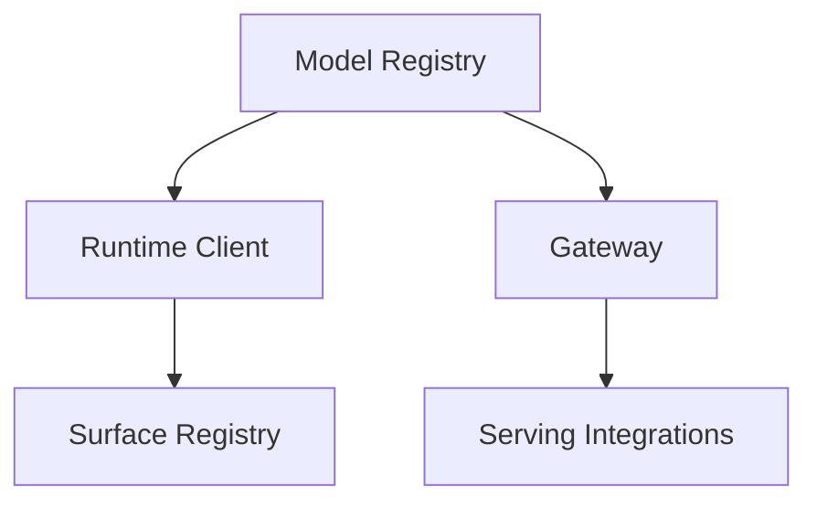

# Model Registry

<cite>
**Referenced Files in This Document**
- [sagellm_registry.py](file://src/sage/foundation/model_registry/sagellm_registry.py)
- [__init__.py](file://src/sage/foundation/model_registry/__init__.py)
- [registries.py](file://src/sage/runtime/flownet/client/registries.py)
- [runtime_client.py](file://src/sage/runtime/flownet/client/runtime_client.py)
- [gateway.py](file://src/sage/serving/gateway.py)
- [registry.py](file://src/sage/serving/integrations/registry.py)
- [runtime.py](file://src/sage/runtime/flownet/runtime/runtime.py)
- [endpoint_plane_contract.py](file://src/sage/runtime/flownet/contracts/endpoint_plane_contract.py)
- [runtime_telemetry_contract.py](file://src/sage/runtime/flownet/contracts/runtime_telemetry_contract.py)
- [test_workflow_product_integration_contract.py](file://src/tests/test_workflow_product_integration_contract.py)
</cite>

## Table of Contents
1. [Introduction](#introduction)
2. [Project Structure](#project-structure)
3. [Core Components](#core-components)
4. [Architecture Overview](#architecture-overview)
5. [Detailed Component Analysis](#detailed-component-analysis)
6. [Dependency Analysis](#dependency-analysis)
7. [Performance Considerations](#performance-considerations)
8. [Troubleshooting Guide](#troubleshooting-guide)
9. [Conclusion](#conclusion)
10. [Appendices](#appendices)

## Introduction
This document describes the Model Registry component in SAGE, which serves as the centralized model asset management system for tracking and managing AI models used across the framework. It provides standardized access patterns and lifecycle management for different model types, enabling consistent asset resolution and integration with the serving layer. The registry supports model discovery, version management, dependency tracking, and interoperability with external model sources. The content is structured to be accessible to both beginners and experienced developers, using terminology consistent with the codebase such as model registry, asset management, and model lifecycle.

## Project Structure
The Model Registry is implemented under the foundation layer and integrates with runtime surfaces and serving components. The primary implementation resides in the model registry module, while supporting infrastructure exists in the runtime client and serving integration modules.

**Diagram sources**
- [sagellm_registry.py:1-200](file://src/sage/foundation/model_registry/sagellm_registry.py#L1-L200)
- [runtime_client.py:1200-1240](file://src/sage/runtime/flownet/client/runtime_client.py#L1200-L1240)
- [registries.py:1-120](file://src/sage/runtime/flownet/client/registries.py#L1-L120)
- [runtime.py:1400-1450](file://src/sage/runtime/flownet/runtime/runtime.py#L1400-L1450)
- [gateway.py:1-200](file://src/sage/serving/gateway.py#L1-L200)
- [registry.py:1-200](file://src/sage/serving/integrations/registry.py#L1-L200)

**Section sources**
- [sagellm_registry.py:1-200](file://src/sage/foundation/model_registry/sagellm_registry.py#L1-L200)
- [registries.py:1-120](file://src/sage/runtime/flownet/client/registries.py#L1-L120)
- [runtime_client.py:1200-1240](file://src/sage/runtime/flownet/client/runtime_client.py#L1200-L1240)
- [gateway.py:1-200](file://src/sage/serving/gateway.py#L1-L200)
- [registry.py:1-200](file://src/sage/serving/integrations/registry.py#L1-L200)

## Core Components
- Model Registry: Centralized storage and management of model assets, including metadata, discovery, and lifecycle operations.
- Surface Registry: In-memory registration surface used by runtime clients to register and resolve assets with optional discoverability by URI.
- Runtime Client: Provides registration APIs that normalize metadata and delegate to the underlying registry.
- Serving Gateway and Integrations: Expose model-related contexts and integrate model identifiers into serving requests.

Key responsibilities:
- Asset Management: Register, discover, and resolve model assets with standardized metadata.
- Lifecycle Management: Support model lifecycle stages and propagate metadata to runtime and serving layers.
- Integration: Bridge model registry with runtime surfaces and serving configurations.

**Section sources**
- [sagellm_registry.py:1-200](file://src/sage/foundation/model_registry/sagellm_registry.py#L1-L200)
- [registries.py:1-120](file://src/sage/runtime/flownet/client/registries.py#L1-L120)
- [runtime_client.py:1200-1240](file://src/sage/runtime/flownet/client/runtime_client.py#L1200-L1240)
- [gateway.py:1-200](file://src/sage/serving/gateway.py#L1-L200)
- [registry.py:1-200](file://src/sage/serving/integrations/registry.py#L1-L200)

## Architecture Overview
The Model Registry sits at the intersection of asset management and runtime/serving integration. The runtime client normalizes metadata and delegates registration to the Surface Registry, which maintains in-memory indices for discoverable URIs. The serving layer consumes model identifiers and related context to route and serve requests.

**Diagram sources**
- [runtime_client.py:1200-1240](file://src/sage/runtime/flownet/client/runtime_client.py#L1200-L1240)
- [registries.py:1-120](file://src/sage/runtime/flownet/client/registries.py#L1-L120)
- [sagellm_registry.py:1-200](file://src/sage/foundation/model_registry/sagellm_registry.py#L1-L200)
- [gateway.py:1-200](file://src/sage/serving/gateway.py#L1-L200)

## Detailed Component Analysis

### Model Registry Implementation
The Model Registry encapsulates model asset management with error types for robust handling. It provides the foundational interface for registering and resolving models, and interacts with runtime and serving layers to propagate model metadata and identifiers.

**Diagram sources**
- [sagellm_registry.py:1-200](file://src/sage/foundation/model_registry/sagellm_registry.py#L1-L200)

**Section sources**
- [sagellm_registry.py:1-200](file://src/sage/foundation/model_registry/sagellm_registry.py#L1-L200)

### Surface Registry and Registration Flow
The Surface Registry maintains per-client registration state and supports explicit URI discoverability. The runtime client normalizes metadata and delegates registration to the Surface Registry, ensuring consistent behavior across resource kinds.

**Diagram sources**
- [runtime_client.py:1200-1240](file://src/sage/runtime/flownet/client/runtime_client.py#L1200-L1240)
- [registries.py:1-120](file://src/sage/runtime/flownet/client/registries.py#L1-L120)

**Section sources**
- [runtime_client.py:1200-1240](file://src/sage/runtime/flownet/client/runtime_client.py#L1200-L1240)
- [registries.py:1-120](file://src/sage/runtime/flownet/client/registries.py#L1-L120)

### Serving Integration and Model Context
The serving layer integrates model identifiers and related context into requests. Tests demonstrate serving context propagation, including model_id and cache keys, highlighting the registry’s role in providing consistent identifiers for serving.

**Diagram sources**
- [test_workflow_product_integration_contract.py:330-345](file://src/tests/test_workflow_product_integration_contract.py#L330-L345)
- [gateway.py:1-200](file://src/sage/serving/gateway.py#L1-L200)

**Section sources**
- [test_workflow_product_integration_contract.py:330-345](file://src/tests/test_workflow_product_integration_contract.py#L330-L345)
- [gateway.py:1-200](file://src/sage/serving/gateway.py#L1-L200)

### Model Metadata Handling and Validation
Runtime utilities demonstrate metadata normalization and selection tracing, ensuring that model-related metadata (such as accelerator type, model family, precision, and resident models) is consistently processed and propagated.

**Diagram sources**
- [runtime.py:1414-1444](file://src/sage/runtime/flownet/runtime/runtime.py#L1414-L1444)
- [endpoint_plane_contract.py:124-162](file://src/sage/runtime/flownet/contracts/endpoint_plane_contract.py#L124-L162)
- [runtime_telemetry_contract.py:299-331](file://src/sage/runtime/flownet/contracts/runtime_telemetry_contract.py#L299-L331)

**Section sources**
- [runtime.py:1414-1444](file://src/sage/runtime/flownet/runtime/runtime.py#L1414-L1444)
- [endpoint_plane_contract.py:124-162](file://src/sage/runtime/flownet/contracts/endpoint_plane_contract.py#L124-L162)
- [runtime_telemetry_contract.py:299-331](file://src/sage/runtime/flownet/contracts/runtime_telemetry_contract.py#L299-L331)

## Dependency Analysis
The Model Registry depends on runtime client surfaces and serving integrations to provide a cohesive model lifecycle from registration to serving. The Surface Registry provides in-memory indexing and discoverability, while the runtime client ensures metadata normalization and delegation.

**Diagram sources**
- [sagellm_registry.py:1-200](file://src/sage/foundation/model_registry/sagellm_registry.py#L1-L200)
- [runtime_client.py:1200-1240](file://src/sage/runtime/flownet/client/runtime_client.py#L1200-L1240)
- [registries.py:1-120](file://src/sage/runtime/flownet/client/registries.py#L1-L120)
- [gateway.py:1-200](file://src/sage/serving/gateway.py#L1-L200)
- [registry.py:1-200](file://src/sage/serving/integrations/registry.py#L1-L200)

**Section sources**
- [sagellm_registry.py:1-200](file://src/sage/foundation/model_registry/sagellm_registry.py#L1-L200)
- [runtime_client.py:1200-1240](file://src/sage/runtime/flownet/client/runtime_client.py#L1200-L1240)
- [registries.py:1-120](file://src/sage/runtime/flownet/client/registries.py#L1-L120)
- [gateway.py:1-200](file://src/sage/serving/gateway.py#L1-L200)
- [registry.py:1-200](file://src/sage/serving/integrations/registry.py#L1-L200)

## Performance Considerations
- In-memory indexing: Surface Registry maintains in-memory indices for discoverable URIs; ensure URIs are scoped appropriately to avoid contention.
- Metadata normalization: Runtime utilities copy and normalize metadata; keep metadata compact and structured to minimize overhead.
- Serving context propagation: Tests indicate serving context includes model identifiers and cache keys; ensure these are efficiently computed and cached where appropriate.

[No sources needed since this section provides general guidance]

## Troubleshooting Guide
Common issues and resolutions:
- Registration errors: Validate inputs and metadata normalization in the runtime client before delegating to the Surface Registry.
- Discoverability: Verify explicit URI registrations are intended for discoverability; anonymous registrations are owner-private and intentionally excluded from discoverable index.
- Serving context mismatches: Confirm model identifiers and cache keys are correctly propagated through the gateway and serving integrations.

**Section sources**
- [runtime_client.py:1200-1240](file://src/sage/runtime/flownet/client/runtime_client.py#L1200-L1240)
- [registries.py:1-120](file://src/sage/runtime/flownet/client/registries.py#L1-L120)
- [test_workflow_product_integration_contract.py:330-345](file://src/tests/test_workflow_product_integration_contract.py#L330-L345)

## Conclusion
The Model Registry provides a centralized, standardized mechanism for managing AI models across SAGE. By integrating with runtime surfaces and serving layers, it enables consistent model discovery, lifecycle management, and context propagation. The design balances discoverability with privacy, supports robust metadata handling, and facilitates seamless integration with external model sources through serving configurations.

[No sources needed since this section summarizes without analyzing specific files]

## Appendices

### Practical Examples
- Model registration: Use the runtime client to register a model with a declaration, optional URI, and metadata. The client normalizes inputs and delegates to the Surface Registry.
- Lookup operations: Resolve model assets via the Surface Registry using explicit URIs for discoverable assets.
- Serving integration: Propagate model identifiers and serving context through the gateway and serving integrations to route and serve requests.

**Section sources**
- [runtime_client.py:1200-1240](file://src/sage/runtime/flownet/client/runtime_client.py#L1200-L1240)
- [registries.py:1-120](file://src/sage/runtime/flownet/client/registries.py#L1-L120)
- [gateway.py:1-200](file://src/sage/serving/gateway.py#L1-L200)
- [registry.py:1-200](file://src/sage/serving/integrations/registry.py#L1-L200)
- [test_workflow_product_integration_contract.py:330-345](file://src/tests/test_workflow_product_integration_contract.py#L330-L345)