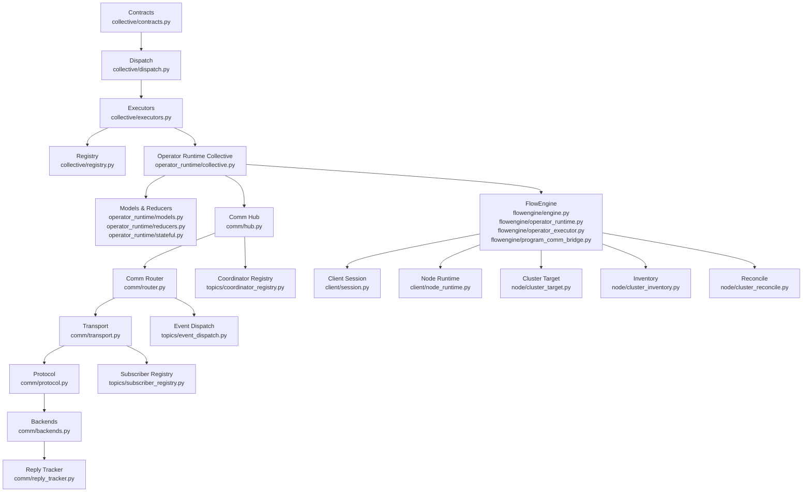
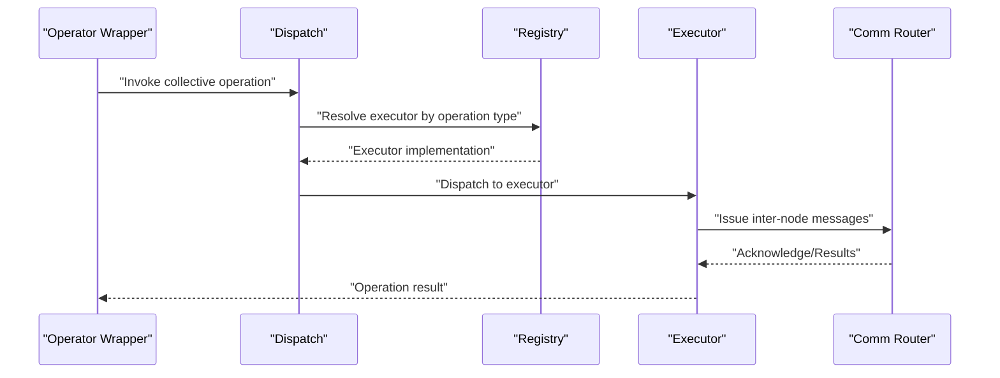
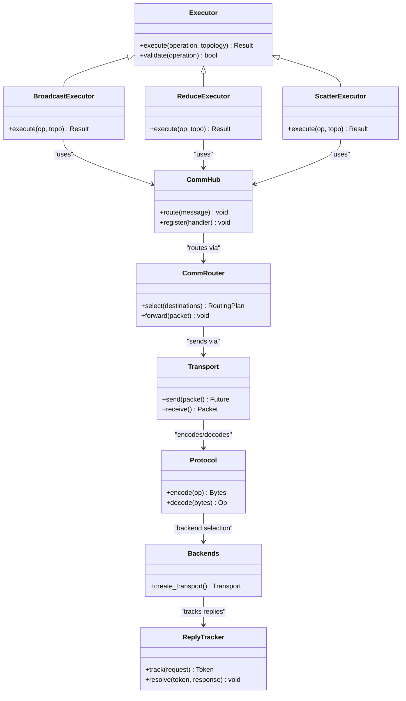
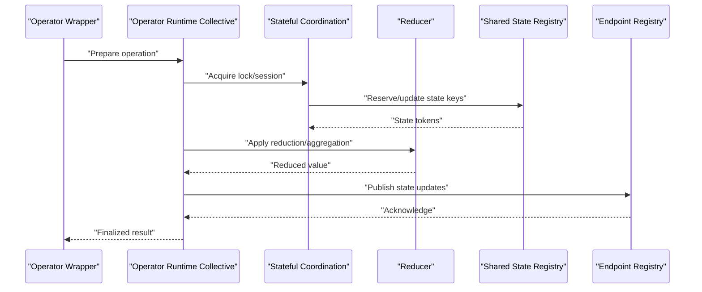
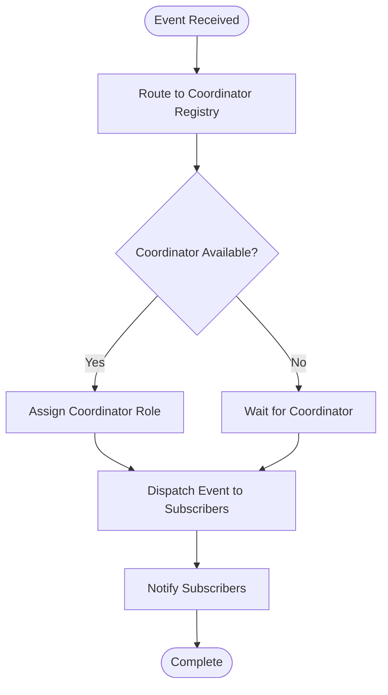
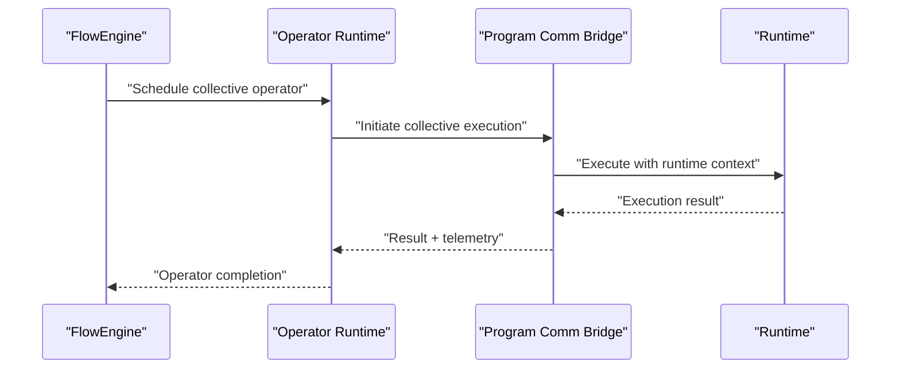
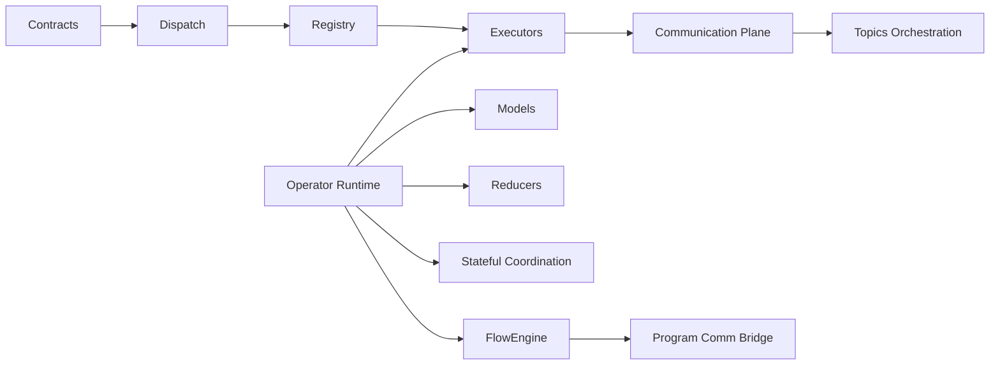

# Collective Operation Runtime

<cite>
**Referenced Files in This Document**
- [collective/__init__.py](file://src/sage/runtime/flownet/runtime/collective/__init__.py)
- [collective/contracts.py](file://src/sage/runtime/flownet/runtime/collective/contracts.py)
- [collective/dispatch.py](file://src/sage/runtime/flownet/runtime/collective/dispatch.py)
- [collective/executors.py](file://src/sage/runtime/flownet/runtime/collective/executors.py)
- [collective/registry.py](file://src/sage/runtime/flownet/runtime/collective/registry.py)
- [operator_runtime/collective.py](file://src/sage/runtime/flownet/runtime/operator_runtime/collective.py)
- [operator_runtime/dispatch.py](file://src/sage/runtime/flownet/runtime/operator_runtime/dispatch.py)
- [operator_runtime/models.py](file://src/sage/runtime/flownet/runtime/operator_runtime/models.py)
- [operator_runtime/reducers.py](file://src/sage/runtime/flownet/runtime/operator_runtime/reducers.py)
- [operator_runtime/stateful.py](file://src/sage/runtime/flownet/runtime/operator_runtime/stateful.py)
- [comm/hub.py](file://src/sage/runtime/flownet/runtime/comm/hub.py)
- [comm/router.py](file://src/sage/runtime/flownet/runtime/comm/router.py)
- [comm/transport.py](file://src/sage/runtime/flownet/runtime/comm/transport.py)
- [comm/protocol.py](file://src/sage/runtime/flownet/runtime/comm/protocol.py)
- [comm/backends.py](file://src/sage/runtime/flownet/runtime/comm/backends.py)
- [comm/reply_tracker.py](file://src/sage/runtime/flownet/runtime/comm/reply_tracker.py)
- [topics/coordinator_registry.py](file://src/sage/runtime/flownet/runtime/topics/coordinator_registry.py)
- [topics/event_dispatch.py](file://src/sage/runtime/flownet/runtime/topics/event_dispatch.py)
- [topics/subscriber_registry.py](file://src/sage/runtime/flownet/runtime/topics/subscriber_registry.py)
- [runtime.py](file://src/sage/runtime/flownet/runtime/runtime.py)
- [flowengine/engine.py](file://src/sage/runtime/flownet/runtime/flowengine/engine.py)
- [flowengine/operator_runtime.py](file://src/sage/runtime/flownet/runtime/flowengine/operator_runtime.py)
- [flowengine/operator_executor.py](file://src/sage/runtime/flownet/runtime/flowengine/operator_executor.py)
- [flowengine/program_comm_bridge.py](file://src/sage/runtime/flownet/runtime/flowengine/program_comm_bridge.py)
- [client/session.py](file://src/sage/runtime/flownet/client/session.py)
- [client/node_runtime.py](file://src/sage/runtime/flownet/client/node_runtime.py)
- [node/cluster_target.py](file://src/sage/runtime/flownet/node/cluster_target.py)
- [node/cluster_inventory.py](file://src/sage/runtime/flownet/node/cluster_inventory.py)
- [node/cluster_reconcile.py](file://src/sage/runtime/flownet/node/cluster_reconcile.py)
- [runtime/actors/task_runtime.py](file://src/sage/runtime/flownet/runtime/actors/task_runtime.py)
- [runtime/actors/executor_lanes.py](file://src/sage/runtime/flownet/runtime/actors/executor_lanes.py)
- [runtime/actors/execution_context.py](file://src/sage/runtime/flownet/runtime/actors/execution_context.py)
- [runtime/actors/invoker.py](file://src/sage/runtime/flownet/runtime/actors/invoker.py)
- [runtime/loops.py](file://src/sage/runtime/flownet/runtime/loops.py)
- [runtime/shared_state_registry.py](file://src/sage/runtime/flownet/runtime/shared_state_registry.py)
- [runtime/endpoint_registry.py](file://src/sage/runtime/flownet/runtime/endpoint_registry.py)
- [runtime/governance.py](file://src/sage/runtime/flownet/runtime/governance.py)
- [runtime/flows/collective.py](file://src/sage/runtime/flownet/runtime/flows/collective.py)
- [runtime/flows/broadcast.py](file://src/sage/runtime/flownet/runtime/flows/broadcast.py)
- [runtime/flows/reduce.py](file://src/sage/runtime/flownet/runtime/flows/reduce.py)
- [runtime/flows/scatter.py](file://src/sage/runtime/flownet/runtime/flows/scatter.py)
- [runtime/flows/allreduce.py](file://src/sage/runtime/flownet/runtime/flows/allreduce.py)
- [runtime/flows/allgather.py](file://src/sage/runtime/flownet/runtime/flows/allgather.py)
- [runtime/flows/reduce_scatter.py](file://src/sage/runtime/flownet/runtime/flows/reduce_scatter.py)
- [runtime/flows/gather.py](file://src/sage/runtime/flownet/runtime/flows/gather.py)
- [runtime/flows/alltoall.py](file://src/sage/runtime/flownet/runtime/flows/alltoall.py)
- [runtime/flows/p2p.py](file://src/sage/runtime/flownet/runtime/flows/p2p.py)
- [runtime/flows/utils.py](file://src/sage/runtime/flownet/runtime/flows/utils.py)
- [runtime/flows/protocols.py](file://src/sage/runtime/flownet/runtime/flows/protocols.py)
- [runtime/flows/exceptions.py](file://src/sage/runtime/flownet/runtime/flows/exceptions.py)
- [runtime/flows/telemetry.py](file://src/sage/runtime/flownet/runtime/flows/telemetry.py)
- [runtime/flows/state.py](file://src/sage/runtime/flownet/runtime/flows/state.py)
- [runtime/flows/context.py](file://src/sage/runtime/flownet/runtime/flows/context.py)
- [runtime/flows/registry.py](file://src/sage/runtime/flownet/runtime/flows/registry.py)
- [runtime/flows/contract.py](file://src/sage/runtime/flownet/runtime/flows/contract.py)
- [runtime/flows/serialization.py](file://src/sage/runtime/flownet/runtime/flows/serialization.py)
- [runtime/flows/validation.py](file://src/sage/runtime/flownet/runtime/flows/validation.py)
- [runtime/flows/logging.py](file://src/sage/runtime/flownet/runtime/flows/logging.py)
- [runtime/flows/debugging.py](file://src/sage/runtime/flownet/runtime/flows/debugging.py)
- [runtime/flows/performance.py](file://src/sage/runtime/flownet/runtime/flows/performance.py)
- [runtime/flows/error_handling.py](file://src/sage/runtime/flownet/runtime/flows/error_handling.py)
- [runtime/flows/testing.py](file://src/sage/runtime/flownet/runtime/flows/testing.py)
- [runtime/flows/examples.py](file://src/sage/runtime/flownet/runtime/flows/examples.py)
- [runtime/flows/optimization.py](file://src/sage/runtime/flownet/runtime/flows/optimization.py)
- [runtime/flows/troubleshooting.py](file://src/sage/runtime/flownet/runtime/flows/troubleshooting.py)
- [runtime/flows/monitoring.py](file://src/sage/runtime/flownet/runtime/flows/monitoring.py)
- [runtime/flows/telemetry.py](file://src/sage/runtime/flownet/runtime/flows/telemetry.py)
- [runtime/flows/telemetry.py](file://src/sage/runtime/flownet/runtime/flows/telemetry.py)
</cite>

## Table of Contents
1. [Introduction](#introduction)
2. [Project Structure](#project-structure)
3. [Core Components](#core-components)
4. [Architecture Overview](#architecture-overview)
5. [Detailed Component Analysis](#detailed-component-analysis)
6. [Dependency Analysis](#dependency-analysis)
7. [Performance Considerations](#performance-considerations)
8. [Troubleshooting Guide](#troubleshooting-guide)
9. [Conclusion](#conclusion)
10. [Appendices](#appendices)

## Introduction
This document describes the Collective Operation Runtime within SAGE’s FlowNet framework. The collective runtime is an optimized execution layer designed for operators requiring coordinated multi-node operations such as broadcast, reduce, scatter, and their variants (e.g., allreduce, gather, allgather, reduce-scatter, all-to-all). It orchestrates state synchronization, communication protocols, and distributed execution patterns to ensure correctness, performance, and fault tolerance across nodes.

The runtime integrates tightly with FlowNet’s operator execution engine, communication backbones, and shared-state facilities. It exposes a set of collective primitives and patterns that abstract away low-level coordination details while enabling high-performance distributed computation.

## Project Structure
The collective runtime spans two primary areas:
- Runtime-level collective modules under runtime/collective: foundational contracts, dispatch, executors, and registry for collective operations.
- Operator-runtime collective modules under runtime/operator_runtime: higher-level operator wrappers, dispatch, models, reducers, and stateful coordination for collective operators.

Additional supporting modules include:
- Communication plane: hub, router, transport, protocol, backends, and reply tracking.
- Topics subsystem: coordinator registry, event dispatch, and subscriber registry for orchestration.
- FlowEngine integration: engine, operator runtime, operator executor, and program communication bridge.
- Client-side node runtime and session management for cluster bootstrap and lifecycle.
- Node management: cluster target, inventory, and reconciliation.
- Actors and lanes for execution contexts and task runtime.
- Shared state registry and endpoint registry for cross-node state and endpoint discovery.
- Governance and loops for runtime policies and loop control.

```mermaid
graph TB
subgraph "Runtime Collective"
RC1["collective/__init__.py"]
RC2["collective/contracts.py"]
RC3["collective/dispatch.py"]
RC4["collective/executors.py"]
RC5["collective/registry.py"]
end
subgraph "Operator Runtime Collective"
ORC1["operator_runtime/collective.py"]
ORC2["operator_runtime/dispatch.py"]
ORC3["operator_runtime/models.py"]
ORC4["operator_runtime/reducers.py"]
ORC5["operator_runtime/stateful.py"]
end
subgraph "Communication Plane"
CP1["comm/hub.py"]
CP2["comm/router.py"]
CP3["comm/transport.py"]
CP4["comm/protocol.py"]
CP5["comm/backends.py"]
CP6["comm/reply_tracker.py"]
end
subgraph "Topics Orchestration"
TOP1["topics/coordinator_registry.py"]
TOP2["topics/event_dispatch.py"]
TOP3["topics/subscriber_registry.py"]
end
subgraph "FlowEngine"
FE1["flowengine/engine.py"]
FE2["flowengine/operator_runtime.py"]
FE3["flowengine/operator_executor.py"]
FE4["flowengine/program_comm_bridge.py"]
end
subgraph "Client & Node"
CL1["client/session.py"]
CL2["client/node_runtime.py"]
ND1["node/cluster_target.py"]
ND2["node/cluster_inventory.py"]
ND3["node/cluster_reconcile.py"]
end
subgraph "Actors & Governance"
ACT1["runtime/actors/task_runtime.py"]
ACT2["runtime/actors/executor_lanes.py"]
ACT3["runtime/actors/execution_context.py"]
ACT4["runtime/actors/invoker.py"]
GOV1["runtime/governance.py"]
GOV2["runtime/loops.py"]
end
subgraph "Shared State"
SS1["runtime/shared_state_registry.py"]
EP1["runtime/endpoint_registry.py"]
end
RC1 --> ORC1
RC2 --> ORC2
RC3 --> ORC3
RC4 --> ORC4
RC5 --> ORC5
ORC1 --> CP1
ORC2 --> CP2
ORC3 --> CP3
ORC4 --> CP4
ORC5 --> CP5
CP1 --> TOP1
CP2 --> TOP2
CP3 --> TOP3
ORC1 --> FE1
ORC2 --> FE2
ORC3 --> FE3
ORC4 --> FE4
FE1 --> CL1
FE2 --> CL2
FE3 --> ND1
FE4 --> ND2
ACT1 --> GOV1
ACT2 --> GOV2
ACT3 --> SS1
ACT4 --> EP1
```

**Diagram sources**
- [collective/__init__.py](file://src/sage/runtime/flownet/runtime/collective/__init__.py)
- [collective/contracts.py](file://src/sage/runtime/flownet/runtime/collective/contracts.py)
- [collective/dispatch.py](file://src/sage/runtime/flownet/runtime/collective/dispatch.py)
- [collective/executors.py](file://src/sage/runtime/flownet/runtime/collective/executors.py)
- [collective/registry.py](file://src/sage/runtime/flownet/runtime/collective/registry.py)
- [operator_runtime/collective.py](file://src/sage/runtime/flownet/runtime/operator_runtime/collective.py)
- [operator_runtime/dispatch.py](file://src/sage/runtime/flownet/runtime/operator_runtime/dispatch.py)
- [operator_runtime/models.py](file://src/sage/runtime/flownet/runtime/operator_runtime/models.py)
- [operator_runtime/reducers.py](file://src/sage/runtime/flownet/runtime/operator_runtime/reducers.py)
- [operator_runtime/stateful.py](file://src/sage/runtime/flownet/runtime/operator_runtime/stateful.py)
- [comm/hub.py](file://src/sage/runtime/flownet/runtime/comm/hub.py)
- [comm/router.py](file://src/sage/runtime/flownet/runtime/comm/router.py)
- [comm/transport.py](file://src/sage/runtime/flownet/runtime/comm/transport.py)
- [comm/protocol.py](file://src/sage/runtime/flownet/runtime/comm/protocol.py)
- [comm/backends.py](file://src/sage/runtime/flownet/runtime/comm/backends.py)
- [comm/reply_tracker.py](file://src/sage/runtime/flownet/runtime/comm/reply_tracker.py)
- [topics/coordinator_registry.py](file://src/sage/runtime/flownet/runtime/topics/coordinator_registry.py)
- [topics/event_dispatch.py](file://src/sage/runtime/flownet/runtime/topics/event_dispatch.py)
- [topics/subscriber_registry.py](file://src/sage/runtime/flownet/runtime/topics/subscriber_registry.py)
- [flowengine/engine.py](file://src/sage/runtime/flownet/runtime/flowengine/engine.py)
- [flowengine/operator_runtime.py](file://src/sage/runtime/flownet/runtime/flowengine/operator_runtime.py)
- [flowengine/operator_executor.py](file://src/sage/runtime/flownet/runtime/flowengine/operator_executor.py)
- [flowengine/program_comm_bridge.py](file://src/sage/runtime/flownet/runtime/flowengine/program_comm_bridge.py)
- [client/session.py](file://src/sage/runtime/flownet/client/session.py)
- [client/node_runtime.py](file://src/sage/runtime/flownet/client/node_runtime.py)
- [node/cluster_target.py](file://src/sage/runtime/flownet/node/cluster_target.py)
- [node/cluster_inventory.py](file://src/sage/runtime/flownet/node/cluster_inventory.py)
- [node/cluster_reconcile.py](file://src/sage/runtime/flownet/node/cluster_reconcile.py)
- [runtime/actors/task_runtime.py](file://src/sage/runtime/flownet/runtime/actors/task_runtime.py)
- [runtime/actors/executor_lanes.py](file://src/sage/runtime/flownet/runtime/actors/executor_lanes.py)
- [runtime/actors/execution_context.py](file://src/sage/runtime/flownet/runtime/actors/execution_context.py)
- [runtime/actors/invoker.py](file://src/sage/runtime/flownet/runtime/actors/invoker.py)
- [runtime/governance.py](file://src/sage/runtime/flownet/runtime/governance.py)
- [runtime/loops.py](file://src/sage/runtime/flownet/runtime/loops.py)
- [runtime/shared_state_registry.py](file://src/sage/runtime/flownet/runtime/shared_state_registry.py)
- [runtime/endpoint_registry.py](file://src/sage/runtime/flownet/runtime/endpoint_registry.py)

**Section sources**
- [collective/__init__.py](file://src/sage/runtime/flownet/runtime/collective/__init__.py)
- [operator_runtime/collective.py](file://src/sage/runtime/flownet/runtime/operator_runtime/collective.py)

## Core Components
- Collective Contracts: Define the operational contracts and data structures for collective operations, including invocation signatures, state transitions, and error semantics.
- Collective Dispatch: Routes collective operator requests to appropriate executors based on operation type and topology.
- Collective Executors: Implement concrete execution strategies for broadcast, reduce, scatter, and advanced patterns, coordinating with the communication plane.
- Collective Registry: Maintains mappings between operation identifiers and executor implementations, enabling dynamic selection and extension.
- Operator Runtime Collective: Wraps collective operators with runtime-aware logic, stateful coordination, and reducer integration.
- Communication Hub and Router: Provide transport abstraction, routing decisions, and reply tracking for inter-node messages.
- Topics Orchestration: Coordinates events, subscribers, and coordinators for runtime orchestration and state synchronization.
- FlowEngine Integration: Bridges collective runtime with FlowNet’s operator execution engine and program communication bridge.
- Client and Node Management: Handles session bootstrap, node runtime lifecycle, and cluster reconciliation.

**Section sources**
- [collective/contracts.py](file://src/sage/runtime/flownet/runtime/collective/contracts.py)
- [collective/dispatch.py](file://src/sage/runtime/flownet/runtime/collective/dispatch.py)
- [collective/executors.py](file://src/sage/runtime/flownet/runtime/collective/executors.py)
- [collective/registry.py](file://src/sage/runtime/flownet/runtime/collective/registry.py)
- [operator_runtime/collective.py](file://src/sage/runtime/flownet/runtime/operator_runtime/collective.py)
- [operator_runtime/dispatch.py](file://src/sage/runtime/flownet/runtime/operator_runtime/dispatch.py)
- [operator_runtime/models.py](file://src/sage/runtime/flownet/runtime/operator_runtime/models.py)
- [operator_runtime/reducers.py](file://src/sage/runtime/flownet/runtime/operator_runtime/reducers.py)
- [operator_runtime/stateful.py](file://src/sage/runtime/flownet/runtime/operator_runtime/stateful.py)
- [comm/hub.py](file://src/sage/runtime/flownet/runtime/comm/hub.py)
- [comm/router.py](file://src/sage/runtime/flownet/runtime/comm/router.py)
- [comm/transport.py](file://src/sage/runtime/flownet/runtime/comm/transport.py)
- [comm/protocol.py](file://src/sage/runtime/flownet/runtime/comm/protocol.py)
- [comm/backends.py](file://src/sage/runtime/flownet/runtime/comm/backends.py)
- [comm/reply_tracker.py](file://src/sage/runtime/flownet/runtime/comm/reply_tracker.py)
- [topics/coordinator_registry.py](file://src/sage/runtime/flownet/runtime/topics/coordinator_registry.py)
- [topics/event_dispatch.py](file://src/sage/runtime/flownet/runtime/topics/event_dispatch.py)
- [topics/subscriber_registry.py](file://src/sage/runtime/flownet/runtime/topics/subscriber_registry.py)
- [flowengine/engine.py](file://src/sage/runtime/flownet/runtime/flowengine/engine.py)
- [flowengine/operator_runtime.py](file://src/sage/runtime/flownet/runtime/flowengine/operator_runtime.py)
- [flowengine/operator_executor.py](file://src/sage/runtime/flownet/runtime/flowengine/operator_executor.py)
- [flowengine/program_comm_bridge.py](file://src/sage/runtime/flownet/runtime/flowengine/program_comm_bridge.py)
- [client/session.py](file://src/sage/runtime/flownet/client/session.py)
- [client/node_runtime.py](file://src/sage/runtime/flownet/client/node_runtime.py)
- [node/cluster_target.py](file://src/sage/runtime/flownet/node/cluster_target.py)
- [node/cluster_inventory.py](file://src/sage/runtime/flownet/node/cluster_inventory.py)
- [node/cluster_reconcile.py](file://src/sage/runtime/flownet/node/cluster_reconcile.py)

## Architecture Overview
The collective runtime architecture centers on a layered design:
- Contracts define the operation semantics and state contracts.
- Dispatch selects the appropriate executor based on operation type and topology.
- Executors coordinate with the communication plane to perform multi-node operations.
- Operator Runtime wraps these executors into FlowNet operators with stateful coordination and reducer support.
- Topics orchestrate event-driven coordination and subscriber management.
- FlowEngine integrates with the runtime to schedule and execute operators.
- Client and node management handle cluster bootstrap and lifecycle.

**Diagram sources**
- [collective/contracts.py](file://src/sage/runtime/flownet/runtime/collective/contracts.py)
- [collective/dispatch.py](file://src/sage/runtime/flownet/runtime/collective/dispatch.py)
- [collective/executors.py](file://src/sage/runtime/flownet/runtime/collective/executors.py)
- [collective/registry.py](file://src/sage/runtime/flownet/runtime/collective/registry.py)
- [operator_runtime/collective.py](file://src/sage/runtime/flownet/runtime/operator_runtime/collective.py)
- [operator_runtime/models.py](file://src/sage/runtime/flownet/runtime/operator_runtime/models.py)
- [operator_runtime/reducers.py](file://src/sage/runtime/flownet/runtime/operator_runtime/reducers.py)
- [operator_runtime/stateful.py](file://src/sage/runtime/flownet/runtime/operator_runtime/stateful.py)
- [comm/hub.py](file://src/sage/runtime/flownet/runtime/comm/hub.py)
- [comm/router.py](file://src/sage/runtime/flownet/runtime/comm/router.py)
- [comm/transport.py](file://src/sage/runtime/flownet/runtime/comm/transport.py)
- [comm/protocol.py](file://src/sage/runtime/flownet/runtime/comm/protocol.py)
- [comm/backends.py](file://src/sage/runtime/flownet/runtime/comm/backends.py)
- [comm/reply_tracker.py](file://src/sage/runtime/flownet/runtime/comm/reply_tracker.py)
- [topics/coordinator_registry.py](file://src/sage/runtime/flownet/runtime/topics/coordinator_registry.py)
- [topics/event_dispatch.py](file://src/sage/runtime/flownet/runtime/topics/event_dispatch.py)
- [topics/subscriber_registry.py](file://src/sage/runtime/flownet/runtime/topics/subscriber_registry.py)
- [flowengine/engine.py](file://src/sage/runtime/flownet/runtime/flowengine/engine.py)
- [flowengine/operator_runtime.py](file://src/sage/runtime/flownet/runtime/flowengine/operator_runtime.py)
- [flowengine/operator_executor.py](file://src/sage/runtime/flownet/runtime/flowengine/operator_executor.py)
- [flowengine/program_comm_bridge.py](file://src/sage/runtime/flownet/runtime/flowengine/program_comm_bridge.py)
- [client/session.py](file://src/sage/runtime/flownet/client/session.py)
- [client/node_runtime.py](file://src/sage/runtime/flownet/client/node_runtime.py)
- [node/cluster_target.py](file://src/sage/runtime/flownet/node/cluster_target.py)
- [node/cluster_inventory.py](file://src/sage/runtime/flownet/node/cluster_inventory.py)
- [node/cluster_reconcile.py](file://src/sage/runtime/flownet/node/cluster_reconcile.py)

## Detailed Component Analysis

### Collective Contracts and Dispatch
- Contracts define operation signatures, state transitions, and error semantics for collective operations. They ensure consistent behavior across executors and operator wrappers.
- Dispatch routes operation requests to executors based on operation type and topology, selecting the appropriate implementation from the registry.

**Diagram sources**
- [collective/contracts.py](file://src/sage/runtime/flownet/runtime/collective/contracts.py)
- [collective/dispatch.py](file://src/sage/runtime/flownet/runtime/collective/dispatch.py)
- [collective/registry.py](file://src/sage/runtime/flownet/runtime/collective/registry.py)
- [operator_runtime/dispatch.py](file://src/sage/runtime/flownet/runtime/operator_runtime/dispatch.py)

**Section sources**
- [collective/contracts.py](file://src/sage/runtime/flownet/runtime/collective/contracts.py)
- [collective/dispatch.py](file://src/sage/runtime/flownet/runtime/collective/dispatch.py)
- [collective/registry.py](file://src/sage/runtime/flownet/runtime/collective/registry.py)
- [operator_runtime/dispatch.py](file://src/sage/runtime/flownet/runtime/operator_runtime/dispatch.py)

### Collective Executors and Communication Plane
- Executors implement concrete collective patterns (broadcast, reduce, scatter, allreduce, etc.) and coordinate with the communication plane.
- The communication plane provides transport abstraction, routing, protocol handling, and reply tracking for reliable inter-node messaging.

**Diagram sources**
- [collective/executors.py](file://src/sage/runtime/flownet/runtime/collective/executors.py)
- [comm/hub.py](file://src/sage/runtime/flownet/runtime/comm/hub.py)
- [comm/router.py](file://src/sage/runtime/flownet/runtime/comm/router.py)
- [comm/transport.py](file://src/sage/runtime/flownet/runtime/comm/transport.py)
- [comm/protocol.py](file://src/sage/runtime/flownet/runtime/comm/protocol.py)
- [comm/backends.py](file://src/sage/runtime/flownet/runtime/comm/backends.py)
- [comm/reply_tracker.py](file://src/sage/runtime/flownet/runtime/comm/reply_tracker.py)

**Section sources**
- [collective/executors.py](file://src/sage/runtime/flownet/runtime/collective/executors.py)
- [comm/hub.py](file://src/sage/runtime/flownet/runtime/comm/hub.py)
- [comm/router.py](file://src/sage/runtime/flownet/runtime/comm/router.py)
- [comm/transport.py](file://src/sage/runtime/flownet/runtime/comm/transport.py)
- [comm/protocol.py](file://src/sage/runtime/flownet/runtime/comm/protocol.py)
- [comm/backends.py](file://src/sage/runtime/flownet/runtime/comm/backends.py)
- [comm/reply_tracker.py](file://src/sage/runtime/flownet/runtime/comm/reply_tracker.py)

### Operator Runtime Collective and Stateful Coordination
- Operator Runtime Collective wraps executors into FlowNet operators, integrating with models, reducers, and stateful coordination.
- Stateful coordination ensures consistent state updates across nodes, leveraging shared state registry and endpoint discovery.

**Diagram sources**
- [operator_runtime/collective.py](file://src/sage/runtime/flownet/runtime/operator_runtime/collective.py)
- [operator_runtime/stateful.py](file://src/sage/runtime/flownet/runtime/operator_runtime/stateful.py)
- [operator_runtime/reducers.py](file://src/sage/runtime/flownet/runtime/operator_runtime/reducers.py)
- [runtime/shared_state_registry.py](file://src/sage/runtime/flownet/runtime/shared_state_registry.py)
- [runtime/endpoint_registry.py](file://src/sage/runtime/flownet/runtime/endpoint_registry.py)

**Section sources**
- [operator_runtime/collective.py](file://src/sage/runtime/flownet/runtime/operator_runtime/collective.py)
- [operator_runtime/stateful.py](file://src/sage/runtime/flownet/runtime/operator_runtime/stateful.py)
- [operator_runtime/reducers.py](file://src/sage/runtime/flownet/runtime/operator_runtime/reducers.py)
- [runtime/shared_state_registry.py](file://src/sage/runtime/flownet/runtime/shared_state_registry.py)
- [runtime/endpoint_registry.py](file://src/sage/runtime/flownet/runtime/endpoint_registry.py)

### Topics Orchestration and Event Dispatch
- Coordinator Registry manages coordination roles and responsibilities across nodes.
- Event Dispatch coordinates asynchronous events and reactions to state changes.
- Subscriber Registry tracks subscribers and their interests for targeted notifications.

**Diagram sources**
- [topics/coordinator_registry.py](file://src/sage/runtime/flownet/runtime/topics/coordinator_registry.py)
- [topics/event_dispatch.py](file://src/sage/runtime/flownet/runtime/topics/event_dispatch.py)
- [topics/subscriber_registry.py](file://src/sage/runtime/flownet/runtime/topics/subscriber_registry.py)

**Section sources**
- [topics/coordinator_registry.py](file://src/sage/runtime/flownet/runtime/topics/coordinator_registry.py)
- [topics/event_dispatch.py](file://src/sage/runtime/flownet/runtime/topics/event_dispatch.py)
- [topics/subscriber_registry.py](file://src/sage/runtime/flownet/runtime/topics/subscriber_registry.py)

### FlowEngine Integration and Execution Patterns
- FlowEngine integrates collective runtime with operator execution, scheduling, and program communication bridges.
- Program Communication Bridge connects collective operations to broader program execution and telemetry.

**Diagram sources**
- [flowengine/engine.py](file://src/sage/runtime/flownet/runtime/flowengine/engine.py)
- [flowengine/operator_runtime.py](file://src/sage/runtime/flownet/runtime/flowengine/operator_runtime.py)
- [flowengine/operator_executor.py](file://src/sage/runtime/flownet/runtime/flowengine/operator_executor.py)
- [flowengine/program_comm_bridge.py](file://src/sage/runtime/flownet/runtime/flowengine/program_comm_bridge.py)

**Section sources**
- [flowengine/engine.py](file://src/sage/runtime/flownet/runtime/flowengine/engine.py)
- [flowengine/operator_runtime.py](file://src/sage/runtime/flownet/runtime/flowengine/operator_runtime.py)
- [flowengine/operator_executor.py](file://src/sage/runtime/flownet/runtime/flowengine/operator_executor.py)
- [flowengine/program_comm_bridge.py](file://src/sage/runtime/flownet/runtime/flowengine/program_comm_bridge.py)

### Practical Examples and Execution Patterns
- Broadcast: Distribute a single input value to all nodes. The executor coordinates fan-out and waits for acknowledgments.
- Reduce: Aggregate values across nodes using a reducer function; the executor coordinates gather and reduce steps.
- Scatter: Distribute chunks of data to nodes; the executor coordinates split and send operations.
- AllReduce: Combine reduce and broadcast to return a reduced value to all nodes.
- Gather: Collect values from all nodes to a single node.
- AllGather: Gather values to all nodes.
- ReduceScatter: Reduce values per node and scatter results to nodes.
- AllToAll: Permute data between nodes according to a pattern.
- Point-to-Point: Direct communication between specific nodes.

These patterns are orchestrated through the collective runtime’s dispatch and executors, integrated with the communication plane and operator runtime.

**Section sources**
- [collective/dispatch.py](file://src/sage/runtime/flownet/runtime/collective/dispatch.py)
- [collective/executors.py](file://src/sage/runtime/flownet/runtime/collective/executors.py)
- [operator_runtime/collective.py](file://src/sage/runtime/flownet/runtime/operator_runtime/collective.py)
- [comm/hub.py](file://src/sage/runtime/flownet/runtime/comm/hub.py)
- [comm/router.py](file://src/sage/runtime/flownet/runtime/comm/router.py)
- [comm/transport.py](file://src/sage/runtime/flownet/runtime/comm/transport.py)

## Dependency Analysis
The collective runtime exhibits strong cohesion within its modules and clear coupling to the communication plane, topics orchestration, and FlowEngine. Key dependencies include:
- Contracts to Dispatch and Registry for operation resolution.
- Dispatch to Executors for execution.
- Executors to Communication Plane for inter-node messaging.
- Operator Runtime to Models, Reducers, and Stateful Coordination.
- Topics Orchestration to Coordinator Registry, Event Dispatch, and Subscriber Registry.
- FlowEngine to Operator Runtime and Program Communication Bridge.

**Diagram sources**
- [collective/contracts.py](file://src/sage/runtime/flownet/runtime/collective/contracts.py)
- [collective/dispatch.py](file://src/sage/runtime/flownet/runtime/collective/dispatch.py)
- [collective/registry.py](file://src/sage/runtime/flownet/runtime/collective/registry.py)
- [collective/executors.py](file://src/sage/runtime/flownet/runtime/collective/executors.py)
- [operator_runtime/collective.py](file://src/sage/runtime/flownet/runtime/operator_runtime/collective.py)
- [operator_runtime/models.py](file://src/sage/runtime/flownet/runtime/operator_runtime/models.py)
- [operator_runtime/reducers.py](file://src/sage/runtime/flownet/runtime/operator_runtime/reducers.py)
- [operator_runtime/stateful.py](file://src/sage/runtime/flownet/runtime/operator_runtime/stateful.py)
- [comm/hub.py](file://src/sage/runtime/flownet/runtime/comm/hub.py)
- [comm/router.py](file://src/sage/runtime/flownet/runtime/comm/router.py)
- [comm/transport.py](file://src/sage/runtime/flownet/runtime/comm/transport.py)
- [topics/coordinator_registry.py](file://src/sage/runtime/flownet/runtime/topics/coordinator_registry.py)
- [topics/event_dispatch.py](file://src/sage/runtime/flownet/runtime/topics/event_dispatch.py)
- [topics/subscriber_registry.py](file://src/sage/runtime/flownet/runtime/topics/subscriber_registry.py)
- [flowengine/engine.py](file://src/sage/runtime/flownet/runtime/flowengine/engine.py)
- [flowengine/program_comm_bridge.py](file://src/sage/runtime/flownet/runtime/flowengine/program_comm_bridge.py)

**Section sources**
- [collective/contracts.py](file://src/sage/runtime/flownet/runtime/collective/contracts.py)
- [collective/dispatch.py](file://src/sage/runtime/flownet/runtime/collective/dispatch.py)
- [collective/registry.py](file://src/sage/runtime/flownet/runtime/collective/registry.py)
- [collective/executors.py](file://src/sage/runtime/flownet/runtime/collective/executors.py)
- [operator_runtime/collective.py](file://src/sage/runtime/flownet/runtime/operator_runtime/collective.py)
- [operator_runtime/models.py](file://src/sage/runtime/flownet/runtime/operator_runtime/models.py)
- [operator_runtime/reducers.py](file://src/sage/runtime/flownet/runtime/operator_runtime/reducers.py)
- [operator_runtime/stateful.py](file://src/sage/runtime/flownet/runtime/operator_runtime/stateful.py)
- [comm/hub.py](file://src/sage/runtime/flownet/runtime/comm/hub.py)
- [comm/router.py](file://src/sage/runtime/flownet/runtime/comm/router.py)
- [comm/transport.py](file://src/sage/runtime/flownet/runtime/comm/transport.py)
- [topics/coordinator_registry.py](file://src/sage/runtime/flownet/runtime/topics/coordinator_registry.py)
- [topics/event_dispatch.py](file://src/sage/runtime/flownet/runtime/topics/event_dispatch.py)
- [topics/subscriber_registry.py](file://src/sage/runtime/flownet/runtime/topics/subscriber_registry.py)
- [flowengine/engine.py](file://src/sage/runtime/flownet/runtime/flowengine/engine.py)
- [flowengine/program_comm_bridge.py](file://src/sage/runtime/flownet/runtime/flowengine/program_comm_bridge.py)

## Performance Considerations
- Minimize round trips: Batch operations and use efficient topologies (e.g., tree-based reductions) to reduce latency.
- Optimize communication: Select optimal transport backends and protocols for the workload characteristics.
- Reduce contention: Use stateful coordination with fine-grained locks and atomic updates to avoid hotspots.
- Leverage locality: Prefer intra-node operations and minimize cross-node data movement.
- Tune scheduling: Integrate with FlowEngine’s scheduling to overlap communication with computation where possible.
- Monitor telemetry: Use built-in telemetry to profile collective operations and identify bottlenecks.

[No sources needed since this section provides general guidance]

## Troubleshooting Guide
Common issues and strategies:
- Deadlocks: Verify stateful coordination holds locks only for minimal durations and releases them deterministically.
- Message ordering: Ensure protocol sequencing and reply tracking are correctly configured to prevent out-of-order processing.
- Topology mismatches: Validate that the selected executor matches the network topology and that routing plans are correct.
- Error propagation: Use FlowNet’s exception handling and runtime error codes to propagate and surface errors consistently.
- Debugging: Enable debugging logs and use monitoring tools to trace operation lifecycles and inter-node communications.

**Section sources**
- [operator_runtime/stateful.py](file://src/sage/runtime/flownet/runtime/operator_runtime/stateful.py)
- [comm/reply_tracker.py](file://src/sage/runtime/flownet/runtime/comm/reply_tracker.py)
- [comm/router.py](file://src/sage/runtime/flownet/runtime/comm/router.py)
- [runtime/actors/error_codes.py](file://src/sage/runtime/flownet/runtime/actors/error_codes.py)
- [runtime/flows/debugging.py](file://src/sage/runtime/flownet/runtime/flows/debugging.py)
- [runtime/flows/monitoring.py](file://src/sage/runtime/flownet/runtime/flows/monitoring.py)

## Conclusion
The Collective Operation Runtime in SAGE’s FlowNet framework provides a robust, extensible, and high-performance execution layer for multi-node collective operations. By combining well-defined contracts, dispatch-driven executor selection, a flexible communication plane, and operator runtime integration, it enables scalable distributed computing with strong coordination guarantees. Proper tuning of communication, state management, and scheduling yields significant performance improvements, while comprehensive telemetry and debugging support facilitate reliable operation in production environments.

[No sources needed since this section summarizes without analyzing specific files]

## Appendices
- Additional runtime modules for collective flows, protocols, exceptions, telemetry, state, context, registry, contract, serialization, validation, logging, testing, examples, optimization, troubleshooting, and performance are available under runtime/flows and related modules for deeper exploration.

[No sources needed since this section provides general guidance]