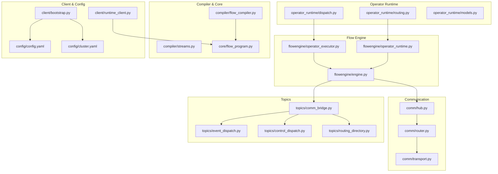
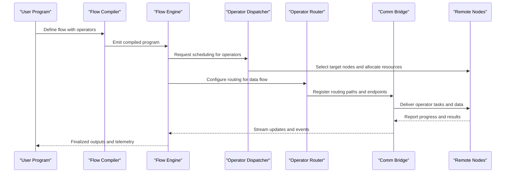
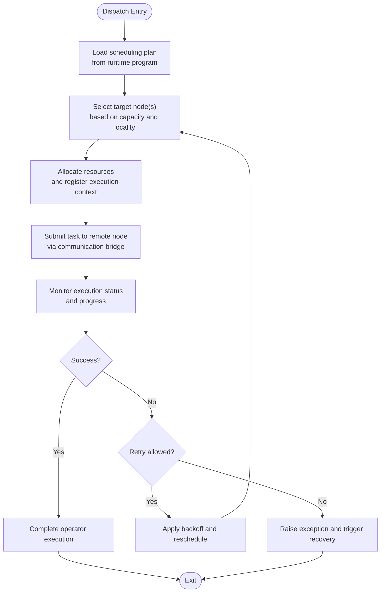
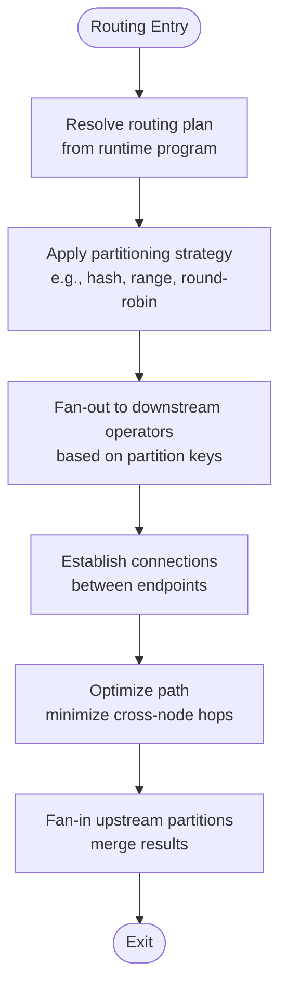
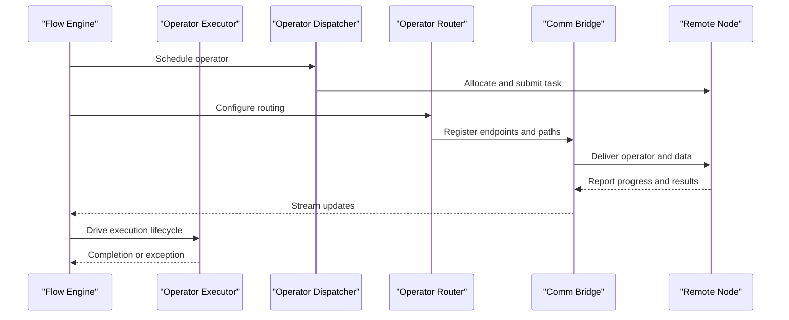
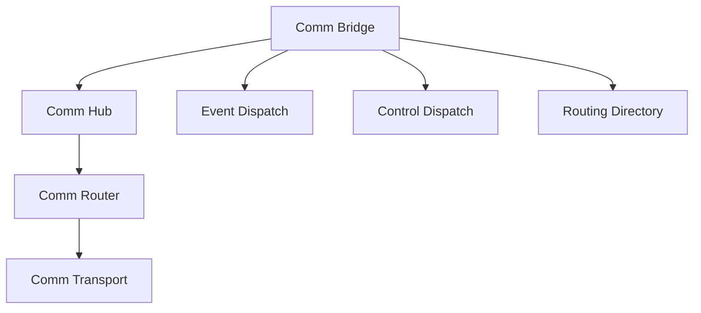
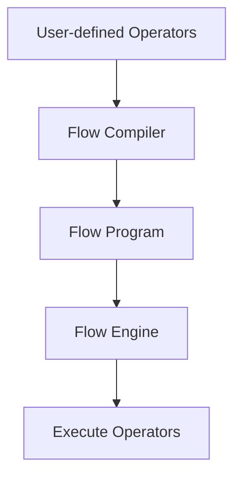
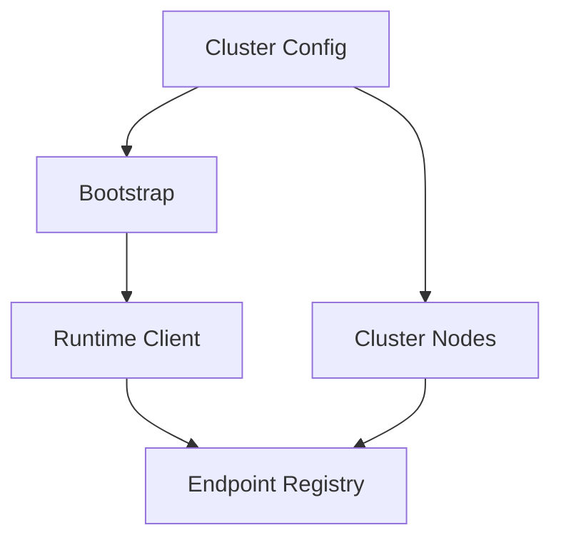
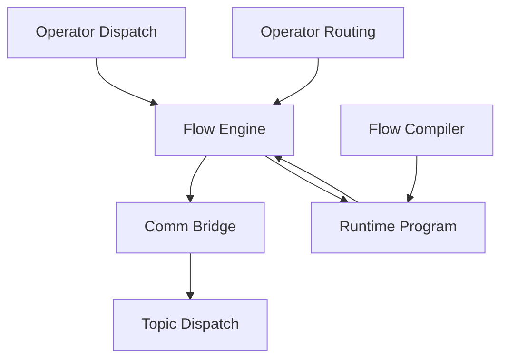

# Dispatch and Routing System

<cite>
**Referenced Files in This Document**
- [dispatch.py](file://src/sage/runtime/flownet/runtime/operator_runtime/dispatch.py)
- [routing.py](file://src/sage/runtime/flownet/runtime/operator_runtime/routing.py)
- [models.py](file://src/sage/runtime/flownet/runtime/operator_runtime/models.py)
- [operators.py](file://src/sage/stream/operators.py)
- [transformations.py](file://src/sage/stream/transformations.py)
- [datastream.py](file://src/sage/stream/datastream.py)
- [comm_bridge.py](file://src/sage/runtime/flownet/runtime/topics/comm_bridge.py)
- [event_dispatch.py](file://src/sage/runtime/flownet/runtime/topics/event_dispatch.py)
- [control_dispatch.py](file://src/sage/runtime/flownet/runtime/topics/control_dispatch.py)
- [routing_directory.py](file://src/sage/runtime/flownet/runtime/topics/routing_directory.py)
- [operator_executor.py](file://src/sage/runtime/flownet/runtime/flowengine/operator_executor.py)
- [operator_runtime.py](file://src/sage/runtime/flownet/runtime/flowengine/operator_runtime.py)
- [engine.py](file://src/sage/runtime/flownet/runtime/flowengine/engine.py)
- [backend_jobs.py](file://src/sage/runtime/flownet/runtime/actors/backend_jobs.py)
- [comm_hub.py](file://src/sage/runtime/flownet/runtime/comm/hub.py)
- [comm_router.py](file://src/sage/runtime/flownet/runtime/comm/router.py)
- [comm_transport.py](file://src/sage/runtime/flownet/runtime/comm/transport.py)
- [cluster_target.py](file://src/sage/runtime/flownet/node/cluster_target.py)
- [cluster_inventory.py](file://src/sage/runtime/flownet/node/cluster_inventory.py)
- [cluster_reconcile.py](file://src/sage/runtime/flownet/node/cluster_reconcile.py)
- [bootstrap.py](file://src/sage/runtime/flownet/client/bootstrap.py)
- [runtime_client.py](file://src/sage/runtime/flownet/client/runtime_client.py)
- [session.py](file://src/sage/runtime/flownet/client/session.py)
- [flow_program.py](file://src/sage/runtime/flownet/core/flow_program.py)
- [flow_compiler.py](file://src/sage/runtime/flownet/compiler/flow_compiler.py)
- [streams.py](file://src/sage/runtime/flownet/compiler/streams.py)
- [targets.py](file://src/sage/runtime/flownet/compiler/targets.py)
- [transformation.py](file://src/sage/runtime/flownet/compiler/transformation.py)
- [flow_exception_handlers.py](file://src/sage/runtime/flownet/api/flow_exception_handlers.py)
- [error_codes.py](file://src/sage/runtime/flownet/runtime/actors/error_codes.py)
- [exception_runner.py](file://src/sage/runtime/flownet/runtime/flowengine/exception_runner.py)
- [exception_decision.py](file://src/sage/runtime/flownet/runtime/flowengine/exception_decision.py)
- [governance.py](file://src/sage/runtime/flownet/runtime/governance.py)
- [shared_state_registry.py](file://src/sage/runtime/flownet/runtime/shared_state_registry.py)
- [endpoint_registry.py](file://src/sage/runtime/flownet/runtime/endpoint_registry.py)
- [runtime_state_query_contract.py](file://src/sage/runtime/flownet/contracts/runtime_state_query_contract.py)
- [runtime_telemetry_contract.py](file://src/sage/runtime/flownet/contracts/runtime_telemetry_contract.py)
- [recovery_contract.py](file://src/sage/runtime/flownet/contracts/recovery_contract.py)
- [flow_run_observation_contract.py](file://src/sage/runtime/flownet/contracts/flow_run_observation_contract.py)
- [flow_program_submit_contract.py](file://src/sage/runtime/flownet/contracts/flow_program_submit_contract.py)
- [endpoint_plane_contract.py](file://src/sage/runtime/flownet/contracts/endpoint_plane_contract.py)
- [cluster.yaml](file://config/cluster.yaml)
- [config.yaml](file://config/config.yaml)
</cite>

## Table of Contents
1. [Introduction](#introduction)
2. [Project Structure](#project-structure)
3. [Core Components](#core-components)
4. [Architecture Overview](#architecture-overview)
5. [Detailed Component Analysis](#detailed-component-analysis)
6. [Dependency Analysis](#dependency-analysis)
7. [Performance Considerations](#performance-considerations)
8. [Troubleshooting Guide](#troubleshooting-guide)
9. [Conclusion](#conclusion)
10. [Appendices](#appendices)

## Introduction
This document explains the Dispatch and Routing System that coordinates operator execution within SAGE’s FlowNet runtime. It focuses on how operators are scheduled, executed, and coordinated across distributed nodes, and how data is routed between operators to optimize throughput and reliability. The system integrates:
- Dispatch: scheduling, load balancing, and execution coordination for operators
- Routing: data flow management, operator connectivity, and execution path optimization
- Runtime orchestration: flow engine, communication bridge, and topic-based dispatch

These mechanisms ensure operators execute efficiently, handle failures gracefully, and maintain end-to-end data flow across heterogeneous compute resources.

## Project Structure
The FlowNet runtime organizes dispatch and routing concerns across several subsystems:
- Operator runtime: dispatch and routing logic for operators
- Flow engine: execution orchestration and exception handling
- Communication: inter-node messaging via a hub, router, and transport
- Topics: event-driven dispatch and routing directory
- Compiler and core: program compilation and runtime program representation
- Client and configuration: runtime bootstrap and cluster configuration

**Diagram sources**
- [dispatch.py](file://src/sage/runtime/flownet/runtime/operator_runtime/dispatch.py)
- [routing.py](file://src/sage/runtime/flownet/runtime/operator_runtime/routing.py)
- [models.py](file://src/sage/runtime/flownet/runtime/operator_runtime/models.py)
- [operator_executor.py](file://src/sage/runtime/flownet/runtime/flowengine/operator_executor.py)
- [operator_runtime.py](file://src/sage/runtime/flownet/runtime/flowengine/operator_runtime.py)
- [engine.py](file://src/sage/runtime/flownet/runtime/flowengine/engine.py)
- [comm_hub.py](file://src/sage/runtime/flownet/runtime/comm/hub.py)
- [comm_router.py](file://src/sage/runtime/flownet/runtime/comm/router.py)
- [comm_transport.py](file://src/sage/runtime/flownet/runtime/comm/transport.py)
- [comm_bridge.py](file://src/sage/runtime/flownet/runtime/topics/comm_bridge.py)
- [event_dispatch.py](file://src/sage/runtime/flownet/runtime/topics/event_dispatch.py)
- [control_dispatch.py](file://src/sage/runtime/flownet/runtime/topics/control_dispatch.py)
- [routing_directory.py](file://src/sage/runtime/flownet/runtime/topics/routing_directory.py)
- [flow_compiler.py](file://src/sage/runtime/flownet/compiler/flow_compiler.py)
- [streams.py](file://src/sage/runtime/flownet/compiler/streams.py)
- [flow_program.py](file://src/sage/runtime/flownet/core/flow_program.py)
- [bootstrap.py](file://src/sage/runtime/flownet/client/bootstrap.py)
- [runtime_client.py](file://src/sage/runtime/flownet/client/runtime_client.py)
- [config.yaml](file://config/config.yaml)
- [cluster.yaml](file://config/cluster.yaml)

**Section sources**
- [dispatch.py](file://src/sage/runtime/flownet/runtime/operator_runtime/dispatch.py)
- [routing.py](file://src/sage/runtime/flownet/runtime/operator_runtime/routing.py)
- [engine.py](file://src/sage/runtime/flownet/runtime/flowengine/engine.py)
- [comm_hub.py](file://src/sage/runtime/flownet/runtime/comm/hub.py)
- [comm_router.py](file://src/sage/runtime/flownet/runtime/comm/router.py)
- [comm_transport.py](file://src/sage/runtime/flownet/runtime/comm/transport.py)
- [comm_bridge.py](file://src/sage/runtime/flownet/runtime/topics/comm_bridge.py)
- [event_dispatch.py](file://src/sage/runtime/flownet/runtime/topics/event_dispatch.py)
- [control_dispatch.py](file://src/sage/runtime/flownet/runtime/topics/control_dispatch.py)
- [routing_directory.py](file://src/sage/runtime/flownet/runtime/topics/routing_directory.py)
- [flow_compiler.py](file://src/sage/runtime/flownet/compiler/flow_compiler.py)
- [streams.py](file://src/sage/runtime/flownet/compiler/streams.py)
- [flow_program.py](file://src/sage/runtime/flownet/core/flow_program.py)
- [bootstrap.py](file://src/sage/runtime/flownet/client/bootstrap.py)
- [runtime_client.py](file://src/sage/runtime/flownet/client/runtime_client.py)
- [config.yaml](file://config/config.yaml)
- [cluster.yaml](file://config/cluster.yaml)

## Core Components
- Operator dispatch: schedules operator instances across nodes, balances load, and coordinates execution lifecycle
- Operator routing: manages data flow between operators, operator connectivity, and execution path optimization
- Flow engine: orchestrates operator execution, handles exceptions, and maintains runtime state
- Communication bridge: routes messages between nodes and supports topic-based dispatch
- Compiler and runtime program: transforms user-defined flows into executable programs and manages runtime state

Key responsibilities:
- Dispatch: selection of target nodes, load balancing, retry/backoff, and failure recovery
- Routing: partitioning strategies, fan-out/fan-in, and path optimization
- Execution: lifecycle management, resource allocation, and telemetry
- Communication: reliable message delivery, ordering guarantees, and failure handling

**Section sources**
- [dispatch.py](file://src/sage/runtime/flownet/runtime/operator_runtime/dispatch.py)
- [routing.py](file://src/sage/runtime/flownet/runtime/operator_runtime/routing.py)
- [operator_executor.py](file://src/sage/runtime/flownet/runtime/flowengine/operator_executor.py)
- [operator_runtime.py](file://src/sage/runtime/flownet/runtime/flowengine/operator_runtime.py)
- [engine.py](file://src/sage/runtime/flownet/runtime/flowengine/engine.py)
- [comm_bridge.py](file://src/sage/runtime/flownet/runtime/topics/comm_bridge.py)
- [flow_program.py](file://src/sage/runtime/flownet/core/flow_program.py)

## Architecture Overview
The FlowNet runtime composes dispatch and routing with the flow engine and communication subsystems to coordinate operator execution across nodes.

**Diagram sources**
- [flow_compiler.py](file://src/sage/runtime/flownet/compiler/flow_compiler.py)
- [engine.py](file://src/sage/runtime/flownet/runtime/flowengine/engine.py)
- [dispatch.py](file://src/sage/runtime/flownet/runtime/operator_runtime/dispatch.py)
- [routing.py](file://src/sage/runtime/flownet/runtime/operator_runtime/routing.py)
- [comm_bridge.py](file://src/sage/runtime/flownet/runtime/topics/comm_bridge.py)

## Detailed Component Analysis

### Operator Dispatch Mechanisms
Operator dispatch selects target nodes, balances load, and coordinates execution lifecycle. It interacts with the flow engine and runtime program to schedule operators and manage retries.

Practical examples:
- Configure dispatch for different operator types by adjusting scheduling policies and resource allocations
- Optimize load balancing by selecting nodes with least recent workload or lowest queue depth
- Use backoff strategies to avoid thundering herd on transient failures

**Diagram sources**
- [dispatch.py](file://src/sage/runtime/flownet/runtime/operator_runtime/dispatch.py)
- [operator_executor.py](file://src/sage/runtime/flownet/runtime/flowengine/operator_executor.py)
- [engine.py](file://src/sage/runtime/flownet/runtime/flowengine/engine.py)
- [comm_bridge.py](file://src/sage/runtime/flownet/runtime/topics/comm_bridge.py)
- [flow_program.py](file://src/sage/runtime/flownet/core/flow_program.py)

**Section sources**
- [dispatch.py](file://src/sage/runtime/flownet/runtime/operator_runtime/dispatch.py)
- [operator_executor.py](file://src/sage/runtime/flownet/runtime/flowengine/operator_executor.py)
- [engine.py](file://src/sage/runtime/flownet/runtime/flowengine/engine.py)
- [comm_bridge.py](file://src/sage/runtime/flownet/runtime/topics/comm_bridge.py)
- [flow_program.py](file://src/sage/runtime/flownet/core/flow_program.py)

### Operator Routing Strategies
Operator routing controls data flow between operators, ensuring connectivity and optimizing execution paths. It defines partitioning, fan-out/fan-in semantics, and endpoint registration.

Practical examples:
- Use hash partitioning for stateful operators to ensure deterministic sharding
- Apply round-robin for stateless operators to balance load evenly
- Minimize cross-node hops by colocating related operators when possible

**Diagram sources**
- [routing.py](file://src/sage/runtime/flownet/runtime/operator_runtime/routing.py)
- [routing_directory.py](file://src/sage/runtime/flownet/runtime/topics/routing_directory.py)
- [comm_router.py](file://src/sage/runtime/flownet/runtime/comm/router.py)
- [comm_hub.py](file://src/sage/runtime/flownet/runtime/comm/hub.py)
- [flow_program.py](file://src/sage/runtime/flownet/core/flow_program.py)

**Section sources**
- [routing.py](file://src/sage/runtime/flownet/runtime/operator_runtime/routing.py)
- [routing_directory.py](file://src/sage/runtime/flownet/runtime/topics/routing_directory.py)
- [comm_router.py](file://src/sage/runtime/flownet/runtime/comm/router.py)
- [comm_hub.py](file://src/sage/runtime/flownet/runtime/comm/hub.py)
- [flow_program.py](file://src/sage/runtime/flownet/core/flow_program.py)

### Execution Coordination and Lifecycle
The flow engine coordinates operator execution, manages lifecycle transitions, and handles exceptions. It integrates with dispatch and routing to orchestrate end-to-end execution.

Practical examples:
- Coordinate stateful operators by ensuring consistent partitioning and ordering
- Use event dispatch to propagate progress and control signals across operators
- Integrate with shared state registry for cross-operator coordination

**Diagram sources**
- [engine.py](file://src/sage/runtime/flownet/runtime/flowengine/engine.py)
- [operator_executor.py](file://src/sage/runtime/flownet/runtime/flowengine/operator_executor.py)
- [dispatch.py](file://src/sage/runtime/flownet/runtime/operator_runtime/dispatch.py)
- [routing.py](file://src/sage/runtime/flownet/runtime/operator_runtime/routing.py)
- [comm_bridge.py](file://src/sage/runtime/flownet/runtime/topics/comm_bridge.py)

**Section sources**
- [engine.py](file://src/sage/runtime/flownet/runtime/flowengine/engine.py)
- [operator_executor.py](file://src/sage/runtime/flownet/runtime/flowengine/operator_executor.py)
- [dispatch.py](file://src/sage/runtime/flownet/runtime/operator_runtime/dispatch.py)
- [routing.py](file://src/sage/runtime/flownet/runtime/operator_runtime/routing.py)
- [comm_bridge.py](file://src/sage/runtime/flownet/runtime/topics/comm_bridge.py)

### Communication and Topic-Based Dispatch
Inter-node communication is handled by a hub, router, and transport, while topic-based dispatch routes events and control messages.

Practical examples:
- Use event dispatch to propagate operator progress and completion signals
- Use control dispatch for runtime control messages (pause, resume, cancel)
- Use routing directory to discover endpoints and update routing plans dynamically

**Diagram sources**
- [comm_bridge.py](file://src/sage/runtime/flownet/runtime/topics/comm_bridge.py)
- [comm_hub.py](file://src/sage/runtime/flownet/runtime/comm/hub.py)
- [comm_router.py](file://src/sage/runtime/flownet/runtime/comm/router.py)
- [comm_transport.py](file://src/sage/runtime/flownet/runtime/comm/transport.py)
- [event_dispatch.py](file://src/sage/runtime/flownet/runtime/topics/event_dispatch.py)
- [control_dispatch.py](file://src/sage/runtime/flownet/runtime/topics/control_dispatch.py)
- [routing_directory.py](file://src/sage/runtime/flownet/runtime/topics/routing_directory.py)

**Section sources**
- [comm_bridge.py](file://src/sage/runtime/flownet/runtime/topics/comm_bridge.py)
- [comm_hub.py](file://src/sage/runtime/flownet/runtime/comm/hub.py)
- [comm_router.py](file://src/sage/runtime/flownet/runtime/comm/router.py)
- [comm_transport.py](file://src/sage/runtime/flownet/runtime/comm/transport.py)
- [event_dispatch.py](file://src/sage/runtime/flownet/runtime/topics/event_dispatch.py)
- [control_dispatch.py](file://src/sage/runtime/flownet/runtime/topics/control_dispatch.py)
- [routing_directory.py](file://src/sage/runtime/flownet/runtime/topics/routing_directory.py)

### Compiler and Runtime Program Integration
The compiler transforms user-defined flows into executable programs, while the runtime program encapsulates scheduling and routing metadata.

Practical examples:
- Use the compiler to transform streaming transformations into executable operators
- Leverage the runtime program to define operator dependencies and routing plans
- Integrate with streams and targets to support diverse data sources and sinks

**Diagram sources**
- [flow_compiler.py](file://src/sage/runtime/flownet/compiler/flow_compiler.py)
- [streams.py](file://src/sage/runtime/flownet/compiler/streams.py)
- [targets.py](file://src/sage/runtime/flownet/compiler/targets.py)
- [transformation.py](file://src/sage/runtime/flownet/compiler/transformation.py)
- [flow_program.py](file://src/sage/runtime/flownet/core/flow_program.py)

**Section sources**
- [flow_compiler.py](file://src/sage/runtime/flownet/compiler/flow_compiler.py)
- [streams.py](file://src/sage/runtime/flownet/compiler/streams.py)
- [targets.py](file://src/sage/runtime/flownet/compiler/targets.py)
- [transformation.py](file://src/sage/runtime/flownet/compiler/transformation.py)
- [flow_program.py](file://src/sage/runtime/flownet/core/flow_program.py)

### Client and Cluster Configuration
The runtime client bootstraps the connection to the FlowNet runtime, while cluster configuration defines node capabilities and placement policies.

Practical examples:
- Configure cluster.yaml to define node groups and resource profiles
- Use runtime client to establish secure connections and authenticate with the runtime
- Register endpoints to enable operator discovery and routing

**Diagram sources**
- [bootstrap.py](file://src/sage/runtime/flownet/client/bootstrap.py)
- [runtime_client.py](file://src/sage/runtime/flownet/client/runtime_client.py)
- [endpoint_registry.py](file://src/sage/runtime/flownet/runtime/endpoint_registry.py)
- [cluster.yaml](file://config/cluster.yaml)

**Section sources**
- [bootstrap.py](file://src/sage/runtime/flownet/client/bootstrap.py)
- [runtime_client.py](file://src/sage/runtime/flownet/client/runtime_client.py)
- [endpoint_registry.py](file://src/sage/runtime/flownet/runtime/endpoint_registry.py)
- [cluster.yaml](file://config/cluster.yaml)

## Dependency Analysis
The dispatch and routing system depends on the flow engine, communication bridge, and topic-based dispatch for end-to-end coordination. The compiler and runtime program provide the executable representation of user-defined flows.

**Diagram sources**
- [dispatch.py](file://src/sage/runtime/flownet/runtime/operator_runtime/dispatch.py)
- [routing.py](file://src/sage/runtime/flownet/runtime/operator_runtime/routing.py)
- [engine.py](file://src/sage/runtime/flownet/runtime/flowengine/engine.py)
- [comm_bridge.py](file://src/sage/runtime/flownet/runtime/topics/comm_bridge.py)
- [flow_program.py](file://src/sage/runtime/flownet/core/flow_program.py)
- [flow_compiler.py](file://src/sage/runtime/flownet/compiler/flow_compiler.py)

**Section sources**
- [dispatch.py](file://src/sage/runtime/flownet/runtime/operator_runtime/dispatch.py)
- [routing.py](file://src/sage/runtime/flownet/runtime/operator_runtime/routing.py)
- [engine.py](file://src/sage/runtime/flownet/runtime/flowengine/engine.py)
- [comm_bridge.py](file://src/sage/runtime/flownet/runtime/topics/comm_bridge.py)
- [flow_program.py](file://src/sage/runtime/flownet/core/flow_program.py)
- [flow_compiler.py](file://src/sage/runtime/flownet/compiler/flow_compiler.py)

## Performance Considerations
- Dispatch strategies:
  - Prefer locality-aware scheduling to minimize cross-node data movement
  - Use adaptive load balancing to react to dynamic workload changes
  - Implement backoff and retry policies to handle transient failures without overwhelming nodes
- Routing strategies:
  - Choose partitioning strategies aligned with operator semantics (hash for deterministic stateful operators, round-robin for stateless)
  - Minimize cross-node hops by co-locating related operators
  - Use fan-in/fan-out patterns judiciously to balance throughput and latency
- Execution coordination:
  - Use event dispatch to propagate progress and reduce polling overhead
  - Integrate with shared state registry for efficient cross-operator coordination
- Communication:
  - Leverage the comm hub and router to optimize message delivery and reduce contention
  - Use transport-level batching and compression to improve throughput

[No sources needed since this section provides general guidance]

## Troubleshooting Guide
Common issues and debugging approaches:
- Dispatch failures:
  - Verify scheduling policies and resource allocations in the runtime program
  - Check backoff and retry configurations to avoid excessive retries
  - Inspect error codes and exception runner for failure classification
- Routing problems:
  - Confirm routing directory entries and endpoint registrations
  - Validate partitioning strategy and key distribution
  - Review fan-in/fan-out semantics for correctness
- Execution flow issues:
  - Use runtime telemetry and state queries to trace operator execution
  - Inspect exception decisions and handlers to understand failure propagation
  - Enable governance controls to enforce runtime policies and detect anomalies
- Communication failures:
  - Validate comm bridge configuration and endpoint registry
  - Check hub and router logs for message delivery issues
  - Review transport settings for bandwidth and latency constraints

**Section sources**
- [error_codes.py](file://src/sage/runtime/flownet/runtime/actors/error_codes.py)
- [exception_runner.py](file://src/sage/runtime/flownet/runtime/flowengine/exception_runner.py)
- [exception_decision.py](file://src/sage/runtime/flownet/runtime/flowengine/exception_decision.py)
- [runtime_telemetry_contract.py](file://src/sage/runtime/flownet/contracts/runtime_telemetry_contract.py)
- [runtime_state_query_contract.py](file://src/sage/runtime/flownet/contracts/runtime_state_query_contract.py)
- [governance.py](file://src/sage/runtime/flownet/runtime/governance.py)
- [endpoint_registry.py](file://src/sage/runtime/flownet/runtime/endpoint_registry.py)
- [comm_bridge.py](file://src/sage/runtime/flownet/runtime/topics/comm_bridge.py)

## Conclusion
The Dispatch and Routing System in SAGE’s FlowNet runtime provides a robust foundation for operator execution coordination across distributed environments. By combining operator dispatch, routing, flow engine orchestration, and topic-based communication, the system ensures efficient scheduling, reliable data flow, and resilient execution. Proper configuration of dispatch strategies, routing algorithms, and communication channels enables optimal performance and ease of debugging for complex operator graphs.

[No sources needed since this section summarizes without analyzing specific files]

## Appendices
- Practical examples:
  - Configure dispatch for stateful operators using hash partitioning and deterministic routing
  - Optimize routing for stateless operators with round-robin partitioning and minimal cross-node hops
  - Use event dispatch to propagate progress and control signals for responsive execution
  - Integrate shared state registry for cross-operator coordination and recovery
- Error handling:
  - Classify failures using error codes and exception runner
  - Apply exception decisions to determine retry, fail-fast, or recovery actions
  - Use recovery contract to restore runtime state after failures
- Debugging:
  - Utilize runtime telemetry and state queries for visibility into operator execution
  - Enable governance controls to monitor policy compliance and detect anomalies
  - Inspect endpoint registry and routing directory for connectivity issues

[No sources needed since this section provides general guidance]