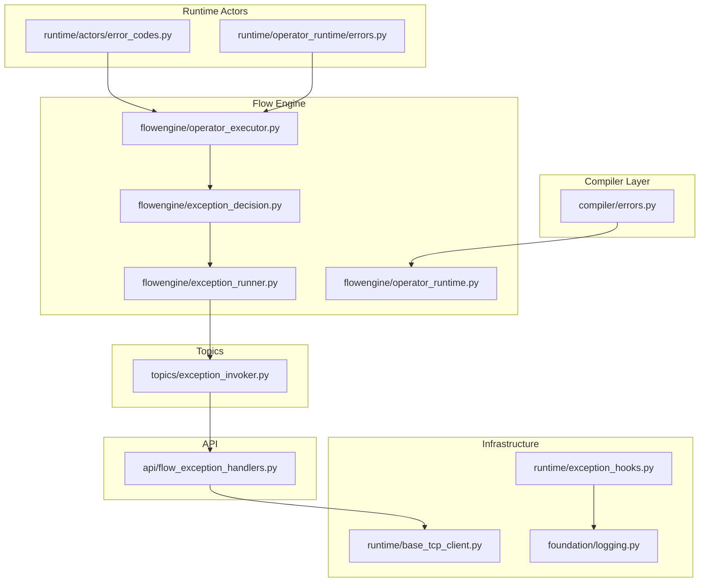
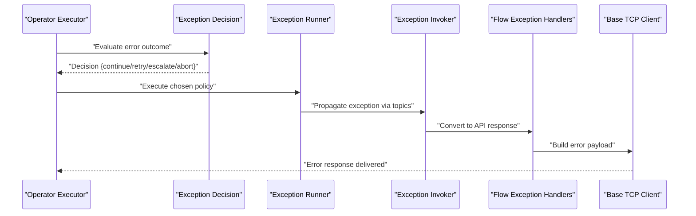
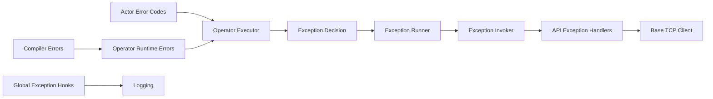

# Error Handling Protocols

<cite>
**Referenced Files in This Document**
- [errors.py](file://src/sage/runtime/flownet/compiler/errors.py)
- [error_codes.py](file://src/sage/runtime/flownet/runtime/actors/error_codes.py)
- [errors.py](file://src/sage/runtime/flownet/runtime/operator_runtime/errors.py)
- [exception_decision.py](file://src/sage/runtime/flownet/runtime/flowengine/exception_decision.py)
- [exception_runner.py](file://src/sage/runtime/flownet/runtime/flowengine/exception_runner.py)
- [operator_executor.py](file://src/sage/runtime/flownet/runtime/flowengine/operator_executor.py)
- [operator_runtime.py](file://src/sage/runtime/flownet/runtime/flowengine/operator_runtime.py)
- [exception_invoker.py](file://src/sage/runtime/flownet/runtime/topics/exception_invoker.py)
- [flow_exception_handlers.py](file://src/sage/runtime/flownet/api/flow_exception_handlers.py)
- [base_tcp_client.py](file://src/sage/runtime/base_tcp_client.py)
- [exception_hooks.py](file://src/sage/runtime/exception_hooks.py)
- [logging.py](file://src/sage/foundation/logging.py)
</cite>

## Table of Contents
1. [Introduction](#introduction)
2. [Project Structure](#project-structure)
3. [Core Components](#core-components)
4. [Architecture Overview](#architecture-overview)
5. [Detailed Component Analysis](#detailed-component-analysis)
6. [Dependency Analysis](#dependency-analysis)
7. [Performance Considerations](#performance-considerations)
8. [Troubleshooting Guide](#troubleshooting-guide)
9. [Conclusion](#conclusion)

## Introduction
This document describes SAGE’s specialized error handling protocols for operator execution within the FlowNet runtime. The operator error runtime is responsible for detecting, propagating, and recovering from errors during the execution of operators across distributed nodes. It defines error handler classes, coordination mechanisms, and fault tolerance strategies that ensure resilient operation under failure conditions. The goal is to provide a comprehensive understanding of how errors are modeled, routed, and resolved during operator execution, along with practical patterns for debugging and recovery.

## Project Structure
The error handling system spans several modules within the FlowNet runtime:
- Compiler-level error modeling and scoping
- Runtime-level operator error handling and error codes
- Flow engine exception decision and runner logic
- Topics-based exception invocation and propagation
- API-level exception handlers
- Base TCP client error response generation
- Global exception hooks and logging

**Diagram sources**
- [errors.py:1-200](file://src/sage/runtime/flownet/compiler/errors.py#L1-L200)
- [error_codes.py:1-200](file://src/sage/runtime/flownet/runtime/actors/error_codes.py#L1-L200)
- [errors.py:1-200](file://src/sage/runtime/flownet/runtime/operator_runtime/errors.py#L1-L200)
- [exception_decision.py:1-200](file://src/sage/runtime/flownet/runtime/flowengine/exception_decision.py#L1-L200)
- [exception_runner.py:1-200](file://src/sage/runtime/flownet/runtime/flowengine/exception_runner.py#L1-L200)
- [operator_executor.py:1-200](file://src/sage/runtime/flownet/runtime/flowengine/operator_executor.py#L1-L200)
- [operator_runtime.py:1-200](file://src/sage/runtime/flownet/runtime/flowengine/operator_runtime.py#L1-L200)
- [exception_invoker.py:1-200](file://src/sage/runtime/flownet/runtime/topics/exception_invoker.py#L1-L200)
- [flow_exception_handlers.py:1-200](file://src/sage/runtime/flownet/api/flow_exception_handlers.py#L1-L200)
- [base_tcp_client.py:1-200](file://src/sage/runtime/base_tcp_client.py#L1-L200)
- [exception_hooks.py:1-100](file://src/sage/runtime/exception_hooks.py#L1-L100)
- [logging.py:1-150](file://src/sage/foundation/logging.py#L1-L150)

**Section sources**
- [errors.py:1-200](file://src/sage/runtime/flownet/compiler/errors.py#L1-L200)
- [error_codes.py:1-200](file://src/sage/runtime/flownet/runtime/actors/error_codes.py#L1-L200)
- [errors.py:1-200](file://src/sage/runtime/flownet/runtime/operator_runtime/errors.py#L1-L200)
- [exception_decision.py:1-200](file://src/sage/runtime/flownet/runtime/flowengine/exception_decision.py#L1-L200)
- [exception_runner.py:1-200](file://src/sage/runtime/flownet/runtime/flowengine/exception_runner.py#L1-L200)
- [operator_executor.py:1-200](file://src/sage/runtime/flownet/runtime/flowengine/operator_executor.py#L1-L200)
- [operator_runtime.py:1-200](file://src/sage/runtime/flownet/runtime/flowengine/operator_runtime.py#L1-L200)
- [exception_invoker.py:1-200](file://src/sage/runtime/flownet/runtime/topics/exception_invoker.py#L1-L200)
- [flow_exception_handlers.py:1-200](file://src/sage/runtime/flownet/api/flow_exception_handlers.py#L1-L200)
- [base_tcp_client.py:1-200](file://src/sage/runtime/base_tcp_client.py#L1-L200)
- [exception_hooks.py:1-100](file://src/sage/runtime/exception_hooks.py#L1-L100)
- [logging.py:1-150](file://src/sage/foundation/logging.py#L1-L150)

## Core Components
- Compiler error modeling: Defines error types and scoping constructs used to capture and categorize compilation-time and runtime errors that originate from operator definitions and their execution contexts.
- Operator runtime error handling: Provides error classes and utilities specific to operator execution, including error propagation and recovery primitives.
- Actor error codes: Encodes standardized error identifiers used across the runtime to classify and route errors consistently.
- Flow engine exception decision and runner: Implements policies for deciding whether to continue, retry, escalate, or abort execution upon encountering errors, and executes the chosen policy.
- Topics-based exception invocation: Coordinates cross-topic propagation of exceptions and ensures consistent error delivery to subscribers and observers.
- API exception handlers: Converts internal exceptions into structured responses for clients and surfaces actionable error information.
- Base TCP client error responses: Generates standardized error payloads for network-bound failures and service-level errors.
- Global exception hooks and logging: Establishes global hooks for unhandled exceptions and integrates with the foundation logging subsystem for diagnostics.

**Section sources**
- [errors.py:1-200](file://src/sage/runtime/flownet/compiler/errors.py#L1-L200)
- [errors.py:1-200](file://src/sage/runtime/flownet/runtime/operator_runtime/errors.py#L1-L200)
- [error_codes.py:1-200](file://src/sage/runtime/flownet/runtime/actors/error_codes.py#L1-L200)
- [exception_decision.py:1-200](file://src/sage/runtime/flownet/runtime/flowengine/exception_decision.py#L1-L200)
- [exception_runner.py:1-200](file://src/sage/runtime/flownet/runtime/flowengine/exception_runner.py#L1-L200)
- [exception_invoker.py:1-200](file://src/sage/runtime/flownet/runtime/topics/exception_invoker.py#L1-L200)
- [flow_exception_handlers.py:1-200](file://src/sage/runtime/flownet/api/flow_exception_handlers.py#L1-L200)
- [base_tcp_client.py:1-200](file://src/sage/runtime/base_tcp_client.py#L1-L200)
- [exception_hooks.py:1-100](file://src/sage/runtime/exception_hooks.py#L1-L100)
- [logging.py:1-150](file://src/sage/foundation/logging.py#L1-L150)

## Architecture Overview
The operator error runtime orchestrates error handling across the FlowNet stack. At a high level:
- Errors are modeled and scoped at compile time and runtime.
- Operator execution invokes exception decisions and runners to evaluate error outcomes.
- Topics propagate exceptions to interested parties.
- API handlers translate internal exceptions into client-friendly responses.
- Base TCP client composes error payloads for network transport.
- Global hooks and logging capture diagnostics for debugging.

**Diagram sources**
- [operator_executor.py:1-200](file://src/sage/runtime/flownet/runtime/flowengine/operator_executor.py#L1-L200)
- [exception_decision.py:1-200](file://src/sage/runtime/flownet/runtime/flowengine/exception_decision.py#L1-L200)
- [exception_runner.py:1-200](file://src/sage/runtime/flownet/runtime/flowengine/exception_runner.py#L1-L200)
- [exception_invoker.py:1-200](file://src/sage/runtime/flownet/runtime/topics/exception_invoker.py#L1-L200)
- [flow_exception_handlers.py:1-200](file://src/sage/runtime/flownet/api/flow_exception_handlers.py#L1-L200)
- [base_tcp_client.py:1-200](file://src/sage/runtime/base_tcp_client.py#L1-L200)

## Detailed Component Analysis

### Compiler Error Modeling
Purpose:
- Define error categories and scoping rules for operator-related failures during compilation and early runtime phases.
- Provide a taxonomy that enables precise classification and targeted handling strategies.

Key responsibilities:
- Error type definitions and inheritance hierarchy.
- Scope-aware error capture and propagation.
- Integration with operator runtime error handling.

Implementation highlights:
- Error classes encapsulate failure semantics and metadata.
- Scoping constructs ensure errors remain localized when appropriate and bubble up when necessary.

Practical usage:
- Use compiler errors to preempt problematic operator configurations before deployment.
- Leverage scoping to isolate transient failures and avoid cascading effects.

**Section sources**
- [errors.py:1-200](file://src/sage/runtime/flownet/compiler/errors.py#L1-L200)

### Operator Runtime Error Handling
Purpose:
- Provide error classes and utilities tailored to operator execution environments.
- Support propagation and recovery mechanisms specific to FlowNet’s operator lifecycle.

Key responsibilities:
- Define operator-specific error types.
- Coordinate error propagation across operator boundaries.
- Integrate with runtime execution contexts for recovery.

Implementation highlights:
- Error utilities support consistent error wrapping and unwrapping.
- Recovery primitives enable retries, fallbacks, and graceful degradation.

Practical usage:
- Wrap unexpected operator exceptions with operator runtime errors for consistent handling.
- Use recovery primitives to attempt remediation before escalation.

**Section sources**
- [errors.py:1-200](file://src/sage/runtime/flownet/runtime/operator_runtime/errors.py#L1-L200)

### Actor Error Codes
Purpose:
- Standardize error identifiers used across the runtime to ensure consistent classification and routing.

Key responsibilities:
- Enumerate canonical error codes for common failure modes.
- Provide lookup and conversion utilities for error code handling.

Implementation highlights:
- Error codes map to human-readable categories and machine-actionable classifications.
- Utilities support serialization and deserialization for inter-process communication.

Practical usage:
- Assign error codes to exceptions to enable uniform downstream handling.
- Use error code lookups to drive policy decisions in exception runners.

**Section sources**
- [error_codes.py:1-200](file://src/sage/runtime/flownet/runtime/actors/error_codes.py#L1-L200)

### Flow Engine Exception Decision and Runner
Purpose:
- Determine the appropriate action when an operator error occurs, including continuation, retry, escalation, or abortion.
- Execute the chosen policy consistently across the runtime.

Key responsibilities:
- Evaluate error context and severity.
- Apply decision logic to select a recovery strategy.
- Execute the selected policy and update execution state.

Implementation highlights:
- Decision logic considers error type, frequency, and resource constraints.
- Runner enforces policy execution and coordinates side effects (e.g., logging, notifications).

Practical usage:
- Configure decision policies per operator or globally for the runtime.
- Monitor runner outcomes to tune policies for reliability and performance.

**Section sources**
- [exception_decision.py:1-200](file://src/sage/runtime/flownet/runtime/flowengine/exception_decision.py#L1-L200)
- [exception_runner.py:1-200](file://src/sage/runtime/flownet/runtime/flowengine/exception_runner.py#L1-L200)

### Topics-Based Exception Invocation
Purpose:
- Propagate exceptions across topics and subscribers to ensure visibility and coordinated response.

Key responsibilities:
- Route exceptions to subscribed listeners.
- Normalize exception payloads for cross-system compatibility.
- Maintain ordering and causality in exception propagation.

Implementation highlights:
- Exception invoker publishes events to relevant topics.
- Subscribers receive structured exception data for local handling.

Practical usage:
- Subscribe to exception topics to receive alerts for operator failures.
- Use normalized payloads to correlate errors across systems.

**Section sources**
- [exception_invoker.py:1-200](file://src/sage/runtime/flownet/runtime/topics/exception_invoker.py#L1-L200)

### API Exception Handlers
Purpose:
- Convert internal exceptions into structured API responses for clients.

Key responsibilities:
- Map internal errors to client-facing messages.
- Preserve diagnostic context while ensuring safety and clarity.

Implementation highlights:
- Handlers transform exceptions into standardized response formats.
- Include contextual metadata to aid debugging without leaking sensitive details.

Practical usage:
- Register handlers for operator-specific exceptions to surface actionable information.
- Use handler outputs to populate client-side error UI and logs.

**Section sources**
- [flow_exception_handlers.py:1-200](file://src/sage/runtime/flownet/api/flow_exception_handlers.py#L1-L200)

### Base TCP Client Error Responses
Purpose:
- Compose standardized error payloads for network-bound failures and service-level errors.

Key responsibilities:
- Build error responses with consistent structure and semantics.
- Encode error codes and messages suitable for transport.

Implementation highlights:
- Methods construct error dictionaries with fields for code, message, and optional details.
- Responses integrate with API exception handlers for unified error presentation.

Practical usage:
- Use error response builders when returning errors over the wire.
- Combine with logging to ensure traceability across network boundaries.

**Section sources**
- [base_tcp_client.py:1-200](file://src/sage/runtime/base_tcp_client.py#L1-L200)

### Global Exception Hooks and Logging
Purpose:
- Capture unhandled exceptions globally and integrate with the logging subsystem for diagnostics.

Key responsibilities:
- Register push/pop hooks to intercept unhandled exceptions.
- Forward exceptions to logging for persistent diagnostics.

Implementation highlights:
- Hooks wrap global exception handling to centralize error capture.
- Logging integrates with runtime components to enrich error context.

Practical usage:
- Enable hooks during development and testing to catch edge-case failures.
- Review logs for patterns indicating systemic issues requiring policy updates.

**Section sources**
- [exception_hooks.py:1-100](file://src/sage/runtime/exception_hooks.py#L1-L100)
- [logging.py:1-150](file://src/sage/foundation/logging.py#L1-L150)

## Dependency Analysis
The error handling system exhibits layered dependencies:
- Compiler errors feed into operator runtime errors.
- Actor error codes unify classification across the runtime.
- Flow engine decision and runner depend on operator runtime errors and error codes.
- Topics exception invoker depends on decision/runner outputs.
- API exception handlers depend on topics and base TCP client responses.
- Global hooks and logging depend on the broader runtime infrastructure.

**Diagram sources**
- [errors.py:1-200](file://src/sage/runtime/flownet/compiler/errors.py#L1-L200)
- [error_codes.py:1-200](file://src/sage/runtime/flownet/runtime/actors/error_codes.py#L1-L200)
- [errors.py:1-200](file://src/sage/runtime/flownet/runtime/operator_runtime/errors.py#L1-L200)
- [operator_executor.py:1-200](file://src/sage/runtime/flownet/runtime/flowengine/operator_executor.py#L1-L200)
- [exception_decision.py:1-200](file://src/sage/runtime/flownet/runtime/flowengine/exception_decision.py#L1-L200)
- [exception_runner.py:1-200](file://src/sage/runtime/flownet/runtime/flowengine/exception_runner.py#L1-L200)
- [exception_invoker.py:1-200](file://src/sage/runtime/flownet/runtime/topics/exception_invoker.py#L1-L200)
- [flow_exception_handlers.py:1-200](file://src/sage/runtime/flownet/api/flow_exception_handlers.py#L1-L200)
- [base_tcp_client.py:1-200](file://src/sage/runtime/base_tcp_client.py#L1-L200)
- [exception_hooks.py:1-100](file://src/sage/runtime/exception_hooks.py#L1-L100)
- [logging.py:1-150](file://src/sage/foundation/logging.py#L1-L150)

**Section sources**
- [operator_executor.py:1-200](file://src/sage/runtime/flownet/runtime/flowengine/operator_executor.py#L1-L200)
- [operator_runtime.py:1-200](file://src/sage/runtime/flownet/runtime/flowengine/operator_runtime.py#L1-L200)
- [exception_decision.py:1-200](file://src/sage/runtime/flownet/runtime/flowengine/exception_decision.py#L1-L200)
- [exception_runner.py:1-200](file://src/sage/runtime/flownet/runtime/flowengine/exception_runner.py#L1-L200)
- [exception_invoker.py:1-200](file://src/sage/runtime/flownet/runtime/topics/exception_invoker.py#L1-L200)
- [flow_exception_handlers.py:1-200](file://src/sage/runtime/flownet/api/flow_exception_handlers.py#L1-L200)
- [base_tcp_client.py:1-200](file://src/sage/runtime/base_tcp_client.py#L1-L200)
- [exception_hooks.py:1-100](file://src/sage/runtime/exception_hooks.py#L1-L100)
- [logging.py:1-150](file://src/sage/foundation/logging.py#L1-L150)

## Performance Considerations
- Minimize overhead of error handling by keeping decision logic lightweight and deterministic.
- Prefer fast-fail paths for unrecoverable errors to reduce wasted computation.
- Use batching and coalescing for exception propagation to reduce network overhead.
- Tune retry intervals and backoff strategies to balance responsiveness and resource usage.
- Avoid excessive logging in hot paths; defer expensive diagnostics until after error classification.

## Troubleshooting Guide
Common scenarios and strategies:
- Operator execution failure:
  - Inspect operator runtime errors and associated error codes to identify the failure category.
  - Review exception decision and runner outputs to confirm applied policy.
  - Use topics exception invoker to trace propagation and subscription outcomes.
- API-level error surfacing:
  - Verify API exception handlers convert internal errors into structured responses.
  - Confirm base TCP client error payloads include sufficient context without leaking secrets.
- Global diagnostics:
  - Enable global exception hooks to capture unhandled exceptions during development.
  - Cross-reference logs with error codes and exception invoker topics for correlation.

Debugging techniques:
- Add targeted logging around operator boundaries to capture entry/exit states and intermediate results.
- Use error code lookups to filter and aggregate similar failures for pattern recognition.
- Instrument exception invoker subscriptions to observe real-time propagation and timing.

**Section sources**
- [errors.py:1-200](file://src/sage/runtime/flownet/runtime/operator_runtime/errors.py#L1-L200)
- [error_codes.py:1-200](file://src/sage/runtime/flownet/runtime/actors/error_codes.py#L1-L200)
- [exception_decision.py:1-200](file://src/sage/runtime/flownet/runtime/flowengine/exception_decision.py#L1-L200)
- [exception_runner.py:1-200](file://src/sage/runtime/flownet/runtime/flowengine/exception_runner.py#L1-L200)
- [exception_invoker.py:1-200](file://src/sage/runtime/flownet/runtime/topics/exception_invoker.py#L1-L200)
- [flow_exception_handlers.py:1-200](file://src/sage/runtime/flownet/api/flow_exception_handlers.py#L1-L200)
- [base_tcp_client.py:1-200](file://src/sage/runtime/base_tcp_client.py#L1-L200)
- [exception_hooks.py:1-100](file://src/sage/runtime/exception_hooks.py#L1-L100)
- [logging.py:1-150](file://src/sage/foundation/logging.py#L1-L150)

## Conclusion
SAGE’s operator error runtime provides a robust, layered approach to error detection, propagation, and recovery within FlowNet. By combining compiler-level error modeling, operator-specific runtime handling, standardized actor error codes, and coordinated exception decision/runner logic, the system achieves resilience and observability. Topics-based propagation and API handlers ensure consistent client-facing error reporting, while global hooks and logging support comprehensive diagnostics. Adopting the documented patterns and best practices will improve fault tolerance and streamline debugging for complex distributed operator execution scenarios.