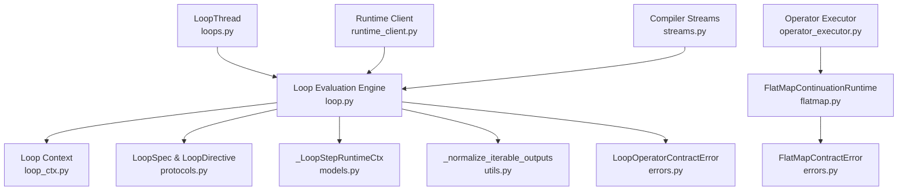
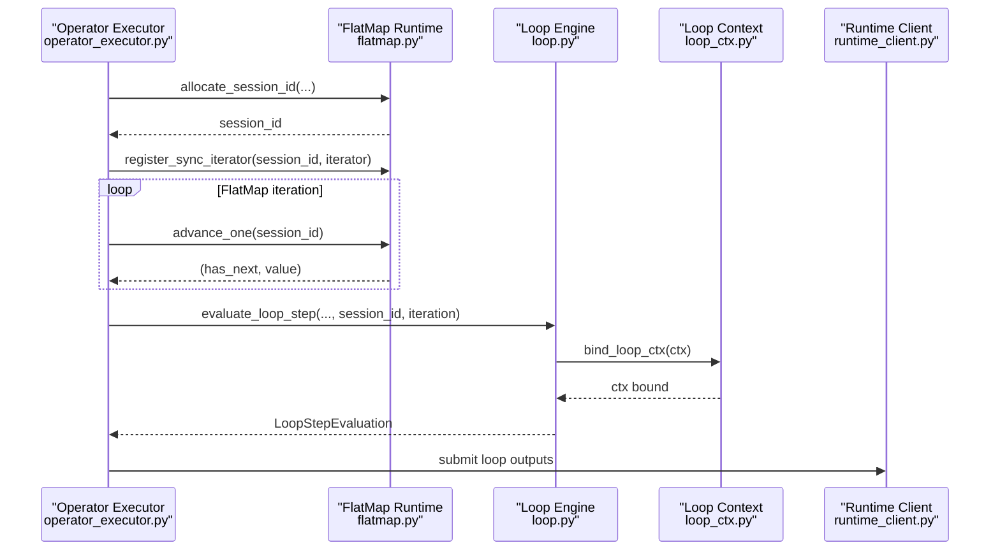
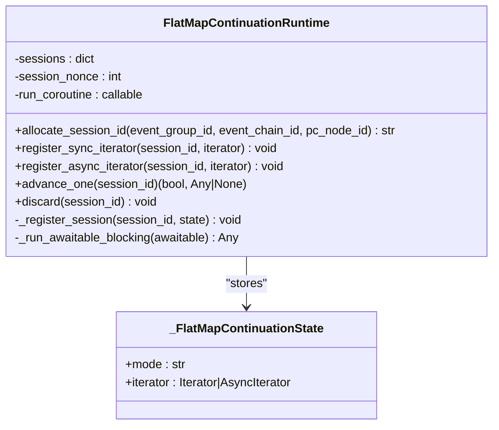
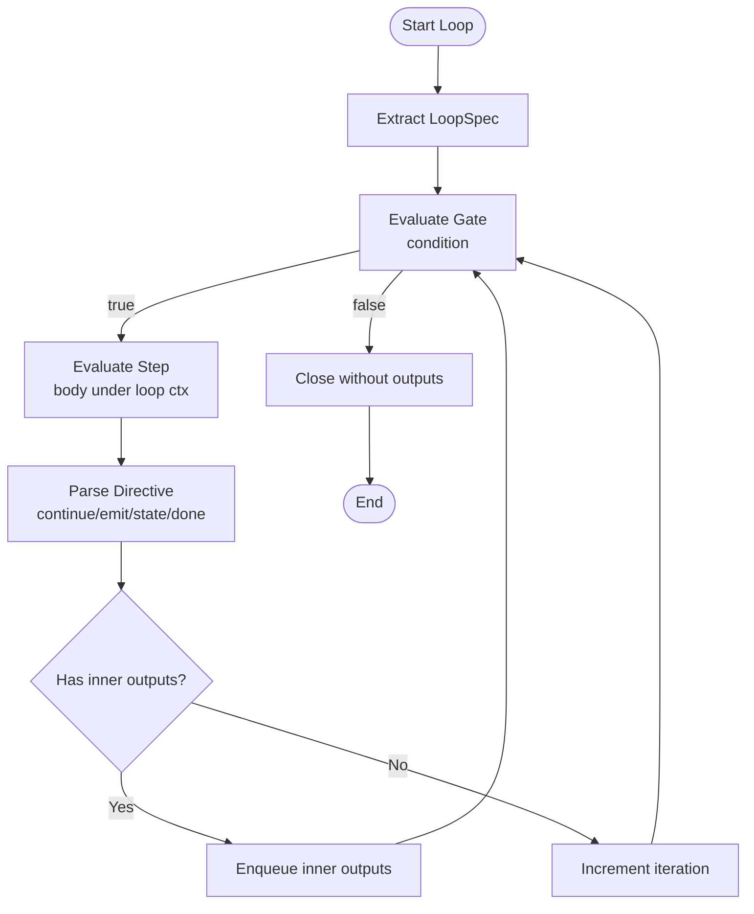
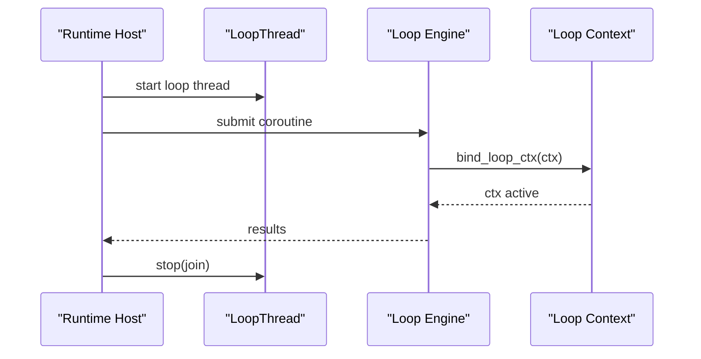
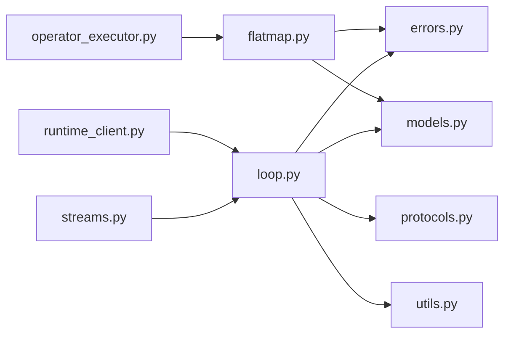

# FlatMap and Loop Processing

<cite>
**Referenced Files in This Document**
- [flatmap.py](file://src/sage/runtime/flownet/runtime/operator_runtime/flatmap.py)
- [loop.py](file://src/sage/runtime/flownet/runtime/operator_runtime/loop.py)
- [loops.py](file://src/sage/runtime/flownet/runtime/loops.py)
- [loop_ctx.py](file://src/sage/runtime/flownet/runtime/flowengine/loop_ctx.py)
- [models.py](file://src/sage/runtime/flownet/runtime/operator_runtime/models.py)
- [errors.py](file://src/sage/runtime/flownet/runtime/operator_runtime/errors.py)
- [protocols.py](file://src/sage/runtime/flownet/runtime/operator_runtime/protocols.py)
- [utils.py](file://src/sage/runtime/flownet/runtime/operator_runtime/utils.py)
- [operator_executor.py](file://src/sage/runtime/flownet/runtime/flowengine/operator_executor.py)
- [runtime_client.py](file://src/sage/runtime/flownet/client/runtime_client.py)
- [streams.py](file://src/sage/runtime/flownet/compiler/streams.py)
</cite>

## Table of Contents
1. [Introduction](#introduction)
2. [Project Structure](#project-structure)
3. [Core Components](#core-components)
4. [Architecture Overview](#architecture-overview)
5. [Detailed Component Analysis](#detailed-component-analysis)
6. [Dependency Analysis](#dependency-analysis)
7. [Performance Considerations](#performance-considerations)
8. [Troubleshooting Guide](#troubleshooting-guide)
9. [Conclusion](#conclusion)

## Introduction
This document explains the specialized execution environments for transformation and iterative operators in FlowNet’s runtime, focusing on FlatMap and Loop processing. It covers:
- The FlatMap runtime for handling nested data structures, branching transformations, and dynamic operator creation via continuations.
- The Loop runtime for iterative computation, stateful iterations, and recursive operator execution with session-scoped state and directives.
- Practical patterns, state management, performance optimization, error handling, and debugging strategies for complex transformation pipelines.

## Project Structure
The FlatMap and Loop processing logic resides in the FlowNet runtime operator runtime layer. The key modules are:
- FlatMap continuation runtime and state machine
- Loop evaluation engine and directive parsing
- Loop context propagation and loop thread hosting
- Supporting models, protocols, utilities, and error types
- Integration points in the operator executor and runtime client

**Diagram sources**
- [flatmap.py:10-138](file://src/sage/runtime/flownet/runtime/operator_runtime/flatmap.py#L10-L138)
- [loop.py:19-511](file://src/sage/runtime/flownet/runtime/operator_runtime/loop.py#L19-L511)
- [loops.py:9-79](file://src/sage/runtime/flownet/runtime/loops.py#L9-L79)
- [loop_ctx.py:13-51](file://src/sage/runtime/flownet/runtime/flowengine/loop_ctx.py#L13-L51)
- [models.py:96-127](file://src/sage/runtime/flownet/runtime/operator_runtime/models.py#L96-L127)
- [errors.py:24-30](file://src/sage/runtime/flownet/runtime/operator_runtime/errors.py#L24-L30)
- [protocols.py:8-23](file://src/sage/runtime/flownet/runtime/operator_runtime/protocols.py#L8-L23)
- [utils.py:9-18](file://src/sage/runtime/flownet/runtime/operator_runtime/utils.py#L9-L18)
- [operator_executor.py:448-485](file://src/sage/runtime/flownet/runtime/flowengine/operator_executor.py#L448-L485)
- [runtime_client.py:2860-2932](file://src/sage/runtime/flownet/client/runtime_client.py#L2860-L2932)
- [streams.py:59-70](file://src/sage/runtime/flownet/compiler/streams.py#L59-L70)

**Section sources**
- [flatmap.py:10-138](file://src/sage/runtime/flownet/runtime/operator_runtime/flatmap.py#L10-L138)
- [loop.py:19-511](file://src/sage/runtime/flownet/runtime/operator_runtime/loop.py#L19-L511)
- [loops.py:9-79](file://src/sage/runtime/flownet/runtime/loops.py#L9-L79)
- [loop_ctx.py:13-51](file://src/sage/runtime/flownet/runtime/flowengine/loop_ctx.py#L13-L51)
- [models.py:96-127](file://src/sage/runtime/flownet/runtime/operator_runtime/models.py#L96-L127)
- [errors.py:24-30](file://src/sage/runtime/flownet/runtime/operator_runtime/errors.py#L24-L30)
- [protocols.py:8-23](file://src/sage/runtime/flownet/runtime/operator_runtime/protocols.py#L8-L23)
- [utils.py:9-18](file://src/sage/runtime/flownet/runtime/operator_runtime/utils.py#L9-L18)
- [operator_executor.py:448-485](file://src/sage/runtime/flownet/runtime/flowengine/operator_executor.py#L448-L485)
- [runtime_client.py:2860-2932](file://src/sage/runtime/flownet/client/runtime_client.py#L2860-L2932)
- [streams.py:59-70](file://src/sage/runtime/flownet/compiler/streams.py#L59-L70)

## Core Components
- FlatMapContinuationRuntime: Manages in-memory, runtime-local continuation sessions for sync and async iterators. Provides session allocation, advancement, and cleanup.
- Loop Evaluation Engine: Implements loop step evaluation, gate evaluation, and full loop execution with bounded iteration and session scoping.
- Loop Context: Thread-safe context propagation for loop steps, enabling stateful emission and closure signaling.
- Loop Thread: Dedicated event-loop thread for asynchronous loop processing in the v1 runtime host.
- Supporting Types: LoopSpec, LoopDirective, OperatorEvaluation, and runtime context models.

**Section sources**
- [flatmap.py:10-138](file://src/sage/runtime/flownet/runtime/operator_runtime/flatmap.py#L10-L138)
- [loop.py:19-511](file://src/sage/runtime/flownet/runtime/operator_runtime/loop.py#L19-L511)
- [loop_ctx.py:13-51](file://src/sage/runtime/flownet/runtime/flowengine/loop_ctx.py#L13-L51)
- [loops.py:9-79](file://src/sage/runtime/flownet/runtime/loops.py#L9-L79)
- [models.py:21-38](file://src/sage/runtime/flownet/runtime/operator_runtime/models.py#L21-L38)
- [protocols.py:8-23](file://src/sage/runtime/flownet/runtime/operator_runtime/protocols.py#L8-L23)

## Architecture Overview
The FlatMap and Loop runtimes integrate with FlowNet’s operator executor and runtime client. FlatMap relies on continuation sessions to drive incremental consumption of iterators. Loop relies on a loop context and directive parsing to orchestrate iterative execution with inner/outer event routing and optional termination.

**Diagram sources**
- [operator_executor.py:448-485](file://src/sage/runtime/flownet/runtime/flowengine/operator_executor.py#L448-L485)
- [flatmap.py:27-98](file://src/sage/runtime/flownet/runtime/operator_runtime/flatmap.py#L27-L98)
- [loop.py:19-96](file://src/sage/runtime/flownet/runtime/operator_runtime/loop.py#L19-L96)
- [loop_ctx.py:13-31](file://src/sage/runtime/flownet/runtime/flowengine/loop_ctx.py#L13-L31)
- [runtime_client.py:2860-2932](file://src/sage/runtime/flownet/client/runtime_client.py#L2860-L2932)

## Detailed Component Analysis

### FlatMap Continuation Runtime
Purpose:
- Provide a lightweight, runtime-local continuation store for incremental iteration over sync and async iterators.
- Enforce contract compliance for session lifecycle and iterator modes.

Key behaviors:
- Session allocation with stable identifiers derived from event group, chain, and node metadata.
- Registration of sync and async iterators with strict type checks.
- Single-step advancement with StopIteration/StopAsyncIteration handling and session cleanup.
- Blocking awaitable execution when an external coroutine runner is not provided.

**Diagram sources**
- [flatmap.py:10-138](file://src/sage/runtime/flownet/runtime/operator_runtime/flatmap.py#L10-L138)
- [models.py:124-128](file://src/sage/runtime/flownet/runtime/operator_runtime/models.py#L124-L128)

Practical patterns:
- Dynamic operator creation: Emit a generator or async generator from a transformation; the executor detects and registers it as a FlatMap continuation session.
- Branching transformations: Use FlatMap to fan out nested structures into multiple downstream events.

Common scenarios:
- Sync iterator over lists/tuples for branching transformations.
- Async iterator for I/O-bound branching with backpressure managed by the runtime.

Error handling:
- Contract violations raise FlatMapContractError with specific codes for missing/duplicate sessions and invalid iterator modes.

**Section sources**
- [flatmap.py:10-138](file://src/sage/runtime/flownet/runtime/operator_runtime/flatmap.py#L10-L138)
- [errors.py:28-30](file://src/sage/runtime/flownet/runtime/operator_runtime/errors.py#L28-L30)
- [operator_executor.py:448-485](file://src/sage/runtime/flownet/runtime/flowengine/operator_executor.py#L448-L485)

### Loop Processing Runtime
Purpose:
- Execute iterative transformations with bounded iterations, session scoping, and directive-driven control flow.
- Support both stepwise evaluation and gate evaluation for conditional continuation.

Key behaviors:
- LoopSpec extraction from transformation metadata.
- Gate evaluation to decide whether to continue based on condition.
- Step evaluation to execute the loop body under a loop context, capturing inner and outer outputs.
- Directive parsing to interpret continue_events, emit_events, state_events, and done/close_reason.
- Full loop execution using a queue to process inner outputs as the next iteration’s payload.

**Diagram sources**
- [loop.py:19-96](file://src/sage/runtime/flownet/runtime/operator_runtime/loop.py#L19-L96)
- [loop.py:189-224](file://src/sage/runtime/flownet/runtime/operator_runtime/loop.py#L189-L224)
- [loop_ctx.py:13-31](file://src/sage/runtime/flownet/runtime/flowengine/loop_ctx.py#L13-L31)

Loop directives:
- continue_events: Inputs for the next iteration.
- emit_events: Outputs propagated outward.
- state_events: Internal state updates.
- done and close_reason: Termination signals.

Session management:
- Stable session_id built from event group, transformation id, and a key fragment derived from payload/tags.
- Optional key_by selection supports partition-aware sessions.

Error handling:
- LoopOperatorContractError raised for invalid configurations, unsupported references, and contract violations.

**Section sources**
- [loop.py:19-511](file://src/sage/runtime/flownet/runtime/operator_runtime/loop.py#L19-L511)
- [protocols.py:8-23](file://src/sage/runtime/flownet/runtime/operator_runtime/protocols.py#L8-L23)
- [models.py:21-38](file://src/sage/runtime/flownet/runtime/operator_runtime/models.py#L21-L38)
- [errors.py:24-26](file://src/sage/runtime/flownet/runtime/operator_runtime/errors.py#L24-L26)
- [utils.py:9-18](file://src/sage/runtime/flownet/runtime/operator_runtime/utils.py#L9-L18)

### Loop Context and Thread Management
- Loop Context: Uses contextvars to propagate loop state (iteration index, session id, inner/outer buffers, close flags) within a single loop step.
- LoopThread: Dedicated event-loop thread for asynchronous loop processing in the v1 runtime host, supporting safe submission and graceful shutdown.

**Diagram sources**
- [loops.py:9-79](file://src/sage/runtime/flownet/runtime/loops.py#L9-L79)
- [loop_ctx.py:13-31](file://src/sage/runtime/flownet/runtime/flowengine/loop_ctx.py#L13-L31)

**Section sources**
- [loop_ctx.py:13-51](file://src/sage/runtime/flownet/runtime/flowengine/loop_ctx.py#L13-L51)
- [loops.py:9-79](file://src/sage/runtime/flownet/runtime/loops.py#L9-L79)

## Dependency Analysis
- FlatMap depends on:
  - Iterator/AsyncIterator abstractions and error types.
  - Models for continuation state representation.
- Loop depends on:
  - LoopSpec and LoopDirective for configuration and control.
  - Loop context for step-scoped state.
  - Utilities for output normalization and key derivation.
  - Errors for contract enforcement.
- Integration points:
  - Operator Executor detects generators and async generators to drive FlatMap continuations.
  - Runtime Client materializes loop targets and scans operator configs for loop metadata.
  - Compiler Streams enforces loop body signatures.

**Diagram sources**
- [flatmap.py:10-138](file://src/sage/runtime/flownet/runtime/operator_runtime/flatmap.py#L10-L138)
- [loop.py:19-511](file://src/sage/runtime/flownet/runtime/operator_runtime/loop.py#L19-L511)
- [errors.py:24-30](file://src/sage/runtime/flownet/runtime/operator_runtime/errors.py#L24-L30)
- [models.py:96-127](file://src/sage/runtime/flownet/runtime/operator_runtime/models.py#L96-L127)
- [protocols.py:8-23](file://src/sage/runtime/flownet/runtime/operator_runtime/protocols.py#L8-L23)
- [utils.py:9-18](file://src/sage/runtime/flownet/runtime/operator_runtime/utils.py#L9-L18)
- [operator_executor.py:448-485](file://src/sage/runtime/flownet/runtime/flowengine/operator_executor.py#L448-L485)
- [runtime_client.py:2860-2932](file://src/sage/runtime/flownet/client/runtime_client.py#L2860-L2932)
- [streams.py:59-70](file://src/sage/runtime/flownet/compiler/streams.py#L59-L70)

**Section sources**
- [operator_executor.py:448-485](file://src/sage/runtime/flownet/runtime/flowengine/operator_executor.py#L448-L485)
- [runtime_client.py:2860-2932](file://src/sage/runtime/flownet/client/runtime_client.py#L2860-L2932)
- [streams.py:59-70](file://src/sage/runtime/flownet/compiler/streams.py#L59-L70)

## Performance Considerations
- FlatMap
  - Prefer async iterators for I/O-bound branching to avoid blocking the runtime loop.
  - Keep continuation sessions short-lived; discard sessions after StopIteration to free memory.
  - Avoid excessive nesting of iterators; flatten structures early to reduce queue growth.
- Loop
  - Bound max_iterations to prevent runaway iterations; choose tight conditions to minimize work.
  - Use key_by for partition-aware sessions to improve locality and reduce cross-partition traffic.
  - Minimize heavy computations inside the loop body; delegate to upstream transformations when possible.
- Shared
  - Normalize outputs with _normalize_iterable_outputs to avoid unnecessary boxing/unboxing.
  - Use stable keys for session ids to enable deterministic reuse and debugging.

[No sources needed since this section provides general guidance]

## Troubleshooting Guide
Common FlatMap issues:
- Missing or duplicate session id: Allocate a new session id and ensure uniqueness.
- Invalid iterator mode: Verify the registered iterator type matches the mode (sync vs async).
- Missing coroutine runner: Provide a run_coroutine callback when advancing async iterators.

Common Loop issues:
- Condition not callable or referencing unsupported flow-program references.
- Exceeding max_iterations or providing negative iteration/session_id.
- Using done without done=True or emitting continue_events after close.

Debugging strategies:
- Inspect loop session_id and iteration counters to trace control flow.
- Log inner/outer outputs per step to identify divergence points.
- Use loop_ctx attributes to verify close_reason and closed flags.

**Section sources**
- [flatmap.py:59-98](file://src/sage/runtime/flownet/runtime/operator_runtime/flatmap.py#L59-L98)
- [loop.py:226-290](file://src/sage/runtime/flownet/runtime/operator_runtime/loop.py#L226-L290)
- [loop.py:416-461](file://src/sage/runtime/flownet/runtime/operator_runtime/loop.py#L416-L461)
- [errors.py:24-30](file://src/sage/runtime/flownet/runtime/operator_runtime/errors.py#L24-L30)

## Conclusion
FlatMap and Loop form the backbone of recursive, branching, and iterative processing in FlowNet. FlatMap enables dynamic, continuation-driven transformations over nested structures, while Loop provides robust, directive-based iteration with session-scoped state and controlled termination. By adhering to contracts, leveraging context propagation, and applying performance-conscious patterns, developers can build scalable and maintainable transformation pipelines.