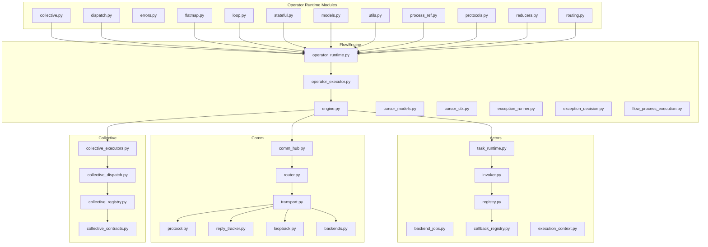
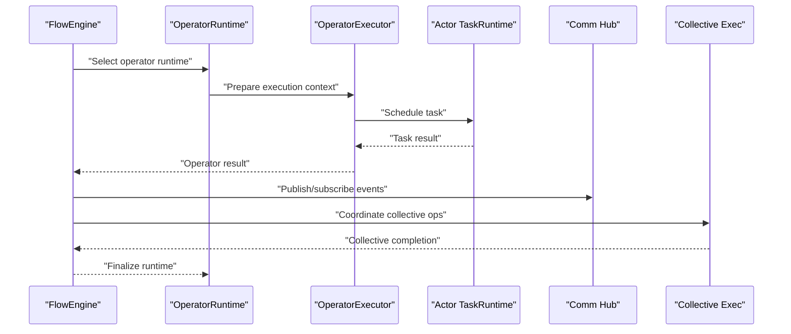
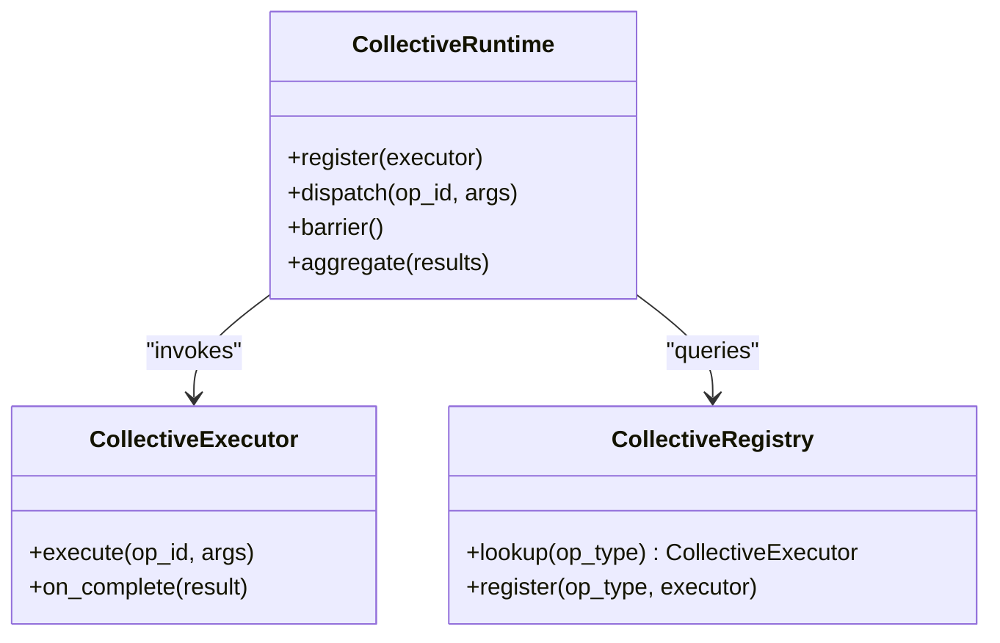
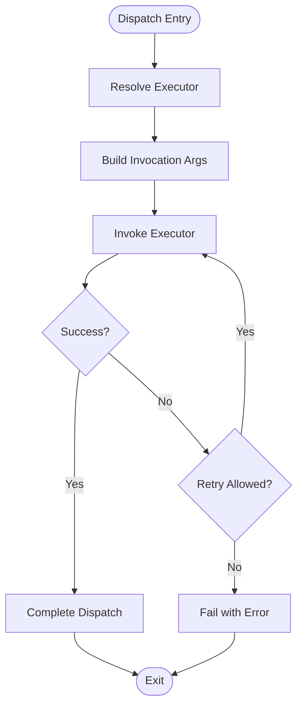
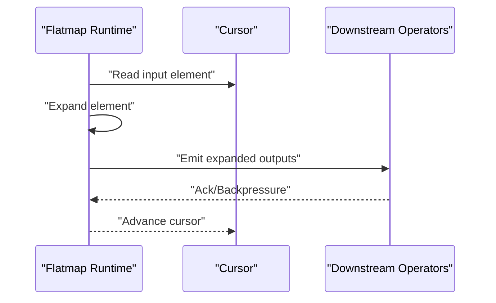
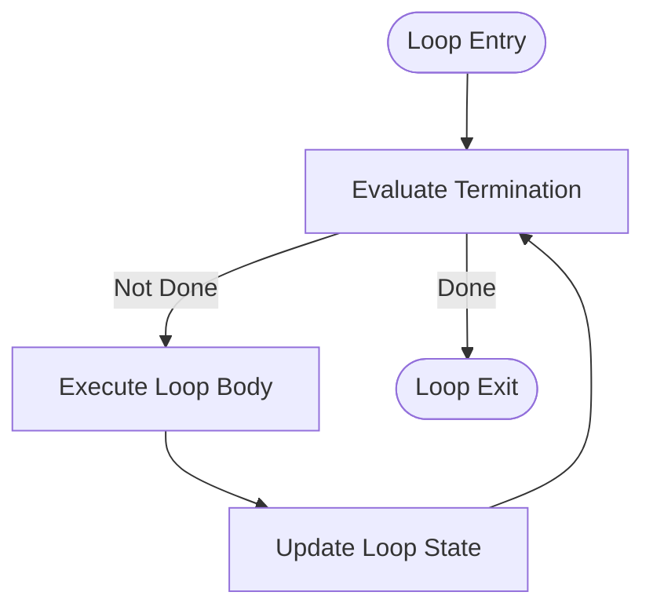
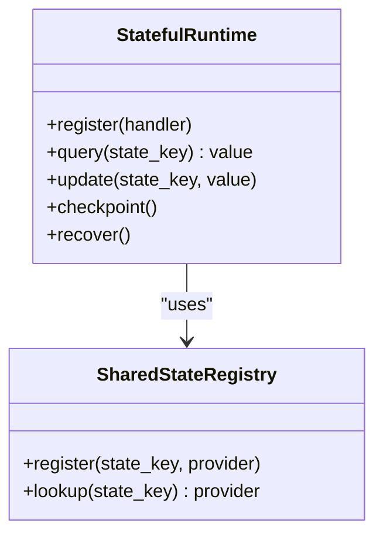
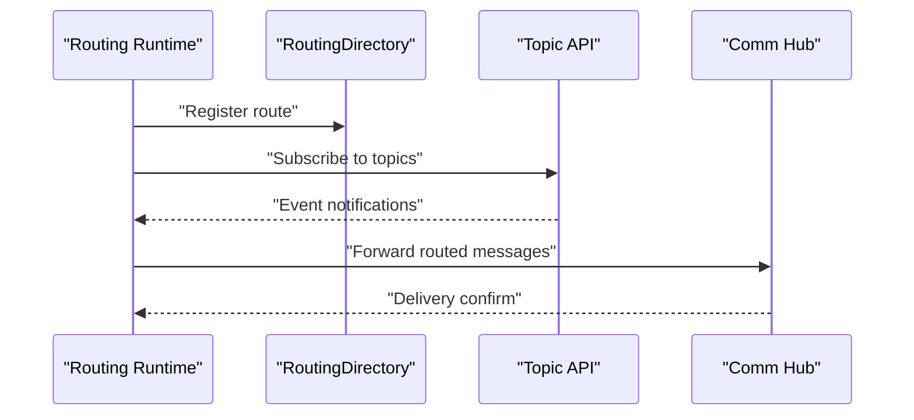
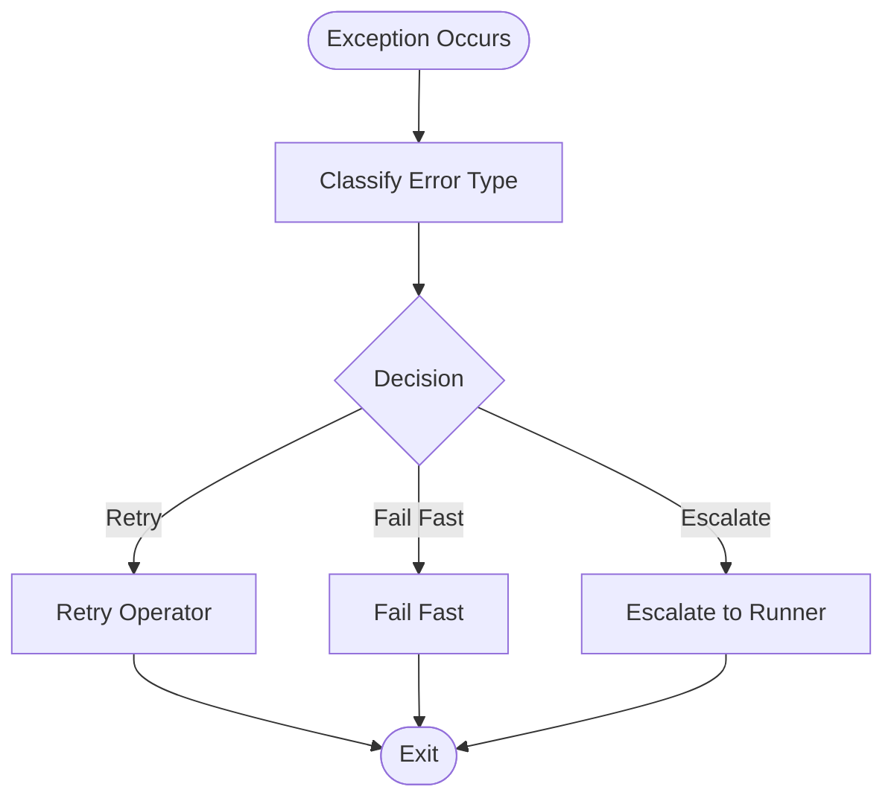
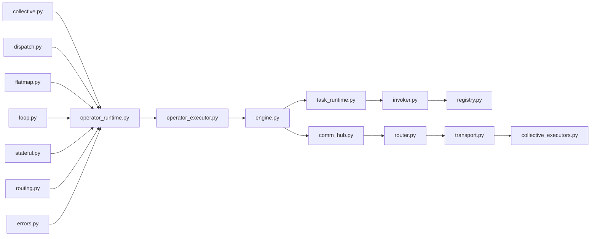

# Operator Runtime System

<cite>
**Referenced Files in This Document**
- [collective.py](file://src/sage/runtime/flownet/runtime/operator_runtime/collective.py)
- [dispatch.py](file://src/sage/runtime/flownet/runtime/operator_runtime/dispatch.py)
- [errors.py](file://src/sage/runtime/flownet/runtime/operator_runtime/errors.py)
- [flatmap.py](file://src/sage/runtime/flownet/runtime/operator_runtime/flatmap.py)
- [loop.py](file://src/sage/runtime/flownet/runtime/operator_runtime/loop.py)
- [models.py](file://src/sage/runtime/flownet/runtime/operator_runtime/models.py)
- [process_ref.py](file://src/sage/runtime/flownet/runtime/operator_runtime/process_ref.py)
- [protocols.py](file://src/sage/runtime/flownet/runtime/operator_runtime/protocols.py)
- [reducers.py](file://src/sage/runtime/flownet/runtime/operator_runtime/reducers.py)
- [routing.py](file://src/sage/runtime/flownet/runtime/operator_runtime/routing.py)
- [stateful.py](file://src/sage/runtime/flownet/runtime/operator_runtime/stateful.py)
- [utils.py](file://src/sage/runtime/flownet/runtime/operator_runtime/utils.py)
- [operator_runtime.py](file://src/sage/runtime/flownet/runtime/flowengine/operator_runtime.py)
- [operator_executor.py](file://src/sage/runtime/flownet/runtime/flowengine/operator_executor.py)
- [engine.py](file://src/sage/runtime/flownet/runtime/flowengine/engine.py)
- [cursor_models.py](file://src/sage/runtime/flownet/runtime/flowengine/cursor_models.py)
- [cursor_ctx.py](file://src/sage/runtime/flownet/runtime/flowengine/cursor_ctx.py)
- [exception_runner.py](file://src/sage/runtime/flownet/runtime/flowengine/exception_runner.py)
- [exception_decision.py](file://src/sage/runtime/flownet/runtime/flowengine/exception_decision.py)
- [flow_process_execution.py](file://src/sage/runtime/flownet/runtime/flowengine/flow_process_execution.py)
- [comm_bridge.py](file://src/sage/runtime/flownet/runtime/topics/comm_bridge.py)
- [control_dispatch.py](file://src/sage/runtime/flownet/runtime/topics/control_dispatch.py)
- [event_dispatch.py](file://src/sage/runtime/flownet/runtime/topics/event_dispatch.py)
- [routing_directory.py](file://src/sage/runtime/flownet/runtime/topics/routing_directory.py)
- [topic_api.py](file://src/sage/runtime/flownet/runtime/topics/topic_api.py)
- [backend_jobs.py](file://src/sage/runtime/flownet/runtime/actors/backend_jobs.py)
- [callback_registry.py](file://src/sage/runtime/flownet/runtime/actors/callback_registry.py)
- [execution_context.py](file://src/sage/runtime/flownet/runtime/actors/execution_context.py)
- [task_runtime.py](file://src/sage/runtime/flownet/runtime/actors/task_runtime.py)
- [invoker.py](file://src/sage/runtime/flownet/runtime/actors/invoker.py)
- [registry.py](file://src/sage/runtime/flownet/runtime/actors/registry.py)
- [comm_hub.py](file://src/sage/runtime/flownet/runtime/comm/hub.py)
- [router.py](file://src/sage/runtime/flownet/runtime/comm/router.py)
- [transport.py](file://src/sage/runtime/flownet/runtime/comm/transport.py)
- [protocol.py](file://src/sage/runtime/flownet/runtime/comm/protocol.py)
- [reply_tracker.py](file://src/sage/runtime/flownet/runtime/comm/reply_tracker.py)
- [loopback.py](file://src/sage/runtime/flownet/runtime/comm/loopback.py)
- [backends.py](file://src/sage/runtime/flownet/runtime/comm/backends.py)
- [collective_executors.py](file://src/sage/runtime/flownet/runtime/collective/executors.py)
- [collective_dispatch.py](file://src/sage/runtime/flownet/runtime/collective/dispatch.py)
- [collective_registry.py](file://src/sage/runtime/flownet/runtime/collective/registry.py)
- [collective_contracts.py](file://src/sage/runtime/flownet/runtime/collective/contracts.py)
- [flow_program.py](file://src/sage/runtime/flownet/core/flow_program.py)
- [flow_compiler.py](file://src/sage/runtime/flownet/compiler/flow_compiler.py)
- [streams.py](file://src/sage/runtime/flownet/compiler/streams.py)
- [targets.py](file://src/sage/runtime/flownet/compiler/targets.py)
- [transformation.py](file://src/sage/runtime/flownet/compiler/transformation.py)
- [flow_exception_handlers.py](file://src/sage/runtime/flownet/api/flow_exception_handlers.py)
- [runtime_client.py](file://src/sage/runtime/flownet/client/runtime_client.py)
- [session.py](file://src/sage/runtime/flownet/client/session.py)
- [node_runtime.py](file://src/sage/runtime/flownet/client/node_runtime.py)
- [handles.py](file://src/sage/runtime/flownet/client/handles.py)
- [inspect.py](file://src/sage/runtime/flownet/client/inspect.py)
- [dataset_job.py](file://src/sage/runtime/flownet/client/dataset_job.py)
- [cluster_context.py](file://src/sage/runtime/flownet/client/cluster_context.py)
- [bootstrap.py](file://src/sage/runtime/flownet/client/bootstrap.py)
- [endpoint_plane_contract.py](file://src/sage/runtime/flownet/contracts/endpoint_plane_contract.py)
- [flow_run_observation_contract.py](file://src/sage/runtime/flownet/contracts/flow_run_observation_contract.py)
- [runtime_state_query_contract.py](file://src/sage/runtime/flownet/contracts/runtime_state_query_contract.py)
- [runtime_telemetry_contract.py](file://src/sage/runtime/flownet/contracts/runtime_telemetry_contract.py)
- [shared_state_contract.py](file://src/sage/runtime/flownet/contracts/shared_state_contract.py)
- [flow_program_submit_contract.py](file://src/sage/runtime/flownet/contracts/flow_program_submit_contract.py)
- [recovery_contract.py](file://src/sage/runtime/flownet/contracts/recovery_contract.py)
- [runtime.py](file://src/sage/runtime/flownet/runtime/runtime.py)
- [loops.py](file://src/sage/runtime/flownet/runtime/loops.py)
- [governance.py](file://src/sage/runtime/flownet/runtime/governance.py)
- [shared_state_registry.py](file://src/sage/runtime/flownet/runtime/shared_state_registry.py)
- [endpoint_registry.py](file://src/sage/runtime/flownet/runtime/endpoint_registry.py)
- [base_environment.py](file://src/sage/runtime/flownet/base_environment.py)
- [environments.py](file://src/sage/runtime/flownet/environments.py)
- [batch_functions.py](file://src/sage/runtime/flownet/batch_functions.py)
- [context_injection.py](file://src/sage/runtime/flownet/context_injection.py)
- [scheduler.py](file://src/sage/runtime/flownet/scheduler.py)
- [job_manager.py](file://src/sage/runtime/flownet/job_manager.py)
- [service.py](file://src/sage/runtime/flownet/service.py)
- [service_factory.py](file://src/sage/runtime/flownet/service_factory.py)
- [flowengine_engine.py](file://src/sage/runtime/flownet/runtime/flowengine/engine.py)
</cite>

## Table of Contents
1. [Introduction](#introduction)
2. [Project Structure](#project-structure)
3. [Core Components](#core-components)
4. [Architecture Overview](#architecture-overview)
5. [Detailed Component Analysis](#detailed-component-analysis)
6. [Dependency Analysis](#dependency-analysis)
7. [Performance Considerations](#performance-considerations)
8. [Troubleshooting Guide](#troubleshooting-guide)
9. [Conclusion](#conclusion)
10. [Appendices](#appendices)

## Introduction
This document describes the Operator Runtime System that powers specialized execution environments for operators within SAGE’s FlowNet framework. The system optimizes execution for distinct operator patterns:
- Collective operations: coordinated multi-node or multi-process execution
- Dispatch strategies: routing and invocation of operator tasks
- Flatmap transformations: element-wise expansion and downstream propagation
- Loop processing: iterative or recursive operator behavior
- Stateful computations: persistent state across operator invocations

It explains how operator-specific runtimes integrate with the core FlowNet execution model, including error handling, state management, routing strategies, and utility functions. The content is structured for both beginners seeking conceptual understanding and advanced developers needing implementation and optimization details.

## Project Structure
The Operator Runtime System resides under the FlowNet runtime module and is composed of operator-specific runtime modules, shared models, protocols, and supporting utilities. It interacts with the FlowEngine, actors, communication subsystem, and collective execution infrastructure.

**Diagram sources**
- [collective.py](file://src/sage/runtime/flownet/runtime/operator_runtime/collective.py)
- [dispatch.py](file://src/sage/runtime/flownet/runtime/operator_runtime/dispatch.py)
- [flatmap.py](file://src/sage/runtime/flownet/runtime/operator_runtime/flatmap.py)
- [loop.py](file://src/sage/runtime/flownet/runtime/operator_runtime/loop.py)
- [stateful.py](file://src/sage/runtime/flownet/runtime/operator_runtime/stateful.py)
- [models.py](file://src/sage/runtime/flownet/runtime/operator_runtime/models.py)
- [utils.py](file://src/sage/runtime/flownet/runtime/operator_runtime/utils.py)
- [process_ref.py](file://src/sage/runtime/flownet/runtime/operator_runtime/process_ref.py)
- [protocols.py](file://src/sage/runtime/flownet/runtime/operator_runtime/protocols.py)
- [reducers.py](file://src/sage/runtime/flownet/runtime/operator_runtime/reducers.py)
- [routing.py](file://src/sage/runtime/flownet/runtime/operator_runtime/routing.py)
- [operator_runtime.py](file://src/sage/runtime/flownet/runtime/flowengine/operator_runtime.py)
- [operator_executor.py](file://src/sage/runtime/flownet/runtime/flowengine/operator_executor.py)
- [engine.py](file://src/sage/runtime/flownet/runtime/flowengine/engine.py)
- [cursor_models.py](file://src/sage/runtime/flownet/runtime/flowengine/cursor_models.py)
- [cursor_ctx.py](file://src/sage/runtime/flownet/runtime/flowengine/cursor_ctx.py)
- [exception_runner.py](file://src/sage/runtime/flownet/runtime/flowengine/exception_runner.py)
- [exception_decision.py](file://src/sage/runtime/flownet/runtime/flowengine/exception_decision.py)
- [flow_process_execution.py](file://src/sage/runtime/flownet/runtime/flowengine/flow_process_execution.py)
- [backend_jobs.py](file://src/sage/runtime/flownet/runtime/actors/backend_jobs.py)
- [callback_registry.py](file://src/sage/runtime/flownet/runtime/actors/callback_registry.py)
- [execution_context.py](file://src/sage/runtime/flownet/runtime/actors/execution_context.py)
- [task_runtime.py](file://src/sage/runtime/flownet/runtime/actors/task_runtime.py)
- [invoker.py](file://src/sage/runtime/flownet/runtime/actors/invoker.py)
- [registry.py](file://src/sage/runtime/flownet/runtime/actors/registry.py)
- [comm_hub.py](file://src/sage/runtime/flownet/runtime/comm/hub.py)
- [router.py](file://src/sage/runtime/flownet/runtime/comm/router.py)
- [transport.py](file://src/sage/runtime/flownet/runtime/comm/transport.py)
- [protocol.py](file://src/sage/runtime/flownet/runtime/comm/protocol.py)
- [reply_tracker.py](file://src/sage/runtime/flownet/runtime/comm/reply_tracker.py)
- [loopback.py](file://src/sage/runtime/flownet/runtime/comm/loopback.py)
- [backends.py](file://src/sage/runtime/flownet/runtime/comm/backends.py)
- [collective_executors.py](file://src/sage/runtime/flownet/runtime/collective/executors.py)
- [collective_dispatch.py](file://src/sage/runtime/flownet/runtime/collective/dispatch.py)
- [collective_registry.py](file://src/sage/runtime/flownet/runtime/collective/registry.py)
- [collective_contracts.py](file://src/sage/runtime/flownet/runtime/collective/contracts.py)

**Section sources**
- [operator_runtime.py](file://src/sage/runtime/flownet/runtime/flowengine/operator_runtime.py)
- [operator_executor.py](file://src/sage/runtime/flownet/runtime/flowengine/operator_executor.py)
- [engine.py](file://src/sage/runtime/flownet/runtime/flowengine/engine.py)

## Core Components
This section outlines the primary operator runtime modules and their roles:
- Collective runtime: orchestrates multi-participant operations across nodes/processes
- Dispatch runtime: routes and invokes operator tasks according to strategies
- Flatmap runtime: expands elements and propagates downstream
- Loop runtime: supports iterative or recursive operator behavior
- Stateful runtime: manages persistent state across invocations
- Routing runtime: resolves operator routing and topic subscriptions
- Reducers and utilities: provide reduction primitives and shared helpers
- Models and protocols: define runtime data structures and inter-module contracts

These components collaborate with the FlowEngine to execute operators efficiently while preserving correctness, fault tolerance, and observability.

**Section sources**
- [collective.py](file://src/sage/runtime/flownet/runtime/operator_runtime/collective.py)
- [dispatch.py](file://src/sage/runtime/flownet/runtime/operator_runtime/dispatch.py)
- [flatmap.py](file://src/sage/runtime/flownet/runtime/operator_runtime/flatmap.py)
- [loop.py](file://src/sage/runtime/flownet/runtime/operator_runtime/loop.py)
- [stateful.py](file://src/sage/runtime/flownet/runtime/operator_runtime/stateful.py)
- [routing.py](file://src/sage/runtime/flownet/runtime/operator_runtime/routing.py)
- [reducers.py](file://src/sage/runtime/flownet/runtime/operator_runtime/reducers.py)
- [utils.py](file://src/sage/runtime/flownet/runtime/operator_runtime/utils.py)
- [models.py](file://src/sage/runtime/flownet/runtime/operator_runtime/models.py)
- [protocols.py](file://src/sage/runtime/flownet/runtime/operator_runtime/protocols.py)

## Architecture Overview
The Operator Runtime System integrates with the FlowEngine and runtime infrastructure to execute operators. The FlowEngine coordinates operator execution, manages cursors, and delegates to operator-specific runtimes. Actors handle task execution and callbacks, while the communication layer routes messages and maintains reliability. Collective execution extends coordination to multi-participant scenarios.

**Diagram sources**
- [operator_runtime.py](file://src/sage/runtime/flownet/runtime/flowengine/operator_runtime.py)
- [operator_executor.py](file://src/sage/runtime/flownet/runtime/flowengine/operator_executor.py)
- [engine.py](file://src/sage/runtime/flownet/runtime/flowengine/engine.py)
- [task_runtime.py](file://src/sage/runtime/flownet/runtime/actors/task_runtime.py)
- [comm_hub.py](file://src/sage/runtime/flownet/runtime/comm/hub.py)
- [collective_executors.py](file://src/sage/runtime/flownet/runtime/collective/executors.py)

## Detailed Component Analysis

### Collective Operation Runtime
Purpose:
- Provides specialized execution for operators requiring coordinated participation across multiple ranks/nodes
- Manages collective lifecycle, synchronization, and result aggregation

Key responsibilities:
- Registration and lookup of collective executors
- Dispatch coordination and barrier synchronization
- Error propagation and recovery within collective contexts
- Integration with FlowNet runtime for state and telemetry

**Diagram sources**
- [collective.py](file://src/sage/runtime/flownet/runtime/operator_runtime/collective.py)
- [collective_executors.py](file://src/sage/runtime/flownet/runtime/collective/executors.py)
- [collective_registry.py](file://src/sage/runtime/flownet/runtime/collective/registry.py)

**Section sources**
- [collective.py](file://src/sage/runtime/flownet/runtime/operator_runtime/collective.py)
- [collective_dispatch.py](file://src/sage/runtime/flownet/runtime/collective/dispatch.py)
- [collective_executors.py](file://src/sage/runtime/flownet/runtime/collective/executors.py)
- [collective_registry.py](file://src/sage/runtime/flownet/runtime/collective/registry.py)
- [collective_contracts.py](file://src/sage/runtime/flownet/runtime/collective/contracts.py)

### Dispatch Mechanisms
Purpose:
- Routes operator invocations to appropriate executors based on operator type and runtime context
- Supports dynamic dispatch strategies and fallback mechanisms

Key responsibilities:
- Resolve operator executor from registry
- Build invocation arguments and context
- Handle dispatch failures and retries
- Integrate with FlowEngine for cursor and state management

**Diagram sources**
- [dispatch.py](file://src/sage/runtime/flownet/runtime/operator_runtime/dispatch.py)
- [operator_executor.py](file://src/sage/runtime/flownet/runtime/flowengine/operator_executor.py)

**Section sources**
- [dispatch.py](file://src/sage/runtime/flownet/runtime/operator_runtime/dispatch.py)
- [operator_executor.py](file://src/sage/runtime/flownet/runtime/flowengine/operator_executor.py)
- [operator_runtime.py](file://src/sage/runtime/flownet/runtime/flowengine/operator_runtime.py)

### Flatmap Execution
Purpose:
- Expands input elements into multiple outputs and forwards them downstream
- Optimizes element-wise transformations with minimal overhead

Key responsibilities:
- Expand input elements into tuples or lists
- Propagate expanded outputs to downstream operators
- Maintain ordering and backpressure semantics
- Integrate with FlowEngine cursors for streaming

**Diagram sources**
- [flatmap.py](file://src/sage/runtime/flownet/runtime/operator_runtime/flatmap.py)
- [cursor_models.py](file://src/sage/runtime/flownet/runtime/flowengine/cursor_models.py)
- [cursor_ctx.py](file://src/sage/runtime/flownet/runtime/flowengine/cursor_ctx.py)

**Section sources**
- [flatmap.py](file://src/sage/runtime/flownet/runtime/operator_runtime/flatmap.py)
- [cursor_models.py](file://src/sage/runtime/flownet/runtime/flowengine/cursor_models.py)
- [cursor_ctx.py](file://src/sage/runtime/flownet/runtime/flowengine/cursor_ctx.py)

### Loop Processing
Purpose:
- Enables iterative or recursive operator behavior with loop control and termination conditions
- Manages loop state and ensures correct continuation semantics

Key responsibilities:
- Track loop iterations and state
- Evaluate termination conditions
- Coordinate loop body execution
- Handle loop-specific exceptions and recovery

**Diagram sources**
- [loop.py](file://src/sage/runtime/flownet/runtime/operator_runtime/loop.py)
- [loop_ctx.py](file://src/sage/runtime/flownet/runtime/flowengine/loop_ctx.py)

**Section sources**
- [loop.py](file://src/sage/runtime/flownet/runtime/operator_runtime/loop.py)
- [flow_process_execution.py](file://src/sage/runtime/flownet/runtime/flowengine/flow_process_execution.py)

### Stateful Operator Support
Purpose:
- Maintains persistent state across operator invocations
- Provides state queries, updates, and recovery mechanisms

Key responsibilities:
- Register stateful operator handlers
- Manage state snapshots and restoration
- Enforce state consistency and isolation
- Integrate with shared state registry and contracts

**Diagram sources**
- [stateful.py](file://src/sage/runtime/flownet/runtime/operator_runtime/stateful.py)
- [shared_state_registry.py](file://src/sage/runtime/flownet/runtime/shared_state_registry.py)
- [shared_state_contract.py](file://src/sage/runtime/flownet/contracts/shared_state_contract.py)

**Section sources**
- [stateful.py](file://src/sage/runtime/flownet/runtime/operator_runtime/stateful.py)
- [shared_state_registry.py](file://src/sage/runtime/flownet/runtime/shared_state_registry.py)
- [shared_state_contract.py](file://src/sage/runtime/flownet/contracts/shared_state_contract.py)

### Routing Strategies
Purpose:
- Resolves operator routing and topic subscriptions for event-driven execution
- Ensures reliable delivery and subscription management

Key responsibilities:
- Maintain routing directory entries
- Subscribe/unsubscribe topics
- Route control and event messages
- Integrate with Comm Hub and Transport

**Diagram sources**
- [routing.py](file://src/sage/runtime/flownet/runtime/operator_runtime/routing.py)
- [routing_directory.py](file://src/sage/runtime/flownet/runtime/topics/routing_directory.py)
- [topic_api.py](file://src/sage/runtime/flownet/runtime/topics/topic_api.py)
- [comm_hub.py](file://src/sage/runtime/flownet/runtime/comm/hub.py)

**Section sources**
- [routing.py](file://src/sage/runtime/flownet/runtime/operator_runtime/routing.py)
- [routing_directory.py](file://src/sage/runtime/flownet/runtime/topics/routing_directory.py)
- [topic_api.py](file://src/sage/runtime/flownet/runtime/topics/topic_api.py)
- [comm_hub.py](file://src/sage/runtime/flownet/runtime/comm/hub.py)

### Error Handling and Exception Management
Purpose:
- Centralizes error propagation and recovery decisions for operators
- Integrates with FlowNet exception runners and decisions

Key responsibilities:
- Categorize and propagate exceptions
- Decide retry, fail-fast, or escalate policies
- Coordinate with FlowEngine exception runner
- Maintain error context and diagnostics

**Diagram sources**
- [errors.py](file://src/sage/runtime/flownet/runtime/operator_runtime/errors.py)
- [exception_runner.py](file://src/sage/runtime/flownet/runtime/flowengine/exception_runner.py)
- [exception_decision.py](file://src/sage/runtime/flownet/runtime/flowengine/exception_decision.py)

**Section sources**
- [errors.py](file://src/sage/runtime/flownet/runtime/operator_runtime/errors.py)
- [exception_runner.py](file://src/sage/runtime/flownet/runtime/flowengine/exception_runner.py)
- [exception_decision.py](file://src/sage/runtime/flownet/runtime/flowengine/exception_decision.py)

### Utility Functions and Models
Purpose:
- Provide shared data models, process references, and utility functions used across operator runtimes
- Standardize runtime interfaces and reduce duplication

Key responsibilities:
- Define runtime models and enums
- Provide process reference utilities
- Offer helper functions for common runtime tasks

**Section sources**
- [models.py](file://src/sage/runtime/flownet/runtime/operator_runtime/models.py)
- [process_ref.py](file://src/sage/runtime/flownet/runtime/operator_runtime/process_ref.py)
- [utils.py](file://src/sage/runtime/flownet/runtime/operator_runtime/utils.py)
- [protocols.py](file://src/sage/runtime/flownet/runtime/operator_runtime/protocols.py)
- [reducers.py](file://src/sage/runtime/flownet/runtime/operator_runtime/reducers.py)

## Dependency Analysis
The Operator Runtime System exhibits strong cohesion within each runtime module and moderate coupling to the FlowEngine, actors, and communication layers. Dependencies are primarily unidirectional, flowing from runtime modules toward execution and infrastructure components.

**Diagram sources**
- [collective.py](file://src/sage/runtime/flownet/runtime/operator_runtime/collective.py)
- [dispatch.py](file://src/sage/runtime/flownet/runtime/operator_runtime/dispatch.py)
- [flatmap.py](file://src/sage/runtime/flownet/runtime/operator_runtime/flatmap.py)
- [loop.py](file://src/sage/runtime/flownet/runtime/operator_runtime/loop.py)
- [stateful.py](file://src/sage/runtime/flownet/runtime/operator_runtime/stateful.py)
- [routing.py](file://src/sage/runtime/flownet/runtime/operator_runtime/routing.py)
- [errors.py](file://src/sage/runtime/flownet/runtime/operator_runtime/errors.py)
- [operator_runtime.py](file://src/sage/runtime/flownet/runtime/flowengine/operator_runtime.py)
- [operator_executor.py](file://src/sage/runtime/flownet/runtime/flowengine/operator_executor.py)
- [engine.py](file://src/sage/runtime/flownet/runtime/flowengine/engine.py)
- [task_runtime.py](file://src/sage/runtime/flownet/runtime/actors/task_runtime.py)
- [invoker.py](file://src/sage/runtime/flownet/runtime/actors/invoker.py)
- [registry.py](file://src/sage/runtime/flownet/runtime/actors/registry.py)
- [comm_hub.py](file://src/sage/runtime/flownet/runtime/comm/hub.py)
- [router.py](file://src/sage/runtime/flownet/runtime/comm/router.py)
- [transport.py](file://src/sage/runtime/flownet/runtime/comm/transport.py)
- [collective_executors.py](file://src/sage/runtime/flownet/runtime/collective/executors.py)

**Section sources**
- [operator_runtime.py](file://src/sage/runtime/flownet/runtime/flowengine/operator_runtime.py)
- [engine.py](file://src/sage/runtime/flownet/runtime/flowengine/engine.py)

## Performance Considerations
- Minimize cross-process serialization by leveraging in-memory data structures where possible
- Batch downstream emissions in flatmap to reduce scheduling overhead
- Use barriers judiciously in collective operations to avoid contention
- Employ backpressure-aware routing to prevent downstream saturation
- Cache frequently accessed runtime models and process references
- Prefer stateless operators when feasible to reduce checkpoint overhead

[No sources needed since this section provides general guidance]

## Troubleshooting Guide
Common issues and resolutions:
- Dispatch failures: Verify executor registration and invocation arguments; check retry policy and error classification
- Flatmap throughput bottlenecks: Inspect downstream backpressure and emission batching
- Loop termination anomalies: Validate loop state updates and termination conditions
- State recovery inconsistencies: Confirm checkpoint intervals and shared state provider health
- Routing delivery failures: Review topic subscriptions and Comm Hub connectivity
- Collective timeouts: Investigate barrier synchronization and participant liveness

**Section sources**
- [errors.py](file://src/sage/runtime/flownet/runtime/operator_runtime/errors.py)
- [exception_runner.py](file://src/sage/runtime/flownet/runtime/flowengine/exception_runner.py)
- [exception_decision.py](file://src/sage/runtime/flownet/runtime/flowengine/exception_decision.py)
- [routing.py](file://src/sage/runtime/flownet/runtime/operator_runtime/routing.py)
- [stateful.py](file://src/sage/runtime/flownet/runtime/operator_runtime/stateful.py)
- [flatmap.py](file://src/sage/runtime/flownet/runtime/operator_runtime/flatmap.py)
- [loop.py](file://src/sage/runtime/flownet/runtime/operator_runtime/loop.py)

## Conclusion
The Operator Runtime System provides specialized, optimized execution environments tailored to FlowNet operator patterns. By separating concerns across collective, dispatch, flatmap, loop, stateful, and routing runtimes, the system achieves modularity, maintainability, and performance. Its integration with the FlowEngine, actors, and communication infrastructure ensures robust, scalable operator execution with strong error handling and state management capabilities.

[No sources needed since this section summarizes without analyzing specific files]

## Appendices

### Practical Examples
- Specialized operator execution: Use the collective runtime to coordinate multi-rank reductions; leverage dispatch to select the appropriate executor per operator type
- Stateful computation patterns: Implement stateful operators with periodic checkpoints and recovery routines; register state providers with the shared state registry
- Performance optimization techniques: Batch emissions in flatmap, minimize barrier usage in collective operations, and apply backpressure-aware routing

[No sources needed since this section provides general guidance]