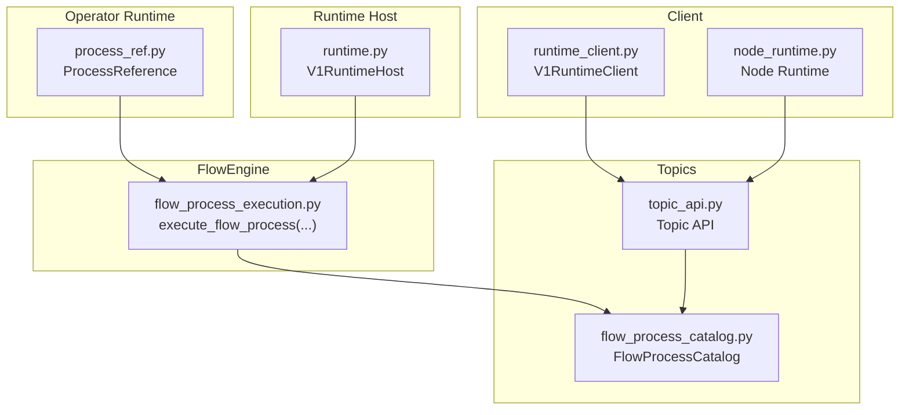
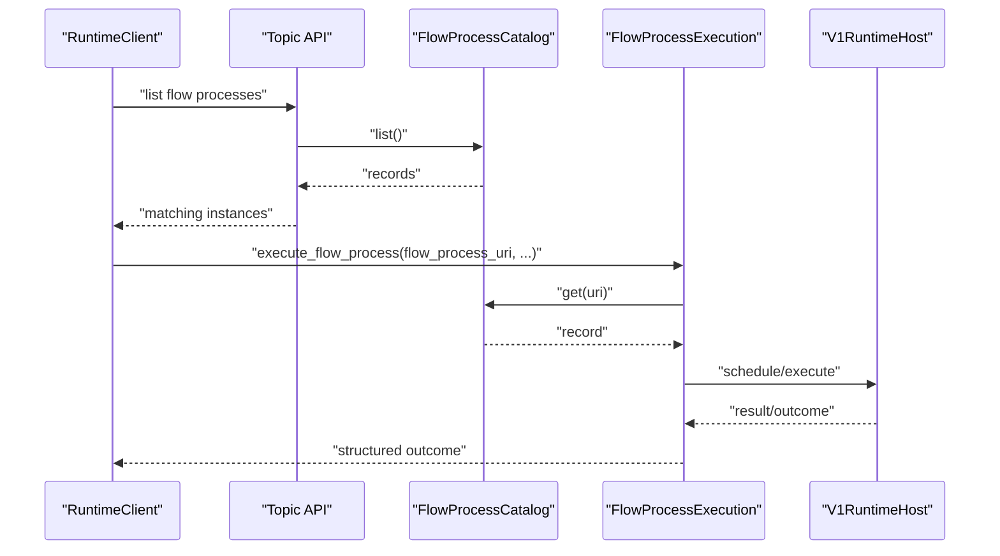
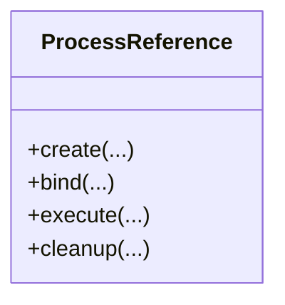
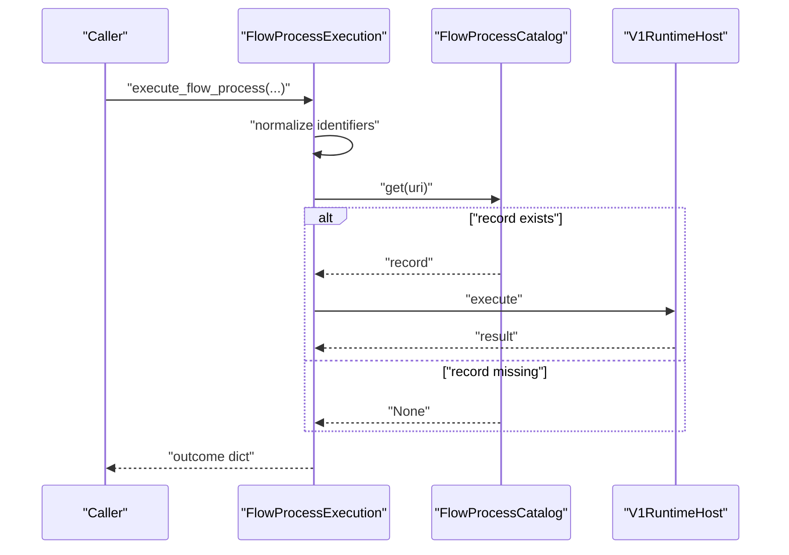
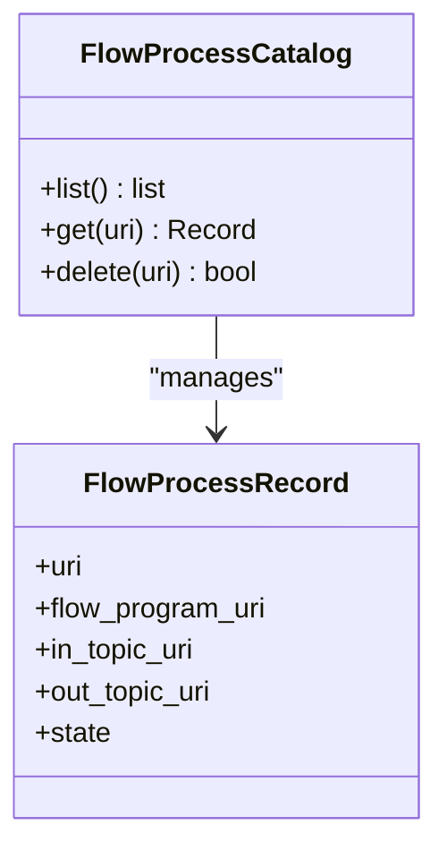
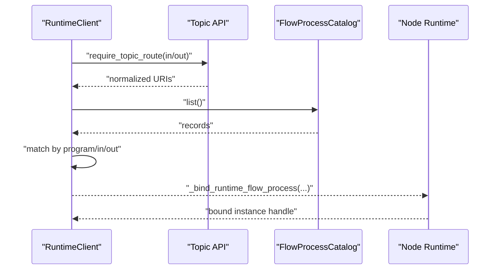
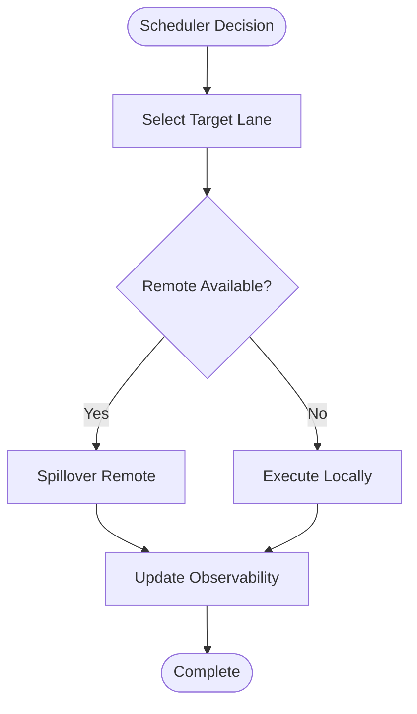
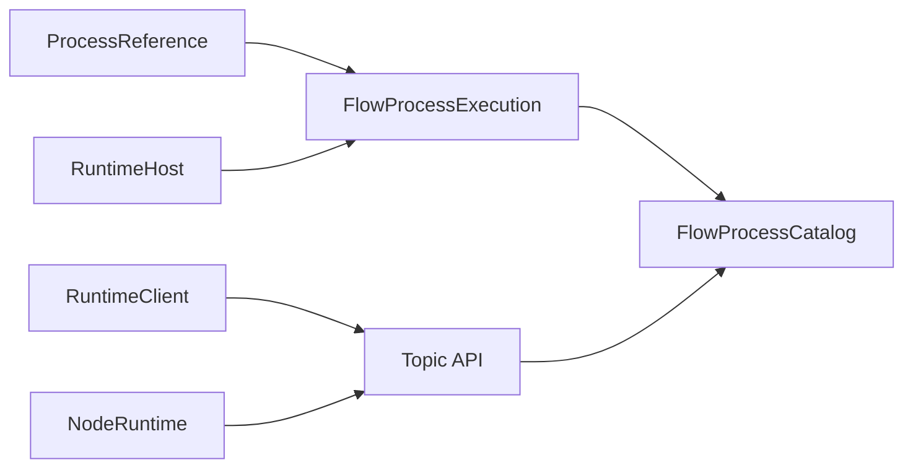

# Process Reference Management

<cite>
**Referenced Files in This Document**
- [process_ref.py](file://src/sage/runtime/flownet/runtime/operator_runtime/process_ref.py)
- [flow_process_execution.py](file://src/sage/runtime/flownet/runtime/flowengine/flow_process_execution.py)
- [flow_process_catalog.py](file://src/sage/runtime/flownet/runtime/topics/flow_process_catalog.py)
- [runtime_client.py](file://src/sage/runtime/flownet/client/runtime_client.py)
- [node_runtime.py](file://src/sage/runtime/flownet/client/node_runtime.py)
- [runtime.py](file://src/sage/runtime/flownet/runtime/runtime.py)
- [flow_program.py](file://src/sage/runtime/flownet/core/flow_program.py)
- [topic_api.py](file://src/sage/runtime/flownet/runtime/topics/topic_api.py)
</cite>

## Table of Contents
1. [Introduction](#introduction)
2. [Project Structure](#project-structure)
3. [Core Components](#core-components)
4. [Architecture Overview](#architecture-overview)
5. [Detailed Component Analysis](#detailed-component-analysis)
6. [Dependency Analysis](#dependency-analysis)
7. [Performance Considerations](#performance-considerations)
8. [Troubleshooting Guide](#troubleshooting-guide)
9. [Conclusion](#conclusion)

## Introduction
This document describes Process Reference Management within SAGE’s FlowNet runtime. It explains how the process reference runtime system creates, coordinates, and cleans up operator processes in a distributed execution environment. It documents process reference patterns, lifecycle management, resource allocation strategies, coordination mechanisms, and cleanup procedures. Practical examples illustrate lifecycle orchestration, cross-node coordination, and performance optimization techniques. Best practices and debugging approaches for process-related issues are included.

## Project Structure
The FlowNet runtime organizes process reference management around:
- Operator runtime operator execution and process reference abstractions
- Flow process execution engine that resolves and executes process instances
- Topic API and FlowProcessCatalog for process metadata and discovery
- Runtime client and node runtime for lifecycle operations and observability
- Runtime host for scheduling, executor lanes, and process factory integration

**Diagram sources**
- [process_ref.py](file://src/sage/runtime/flownet/runtime/operator_runtime/process_ref.py)
- [flow_process_execution.py](file://src/sage/runtime/flownet/runtime/flowengine/flow_process_execution.py)
- [flow_process_catalog.py](file://src/sage/runtime/flownet/runtime/topics/flow_process_catalog.py)
- [runtime_client.py](file://src/sage/runtime/flownet/client/runtime_client.py)
- [node_runtime.py](file://src/sage/runtime/flownet/client/node_runtime.py)
- [runtime.py](file://src/sage/runtime/flownet/runtime/runtime.py)
- [topic_api.py](file://src/sage/runtime/flownet/runtime/topics/topic_api.py)

**Section sources**
- [process_ref.py](file://src/sage/runtime/flownet/runtime/operator_runtime/process_ref.py)
- [flow_process_execution.py](file://src/sage/runtime/flownet/runtime/flowengine/flow_process_execution.py)
- [flow_process_catalog.py](file://src/sage/runtime/flownet/runtime/topics/flow_process_catalog.py)
- [runtime_client.py](file://src/sage/runtime/flownet/client/runtime_client.py)
- [node_runtime.py](file://src/sage/runtime/flownet/client/node_runtime.py)
- [runtime.py](file://src/sage/runtime/flownet/runtime/runtime.py)
- [topic_api.py](file://src/sage/runtime/flownet/runtime/topics/topic_api.py)

## Core Components
- ProcessReference (operator runtime): Defines process reference patterns and lifecycle primitives for operator processes. It encapsulates creation, coordination, and cleanup of process instances within FlowNet.
- FlowProcessExecution: Resolves and executes flow processes by consulting the FlowProcessCatalog and returning structured outcomes and telemetry.
- FlowProcessCatalog: Provides metadata and lifecycle state for flow processes, enabling discovery and binding of process instances.
- RuntimeClient and NodeRuntime: Offer lifecycle operations (start, stop, list, delete) and observability for flow processes, integrating with the runtime host.
- RuntimeHost: Manages scheduling, executor lanes, and process factory integration, exposing scheduler observability and process factory summaries.

**Section sources**
- [process_ref.py](file://src/sage/runtime/flownet/runtime/operator_runtime/process_ref.py)
- [flow_process_execution.py](file://src/sage/runtime/flownet/runtime/flowengine/flow_process_execution.py)
- [flow_process_catalog.py](file://src/sage/runtime/flownet/runtime/topics/flow_process_catalog.py)
- [runtime_client.py](file://src/sage/runtime/flownet/client/runtime_client.py)
- [node_runtime.py](file://src/sage/runtime/flownet/client/node_runtime.py)
- [runtime.py](file://src/sage/runtime/flownet/runtime/runtime.py)

## Architecture Overview
The process reference runtime integrates operator execution with the FlowNet runtime to manage process lifecycle across nodes. The flow process execution engine resolves process URIs via the FlowProcessCatalog, while the runtime client and node runtime expose lifecycle operations and observability. The runtime host coordinates scheduling and executor resources.

**Diagram sources**
- [runtime_client.py](file://src/sage/runtime/flownet/client/runtime_client.py)
- [flow_process_execution.py](file://src/sage/runtime/flownet/runtime/flowengine/flow_process_execution.py)
- [flow_process_catalog.py](file://src/sage/runtime/flownet/runtime/topics/flow_process_catalog.py)
- [runtime.py](file://src/sage/runtime/flownet/runtime/runtime.py)

## Detailed Component Analysis

### ProcessReference (Operator Runtime)
ProcessReference defines the abstraction for managing operator process lifecycle. It supports:
- Creation and binding of process instances
- Coordination across nodes using topic routing and flow process catalogs
- Cleanup and termination routines aligned with runtime lifecycle

Implementation highlights:
- Encapsulates process creation and lifecycle transitions
- Integrates with topic routing and catalog resolution
- Coordinates cleanup and resource deallocation

**Diagram sources**
- [process_ref.py](file://src/sage/runtime/flownet/runtime/operator_runtime/process_ref.py)

**Section sources**
- [process_ref.py](file://src/sage/runtime/flownet/runtime/operator_runtime/process_ref.py)

### FlowProcessExecution
The flow process execution engine resolves a process by URI and returns a structured outcome, including status, error metadata, and telemetry. It consults the FlowProcessCatalog to fetch the process record and orchestrates execution through the runtime host.

Key behaviors:
- Normalize input identifiers (URI, event group ID)
- Resolve process record from FlowProcessCatalog
- Return standardized outcome with error stage and metadata
- Integrate with runtime host for scheduling and execution

**Diagram sources**
- [flow_process_execution.py](file://src/sage/runtime/flownet/runtime/flowengine/flow_process_execution.py)
- [flow_process_catalog.py](file://src/sage/runtime/flownet/runtime/topics/flow_process_catalog.py)
- [runtime.py](file://src/sage/runtime/flownet/runtime/runtime.py)

**Section sources**
- [flow_process_execution.py](file://src/sage/runtime/flownet/runtime/flowengine/flow_process_execution.py)
- [flow_process_catalog.py](file://src/sage/runtime/flownet/runtime/topics/flow_process_catalog.py)
- [runtime.py](file://src/sage/runtime/flownet/runtime/runtime.py)

### FlowProcessCatalog
FlowProcessCatalog provides metadata and lifecycle state for flow processes. It supports listing and retrieving process records, enabling clients to discover and bind active processes.

Key capabilities:
- List active flow processes
- Retrieve a specific process record by URI
- Support deletion of process records

**Diagram sources**
- [flow_process_catalog.py](file://src/sage/runtime/flownet/runtime/topics/flow_process_catalog.py)

**Section sources**
- [flow_process_catalog.py](file://src/sage/runtime/flownet/runtime/topics/flow_process_catalog.py)

### RuntimeClient and NodeRuntime Lifecycle Operations
RuntimeClient and NodeRuntime expose lifecycle operations for flow processes:
- Listing existing flow processes bound to specific topics
- Binding and resolving active instances
- Deleting flow processes
- Observability snapshots for scheduler and process factory metrics

Integration points:
- Access to Topic API and FlowProcessCatalog
- Interaction with runtime host for scheduling and execution
- Snapshot and summary utilities for diagnostics

**Diagram sources**
- [runtime_client.py](file://src/sage/runtime/flownet/client/runtime_client.py)
- [node_runtime.py](file://src/sage/runtime/flownet/client/node_runtime.py)
- [flow_process_catalog.py](file://src/sage/runtime/flownet/runtime/topics/flow_process_catalog.py)
- [topic_api.py](file://src/sage/runtime/flownet/runtime/topics/topic_api.py)

**Section sources**
- [runtime_client.py](file://src/sage/runtime/flownet/client/runtime_client.py)
- [node_runtime.py](file://src/sage/runtime/flownet/client/node_runtime.py)
- [flow_process_catalog.py](file://src/sage/runtime/flownet/runtime/topics/flow_process_catalog.py)
- [topic_api.py](file://src/sage/runtime/flownet/runtime/topics/topic_api.py)

### RuntimeHost Scheduler and Process Factory Integration
The runtime host manages scheduling and executor lanes, and exposes observability for scheduler decisions and process factory usage. It integrates with the flow process execution engine to execute resolved processes.

Highlights:
- Executor lanes for CPU-bound workloads
- Scheduler observability counters (selection total, fallback count, spillover metrics)
- Process factory summaries and fallback tracking
- Integration with actor API and runtime host lifecycle

**Diagram sources**
- [runtime.py](file://src/sage/runtime/flownet/runtime/runtime.py)

**Section sources**
- [runtime.py](file://src/sage/runtime/flownet/runtime/runtime.py)

## Dependency Analysis
The process reference runtime depends on:
- Operator runtime process reference abstractions
- Flow process execution engine and FlowProcessCatalog
- Topic API for routing and discovery
- Runtime client and node runtime for lifecycle operations
- Runtime host for scheduling and executor resources

**Diagram sources**
- [process_ref.py](file://src/sage/runtime/flownet/runtime/operator_runtime/process_ref.py)
- [flow_process_execution.py](file://src/sage/runtime/flownet/runtime/flowengine/flow_process_execution.py)
- [flow_process_catalog.py](file://src/sage/runtime/flownet/runtime/topics/flow_process_catalog.py)
- [runtime_client.py](file://src/sage/runtime/flownet/client/runtime_client.py)
- [node_runtime.py](file://src/sage/runtime/flownet/client/node_runtime.py)
- [runtime.py](file://src/sage/runtime/flownet/runtime/runtime.py)
- [topic_api.py](file://src/sage/runtime/flownet/runtime/topics/topic_api.py)

**Section sources**
- [process_ref.py](file://src/sage/runtime/flownet/runtime/operator_runtime/process_ref.py)
- [flow_process_execution.py](file://src/sage/runtime/flownet/runtime/flowengine/flow_process_execution.py)
- [flow_process_catalog.py](file://src/sage/runtime/flownet/runtime/topics/flow_process_catalog.py)
- [runtime_client.py](file://src/sage/runtime/flownet/client/runtime_client.py)
- [node_runtime.py](file://src/sage/runtime/flownet/client/node_runtime.py)
- [runtime.py](file://src/sage/runtime/flownet/runtime/runtime.py)
- [topic_api.py](file://src/sage/runtime/flownet/runtime/topics/topic_api.py)

## Performance Considerations
- Minimize repeated catalog lookups by caching normalized URIs and process records locally when safe.
- Prefer batching lifecycle operations (list, delete) to reduce network overhead across nodes.
- Tune executor lanes and scheduler fallback thresholds to balance load and reduce spillover.
- Use observability snapshots to identify hotspots and adjust scheduling policies.
- Avoid blocking operations in process creation; defer heavy initialization to lazy startup within the runtime host.

## Troubleshooting Guide
Common issues and remedies:
- Missing flow process record: Verify the process URI and ensure the FlowProcessCatalog contains the record. Check topic routing normalization and program binding.
- Execution failures: Inspect the outcome error stage and metadata returned by the flow process execution engine. Use runtime host observability counters to detect scheduler fallbacks or spillover issues.
- Lifecycle mismatches: Confirm that runtime client and node runtime bindings align with the intended in/out topics. Use listing APIs to enumerate active instances and validate bindings.
- Cleanup anomalies: Ensure cleanup routines are invoked after execution completion and that process factory summaries reflect expected usage.

Operational checks:
- Validate topic route normalization and existence before invoking lifecycle operations.
- Review scheduler observability counters to detect excessive fallbacks or remote spillovers.
- Confirm runtime host executor lanes configuration matches workload characteristics.

**Section sources**
- [flow_process_execution.py](file://src/sage/runtime/flownet/runtime/flowengine/flow_process_execution.py)
- [runtime_client.py](file://src/sage/runtime/flownet/client/runtime_client.py)
- [node_runtime.py](file://src/sage/runtime/flownet/client/node_runtime.py)
- [runtime.py](file://src/sage/runtime/flownet/runtime/runtime.py)

## Conclusion
Process Reference Management in SAGE’s FlowNet runtime provides a robust framework for operator process lifecycle management in distributed environments. Through ProcessReference, FlowProcessExecution, FlowProcessCatalog, and the runtime client/node runtime integration, the system enables reliable creation, coordination, and cleanup of processes. By leveraging scheduler observability, lifecycle APIs, and structured outcomes, teams can optimize performance, maintain reliability, and debug issues effectively across nodes.