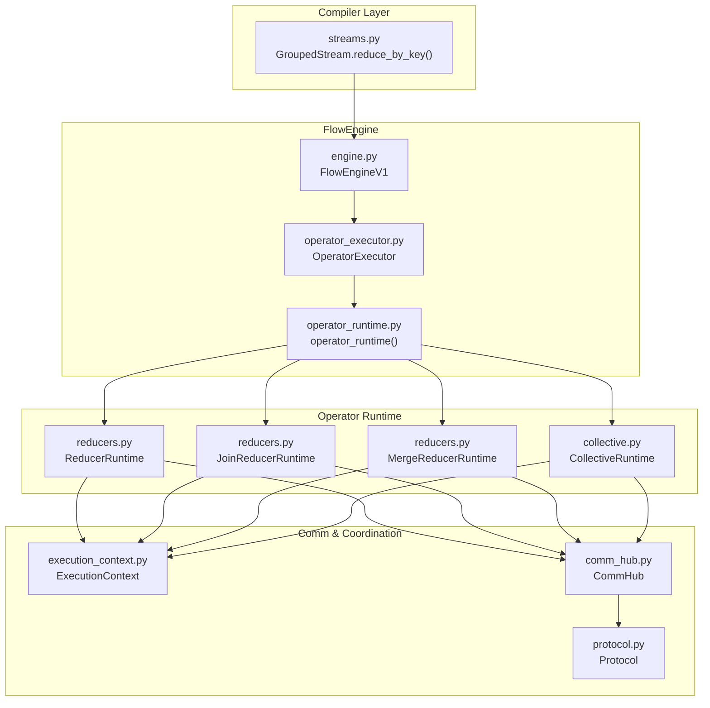
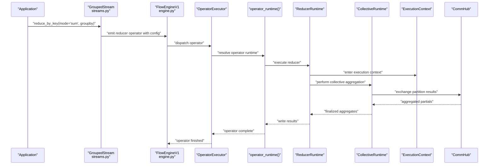
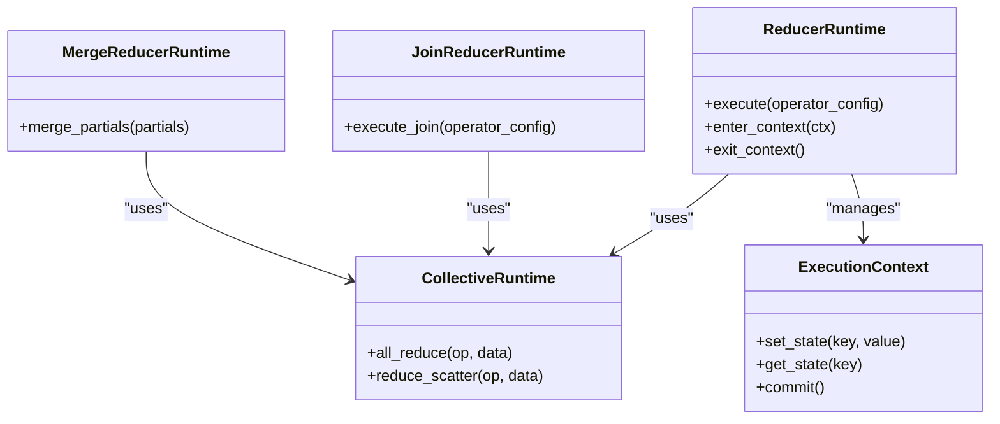
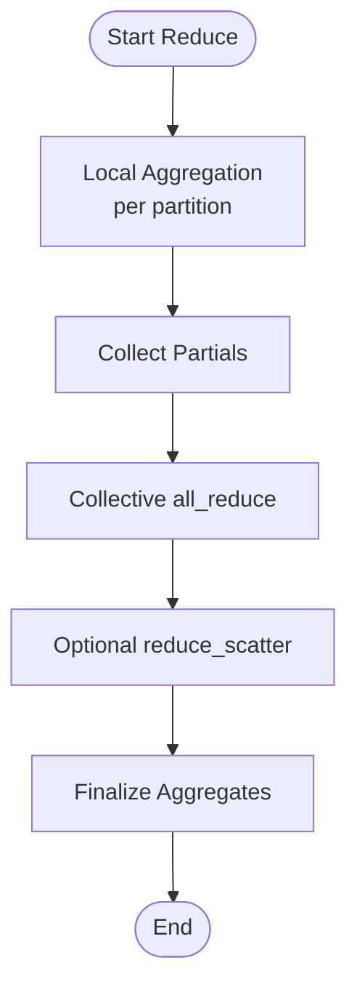
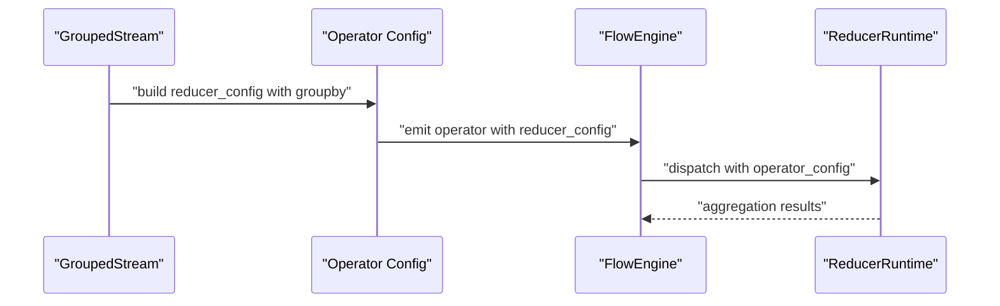
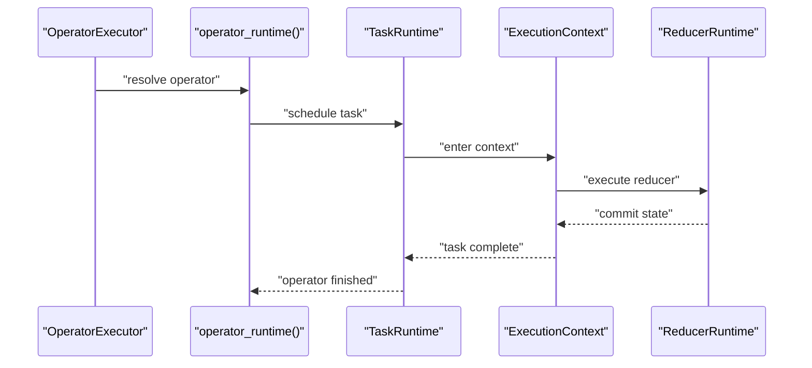
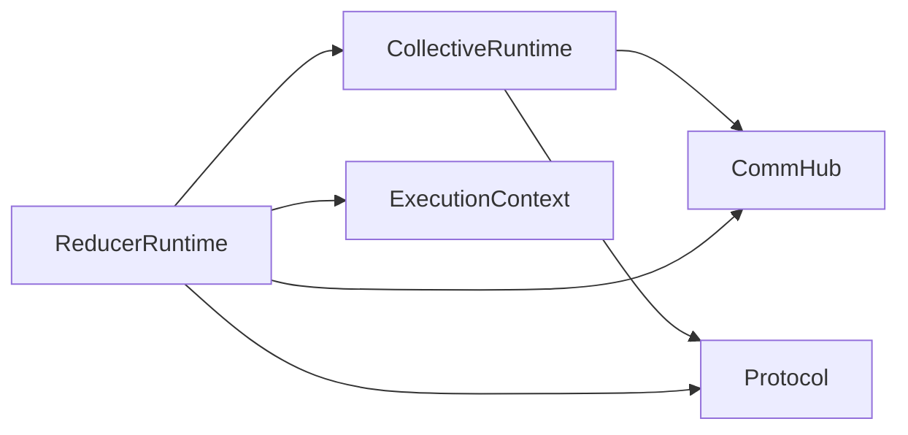

# Reducer Processor System

<cite>
**Referenced Files in This Document**
- [reducers.py](file://src/sage/runtime/flownet/runtime/operator_runtime/reducers.py)
- [collective.py](file://src/sage/runtime/flownet/runtime/operator_runtime/collective.py)
- [engine.py](file://src/sage/runtime/flownet/runtime/flowengine/engine.py)
- [streams.py](file://src/sage/runtime/flownet/compiler/streams.py)
- [operator_executor.py](file://src/sage/runtime/flownet/runtime/flowengine/operator_executor.py)
- [operator_runtime.py](file://src/sage/runtime/flownet/runtime/flowengine/operator_runtime.py)
- [task_runtime.py](file://src/sage/runtime/flownet/runtime/flowengine/task_runtime.py)
- [execution_context.py](file://src/sage/runtime/flownet/runtime/actors/execution_context.py)
- [comm_hub.py](file://src/sage/runtime/flownet/runtime/comm/hub.py)
- [protocol.py](file://src/sage/runtime/flownet/runtime/comm/protocol.py)
- [error_codes.py](file://src/sage/runtime/flownet/runtime/actors/error_codes.py)
- [flow_exception_handlers.py](file://src/sage/runtime/flownet/api/flow_exception_handlers.py)
- [test_flownet_collective_executor_contract.py](file://src/tests/test_flownet_collective_executor_contract.py)
</cite>

## Table of Contents
1. [Introduction](#introduction)
2. [Project Structure](#project-structure)
3. [Core Components](#core-components)
4. [Architecture Overview](#architecture-overview)
5. [Detailed Component Analysis](#detailed-component-analysis)
6. [Dependency Analysis](#dependency-analysis)
7. [Performance Considerations](#performance-considerations)
8. [Troubleshooting Guide](#troubleshooting-guide)
9. [Conclusion](#conclusion)

## Introduction
This document describes the Reducer Processor System within SAGE’s FlowNet runtime. It explains the reducer runtime as an optimized execution layer for operators performing aggregation, summarization, and reduction computations. It documents reduction algorithms, aggregation strategies, and parallel reduction execution patterns, along with the implementation of reducer processor classes, reduction coordination mechanisms, and distributed aggregation strategies. Practical examples illustrate reduction operation execution, parallel aggregation patterns, state management in reductions, and performance optimization techniques for large-scale aggregation computations. Common reduction scenarios, error handling in distributed reductions, and debugging approaches for aggregation-related issues are also covered.

## Project Structure
The reducer system spans several modules:
- Operator runtime reducers and collective execution orchestration
- FlowEngine orchestrators and operator executors
- Compiler-level stream APIs for reduction configuration
- Communication and error handling infrastructure

**Diagram sources**
- [streams.py:960-1003](file://src/sage/runtime/flownet/compiler/streams.py#L960-L1003)
- [engine.py:38-59](file://src/sage/runtime/flownet/runtime/flowengine/engine.py#L38-L59)
- [operator_executor.py](file://src/sage/runtime/flownet/runtime/flowengine/operator_executor.py)
- [operator_runtime.py](file://src/sage/runtime/flownet/runtime/flowengine/operator_runtime.py)
- [reducers.py](file://src/sage/runtime/flownet/runtime/operator_runtime/reducers.py)
- [collective.py](file://src/sage/runtime/flownet/runtime/operator_runtime/collective.py)
- [execution_context.py](file://src/sage/runtime/flownet/runtime/actors/execution_context.py)
- [comm_hub.py](file://src/sage/runtime/flownet/runtime/comm/hub.py)
- [protocol.py](file://src/sage/runtime/flownet/runtime/comm/protocol.py)

**Section sources**
- [engine.py:38-59](file://src/sage/runtime/flownet/runtime/flowengine/engine.py#L38-L59)
- [streams.py:960-1003](file://src/sage/runtime/flownet/compiler/streams.py#L960-L1003)

## Core Components
- ReducerRuntime: Executes reduction operators with aggregation semantics and parallel coordination.
- JoinReducerRuntime: Coordinates join-like reduction operations across partitions.
- MergeReducerRuntime: Merges partial results from multiple sources into consolidated aggregates.
- CollectiveRuntime: Provides collective communication primitives for cross-partition aggregation.
- ExecutionContext: Manages execution context for reducer tasks and lifecycle.
- CommHub and Protocol: Enable inter-node communication and message routing for distributed reductions.

These components collaborate to support:
- Reduction algorithms (e.g., sum, average, count, min/max)
- Aggregation strategies (key-based grouping, windowed aggregation)
- Parallel reduction execution across partitions and nodes
- Distributed aggregation via collective operations

**Section sources**
- [reducers.py](file://src/sage/runtime/flownet/runtime/operator_runtime/reducers.py)
- [collective.py](file://src/sage/runtime/flownet/runtime/operator_runtime/collective.py)
- [engine.py:38-59](file://src/sage/runtime/flownet/runtime/flowengine/engine.py#L38-L59)

## Architecture Overview
The reducer system integrates compiler-driven configuration with runtime execution and distributed coordination.

**Diagram sources**
- [streams.py:960-1003](file://src/sage/runtime/flownet/compiler/streams.py#L960-L1003)
- [engine.py:38-59](file://src/sage/runtime/flownet/runtime/flowengine/engine.py#L38-L59)
- [operator_executor.py](file://src/sage/runtime/flownet/runtime/flowengine/operator_executor.py)
- [reducers.py](file://src/sage/runtime/flownet/runtime/operator_runtime/reducers.py)
- [collective.py](file://src/sage/runtime/flownet/runtime/operator_runtime/collective.py)
- [execution_context.py](file://src/sage/runtime/flownet/runtime/actors/execution_context.py)
- [comm_hub.py](file://src/sage/runtime/flownet/runtime/comm/hub.py)

## Detailed Component Analysis

### ReducerRuntime Implementation
ReducerRuntime encapsulates the execution of reduction operators. It coordinates:
- Input partitioning and key-based grouping
- Local aggregation per partition
- Cross-partition collective aggregation
- Finalization and output emission

Key responsibilities:
- Accept reducer operator metadata (e.g., groupby configuration)
- Manage execution context transitions
- Coordinate with CollectiveRuntime for distributed aggregation
- Integrate with CommHub for inter-node exchange of partials

**Diagram sources**
- [reducers.py](file://src/sage/runtime/flownet/runtime/operator_runtime/reducers.py)
- [collective.py](file://src/sage/runtime/flownet/runtime/operator_runtime/collective.py)
- [execution_context.py](file://src/sage/runtime/flownet/runtime/actors/execution_context.py)

**Section sources**
- [reducers.py](file://src/sage/runtime/flownet/runtime/operator_runtime/reducers.py)

### JoinReducerRuntime and MergeReducerRuntime
- JoinReducerRuntime: Handles join-like reduction semantics across partitions, aligning keys and merging compatible groups.
- MergeReducerRuntime: Consolidates partial aggregation results into final aggregates, ensuring correctness under associative and commutative operations.

Operational patterns:
- Partition alignment and key resolution
- Partial result merging with conflict resolution
- State updates and persistence

**Section sources**
- [reducers.py](file://src/sage/runtime/flownet/runtime/operator_runtime/reducers.py)

### CollectiveRuntime and Distributed Aggregation
CollectiveRuntime provides primitives for cross-partition aggregation:
- all_reduce: Applies associative operation across all partitions
- reduce_scatter: Distributes reduced data across partitions for downstream stages

Integration points:
- Execution context ensures atomicity and consistency
- CommHub routes messages and manages topology-aware exchanges
- Protocol defines message formats and sequencing guarantees

**Diagram sources**
- [collective.py](file://src/sage/runtime/flownet/runtime/operator_runtime/collective.py)
- [execution_context.py](file://src/sage/runtime/flownet/runtime/actors/execution_context.py)
- [comm_hub.py](file://src/sage/runtime/flownet/runtime/comm/hub.py)
- [protocol.py](file://src/sage/runtime/flownet/runtime/comm/protocol.py)

**Section sources**
- [collective.py](file://src/sage/runtime/flownet/runtime/operator_runtime/collective.py)

### Compiler-Level Reduction Configuration
The compiler constructs reducer operators with explicit configuration:
- GroupedStream.reduce_by_key supports modes such as sum and allows specifying value field or index
- GroupBy metadata is embedded into operator configuration for runtime execution

**Diagram sources**
- [streams.py:960-1003](file://src/sage/runtime/flownet/compiler/streams.py#L960-L1003)

**Section sources**
- [streams.py:960-1003](file://src/sage/runtime/flownet/compiler/streams.py#L960-L1003)

### Operator Execution and Lifecycle
OperatorExecutor resolves and executes reducer operators within FlowEngine. The operator_runtime module coordinates lifecycle events, while TaskRuntime and ExecutionContext manage concurrency and state.

**Diagram sources**
- [operator_executor.py](file://src/sage/runtime/flownet/runtime/flowengine/operator_executor.py)
- [operator_runtime.py](file://src/sage/runtime/flownet/runtime/flowengine/operator_runtime.py)
- [task_runtime.py](file://src/sage/runtime/flownet/runtime/flowengine/task_runtime.py)
- [execution_context.py](file://src/sage/runtime/flownet/runtime/actors/execution_context.py)
- [reducers.py](file://src/sage/runtime/flownet/runtime/operator_runtime/reducers.py)

**Section sources**
- [engine.py:38-59](file://src/sage/runtime/flownet/runtime/flowengine/engine.py#L38-L59)

## Dependency Analysis
ReducerRuntime depends on:
- CollectiveRuntime for cross-partition aggregation
- ExecutionContext for state management and transactional semantics
- CommHub and Protocol for distributed messaging

**Diagram sources**
- [reducers.py](file://src/sage/runtime/flownet/runtime/operator_runtime/reducers.py)
- [collective.py](file://src/sage/runtime/flownet/runtime/operator_runtime/collective.py)
- [execution_context.py](file://src/sage/runtime/flownet/runtime/actors/execution_context.py)
- [comm_hub.py](file://src/sage/runtime/flownet/runtime/comm/hub.py)
- [protocol.py](file://src/sage/runtime/flownet/runtime/comm/protocol.py)

**Section sources**
- [reducers.py](file://src/sage/runtime/flownet/runtime/operator_runtime/reducers.py)
- [collective.py](file://src/sage/runtime/flownet/runtime/operator_runtime/collective.py)

## Performance Considerations
- Partition sizing: Tune partition counts to balance load and minimize cross-partition communication overhead.
- Aggregation locality: Prefer key-based grouping to maximize local aggregation and reduce shuffle.
- Associative/commutative operations: Favor operations that enable early partial merges to reduce network traffic.
- Backpressure and batching: Use batching strategies to amortize communication costs.
- State checkpointing: Periodic checkpointing reduces recovery time during failures.
- Topology awareness: Leverage CommHub routing to minimize cross-rack traffic.

[No sources needed since this section provides general guidance]

## Troubleshooting Guide
Common issues and remedies:
- Asymmetric partitions causing hotspots: Rebalance partitions and adjust grouping keys.
- Network bottlenecks in collective operations: Reduce cross-partition data volume and increase locality.
- State inconsistencies: Verify ExecutionContext commit order and idempotency of merge operations.
- Operator failures: Inspect error codes and exception handlers for actionable diagnostics.

Validation and testing:
- Use the collective executor contract tests to validate distributed reduction behavior.

**Section sources**
- [error_codes.py](file://src/sage/runtime/flownet/runtime/actors/error_codes.py)
- [flow_exception_handlers.py](file://src/sage/runtime/flownet/api/flow_exception_handlers.py)
- [test_flownet_collective_executor_contract.py](file://src/tests/test_flownet_collective_executor_contract.py)

## Conclusion
The Reducer Processor System in SAGE’s FlowNet provides a robust, distributed execution layer for aggregation and reduction computations. Through ReducerRuntime, JoinReducerRuntime, MergeReducerRuntime, and CollectiveRuntime, it enables scalable, parallel reduction execution with strong coordination and fault tolerance. By leveraging compiler-driven configuration, execution contexts, and communication primitives, it supports diverse reduction scenarios from simple sums to complex join-like aggregations across large datasets.