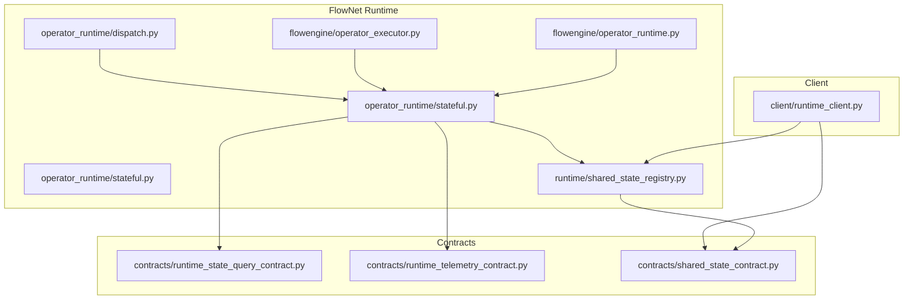
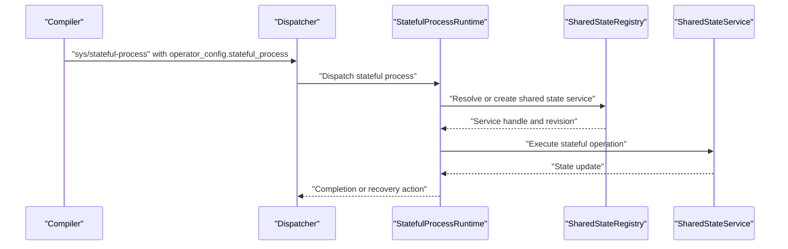
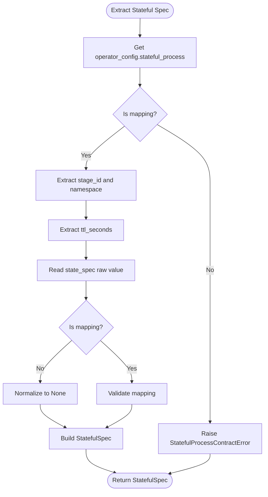
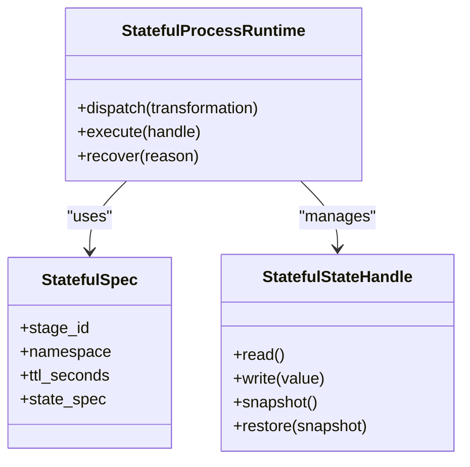
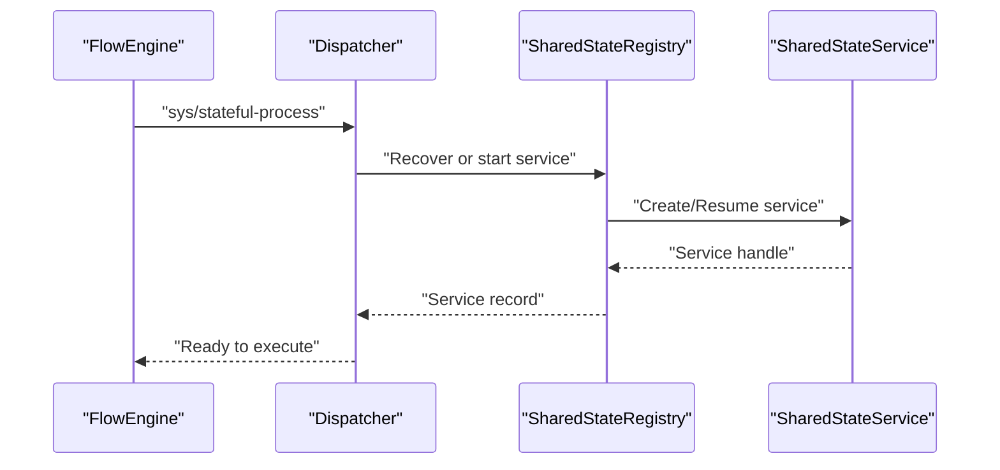
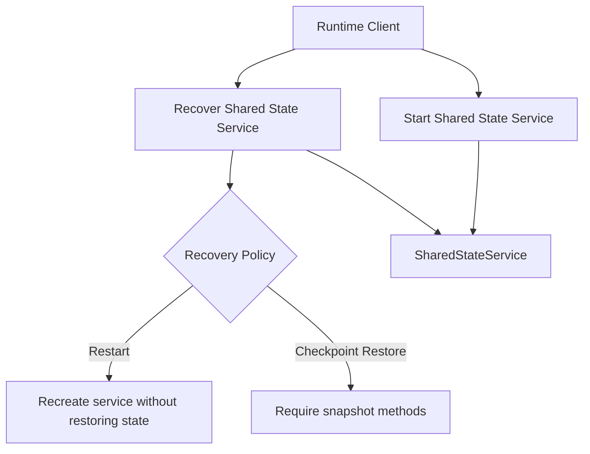
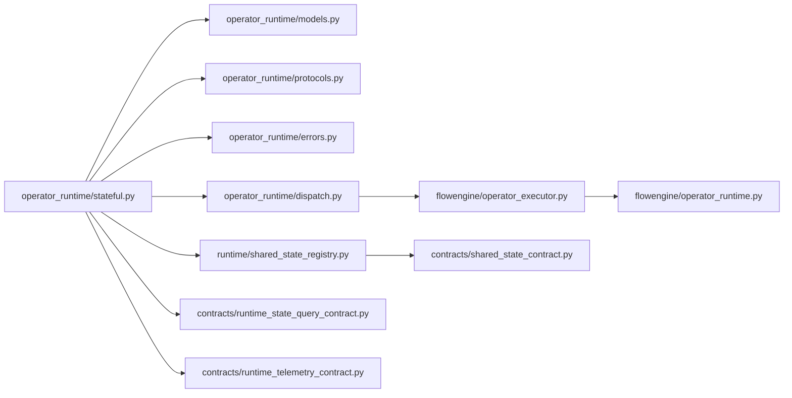

# Stateful Operator Support

<cite>
**Referenced Files in This Document**
- [stateful.py](file://src/sage/runtime/flownet/runtime/operator_runtime/stateful.py)
- [dispatch.py](file://src/sage/runtime/flownet/runtime/operator_runtime/dispatch.py)
- [models.py](file://src/sage/runtime/flownet/runtime/operator_runtime/models.py)
- [errors.py](file://src/sage/runtime/flownet/runtime/operator_runtime/errors.py)
- [protocols.py](file://src/sage/runtime/flownet/runtime/operator_runtime/protocols.py)
- [operator_executor.py](file://src/sage/runtime/flownet/runtime/flowengine/operator_executor.py)
- [operator_runtime.py](file://src/sage/runtime/flownet/runtime/flowengine/operator_runtime.py)
- [shared_state_registry.py](file://src/sage/runtime/flownet/runtime/shared_state_registry.py)
- [runtime_state_query_contract.py](file://src/sage/runtime/flownet/contracts/runtime_state_query_contract.py)
- [runtime_telemetry_contract.py](file://src/sage/runtime/flownet/contracts/runtime_telemetry_contract.py)
- [shared_state_contract.py](file://src/sage/runtime/flownet/contracts/shared_state_contract.py)
- [flow_program.py](file://src/sage/runtime/flownet/core/flow_program.py)
- [runtime_client.py](file://src/sage/runtime/flownet/client/runtime_client.py)
- [test_flownet_shared_state_service_contract.py](file://src/tests/test_flownet_shared_state_service_contract.py)
</cite>

## Table of Contents
1. [Introduction](#introduction)
2. [Project Structure](#project-structure)
3. [Core Components](#core-components)
4. [Architecture Overview](#architecture-overview)
5. [Detailed Component Analysis](#detailed-component-analysis)
6. [Dependency Analysis](#dependency-analysis)
7. [Performance Considerations](#performance-considerations)
8. [Troubleshooting Guide](#troubleshooting-guide)
9. [Conclusion](#conclusion)

## Introduction
This document explains SAGE’s specialized execution environment for stateful operators within the FlowNet runtime. Stateful operators maintain persistent state across invocations, enabling patterns such as counters, accumulators, sliding windows, and session-based aggregations. The stateful runtime provides an optimized execution layer that manages state lifecycle, checkpointing, and recovery, while coordinating state synchronization across distributed nodes. It integrates tightly with FlowNet’s operator execution engine, shared state services, and runtime contracts to deliver reliable, scalable stateful computation.

## Project Structure
The stateful runtime spans several modules under the FlowNet runtime subsystem:
- Operator runtime: dispatches sys/stateful-process operators, manages state handles, and orchestrates execution.
- FlowEngine: executes operators, coordinates operator lifecycles, and integrates with shared state services.
- Contracts: define runtime state queries, telemetry, and shared state service contracts.
- Client: exposes APIs to start, recover, and query shared state services.

**Diagram sources**
- [stateful.py:1-600](file://src/sage/runtime/flownet/runtime/operator_runtime/stateful.py#L1-L600)
- [dispatch.py:1-150](file://src/sage/runtime/flownet/runtime/operator_runtime/dispatch.py#L1-L150)
- [shared_state_registry.py:1-200](file://src/sage/runtime/flownet/runtime/shared_state_registry.py#L1-L200)
- [operator_executor.py:1-200](file://src/sage/runtime/flownet/runtime/flowengine/operator_executor.py#L1-L200)
- [operator_runtime.py:1-200](file://src/sage/runtime/flownet/runtime/flowengine/operator_runtime.py#L1-L200)
- [runtime_state_query_contract.py:1-120](file://src/sage/runtime/flownet/contracts/runtime_state_query_contract.py#L1-L120)
- [runtime_telemetry_contract.py:1-120](file://src/sage/runtime/flownet/contracts/runtime_telemetry_contract.py#L1-L120)
- [shared_state_contract.py:1-200](file://src/sage/runtime/flownet/contracts/shared_state_contract.py#L1-L200)
- [runtime_client.py:4700-4800](file://src/sage/runtime/flownet/client/runtime_client.py#L4700-L4800)

**Section sources**
- [stateful.py:1-600](file://src/sage/runtime/flownet/runtime/operator_runtime/stateful.py#L1-L600)
- [dispatch.py:1-150](file://src/sage/runtime/flownet/runtime/operator_runtime/dispatch.py#L1-L150)
- [shared_state_registry.py:1-200](file://src/sage/runtime/flownet/runtime/shared_state_registry.py#L1-L200)
- [operator_executor.py:1-200](file://src/sage/runtime/flownet/runtime/flowengine/operator_executor.py#L1-L200)
- [operator_runtime.py:1-200](file://src/sage/runtime/flownet/runtime/flowengine/operator_runtime.py#L1-L200)
- [runtime_state_query_contract.py:1-120](file://src/sage/runtime/flownet/contracts/runtime_state_query_contract.py#L1-L120)
- [runtime_telemetry_contract.py:1-120](file://src/sage/runtime/flownet/contracts/runtime_telemetry_contract.py#L1-L120)
- [shared_state_contract.py:1-200](file://src/sage/runtime/flownet/contracts/shared_state_contract.py#L1-L200)
- [runtime_client.py:4700-4800](file://src/sage/runtime/flownet/client/runtime_client.py#L4700-L4800)

## Core Components
- StatefulSpec: Encapsulates stateful operator metadata including stage identifier, namespace, TTL, and optional state specification.
- StatefulStateHandle: Provides a handle to access and mutate stateful resources, including snapshot and restore capabilities.
- StatefulProcessRuntime: Executes stateful operators, manages lifecycle, and coordinates with shared state services.
- SharedStateRegistry: Manages shared state services, including creation, recovery, and revision tracking.
- Operator dispatch for sys/stateful-process: Routes stateful operators to the stateful runtime dispatcher.
- Contracts for state queries and telemetry: Define interfaces for querying runtime state and emitting telemetry.

Key responsibilities:
- Extract stateful operator metadata from transformation configurations.
- Resolve and validate stateful process metadata and state specifications.
- Coordinate stateful execution with shared state services and recovery policies.
- Enforce contract compliance for stateful processes and shared state services.

**Section sources**
- [protocols.py:1-80](file://src/sage/runtime/flownet/runtime/operator_runtime/protocols.py#L1-L80)
- [stateful.py:1-200](file://src/sage/runtime/flownet/runtime/operator_runtime/stateful.py#L1-L200)
- [stateful.py:475-507](file://src/sage/runtime/flownet/runtime/operator_runtime/stateful.py#L475-L507)
- [errors.py:1-40](file://src/sage/runtime/flownet/runtime/operator_runtime/errors.py#L1-L40)
- [dispatch.py:100-110](file://src/sage/runtime/flownet/runtime/operator_runtime/dispatch.py#L100-L110)
- [shared_state_registry.py:1-200](file://src/sage/runtime/flownet/runtime/shared_state_registry.py#L1-L200)

## Architecture Overview
The stateful runtime architecture integrates operator dispatch, execution orchestration, and shared state services. Operators declare stateful behavior via operator_config.stateful_process, which is validated and transformed into a StatefulSpec. The dispatcher routes sys/stateful-process operators to StatefulProcessRuntime, which interacts with SharedStateRegistry to manage stateful resources and recovery.

**Diagram sources**
- [dispatch.py:100-110](file://src/sage/runtime/flownet/runtime/operator_runtime/dispatch.py#L100-L110)
- [stateful.py:279-360](file://src/sage/runtime/flownet/runtime/operator_runtime/stateful.py#L279-L360)
- [shared_state_registry.py:1-200](file://src/sage/runtime/flownet/runtime/shared_state_registry.py#L1-L200)

## Detailed Component Analysis

### StatefulSpec and Metadata Extraction
StatefulSpec captures operator state requirements:
- stage_id: Unique identifier for the stateful stage.
- namespace: Logical grouping for stateful resources.
- ttl_seconds: Optional expiration policy for stateful resources.
- state_spec: Optional mapping of state configuration.

Metadata extraction validates operator_config and stateful_process mappings, raising explicit errors for invalid configurations.

**Diagram sources**
- [stateful.py:475-507](file://src/sage/runtime/flownet/runtime/operator_runtime/stateful.py#L475-L507)
- [errors.py:1-40](file://src/sage/runtime/flownet/runtime/operator_runtime/errors.py#L1-L40)

**Section sources**
- [stateful.py:475-507](file://src/sage/runtime/flownet/runtime/operator_runtime/stateful.py#L475-L507)
- [errors.py:1-40](file://src/sage/runtime/flownet/runtime/operator_runtime/errors.py#L1-L40)

### StatefulStateHandle and Execution Lifecycle
StatefulStateHandle provides:
- Accessors to read/write state.
- Snapshot and restore capabilities for checkpointing.
- Integration with recovery policies (restart vs. checkpoint_restore).

StatefulProcessRuntime coordinates:
- Dispatching sys/stateful-process operators.
- Resolving stateful specs and shared state services.
- Executing stateful operations and handling recovery actions.

**Diagram sources**
- [protocols.py:20-40](file://src/sage/runtime/flownet/runtime/operator_runtime/protocols.py#L20-L40)
- [stateful.py:1-60](file://src/sage/runtime/flownet/runtime/operator_runtime/stateful.py#L1-L60)
- [stateful.py:279-360](file://src/sage/runtime/flownet/runtime/operator_runtime/stateful.py#L279-L360)

**Section sources**
- [protocols.py:20-40](file://src/sage/runtime/flownet/runtime/operator_runtime/protocols.py#L20-L40)
- [stateful.py:1-60](file://src/sage/runtime/flownet/runtime/operator_runtime/stateful.py#L1-L60)
- [stateful.py:279-360](file://src/sage/runtime/flownet/runtime/operator_runtime/stateful.py#L279-L360)

### Operator Dispatch and Recovery Policies
The dispatcher recognizes sys/stateful-process and routes to the stateful runtime. Recovery policies determine whether to restart the service or restore from a checkpoint. SharedStateRegistry tracks service revisions and enforces recovery semantics.

**Diagram sources**
- [dispatch.py:100-110](file://src/sage/runtime/flownet/runtime/operator_runtime/dispatch.py#L100-L110)
- [shared_state_registry.py:1-200](file://src/sage/runtime/flownet/runtime/shared_state_registry.py#L1-L200)

**Section sources**
- [dispatch.py:100-110](file://src/sage/runtime/flownet/runtime/operator_runtime/dispatch.py#L100-L110)
- [shared_state_registry.py:1-200](file://src/sage/runtime/flownet/runtime/shared_state_registry.py#L1-L200)

### Shared State Services and Contracts
Shared state services expose:
- Start/recover APIs.
- Revision tracking for recovery continuity.
- Recovery policies (restart vs. checkpoint_restore).

Contracts define the interface for state queries and telemetry, ensuring consistent monitoring and diagnostics.

**Diagram sources**
- [runtime_client.py:4766-4783](file://src/sage/runtime/flownet/client/runtime_client.py#L4766-L4783)
- [shared_state_contract.py:1-200](file://src/sage/runtime/flownet/contracts/shared_state_contract.py#L1-L200)
- [runtime_state_query_contract.py:1-120](file://src/sage/runtime/flownet/contracts/runtime_state_query_contract.py#L1-L120)
- [runtime_telemetry_contract.py:1-120](file://src/sage/runtime/flownet/contracts/runtime_telemetry_contract.py#L1-L120)

**Section sources**
- [runtime_client.py:4766-4783](file://src/sage/runtime/flownet/client/runtime_client.py#L4766-L4783)
- [shared_state_contract.py:1-200](file://src/sage/runtime/flownet/contracts/shared_state_contract.py#L1-L200)
- [runtime_state_query_contract.py:1-120](file://src/sage/runtime/flownet/contracts/runtime_state_query_contract.py#L1-L120)
- [runtime_telemetry_contract.py:1-120](file://src/sage/runtime/flownet/contracts/runtime_telemetry_contract.py#L1-L120)

### Practical Examples and Patterns
Common stateful operator patterns:
- Counters and accumulators: Use StatefulStateHandle.write/read with periodic snapshots.
- Sliding windows: Maintain window state and evict expired entries; rely on TTL or explicit eviction.
- Session aggregation: Group events by session keys; persist per-key state with namespace scoping.

Checkpointing strategies:
- Periodic snapshots: Capture state at fixed intervals or after significant updates.
- Incremental snapshots: Record deltas to reduce overhead.
- Recovery policies: Prefer restart for fast recovery or checkpoint_restore for precise state restoration.

Synchronization across nodes:
- Shared state services coordinate state across nodes via SharedStateRegistry.
- Recovery ensures consistent state after failures, with revision tracking to prevent stale updates.

Performance optimization:
- Minimize state churn by batching writes and consolidating updates.
- Use TTL to automatically expire unused state.
- Offload heavy computations to background tasks while keeping state lightweight.

Best practices:
- Validate operator_config.stateful_process mappings before deployment.
- Define clear recovery policies aligned with operational SLAs.
- Monitor stateful service telemetry and runtime state queries for anomalies.

Error recovery:
- Contract violations raise explicit StatefulProcessContractError; address configuration issues upstream.
- For checkpoint_restore, ensure snapshot methods are implemented; otherwise, switch to restart.

Debugging approaches:
- Use runtime state queries to introspect current state.
- Enable telemetry to trace stateful operations and recovery actions.
- Inspect service revisions to confirm recovery outcomes.

**Section sources**
- [stateful.py:475-507](file://src/sage/runtime/flownet/runtime/operator_runtime/stateful.py#L475-L507)
- [errors.py:1-40](file://src/sage/runtime/flownet/runtime/operator_runtime/errors.py#L1-L40)
- [test_flownet_shared_state_service_contract.py:339-374](file://src/tests/test_flownet_shared_state_service_contract.py#L339-L374)

## Dependency Analysis
Stateful runtime components depend on:
- Operator runtime models and protocols for stateful specifications.
- FlowEngine operator executor for dispatch and lifecycle management.
- Shared state registry for service resolution and recovery.
- Contracts for state queries and telemetry.

**Diagram sources**
- [stateful.py:1-600](file://src/sage/runtime/flownet/runtime/operator_runtime/stateful.py#L1-L600)
- [models.py:1-200](file://src/sage/runtime/flownet/runtime/operator_runtime/models.py#L1-L200)
- [protocols.py:1-80](file://src/sage/runtime/flownet/runtime/operator_runtime/protocols.py#L1-L80)
- [errors.py:1-40](file://src/sage/runtime/flownet/runtime/operator_runtime/errors.py#L1-L40)
- [dispatch.py:1-150](file://src/sage/runtime/flownet/runtime/operator_runtime/dispatch.py#L1-L150)
- [shared_state_registry.py:1-200](file://src/sage/runtime/flownet/runtime/shared_state_registry.py#L1-L200)
- [operator_executor.py:1-200](file://src/sage/runtime/flownet/runtime/flowengine/operator_executor.py#L1-L200)
- [operator_runtime.py:1-200](file://src/sage/runtime/flownet/runtime/flowengine/operator_runtime.py#L1-L200)
- [runtime_state_query_contract.py:1-120](file://src/sage/runtime/flownet/contracts/runtime_state_query_contract.py#L1-L120)
- [runtime_telemetry_contract.py:1-120](file://src/sage/runtime/flownet/contracts/runtime_telemetry_contract.py#L1-L120)
- [shared_state_contract.py:1-200](file://src/sage/runtime/flownet/contracts/shared_state_contract.py#L1-L200)

**Section sources**
- [stateful.py:1-600](file://src/sage/runtime/flownet/runtime/operator_runtime/stateful.py#L1-L600)
- [dispatch.py:1-150](file://src/sage/runtime/flownet/runtime/operator_runtime/dispatch.py#L1-L150)
- [shared_state_registry.py:1-200](file://src/sage/runtime/flownet/runtime/shared_state_registry.py#L1-L200)
- [operator_executor.py:1-200](file://src/sage/runtime/flownet/runtime/flowengine/operator_executor.py#L1-L200)
- [operator_runtime.py:1-200](file://src/sage/runtime/flownet/runtime/flowengine/operator_runtime.py#L1-L200)
- [runtime_state_query_contract.py:1-120](file://src/sage/runtime/flownet/contracts/runtime_state_query_contract.py#L1-L120)
- [runtime_telemetry_contract.py:1-120](file://src/sage/runtime/flownet/contracts/runtime_telemetry_contract.py#L1-L120)
- [shared_state_contract.py:1-200](file://src/sage/runtime/flownet/contracts/shared_state_contract.py#L1-L200)

## Performance Considerations
- Reduce state size: Keep state compact; avoid storing large intermediate artifacts.
- Batch updates: Coalesce frequent writes to minimize I/O and contention.
- Use TTL: Automatically expire stale state to reclaim resources.
- Choose appropriate recovery policy: Restart for speed, checkpoint_restore for fidelity.
- Monitor telemetry: Track stateful operation latency and failure rates.

## Troubleshooting Guide
Common issues and resolutions:
- Contract errors: Validate operator_config.stateful_process mappings; ensure they are mappings and state_spec is a mapping when provided.
- Recovery mismatches: For checkpoint_restore, implement required snapshot methods; otherwise, switch to restart.
- State divergence: Inspect service revisions and telemetry to detect stale or inconsistent state.
- Debugging: Use runtime state queries to introspect current state and verify recovery outcomes.

**Section sources**
- [errors.py:1-40](file://src/sage/runtime/flownet/runtime/operator_runtime/errors.py#L1-L40)
- [test_flownet_shared_state_service_contract.py:339-374](file://src/tests/test_flownet_shared_state_service_contract.py#L339-L374)
- [runtime_state_query_contract.py:1-120](file://src/sage/runtime/flownet/contracts/runtime_state_query_contract.py#L1-L120)

## Conclusion
SAGE’s stateful operator support delivers a robust, contract-driven execution environment for stateful operators within FlowNet. By combining validated stateful specifications, resilient shared state services, and clear recovery policies, it enables scalable, fault-tolerant stateful computation. Proper configuration, monitoring, and adherence to best practices ensure reliable performance and operability across distributed deployments.