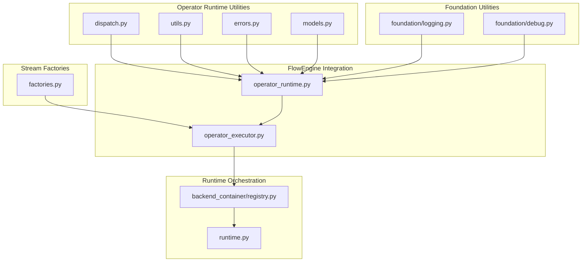
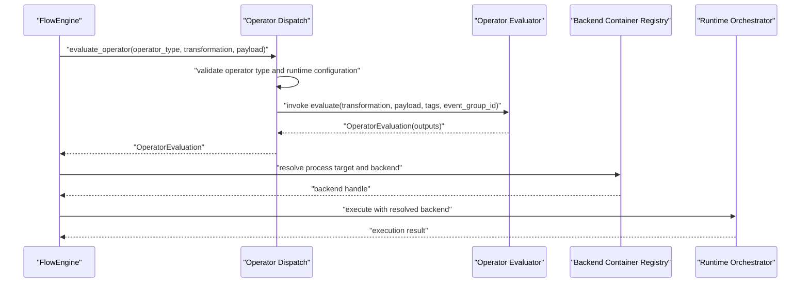
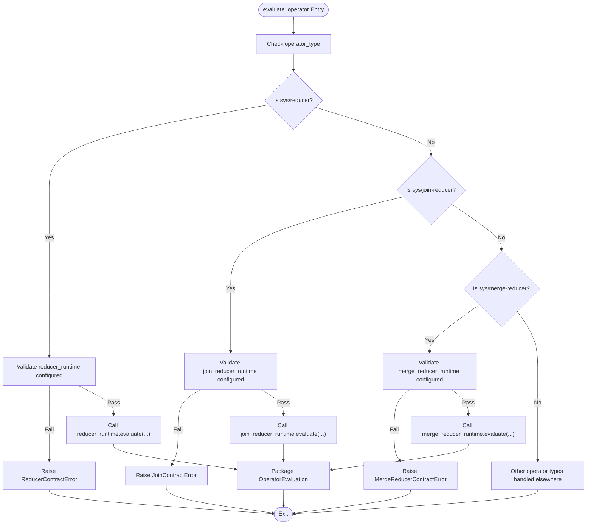
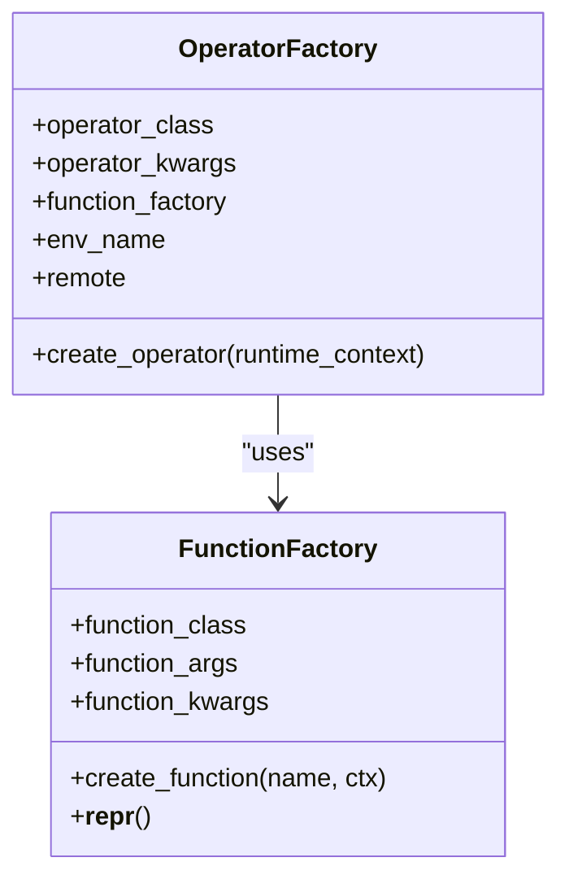
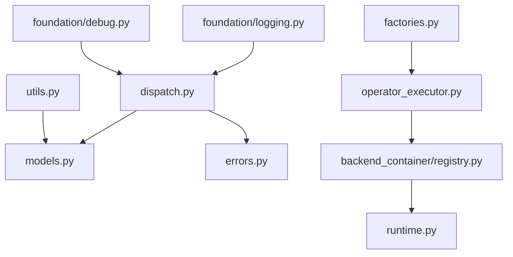

# Utility Support Functions

<cite>
**Referenced Files in This Document**
- [dispatch.py](file://src/sage/runtime/flownet/runtime/operator_runtime/dispatch.py)
- [utils.py](file://src/sage/runtime/flownet/runtime/operator_runtime/utils.py)
- [errors.py](file://src/sage/runtime/flownet/runtime/operator_runtime/errors.py)
- [models.py](file://src/sage/runtime/flownet/runtime/operator_runtime/models.py)
- [factories.py](file://src/sage/stream/factories.py)
- [operator_runtime.py](file://src/sage/runtime/flownet/runtime/flowengine/operator_runtime.py)
- [operator_executor.py](file://src/sage/runtime/flownet/runtime/flowengine/operator_executor.py)
- [backend_container/registry.py](file://src/sage/runtime/flownet/runtime/backend_container/registry.py)
- [runtime.py](file://src/sage/runtime/flownet/runtime/runtime.py)
- [logging.py](file://src/sage/foundation/logging.py)
- [debug.py](file://src/sage/foundation/debug.py)
</cite>

## Table of Contents
1. [Introduction](#introduction)
2. [Project Structure](#project-structure)
3. [Core Components](#core-components)
4. [Architecture Overview](#architecture-overview)
5. [Detailed Component Analysis](#detailed-component-analysis)
6. [Dependency Analysis](#dependency-analysis)
7. [Performance Considerations](#performance-considerations)
8. [Troubleshooting Guide](#troubleshooting-guide)
9. [Conclusion](#conclusion)

## Introduction
This document describes the Utility Support Functions that underpin operator runtime execution within SAGE’s FlowNet framework. These utilities provide common operations, validation, and helper routines that enable specialized operator execution environments to operate reliably and consistently. They encapsulate shared patterns for dispatching operators, evaluating transformations, managing runtime errors, and coordinating execution contexts across distributed and containerized environments.

The focus areas include:
- Operator dispatch and evaluation utilities
- Shared runtime models and error abstractions
- Factory patterns for constructing operators and functions
- Logging and debugging utilities integrated into the runtime
- Integration points with backend containers and runtime orchestration

## Project Structure
The utility support functions are primarily located under the FlowNet runtime operator subsystem and the stream factories module. The structure supports a layered design:
- Operator runtime utilities: dispatch, evaluation, error handling, and shared models
- Stream factories: reusable construction patterns for operators and functions
- Runtime orchestration: integration with backend containers and runtime coordination

**Diagram sources**
- [dispatch.py](file://src/sage/runtime/flownet/runtime/operator_runtime/dispatch.py)
- [utils.py](file://src/sage/runtime/flownet/runtime/operator_runtime/utils.py)
- [errors.py](file://src/sage/runtime/flownet/runtime/operator_runtime/errors.py)
- [models.py](file://src/sage/runtime/flownet/runtime/operator_runtime/models.py)
- [factories.py](file://src/sage/stream/factories.py)
- [operator_runtime.py](file://src/sage/runtime/flownet/runtime/flowengine/operator_runtime.py)
- [operator_executor.py](file://src/sage/runtime/flownet/runtime/flowengine/operator_executor.py)
- [backend_container/registry.py](file://src/sage/runtime/flownet/runtime/backend_container/registry.py)
- [runtime.py](file://src/sage/runtime/flownet/runtime/runtime.py)
- [logging.py](file://src/sage/foundation/logging.py)
- [debug.py](file://src/sage/foundation/debug.py)

**Section sources**
- [dispatch.py](file://src/sage/runtime/flownet/runtime/operator_runtime/dispatch.py)
- [utils.py](file://src/sage/runtime/flownet/runtime/operator_runtime/utils.py)
- [errors.py](file://src/sage/runtime/flownet/runtime/operator_runtime/errors.py)
- [models.py](file://src/sage/runtime/flownet/runtime/operator_runtime/models.py)
- [factories.py](file://src/sage/stream/factories.py)
- [operator_runtime.py](file://src/sage/runtime/flownet/runtime/flowengine/operator_runtime.py)
- [operator_executor.py](file://src/sage/runtime/flownet/runtime/flowengine/operator_executor.py)
- [backend_container/registry.py](file://src/sage/runtime/flownet/runtime/backend_container/registry.py)
- [runtime.py](file://src/sage/runtime/flownet/runtime/runtime.py)
- [logging.py](file://src/sage/foundation/logging.py)
- [debug.py](file://src/sage/foundation/debug.py)

## Core Components
This section outlines the primary utility components and their roles in operator runtime execution.

- Operator Dispatch Utilities
  - Centralized operator type resolution and evaluation routing
  - Contract validation and runtime configuration checks
  - Error propagation and standardized evaluation results

- Shared Runtime Models
  - Evaluation result structures and operator metadata
  - Event group identifiers and tagging mechanisms
  - Transformation and payload abstractions

- Error Abstractions
  - Typed exceptions for contract violations and runtime failures
  - Consistent error messages and error code mappings
  - Integration with runtime telemetry and recovery contracts

- Factory Patterns
  - FunctionFactory and OperatorFactory for constructing operators and functions
  - Environment-aware creation and remote execution support
  - Context injection and parameterization

- Logging and Debugging
  - Foundation logging utilities integrated into runtime paths
  - Debug hooks and diagnostic capabilities for operator execution

**Section sources**
- [dispatch.py](file://src/sage/runtime/flownet/runtime/operator_runtime/dispatch.py)
- [models.py](file://src/sage/runtime/flownet/runtime/operator_runtime/models.py)
- [errors.py](file://src/sage/runtime/flownet/runtime/operator_runtime/errors.py)
- [factories.py](file://src/sage/stream/factories.py)
- [logging.py](file://src/sage/foundation/logging.py)
- [debug.py](file://src/sage/foundation/debug.py)

## Architecture Overview
The operator runtime utilities form a cohesive layer between FlowNet’s orchestration and the underlying execution engines. The dispatch utilities route operator types to appropriate evaluators, while shared models and error abstractions ensure consistent behavior across diverse operator implementations. Factories provide a uniform pattern for constructing operators and functions, and logging/debugging utilities support observability and diagnostics.

**Diagram sources**
- [dispatch.py](file://src/sage/runtime/flownet/runtime/operator_runtime/dispatch.py)
- [operator_runtime.py](file://src/sage/runtime/flownet/runtime/flowengine/operator_runtime.py)
- [backend_container/registry.py](file://src/sage/runtime/flownet/runtime/backend_container/registry.py)
- [runtime.py](file://src/sage/runtime/flownet/runtime/runtime.py)

## Detailed Component Analysis

### Operator Dispatch Utilities
The dispatch utilities centralize operator evaluation logic, ensuring that operator types are routed to the correct evaluator with proper validation and error handling. They enforce runtime configuration contracts and produce standardized evaluation results.

Key responsibilities:
- Type-based dispatch to reducer, join-reducer, merge-reducer, and other operator variants
- Validation of runtime configuration presence for configured operator types
- Standardized evaluation result packaging via OperatorEvaluation

**Diagram sources**
- [dispatch.py](file://src/sage/runtime/flownet/runtime/operator_runtime/dispatch.py)

**Section sources**
- [dispatch.py](file://src/sage/runtime/flownet/runtime/operator_runtime/dispatch.py)

### Shared Runtime Models
Shared models define the structures and abstractions used across operator evaluations. They include evaluation results, operator metadata, and identifiers for event grouping and tagging.

Key elements:
- OperatorEvaluation: standardized result container for operator outputs
- Event group identifiers and tags for correlation and telemetry
- Transformation and payload abstractions for consistent evaluation interfaces

These models ensure interoperability and consistency across different operator implementations and execution contexts.

**Section sources**
- [models.py](file://src/sage/runtime/flownet/runtime/operator_runtime/models.py)

### Error Abstractions
Error abstractions provide typed exceptions for contract violations and runtime failures. They standardize error reporting and integrate with runtime telemetry and recovery mechanisms.

Key aspects:
- Typed exceptions for reducer, join-reducer, merge-reducer, and other operator-specific contracts
- Consistent error messages and error code mappings for diagnostics
- Integration with runtime state queries and telemetry contracts

**Section sources**
- [errors.py](file://src/sage/runtime/flownet/runtime/operator_runtime/errors.py)

### Factory Patterns for Operators and Functions
Factory patterns encapsulate construction logic for operators and functions, enabling environment-aware creation and parameterization. They support both local and remote execution modes and facilitate context injection.

Key components:
- FunctionFactory: constructs BaseFunction instances with injected context
- OperatorFactory: creates operator instances using a function factory and runtime context
- Environment selection and remote execution flags

**Diagram sources**
- [factories.py](file://src/sage/stream/factories.py)

**Section sources**
- [factories.py](file://src/sage/stream/factories.py)

### Logging and Debugging Integration
Logging and debugging utilities are integrated into the runtime to support observability and diagnostics. They provide structured logging and debug hooks that complement operator execution.

Key capabilities:
- Foundation logging utilities for consistent log formatting and levels
- Debug hooks for operator lifecycle events and execution tracing
- Integration with runtime telemetry and state query contracts

**Section sources**
- [logging.py](file://src/sage/foundation/logging.py)
- [debug.py](file://src/sage/foundation/debug.py)

### Integration with FlowEngine and Runtime Orchestration
Operator runtime utilities integrate with FlowEngine and runtime orchestration layers to coordinate execution across backend containers and runtime environments.

Key integration points:
- Operator evaluation delegation to FlowEngine
- Backend container registry for process target resolution
- Runtime orchestration for execution scheduling and resource management

**Section sources**
- [operator_runtime.py](file://src/sage/runtime/flownet/runtime/flowengine/operator_runtime.py)
- [operator_executor.py](file://src/sage/runtime/flownet/runtime/flowengine/operator_executor.py)
- [backend_container/registry.py](file://src/sage/runtime/flownet/runtime/backend_container/registry.py)
- [runtime.py](file://src/sage/runtime/flownet/runtime/runtime.py)

## Dependency Analysis
The operator runtime utilities exhibit strong cohesion around evaluation, dispatch, and error handling, with clear separation of concerns. Dependencies are primarily unidirectional from dispatch and models to evaluation implementations, and from factories to runtime contexts.

**Diagram sources**
- [dispatch.py](file://src/sage/runtime/flownet/runtime/operator_runtime/dispatch.py)
- [utils.py](file://src/sage/runtime/flownet/runtime/operator_runtime/utils.py)
- [models.py](file://src/sage/runtime/flownet/runtime/operator_runtime/models.py)
- [errors.py](file://src/sage/runtime/flownet/runtime/operator_runtime/errors.py)
- [factories.py](file://src/sage/stream/factories.py)
- [operator_executor.py](file://src/sage/runtime/flownet/runtime/flowengine/operator_executor.py)
- [backend_container/registry.py](file://src/sage/runtime/flownet/runtime/backend_container/registry.py)
- [runtime.py](file://src/sage/runtime/flownet/runtime/runtime.py)
- [logging.py](file://src/sage/foundation/logging.py)
- [debug.py](file://src/sage/foundation/debug.py)

**Section sources**
- [dispatch.py](file://src/sage/runtime/flownet/runtime/operator_runtime/dispatch.py)
- [utils.py](file://src/sage/runtime/flownet/runtime/operator_runtime/utils.py)
- [models.py](file://src/sage/runtime/flownet/runtime/operator_runtime/models.py)
- [errors.py](file://src/sage/runtime/flownet/runtime/operator_runtime/errors.py)
- [factories.py](file://src/sage/stream/factories.py)
- [operator_executor.py](file://src/sage/runtime/flownet/runtime/flowengine/operator_executor.py)
- [backend_container/registry.py](file://src/sage/runtime/flownet/runtime/backend_container/registry.py)
- [runtime.py](file://src/sage/runtime/flownet/runtime/runtime.py)
- [logging.py](file://src/sage/foundation/logging.py)
- [debug.py](file://src/sage/foundation/debug.py)

## Performance Considerations
- Minimize repeated validation overhead by caching validated operator configurations where appropriate
- Prefer lightweight evaluation result packaging to reduce serialization costs during inter-process communication
- Use event group identifiers and tags judiciously to avoid excessive correlation data
- Leverage factory patterns to reuse constructed function instances and reduce initialization overhead
- Integrate logging at appropriate verbosity levels to balance observability with performance

## Troubleshooting Guide
Common issues and resolutions:
- Contract configuration errors: Ensure reducer_runtime, join_reducer_runtime, and merge_reducer_runtime are configured before evaluation
- Operator type mismatches: Verify operator_type matches supported sys/* variants and that corresponding runtime is set
- Evaluation failures: Inspect OperatorEvaluation outputs and associated error messages for root cause
- Backend resolution problems: Confirm process target resolution and backend availability via runtime orchestration
- Logging and debugging: Enable debug hooks and review logs for operator lifecycle events and execution traces

Best practices:
- Use typed exceptions for precise error diagnosis and recovery
- Employ standardized evaluation results for consistent downstream handling
- Apply factory patterns for reproducible operator and function construction
- Integrate logging and debug hooks early in development for effective diagnostics

**Section sources**
- [errors.py](file://src/sage/runtime/flownet/runtime/operator_runtime/errors.py)
- [dispatch.py](file://src/sage/runtime/flownet/runtime/operator_runtime/dispatch.py)
- [logging.py](file://src/sage/foundation/logging.py)
- [debug.py](file://src/sage/foundation/debug.py)

## Conclusion
The Utility Support Functions in SAGE’s FlowNet framework provide a robust foundation for operator runtime execution. Through centralized dispatch, shared models, error abstractions, factory patterns, and integrated logging and debugging, these utilities enable reliable, consistent, and observable operator execution across diverse environments. Adopting the recommended patterns and best practices ensures maintainable and efficient operator runtime systems.