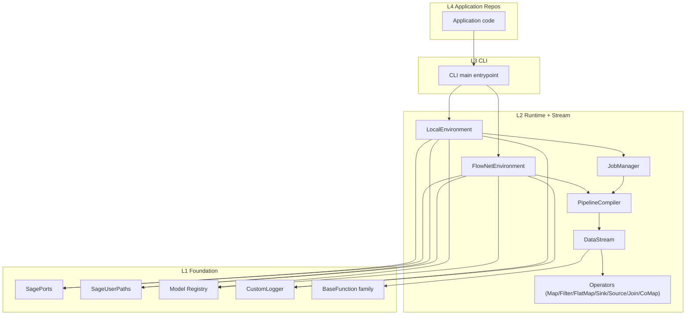
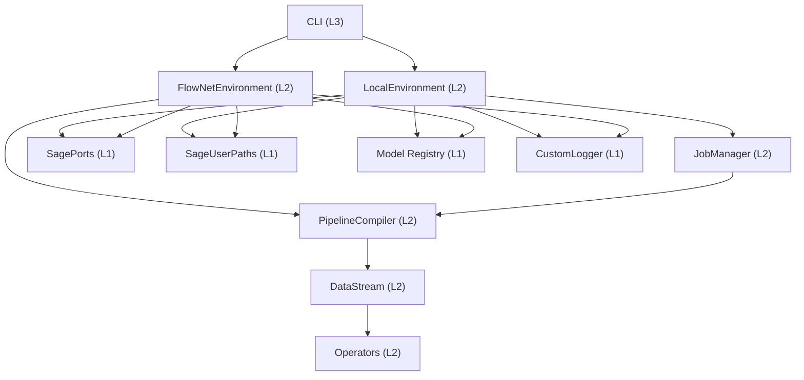
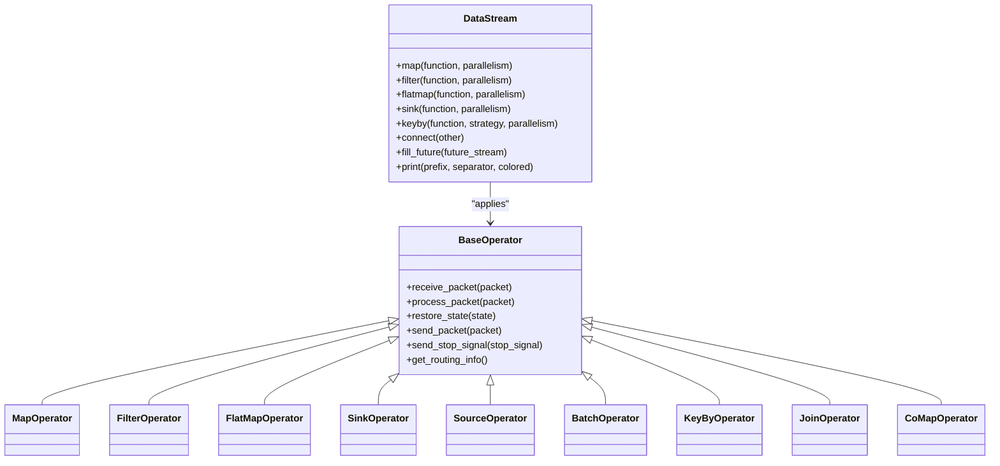
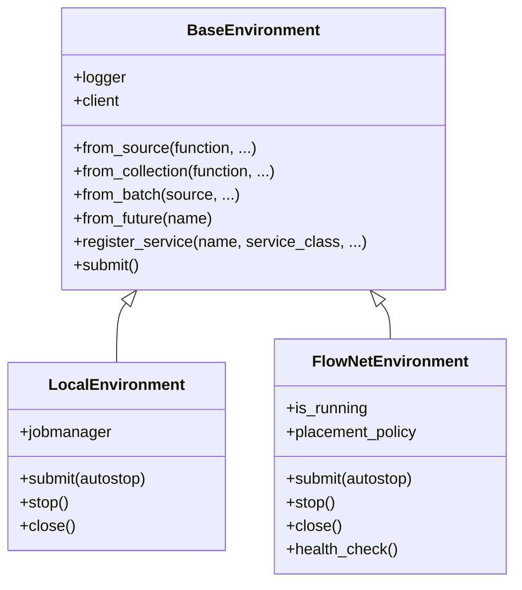
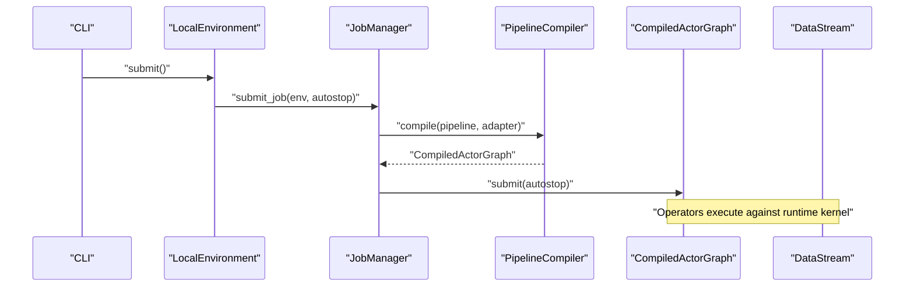
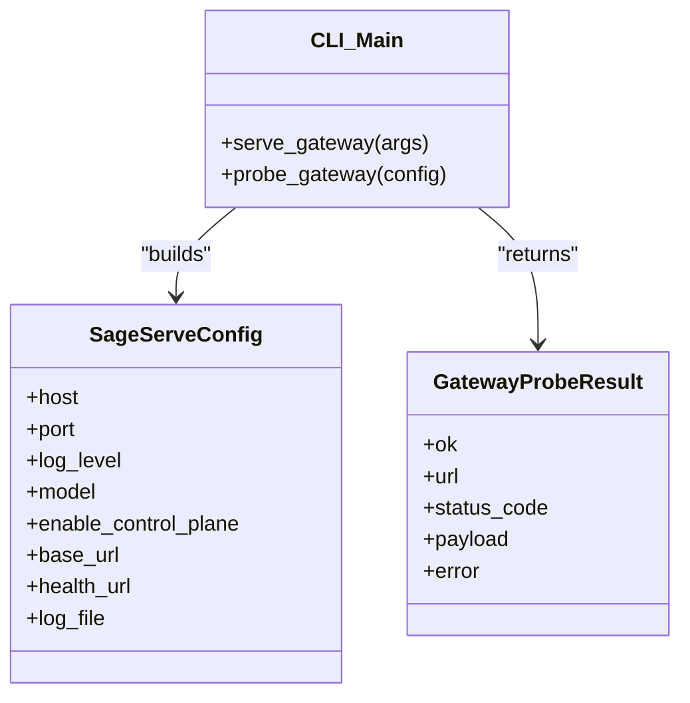
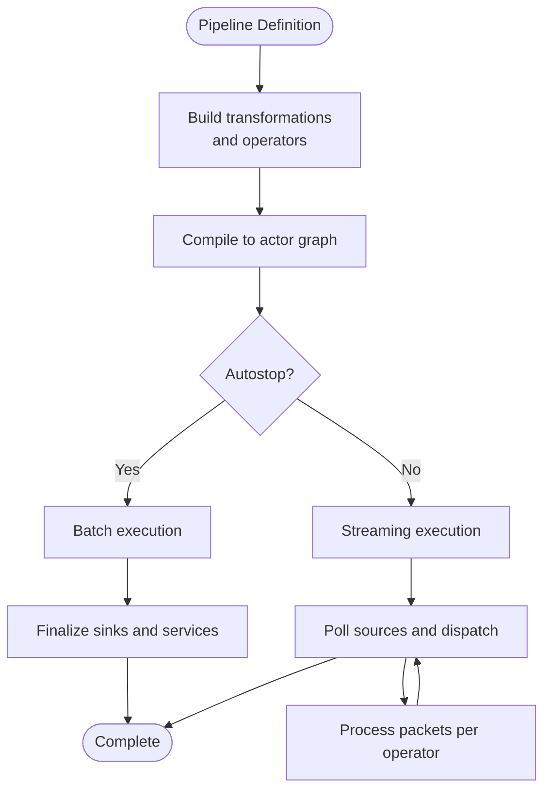
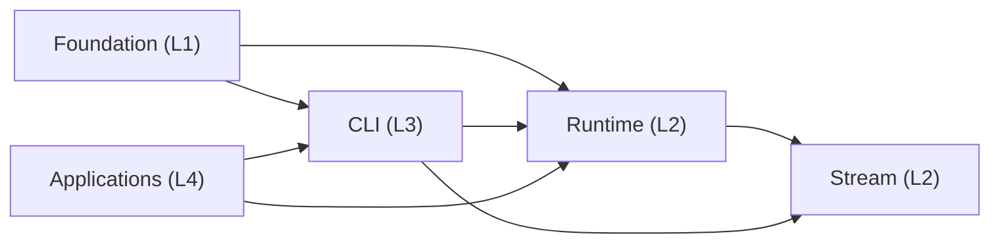

# Architecture Overview

<cite>
**Referenced Files in This Document**
- [src/sage/foundation/__init__.py](file://src/sage/foundation/__init__.py)
- [src/sage/foundation/core.py](file://src/sage/foundation/core.py)
- [src/sage/foundation/config/ports.py](file://src/sage/foundation/config/ports.py)
- [src/sage/foundation/config/user_paths.py](file://src/sage/foundation/config/user_paths.py)
- [src/sage/foundation/model_registry/sagellm_registry.py](file://src/sage/foundation/model_registry/sagellm_registry.py)
- [src/sage/stream/__init__.py](file://src/sage/stream/__init__.py)
- [src/sage/stream/datastream.py](file://src/sage/stream/datastream.py)
- [src/sage/stream/operators.py](file://src/sage/stream/operators.py)
- [src/sage/stream/_kernel_bindings.py](file://src/sage/stream/_kernel_bindings.py)
- [src/sage/runtime/__init__.py](file://src/sage/runtime/__init__.py)
- [src/sage/runtime/base_environment.py](file://src/sage/runtime/base_environment.py)
- [src/sage/runtime/environments.py](file://src/sage/runtime/environments.py)
- [src/sage/runtime/job_manager.py](file://src/sage/runtime/job_manager.py)
- [src/sage/runtime/pipeline_compiler.py](file://src/sage/runtime/pipeline_compiler.py)
- [src/sage/runtime/local_backend.py](file://src/sage/runtime/local_backend.py)
- [src/sage/cli/main.py](file://src/sage/cli/main.py)
- [src/sage/serving/gateway.py](file://src/sage/serving/gateway.py)
</cite>

## Table of Contents
1. [Introduction](#introduction)
2. [Project Structure](#project-structure)
3. [Core Components](#core-components)
4. [Architecture Overview](#architecture-overview)
5. [Detailed Component Analysis](#detailed-component-analysis)
6. [Dependency Analysis](#dependency-analysis)
7. [Performance Considerations](#performance-considerations)
8. [Troubleshooting Guide](#troubleshooting-guide)
9. [Conclusion](#conclusion)

## Introduction
This document describes the SAGE framework’s four-tier workspace architecture (L1–L4) and its core design principles. The framework has evolved from a broad application collection to a sharp center focused on stream-first execution, runtime orchestration, serving integration, and operational foundations. The current baseline architecture is:
- L4: Application repos (optional)
- L3: sage.cli
- L2: sage.runtime + sage.stream
- L1: sage.foundation

The target product convergence is toward an SAGE Inference Service System with:
- L3 Interface: CLI + OpenAI-compatible service entry + external integration surface
- L2 Runtime: LocalEnvironment + DataStream + JobManager + scheduler + execution services
- Optional Distributed: FlowNetEnvironment
- L1 Foundation: config + ports + user paths + model registry + logging

The stream-first approach treats DataFlow as the primary abstraction, not an afterthought. Operators and DataStream define the execution model, while environments and schedulers provide the runtime orchestration surface.

## Project Structure
The repository is organized by layers and capabilities:
- L1 (Foundation): configuration, user paths, model registry, logging, and core function contracts
- L2 (Runtime + Stream): environments, job orchestration, pipeline compilation, operators, and stream abstractions
- L3 (CLI): command-line entrypoint and subcommands
- L4 (Serving): gateway configuration and integration helpers for external inference services

**Diagram sources**
- [src/sage/cli/main.py:1-204](file://src/sage/cli/main.py#L1-L204)
- [src/sage/runtime/environments.py:1-224](file://src/sage/runtime/environments.py#L1-L224)
- [src/sage/runtime/job_manager.py:1-224](file://src/sage/runtime/job_manager.py#L1-L224)
- [src/sage/runtime/pipeline_compiler.py:1-800](file://src/sage/runtime/pipeline_compiler.py#L1-L800)
- [src/sage/stream/datastream.py:1-182](file://src/sage/stream/datastream.py#L1-L182)
- [src/sage/stream/operators.py:1-526](file://src/sage/stream/operators.py#L1-L526)
- [src/sage/foundation/config/ports.py:1-199](file://src/sage/foundation/config/ports.py#L1-L199)
- [src/sage/foundation/config/user_paths.py:1-195](file://src/sage/foundation/config/user_paths.py#L1-L195)
- [src/sage/foundation/model_registry/sagellm_registry.py:1-297](file://src/sage/foundation/model_registry/sagellm_registry.py#L1-L297)
- [src/sage/foundation/core.py:1-335](file://src/sage/foundation/core.py#L1-L335)

**Section sources**
- [src/sage/cli/main.py:1-204](file://src/sage/cli/main.py#L1-L204)
- [src/sage/runtime/environments.py:1-224](file://src/sage/runtime/environments.py#L1-L224)
- [src/sage/runtime/job_manager.py:1-224](file://src/sage/runtime/job_manager.py#L1-L224)
- [src/sage/runtime/pipeline_compiler.py:1-800](file://src/sage/runtime/pipeline_compiler.py#L1-L800)
- [src/sage/stream/datastream.py:1-182](file://src/sage/stream/datastream.py#L1-L182)
- [src/sage/stream/operators.py:1-526](file://src/sage/stream/operators.py#L1-L526)
- [src/sage/foundation/config/ports.py:1-199](file://src/sage/foundation/config/ports.py#L1-L199)
- [src/sage/foundation/config/user_paths.py:1-195](file://src/sage/foundation/config/user_paths.py#L1-L195)
- [src/sage/foundation/model_registry/sagellm_registry.py:1-297](file://src/sage/foundation/model_registry/sagellm_registry.py#L1-L297)
- [src/sage/foundation/core.py:1-335](file://src/sage/foundation/core.py#L1-L335)

## Core Components
- L1 Foundation
  - Configuration and ports: centralized port assignments and diagnostics
  - User paths: XDG-compliant directories for config, data, state, cache
  - Model registry: local model lifecycle management for external engines
  - Logging: structured logging primitives
  - Core function contracts: operator function base classes and lambda wrappers
- L2 Runtime + Stream
  - Environments: LocalEnvironment and FlowNetEnvironment for execution
  - JobManager: lightweight orchestration for local jobs
  - PipelineCompiler: transforms stream transformations into executable graphs
  - Operators: operator implementations for map/filter/flatmap/sink/source/join/comap
  - DataStream: stream abstraction with typed transformations
- L3 CLI
  - Command-line entrypoint with subcommands for status, doctor, runtime, serve, and verification
- L4 Serving
  - Gateway configuration and probing for external inference service integration

**Section sources**
- [src/sage/foundation/config/ports.py:1-199](file://src/sage/foundation/config/ports.py#L1-L199)
- [src/sage/foundation/config/user_paths.py:1-195](file://src/sage/foundation/config/user_paths.py#L1-L195)
- [src/sage/foundation/model_registry/sagellm_registry.py:1-297](file://src/sage/foundation/model_registry/sagellm_registry.py#L1-L297)
- [src/sage/foundation/core.py:1-335](file://src/sage/foundation/core.py#L1-L335)
- [src/sage/runtime/environments.py:1-224](file://src/sage/runtime/environments.py#L1-L224)
- [src/sage/runtime/job_manager.py:1-224](file://src/sage/runtime/job_manager.py#L1-L224)
- [src/sage/runtime/pipeline_compiler.py:1-800](file://src/sage/runtime/pipeline_compiler.py#L1-L800)
- [src/sage/stream/operators.py:1-526](file://src/sage/stream/operators.py#L1-L526)
- [src/sage/stream/datastream.py:1-182](file://src/sage/stream/datastream.py#L1-L182)
- [src/sage/cli/main.py:1-204](file://src/sage/cli/main.py#L1-L204)
- [src/sage/serving/gateway.py:1-168](file://src/sage/serving/gateway.py#L1-L168)

## Architecture Overview
The architecture follows a layered design:
- L1 Foundation provides stable primitives and cross-cutting concerns
- L2 Runtime + Stream encapsulates execution semantics and stream transformations
- L3 CLI offers the primary user entrypoint and integration surface
- L4 Application repos consume the system via CLI and APIs

**Diagram sources**
- [src/sage/cli/main.py:1-204](file://src/sage/cli/main.py#L1-L204)
- [src/sage/runtime/environments.py:1-224](file://src/sage/runtime/environments.py#L1-L224)
- [src/sage/runtime/job_manager.py:1-224](file://src/sage/runtime/job_manager.py#L1-L224)
- [src/sage/runtime/pipeline_compiler.py:1-800](file://src/sage/runtime/pipeline_compiler.py#L1-L800)
- [src/sage/stream/datastream.py:1-182](file://src/sage/stream/datastream.py#L1-L182)
- [src/sage/stream/operators.py:1-526](file://src/sage/stream/operators.py#L1-L526)
- [src/sage/foundation/config/ports.py:1-199](file://src/sage/foundation/config/ports.py#L1-L199)
- [src/sage/foundation/config/user_paths.py:1-195](file://src/sage/foundation/config/user_paths.py#L1-L195)
- [src/sage/foundation/model_registry/sagellm_registry.py:1-297](file://src/sage/foundation/model_registry/sagellm_registry.py#L1-L297)
- [src/sage/foundation/core.py:1-335](file://src/sage/foundation/core.py#L1-L335)

## Detailed Component Analysis

### Stream-First Abstraction: DataFlow and Operators
DataStream is the central abstraction. It builds a pipeline of transformations and applies operators that execute against a runtime kernel. Operators implement the operator pattern, encapsulating function execution and routing.

**Diagram sources**
- [src/sage/stream/datastream.py:1-182](file://src/sage/stream/datastream.py#L1-L182)
- [src/sage/stream/operators.py:1-526](file://src/sage/stream/operators.py#L1-L526)

**Section sources**
- [src/sage/stream/datastream.py:1-182](file://src/sage/stream/datastream.py#L1-L182)
- [src/sage/stream/operators.py:1-526](file://src/sage/stream/operators.py#L1-L526)

### Environments and Execution Surface
Environments encapsulate the execution surface. LocalEnvironment runs in-process; FlowNetEnvironment compiles and submits pipelines to a distributed runtime.

**Diagram sources**
- [src/sage/runtime/base_environment.py:1-269](file://src/sage/runtime/base_environment.py#L1-L269)
- [src/sage/runtime/environments.py:1-224](file://src/sage/runtime/environments.py#L1-L224)

**Section sources**
- [src/sage/runtime/base_environment.py:1-269](file://src/sage/runtime/base_environment.py#L1-L269)
- [src/sage/runtime/environments.py:1-224](file://src/sage/runtime/environments.py#L1-L224)

### Runtime Orchestration: JobManager and PipelineCompiler
JobManager manages local jobs, tracks status, and controls lifecycle. PipelineCompiler transforms the stream pipeline into an executable graph and schedules execution.

**Diagram sources**
- [src/sage/cli/main.py:1-204](file://src/sage/cli/main.py#L1-L204)
- [src/sage/runtime/environments.py:1-224](file://src/sage/runtime/environments.py#L1-L224)
- [src/sage/runtime/job_manager.py:1-224](file://src/sage/runtime/job_manager.py#L1-L224)
- [src/sage/runtime/pipeline_compiler.py:1-800](file://src/sage/runtime/pipeline_compiler.py#L1-L800)
- [src/sage/stream/datastream.py:1-182](file://src/sage/stream/datastream.py#L1-L182)

**Section sources**
- [src/sage/runtime/job_manager.py:1-224](file://src/sage/runtime/job_manager.py#L1-L224)
- [src/sage/runtime/pipeline_compiler.py:1-800](file://src/sage/runtime/pipeline_compiler.py#L1-L800)

### Serving Integration: Gateway and External Contracts
SageServeConfig defines the integration contract with an external inference service. The CLI exposes helpers to probe and print gateway configuration.

**Diagram sources**
- [src/sage/serving/gateway.py:1-168](file://src/sage/serving/gateway.py#L1-L168)
- [src/sage/cli/main.py:1-204](file://src/sage/cli/main.py#L1-L204)

**Section sources**
- [src/sage/serving/gateway.py:1-168](file://src/sage/serving/gateway.py#L1-L168)
- [src/sage/cli/main.py:1-204](file://src/sage/cli/main.py#L1-L204)

### Stream-First Algorithm Flow
The pipeline execution model is a flowchart of how DataStream transformations are compiled and executed.

**Diagram sources**
- [src/sage/runtime/pipeline_compiler.py:1-800](file://src/sage/runtime/pipeline_compiler.py#L1-L800)
- [src/sage/stream/datastream.py:1-182](file://src/sage/stream/datastream.py#L1-L182)

**Section sources**
- [src/sage/runtime/pipeline_compiler.py:1-800](file://src/sage/runtime/pipeline_compiler.py#L1-L800)
- [src/sage/stream/datastream.py:1-182](file://src/sage/stream/datastream.py#L1-L182)

## Dependency Analysis
The system exhibits strong layering:
- L1 Foundation is depended upon by L2 Runtime and L3 CLI
- L2 Runtime depends on L1 Foundation and L2 Stream
- L3 CLI depends on L1 Foundation, L2 Runtime, and L4 Serving
- L4 Application repos depend on L3 CLI and optionally L2 Runtime APIs

**Diagram sources**
- [src/sage/foundation/__init__.py:1-67](file://src/sage/foundation/__init__.py#L1-L67)
- [src/sage/runtime/__init__.py:1-71](file://src/sage/runtime/__init__.py#L1-L71)
- [src/sage/stream/__init__.py:1-7](file://src/sage/stream/__init__.py#L1-L7)
- [src/sage/cli/main.py:1-204](file://src/sage/cli/main.py#L1-L204)

**Section sources**
- [src/sage/foundation/__init__.py:1-67](file://src/sage/foundation/__init__.py#L1-L67)
- [src/sage/runtime/__init__.py:1-71](file://src/sage/runtime/__init__.py#L1-L71)
- [src/sage/stream/__init__.py:1-7](file://src/sage/stream/__init__.py#L1-L7)
- [src/sage/cli/main.py:1-204](file://src/sage/cli/main.py#L1-L204)

## Performance Considerations
- Parallelism and partitioning: transformations support explicit parallelism; operators select replicas and apply partitioning strategies
- Lightweight service runtime: cooperative service invocation with futures and progress callbacks
- Streaming vs batch: batch mode minimizes overhead for finite datasets; streaming mode scales for continuous workloads
- Local backend: thread-pool executor for in-process execution; consider resource limits and contention

[No sources needed since this section provides general guidance]

## Troubleshooting Guide
- CLI status and doctor: use CLI commands to verify environment health and gateway availability
- Port diagnostics: use centralized port utilities to check availability and listening status
- Model registry: ensure models are present and accessible; leverage registry helpers for lifecycle management
- Job lifecycle: inspect JobManager status and handle stop signals for graceful termination

**Section sources**
- [src/sage/cli/main.py:1-204](file://src/sage/cli/main.py#L1-L204)
- [src/sage/foundation/config/ports.py:1-199](file://src/sage/foundation/config/ports.py#L1-L199)
- [src/sage/foundation/model_registry/sagellm_registry.py:1-297](file://src/sage/foundation/model_registry/sagellm_registry.py#L1-L297)
- [src/sage/runtime/job_manager.py:1-224](file://src/sage/runtime/job_manager.py#L1-L224)

## Conclusion
SAGE’s architecture centers on a stream-first design with robust foundations in configuration, user paths, and model registry. The runtime and stream layers provide a flexible execution surface, while the CLI and serving integration offer practical entrypoints and external compatibility. The layered design enables incremental adoption, from local development to distributed execution, with clear separation of concerns across L1–L4.