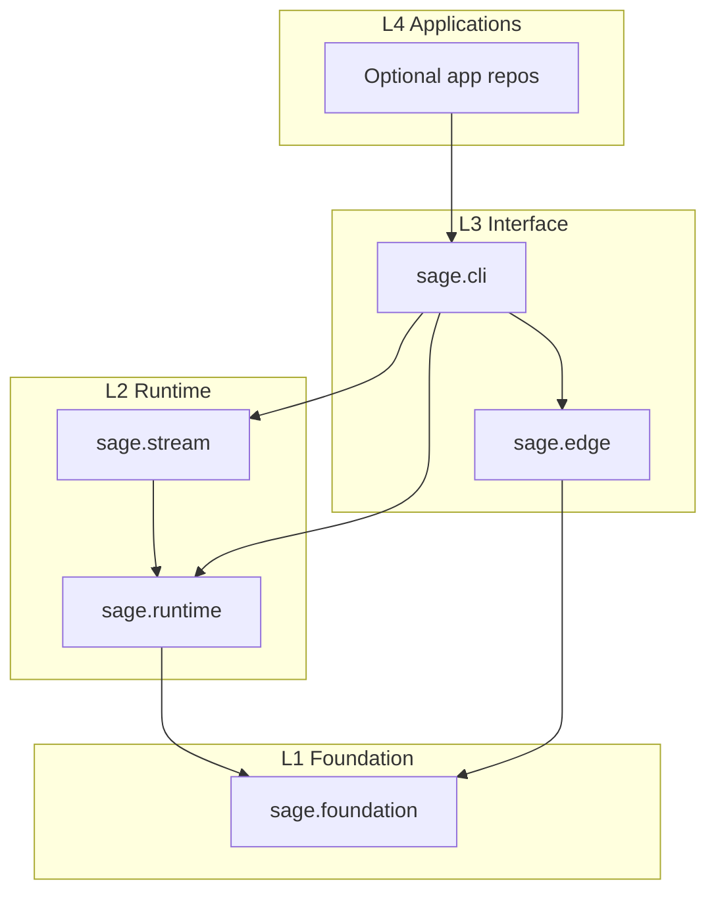
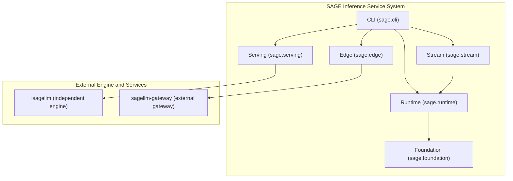
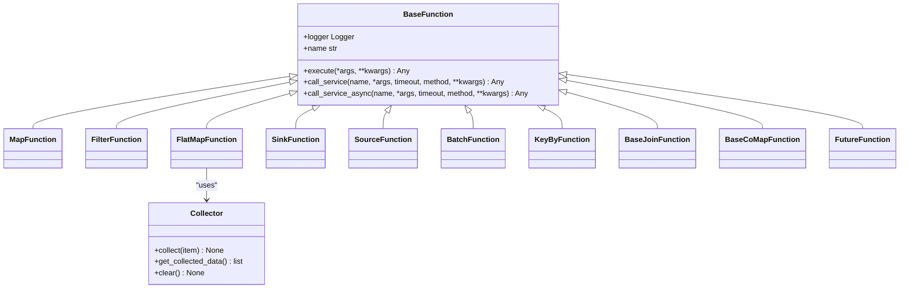
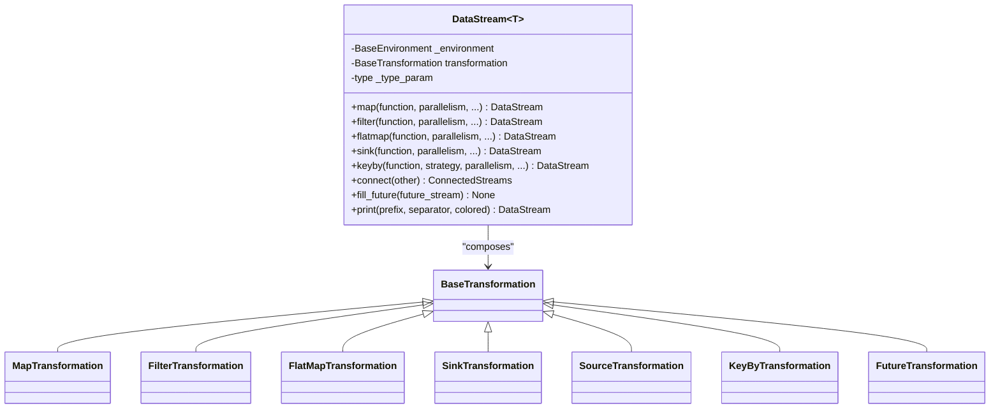
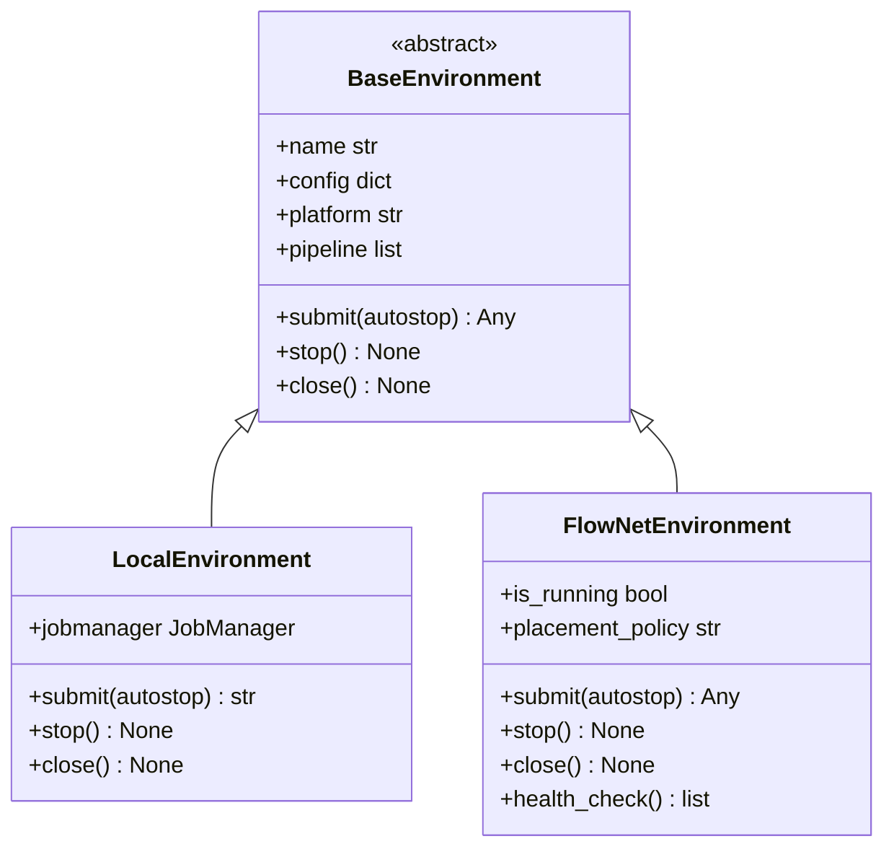
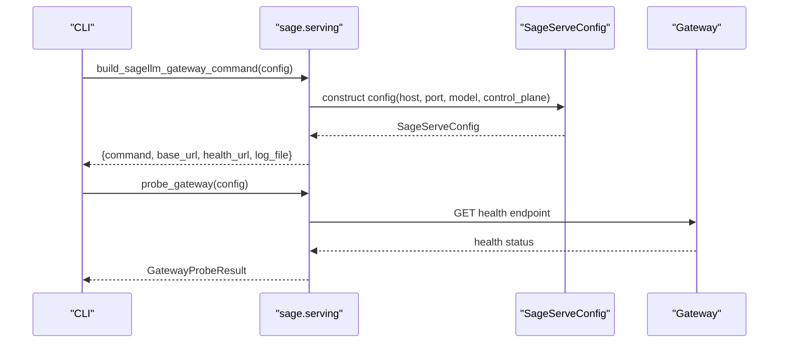
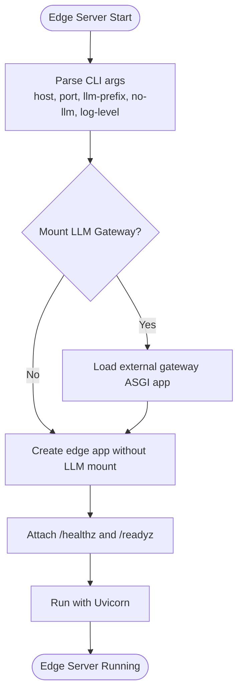
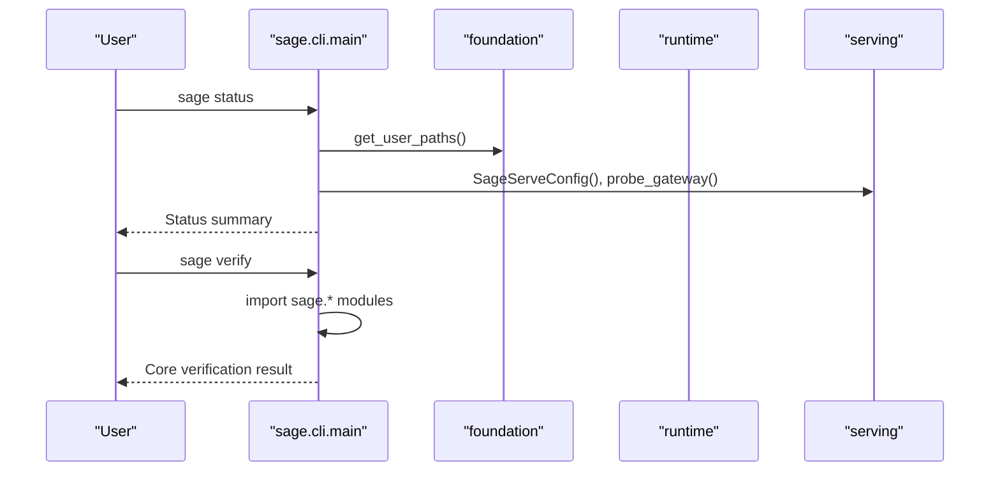
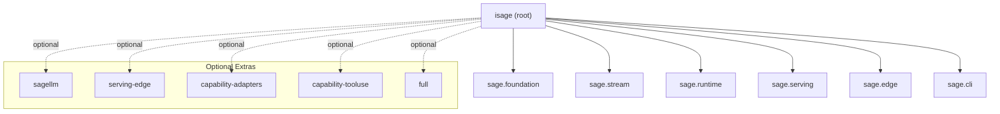

# Ecosystem Overview

<cite>
**Referenced Files in This Document**
- [README.md](file://README.md)
- [pyproject.toml](file://pyproject.toml)
- [src/sage/foundation/__init__.py](file://src/sage/foundation/__init__.py)
- [src/sage/stream/__init__.py](file://src/sage/stream/__init__.py)
- [src/sage/runtime/__init__.py](file://src/sage/runtime/__init__.py)
- [src/sage/serving/__init__.py](file://src/sage/serving/__init__.py)
- [src/sage/edge/__init__.py](file://src/sage/edge/__init__.py)
- [src/sage/cli/__init__.py](file://src/sage/cli/__init__.py)
- [src/sage/cli/main.py](file://src/sage/cli/main.py)
- [src/sage/edge/app.py](file://src/sage/edge/app.py)
- [src/sage/edge/server.py](file://src/sage/edge/server.py)
- [src/sage/foundation/core.py](file://src/sage/foundation/core.py)
- [src/sage/stream/datastream.py](file://src/sage/stream/datastream.py)
- [src/sage/runtime/environments.py](file://src/sage/runtime/environments.py)
</cite>

## Table of Contents
1. [Introduction](#introduction)
2. [Project Structure](#project-structure)
3. [Core Components](#core-components)
4. [Architecture Overview](#architecture-overview)
5. [Detailed Component Analysis](#detailed-component-analysis)
6. [Dependency Analysis](#dependency-analysis)
7. [Performance Considerations](#performance-considerations)
8. [Troubleshooting Guide](#troubleshooting-guide)
9. [Conclusion](#conclusion)
10. [Appendices](#appendices)

## Introduction
This document provides a comprehensive ecosystem overview of the SAGE framework, focusing on the in-tree core packages and their relationships, the external engine and service boundary, optional adapters, and related repositories. It consolidates the current package contract alignment, highlights historical split repos and their treatment as migration or retirement targets, and presents CI status, PyPI packages, and categorized listings for ecosystem transparency.

Key ecosystem pillars:
- In-tree core: sage.foundation, sage.stream, sage.runtime, sage.serving, sage.edge, sage.cli
- External engine and service boundary: isagellm (independent inference engine), sagellm-gateway (external gateway service)
- Optional adapters: isage-rag, isage-neuromem, isage-libs-intent, isage-sias, isage-data
- Related repositories: sage-tutorials, sage-studio, sage-docs

**Section sources**
- [README.md: 22-53:22-53](file://README.md#L22-L53)
- [README.md: 380-414:380-414](file://README.md#L380-L414)
- [pyproject.toml: 32-65:32-65](file://pyproject.toml#L32-L65)

## Project Structure
The SAGE repository organizes its codebase into layered packages aligned with a 4-tier workspace architecture:
- L4: Application repos (optional)
- L3: CLI surface (sage.cli)
- L2: Runtime and streaming (sage.runtime, sage.stream)
- L1: Foundation (sage.foundation)
- Optional: Edge aggregation (sage.edge)

The main-repo surface emphasizes a sharp center: stream + runtime + serving + operations, with distributed execution available as an optional scale-out mode.

**Diagram sources**
- [README.md: 160-192:160-192](file://README.md#L160-L192)
- [src/sage/cli/main.py: 23-54:23-54](file://src/sage/cli/main.py#L23-L54)
- [src/sage/stream/__init__.py: 1-7:1-7](file://src/sage/stream/__init__.py#L1-L7)
- [src/sage/runtime/__init__.py: 1-71:1-71](file://src/sage/runtime/__init__.py#L1-L71)
- [src/sage/foundation/__init__.py: 1-67:1-67](file://src/sage/foundation/__init__.py#L1-L67)
- [src/sage/edge/__init__.py: 1-10:1-10](file://src/sage/edge/__init__.py#L1-L10)

**Section sources**
- [README.md: 160-192:160-192](file://README.md#L160-L192)

## Core Components
This section documents the six in-tree core packages and their responsibilities within the SAGE ecosystem.

- sage.foundation
  - Provides low-churn, high-value building blocks: function contracts, logging, debug sinks, and model registry.
  - Exposes foundational primitives for stream and runtime layers.

- sage.stream
  - Stream-first public API centered on DataStream and ConnectedStreams.
  - Declarative pipeline composition and operator semantics.

- sage.runtime
  - Execution surface for turning declarative flows into runnable jobs.
  - Environments (LocalEnvironment, FlowNetEnvironment), schedulers, services, and job orchestration.

- sage.serving
  - Integration boundary for external inference engines and gateway services.
  - Standardizes how SAGE integrates with isagellm and gateway contracts.

- sage.edge
  - Edge aggregation shell for mounting and exposing gateway applications.
  - Optional FastAPI-based edge server and app factory.

- sage.cli
  - Lightweight CLI entrypoint for status, verification, runtime inspection, and serving helpers.
  - Loads external CLI plugins via entry points.

**Section sources**
- [src/sage/foundation/__init__.py: 1-67:1-67](file://src/sage/foundation/__init__.py#L1-L67)
- [src/sage/stream/__init__.py: 1-7:1-7](file://src/sage/stream/__init__.py#L1-L7)
- [src/sage/runtime/__init__.py: 1-71:1-71](file://src/sage/runtime/__init__.py#L1-L71)
- [src/sage/serving/__init__.py: 1-89:1-89](file://src/sage/serving/__init__.py#L1-L89)
- [src/sage/edge/__init__.py: 1-10:1-10](file://src/sage/edge/__init__.py#L1-L10)
- [src/sage/cli/__init__.py: 1-6:1-6](file://src/sage/cli/__init__.py#L1-L6)

## Architecture Overview
The SAGE architecture centers on a stream-first inference service system with a clear separation between the core runtime and external engine/service boundaries.

**Diagram sources**
- [README.md: 180-192:180-192](file://README.md#L180-L192)
- [src/sage/cli/main.py: 12-20:12-20](file://src/sage/cli/main.py#L12-L20)
- [src/sage/serving/__init__.py: 8-18:8-18](file://src/sage/serving/__init__.py#L8-L18)
- [src/sage/edge/server.py: 13-17:13-17](file://src/sage/edge/server.py#L13-L17)

## Detailed Component Analysis

### Function Contracts and Primitives (sage.foundation)
The foundation package defines the minimal base classes and primitives used across stream and runtime layers. These include:
- BaseFunction and derived types (MapFunction, FilterFunction, FlatMapFunction, SinkFunction, SourceFunction, BatchFunction, KeyByFunction, BaseJoinFunction, BaseCoMapFunction, FutureFunction)
- Utilities for wrapping lambdas into function classes
- Logging and debug sinks
- Model registry operations

**Diagram sources**
- [src/sage/foundation/core.py: 16-334:16-334](file://src/sage/foundation/core.py#L16-L334)

**Section sources**
- [src/sage/foundation/core.py: 1-335:1-335](file://src/sage/foundation/core.py#L1-L335)
- [src/sage/foundation/__init__.py: 8-36:8-36](file://src/sage/foundation/__init__.py#L8-L36)

### Stream Abstraction (sage.stream)
DataStream is the primary abstraction for composing pipelines declaratively. Operators include map, filter, flatmap, sink, keyby, and connect. Parallelism semantics are honored for non-source operators in LocalEnvironment and compiled into FlowNet actor replicas.

**Diagram sources**
- [src/sage/stream/datastream.py: 26-182:26-182](file://src/sage/stream/datastream.py#L26-L182)

**Section sources**
- [src/sage/stream/datastream.py: 1-182:1-182](file://src/sage/stream/datastream.py#L1-L182)
- [src/sage/stream/__init__.py: 3-6:3-6](file://src/sage/stream/__init__.py#L3-L6)

### Runtime Environments (sage.runtime)
The runtime provides execution environments and orchestration:
- LocalEnvironment: local execution, job submission, stop/close lifecycle, and node listing
- FlowNetEnvironment: optional distributed execution via FlowNet, compilation, and streaming handle management

**Diagram sources**
- [src/sage/runtime/environments.py: 18-223:18-223](file://src/sage/runtime/environments.py#L18-L223)

**Section sources**
- [src/sage/runtime/environments.py: 1-224:1-224](file://src/sage/runtime/environments.py#L1-L224)
- [src/sage/runtime/__init__.py: 14-44:14-44](file://src/sage/runtime/__init__.py#L14-L44)

### Serving Integration (sage.serving)
SAGE integrates with the independent isagellm engine family through standardized gateway contracts:
- Gateway configuration and probing
- Build command for launching isagellm gateway
- Workflow integration contracts and extension points
- Model lifecycle helpers

**Diagram sources**
- [src/sage/cli/main.py: 127-153:127-153](file://src/sage/cli/main.py#L127-L153)
- [src/sage/serving/__init__.py: 8-18:8-18](file://src/sage/serving/__init__.py#L8-L18)

**Section sources**
- [src/sage/serving/__init__.py: 1-89:1-89](file://src/sage/serving/__init__.py#L1-L89)
- [src/sage/cli/main.py: 127-153:127-153](file://src/sage/cli/main.py#L127-L153)

### Edge Aggregation (sage.edge)
The edge package provides an optional FastAPI-based aggregation shell:
- create_app: builds an edge app with optional LLM gateway mounting and health/ready endpoints
- server: loads external gateway ASGI app and runs with Uvicorn

**Diagram sources**
- [src/sage/edge/server.py: 52-103:52-103](file://src/sage/edge/server.py#L52-L103)
- [src/sage/edge/app.py: 39-65:39-65](file://src/sage/edge/app.py#L39-L65)

**Section sources**
- [src/sage/edge/server.py: 1-108:1-108](file://src/sage/edge/server.py#L1-L108)
- [src/sage/edge/app.py: 1-66:1-66](file://src/sage/edge/app.py#L1-L66)
- [src/sage/edge/__init__.py: 1-10:1-10](file://src/sage/edge/__init__.py#L1-L10)

### CLI Surface (sage.cli)
The CLI provides a small, focused surface around the core product boundary:
- version, status, doctor, verify
- runtime nodes
- serve gateway (print or probe gateway contract)
- chat and index ingestion helpers

**Diagram sources**
- [src/sage/cli/main.py: 69-98:69-98](file://src/sage/cli/main.py#L69-L98)
- [src/sage/cli/main.py: 156-169:156-169](file://src/sage/cli/main.py#L156-L169)

**Section sources**
- [src/sage/cli/main.py: 1-204:1-204](file://src/sage/cli/main.py#L1-L204)
- [src/sage/cli/__init__.py: 1-6:1-6](file://src/sage/cli/__init__.py#L1-L6)

## Dependency Analysis
The ecosystem’s dependency model separates the core SAGE packages from external capabilities:
- Root package is isage (PyPI) with in-tree core packages exposed as submodules
- Optional extras define integration boundaries:
  - sagellm: external inference engine integration
  - serving-edge: in-tree edge aggregation shell
  - capability-adapters: intent, RAG, and memory adapters
  - capability-tooluse: SIAS tool-use adapter
  - full: includes edge shell, adapters, and dataset package

**Diagram sources**
- [pyproject.toml: 32-65:32-65](file://pyproject.toml#L32-L65)

**Section sources**
- [pyproject.toml: 32-65:32-65](file://pyproject.toml#L32-L65)

## Performance Considerations
- LocalEnvironment honors transformation parallelism for non-source operators, enabling in-process worker replicas and stable keyed routing.
- FlowNetEnvironment compiles the same parallelism hints into FlowNet actor replica counts, ensuring consistent semantics across local and distributed modes.
- Edge server uses Uvicorn for efficient ASGI hosting and health/ready endpoints for observability.

[No sources needed since this section provides general guidance]

## Troubleshooting Guide
Common diagnostics and checks:
- Environment diagnostics: doctor
- Core surface verification: verify
- Runtime node listing: runtime nodes
- Gateway health probing: serve gateway --probe
- Chat connectivity: chat

Operational tips:
- Use environment variables to override edge gateway app specs and binding parameters.
- Ensure optional extras are installed according to the chosen integration profile.

**Section sources**
- [src/sage/cli/main.py: 88-98:88-98](file://src/sage/cli/main.py#L88-L98)
- [src/sage/cli/main.py: 156-169:156-169](file://src/sage/cli/main.py#L156-L169)
- [src/sage/cli/main.py: 187-190:187-190](file://src/sage/cli/main.py#L187-L190)
- [src/sage/edge/server.py: 20-49:20-49](file://src/sage/edge/server.py#L20-L49)

## Conclusion
The SAGE ecosystem is consolidated around a sharp core of stream, runtime, serving, and operations, with clear boundaries to external inference engines and optional adapters. Historical split repos are treated as migration or retirement targets, while the main repository maintains the preferred product surface. Optional extras enable flexible integrations without bloating the default install, and related repositories (tutorials, studio, docs) support learning, application/UI, and documentation needs respectively.

[No sources needed since this section summarizes without analyzing specific files]

## Appendices

### Ecosystem Categorization and Package Contract Alignment
- In-tree core packages: sage.foundation, sage.stream, sage.runtime, sage.serving, sage.edge, sage.cli
- External engine and service boundary: isagellm, sagellm-gateway
- Optional adapters: isage-rag, isage-neuromem, isage-libs-intent, isage-sias, isage-data
- Related repositories: sage-tutorials, sage-studio, sage-docs

**Section sources**
- [README.md: 380-414:380-414](file://README.md#L380-L414)

### CI Status and PyPI Packages
- CI badges and links are provided in the repository README.
- PyPI package: isage
- Version and scripts are managed dynamically via setuptools and package metadata.

**Section sources**
- [README.md: 10-16:10-16](file://README.md#L10-L16)
- [README.md: 14](file://README.md#L14)
- [pyproject.toml: 6, 28-30, 96-97:6-6](file://pyproject.toml#L6-L6)
- [src/sage/_version.py](file://src/sage/_version.py)

### Installation and Extras Reference
- Default install includes in-tree core packages.
- Optional extras:
  - sagellm: external inference engine integration
  - serving-edge: edge aggregation shell
  - capability-adapters: intent, RAG, memory adapters
  - capability-tooluse: SIAS tool-use adapter
  - full: edge shell, adapters, and dataset package

**Section sources**
- [README.md: 227-266:227-266](file://README.md#L227-L266)
- [pyproject.toml: 32-65:32-65](file://pyproject.toml#L32-L65)