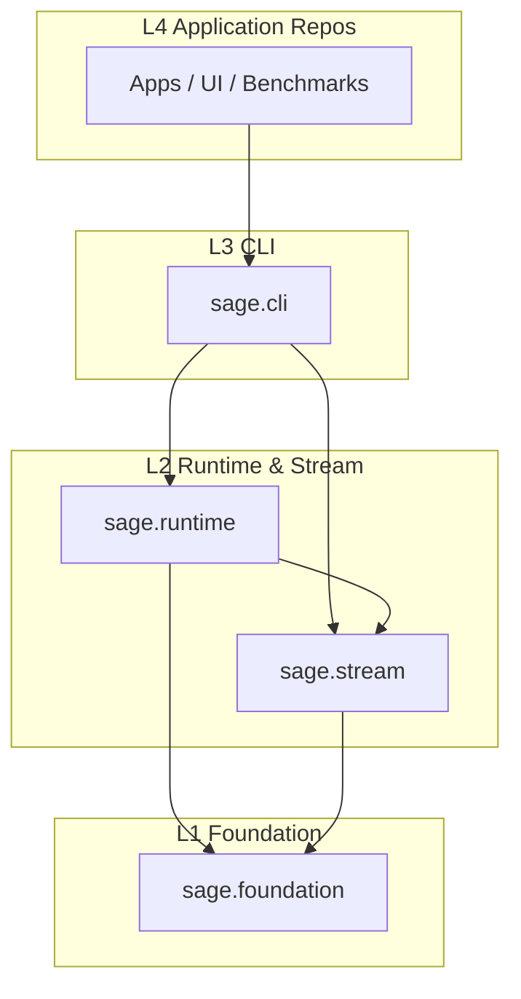
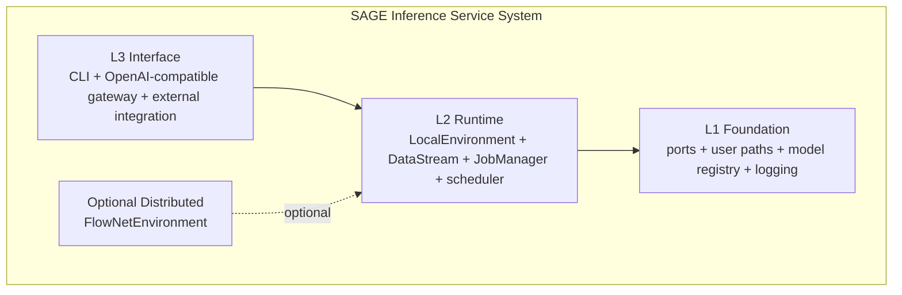
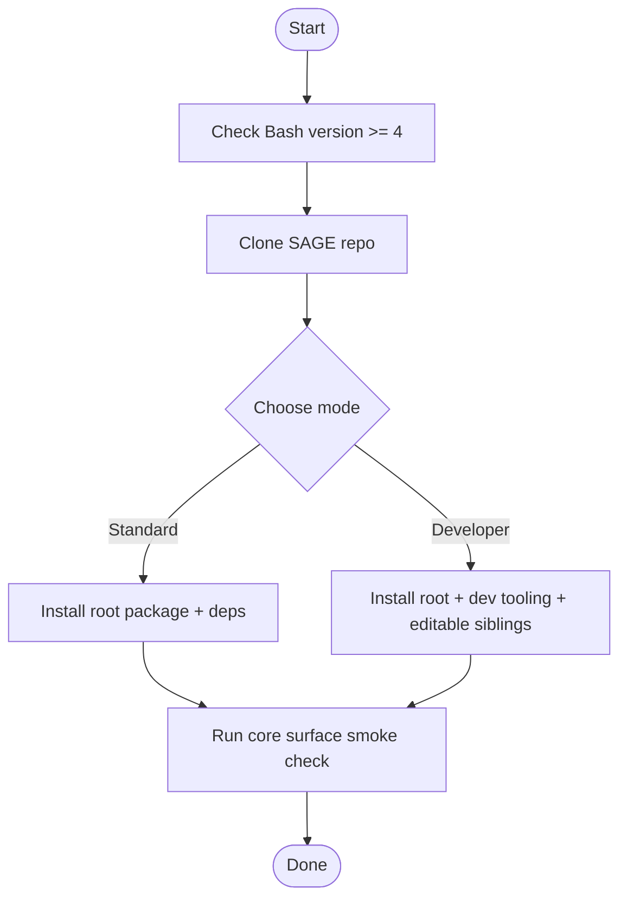
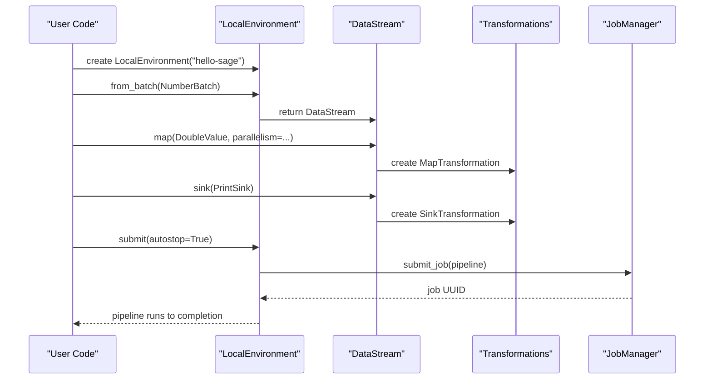
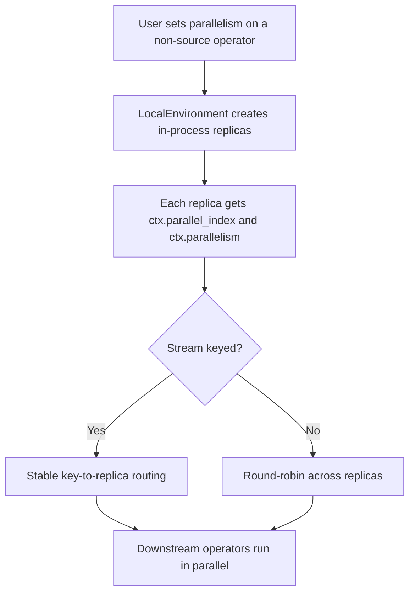
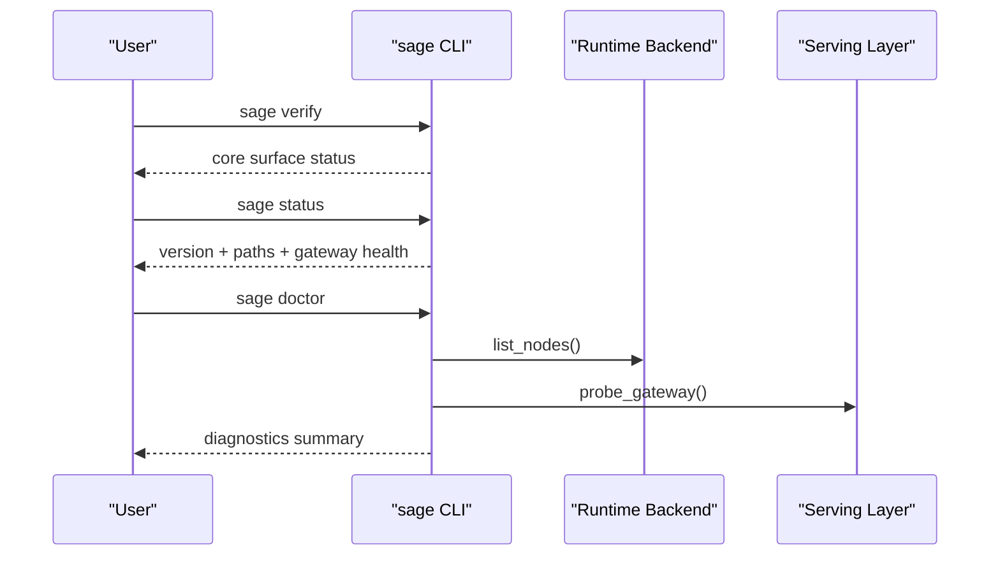
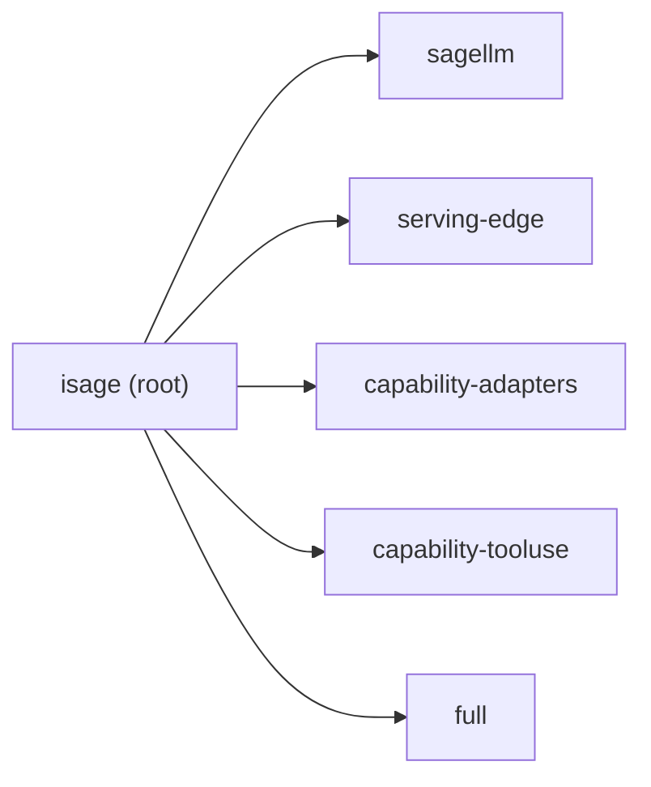

# Getting Started

<cite>
**Referenced Files in This Document**
- [README.md](file://README.md)
- [quickstart.sh](file://quickstart.sh)
- [pyproject.toml](file://pyproject.toml)
- [src/sage/foundation/__init__.py](file://src/sage/foundation/__init__.py)
- [src/sage/stream/__init__.py](file://src/sage/stream/__init__.py)
- [src/sage/runtime/environments.py](file://src/sage/runtime/environments.py)
- [src/sage/runtime/base_environment.py](file://src/sage/runtime/base_environment.py)
- [src/sage/stream/datastream.py](file://src/sage/stream/datastream.py)
- [src/sage/cli/main.py](file://src/sage/cli/main.py)
- [src/sage/serving/__init__.py](file://src/sage/serving/__init__.py)
</cite>

## Table of Contents
1. [Introduction](#introduction)
2. [Project Structure](#project-structure)
3. [Core Components](#core-components)
4. [Architecture Overview](#architecture-overview)
5. [Detailed Component Analysis](#detailed-component-analysis)
6. [Dependency Analysis](#dependency-analysis)
7. [Performance Considerations](#performance-considerations)
8. [Troubleshooting Guide](#troubleshooting-guide)
9. [Conclusion](#conclusion)
10. [Appendices](#appendices)

## Introduction
This guide helps you quickly onboard to the SAGE framework with a focus on the 2026 stream-first inference service system. You will learn the consolidated main-repo surface, the four-tier workspace architecture (L1–L4), step-by-step installation using quickstart.sh in both standard and developer modes, and how to run a minimal local pipeline. You will also understand runtime parallelism semantics and explore the current CLI quick reference and core verification steps.

## Project Structure
SAGE’s main repository consolidates the in-tree core into a sharp product surface:
- L1: sage.foundation (foundation primitives and configuration)
- L2: sage.stream + sage.runtime (streaming and runtime)
- L3: sage.cli (CLI entrypoint)
- L4: application repos (optional)

**Diagram sources**
- [README.md:160-199](file://README.md#L160-L199)

**Section sources**
- [README.md:160-199](file://README.md#L160-L199)

## Core Components
This section introduces the recommended main-repo surface and highlights key classes and modules you will use daily.

- From sage.foundation import:
  - BatchFunction, MapFunction, SinkFunction
  - SagePorts, SageUserPaths
- From sage.stream import:
  - DataStream
- From sage.runtime import:
  - LocalEnvironment, FlowNetEnvironment, JobManager
- From sage.serving import:
  - SageServeConfig, build_sagellm_gateway_command, probe_gateway

These components form the core of the stream-first inference service system and are the primary entry points for building pipelines and integrating serving.

**Section sources**
- [README.md:66-71](file://README.md#L66-L71)
- [src/sage/foundation/__init__.py:8-66](file://src/sage/foundation/__init__.py#L8-L66)
- [src/sage/stream/__init__.py:1-6](file://src/sage/stream/__init__.py#L1-L6)
- [src/sage/runtime/environments.py:18-223](file://src/sage/runtime/environments.py#L18-L223)
- [src/sage/serving/__init__.py:8-88](file://src/sage/serving/__init__.py#L8-L88)

## Architecture Overview
SAGE’s 2026 focus reset emphasizes a stream-first inference service system:
- Keep the stream core: DataStream and declarative composition
- Keep the execution core: LocalEnvironment, JobManager, scheduling, and runtime
- Keep the serving integration plane: OpenAI-compatible gateway access and control-plane contracts
- Keep distributed execution optional: FlowNetEnvironment remains optional
- Keep the operating substrate: centralized ports, XDG user paths, model registry, logs, health/status surfaces

**Diagram sources**
- [README.md:22-46](file://README.md#L22-L46)
- [README.md:180-192](file://README.md#L180-L192)

**Section sources**
- [README.md:22-46](file://README.md#L22-L46)
- [README.md:180-192](file://README.md#L180-L192)

## Detailed Component Analysis

### Installation with quickstart.sh
Follow these steps to install SAGE using the quickstart script in either standard or developer mode.

- Prerequisites
  - Bash 4+ (on macOS, install a modern Bash via Homebrew)
  - Modern terminal with 256-color support
- Modes
  - Standard: installs the root package and resolves external dependencies from PyPI
  - Developer: installs the same root package plus development tooling; switches sibling SAGE repos to editable installs when present in the workspace

Step-by-step:
1. Clone the repository and enter the directory
2. Run the quickstart script with your chosen mode and auto-confirm flag
3. Optionally configure HuggingFace credentials if network restrictions are detected
4. Verify installation using the core surface smoke check

**Diagram sources**
- [quickstart.sh:5-47](file://quickstart.sh#L5-L47)
- [quickstart.sh:320-546](file://quickstart.sh#L320-L546)
- [README.md:210-226](file://README.md#L210-L226)

**Section sources**
- [quickstart.sh:5-47](file://quickstart.sh#L5-L47)
- [quickstart.sh:320-546](file://quickstart.sh#L320-L546)
- [README.md:210-226](file://README.md#L210-L226)

### Minimal Local Pipeline Example
This example demonstrates a minimal local pipeline using LocalEnvironment with three operators: a batch source, a map, and a sink. It showcases the recommended main-repo surface and typical usage pattern.

- Operators used:
  - BatchFunction (NumberBatch)
  - MapFunction (DoubleValue)
  - SinkFunction (PrintSink)
- Environment:
  - LocalEnvironment
- Composition:
  - Build a pipeline by chaining from_batch → map → sink
  - Submit with autostop enabled

**Diagram sources**
- [README.md:88-121](file://README.md#L88-L121)
- [src/sage/runtime/environments.py:18-127](file://src/sage/runtime/environments.py#L18-L127)
- [src/sage/runtime/base_environment.py:147-269](file://src/sage/runtime/base_environment.py#L147-L269)
- [src/sage/stream/datastream.py:52-176](file://src/sage/stream/datastream.py#L52-L176)

**Section sources**
- [README.md:88-121](file://README.md#L88-L121)
- [src/sage/runtime/environments.py:18-127](file://src/sage/runtime/environments.py#L18-L127)
- [src/sage/runtime/base_environment.py:147-269](file://src/sage/runtime/base_environment.py#L147-L269)
- [src/sage/stream/datastream.py:52-176](file://src/sage/stream/datastream.py#L52-L176)

### Runtime Parallelism Semantics
LocalEnvironment honors transformation parallelism for non-source operators:
- Non-source transformations honor the parallelism hint by creating in-process worker replicas
- Each replica receives ctx.parallel_index and ctx.parallelism
- Keyed streams preserve key-to-replica stability; unkeyed streams use round-robin routing
- Source transformations are still polled locally in-process; parallelism applies to downstream replicas
- FlowNetEnvironment compiles the same parallelism hints into FlowNet actor replica counts, ensuring a consistent user-facing contract

**Diagram sources**
- [README.md:76-86](file://README.md#L76-L86)

**Section sources**
- [README.md:76-86](file://README.md#L76-L86)

### CLI Quick Reference and Core Verification
After installation, use these commands to verify your setup and explore the system:

- sage version
- sage status
- sage doctor
- sage verify
- sage runtime nodes
- sage serve gateway --json
- sage serve gateway --probe --json
- sage chat --ask "Hello, SAGE!"
- sage index ingest --source ./docs --index local-docs

Core verification steps:
- Run sage verify to smoke-check the in-tree core surface
- Run sage status to see local configuration and gateway health summary
- Run sage doctor for lightweight environment diagnostics
- Run sage runtime nodes to list runtime-visible nodes
- Use sage serve gateway to print or probe the gateway contract

**Diagram sources**
- [src/sage/cli/main.py:156-194](file://src/sage/cli/main.py#L156-L194)

**Section sources**
- [README.md:138-158](file://README.md#L138-L158)
- [src/sage/cli/main.py:156-194](file://src/sage/cli/main.py#L156-L194)

## Dependency Analysis
The main-repo surface and installation choices define the dependency footprint:

- Root package: isage
- Optional extras:
  - sagellm: external inference engine integration
  - serving-edge: in-tree edge shell runtime
  - capability-adapters: intent, RAG, memory adapters
  - capability-tooluse: tool-use adapter
  - full: all supported extras plus optional dataset package

**Diagram sources**
- [pyproject.toml:32-65](file://pyproject.toml#L32-L65)

**Section sources**
- [pyproject.toml:32-65](file://pyproject.toml#L32-L65)

## Performance Considerations
- Prefer setting parallelism on non-source operators to leverage in-process replicas
- Use keyed streams when stable partitioning across replicas is required
- Unkeyed streams rely on round-robin routing; consider keying for deterministic distribution
- FlowNetEnvironment mirrors the same parallelism semantics for distributed execution

[No sources needed since this section provides general guidance]

## Troubleshooting Guide
Common checks and remedies:
- Run sage doctor to diagnose environment and runtime backend availability
- Run sage verify to confirm the in-tree core surface imports
- Use sage status to inspect local configuration and gateway health
- If gateway probing fails, adjust host/port or model parameters and re-probe
- For installation issues, rerun quickstart.sh with --doctor to diagnose environment problems

**Section sources**
- [src/sage/cli/main.py:88-98](file://src/sage/cli/main.py#L88-L98)
- [src/sage/cli/main.py:156-169](file://src/sage/cli/main.py#L156-L169)
- [README.md:267-275](file://README.md#L267-L275)

## Conclusion
You have learned the 2026 stream-first focus, the four-tier workspace architecture, the recommended main-repo surface, and how to install and verify SAGE. You saw a minimal local pipeline and understood runtime parallelism semantics. Use the CLI quick reference and core verification steps to validate your setup and begin building production-grade streaming pipelines.

[No sources needed since this section summarizes without analyzing specific files]

## Appendices

### Appendix A: Recommended Main-Repo Surface
- from sage.foundation import BatchFunction, MapFunction, SinkFunction, SagePorts, SageUserPaths
- from sage.stream import DataStream
- from sage.runtime import LocalEnvironment, FlowNetEnvironment, JobManager
- from sage.serving import SageServeConfig, build_sagellm_gateway_command, probe_gateway

**Section sources**
- [README.md:66-71](file://README.md#L66-L71)

### Appendix B: Four-Tier Workspace Architecture (L1–L4)
- L4: application repos (optional)
- L3: sage.cli
- L2: sage.runtime + sage.stream
- L1: sage.foundation

**Section sources**
- [README.md:160-199](file://README.md#L160-L199)